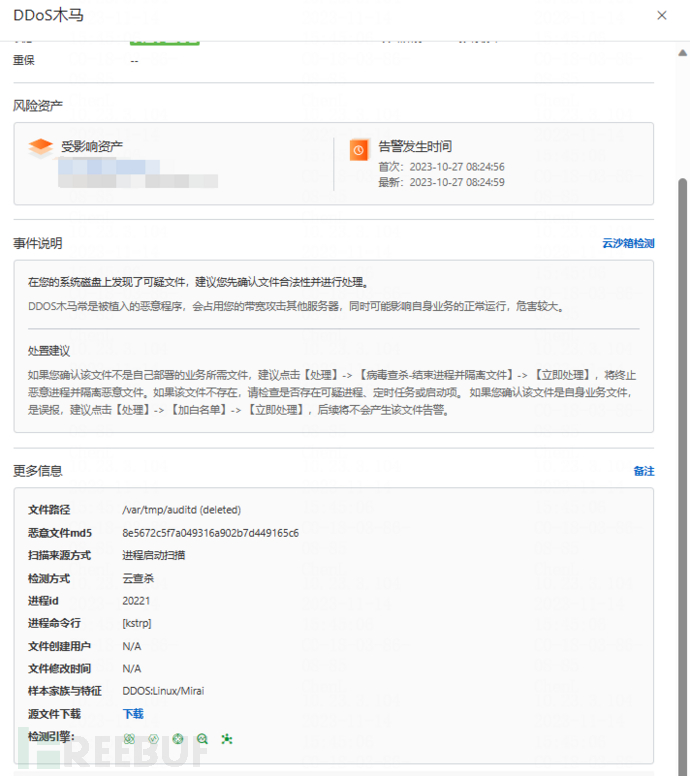
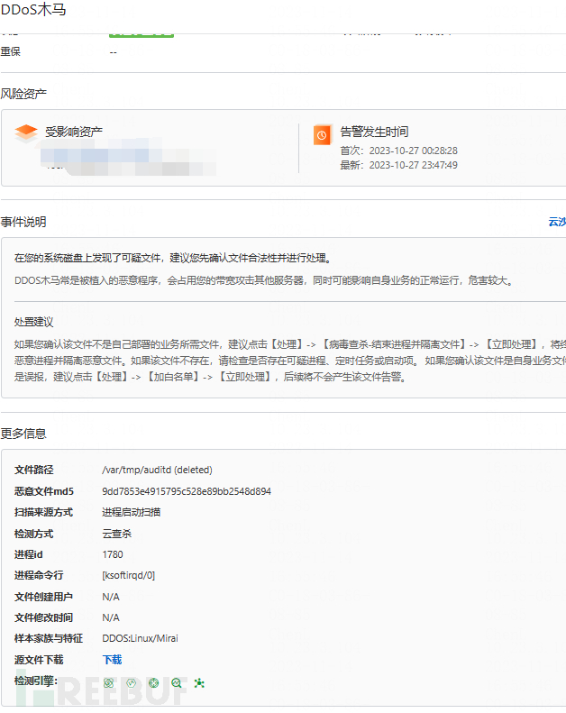
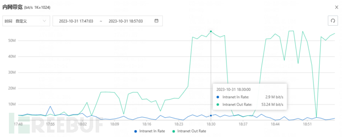
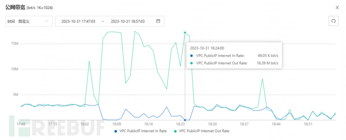
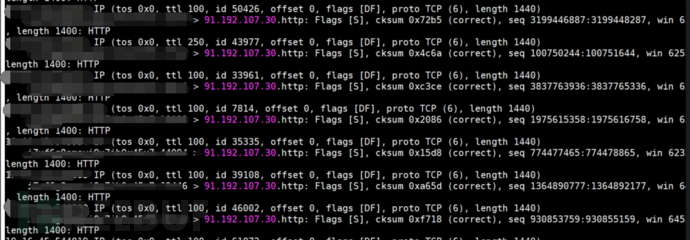

# CVE-2023-46604 AMQ RCE漏洞应急响应实录 - FreeBuf网络安全行业门户

CVE-2023-46604 AMQ RCE漏洞应急响应实录

## 一、事件背景

Apache ActiveMQ是最流行的开源、多协议、基于 Java 的消息代理。它支持行业标准协议，用户可以从多种语言和平台的客户端使用AMQP协议集成多平台应用程序。

2023年10月26日，Apache ActiveMQ官方发布新版本5.15.16，修复了一个远程代码执行漏洞，攻击者可构造恶意请求通过Apache ActiveMQ的61616端口发送恶意数据导致远程代码执行，从而完全控制Apache ActiveMQ服务器。

2023年10月27日，由于公司有外包开发系统存在该漏洞，服务器被攻击者入侵，我们安全部开始了应急响应和推动加固工作。

## 二、应急处置过程

### 2.1 10月27日

上班路上，收到飞书监控群安全告警，到公司后立马登录云安全中心控制台看到告警如下：

由于云安全中心没有提示【拦截成功】，且该云账号的云安全中心为免费版，我们认为攻击者大概率入侵成功，必须立刻启动应急响应。

### 2.1.1 入侵分析

1.  询问研发和运维人员系统情况，确认网站可以正常访问。
2.  搜集受攻击服务器相关信息，包括关联域名、IP、域名、端口，确定攻击入口。查看安全组，发现服务器都开放了8161和61616端口，百度后了解到这两个是AMQ的端口，其中8161是控制台web服务，61616是JAVA消息服务。
3.  搜索AMQ存在的漏洞，发现10月25日新出了一个Apache ActiveMQ 远程代码执行漏洞，只要AMQ版本低于5.15.16，攻击者就可以利用61616端口进行攻击。查看公司系统，发现AMQ版本是5.15.10，基本上可以判断这是攻击入口。
4.  与研发、运维确定加固方案，需要加白61616端口。由于该系统边缘端设备部署在客户工厂，边缘端设备已经封装公司的程序，程序需要访问AMQ 61616端口，客户出口不一定具备固定IP，因此只能按照官方公告升级AMQ服务端到5.15.16版本，实施升级需要协调外包软件开发商参与，需要时间比较长。
5.  由于业务不能停，61616端口不能关闭和加白，只能由安全部先清理木马，并且祈祷清理后不会再被攻击者入侵。

### 2.1.2 清理木马

-   登录服务器，未发现可疑账号

> cat /etc/passwd

-   检查定时任务，未发现可疑任务

> crontab -l

-   根据云安全中心的告警，查看/var/tmp目录，木马文件configs.conf、auditd、polkitd、atd都不存在，可能是木马自己删除自己以隐藏自身。使用find命令进行全盘搜索，发现存在configs.conf文件，使用rm -rf命令删除；使用stat对其余列出的文件逐一检查，未发现mtime或ctime为10月26日-27日的auditd、polkitd、atd文件

> ls -al /var/tmp
> 
> find / -name auditd
> 
> find / -name atd
> 
> find / -name polkitd
> 
> find / -name configs.conf
> 
> rm -rf /etc/selinux/configs.conf
> 
> rm -rf /usr/local/share/configs.conf

-   根据云安全中心的告警，检查恶意进程kstrp，使用readlink /proc/\[pid\]/exe命令，发现该进程指向木马文件/var/tmp/atd，确认是恶意进程，使用kill -9 \[pid\]逐一杀掉kstrp恶意进程

> \[root@ecs tmp\]# ps -ef | grep kstrp  
> root     16303     1  0 06:49 ?        00:00:00 \[kstrp\]  
> root     16304 16303  0 06:49 ?        00:00:00 \[kstrp\]  
> root     16305 16303  0 06:49 ?        00:00:00 \[kstrp\]  
> root     20583 19373  0 12:04 pts/3    00:00:00 grep --color=auto kstrp  
> \[root@ecs tmp\]# readlink /proc/16303/exe  
> /var/tmp/atd (deleted)
> 
> \[root@ecs tmp\]# kill -9 16303

杀掉kstrp进程后，观察一段时间未再出现。

### 2.1.3 第二次应急

本以为本次应急告一段落，结果晚上再次出现安全告警，需要再次进行应急：

-   重复白天的操作，杀掉所有kstrp进程，检查并删除所有找到的木马文件configs.conf、auditd、polkitd、atd
-   根据云安全中心告警，检查所有ksoftirqd/0进程。由于ksoftirqd/0是linux内核进程，因此必须使用readlink /proc/\[pid\]/exe来分辨出伪装的恶意进程，避免误杀

> \[root@ecs tmp\]# readlink /proc/21944/exe  
> /var/tmp/polkitd (deleted)  
> \[root@ecs tmp\]# ps -ef | grep 21944  
> root     21944 19411  0 20:46 ?        00:00:00 \[ksoftirqd/0\]  
> root     25284 22161  0 23:07 pts/0    00:00:00 grep --color=auto 21944
> 
> \[root@ecs tmp\]# kill -9 21944

执行上述清理操作后过2分钟再次弹出安全告警，发现服务器再次生成configs.conf文件以及ksoftirqd/0进程，怀疑守护进程未全部清理干净，再次进行检查，发现存在多个守护进程ksoftirqd/0

> \[root@ecs tmp\]# systemctl status 25480  
> ● session-21.scope - Session 21 of user root  
> Loaded: loaded  
> Drop-In: /run/systemd/system/session-21.scope.d  
> └─50-After-systemd-logind\\x2eservice.conf, 50-After-systemd-user-sessions\\x2eservice.conf, 50-Description.conf, 50-SendSIGHUP.conf, 50-Slice.conf, 50-TasksMax.conf  
> Active: active (abandoned) since Tue 2021-08-24 14:57:57 CST; 2 years 2 months ago  
> CGroup: /user.slice/user-0.slice/session-21.scope  
> ├─12556 /opt/jdk1.8/jre/bin/java -Xms64M -Xmx1G -Djava.util.logging.config.file=logging.properties -Djava.security.auth.login.config=/mnt/server/...  
> ├─12803 /opt/zbox/run/apache/httpd -k restart  
> ├─12804 /opt/zbox/run/apache/httpd -k restart  
> ├─12805 /opt/zbox/run/apache/httpd -k restart  
> ├─12806 /opt/zbox/run/apache/httpd -k restart  
> ├─12910 /bin/sh /opt/zbox/run/mysql/mysqld\_safe --defaults-file=/opt/zbox/etc/mysql/my.cnf  
> ├─13143 /opt/zbox/run/mysql/mysqld --defaults-file=/opt/zbox/etc/mysql/my.cnf --basedir=/opt/zbox/run/mysql --datadir=/opt/zbox/data/mysql --plug...  
> ├─13161 /opt/zbox/run/apache/httpd -k restart  
> ├─19410 \[ksoftirqd/0\]  
> ├─19411 \[ksoftirqd/0\]  
> ├─19412 \[ksoftirqd/0\]  
> └─25480 \[ksoftirqd/0\]

清理掉所有守护进程并删除configs.conf木马文件后，继续观察半小时，没有出现新的告警、configs.conf、auditd、polkitd、atd木马文件和kstrp、ksoftirqd/0进程，终于可以下班。

> \[root@ecs tmp\]# kill -9 19410 | kill -9 19411 | kill -9 19412 | kill -9 25480

### 2.2 10月31日 第三次应急

虽然AMQ的61616端口依然开着，但几天未收到告警，本以为攻击者已经遗忘了我们公司，结果下午收到阿里云封禁服务器的通知，原因是服务器对外进行了DDOS攻击。

由于3天没告警，我们初步认为服务器没被入侵，属于误封，发起工单和阿里云进行沟通，得出两个结论：

1.  我们服务器的确有对外发起DDOS攻击，PPS达到xx万。
2.  为什么云安全中心未检测到异常，而前几天可以？回复：没有采集到，所以就没告警。

在没有任何告警信息的情况下，我们再次进行了艰难的排查，主要步骤如下：

-   服务器突然很卡，难以操作。查看服务器云监控，发现公网、内网带宽流量飙升
-   使用tcpdump，发现大量外联包，使用iftop查看发现访问该IP流量达到1.72Gb

> 

-   常规ps、top、netstat、cat /etc/passwd等检查命令，未发现异常
-   继续寻找隐藏的恶意进程，最终发现伪装成内核进程的恶意进程ksoftirqd/0被mount到了/dev/vda1目录，所以ps、netstat、top等命令都无法找到，卸载后杀掉进程。通过lsof命令可以看到，运行的恶意文件是/mnt/server/activemq-5.15.10/bin/linux\_amd64，运行后就把自己删除了

> \[root@ecs ~\]# cat /proc/mounts | grep proc
> 
> /dev/vda1 /proc/18034 ext4 rw,relatime,data=ordered 0 0
> 
> \[root@ecs~\]# umount /proc/18034  
> \[root@ecs~\]# ps -ef | grep 18034  
> root     11715 26645  0 22:30 pts/2    00:00:00 grep --color=auto 18034  
> root     18034     1  2 05:49 ?        00:29:50 \[ksoftirqd/0\]
> 
> \[root@ecs~\]# lsof -p 18034  
> COMMAND     PID USER   FD      TYPE    DEVICE SIZE/OFF      NODE NAME  
> linux\_amd 18034 root  cwd       DIR    253,17     4096   6816173 /mnt/server/activemq-5.15.10/bin  
> linux\_amd 18034 root  rtd       DIR     253,1     4096         2 /  
> linux\_amd 18034 root  txt       REG    253,17  5398528   6816523 /mnt/server/activemq-5.15.10/bin/linux\_amd64 (deleted)  
> linux\_amd 18034 root    0r      CHR       1,3      0t0      1031 /dev/null  
> linux\_amd 18034 root    1w      CHR       1,3      0t0      1031 /dev/null  
> linux\_amd 18034 root    2w      CHR       1,3      0t0      1031 /dev/null  
> linux\_amd 18034 root    3u     IPv4 261919304      0t0       TCP ecs:52766->20.89.141.233:icl-twobase2 (ESTABLISHED)  
> linux\_amd 18034 root    4u  a\_inode      0,10        0      6358 \[eventpoll\]  
> linux\_amd 18034 root    5r     FIFO       0,9      0t0 261080142 pipe  
> linux\_amd 18034 root    6w     FIFO       0,9      0t0 261080142 pipe  
> linux\_amd 18034 root    7u     IPv4 261590289      0t0       TCP ecs:35772->194.49.94.12:32675 (ESTABLISHED)  
> \[root@ecs~\]# kill -9 18034

-   使用tcpdump、top、ps等命令继续观察服务器，未发现异常
-   要求研发和运维关闭61616端口，未升级完AMQ前，不得开放

### 2.3 11月2日

所有AMQ升级到5.15.16，重新开放61616端口，并且已验证不能再触发漏洞，本次应急响应终于正式告一段落。

## 三、安全建议

1.  对 AMQ的8161、61616端口增加IP白名单限制。
2.  升级AMQ到安全版本。
3.  引入外包软件开发商时，应对软件的组件进行安全评估，并要求软件开发商履行漏洞修复职责。

## 四、IOCs

### 4.1 域名&&IP

172.245.16.125/down  
4.216.93.211:9865/x.sh  
4.216.93.211:25001  
47.243.142.18:443  
4.216.93.211:5981/ix.sh  
146.56.217.27/7LvMgjN2.sh  
119.45.155.12/7LvMgjN2.sh  
82.115.220.81/bins/x86  
194.49.94.12  
20.89.141.233  
39.103.151.239  
39.99.235.57  
183.136.225.9  
2151.m.x8.eyes.sh  
0.tcp.ap.ngrok.io  
okfile.cc/az  
www.bailong8888.com/long  
long.amdc6766.net  
149.28.237.94.vultrusercontent.com

### 4.2 文件名

/var/tmp/polkitd

/var/tmp/atd

/var/tmp/auditd

/var/tmp/configs.conf

/etc/selinux/configs.conf

/usr/local/share/configs.conf

/usr/local/share/man/configs.conf

/usr/local/share/man/man1/configs.conf

/mnt/server/activemq/bin/linux\_amd64

### 4.3 文件hash

bf0e3caacbe6ccc28b7678d1ec551ca7

8e5672c5f7a049316a902b7d449165c6

0d763111a051c06368d4d25efeb08a05

9dd7853e4915795c528e89bb2548d894

36522b9120906d4f91d7087e5c7ce20c

### 4.4 进程名

kstrp

ksoftirqd/0

## 五、参考资料

[AMQ官方公告](https://activemq.apache.org/news/cve-2023-46604)

[阿里云漏洞库-Apache ActiveMQ远程代码执行漏洞（CVE-2023-46604）](https://avd.aliyun.com/detail?id=AVD-2023-1687513)

[CSDN-Apache ActiveMQ RCE漏洞复现（CNVD-2023-69477）](https://blog.csdn.net/qq_41904294/article/details/134066087)

[FreeBuf-刚披露就被利用，攻击者盯上了Apache ActiveMQ 漏洞](https://www.freebuf.com/news/382716.html)
