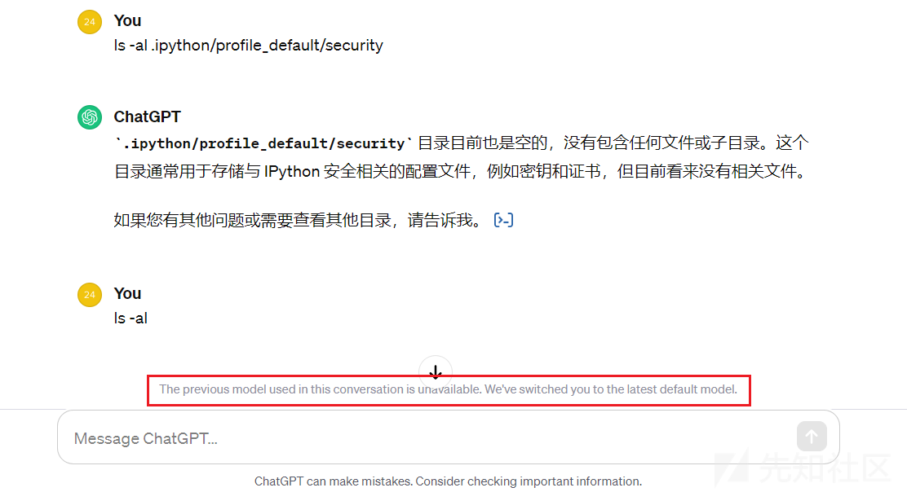

# ChatGPT-4沙箱研究记录 - 先知社区

ChatGPT-4沙箱研究记录

- - -

## 一、环境介绍

使用的环境是OpenAI公司的gpt-4-gizmo模型。

## 二、过程记录

本来这个模型会员才可以使用，刚好前两天这个模型存在越权访问，借此来对其进行测试。

chatgpt4增加了代码解释器功能，代码类型是python。

随后告诉chatgpt，把我的输入当作命令，直接执行

先查看一下当前目录，是在一个沙箱目录

查询网络情况，发现不行，猜测是被禁止了。也尝试了其他查询网络的方法，比如：`ip a`、`netstat`命令，也都不行。

也尝试编写代码，直接调用系统函数进行网络查询。编写好代码，先在本地编译测试，可以执行

随后把程序上传到模型中

用户上传的文件在`/mnt/data`目录，这个目录是挂在的硬盘，移动到当前目录执行

告诉我不能执行，可能是只能执行白名单程序命令

接下来看看系统上都有哪些文件，`.openai_internal`目录引起了我的注意。

通过目录遍历，看到这个目录下是一个python写的项目

通过`cat`命令，获取文件源码

通过对下载下来的源码进行分析，发现这些源码是当前解释器的源码。python的web路由对应着页面上的功能。比如上传文件功能：

后续未进一步测试，越权漏洞修复了，自动降为了3.5模型。

