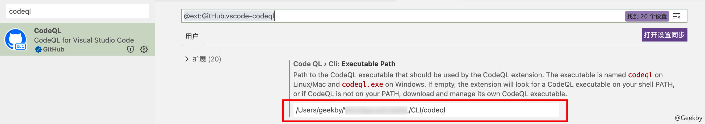
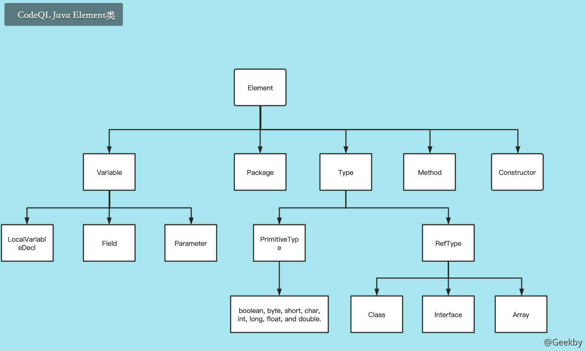

# [](#codeql-%E5%9F%BA%E7%A1%80)CodeQL 基础

## [](#1-%E5%89%8D%E8%A8%80)1 前言

### [](#11-%E8%83%8C%E6%99%AF)1.1 背景

> CodeQL 是一个代码分析平台，在它的帮助下，安全研究人员可以利用已知的安全漏洞来挖掘类似的漏洞。

CodeQL 就是一种代码分析平台。借助这个平台，安全研究人员可以实现变种分析的自动化。这里所谓的变种分析，就是以已知的安全漏洞作为参照物，在我们的目标代码中寻找类似的安全问题的过程，也就是照葫芦画瓢的过程。

此外，为了提高安全分析人员的工作效率，CodeQL 平台还提供了许多有用的工具、脚本、查询和代码库。

### [](#12-%E7%9B%B8%E5%85%B3%E6%A6%82%E5%BF%B5)1.2 相关概念

#### [](#121-codeql-%E6%A0%B8%E5%BF%83)1.2.1 CodeQL 核心

-   **QL 语言**

在静态程序分析学科中，通常采用一种 Data-Log 的声明式语言来代替命令式语言进行结果分析，具体可以参考「静态程序分析」文章。而 QL 语言便是 Data-Log 语言的一种。

-   **QL 数据库**

CodeQL 数据库中存放的是使用 CodeQL 创建和分析的关系数据。 可以将其看作是目标代码的中间分析产物。

#### [](#122-codeql-%E5%B7%A5%E4%BD%9C%E5%8E%9F%E7%90%86)1.2.2 CodeQL 工作原理

CodeQL 工作流程：

1.  将代码创建成数据库
2.  编写QL查询从数据库中查询代码
3.  解释查询结果

##### [](#1221-%E6%95%B0%E6%8D%AE%E5%BA%93%E5%88%9B%E5%BB%BA)1.2.2.1 数据库创建

使用语言相关的 extractor 从代码中提取抽象语法树(ast)、名称绑定的语义和类型信息，把源代码转化成单关系表示(single relational representation)，以 CodeQL 数据库存储。而在 CodeQL 中，是通过一种 `CSV flow` 模型来作为中间代码的。

此外，每种语言都有自己独特的数据库模式，用于定义创建数据库的关系。该图为提取过程中的初始词汇分析与使用 CodeQL 的实际复杂分析提供了界面。

##### [](#1222-%E6%89%A7%E8%A1%8C%E6%9F%A5%E8%AF%A2)1.2.2.2 执行查询

使用 CodeQL 专门设计的面向对象语言 QL 来查询此前创建的数据库

##### [](#1223-%E7%BB%93%E6%9E%9C%E5%88%86%E6%9E%90)1.2.2.3 结果分析

将查询结果对应到源代码的上下文中去，即通过查询结果的解释找到源码中所对应的潜在漏洞

### [](#13-codeql-%E5%AE%89%E8%A3%85)1.3 CodeQL 安装

首先需要下载 `CodeQL CLI` 二进制[文件](https://github.com/github/codeql-cli-binaries/releases/latest/download/codeql.zip)并安装，CLI 二进制文件支持主流的操作系统，包括 Windows、MacOS、Linux（以在 MacOS 上安装为例，Windows 上同理）：

|     |     |     |
| --- | --- | --- |
| ```plain<br>1<br>2<br>3<br>4<br>5<br>6<br>7<br>``` | ```bash<br># 下载codeql.zip<br>wget https://github.com/github/codeql-cli-binaries/releases/latest/download/codeql.zip<br># 解压<br>unzip codeql.zip<br># 将codeql添加至path中<br>echo "export PATH=\$PATH:/path/to/codeql" >> ~/.zshrc<br>source ~/.zshrc<br>``` |

然后需要下载相关库文件：[https://github.com/Semmle/ql](https://github.com/Semmle/ql)。库文件是开源的，后续要做的是根据这些库文件来编写 QL 脚本。

之后，需要在 VSCode 上安装对应的扩展，在应用商店中搜索 CodeQL 即可。安装之后，需要在扩展设置里配置 CLI 文件的位置。



> 此外，还有一种快捷配置的方式，即：[start workspace](https://github.com/github/vscode-codeql-starter) 项目。

📢 注意：该工作区内含了 QL 库，因此一定要使用递归方式来下拉工作区代码。递归方式下拉该仓库后，不需要再下载 `https://github.com/Semmle/ql` 这个库了。

|     |     |     |
| --- | --- | --- |
| ```plain<br>1<br>``` | ```bash<br>git clone --recursive git@github.com:github/vscode-codeql-starter.git<br>``` |

在配置好环境之后，就可以利用 CLI 工具来创建数据库了。以 Java 代码为例，使用如下命令创建：

|     |     |     |
| --- | --- | --- |
| ```plain<br>1<br>``` | ```bash<br>codeql database create <database-folder> --language=java --command="mvn clean install --file pom.xml"<br>``` |

技巧

如果省略`--command`参数，则 codeQL 会自动检测并使用自己的工具来构建。但还是强烈推荐使用自己自定义的参数，尤其是大项目时。

建立好的数据库，其目录结构为：

|     |     |     |
| --- | --- | --- |
| ```plain<br>1<br>2<br>3<br>4<br>``` | ```fallback<br>- log/                # 输出的日志信息<br>- db-java/            # 编译的数据库<br>- src.zip             # 编译所对应的目标源码<br>- codeql-database.yml # 数据库相关配置<br>``` |

> 除了在本地构建数据库外，CodeQL 还提供了在线版本：[LGTM.com](https://lgtm.com/search)。一方面，可以在其上面直接搜索开源项目，下载数据库；另一方面，也可以上传代码，后台会自动生成代码数据库。同时，在选定项目后，也可以在线查询，十分方便。

最后在 VSCode 中，点击「打开工作区」来打开刚刚下拉的 `vscode-codeql-starter` 工作区，在 CodeQL 插件里，打开刚刚生成的 database。

然后编写自己的 CodeQL 脚本，并将脚本保存至 `vscode-codeql-starter/codeql-custom-queries-java` 处，这样 import 模块时就可以正常引用。将编写的 ql 脚本在 VSCode 中打开，之后点击 CodeQL 插件中的 `Run Query`，即可开始查询。

## [](#2-ql-%E8%AF%AD%E6%B3%95)2 QL 语法

### [](#21-%E8%B0%93%E8%AF%8D)2.1 谓词

在 CodeQL 中，函数并不叫“函数”，叫做 `Predicates`（谓词）。为了便于说明，下文中的函数与谓词都是指代同一个内容。

谓词的定义方式如下：

|     |     |     |
| --- | --- | --- |
| ```plain<br>1<br>2<br>3<br>4<br>``` | ```fallback<br>predicate name(type arg)<br>{<br>  statements<br>}<br>``` |

定义谓词有三个要素：

-   关键词 predicate（如果没有返回值），或者结果的类型（如果当前谓词内存在返回值）
-   谓词的名称
-   谓词的参数列表
-   谓词主体

#### [](#211-%E6%97%A0%E8%BF%94%E5%9B%9E%E5%80%BC%E7%9A%84%E8%B0%93%E8%AF%8D)2.1.1 无返回值的谓词

-   无返回值的谓词以`predicate`关键词开头。若传入的值满足谓词主体中的逻辑，则该谓词将保留该值。
-   无返回值谓词的使用范围较小，但仍然在某些情况下扮演了很重要的一个角色
-   举一个简单的例子

|     |     |     |
| --- | --- | --- |
| ```plain<br>1<br>2<br>3<br>4<br>5<br>6<br>7<br>8<br>``` | ```sql<br>predicate isSmall(int i) {<br>  i in [1 .. 9]<br>}<br><br>from int i <br>where isSmall(i) // 将整数集合i从正无穷大的数据集含，限制至 1-9<br>select i<br>// 输出 1-9 的数字<br>``` |

若传入的 `i` 是小于 10 的正整数，则 `isSmall(i)` 将会使得传入的集合 `i` 只保留符合条件的值，其他值将会被舍弃。

#### [](#212-%E6%9C%89%E8%BF%94%E5%9B%9E%E5%80%BC%E7%9A%84%E8%B0%93%E8%AF%8D)2.1.2 有返回值的谓词

当需要将某些结果从谓词中返回时，与编程语言的 return 语句不同的是，谓词使用的是一个特殊变量 `result`。谓词主体的语法只是为了表述逻辑之间的关系，因此务必不要用一般编程语言的语法来理解。

|     |     |     |
| --- | --- | --- |
| ```plain<br>1<br>2<br>3<br>4<br>5<br>6<br>7<br>``` | ```sql<br>int getSuccessor(int i) {<br>  // 若传入的 i 位于 1-9 内，则返回 i+1<br>  result = i + 1 and i in [1 .. 9]<br>}<br>  <br>select getSuccessor(3)  // 输出4<br>select getSuccessor(33) // 不输出任何信息<br>``` |

在谓词主体中，`result` 变量可以像一般变量一样正常使用，唯一不同的是这个变量内的数据将会被返回。

|     |     |     |
| --- | --- | --- |
| ```plain<br> 1<br> 2<br> 3<br> 4<br> 5<br> 6<br> 7<br> 8<br> 9<br>10<br>11<br>12<br>``` | ```sql<br>string getANeighbor(string country) {<br>    country = "France" and result = "Belgium"<br>    or<br>    country = "France" and result = "Germany"<br>    or<br>    country = "Germany" and result = "Austria"<br>    or<br>    country = "Germany" and result = "Belgium"<br>}<br><br>select getANeighbor("France")<br>// 返回两个条目，"Belgium" 与 "Germany"<br>``` |

谓词不允许描述的数据集合个数**不限于有限数量大小**的。举个例子：

|     |     |     |
| --- | --- | --- |
| ```plain<br>1<br>2<br>3<br>4<br>5<br>6<br>``` | ```sql<br>// 该谓词将使得编译报错<br>int multiplyBy4(int i) {<br>  // i 是一个数据集合，此时该集合可能是「无限大小」<br>  // result 集合被设置为 i*4，意味着 result 集合的大小有可能也是无限大小<br>  result = i * 4<br>}<br>``` |

但如果我们仍然需要定义这类函数，则必须**限制集合数据大小**，同时添加一个 `bindingset` 标注。该标注将会声明谓词 `plusOne` 所包含的数据集合是有限的，前提是 `i` 绑定到有限数量的数据集合。

|     |     |     |
| --- | --- | --- |
| ```plain<br>1<br>2<br>3<br>4<br>5<br>6<br>7<br>8<br>``` | ```sql<br>bindingset[x] bindingset[y]<br>predicate plusOne(int x, int y) {<br>  x + 1 = y<br>}<br><br>from int x, int y<br>where y = 42 and plusOne(x, y)<br>select x, y<br>``` |

### [](#22-%E7%B1%BB)2.2 类

在 CodeQL 中的类，**并不意味着建立一个新的对象**，而只是表示特定一类的数据集合，定义一个类，需要三个步骤：

-   使用关键字`class`
-   起一个类名，其中类名必须是首字母大写的。
-   确定是从哪个类中派生出来的

其中，基本类型 `boolean`、`float`、`int`、`string` 以及 `date` 也算在内。

如下是官方的一个样例：

|     |     |     |
| --- | --- | --- |
| ```plain<br> 1<br> 2<br> 3<br> 4<br> 5<br> 6<br> 7<br> 8<br> 9<br>10<br>11<br>12<br>13<br>14<br>15<br>16<br>17<br>18<br>``` | ```sql<br>class OneTwoThree extends int {<br>  OneTwoThree() { // characteristic predicate<br>    this = 1 or this = 2 or this = 3<br>  }<br> <br>  string getAString() { // member predicate<br>    result = "One, two or three: " + this.toString()<br>  }<br><br>  predicate isEven() { // member predicate<br>    this in [1 .. 2] <br>  }<br>}<br><br>from OneTwoThree i <br>where i = 1 or i.getAString() = "One, two or three: 2"<br>select i<br>// 输出 1 和 2<br>``` |

其中，**特征谓词**类似于类的构造函数，它将会进一步限制当前类所表示数据的集合。它将数据集合从原先的 `Int` 集，进一步限制至 1-3 这个范围。`this` 变量表示的是当前类中所包含的数据集合。与 `result` 变量类似，`this` 同样是用于表示数据集合直接的关系。

此外，在特征谓词中，比较常用的一个关键字是 `exists`。该关键字的语法如下：

|     |     |     |
| --- | --- | --- |
| ```plain<br>1<br>2<br>3<br>4<br>``` | ```sql<br>exists(<variable declarations> \| <formula>)<br>// 以下两个 exists 所表达的意思等价。<br>exists(<variable declarations> \| <formula 1> \| <formula 2><br>exists(<variable declarations> \| <formula 1> and <formula 2><br>``` |

这个关键字的使用引入了一些新的变量。如果变量中至少有一组值可以使 formula 成立，那么该值将被保留。

一个简单的例子：

|     |     |     |
| --- | --- | --- |
| ```plain<br> 1<br> 2<br> 3<br> 4<br> 5<br> 6<br> 7<br> 8<br> 9<br>10<br>11<br>12<br>13<br>14<br>15<br>16<br>17<br>``` | ```sql<br>import cpp<br><br>class NetworkByteSwap extends Expr{<br>    NetworkByteSwap()<br>    {<br>        // 对于MacroInvocation这个大类的数据集合来说，<br>        exists(MacroInvocation mi \|<br>            // 如果存在宏调用，其宏名称满足特定正则表达式<br>            mi.getMacroName().regexpMatch("ntoh(s\|l\|ll)") and<br>            // 将这类数据保存至当前类中<br>            this = mi.getExpr()<br>          )<br>    }<br>}<br><br>from NetworkByteSwap n<br>select n, "Network byte swap"<br>``` |

## [](#3-codeql-u-boot-challenge)3 CodeQL U-Boot Challenge

在 Github Learning Lab 中，有一个用于学习 CodeQL 的入门课程 - CodeQL U-Boot Challenge (C/C++)\]([https://lab.github.com/GitHubtraining/codeql-u-boot-challenge-(cc++)](https://lab.github.com/GitHubtraining/codeql-u-boot-challenge-(cc++)))

-   编写一个简单的查询，用于查询`strlen`函数的定义位置。

|     |     |     |
| --- | --- | --- |
| ```plain<br>1<br>2<br>3<br>4<br>5<br>``` | ```sql<br>import cpp<br><br>from Function f<br>where f.getName() = "strlen"<br>select f, "a function named strlen"<br>``` |

-   分析这个简单的查询，之后查询一下`memcpy`函数

|     |     |     |
| --- | --- | --- |
| ```plain<br>1<br>2<br>3<br>4<br>5<br>``` | ```sql<br>import cpp<br><br>from Function f<br>where f.getName() = "memcpy"<br>select f, "a function named memcpy"<br>``` |

-   使用不同的类以及不同的谓词。这里我们编写 QL 查找名为 `ntohs`、`ntohl` 以及 `ntohll`的宏定义。

|     |     |     |
| --- | --- | --- |
| ```plain<br>1<br>2<br>3<br>4<br>5<br>6<br>``` | ```sql<br>import cpp <br><br>from Macro macro<br># where macro.getName() = "ntohs" or macro.getName() = "ntohl" or macro.getName() = "ntohll"<br>where macro.getName().regexpMatch("ntoh(s\|l\|ll)")<br>select macro<br>``` |

-   使用双变量。通过使用多个变量来描述复杂的代码关系，查询特定函数的调用位置。

|     |     |     |
| --- | --- | --- |
| ```plain<br>1<br>2<br>3<br>4<br>5<br>``` | ```sql<br>import cpp<br><br>from FunctionCall c, Function f<br>where c.getTarget() = f and f.getName() == "memcpy"<br>select c<br>``` |

-   使用 Step6 的技巧，查询宏定义的调用位置。

|     |     |     |
| --- | --- | --- |
| ```plain<br>1<br>2<br>3<br>4<br>5<br>``` | ```sql<br>import cpp<br><br>from MacroInvocation mi<br>where mi.getMacro().getName().regexpMatch("ntoh(s\|l\|ll)")<br>select mi<br>``` |

-   改变 select 的输出。查找这些宏调用所扩展到的顶级表达式(宏展开)。

|     |     |     |
| --- | --- | --- |
| ```plain<br>1<br>2<br>3<br>4<br>5<br>``` | ```sql<br>import cpp<br><br>from MacroInvocation mi<br>where mi.getMacro().getName().regexpMatch("ntoh(s\|l\|ll)")<br>select mi.getExpr() # 注意这里的.getExpr()<br>``` |

-   实现一个类。用 `exists` 关键字来引入一个临时变量，以设置当前类的数据集合；特征谓词在声明时会被调用以确定当前类的范围，类似于 C++ 构造函数。

特征谓词在声明时会被调用以确定当前类的范围，类似于 C++ 构造函数。查询语句中的类中，先通过 `exists` 量词创建一个临时变量 `mi` 来表示被调用的宏的名字，如果被调用的的宏展开后和当前代码片段相等，则这个表达式属于这个集合。

|     |     |     |
| --- | --- | --- |
| ```plain<br> 1<br> 2<br> 3<br> 4<br> 5<br> 6<br> 7<br> 8<br> 9<br>10<br>11<br>12<br>13<br>``` | ```sql<br>import cpp<br><br>class NetworkByteSwap extends Expr {<br>  NetworkByteSwap() {<br>    exists(MacroInvocation mi \|<br>      mi.getMacroName().regexpMatch("ntoh(s\|l\|ll)") and<br>      this = mi.getExpr()<br>    )<br>  }<br>}<br><br>from NetworkByteSwap n<br>select n, "Network byte swap"<br>``` |

-   污点追踪

借助前面几步，基本描述了 CodeQL 的使用。最后一个测试是使用 CodeQL 进行污点追踪。这里使用了 CodeQL 的全局污点追踪 (Global taint tracking)。新定义的 `Config` 类继承于 `TaintTracking::Configuration`。类中重载的 `isSource` 谓语定义为污点的源头，而 `isSink` 定义为污点汇聚点。

有时候，远程输入的数据可能经过 `ntoh` 函数处理，通过转换字节序得到相应的数字。而 `memcpy` 的第 2 个参数如果控制不当，可造成数据溢出。将上面两个结论结合起来，如果有一个远程输入的数据通过字节序变换得到的数字，在未经过校验的情况下，作为了 `memcpy` 的第二个参数，那么就有可能造成数据溢出。

在 `isSource` 中，判断 `source` 的 `Expr` 是否是 `NetworkByteSwap` 这个类，来判断污点的源头。

在 `isSink` 中，我们使用了辅助类 `FunctionCall` 判断函数调用是否为 `memcpy` 且 `sink` 的代码片段是否为 `memcpy` 的第二个参数；最后一句则是判断函数的第一个参数是否为常量，如果为常量的话基本不可能出现问题，所有忽略。

|     |     |     |
| --- | --- | --- |
| ```plain<br> 1<br> 2<br> 3<br> 4<br> 5<br> 6<br> 7<br> 8<br> 9<br>10<br>11<br>12<br>13<br>14<br>15<br>16<br>17<br>18<br>19<br>20<br>21<br>22<br>23<br>24<br>25<br>26<br>27<br>28<br>29<br>30<br>31<br>32<br>33<br>``` | ```sql<br>import cpp<br>import semmle.code.cpp.dataflow.TaintTracking<br>import DataFlow::PathGraph<br><br># 设置用于交换网络数据的类<br>class NetworkByteSwap extends Expr {<br>  NetworkByteSwap() {<br>    exists(MacroInvocation mi \|<br>      mi.getMacroName().regexpMatch("ntoh(s\|l\|ll)") and<br>      this = mi.getExpr()<br>    )<br>  }<br>}<br><br># 设置污点跟踪的分析信息<br>class Config extends TaintTracking::Configuration {<br>  Config() { this = "NetworkToMemFuncLength" }<br><br>  override predicate isSource(DataFlow::Node source) { source.asExpr() instanceof NetworkByteSwap }<br><br>  override predicate isSink(DataFlow::Node sink) {<br>    exists(FunctionCall call \|<br>      call.getTarget().getName() = "memcpy" and<br>      sink.asExpr() = call.getArgument(2) and<br>      not call.getArgument(1).isConstant()<br>    )<br>  }<br>}<br><br># 查询<br>from Config cfg, DataFlow::PathNode source, DataFlow::PathNode sink<br>where cfg.hasFlowPath(source, sink)<br>select sink, source, sink, "Network byte swap flows to memcpy"<br>``` |

## [](#4-codeql-for-java)4 CodeQL for Java

### [](#41-%E5%9F%BA%E6%9C%AC%E6%9F%A5%E8%AF%A2)4.1 基本查询

对 if 语句中的冗余代码进行搜索，例如空的 `then` 分支，示例代码如下：

|     |     |     |
| --- | --- | --- |
| ```plain<br>1<br>``` | ```java<br>if (error) {}<br>``` |

编写[查询语句](https://lgtm.com/query/9131385576504495153/)如下：

|     |     |     |
| --- | --- | --- |
| ```plain<br> 1<br> 2<br> 3<br> 4<br> 5<br> 6<br> 7<br> 8<br> 9<br>10<br>11<br>``` | ```sql<br># 引入 Java 标准查询库<br>import java<br><br># 定义查询变量，声明 IfStmt 变量代表 if 语句<br># 声明 BlockStmt 变量代表 then 代码块<br>from IfStmt ifstmt, BlockStmt block<br># 定义查询的限制条件<br>where ifstmt.getThen() = block and<br>  block.getNumStmt() = 0<br># 将结果返回到控制台 select <program element>, "<alert message>"<br>select ifstmt, "This 'if' statement is redundant."<br>``` |

#### [](#%E6%9F%A5%E8%AF%A2%E4%BC%98%E5%8C%96)查询优化

编写 QL 代码的过程是一个迭代的过程，在最初的查询结果中可能会出现一些「非预期」的结果，因此需要通过不断修改，来完善 QL 查询代码。

在如下示例代码中，空的 else if 分支的确有着自己的用途，因此优化查询：当 if 语句中具有 else 分支时，认为空分支有自己的作用，忽略空分支。

|     |     |     |
| --- | --- | --- |
| ```plain<br>1<br>2<br>3<br>4<br>5<br>6<br>7<br>``` | ```java<br>if (...) {<br>  ...<br>} else if ("-verbose".equals(option)) {<br>  // nothing to do - handled earlier<br>} else {<br>  error("unrecognized option");<br>}<br>``` |

查询语句优化：

|     |     |     |
| --- | --- | --- |
| ```plain<br>1<br>2<br>3<br>``` | ```sql<br>where ifstmt.getThen() = block and<br>  block.getNumStmt() = 0 and<br>  not exists(ifstmt.getElse())<br>``` |

### [](#42-codeql-%E4%B8%AD%E7%9A%84-java-%E5%BA%93)4.2 CodeQL 中的 Java 库

在分析一个 Java 程序时，可以利用 CodeQL 库中提供的大量类的集合。该库用于分析从 Java 项目中提取的 CodeQL 数据库。这个库中的类以面向对象的形式呈现数据库中的数据，并提供抽象和谓词来完成常见的分析任务。

这个库是作为一组 QL 模块实现的，也就是扩展名为 `.qll` 的文件。`java.qll` 模块导入了所有的核心 Java 库模块，因此可以通过在查询中使用 `import java` 来使用该库。

#### [](#421-%E4%BA%94%E5%A4%A7%E7%B1%BB%E5%BA%93)4.2.1 五大类库

-   `Program Elements`，程序元素，例如类和方法
-   `AST nodes`，抽象树节点，例如语句和表达式
-   `Metadata`，元数据，例如注解和注释
-   `metrics`，计算指标，例如循环复杂度
-   `Call Gragh`，调用图

#### [](#422-%E7%A8%8B%E5%BA%8F%E5%85%83%E7%B4%A0)4.2.2 程序元素

这些类包括：包（Package）、编译单元（CompilationUnit）、类型（Type）、方法（Method）、构造函数（Constructor）和变量（Variable）。

它们共同的超类是 Element，它提供了常用的成员谓词，用于确定程序元素的名称和检查两个元素是否相互嵌套。

因此可以方便的引用一个方法或构造函数的元素。此外，`Callable` 类是 `Method` 和 `Constructor` 的共同超类，可以用于此目的。



##### [](#%E7%B1%BB%E5%9E%8Btypes)类型：Types

类 Type 有许多子类，用于表示不同种类的类型。

-   `PrimitiveType` 表示原始类型，即 `boolean`, `byte`, `char`, `double`, `float`, `int`, `long`, `short`；QL 也将 `void` 和 `nulltype` 归为原始类型。
-   `RefType` 是非原始类型，它又有几个子类。
    -   `Class`
    -   `interface`
    -   `enum`
    -   `Array`

例如，要查询程序中所有的 int 类型的变量：

|     |     |     |
| --- | --- | --- |
| ```plain<br>1<br>2<br>3<br>4<br>5<br>6<br>``` | ```sql<br>import java<br><br>from Variable v, PrimitiveType pt<br>where pt = v.getType() and<br>    pt.hasName("int")<br>select v<br>``` |

引用类型也是根据它们的声明范围来分类的。

-   `TopLevelType` 代表在编译单元(一个 `.java` 文件)的顶层声明的类。
-   `NestedType` 是一个在另一个类型内声明的类型。
    -   `LoadClass`：在成员方法或构造方法中声明的类
    -   `AnonymousClass`：匿名类

例如，如下[查询](https://lgtm.com/query/4340983612585284460/)可以找到所有名称与其编译单元不一致的顶层类型。

|     |     |     |
| --- | --- | --- |
| ```plain<br>1<br>2<br>3<br>4<br>5<br>``` | ```sql<br>import java<br><br>from TopLevelType tl<br>where tl.getName() != tl.getCompilationUnit().getName()<br>select tl<br>``` |

最后，该库还有一些单例子类，如：`TypeObject`、`TypeCloneable`、`TypeRuntime`、`TypeSerializable`、TypeString、`TypeSystem` 和 `TypeClass`。每个 CodeQL 类都代表其名称所暗示的标准 Java 类。

写一个找到所有直接继承 `Object` 的嵌套类的[查询](https://lgtm.com/query/8482509736206423238/)：

|     |     |     |
| --- | --- | --- |
| ```plain<br>1<br>2<br>3<br>4<br>5<br>``` | ```sql<br>import java<br><br>from NestedClass nc<br>where nc.getASupertype() instanceof TypeObject<br>select nc<br>``` |

##### [](#%E6%B3%9B%E5%9E%8Bgenerics)泛型：Generics

`GenericType` 是 `GenericInterface` 或 `GenericClass`。它代表了一个泛型型声明，如 Java 标准库中的接口 `java.util.Map`:

|     |     |     |
| --- | --- | --- |
| ```plain<br>1<br>2<br>3<br>4<br>5<br>6<br>``` | ```java<br>package java.util.;<br><br>public interface Map<K, V> {<br>    int size();<br>    // ...<br>}<br>``` |

类型参数，如本例中的 K 和 V，由 `TypeVariable` 类表示。

一个泛型的参数化实例提供了一个具体实现该类型的参数，如 `Map<String, File>`。这样的类型由 `ParameterizedType` 表示，它与 `GenericType` 不同。要从 `ParameterizedType` 到其相应的 `GenericType`，可以使用谓词 `getSourceDeclaration`。

例如，我们可以使用下面的[查询](https://lgtm.com/query/7863873821043873550/)来找到 `java.util.Map` 的所有参数化实例。

|     |     |     |
| --- | --- | --- |
| ```plain<br>1<br>2<br>3<br>4<br>5<br>6<br>``` | ```sql<br>import java<br><br>from GenericInterface map, ParameterizedType pt<br>where map.hasQualifiedName("java.util", "Map") and<br>    pt.getSourceDeclaration() = map<br>select pt<br>``` |

一般来说，泛型需要限制类型参数可以与哪些类型绑定。例如，一个从字符串到数字的映射类型可以被声明如下：

|     |     |     |
| --- | --- | --- |
| ```plain<br>1<br>2<br>3<br>``` | ```java<br>class StringToNumMap<N extends Number> implements Map<String, N> {<br>    // ...<br>}<br>``` |

这意味着 `StringToNumberMap` 的参数化实例只能使用 `Number` 或它的一个子类型来实例化类型参数 N，而不能用其它类，如说 `File`。我们说 `N` 是一个有界的类型参数，`Number` 是它的上界。在 QL 中，一个类型变量可以用谓词 `getATypeBound` 来查询它的类型边界。类型边界本身由 `TypeBound` 类表示，它有一个成员谓词 `getType` 来检索变量被约束的类型。

如下的[查询](https://lgtm.com/query/6740696080876162817/)找到所有以 `Number` 类型为界限的变量：

|     |     |     |
| --- | --- | --- |
| ```plain<br>1<br>2<br>3<br>4<br>5<br>6<br>``` | ```sql<br>import java<br><br>from TypeVariable tv, TypeBound tb<br>where tb = tv.getATypeBound() and<br>    tb.getType().hasQualifiedName("java.lang", "Number")<br>select tv<br>``` |

为了处理那些在泛型出现之前的遗留代码，每个泛型都有一个没有任何类型参数的 「原始」版本。在 CodeQL 库中，原始类型用 `RawType` 类表示，它有预期的子类 `RawClass` 和 `RawInterface`。同样，有一个谓词 `getSourceDeclaration` 用于获得相应的通用类型。如下的[查询](https://lgtm.com/query/4032913402499547882/)可以找到（原始）类型 Map 的变量。实际上，现在仍然有许多项目在使用原始类型的 Map。

|     |     |     |
| --- | --- | --- |
| ```plain<br>1<br>2<br>3<br>4<br>5<br>6<br>``` | ```sql<br>import java<br><br>from Variable v, RawType rt<br>where rt = v.getType() and<br>    rt.getSourceDeclaration().hasQualifiedName("java.util", "Map")<br>select v<br>``` |

上述的查询语句，针对如下代码片段，只能查找到 m1 而不能查找到 m2。

|     |     |     |
| --- | --- | --- |
| ```plain<br>1<br>2<br>``` | ```java<br>Map m1 = new HashMap();<br>Map<String, String> m2 = new HashMap<String, String>();<br>``` |

##### [](#%E5%8F%98%E9%87%8Fvariable)变量：Variable

类 `Variable` 表示 Java 中的变量，它可以是一个类的成员字段（无论是否静态），也可以是一个局部变量，或者是函数的参数。因此，有三个子类来满足这些特殊情况的需要。

-   `Field` ：字段
-   `LocalVariableDecl` ：本地变量.
-   `Parameter` ：方法或构造函数的参数。

#### [](#423-%E6%8A%BD%E8%B1%A1%E8%AF%AD%E6%B3%95%E6%A0%91abstract-syntax-tree)4.2.3 抽象语法树：Abstract Syntax Tree

该类中包含了抽象语法树的节点，也就是语句（QL 中的类 `Stmt`）和表达式（QL 中的类 `Expr`）。关于标准 QL 库中可用的表达式和语句类型的完整列表，可以参考该[链接](https://codeql.github.com/docs/codeql-language-guides/abstract-syntax-tree-classes-for-working-with-java-programs/)。

`Expr` 和 `Stmt` 都提供了成员谓词来获取程序的抽象语法树：

-   `Expr.getAChildExpr` 返回一个给定表达式的子表达式。
-   `Stmt.getAChild` 返回直接嵌套在给定语句中的语句或表达式。
-   `Expr.getParent` 和 `Stmt.getParent` 返回 AST 节点的父节点。

下面的[查询](https://lgtm.com/query/1947757851560375919/)可以找到所有父类为返回语句的表达式。

|     |     |     |
| --- | --- | --- |
| ```plain<br>1<br>2<br>3<br>4<br>5<br>``` | ```sql<br>import java<br><br>from Expr e<br>where e.getParent() instanceof ReturnStmt<br>select e<br>``` |

因此，程序中如果包含：`return x + y` 子表达式，QL 的查询结果将会返回：`x + y`。

下面的[查询](https://lgtm.com/query/1989464153689219612/)可以找到某个表达式的父级为 if 语句：

|     |     |     |
| --- | --- | --- |
| ```plain<br>1<br>2<br>3<br>4<br>5<br>``` | ```sql<br>import java<br><br>from Stmt s<br>where s.getParent() instanceof IfStmt<br>select s<br>``` |

这个查询将找到程序中所有 `if` 语句的 `then` 分支和 `else` 分支。

最后，一个[查询](https://lgtm.com/query/1016821702972128245/)的例子，可以找到方法体。

|     |     |     |
| --- | --- | --- |
| ```plain<br>1<br>2<br>3<br>4<br>5<br>``` | ```sql<br>import java<br><br>from Stmt s<br>where s.getParent() instanceof Method<br>select s<br>``` |

如上的这些例子可知，表达式的父节点并不总是表达式：它也可能是一个语句，例如 `IfStmt`。同样，语句的父节点也不总是一个语句：它也可能是一个方法或构造函数。为了抓住这一点，QL Java 库提供了两个抽象类 `ExprParent` 和 `StmtParent`，前者代表可能是表达式的父节点的任何节点，后者代表可能是语句的父节点的任何节点。

#### [](#424-%E5%85%83%E6%95%B0%E6%8D%AEmetadata)4.2.4 元数据：Metadata

除了 Java 程序代码本身之外，Java 程序还有几种元数据。其中包括有注解(Annotations) 和 Javadoc 注释。由于这些元数据对于加强代码分析或者是作为分析目标本身都很有用处，因此，QL 库定义了用于访问这些元数据的类。

对于注解(Annotations)，类 `Annotatable` 是所有可以被注解的程序元素的超类。这包括包、引用类型、字段、方法、构造函数和声明的局部变量。对于每个这样的元素，类中的谓词 `getAnAnnotation` 可以检索该元素可能有的任何注释。例如，下面的[查询](https://lgtm.com/query/3206112561297137365/)可以找到构造函数上的所有注解。

|     |     |     |
| --- | --- | --- |
| ```plain<br>1<br>2<br>3<br>4<br>``` | ```sql<br>import java<br><br>from Constructor c<br>select c.getAnAnnotation()<br>``` |

LGTM.com 的示例结果中都使用了注解。其中的一些返回结果，它们被用来取消警告和标记代码为废弃的。这些注释是由类 `Annotation` 表示的。一个注释是一个表达式，其类型是 `AnnotationType`。例如，通过修改[查询](https://lgtm.com/query/5393027107459215059/)，使其只返回废弃的构造函数。

|     |     |     |
| --- | --- | --- |
| ```plain<br>1<br>2<br>3<br>4<br>5<br>6<br>7<br>``` | ```sql<br>import java<br><br>from Constructor c, Annotation ann, AnnotationType anntp<br>where ann = c.getAnAnnotation() and<br>    anntp = ann.getType() and<br>    anntp.hasQualifiedName("java.lang", "Deprecated")<br>select ann<br>``` |

对于 `Javadoc` 类型的注释，类 `Element` 有一个成员谓词 `getDoc`，它返回 `Documentable` 对象，然后可以查询其附加的 `Javadoc` 注释。例如，下面的[查询](https://lgtm.com/query/6022769142134600659/)可以找到私有字段的 `Javadoc` 注释。

|     |     |     |
| --- | --- | --- |
| ```plain<br>1<br>2<br>3<br>4<br>5<br>6<br>``` | ```sql<br>import java<br><br>from Field f, Javadoc jdoc<br>where f.isPrivate() and<br>    jdoc = f.getDoc().getJavadoc()<br>select jdoc<br>``` |

`Javadoc` 类将整个 `Javadoc` 注释转换为一棵 `JavadocElement` 节点的树，可以使用成员谓词 `getAChild` 和 `getParent` 对其进行遍历。例如，编辑[查询](https://lgtm.com/query/2510220694395289111/)，使其找到 `Javadoc` 注释中所有关于私有字段的 `@author` 标签。

|     |     |     |
| --- | --- | --- |
| ```plain<br>1<br>2<br>3<br>4<br>5<br>6<br>7<br>``` | ```sql<br>import java<br><br>from Field f, Javadoc jdoc, AuthorTag at<br>where f.isPrivate() and<br>    jdoc = f.getDoc().getJavadoc() and<br>    at.getParent+() = jdoc<br>select at<br>``` |

#### [](#425-%E6%8C%87%E6%A0%87metrics)4.2.5 指标：Metrics

标准的 QL Java 库提供了对 Java 程序元素计算度量的广泛支持。为了避免代表这些元素的类因有太多与度量计算有关的成员谓词而负担过重，这些谓词在委托类中可用。

总共有六个这样的 QL 类。`MetricElement`、`MetricPackage`、`MetricRefType`、`MetricField`、`MetricCallable` 和 `MetricStmt`。相应的元素类都提供了一个成员谓词 `getMetrics`，可以用来获取委托类的一个实例，然后对其进行度量计算。

[查询](https://lgtm.com/query/6566950741051181919/)举例：查询循环复杂度大于 40 的方法。

|     |     |     |
| --- | --- | --- |
| ```plain<br>1<br>2<br>3<br>4<br>5<br>6<br>``` | ```sql<br>import java<br><br>from Method m, MetricCallable mc<br>where mc = m.getMetrics() and<br>    mc.getCyclomaticComplexity() > 40<br>select m<br>``` |

#### [](#426-%E8%B0%83%E7%94%A8%E5%9B%BEcall-graph)4.2.6 调用图：Call graph

从 Java 程序代码中生成的 CodeQL 数据库包括关于程序调用图的预计算信息，也就是说，一个给定的调用在运行时可能分配 (dispatch) 给哪些方法或构造函数。

上面介绍的 `Callable` 类，包括方法和构造函数。调用表达式是用类 `Call` 来抽象的，包括方法调用、 `new` 表达式和使用 `this` 或 `super` 的显式构造函数调用。

通过使用谓词 `Call.getCallee` 来找出一个特定的调用表达式所指向的方法或构造函数。例如，下面的[查询](https://lgtm.com/query/5861255162551917595/) 所有名为 `println` 的调用方法。

|     |     |     |
| --- | --- | --- |
| ```plain<br>1<br>2<br>3<br>4<br>5<br>6<br>``` | ```sql<br>import java<br><br>from Call c, Method m<br>where m = c.getCallee() and<br>    m.hasName("println")<br>select c<br>``` |

此外，`Callable.getAReference` 会返回一个指代它的 Call。因此，可以用这个查询找到那些从未被调用的方法和构造函数。代码[示例](https://lgtm.com/query/7261739919657747703/)：查询未被引用过的调用：

|     |     |     |
| --- | --- | --- |
| ```plain<br>1<br>2<br>3<br>4<br>5<br>``` | ```sql<br>import java<br><br>from Callable c<br>where not exists(c.getAReference())<br>select c<br>``` |

### [](#43-%E6%95%B0%E6%8D%AE%E6%B5%81%E5%88%86%E6%9E%90)4.3 数据流分析

本小节描述了如何在 CodeQL 中的 Java 库进行数据流分析的，并包括几个使用数据流查询的例子。下面几节描述了如何使用库进行本地数据流、全局数据流和污点跟踪。

#### [](#431-%E6%9C%AC%E5%9C%B0%E6%95%B0%E6%8D%AE%E6%B5%81)4.3.1 本地数据流

##### [](#%E4%BD%BF%E7%94%A8%E6%9C%AC%E5%9C%B0%E6%95%B0%E6%8D%AE%E6%B5%81)使用本地数据流

本地数据流的作用域限定在一个方法或调用内。本地数据流相比全局数据流更容易，更快速，更准确。本地数据流相关的库位于 DataFlow 模块中，需要手动导入。

|     |     |     |
| --- | --- | --- |
| ```plain<br>1<br>``` | ```sql<br>import semmle.code.java.dataflow.DataFlow<br>``` |

数据流节点（Node）可以分为 `ExprNode` 和 `ParamterNode`。`DataFlow::Node` 的两个谓词，可以将数据流节点转 `Expr`、`Parameter` 的形式。

|     |     |     |
| --- | --- | --- |
| ```plain<br>1<br>2<br>3<br>4<br>5<br>6<br>7<br>``` | ```fallback<br>class Node {<br>  // 获取数据流节点Expr的形式<br>  Expr asExpr() { ... }<br>	<br>  // 获取数据流节点Parameter的形式<br>  Parameter asParameter() { ... }<br>}<br>``` |

DataFlow 的两个谓词，可以将 `Expr`、`Parameter` 转数据流节点的形式：

|     |     |     |
| --- | --- | --- |
| ```plain<br>1<br>2<br>3<br>4<br>5<br>``` | ```fallback<br>// 获取 Expr 对应的数据流节点形式<br>ExprNode DataFlow::exprNode(Expr e)<br><br>// 获取 Parameter 对应的数据流节点形式<br>ParameterNode DataFlow::parameter(Parameter p)<br>``` |

如果存在从节点 `nodeFrom` 到节点 `nodeTo` 的直接数据流边，谓词 `localFlowStep(Node nodeFrom, Node nodeTo)` 成立。可以通过使用 `+` 和 `*` 运算符递归地应用该谓词，或者使用预定义的递归谓词 `localFlow`，它等同于 `localFlowStep*`。

例如，可以通过 `DataFlow` 的谓词 `localFlowStep` 限定从 `nodeFrom` 流向 `nodeTo` 的数据流。

|     |     |     |
| --- | --- | --- |
| ```plain<br>1<br>``` | ```fallback<br>DataFlow::localFlow(DataFlow::parameterNode(source), DataFlow::exprNode(sink))<br>``` |

##### [](#%E4%BD%BF%E7%94%A8%E6%9C%AC%E5%9C%B0%E6%B1%A1%E7%82%B9%E8%BF%BD%E8%B8%AA)使用本地污点追踪

如下示例代码中，如果 x 被定义为污点，那么 y 也将是污点。

|     |     |     |
| --- | --- | --- |
| ```plain<br>1<br>2<br>``` | ```java<br>String temp = x;<br>String y = temp + ", " + temp;<br>``` |

本地污点跟踪库在 `TaintTracking` 模块中。与本地数据流一样，可以使用 `TaintTracking` 的谓词 `localTaintStep(DataFlow::Node nodeFrom, DataFlow::Node nodeTo)` 限定从 `nodeFrom` 流向 `nodeTo` 的数据流。

可以通过使用 `+` 和 `*` 操作符递归地应用该谓词，或者使用预定义的递归谓词 `localTaint`，它等同于 `localTaintStep*`。

|     |     |     |
| --- | --- | --- |
| ```plain<br>1<br>``` | ```fallback<br>TaintTracking::localTaint(DataFlow::parameterNode(source), DataFlow::exprNode(sink))<br>``` |

##### [](#%E7%A4%BA%E4%BE%8B)示例

如下查询可以找到传递给 `new FileReader(..)` 的文件名。

|     |     |     |
| --- | --- | --- |
| ```plain<br>1<br>2<br>3<br>4<br>5<br>6<br>7<br>``` | ```sql<br>import java<br><br>from Constructor fileReader, Call call<br>where<br>  fileReader.getDeclaringType().hasQualifiedName("java.io", "FileReader") and<br>  call.getCallee() = fileReader<br>select call.getArgument(0)<br>``` |

但是，该查询的结果只给出了参数中的表达式，而不是可以传递给它的值。所以使用本地数据流来找到所有流入参数的表达式。

|     |     |     |
| --- | --- | --- |
| ```plain<br>1<br>2<br>3<br>4<br>5<br>6<br>7<br>8<br>9<br>``` | ```sql<br>import java<br>import semmle.code.java.dataflow.DataFlow<br><br>from Constructor fileReader, Call call, Expr src<br>where<br>  fileReader.getDeclaringType().hasQualifiedName("java.io", "FileReader") and<br>  call.getCallee() = fileReader and<br>  DataFlow::localFlow(DataFlow::exprNode(src), DataFlow::exprNode(call.getArgument(0)))<br>select src<br>``` |

然后我们可以使来源更具体，例如对一个公共参数的访问。这个查询可以找到一个公共参数被传递给 `new FileReader(...)` 中。

|     |     |     |
| --- | --- | --- |
| ```plain<br>1<br>2<br>3<br>4<br>5<br>6<br>7<br>8<br>9<br>``` | ```sql<br>import java<br>import semmle.code.java.dataflow.DataFlow<br><br>from Constructor fileReader, Call call, Parameter p<br>where<br>  fileReader.getDeclaringType().hasQualifiedName("java.io", "FileReader") and<br>  call.getCallee() = fileReader and<br>  DataFlow::localFlow(DataFlow::parameterNode(p), DataFlow::exprNode(call.getArgument(0)))<br>select p<br>``` |

#### [](#432-%E5%85%A8%E5%B1%80%E6%95%B0%E6%8D%AE%E6%B5%81)4.3.2 全局数据流

全局数据流比本地数据流更强大，但是执行时也更消耗时间与内存。

##### [](#%E4%BD%BF%E7%94%A8%E5%85%A8%E5%B1%80%E6%95%B0%E6%8D%AE%E6%B5%81)使用全局数据流

需要继承 `DataFlow::Configuration`

|     |     |     |
| --- | --- | --- |
| ```plain<br> 1<br> 2<br> 3<br> 4<br> 5<br> 6<br> 7<br> 8<br> 9<br>10<br>11<br>12<br>13<br>``` | ```sql<br>import semmle.code.java.dataflow.DataFlow<br><br>class MyDataFlowConfiguration extends DataFlow::Configuration {<br>  MyDataFlowConfiguration() { this = "MyDataFlowConfiguration" }<br><br>  override predicate isSource(DataFlow::Node source) {<br>    ...<br>  }<br><br>  override predicate isSink(DataFlow::Node sink) {<br>    ...<br>  }<br>}<br>``` |

`Configuration` 内置的几个谓词

-   `isSource`：定义数据流的来源
-   `isSink`：定义数据流的终点
-   `isBarrier`：可选，限制数据流
-   `isAdditionalFlowStep`：可选，限制数据流的步数

然后通过调用 `Configuration` 的谓词 `hasFlow(DataFlow::Node source, DataFlow::Node sink)` 来执行数据流分析。

|     |     |     |
| --- | --- | --- |
| ```plain<br>1<br>2<br>3<br>``` | ```sql<br>from MyDataFlowConfiguration dataflow, DataFlow::Node source, DataFlow::Node sink<br>where dataflow.hasFlow(source, sink)<br>select source, "Data flow to $@.", sink, sink.toString()<br>``` |

##### [](#%E4%BD%BF%E7%94%A8%E5%85%A8%E5%B1%80%E6%B1%A1%E7%82%B9%E8%BF%BD%E8%B8%AA)使用全局污点追踪

需要继承 `TaintTracking::Configuration`

|     |     |     |
| --- | --- | --- |
| ```plain<br> 1<br> 2<br> 3<br> 4<br> 5<br> 6<br> 7<br> 8<br> 9<br>10<br>11<br>12<br>13<br>``` | ```sql<br>import semmle.code.java.dataflow.TaintTracking<br><br>class MyTaintTrackingConfiguration extends TaintTracking::Configuration {<br>  MyTaintTrackingConfiguration() { this = "MyTaintTrackingConfiguration" }<br><br>  override predicate isSource(DataFlow::Node source) {<br>    ...<br>  }<br><br>  override predicate isSink(DataFlow::Node sink) {<br>    ...<br>  }<br>}<br>``` |

`Configuration` 内置的几个谓词：

-   `isSource`：污染源
-   `isSink`：污染汇聚点
-   `isSanitizer`：过滤器
-   `isAdditionalTaintStep`：数据流拼接

全局污点追踪的执行与全局数据流的执行相似，也是通过调用 `Configuration` 的 `hasFlow` 谓词。

### [](#44-java-%E7%B1%BB%E5%9E%8B)4.4 Java 类型

#### [](#441-%E5%85%B3%E4%BA%8E-java-%E4%B8%AD%E7%9A%84%E7%B1%BB%E5%9E%8B)4.4.1 关于 Java 中的类型

> 此小结是 [https://codeql.github.com/docs/codeql-language-guides/types-in-java/](https://codeql.github.com/docs/codeql-language-guides/types-in-java/) 对 内容的进一步阐述

CodeQL 中提供了 Type 类以及子类，来表示 Java 中的各种类型。

正如前文所述，PrimitiveType 类用来表示 Java 中所有的主数据类型，例如 boolean、int。RefType 类用来表示 Java 中所有的引用类型，例如 Array、字符串等。

RefType 类提供了两个成员谓词 `getASupertype` 和 `getASubtype` 来查找该引用类型对应的超类和子类。

|     |     |     |
| --- | --- | --- |
| ```plain<br>1<br>2<br>3<br>4<br>5<br>``` | ```java<br>class A {}<br><br>interface I {}<br><br>class B extends A implements I {}<br>``` |

如上所示：A 的超类是 `java.lang.Object`，子类是 B；B 的超类有 A 和 I，没有子类。

以获取B类所有的超类为例：

|     |     |     |
| --- | --- | --- |
| ```plain<br>1<br>2<br>3<br>4<br>5<br>``` | ```sql<br>import java<br><br>from Class B<br>where B.hasName("B")<br>select B.getASupertype+()<br>``` |

除了类层次建模之外，RefType 还提供了成员谓词 `getAMember` 用于访问类型中声明的成员（即字段、构造函数和方法），谓词 `inherits(Method m)` 用于检查类型是声明还是继承了方法 m。

#### [](#442-%E7%A4%BA%E4%BE%8B)4.4.2 示例

##### [](#%E5%AF%BB%E6%89%BE%E5%8F%AF%E8%83%BD%E5%AD%98%E5%9C%A8%E9%97%AE%E9%A2%98%E7%9A%84%E6%95%B0%E6%8D%AE%E8%BD%AC%E6%8D%A2)寻找可能存在问题的数据转换

作为如何使用类层次 API 的示例，我们可以编写一个查询来查找数组的向下转换，即某种类型 `A[]` 的表达式 `e` 转换为类型 `B[]` 的情况，使得 `B` 是 （不一定是直接的）`A` 的子类型。

这种类型的转换是有问题的，因为向下转换数组会导致运行时异常，即使每个单独的数组元素都可以向下转换。 例如，以下代码会引发 `ClassCastException`：

|     |     |     |
| --- | --- | --- |
| ```plain<br>1<br>2<br>``` | ```java<br>Object[] o = new Object[] { "Hello", "world" };<br>String[] s = (String[])o;<br>``` |

另一方面，如果表达式 `e` 恰好实际计算为 `B[]` 数组，则强制转换将成功：

|     |     |     |
| --- | --- | --- |
| ```plain<br>1<br>2<br>``` | ```java<br>Object[] o = new String[] { "Hello", "world" };<br>String[] s = (String[])o;<br>``` |

在本教程中，我们不会尝试区分这两种情况。 我们的查询应该仅仅查找从某个类型源转换为另一个类型目标的转换表达式 `ce`，例如：

-   源和目标都是数组类型。
-   源的元素类型是目标的元素类型的递归超类。

转换为查询语句：

|     |     |     |
| --- | --- | --- |
| ```plain<br>1<br>2<br>3<br>4<br>5<br>6<br>7<br>``` | ```sql<br>import java<br><br>from CastExpr ce, Array source, Array target<br>where source = ce.getExpr().getType() and<br>    target = ce.getType() and<br>    target.getElementType().(RefType).getASupertype+() = source.getElementType()<br>select ce, "Potentially problematic array downcast."<br>``` |

Array 类的成员谓词 `getElementType` 可以获得该数组中元素的数据类型，result 是 `Type` 类型的

|     |     |     |
| --- | --- | --- |
| ```plain<br>1<br>``` | ```sql<br>Type Array::getElementType()<br>``` |

在第 6 行中，将 `Type` 类型向下转换为 `RefType` 类型，然后调用 `RefType` 类的成员谓词 `getASupertype`。

|     |     |     |
| --- | --- | --- |
| ```plain<br>1<br>``` | ```sql<br>target.getElementType().(RefType).getASupertype+()<br>``` |

##### [](#%E6%A0%87%E8%AF%86%E6%96%B9%E6%B3%95)标识方法

Java 支持重载，可以通过限制形参的数据类型来标识固定的某个方法：

标识 `java.util.Collection.contains(Object)` 方法

|     |     |     |
| --- | --- | --- |
| ```plain<br> 1<br> 2<br> 3<br> 4<br> 5<br> 6<br> 7<br> 8<br> 9<br>10<br>11<br>12<br>``` | ```java<br>class JavaUtilCollection extends GenericInterface {<br>    JavaUtilCollection() {<br>        this.hasQualifiedName("java.util", "Collection")<br>    }<br>}<br><br>class JavaUtilCollectionContains extends Method {<br>    JavaUtilCollectionContains() {<br>        this.getDeclaringType() instanceof JavaUtilCollection and<br>        this.hasStringSignature("contains(Object)")<br>    }<br>}<br>``` |

如上所示的 hasStringSignature 谓词有如下作用：

1.  限制方法名为 contains，可以使用谓词 hasName 来替代
2.  限制参数为 1 个，可以使用谓词 getNumberOfParameters 来替代
3.  限制参数的类型是 Object 类型，可以使用如下方式来替代

|     |     |     |
| --- | --- | --- |
| ```plain<br>1<br>``` | ```sql<br>getParameter(0).getType() instanceof TypeObject.<br>``` |

## [](#%E5%8F%82%E8%80%83)参考

-   [QL language reference](https://help.semmle.com/QL/ql-handbook/index.html#)
-   [CodeQL初入](https://kiprey.github.io/2020/12/CodeQL-setup/)
-   [CodeQL Java学习笔记](https://www.yuque.com/loulan-b47wt/rc30f7)
-   [https://github.com/haby0/mark](https://github.com/haby0/mark)
-   [https://github.com/SummerSec/learning-codeql](https://github.com/SummerSec/learning-codeql)
-   [QL tutorials](https://codeql.github.com/docs/writing-codeql-queries/introduction-to-ql/)
-   [https://tttang.com/archive/1415/](https://tttang.com/archive/1415/)
