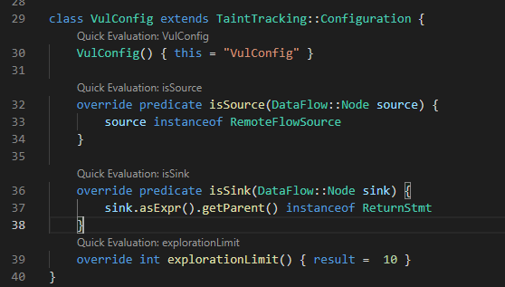
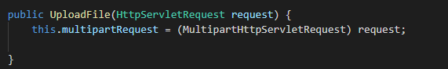

## CodeQL 提升篇

- - -

## [0x00 功能](#toc_0x00)

> 编译

闭源项目创建数据库，可以使用该工具：[https://github.com/ice-doom/codeql\_compile](https://github.com/ice-doom/codeql_compile)

> 历史查询

在VSCode左侧可以的QUERY HISTORY可以点击切换历史查询内容，也可以右键比对查询结果等功能  
[](https://storage.tttang.com/media/attachment/2022/01/23/215719b8-e815-4bb5-a3e3-bcdcc71949e1.png)

> 查看AST

在VSCode左侧选中要查看的java文件之后，点击View AST即可查看，并且鼠标点击到java文件中的类、方法等，AST VIEWER中会自动帮助我们定位到该项  
[](https://storage.tttang.com/media/attachment/2022/01/23/3bc2b9c3-e3f4-4f7f-8e32-078be197ae7b.png)

> 快速查询

在我们编写的一些谓词上方有个快速查询按钮，点击之后可以快速查询当前谓词的结果。  
[](https://storage.tttang.com/media/attachment/2022/01/23/af6b8ad1-2251-4b7e-8826-df82208da6d9.png)

## [0x01 语法](#toc_0x01)

列出个人经常用到的语法和一些注意事项

### [获取具体QL类型](#toc_ql)

不确定使用什么方式获取目标时，除了通过查看AST，还可以通过词`getAQlClass()`获取调用它实体的具体QL类型。

```plain
from Expr e, Callable c
where e.getEnclosingCallable() = c
select e, e.getAQlClass()
```

### [尽可能缩小范围](#toc_)

如下定义，如果项目代码量很大，则非常耗时

```plain
override predicate isSink(DataFlow::Node sink) {
    sink.asExpr().getParent() instanceof ReturnStmt
}
```

可以设置return语句在哪个函数中调用来缩小范围，乃至其Type的全限定名

```plain
override predicate isSink(DataFlow::Node sink) {
    sink.asExpr().getParent() instanceof ReturnStmt
    and sink.asExpr().getEnclosingCallable().hasName("xxxxx")
}
```

### [个人使用的几个规则](#toc__1)

```plain
// 以某个方法的参数作为source (添加了几种过滤方式，第一个参数、该方法当前类的全限定名为xxxx)
override predicate isSource(DataFlow::Node source) {
    exists(Parameter p |
        p.getCallable().hasName("readValue") and
        source.asParameter() = p and
        source.asParameter().getPosition() = 0
        and p.getCallable().getDeclaringType().hasQualifiedName("com.service.impl", "xxxxx")
    )
}

// 以某个实例的所有参数作为source(`X1 x1 = new X1(a,b)`，这里a、b作为source)，过滤：调用该实例的方法名称为`Caller`，实例类型名称为`X1`
override predicate isSource(DataFlow::Node source) {
    exists(ClassInstanceExpr ma |
        source.asExpr() = ma.getAnArgument()
        and ma.getTypeName().toString() = "X1"
        and ma.getCaller().hasName("Caller")
    )
}
```

### [调用端点路径](#toc__2)

比如我们想知道方法A到方法G之间调用端点路径，则可以使用`edges`谓词，编写如下所示，如果也想找覆写的某个方法（如：接口实现类中的方法）可以将`calls`替换为`polyCalls`

```plain
import java

class StartMethod extends Method {
  StartMethod() { getName() = "main" }
}

class TargetMethod extends Method {
  TargetMethod() { getName() = "vulMain" }
}

query predicate edges(Method a, Method b) { a.calls(b) }

from TargetMethod end, StartMethod entryPoint
where edges+(entryPoint, end)
select end, entryPoint, end, "Found a path from start to target."
```

得到的结果如图所示  
[](https://storage.tttang.com/media/attachment/2022/01/23/0020ac10-5153-4e6f-8950-1dad9b847a67.png)

### [对某接口实现](#toc__3)

主要是通过codeql自带谓词`overridesOrInstantiates`判断该函数是否进行了重写。  
如下，就能获取实现`JSONStreamAware`接口，重写的方法

```plain
class JsonInterface extends Interface{
    JsonInterface(){
        this.hasQualifiedName("com.alibaba.fastjson", "JSONStreamAware")
    }

    Method getJsonMethod(){
        result.getDeclaringType() = this
    }
}

class CMethod extends Method{
    CMethod(){
        this.overridesOrInstantiates*(any(JsonInterface i).getJsonMethod())
    }
}

from CMethod m select m, m.getDeclaringType()
```

[](https://storage.tttang.com/media/attachment/2022/01/23/e0f3c120-058b-4287-b1b4-123550829072.png)  
[](https://storage.tttang.com/media/attachment/2022/01/23/7bb01ad0-bf85-4e11-a3e5-e6ed8e248123.png)

### [查询Select](#toc_select)

如果编写查询不规范可能会经常碰到类似如下错误  
<font color=#FF0000>Showing raw results instead of interpreted ones due to an error. Interpreting query results failed: \[xxxxx\] Exception caught at top level: Could not process query metadata. Error was: Expected result pattern(s) are not present for problem query: Expected exactly one pattern. \[INVALID\_RESULT\_PATTERNS\]</font>

这种情况的注意事项如下：  
在不使用path查询时，元数据为`@kind problem`，并且也别导入path相关内容，如：`import DataFlow::PathGraph`，否则查询时会一直产生失败日志，而且当string中使用了`$@`占位符时会一直失败使其当作正常字符串展示在结果中。  
这种查询由两列组成`select element, string`

使用path查询时，元数据为`@kind path-problem`，查询模板为`select element, source, sink, string`  
当`element`指定为`source`节点时最先显示的是`source`  
[](https://storage.tttang.com/media/attachment/2022/01/23/25680548-5eb6-4d84-8c1e-95e602d4dcd1.png)  
当`element`指定为`sink`节点时最先显示的是`sink`  
[](https://storage.tttang.com/media/attachment/2022/01/23/30ee0591-62bb-4c04-a574-7319df80708e.png)

## [0x02 AdditionalTaintStep](#toc_0x02-additionaltaintstep)

在为一些项目编写规则查询时，经常碰到数据流中断的情况，下面列出经常碰到中断的情况和解决方案。

### [setter和getter](#toc_settergetter)

场景1：在做GitHub CTF案例时这块有体会，CodeQL为减少误报很多地方都需要我们根据相应场景自己连接数据流，比如getter。  
这种情况需要将调用方法的对象（通过`getQualifier`谓词获取限定符）和调用方法的返回值连接起来。如下操作就是从`get%`方法访问到它的限定符作为附加步骤重新连接起来。

```plain
class GetSetTaintStep extends TaintTracking::AdditionalTaintStep{
    override predicate step(DataFlow::Node src, DataFlow::Node sink){
        exists(MethodAccess ma |
            (ma.getMethod() instanceof GetterMethod or ma.getMethod() instanceof SetterMethod or ma.getMethod().getName().matches("get%") or ma.getMethod().getName().matches("set%"))
            and
             src.asExpr() = ma.getQualifier()
            and sink.asExpr() = ma
            )
    }
}
```

### [mapper](#toc_mapper)

场景2：使用mybatis通常将接口命名为xxxxMapper或者xxxxDao这种形式，在xml配置文件中通过namespace指定其全限定名，当数据流需要经过数据库查询到这里会断开，那么需要手动将其连接起来。

如下我们使用普通查询从接收请求到`return`语句结束  
[](https://storage.tttang.com/media/attachment/2022/01/23/d95ce8d8-783f-46e5-b224-983ee729e71e.png)  
最后会在此处中断  
[](https://storage.tttang.com/media/attachment/2022/01/23/d2bebdfc-3361-47c7-afd3-279644883ff8.png)  
对应xml配置  
[](https://storage.tttang.com/media/attachment/2022/01/23/c47b656d-1a35-4399-ae3a-8a90434c20a3.png)

那么需要添加`AdditionalTaintStep`将中断进行拼接。这里将污染源查询的`id`和某个方法连接（该方法的对象类型名称是`xxxxDao`），当然有的可能名称是`xxxxMapper`，根据情况而定

```plain
class MapperTaintStep extends TaintTracking::AdditionalTaintStep{

    override predicate step(DataFlow::Node src, DataFlow::Node sink){
        exists(MethodAccess ma |
            (ma.getQualifier().getType().getName().matches("%Dao") or ma.getQualifier().getType().getName().matches("%Mapper"))
            // and (src.asExpr() = ma.getAnArgument() or src.asExpr() = ma.getAnArgument().getAChildExpr())
            and src.asExpr() = ma.getAnArgument()
            and sink.asExpr() = ma
        )
    }
}
```

最后查询结果：  
[](https://storage.tttang.com/media/attachment/2022/01/23/87e14d74-827b-4711-b207-a1a19262824d.png)

这一块在CWE-089的查询文件中，也有类似`AdditionalTaintStep`一步，可以阅读参考。

### [污染源作为参数传入](#toc__4)

场景3：如下图所示，`instance`作为污染源，`workNode`也被污染，将其传入`t.setSceneKey`为`t`对象的`sceneKey`属性赋值，那么这里`t`对象理应也是被污染的。但当我们将`instance`作为`source`，`return t`作为`sink`是获取不到路径的，需要加上额外步骤。  
[](https://storage.tttang.com/media/attachment/2022/01/23/4cd77b22-50ff-4781-ad1c-75d91294bdc0.png)  
代码如下，将调用方法的所有参数作为`source`(图中`setSceneKey`方法的`workNode.getSceneKey()`参数)，将调用方法的对象作为`sink`(图中的`t`对象)

```plain
class SrcTaintStep extends TaintTracking::AdditionalTaintStep{
    override predicate step(DataFlow::Node src, DataFlow::Node sink){
        exists(MethodAccess ma |
            (ma.getMethod() instanceof SetterMethod or ma.getMethod().getName().matches("set%"))
            and
                src.asExpr() = ma.getAnArgument()
            and sink.asExpr() = ma.getQualifier()
            )
    }
}
```

可以猜猜上图中总共需要添加几个额外步骤（3个，第一：刚刚讲的；第二：`instance`的getter；第三：`workNodeMapper`）

### [实例化](#toc__5)

场景4：如下图，将`req`传入`UploadFile`中创建`UploadFile`对象，再将其传入`systemService.uploadFile`方法中，这种情况，`uploadFile`对象应该是受污染的，但是默认情况下，我们像让数据流进入`systemService.uploadFile`中是不行的，因为在`new UploadFile`就已经断开了。那么就需要将其连接起来  
[](https://storage.tttang.com/media/attachment/2022/01/23/97656c8f-0873-4863-abcf-0522f01c4f4f.png)  
代码如下，如果已经知道当前查询大概断的位置，可以缩小范围，这里将所有的都会连接起来

```plain
class InstanceTaintStep extends TaintTracking::AdditionalTaintStep{
    override predicate step(DataFlow::Node src, DataFlow::Node sink){
      exists(ClassInstanceExpr cie | 
        // cie.getTypeName().toString() = "UploadFile"
         src.asExpr() = cie.getAnArgument()
          and sink.asExpr() = cie)
    }
}
```

## [0x03 Partial flow](#toc_0x03-partial-flow)

对于数据流中断时候如何去解决确定中断位置在哪，官方提供了Partial flow方式，也就是查询到中断前的部分流，对于某些场景是有帮助的。如果想了解的话可以阅读官方描述[Debugging data-flow queries using partial flow¶](https://codeql.github.com/docs/writing-codeql-queries/debugging-data-flow-queries-using-partial-flow/)

使用：  
先导入`PartialPathGraph`，这里需要注意不能和`PathGraph`共存，也就是使用`PartialPathGraph`则不能导入`import DataFlow::PathGraph`。

```plain
import DataFlow::PartialPathGraph
```

在`TaintTracking::Configuration`配置中添加一个谓词，表示探索深度

```plain
override int explorationLimit() { result = 5 }
```

查询如下，注：`hasPartialFlow`是和`PartialPathGraph`匹配，`hasFlowPath`和`PathGraph`匹配，导入的时候一定要注意，否则会导致查不出来内容。

```plain
from MyTaintTrackingConfiguration conf, DataFlow::PartialPathNode source, DataFlow::PartialPathNode sink
where conf.hasPartialFlow(source, sink, _)
select sink, source, sink, "Partial flow from unsanitized user data"
```

当整个调用链非常长的时候又不知道具体断掉的位置，然后使用Partial flow会导致查询结果内容非常多，更不好排查了。官方提供了2种解决方式  
[](https://storage.tttang.com/media/attachment/2022/01/23/0850cf53-00bc-4117-aafd-ba17a1d7a2a0.png)

大概的意思也就是，比如：a-b-c-d-e-f-g，不知道哪个位置中断了，那么就先查a-b-c-d，将sink从g修改为a。或者说是将source的大范围修改为确定的单个source来减少输出方便排查。还有就是可以使用`sanitizer`来清洗掉其他不想查看到的分支。

## [0x04 官方规则-path-injection](#toc_0x04-path-injection)

### [path-injection](#toc_path-injection)

用于检测文件相关，可以是文件上传、文件读取。主要判断逻辑是对与传入文件操作时文件名是否可控

打开CEW-022，官方对于此漏洞的简要说明：[java-path-injection](https://codeql.github.com/codeql-query-help/java/java-path-injection/)  
[](https://storage.tttang.com/media/attachment/2022/01/23/f72bca31-583e-4083-b452-5b4a9ddb1a45.png)  
`TaintedPathConfig`污点跟踪分析的配置如下  
[](https://storage.tttang.com/media/attachment/2022/01/23/97ab5731-953e-4224-89c4-5fd812aa2647.png)

#### [source](#toc_source)

使用了`RemoteFlowSource`，其中定义了用户输入可控的常见源。

#### [sink](#toc_sink)

`sink`定义中使用了陌生的谓词和类，先看看`PathCreation`

```plain
override predicate isSink(DataFlow::Node sink) {
    exists(Expr e | e = sink.asExpr() | e = any(PathCreation p).getAnInput() and not guarded(e))
}
```

跟进 **PathCreation.qll** 包，获取用于创建路径的输入，定义了常见用法。使用方式通过调用`getAnInput()`谓词获取方法内的所有参数，也就是将`sink`定义为传入的文件名。  
[](https://storage.tttang.com/media/attachment/2022/01/23/516cbb7b-e176-40a2-9407-6ec433e9ac16.png)  
再跟进 **TaintedPathCommon.qll** 查看`guarded`谓词  
[](https://storage.tttang.com/media/attachment/2022/01/23/57c6daf2-bc6e-447d-9091-6f04b7761356.png)  
了解下`ConditionBlock`，可以使用下面查询内容

```plain
from ConditionBlock cb select cb, cb.getCondition(),cb.getCondition().getAChildExpr()
```

`cb`获取的是整个块，如：方法开始`{}`整个内容、`if (tree.getId() != null)`、`if (tree.getId() == null)`  
`cb.getCondition()`表示获取此基本块最后一个节点条件，如：`comboTree.getId() != null`、`salary.equalsIgnoreCase("null")`  
`cb.getCondition().getAChildExpr()`表示获取子表达式，如：`tree.getId()`、`null`、`salary`、`"null"`

```plain
public void demo() {
    if (tree.getId() != null) {
        cq.eq("id", tree.getId());
    }
    if (tree.getId() == null) {
        cq.isNull("Depart");
    }
    cq.add();
    ......
    data.setFooter("salary:"+(salary.equalsIgnoreCase("null")?"0.0":salary)+",age,email:合计");
}
```

回到`guarded`谓词中，  
`exists(PathCreation p | e = p.getAnInput())`再次强调变量调用为文件名。  
`cb.getCondition().getAChildExpr*() = c`将块的子表达式和表达式`c`匹配  
`c = e.getVariable().getAnAccess()`文件名的所有调用和表达式`c`匹配  
`cb.controls(e.getBasicBlock(), true)`注释意为：如果传入的`e.getBasicBlock()`是由该条件控制的基本块，即条件为`true`的基本块，则保持成立。  
比如通过`controls`查询，结果如下图，只有当`dirName`的`if`判断语句为`true`才能将`dirName`传入`File`中。  
[](https://storage.tttang.com/media/attachment/2022/01/23/a4083c72-7663-4e2e-b490-87df04378543.png)  
将传入`controls`谓词中的`true`修改为`false`，则能匹配到如下图所示。进行判断的是`!`后面内容，所以可以得到该项  
[](https://storage.tttang.com/media/attachment/2022/01/23/b548cbd9-b11a-407b-94cd-092760234056.png)  
`not inWeakCheck(c)`最后一个过滤条件  
`inWeakCheck`谓词中定义调用方法的方法名等于`startsWith`等，传入表达式等于调用方法的对象。  
`EqualityTest`表示使用`==`或者`!=`的表达式，`getAnOperand()`谓词获取左边和右边的操作表达式，判断其中一个为`null`。

```plain
private predicate inWeakCheck(Expr e) {
  // None of these are sufficient to guarantee that a string is safe.
  exists(MethodAccess m, Method def | m.getQualifier() = e and m.getMethod() = def |
    def.getName() = "startsWith" or
    def.getName() = "endsWith" or
    def.getName() = "isEmpty" or
    def.getName() = "equals"
  )
  or
  // Checking against `null` has no bearing on path traversal.
  exists(EqualityTest b | b.getAnOperand() = e | b.getAnOperand() instanceof NullLiteral)
}
```

总结：  
经过比对sink是否使用`guarded`谓词的结果如下，左边是没有使用`guarded`谓词  
[](https://storage.tttang.com/media/attachment/2022/01/23/205083b4-55a0-4e14-914a-52fcdc151341.png)  
如下图，没有将文件名传入`startsWith`等方法，并且没有使用`==`或者`!=`对`null`进行判断，只有当文件名的判断条件为`true`才能将其传入`File`中，那这种情况则不能当作`sink`。其实官方使用`guarded`谓词加入判断的这种情况有点不太理解，暂时没有想到哪些场景这种情况是适用的。可能我个人使用的话会将该项注释掉。  
[](https://storage.tttang.com/media/attachment/2022/01/23/df9b420a-be57-4447-8f12-d94e4a529286.png)

#### [isSanitizer](#toc_issanitizer)

如果数据类型是基本类型或者是其包装类则清洗掉

```plain
override predicate isSanitizer(DataFlow::Node node) {
    exists(Type t | t = node.getType() | t instanceof BoxedType or t instanceof PrimitiveType)
}
```

#### [isSanitizerGuard](#toc_issanitizerguard)

这里也是起到清洗作用，当调用方法为`contains`并且其参数值为`..`，对表达式`e`的判断为`false`则条件成立。

```plain
class ContainsDotDotSanitizer extends DataFlow::BarrierGuard {
    ContainsDotDotSanitizer() {
        this.(MethodAccess).getMethod().hasName("contains") and
        this.(MethodAccess).getAnArgument().(StringLiteral).getValue() = ".."
}

    override predicate checks(Expr e, boolean branch) {
        e = this.(MethodAccess).getQualifier() and branch = false
    }
}

override predicate isSanitizerGuard(DataFlow::BarrierGuard guard) {
    guard instanceof ContainsDotDotSanitizer
}
```

上面的内容以案例来看是容易理解些的，如下图，只有当`sourceFilename.contains("..")`的判断语句为`false`才能进入`File`中，那么这种情况则将其清洗掉。  
也就是代码中如果对文件名内容进行`..`检测则清洗掉，不展示该数据。  
[](https://storage.tttang.com/media/attachment/2022/01/23/3109a90b-8fd3-41b9-ac12-15da16b7d3d2.png)

以上就是path-injection内容的讲解，不考虑`guarded`谓词情况，其实挺容易理解的，将常见用户输入可控的位置作为`source`，将常见文件操作方法的参数即文件名作为`sink`，清洗掉那些类型是基本类型等、如果对文件名进行`..`检测则也清洗掉。

#### [应用到真实场景](#toc__6)

当我们查询，可以看到这里查询到了一个上传的工具类中，source是`multipartRequest.getFileMap()`方法。如果稍微往前根据可以看到这里`multipartRequest`对象应该就是controller中传入进来的`request`对象，那么这里需要重新找到具体是哪个controller调用到这里  
[](https://storage.tttang.com/media/attachment/2022/01/23/7e869b54-1e8f-4c3b-ac8e-ed30cd029347.png)  
[](https://storage.tttang.com/media/attachment/2022/01/23/826e9aa8-79fc-4767-804e-f5d2eeeea402.png)  
[](https://storage.tttang.com/media/attachment/2022/01/23/3e167bdf-c509-4313-bc43-b4dbd26e31ff.png)

重新将config编写如下，这里只将source查到`RequestMapping`，如果要考虑全可以有`GetMapping`等。但只修改为如下是还不能查到内容的。

```plain
class TaintedPathConfig extends TaintTracking::Configuration {
  TaintedPathConfig() { this = "TaintedPathConfig" }

  override predicate isSource(DataFlow::Node source) {

    exists( Method m, Parameter p| 
    m.getAnAnnotation().getType().hasQualifiedName("org.springframework.web.bind.annotation", "RequestMapping")
    and m.hasAnnotation()
    and m.getAParameter() = p
    and source.asParameter()=p
    and p.getType().hasName("HttpServletRequest")
    )
   }

  override predicate isSink(DataFlow::Node sink) {
    exists( Method m, Parameter p| m.hasName("uploadFile") and
    m.getDeclaringType().hasQualifiedName("org.xxxx.core.common.dao.impl", "xxxxx")
    and m.getAParameter() = p
    and sink.asParameter()=p
    and p.getType().hasName("UploadFile")
    )
  }
}
```

原因就是`UploadFile`实例时这里中断了  
[](https://storage.tttang.com/media/attachment/2022/01/23/0bf5536f-8830-48a1-bbbe-8929cd74d15a.png)

将其连接起来后即可

```plain
class InstanceTaintStep extends TaintTracking::AdditionalTaintStep{
  override predicate step(DataFlow::Node src, DataFlow::Node sink){
      exists(ClassInstanceExpr ma | 
         sink.asExpr() = ma
        and src.asExpr() = ma.getAnArgument())
  }
}
```
