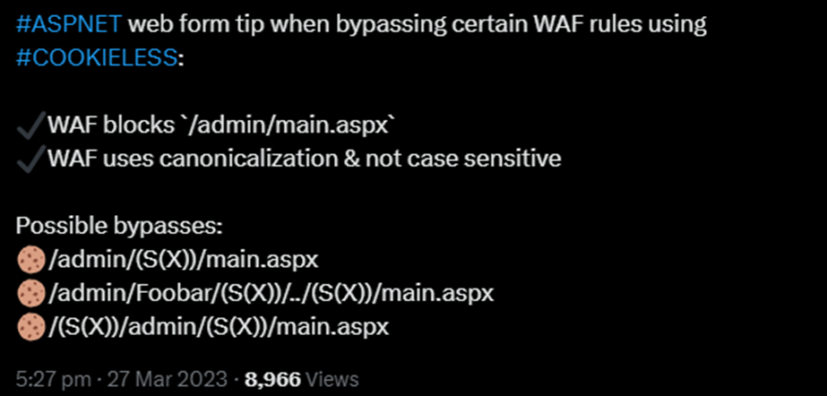
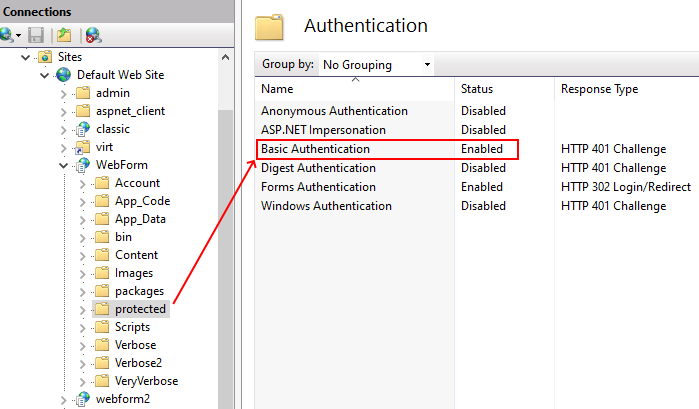
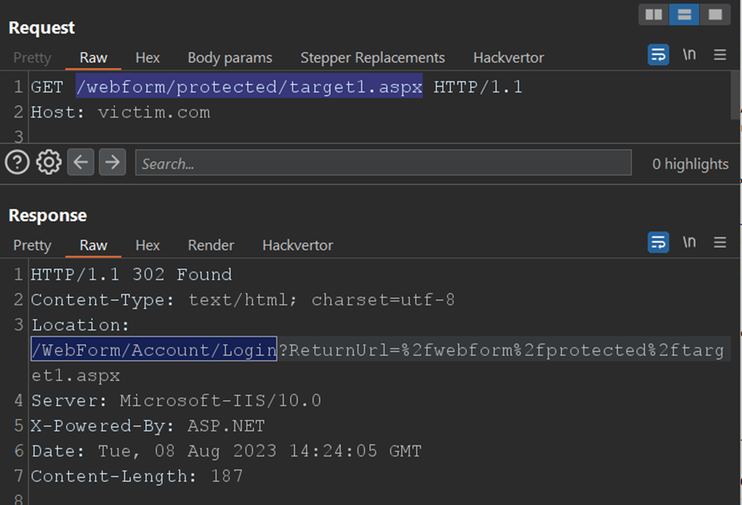
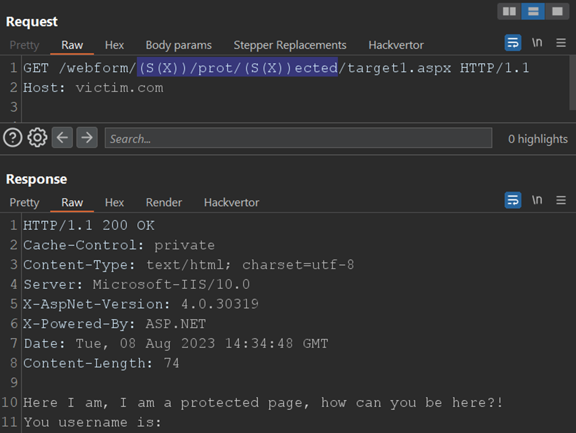
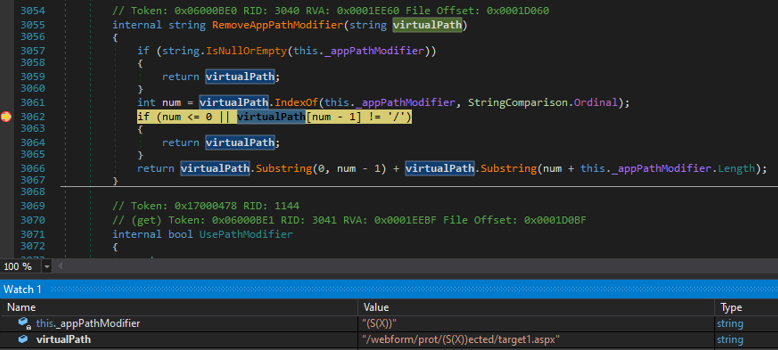

# Cookieless DuoDrop: IIS Auth Bypass & App Pool Privesc in ASP.NET Framework (CVE-2023-36899 & CVE-2023-36560) | Soroush Dalili (@irsdl) Blog --- 无 Cookie DuoDrop：ASP.NET 框架中的 IIS 身份验证绕过和应用池特权（CVE-2023-36899 和 CVE-2023-36560） |Soroush Dalili （@irsdl） 博客

[](https://soroush.me/blog/wp-content/uploads/2023/08/image-7.png)

## Introduction 介绍

In modern web development, while cookies are the go-to method for transmitting session IDs, the .NET Framework also provides an alternative: encoding the session ID directly in the URL. This method is useful to clients that do not support cookies. An example of this URL encoding can be seen here:  
在现代 Web 开发中，虽然 Cookie 是传输会话 ID 的首选方法，但 .NET Framework 还提供了一种替代方法：直接在 URL 中对会话 ID 进行编码。此方法对于不支持 Cookie 的客户端很有用。可以在此处看到此 URL 编码的示例：

```plain
https://[targetdomain]/(S(aaaaaaaaaaaaaaaaaaaaaaaa))/default.aspx
```

This technique is known as the “cookieless” feature in the .NET Framework:  
此技术在 .NET Framework 中称为“无 cookie”功能：

[https://learn.microsoft.com/en-us/previous-versions/dotnet/articles/aa479314(v=msdn.10)](https://learn.microsoft.com/en-us/previous-versions/dotnet/articles/aa479314(v=msdn.10))

Many developers and security testers overlook this option, primarily because of its rarity in real-world applications. Historically, this has turned it into a goldmine for discovering client-side vulnerabilities, such as session fixation, session hijacking, HTML injection, and cross-site scripting. Additionally, this feature can be leveraged to circumvent path-based firewall rules that aren’t configured to recognize the cookieless approach.  
许多开发人员和安全测试人员忽略了此选项，主要是因为它在实际应用中很少见。从历史上看，这已将其转变为发现客户端漏洞的金矿，例如会话固定、会话劫持、HTML 注入和跨站点脚本。此外，还可以利用此功能来规避未配置为识别无 Cookie 方法的基于路径的防火墙规则。

For a deeper dive into security issues stemming from the use of cookieless sessions, consider these references:  
要更深入地了解因使用无 Cookie 会话而产生的安全问题，请考虑以下参考资料：

-   [https://blog.isec.pl/all-is-xss-that-comes-to-the-net/](https://blog.isec.pl/all-is-xss-that-comes-to-the-net/) (A highly recommended read)
-   [https://learn.microsoft.com/en-us/archive/msdn-magazine/2009/march/security-briefs-protect-your-site-with-url-rewriting](https://learn.microsoft.com/en-us/archive/msdn-magazine/2009/march/security-briefs-protect-your-site-with-url-rewriting)
-   [https://www.sans.org/blog/session-attacks-and-asp-net-part-2/](https://www.sans.org/blog/session-attacks-and-asp-net-part-2/)

Importantly, due to inherent security concerns, the cookieless feature was omitted from .NET Core and subsequent .NET versions. You can learn more about this decision in the following discussions:  
重要的是，由于固有的安全问题，.NET Core 和后续 .NET 版本中省略了无 cookie 功能。您可以在以下讨论中了解有关此决定的更多信息：

-   [https://github.com/dotnet/aspnetcore/issues/37978](https://github.com/dotnet/aspnetcore/issues/37978)
-   [https://github.com/dotnet/AspNetCore.Docs/blob/main/aspnetcore/fundamentals/app-state.md](https://github.com/dotnet/AspNetCore.Docs/blob/main/aspnetcore/fundamentals/app-state.md)

However, let’s not forget the vast number of web applications still humming along on the classic .NET Framework (with the capital ‘F’)!  
但是，我们不要忘记，大量的 Web 应用程序仍然在经典的 .NET Framework（大写字母“F”）上嗡嗡作响！

## Finding the vulnerability  
查找漏洞

I was initially trying to find a new method to improve my IIS Short File Name Disclosure technique. As part of this, I realised that the cookieless part can be used twice within the path, and I quickly wrote a Twitter (X) post about how WAFs can be potentially bypassed using this:  
我最初试图找到一种新方法来改进我的 IIS 短文件名披露技术。作为其中的一部分，我意识到无 cookie 部分可以在路径中使用两次，我很快写了一篇 Twitter （X） 帖子，介绍了如何使用它来绕过 WAF：

[https://twitter.com/irsdl/status/1640390106312835072](https://twitter.com/irsdl/status/1640390106312835072)

[](https://soroush.me/blog/wp-content/uploads/2023/08/image.png)

However, later on I identified a strange anomaly when the cookieless pattern was repeated twice. This resulted in two vulnerabilities reported to Microsoft as their impact and the exploitation were different:  
然而，后来我发现了一个奇怪的异常现象，即无饼干模式重复了两次。这导致向 Microsoft 报告了两个漏洞，因为它们的影响和利用方式不同：

-   IIS restricted path bypass leading to potential authentication and path-filtration bypass  
    IIS 受限路径绕过导致潜在的身份验证和路径过滤绕过
-   Application Pool confusion leading to potential privilege escalations  
    应用程序池混淆导致潜在的权限升级

Microsoft addressed both of these issues as part of one patch under [CVE-2023-36899](https://msrc.microsoft.com/update-guide/vulnerability/CVE-2023-36899).  
Microsoft 在 CVE-2023-36899 下的一个补丁中解决了这两个问题。

I got the following comment from Microsoft when I was trying to see why one of them was assessed as a duplicate reducing the bounty:  
当我试图了解为什么其中一个被评估为重复减少赏金时，我从 Microsoft 那里得到了以下评论：

> While it’s not technically a dupe from your side, it is from ours because the same patch fixes both thing, although it’s by accident rather than deliberation.  
> 虽然从技术上讲，它不是你这边的骗局，但它是我们的骗局，因为同一个补丁可以解决这两件事，尽管这是偶然的，而不是经过深思熟虑的。

## **IIS Restricted Path Bypass  
IIS 受限路径旁路**

The cookieless feature of .NET Framework could be abused to access protected directories or those blocked by URL filters in IIS. For instance, on the victim.com website, consider:  
.NET Framework 的无 Cookie 功能可能被滥用来访问受保护的目录或被 IIS 中的 URL 筛选器阻止的目录。例如，在 victim.com 网站上，请考虑：

1.  The page: `/webform/protected/target1.aspx` within the `/protected/` directory that enforces Basic authentication.  
    页面： `/webform/protected/target1.aspx` 在强制执行基本身份验证的 `/protected/` 目录中。
2.  The page: `/webform/bin/target2.aspx` that was temporarily moved to the `/bin/` folder, making it inaccessible.  
    页面： `/webform/bin/target2.aspx` 已临时移动到 `/bin/` 该文件夹，使其无法访问。

Normally, accessing the pages through these URLs would be blocked in IIS:  
通常，通过这些 URL 访问页面将在 IIS 中被阻止：

```plain
https://victim.com/webform/protected/target1.aspx

https://victim.com/webform/bin/target2.aspx
```

However, the cookieless feature can be exploited to access these pages with the following patterns:  
但是，可以利用无 cookie 功能通过以下模式访问这些页面：

```plain
https://victim.com/webform/(S(X))/prot/(S(X))ected/target1.aspx

https://victim.com/webform/(S(X))/b/(S(X))in/target2.aspx
```

Here is how IIS was configured as an example to set authentication for the `/protected/` path:  
下面是如何将 IIS 配置为示例来 `/protected/` 设置路径的身份验证：

[](https://soroush.me/blog/wp-content/uploads/2023/08/image-2.png)

When trying the standard approach, IIS authentication for the `/protected/` path behaves as expected, redirecting unauthorized users to the login page:  
尝试标准方法时， `/protected/` 路径的 IIS 身份验证将按预期方式运行，将未经授权的用户重定向到登录页：

[](https://soroush.me/blog/wp-content/uploads/2023/08/image-3.png)

Still, the bypass technique allows access without authentication, using the Anonymous user. This can sometimes lead to errors if the system expects a specific profile:  
尽管如此，绕过技术仍允许使用匿名用户进行无需身份验证即可访问。如果系统需要特定的配置文件，这有时会导致错误：

[](https://soroush.me/blog/wp-content/uploads/2023/08/image-4.png)

The `target1.aspx` code was:  `target1.aspx` 代码是：

```plain
Here I am, I am a protected page, how can you be here?!
You username is: <%=HttpContext.Current.User.Identity.Name%>
```

#### The root cause: 根本原因：

The vulnerability stems from the way cookieless paths are rewritten in the .NET Framework. The following code was responsible for the final rewrite:  
该漏洞源于在 .NET Framework 中重写无 Cookie 路径的方式。以下代码负责最终重写：

[https://referencesource.microsoft.com/#System.Web/HttpResponse.cs,50b59e7205970b81](https://referencesource.microsoft.com/#System.Web/HttpResponse.cs,50b59e7205970b81)

```plain
internal String RemoveAppPathModifier(string virtualPath) {
    if (String.IsNullOrEmpty(_appPathModifier))
        return virtualPath;

    int pos = virtualPath.IndexOf(_appPathModifier, StringComparison.Ordinal);

    if (pos <= 0 || virtualPath[pos-1] != '/')
        return virtualPath;

    return virtualPath.Substring(0, pos-1) + virtualPath.Substring(pos + _appPathModifier.Length);
}
```

The `RemoveAppPathModifier` method used by the `RemoveCookielessValuesFromPath` method of the `CookielessHelperClass` class as can be seen here:  
`CookielessHelperClass` 类的方法使用 `RemoveAppPathModifier` `RemoveCookielessValuesFromPath` 的方法，如下所示：

[https://referencesource.microsoft.com/#System.Web/Security/CookielessHelper.cs,113](https://referencesource.microsoft.com/#System.Web/Security/CookielessHelper.cs,113)

By the time the function is invoked, the initial cookieless value is already removed. Due to this behavior, the path doesn’t adhere to restriction rules, bypassing authentication or filter checks. Therefore, it changes the `/prot/(S(X))ected/` path to `/protected/` facilitating the observed bypasses. A screenshot, provided below, captures the `RemoveAppPathModifier` method in action during the debugging of the .NET Framework:  
调用函数时，初始无 cookie 值已被删除。由于此行为，路径不遵守限制规则，绕过身份验证或筛选器检查。因此，它改变了 `/prot/(S(X))ected/` 路径以 `/protected/` 促进观察到的旁路。下面提供的屏幕截图捕获了 .NET Framework 调试期间 `RemoveAppPathModifier` 运行的方法：

[](https://soroush.me/blog/wp-content/uploads/2023/08/image-6.png)

## Application Pool Confusion  
应用程序池混淆

Another notable issue involves how IIS manages Application Pools, potentially leading to privilege escalations or security bypasses. It’s possible to manipulate the cookieless feature in .NET Framework to compel an IIS application to run using its parent’s Application Pool instead of its own.  
另一个值得注意的问题涉及 IIS 如何管理应用程序池，这可能会导致权限提升或安全绕过。可以操作 .NET Framework 中的无 Cookie 功能，以强制 IIS 应用程序使用其父级的应用程序池（而不是自己的应用程序池）运行。

To illustrate: 举例说明：

1.  The root (`/`) of the website is running with the `DefaultAppPool` Application Pool  
    网站的根 （ `/` ） 正在与 `DefaultAppPool` 应用程序池一起运行
2.  The `/classic/` application uses the `.NET v4.5 Classic` Application Pool  
    应用程序使用 `/classic/` `.NET v4.5 Classic` 应用程序池
3.  The `/classic/nodotnet/` application uses the `NoManagedCodeClassic` Application Pool, which doesn’t support Managed Code.  
    `/classic/nodotnet/` 应用程序使用 `NoManagedCodeClassic` 不支持托管代码的应用程序池。

A C# file named `AppPoolPrint.aspx`, accessible across all the above applications, reveals the current Application Pool name:  
名为 `AppPoolPrint.aspx` 的 C# 文件可在上述所有应用程序中访问，该文件显示当前应用程序池名称：

```plain
<%@ Page Language="C#" %>
<%
string appPoolName = System.Environment.GetEnvironmentVariable("APP_POOL_ID");
Response.Write("App Pool Name: " + appPoolName);
%>
```

Based on the regular structure, accessing this page would result in:  
根据常规结构，访问此页面将导致：

```plain
/AppPoolPrint.aspx -> DefaultAppPool

/classic/AppPoolPrint.aspx -> .NET v4.5 Classic

/classic/nodotnet/AppPoolPrint.aspx -> Error: 404 Not Found (as Managed Code isn't supported)
```

However, by using the cookieless pattern twice, we can run this page using its parent Application Pool:  
但是，通过使用两次无 cookie 模式，我们可以使用其父应用程序池运行此页面：

```plain
/(S(X))/(S(X))/classic/AppPoolPrint.aspx -> DefaultAppPool

/(S(X))/(S(X))/classic/nodotnet/AppPoolPrint.aspx -> DefaultAppPool

/classic/(S(X))/(S(X))/nodotnet/AppPoolPrint.aspx -> .NET v4.5 Classic
```

This allows even the pages within `/classic/nodotnet/` (which shouldn’t execute Managed Code) to run the ASPX page using their parent’s Application Pools. This behavior can lead to privilege escalation on IIS.  
这甚至允许其中 `/classic/nodotnet/` 的页面（不应执行托管代码）使用其父级的应用程序池运行 ASPX 页面。此行为可能会导致 IIS 上的权限提升。

#### Update 10/08/2023 更新 10/08/2023

A new variant after the [CVE-2023-36899](https://msrc.microsoft.com/update-guide/vulnerability/CVE-2023-36899) patch has been reported to Microsoft. This variant operates only on specific files, and I cannot discuss it in further detail at the moment.  
CVE-2023-36899 补丁后的新变种已报告给 Microsoft。此变体仅适用于特定文件，我目前无法进一步详细讨论它。

Furthermore, the patch only disabled the aggressive path replacement by default configuration. Thus, it’s possible to reintroduce the problematic behavior using the following settings in the `web.config`:  
此外，该补丁仅禁用了默认配置的主动路径替换。因此，可以使用以下设置重新引入有问题的行为 `web.config` ：

```plain
<appSettings>
  <add key="aspnet:RestoreAggressiveCookielessPathRemoval" value="true" />
</appSettings>
```

**Update 15/11/2023 更新 15/11/2023**

Microsoft has now addressed the new variant under [CVE-2023-36560](https://msrc.microsoft.com/update-guide/vulnerability/CVE-2023-36560) released on 14 Nov. 2023. Here is the details:  
Microsoft 现已解决 2023 年 11 月 14 日发布的 CVE-2023-36560 下的新变体。以下是详细信息：

The `PathInfo` feature of ASP.NET Framework web forms such as `.aspx` and `.ashx` pages (potentially other services which support path parameters) can be abused with the help of the Cookieless feature. Similar to the original report, this issue can lead to bypassing IIS authentication mechanism as well as running the page using the parent application pool which can lead to privilege escalation.  
`PathInfo` 借助 Cookieless 功能，可以滥用 ASP.NET Framework Web 表单的功能，例如 `.aspx` 和 `.ashx` 页面（可能是支持路径参数的其他服务）。与原始报告类似，此问题可能导致绕过 IIS 身份验证机制，以及使用父应用程序池运行页面，这可能导致权限提升。

Consider that the following pages exist on the victim.com website:  
请考虑 victim.com 网站上存在以下页面：

```plain
/WebForm/protected/target1.aspx -> the /protected/ folder requires Basic Authentication

/WebForm/bin/target2.aspx -> an ASPX file has been moved to the /bin/ folder so no one can access it!
```

Accessing the above pages using the following URLs is not normally possible in IIS:  
在 IIS 中，通常无法使用以下 URL 访问上述页面：

```plain
/WebForm/protected/target1.aspx

/WebForm/bin/target2.aspx
```

However, it is possible to still access these pages using the following Cookieless patterns and with the `PathInfo` (adding the Cookieless pattern after the .ASPX extension):  
但是，仍然可以使用以下 Cookieless 模式和 `PathInfo` （在 .ASPX 扩展）：

```plain
/WebForm/pro/(S(X))tected/target1.aspx/(S(X))/

/WebForm/b/(S(X))in/target2.aspx/(S(X))/
```

Application pool confusion can also be performed similar to the original report. As a reminder, the following shows the original application pool results using the previously provided C# test page:  
也可以执行与原始报告类似的应用程序池混淆。提醒一下，下面显示了使用前面提供的 C# 测试页的原始应用程序池结果：

```plain
/AppPoolPrint.aspx -> DefaultAppPool

/classic/AppPoolPrint.aspx -> .NET v4.5 Classic

/classic/nodotnet/AppPoolPrint.aspx -> Error: 404 Not Found (as Managed Code isn't supported)
```

Now with the new bypass variant:  
现在有了新的旁路变体：

```plain
/cla/(S(X))ssic/AppPoolPrint.aspx/(S(X))/ -> DefaultAppPool

/cla/(S(X))ssic/nodotnet/AppPoolPrint.aspx/(S(X))/ -> DefaultAppPool

/classic/nodot/(S(X))net/AppPoolPrint.aspx/(S(X))/ -> .NET v4.5 Classic
```

As a result, even pages within the `/classic/nodotnet/` application -which should not be able to run Managed Code- could run the ASPX page using its parents’ Application Pools. This could lead to escalation or privileges on IIS.  
因此，即使是 `/classic/nodotnet/` 应用程序中的页面（不应能够运行托管代码）也可以使用其父级的应用程序池运行 ASPX 页面。这可能会导致 IIS 上的升级或特权。

**MSRC experience notes for this variant:  
此变体的 MSRC 体验说明：**

-   The issue was submitted on August 10, 2023 but was rejected on August 21, 2023 due to “unsatisfactory quality”.  
    该问题于 2023 年 8 月 10 日提交，但由于“质量不理想”于 2023 年 8 月 21 日被拒绝。
-   I reported it again on August 22, 2023 by pasting the original report rather than referencing it.  
    我在 2023 年 8 月 22 日再次报告了它，粘贴了原始报告而不是引用它。
-   I was told a few weeks later that my issue is a duplicate and someone (must be [Markus Wulftange](https://twitter.com/mwulftange) according to the released advisory page) has reported it before me on August 9, 2023!  
    几周后，我被告知我的问题是重复的，有人（根据发布的公告页面，必须是 Markus Wulftange）于 2023 年 8 月 9 日向我报告了这个问题！
