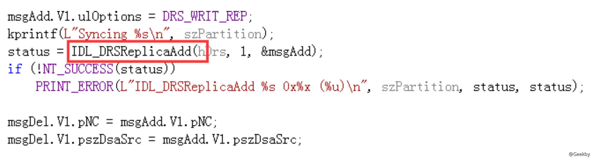
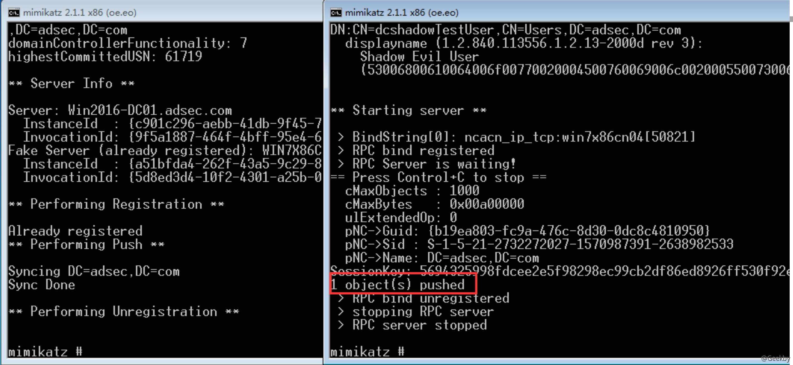

# DCShadow 攻击

2018 年 1 月 24 日，Benjamin Delpy(神器 Mimikatz 的作者)和 Vincent Le Toux 在 BlueHat IL 会议期间公布了针对域活动目录的一种新型攻击技术 `DCShadow`

在具备域管理员权限条件下，攻击者可以创建伪造的域控制器，将预先设定的对象或对象属性复制到正在运行域服务器中

DCSync 从域服务器复制出东西，DCShadow 是将数据复制至域服务器

Luc Delsalle 对这种技术进行了验证和详细的描述，并就红蓝对抗中蓝队对抗此种攻击技术的缺陷和补救方法。

从 DCShadow 目前展示的功能来看，主要只能用于红蓝对抗的隐蔽后门。但是 DCShadow 第一次澄清和实现了伪造一个 DC 的最小需求合集，这个贡献非常大。以 前很多攻击方法都卡在不能伪造域服务器，例如 MS15-011 和 MS15-014 等，有了 `DCShadow` 的基础，相信将来会有很多新的攻击方法。

## 流程

根据 Luc Delsalle 的描述，DCShadow 的攻击过程包括 3 个主要个步骤:

1、在目标域的 AD 活动目录注册一个伪造的 DC 中;

2、使伪造的 DC 被其他的 DC 认可，能够参与域复制 ;

3、强制触发域复制，将指定的新对象或修改后的对象属性同步复制到其他 DC 中;

### 注册伪造的 DC

一台机器要想注册成为域中的一台 DC 服务器，需要在域的活动目录中注册一个 `NTDS-DSA(nTDSDSA)`类对象。注册的位置为 `CN=Servers,CN=Default-First-Site-Name,CN=Sites,CN=Configuration,DC=adsec,DC=com`

adsec.com 域有 3 台域服务器，分别是 LABDC01、RESDC01 及 WIN2016-DC01，标红的正是我们实验环境的域服务器。我们测试的机器为 Win7X86cn04，测试成功的则会生成一个新的NTDS-DSA(nTDSDSA)类对象

查看 `CN=Servers,CN=Default-First-Site-Name,CN=Sites,CN=Configuration,DC=adsec,DC=com`的安全描述符，可知必须有`域管理员权限`才具备`写`权限

所以发动 DCShadow 攻击首先必须具备域管理员权限，但是我们可以通实验，做点手脚，就会好办一些，例如将完全权限赋予普通用户，则普通用户也可以修改

DC Shadow 源码：

### 注册的 DC 被其他 DC 认可，能够参与域复制

一个刚注册的 DC 要想被域中其他DC认可，能够参与域复制，需要满足 3 个条件:

1、这台伪造 DC 具备认证凭证，能认证到域，即有域内账号，可以使用机器账号，实验环境中为 `WIN7X86CN04$`;

2、伪造 DC 能认证其他 DC 来访问的账号，如果我们给 `WIN7X86CN04$` 添加 `SPN`，则可以实现这一点。关键是需要添加哪些SPN，DCShadow 的一个大贡献是找到 了 SPN 的最小合集，只需要 2 个即可:`DRS`服务(GUID 为 E3514235–4B06–11D1-AB04–00C04FC2DCD2) 和 `GS`(Global Catalog)服务

3、运行 DRS 服务，最少需要实现 IDL\_DRSBind、IDL\_DRSUnbind、IDL\_DRSGetNCChanges、IDL\_DRSUpdateRefs 这 4 个 RPC 接口，以便其他 DC 能够通过 RPC 获取需要复制的数据。Mimikatz 工具的最新版已经集成了这 4 个接口

### 强制立即发起域复制

通常负责域复制和同步的进程是 KCC 进程，默认时间是 15 分钟校验一次，如果需要复制则发起;也可以使用 Windows 域服务器自带的系统工具 repadmin，该工具会调用 DRSReplicaAdd 函数接口强制立即发起域复制，DCShadow 正是通过调用 DRSReplicaAdd 函数强制立即发起域复制

## 攻击复现

查看 `CN=Servers,CN=Default-First-Site-Name,CN=Sites,CN=Configuration,DC=adsec,DC=com` 的安全描述符，可知必须有域管理员权限才具备写权限

所以发动 `DCShadow` 攻击首先必须具备域管理员权限，但是我们可以通实验，做点手脚，就会好办一些，例如将完全权限赋予普通用户，则普通用户也可以修改

**攻击时注意防火墙的设置**
