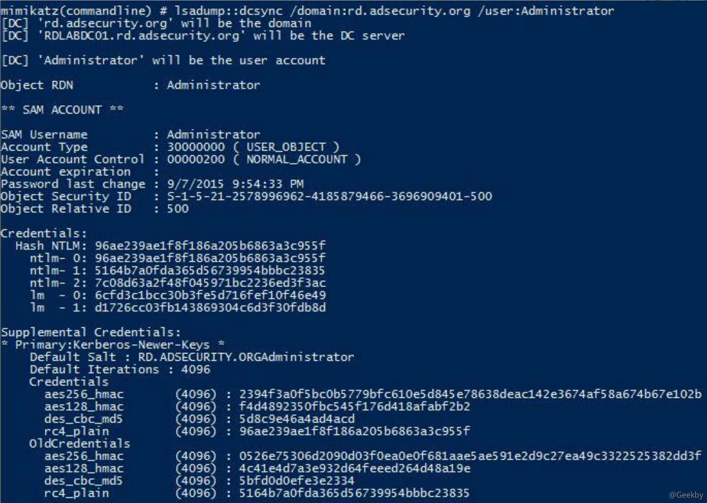

# [](#dcsync-%E6%94%BB%E5%87%BB)DCSync 攻击

2015 年 8 月，Benjamin Delpy(神器 Mimikatz 的作者)和 Vincent Le Toux 发布了新版本的 Mimikatz，新增加了 DCSync 功能。模仿一个域控制器 DC，从真实的域控制器中请求获取数据，例如账号的口令散列值等数据。

DCSync 之前，获取域的账号口令信息，需要登录域服务器，在域服务器上运行代码才可以获取。

DCSync 的最大特点，在于不用登录域服务器，即可远程通过域数据同步复制的方式获得想要的用户口令信息。

需要注意的是，DCSync 攻击的对象如果是 RODC 域控制器，则会失效，因为 RODC 是不能参与复制同步数据

## [](#%E5%8E%9F%E7%90%86)原理

DCSync 的原理非常清晰，利用域控制器之间的数据同步复制。

1.  发现网络中的目标域控制器;
    
2.  通过 DRS 服务的 GetNCChanges 接口发起数据同步请求，Directory Replication Service (DRS) Remote Protocol
    

Samba wiki 关于 GetNCChanges 的描述包括:

当一个 DC (成为客户端 DC)想从其他 DC (成为服务端 DC)获取数据时，客户端 DC 会向服务端 DC 发起一个 GetNCChanges 请求。回应的数据包括需要同步的数 据。

如果需要同步的数据比较多，则会重复上述过程。毕竟每次回应的数据有限。

## [](#%E5%89%8D%E6%8F%90)前提

一个用户想发起 DCSync 攻击，必须具备以下权限:

1、Replicating Directory Changes (DS-Replication-Get-Changes)

2、Replicating Directory Changes All (DS-Replication-Get-Changes-All)

3、Replicating Directory Changes In Filtered Set

即：默认情况下域管理员组具有该权限。


## [](#%E6%94%BB%E5%87%BB)攻击



## [](#%E9%98%B2%E5%BE%A1)防御

DCSync 攻击的原理是模拟域控制器发起服务器之间的数据同步复制。

最好的防御方法是给域控制器设置白名单。在域内，域控制器的数量、IP地址、MAC 地址是非常明确清晰的资产，将这些资产设置在允许同步的白名单内。非白名单的 IP 不允许发生数据同步

获取域内所有IP的脚本:

|     |     |     |
| --- | --- | --- |
| ```plain<br>1<br>2<br>3<br>``` | ```powershell<br>PowerShell:Get-ADDomainController -filter * \| select IPv4Address<br>或<br>[System.DirectoryServices.ActiveDirectory.Domain]::GetCurrentDomain().DomainControllers \| select IPAddress<br>``` |

在网络设备上检测来自白名单以外的域控制器数据同步复制
