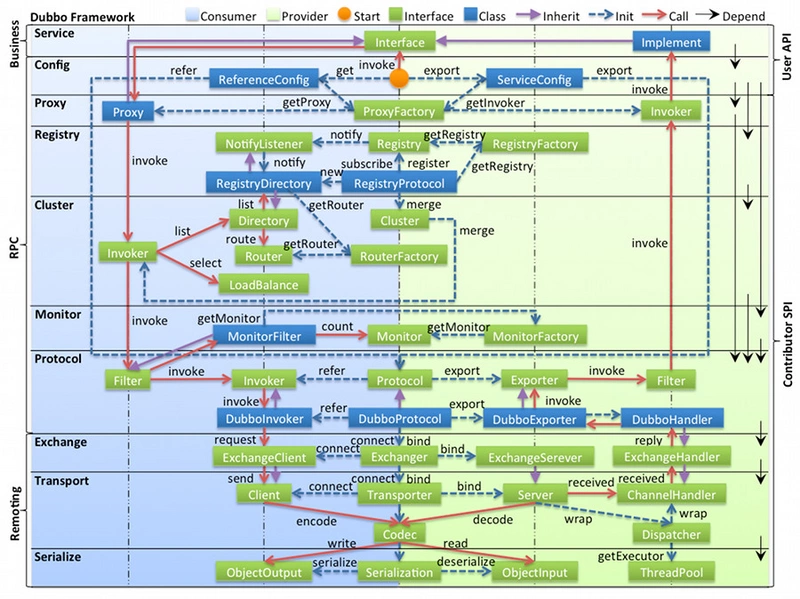
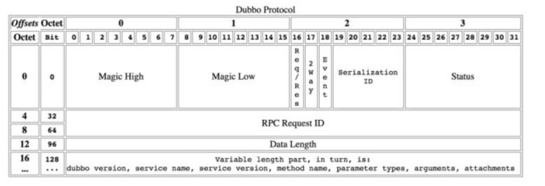
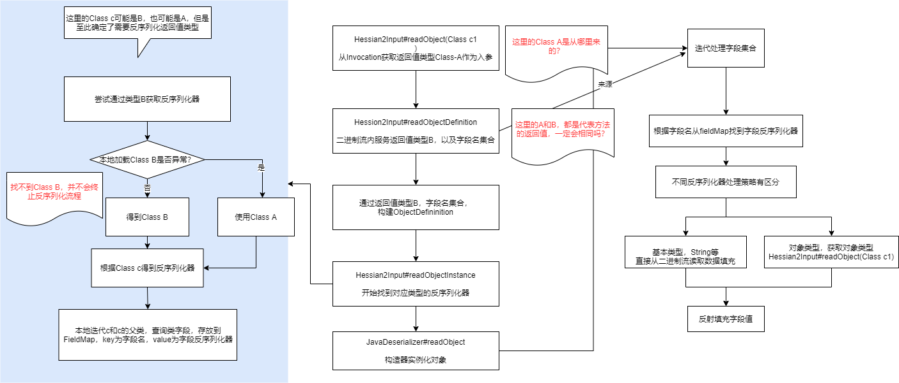

# Dubbo 编解码那些事

### 一、背景

笔者在一次维护基础公共组件的过程中，不小心修改了类的包路径。糟糕的是，这个类被各业务在facade中进行了引用、传递。幸运的是，同一个类，在提供者和消费者的包路径不一致，没有引起各业务报错。

怀揣着好奇，对于[Dubbo](https://so.csdn.net/so/search?q=Dubbo&spm=1001.2101.3001.7020)的编解码做了几次的Debug学习，在此分享一些学习经验。

#### 1.1 RPC的爱与恨

Dubbo作为Java语言的RPC框架，优势之一在于屏蔽了调用细节，能够像调用本地方法一样调用远程服务，不必为数据格式抓耳饶腮。正是这一特性，也引入来了一些问题。

比如引入facade包后出现jar包冲突、服务无法启动，更新facade包后某个类找不到等等问题。引入jar包，导致消费方和提供方在某种程度上有了一定耦合。

正是这种耦合，在提供者修改了Facade包类的路径后，习惯性认为会引发报错，而实际上并没有。最初认为很奇怪，仔细思考后才认为理应这样，调用方在按照约定的格式和协议基础上，即可与提供方完成通信。并不应该关注提供方本身上下文信息。（认为类的路径属于上下文信息）接下来揭秘Dubbo的编码解码过程。

### 二、Dubbo编解码

Dubbo默认用的netty作为通信框架，所有分析都是以netty作为前提。涉及的源码均为Dubbo - 2.7.x版本。在实际过程中，一个服务很有可能既是消费者，也是提供者。为了简化梳理流程，假定都是纯粹的消费者、提供者。

#### 2.1 In Dubbo

借用Dubbo官方文档的一张图，文档内，定义了通信和序列化层，并没有定义"编解码"含义，在此对"编解码"做简单解释。

编解码 = dubbo内部编解码链路 + 序列化层

本文旨在梳理从Java对象到二进制流，以及二进制流到Java对象两种数据格式之间的相互转换。在此目的上，为了便于理解，附加通信层内容，以encode，[decode](https://so.csdn.net/so/search?q=decode&spm=1001.2101.3001.7020)为入口，梳理dubbo处理链路。又因Dubbo内部定义为Encoder，Decoder，故在此定义为"编解码"。



无论是序列化层，还是通信层，都是Dubbo高效、稳定运行的基石，了解底层实现逻辑，能够帮助我们更好的学习和使用Dubbo框架。

#### 2.2 入口

消费者口在NettyClient#doOpen方法发起连接，初始化BootStrap时，会在Netty的pipeline里添加不同类型的ChannelHandler，其中就有编解码器。

同理，提供者在NettyServer#doOpen方法提供服务，初始化ServerBootstrap时，会添加编解码器。（adapter.getDecoder（）- 解码器，adapater.getEncoder（） - 编码器）。

**NettyClient**

```java
       /**
 * Init bootstrap
 *
 * @throws Throwable
 */
@Override
protected void doOpen() throws Throwable {
    bootstrap = new Bootstrap();
    // ...
    bootstrap.handler(new ChannelInitializer<SocketChannel>() {

        @Override
        protected void initChannel(SocketChannel ch) throws Exception {
            // ...
            ch.pipeline()
                    .addLast("decoder", adapter.getDecoder())
                    .addLast("encoder", adapter.getEncoder())
                    .addLast("client-idle-handler", new IdleStateHandler(heartbeatInterval, 0, 0, MILLISECONDS))
                    .addLast("handler", nettyClientHandler);
            // ...
        }
    });
}
```

**NettyServer**

```java
      /**
 * Init and start netty server
 *
 * @throws Throwable
 */
@Override
protected void doOpen() throws Throwable {
    bootstrap = new ServerBootstrap();
    // ...

    bootstrap.group(bossGroup, workerGroup)
            .channel(NettyEventLoopFactory.serverSocketChannelClass())
            .option(ChannelOption.SO_REUSEADDR, Boolean.TRUE)
            .childOption(ChannelOption.TCP_NODELAY, Boolean.TRUE)
            .childOption(ChannelOption.ALLOCATOR, PooledByteBufAllocator.DEFAULT)
            .childHandler(new ChannelInitializer<SocketChannel>() {
                @Override
                protected void initChannel(SocketChannel ch) throws Exception {
                    // ...
                    ch.pipeline()
                            .addLast("decoder", adapter.getDecoder())
                            .addLast("encoder", adapter.getEncoder())
                            .addLast("server-idle-handler", new IdleStateHandler(0, 0, idleTimeout, MILLISECONDS))
                            .addLast("handler", nettyServerHandler);
                }
            });
    // ...
}
```

#### 2.3 消费端链路

消费者在发送消息时编码，接收响应时解码。

**发送消息**

```java
ChannelInboundHandler
...
NettyCodecAdapter#getEncoder()
    ->NettyCodecAdapter$InternalEncoder#encode
         ->DubboCountCodec#encode
             ->DubboCodec#encode
                ->ExchangeCodec#encode
                ->ExchangeCodec#encodeRequest

DubboCountCodec类实际引用的是DubboCodec，因DubboCodec继承于ExchangeCodec，并未重写encode方法，所以实际代码跳转会直接进入ExchangeCodec#encode方法
```

**接收响应**

```java
NettyCodecAdapter#getDecoder()
    ->NettyCodecAdapter$InternalDecoder#decode
         ->DubboCountCodec#decode
             ->DubboCodec#decode
                 ->ExchangeCodec#decode
             ->DubboCodec#decodeBody
...
MultiMessageHandler#received
    ->HeartbeatHadnler#received
        ->AllChannelHandler#received
...
ChannelEventRunnable#run
    ->DecodeHandler#received
    ->DecodeHandler#decode
        ->DecodeableRpcResult#decode

解码链路相对复杂，过程中做了两次解码，在一次DubboCodec#decodeBody内，并未实际解码channel的数据，而是构建成DecodeableRpcResult对象，然后在业务处理的Handler里通过异步线程进行实际解码。
```

#### 2.4 提供端链路

提供者在接收消息时解码，回复响应时编码。

**接收消息**

```java
NettyCodecAdapter#getDecoder()
    ->NettyCodecAdapter$InternalDecoder#decode
         ->DubboCountCodec#decode
             ->DubboCodec#decode
                 ->ExchangeCodec#decode
             ->DubboCodec#decodeBody
...
MultiMessageHandler#received
    ->HeartbeatHadnler#received
        ->AllChannelHandler#received
...
ChannelEventRunnable#run
    ->DecodeHandler#received
    ->DecodeHandler#decode
        ->DecodeableRpcInvocation#decode

提供端解码链路与消费端的类似，区别在于实际解码对象不一样，DecodeableRpcResult 替换成 DecodeableRpcInvocation。

体现了Dubbo代码里的良好设计，抽象处理链路，屏蔽处理细节，流程清晰可复用。
```

**回复响应**

```java
NettyCodecAdapter#getEncoder()
    ->NettyCodecAdapter$InternalEncoder#encode
         ->DubboCountCodec#encode
             ->DubboCodec#encode
                ->ExchangeCodec#encode
                ->ExchangeCodec#encodeResponse

与消费方发送消息链路一致，区别在于最后一步区分Request和Response，进行不同内容编码
```

#### 2.5 Dubbo协议头

Dubbo支持多种通信协议，如dubbo协议，http，rmi，webservice等等。默认为Dubbo协议。作为通信协议，有一定的协议格式和约定，而这些信息是业务不关注的。是Dubbo框架在编码过程中，进行添加和解析。

dubbo采用定长消息头 + 不定长消息体进行数据传输。以下是消息头的格式定义



> **2byte：**magic，类似java字节码文件里的魔数，用来标识是否是dubbo协议的数据包。
> 
> **1byte：**消息标志位，5位序列化id，1位心跳还是正常请求，1位双向还是单向，1位请求还是响应；
> 
> **1byte：**响应状态，具体类型见com.alibaba.dubbo.remoting.exchange.Response；
> 
> **8byte：**消息ID，每一个请求的唯一识别id；
> 
> **4byte：**消息体body长度。

以消费端发送消息为例，设置消息头内容的代码见ExchangeCodec#encodeRequest。

**消息编码**

```java
protected void encodeRequest(Channel channel, ChannelBuffer buffer, Request req) throws IOException {
        Serialization serialization = getSerialization(channel);
        // header.
        byte[] header = new byte[HEADER_LENGTH];
        // set magic number.
        Bytes.short2bytes(MAGIC, header);

        // set request and serialization flag.
        header[2] = (byte) (FLAG_REQUEST | serialization.getContentTypeId());

        if (req.isTwoWay()) {
            header[2] |= FLAG_TWOWAY;
        }
        if (req.isEvent()) {
            header[2] |= FLAG_EVENT;
        }

        // set request id.
        Bytes.long2bytes(req.getId(), header, 4);

        // encode request data.
        int savedWriteIndex = buffer.writerIndex();
        buffer.writerIndex(savedWriteIndex + HEADER_LENGTH);
        ChannelBufferOutputStream bos = new ChannelBufferOutputStream(buffer);
        ObjectOutput out = serialization.serialize(channel.getUrl(), bos);
        if (req.isEvent()) {
            encodeEventData(channel, out, req.getData());
        } else {
            encodeRequestData(channel, out, req.getData(), req.getVersion());
        }
        out.flushBuffer();
        if (out instanceof Cleanable) {
            ((Cleanable) out).cleanup();
        }
        bos.flush();
        bos.close();
        int len = bos.writtenBytes();
        checkPayload(channel, len);
        // body length
        Bytes.int2bytes(len, header, 12);

        // write
        buffer.writerIndex(savedWriteIndex);
        buffer.writeBytes(header); // write header.
        buffer.writerIndex(savedWriteIndex + HEADER_LENGTH + len);
    }
```

### 三、Hessian2

前节梳理了编解码的流程，本节仔细看一看对象序列化的细节内容。

我们知道，Dubbo支持多种序列化格式，hessian2，json，jdk序列化等。hessian2是阿里对于hessian进行了修改，也是dubbo默认的序列化框架。在此以消费端发送消息序列化对象，接收响应反序列化为案例，看看hessian2的处理细节，同时解答前言问题。

####  

#### 3.1 序列化

前文提到，请求编码方法在ExchangeCodec#encodeRequest，其中对象数据的序列化为DubboCodec#encodeRequestData

**DubboCodec**

```java
@Override
protected void encodeRequestData(Channel channel, ObjectOutput out, Object data, String version) throws IOException {
    RpcInvocation inv = (RpcInvocation) data;

    out.writeUTF(version);
    // https://github.com/apache/dubbo/issues/6138
    String serviceName = inv.getAttachment(INTERFACE_KEY);
    if (serviceName == null) {
        serviceName = inv.getAttachment(PATH_KEY);
    }
    out.writeUTF(serviceName);
    out.writeUTF(inv.getAttachment(VERSION_KEY));

    out.writeUTF(inv.getMethodName());
    out.writeUTF(inv.getParameterTypesDesc());
    Object[] args = inv.getArguments();
    if (args != null) {
        for (int i = 0; i < args.length; i++) {
            out.writeObject(encodeInvocationArgument(channel, inv, i));
        }
    }
    out.writeAttachments(inv.getObjectAttachments());
}
```

我们知道，在dubbo调用过程中，是以Invocation作为上下文环境存储。这里先写入了版本号，服务名，方法名，方法参数，返回值等信息。随后循环参数列表，对每个参数进行序列化。在此，out对象即是具体序列化框架对象，默认为Hessian2ObjectOutput。这个out对象作为参数传递进来。

**那么是在哪里确认实际序列化对象呢？**

从头查看编码的调用链路，ExchangeCodec#encodeRequest内有如下代码：

**ExchangeCodec**

```java
protected void encodeRequest(Channel channel, ChannelBuffer buffer, Request req) throws IOException {
    Serialization serialization = getSerialization(channel);
    // ...
    ObjectOutput out = serialization.serialize(channel.getUrl(), bos);
    if (req.isEvent()) {
        encodeEventData(channel, out, req.getData());
    } else {
        encodeRequestData(channel, out, req.getData(), req.getVersion());
    }
    // ...
}
```

out对象来自于serialization对象，顺着往下看。在CodecSupport类有如下代码：

**CodecSupport**

```java
public static Serialization getSerialization(URL url) {
    return ExtensionLoader.getExtensionLoader(Serialization.class).getExtension(
            url.getParameter(Constants.SERIALIZATION_KEY, Constants.DEFAULT_REMOTING_SERIALIZATION));
}
```

可以看到，这里通过URL信息，基于Dubbo的SPI选择Serialization对象，默认为hessian2。再看看serialization.serialize(channel.getUrl(),bos)方法：

**Hessian2Serialization**

```java
@Override
public ObjectOutput serialize(URL url, OutputStream out) throws IOException {
    return new Hessian2ObjectOutput(out);
}
```

至此，找到了实际序列化对象，参数序列化逻辑较为简单，不做赘述，简述如下：**写入请求参数类型 → 写入参数字段名 → 迭代字段列表，字段序列化**。

#### 3.2 反序列化

相对于序列化而言，反序列化会多一些约束。序列化对象时，不需要关心接收者的实际数据格式。反序列化则不然，需要保证原始数据和对象匹配。（这里的原始数据可能是二进制流，也可能是json）。

消费端解码链路中有提到，发生了两次解码，第一次未实际解码业务数据，而是转换成DecodeableRpcResult。具体代码如下：

**DubboCodec**

```java
@Override
    protected Object decodeBody(Channel channel, InputStream is, byte[] header) throws IOException {
        byte flag = header[2], proto = (byte) (flag & SERIALIZATION_MASK);
        // get request id.
        long id = Bytes.bytes2long(header, 4);

        if ((flag & FLAG_REQUEST) == 0) {
            // decode response...
            try {
                DecodeableRpcResult result;
                if (channel.getUrl().getParameter(DECODE_IN_IO_THREAD_KEY, DEFAULT_DECODE_IN_IO_THREAD)) {
                    result = new DecodeableRpcResult(channel, res, is,
                    (Invocation) getRequestData(id), proto);
                    result.decode();
                } else {
                    result = new DecodeableRpcResult(channel, res,
                    new UnsafeByteArrayInputStream(readMessageData(is)),
                    (Invocation) getRequestData(id), proto);
                }
                data = result;
            } catch (Throwable t) {
                // ...
            }
            return res;
        } else {
            // decode request...
            return req;
        }
    }
```

**关键点**

1）对于解码请求还是解码响应做了区分，对于消费端而言，就是解码响应。对于提供端而言，即是解码请求。

2）为什么会出现两次解码？具体见这行：

```java
if (channel.getUrl().getParameter(DECODE_IN_IO_THREAD_KEY, DEFAULT_DECODE_IN_IO_THREAD)) {
    inv = new DecodeableRpcInvocation(channel, req, is, proto);
    inv.decode();
} else {
    inv = new DecodeableRpcInvocation(channel, req,
    new UnsafeByteArrayInputStream(readMessageData(is)), proto);
}
```

decode\_in\_io\_thread\_key - 是否在io线程内进行解码，默认是false，避免在io线程内处理业务逻辑，这也是符合netty的推荐做法。所以才有了异步的解码过程。

那看看解码业务对象的代码，还记得在哪儿吗？DecodeableRpcResult#decode

**DecodeableRpcResult**

```java
@Override
public Object decode(Channel channel, InputStream input) throws IOException {

    ObjectInput in = CodecSupport.getSerialization(channel.getUrl(), serializationType)
            .deserialize(channel.getUrl(), input);

    byte flag = in.readByte();
    switch (flag) {
        case DubboCodec.RESPONSE_NULL_VALUE:
            // ...
        case DubboCodec.RESPONSE_VALUE_WITH_ATTACHMENTS:
            handleValue(in);
            handleAttachment(in);
            break;
        case DubboCodec.RESPONSE_WITH_EXCEPTION_WITH_ATTACHMENTS:
            // ...
        default:
            throw new IOException("Unknown result flag, expect '0' '1' '2' '3' '4' '5', but received: " + flag);
    }
    // ...
    return this;
}

private void handleValue(ObjectInput in) throws IOException {
    try {
        Type[] returnTypes;
        if (invocation instanceof RpcInvocation) {
            returnTypes = ((RpcInvocation) invocation).getReturnTypes();
        } else {
            returnTypes = RpcUtils.getReturnTypes(invocation);
        }
        Object value = null;
        if (ArrayUtils.isEmpty(returnTypes)) {
            // This almost never happens?
            value = in.readObject();
        } else if (returnTypes.length == 1) {
            value = in.readObject((Class<?>) returnTypes[0]);
        } else {
            value = in.readObject((Class<?>) returnTypes[0], returnTypes[1]);
        }
        setValue(value);
    } catch (ClassNotFoundException e) {
        rethrow(e);
    }
}
```

这里出现了ObjectInput，那底层的序列化框架选择逻辑是怎么样的呢？如何保持与消费端的序列化框架一致？

每一个序列化框架有一个id见org.apache.dubbo.common.serialize.Constants；

> 1、请求时，序列化框架是根据Url信息进行选择，默认是hessian2
> 
> 2、传输时，会将序列化框架标识写入协议头，具体见ExchangeCodec#encodeRequest#218
> 
> 3、提供收到消费端的请求时，会根据这个id使用对应的序列化框架。

此次实际持有对象为Hessian2ObjectInput，由于readObject反序列化逻辑处理较为复杂，流程如下：



### 四、常见问题

**问题1：提供端修改了Facade里的类路径，消费端反序列化为什么没报错？**

答：反序列化时，消费端找不到提供端方返回的类路径时，会catch异常，以本地的返回类型为准做处理

**问题2：编码序列化时，没有为什么写入返回值？**

答：因为在Java中，返回值不作为标识方法的信息之一

**问题3：反序列化流程图中，A与B何时会出现不一致的情况？A的信息从何处读取？**

答：当提供端修改了类路径时，A与B会出现不一样；A的信息来源于，发起请求时，Request对象里存储的Invocation上下文，是本地jar包里的返回值类型。

**问题4：提供者增删返回字段，消费者会报错吗？**

答：不会，反序列化时，取两者字段交集。

**问题5：提供端修改对象的父类信息，消费端会报错吗？**

答：不会，传输中只携带了父类的字段信息，没有携带父类类信息。实例化时，以本地类做实例化，不关联提供方实际代码的父类路径。

**问题6：反序列化过程中，如果返回对象子类和父类存在同名字段，且子类有值，父类无值，会发生什么？**

答：在dubbo - 3.0.x版本，在会出现返回字段为空的情况。原因在于编码侧迭代传输字段集合时（消费端可能编码，提供端也可能编码），父类的字段信息在子类后面。解码侧拿到字段集合迭代解码时，通过字段key拿到反序列化器，此时子类和父类同名，那么第一次反射会设置子类值，第二次反射会设置父类值进行覆盖。

在dubbo - 2.7.x版本中，该问题已解决。解决方案也比较简单，在编码侧传输时，通过 Collections.reverse(fields)反转字段顺序。

**JavaSerializer**

```java
public JavaSerializer(Class cl, ClassLoader loader) {
        introspectWriteReplace(cl, loader);
        // ...
        List fields = new ArrayList();
        fields.addAll(primitiveFields);
        fields.addAll(compoundFields);
        Collections.reverse(fields);
        // ...
    }
```

### 五、写在最后

编解码过程复杂晦涩，数据类型多种多样。笔者遇到和了解的终究有限，以最常见、最简单的数据类型梳理编解码的流程。如有错误疏漏之处，还请见谅。

> 作者：vivo 互联网服务器团队-Sun wen
