# F5 BIG-IP身份验证绕过漏洞 CVE-2023-46747 分析

**原文链接：[Compromising F5 BIG-IP With Request Smuggling | CVE-2023-46747](https://www.praetorian.com/blog/refresh-compromising-f5-big-ip-with-request-smuggling-cve-2023-46747/ "Compromising F5 BIG-IP With Request Smuggling | CVE-2023-46747")  
译者：知道创宇404实验室翻译组**

## 概述

在对F5 BIG-IP虚拟版研究中我们发现了一个身份验证绕过漏洞，该漏洞会导致 F5 系统受到攻击，其中Traffic Management User Interface (TMUI)处于公开状态。该绕过编号为[CVE-2023-46747 ，与](https://www.cve.org/CVERecord?id=CVE-2023-46747)[CVE-2022-26377](https://www.cve.org/CVERecord?id=CVE-2022-26377)密切相关。在本文中，我们将讨论识别漏洞的方法，介绍引起该漏洞的潜在问题，并解释我们将请求走私转变为严重风险问题所采取的步骤。

### 写在前面

近期，攻击者利用在野环境中的两个重要的F5 CVE漏洞进行了攻击。其中第一个是在2020年发布的CVE-2020-5902。简单来说，这是一个 Apache httpd 服务对 URL 中的`“/..;/”`字符的解释与后端 Apache Tomcat 服务不同的问题。Orange Tsai原创研究，发现了解析器漏洞类别，并[于 2018 年在 BlackHat](https://i.blackhat.com/us-18/Wed-August-8/us-18-Orange-Tsai-Breaking-Parser-Logic-Take-Your-Path-Normalization-Off-And-Pop-0days-Out-2.pdf)上进行了展示。Orange 演示文稿中的幻灯片很好地解释了这个问题（见图 1）：

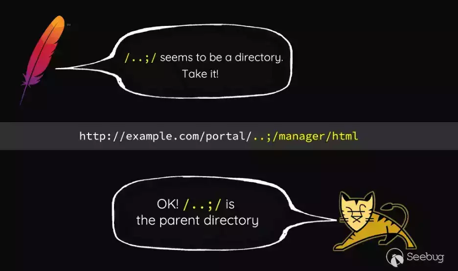

图1：Orange Tsai 的 Blackhat 2018 演示

CVE-2020-5902 的概念证明是一个简单的 HTTP 请求，用于绕过身份验证要求并向“tmshCmd.jsp”端点发送请求，该端点在系统上执行 tmsh 命令。以下是绕过身份验证的curl请求示例：

```plain
curl -k 'https://<host>:<port>/tmui/login.jsp/..;/tmui/locallb/workspace/tmshCmd.jsp?command=list+auth+user+admin'
```

攻击者在野利用了该漏洞，CISA 发布了有关该活动的[公告](https://www.cisa.gov/news-events/cybersecurity-advisories/aa20-206a)。"/tmui" API包含了与此漏洞相关的处理程序代码。

F5的第二个漏洞于2022年进行披露，编号为([CVE-2022-1388](https://my.f5.com/manage/s/article/K23605346))。由于 HTTP 逐跳标头的处理方式，设置标头“Connection: X-F5-Auth-Token”会导致“X-F5-Auth-Token”标头不会在请求中后端代码处理中出现。在没有该头部的情况下，后端代码并不会停止处理，导致请求成功通过，仿佛已经经过了身份验证。

下面的示例请求（来自此[概念证明](https://github.com/alt3kx/CVE-2022-1388_PoC)）导致代码执行"/mgmt/tm/util/bash" API是一个执行命令并返回结果的端点。

```plain
POST /mgmt/tm/util/bash HTTP/1.1
Host: <redacted>:8443
Authorization: Basic YWRtaW46
Connection: keep-alive, X-F5-Auth-Token
X-F5-Auth-Token: 0
{"command": "run" , "utilCmdArgs": " -c 'id' " }
```

此身份验证漏洞涉及 F5 BIG-IP API 的不同组件，即“/mgmt”处理程序。

F5已经修补了这两个漏洞，并进一步更新了“/tmui”API 中的相关 JSP 处理程序以限制其功能。现在，“fileRead.jsp”处理程序将不再读取任意文件（它仅限于一个非常小的子集），并且“tmshCmd.jsp”处理程序不会执行任意 tmsh 命令（它是“ilx”相关功能的一个小子集）。

## F5 BIG-IP 攻击面

我们使用一个[AWS Marketplace模板](https://aws.amazon.com/marketplace/pp/prodview-lphsy6izllsmq?sr=0-1&ref_=beagle&applicationId=AWSMPContessa)部署了默认的F5安装，并开始在服务器上识别组件。

```plain
[admin@localhost:Active:Standalone] ~ # cat /etc/os-release
NAME="CentOS Linux"
VERSION="7 (Core)"
ID="centos"
ID_LIKE="rhel fedora"
VERSION_ID="7"
PRETTY_NAME="CentOS Linux 7 (Core)"
ANSI_COLOR="0;31"
CPE_NAME="cpe:/o:centos:centos:7"
HOME_URL="https://www.centos.org/"
BUG_REPORT_URL="https://bugs.centos.org/"
CENTOS_MANTISBT_PROJECT="CentOS-7"
CENTOS_MANTISBT_PROJECT_VERSION="7"
REDHAT_SUPPORT_PRODUCT="centos"
REDHAT_SUPPORT_PRODUCT_VERSION="7"
[admin@localhost:Active:Standalone] ~ # uname -r
3.10.0-862.14.4.el7.ve.x86_64
```

根据操作系统的标志和内核版本，可以知道该设备运行在于2018年发布的CentOS 7.5-1804上。可以注意到一个特定组件的版本标志：

```plain
[admin@localhost:Active:Standalone] ~ # httpd -version
Server version: BIG-IP 67.el7.centos.5.0.0.5 (customized Apache/2.4.6) (CentOS)
Server built: Jul 11 2023 09:24:58
```

### 易受攻击的 Apache 版本

F5设备上的Apache版本是基于2.4.6版本进行定制的，开发人员需要维护大量[安全补丁](https://httpd.apache.org/security/vulnerabilities_24.html)以确保系统安全。根据之前的[Qlik Sense Enterprise 漏洞研究](https://www.praetorian.com/blog/qlik-sense-technical-exploit/)，对与HTTP请求走私相关的潜在漏洞有了额外的关注。从之前讨论过的2020年和2022年的F5漏洞中得知，前端和后端系统对请求解释方式的差异可能导致身份验证绕过问题。

确定了一个可能影响定制Apache 2.4.6版本的请求走私漏洞，即[CVE-2022-26377](https://www.cve.org/CVERecord?id=CVE-2022-26377)。有趣的是，F5 甚至在他们发布的[公开知识库文章](https://my.f5.com/manage/s/article/K000132643)中承认此漏洞是一个问题。尽管他们将受影响的主要支持版本的F5 BIG IP都列为“受影响”，但他们并没有发布修复该漏洞的补丁。我们推测，F5可能认为该问题无法被实质性地利用，以造成直接的安全影响，只存在更多假设或理论上的风险。

CVE-2022-26377 的最初的报告者写了一篇[博客文章](https://ricterz-me.translate.goog/posts/2022-03-03-a-new-attack-method-ajp-request-smuggling.txt?_x_tr_sl=auto&_x_tr_tl=en&_x_tr_hl=en&_x_tr_pto=wapp)，描述了对该漏洞的直接利用。我们决定追踪运行在服务器上的定制httpd软件中的此请求走私问题。

### AJP 和 Tomcat

下一步是确定 F5 设备是否使用 AJP。查看“/usr/share/tomcat/conf/server.xml”确认了 Tomcat 上使用了 AJP 连接器，这是请求走私漏洞的先决条件。

```plain
<Service name="Catalina">

<!-- Define an AJP 1.3 Connector on port 8009 -->

<Connector port="8009" protocol="AJP/1.3"

redirectPort="8443"

enableLookups="true"

address="127.0.0.1"

maxParameterCount="32500"

tomcatAuthentication="false" />
```

我们还观察到Apache httpd配置（/etc/httpd/conf.d/proxy\_ajp.conf）使用AJP将请求路由到运行Apache Tomcat应用程序的后端应用程序（参见图2）。

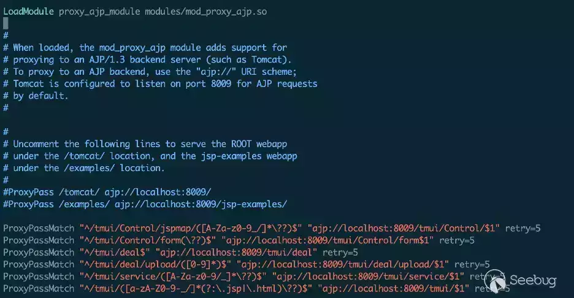

图 2：用于路由 AJP 请求的 httpd 配置

所有 AJP 路由规则都要求初始请求 URI 包含“/tmui/”端点。由于此要求，[CVE-2022-1388](https://my.f5.com/manage/s/article/K23605346)中用于从“/mgmt” API运行命令的功能将无法通过AJP请求隧道访问。

## F5 流量管理用户界面 (TMUI) 概述

F5 流量管理用户界面 (TMUI)通过Apache httpd中的 ProxyPassMatch 路由规则将所有HTTP请求路由到后端的不同服务。对于“/tmui”端点的请求最终被转发到监听在8009端口上的 AJP 服务（参见图3）。检查监听该端口的进程可以找到相关的Java进程，如图4所示。

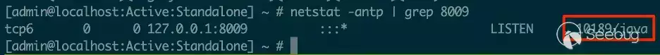

图3：Java进程监听端口8009


图4：Tomcat监听8009的java进程

查看 Tomcat 部署目录后，“tmui.xml”文件提供了有关在何处查找相关“/tmui”文件的更多信息（见图 5）。


图5：tomcat部署 XML 文件包含 TMUI 代码的基目录

在“/usr/local/www/tmui”目录中，servlet 的“web.xml”文件包含相关处理程序的映射信息，如图 6 所示：

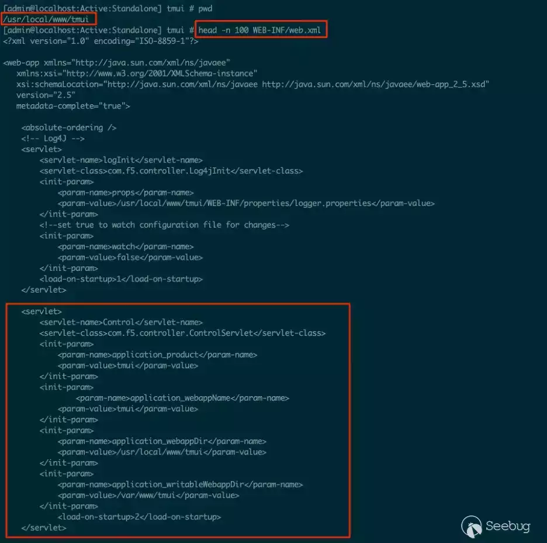

图6：Tomcat服务器的TMUI API的web.xml映射

这些文件确认Tomcat服务于监听端口8009的AJP 进程，并且“/usr/local/www/tmui”目录包含相关的 Java 代码和处理程序。

## 验证 AJP 走私

乍一看，点击任何`/tmui/` URL似乎足以触发AJP请求走私。

作为第一步，[RicterZ 的博客文章](https://ricterz-me.translate.goog/posts/2022-03-03-a-new-attack-method-ajp-request-smuggling.txt?_x_tr_sl=auto&_x_tr_tl=en&_x_tr_hl=en&_x_tr_pto=wapp)中获取了示例AJP有效负载实现，并将其指向我们知道会公开暴露的 URL——登录页面。

```plain
$ xxd raw.dat
00000000: 0008 4854 5450 2f31 2e31 0000 012f 0000  ..HTTP/1.1.../..
00000010: 0931 3237 2e30 2e30 2e31 00ff ff00 0161  .127.0.0.1.....a
00000020: 0000 5000 0000 0a00 216a 6176 6178 2e73  ..P.....!javax.s
00000030: 6572 766c 6574 2e69 6e63 6c75 6465 2e72  ervlet.include.r
00000040: 6571 7565 7374 5f75 7269 0000 012f 000a  equest_uri.../..
00000050: 0022 6a61 7661 782e 7365 7276 6c65 742e  ."javax.servlet.
00000060: 696e 636c 7564 652e 7365 7276 6c65 745f  include.servlet_
00000070: 7061 7468 0001 532f 2f2f 2f2f 2f2f 2f2f  path..S/////////
00000080: 2f2f 2f2f 2f2f 2f2f 2f2f 2f2f 2f2f 2f2f  ////////////////
00000090: 2f2f 2f2f 2f2f 2f2f 2f2f 2f2f 2f2f 2f2f  ////////////////
000000a0: 2f2f 2f2f 2f2f 2f2f 2f2f 2f2f 2f2f 2f2f  ////////////////
000000b0: 2f2f 2f2f 2f2f 2f2f 2f2f 2f2f 2f2f 2f2f  ////////////////
000000c0: 2f2f 2f2f 2f2f 2f2f 2f2f 2f2f 2f2f 2f2f  ////////////////
000000d0: 2f2f 2f2f 2f2f 2f2f 2f2f 2f2f 2f2f 2f2f  ////////////////
000000e0: 2f2f 2f2f 2f2f 2f2f 2f2f 2f2f 2f2f 2f2f  ////////////////
000000f0: 2f2f 2f2f 2f2f 2f2f 2f2f 2f2f 2f2f 2f2f  ////////////////
00000100: 2f2f 2f2f 2f2f 2f2f 2f2f 2f2f 2f2f 2f2f  ////////////////
00000110: 2f2f 2f2f 2f2f 2f2f 2f2f 2f2f 2f2f 2f2f  ////////////////
00000120: 2f2f 2f2f 2f2f 2f2f 2f2f 2f2f 2f2f 2f2f  ////////////////
00000130: 2f2f 2f2f 2f2f 2f2f 2f2f 2f2f 2f2f 2f2f  ////////////////
00000140: 2f2f 2f2f 2f2f 2f2f 2f2f 2f2f 2f2f 2f2f  ////////////////
00000150: 2f2f 2f2f 2f2f 2f2f 2f2f 2f2f 2f2f 2f2f  ////////////////
00000160: 2f2f 2f2f 2f2f 2f2f 2f2f 2f2f 2f2f 2f2f  ////////////////
00000170: 2f2f 2f2f 2f2f 2f2f 2f2f 2f2f 2f2f 2f2f  ////////////////
00000180: 2f2f 2f2f 2f2f 2f2f 2f2f 2f2f 2f2f 2f2f  ////////////////
00000190: 2f2f 2f2f 2f2f 2f2f 2f2f 2f2f 2f2f 2f2f  ////////////////
000001a0: 2f2f 2f2f 2f2f 2f2f 2f2f 2f2f 2f2f 2f2f  ////////////////
000001b0: 2f2f 2f2f 2f2f 2f2f 2f2f 2f2f 2f2f 2f2f  ////////////////
000001c0: 2f2f 2f2f 2f2f 2f2f 2f2f 000a 001f 6a61  //////////....ja
000001d0: 7661 782e 7365 7276 6c65 742e 696e 636c  vax.servlet.incl
000001e0: 7564 652e 7061 7468 5f69 6e66 6f00 0010  ude.path_info...
000001f0: 2f57 4542 2d49 4e46 2f77 6562 2e78 6d6c  /WEB-INF/web.xml
00000200: 00ff
$ curl -k -i http://our.f5.ami.ip:8443/tmui/login.jsp -H 'Transfer-Encoding: chunked, chunked' --data-binary @raw.dat
```

当我们第一次发送此有效负载时，服务器返回登录页面，这是正常且预期的响应。然后，我们利用先进的渗透测试技能多次重新运行curl命令，因为有时漏洞研究会多次执行相同的操作，但会以某种方式得到不同的结果。

在几次curl 请求之后，会偶尔收到 404 Not Found 响应。因此我们反编译了相关的 Apache .so 模块，并将其实现与修补后的 httpd 源代码进行了比较。

在这篇博文中，将进一步深入探讨AJP数据包的工作原理，但上面的示例基本与从Tomcat的ROOTwebapp（ 2020 年的默认 [PoCGhostCat 漏洞](https://paper.seebug.org/3066/(https://www.trendmicro.com/en_us/research/20/c/busting-ghostcat-an-analysis-of-the-apache-tomcat-vulnerability-cve-2020-1938-and-cnvd-2020-10487.html%20%22PoCGhostCat%20%E6%BC%8F%E6%B4%9E%22)%EF%BC%89])读取 /WEB-INF/web.xml 的内容相同）。默认情况下，F5-BIGIP 不运行 ROOT Web 应用程序，因此系统返回 404。通过在 `/usr/share/tomcat/webapps/ROOT/WEB-INF/web.xml` 显式创建文件，触发GhostCat的本地文件包含漏洞（LFI）。

```plain
$ curl -k -i https://our.f5.ami.ip:8443/tmui/login.jsp -H 'Transfer-Encoding: chunked, chunked' --data-binary @raw.dat
HTTP/1.1 200 OK
Date: Fri, 08 Sep 2023 19:57:12 GMT
Server: Apache
X-Frame-Options: SAMEORIGIN
Strict-Transport-Security: max-age=16070400; includeSubDomains
Accept-Ranges: bytes
ETag: W/"60-1694202750000"
Last-Modified: Fri, 08 Sep 2023 19:52:30 GMT
Content-Type: application/xml
Content-Length: 60
X-Content-Type-Options: nosniff
X-XSS-Protection: 1; mode=block
Content-Security-Policy: default-src 'self'  'unsafe-inline' 'unsafe-eval' data: blob:; img-src 'self' data:  http://127.4.1.1 http://127.4.2.1
Cache-Control: no-store
Pragma: no-cache
<Contents of File we wrote to /usr/share/tomcat/webapps/ROOT/WEB-INF/web.xml/>
```

此时，我们知道 AJP 走私在当前版本的 F5-BIGIP 设备上已存在；在利用层面，需要了解 AJP 走私 CVE-2022-26377 的实际运作方式。

## AJP 走私服务器解释

Apache httpd对CVE-2022-26377的描述中[指出，](https://httpd.apache.org/security/vulnerabilities_24.html#CVE-2022-26377) “Apache HTTP Server的mod\_proxy\_ajp存在不一致的HTTP请求解释（'HTTP Request Smuggling'）漏洞，允许攻击者将请求走私到其转发请求的 AJP 服务器。此问题影响 Apache HTTP Server 2.4 版本 2.4.53 及之前的版本。” 我们希望在F5 httpd服务上发现一个请求走私问题，以提供所需的绕过身份验证来完全妥协设备。

该[博客文章](https://ricterz-me.translate.goog/posts/2022-03-03-a-new-attack-method-ajp-request-smuggling.txt?_x_tr_sl=auto&_x_tr_tl=en&_x_tr_hl=en&_x_tr_pto=wapp) 描述了 AJP 走私是如何发生的，但其对“为什么”发生的解释并不完全正确。

### 正常AJP消息处理

从 httpd 服务发送到后端 AJP 侦听器的二进制 AJP 消息以字节“0x12”“0x34”开头，后跟两字节消息长度，最后是“数据”。消息的第 5 个字节包含“Code”，该值确定 AJP 请求的类型。HTTP 转发请求的代码是值“0x2”。HTTP 转发请求的第 6 个字节对请求的 HTTP进行编码。GET请求是 0x2，POST 请求是 0x4，依此类推。其余消息数据对 AJP 属性和 HTTP 请求信息进行编码。

POST 请求还可能包含正文内容。AJP 协议将 POST 正文内容编码为其自己的特殊数据消息。首字节与之前相同，为字节“0x1234”，接着是两个字节的消息长度，第5和第6字节不同。消息的其余部分是 POST 正文数据。从httpd服务发送到AJP侦听器的典型AJP POST消息将如下所示，连续发送两个数据包（参见图7、8和9）。


图 7：发送至服务器的标准 AJP 消息


图 8：发送到服务器的 AJP 数据消息（用于发送 POST 正文内容）

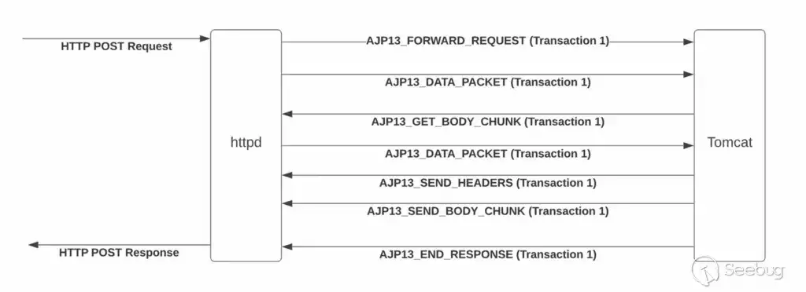

图 9：httpd 和 Tomcat 之间的标准数据流

在第一个消息的“数据”包中编码了一个“Content-Length”头，其长度与POST主体数据的长度相匹配。当 Tomcat AJP 侦听器看到“Content-Length”标头时，它会从输入流中读取另一个 AJP 数据包并将其解释为数据包。然后进行一个简短的交换，它将其中一条消息发送回 httpd 并请求更多的正文内容，而httpd 服务器用另一个长度为零的数据包回复该内容。最后，Tomcat AJP 服务器将预期的 HTTP 响应发送回原始请求。图 10 显示了 Wireshark 中的情况。

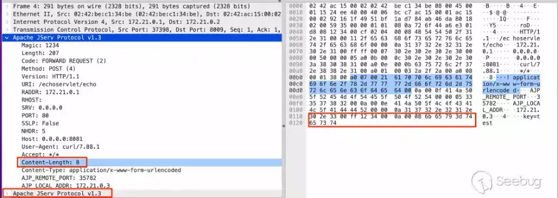

图 10：发送到服务器的两条 AJP 消息代表 HTTP Post 请求

请注意消息中的“Content-Length”值，以及底部的 Apache JServ 协议消息，它是POST主体内容的数据包。

负责 AJP 消息处理的代码位于[AjpProcessor 实现](https://github.com/apache/tomcat/blob/8.5.x/java/org/apache/coyote/ajp/AjpProcessor.java)中，如图 11 所示。


图 11：AJP 处理器中的服务方法

该服务方法从套接字连接读取消息。当它看到“Content-Length”标头时，会设置“contentLengthSet”变量，并注意到在处理过程中需要读取主体内容（参见图12）。

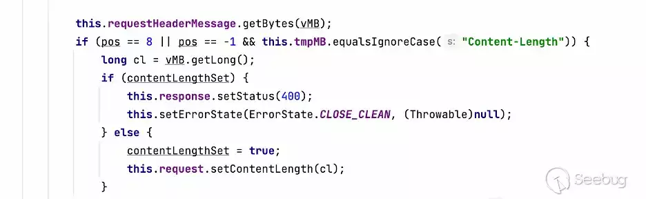

图 12：处理 AJP 消息时检查 Content-Length 标头

最终，主体内容被读取并进行处理，它直接从套接字连接中获取（如上文的第二个消息，在图13中再次显示）。


图 13：预期POST 主体数据 AJP 消息

### 走私 AJP 进程

当对 Apache httpd 服务的原始请求包含值为“chunked, chunked”的“Transfer-Encoding”标头时，会出现 CVE-2022-26377。值“chunked, chunked”是有效的“Transfer-Encoding”标头。当[Apache](https://github.com/apache/httpd/blob/trunk/modules/http/http_core.c)接收到同时包含"Transfer-Encoding"和"Content-Length"标头的请求时，它会从发送给后端AJP服务器的请求中移除"Content-Length"头，如图14所示。

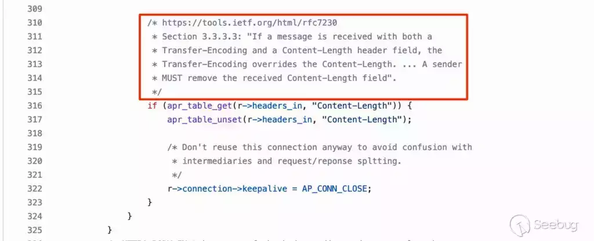

图 14：Apache 处理“Content-Length”和“Transfer-Encoding”标头

因此，转发到[Apache mod\_proxy\_ajp](https://github.com/apache/httpd/blob/2.4.50/modules/proxy/mod_proxy_ajp.c)的请求不包含“Content-Length”标头。首先，httpd AJP 处理器将请求及其标头发送到后端。然后[mod\_proxy\_ajp](https://github.com/apache/httpd/blob/2.4.50/modules/proxy/mod_proxy_ajp.c)检查检查是否存在"Transfer-Encoding"头，以及它是否完全匹配"chunked"（请参见图15）。由于它正在处理的标头的“chunked, chunked”值不匹配，因此会继续执行else分支的剩余部分，并将 POST主体内容作为 AJP 数据包直接发送到后端服务器（见图 16）。

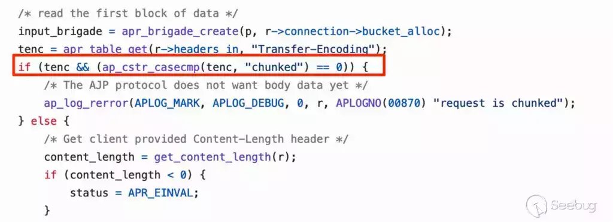

图 15：Apache httpd mod\_proxy\_ajp 将“Transfer-Encoding”值与“chunked”进行比较

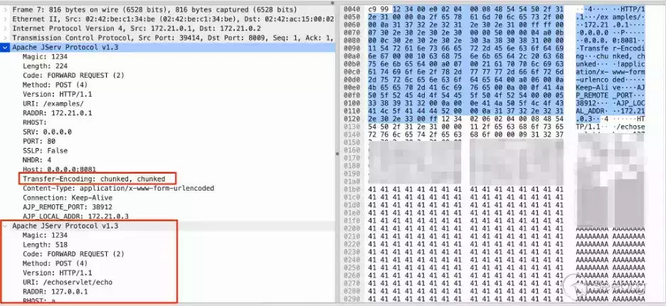

图 16：走私的 AJP 消息

在httpd服务遇到"chunked, chunked" Transfer-Encoding后，它发送了图17和图18中的两条消息。注意，Data Length是攻击者控制的POST主体的长度，并且POST主体就是攻击者控制的POST主体。


图 17：发送走私请求时的第一个 AJP 数据包


图 18：发送走私请求时的第二个 AJP 数据包

处理消息的 Tomcat AJP 服务在图19中接收到第一条消息：


图 19：第一个收到的 AJP 数据包消息

但是，正如我们之前引用的 Wireshark 截图所示，AJP 消息不包含“Content-Length”标头。Tomcat 服务器不会读取任何帖子POST主体数据，而 httpd 发送的第二条消息仍然位于套接字上。处理完第一条消息后，整个循环继续，并从套接字中读取另一条消息（见图 20）。


图 20：AJP处理程序中的处理循环

AJP 处理程序读取的下一条（走私）消息与发送该消息的 httpd 服务消息类似（参见图 21）：


图 21：httpd服务器认为它正在作为 AJP 消息发送的内容

但 Tomcat AJP 处理器会消耗攻击者控制的消息，如图 22所示。


图 22：AJP 处理器对走私的 AJP 消息解释

这种混淆导致了CVE-2022-26377的产生。如果我们提交一条 POST主体长度为 0x204 的消息（0x2 是 FORWARD\_REQUEST 代码，0x4 是 HTTP POST 方法），那么 Tomcat AJP 监听器会将相应的数据解释为 AJP POST 请求，并发送到我们想要的位置。这种混淆会导致请求走私，其中一个限制是消息长度必须恰好为0x204才能被解释为POST请求，图23说明了新的流程。

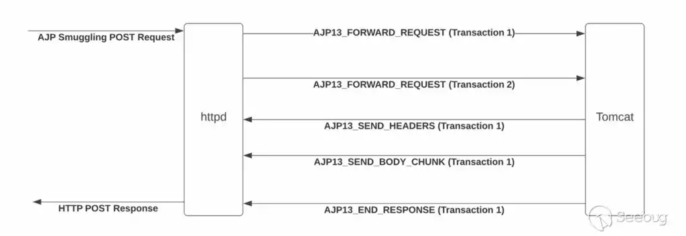

图 23：走私的 AJP 请求流程

## 消息走私处理

那么，通过发送任意AJP数据包，我们到底可以做些什么呢？Tomcat AJP 连接器是一种将 Web 请求内容定向到后端 Java servlet 的机制。这些servlet 包含常规的后端处理逻辑。他们期望 HttpServletRequest 对象包含有关请求的所有信息，并使用HttpServletResponse对象将响应信息写入其中。

在标准用例中，AJP 会使用 Apache 填充的属性填充 HttpServletRequest 对象的内容。其中包括有关 Apache 验证的用户、请求包含的标头以及提供的参数等信息，AJP 还包含用户提供的请求 URI。Tomcat 使用此 URI 来执行请求映射并确定要调用哪个 HttpServlet 实现。

可以从F5-BIGIP的Tomcat安装中提取的反编译的tmui.jar中看到更具体例子，如图24所示：

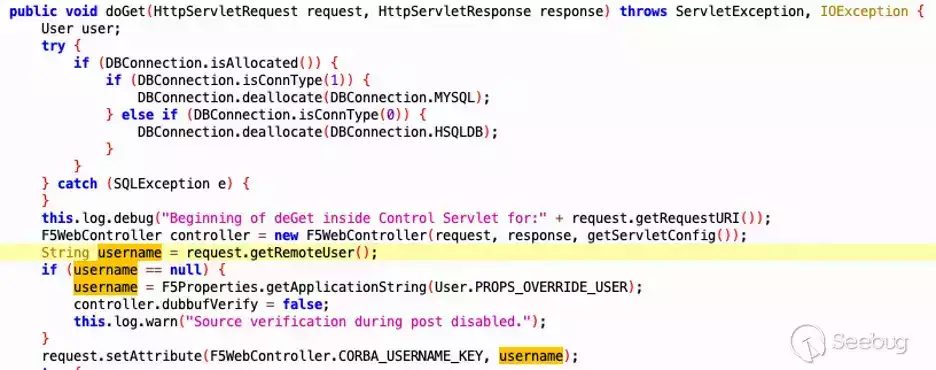

图 24：控制servlet的doGet逻辑

通常情况下，`username`字符串是根据Apache在验证用户凭据后设置的属性来填充的，例如`request.getRemoteUser()`。然而，在发送一个欺骗的AJP数据包的情况下，我们可以在没有进行身份验证的情况下控制`username`的值。

如果我们能够将任意数据作为AJP数据包发送，那么就可以调用任意带有完全任意内容的Servlet。假设我们欺骗的应用程序具有对服务器的完全管理员权限，这将足以威胁到F5-BIGIP设备的安全。然而，由于走私的工作方式，我们在发送请求时遇到了一些限制。

### 局限性

首先，POST 请求必须恰好为 0x204 字节 (518字节)。如果要发送的数据较少，我们可以通过填充来达到指定长度，但我们无法发送超过 0x204 字节的内容。此外，我们实际上无法发送任何POST主体内容。尝试找到绕过此限制的方法，但未成功。破坏 Apache 前端和 Tomcat 后端之间的控制流意味着我们无法让前端等待`AJP_SEND_BODY`消息。最后，只能路由到“/tmui”API 中的端点。我们无法将请求走私到运行任意命令的“/mgmt/tm/util/bash”端点。

我们花了一些时间检查“/tmui”代码中是否存在我们可以利用的漏洞来执行代码。虽然确定了一些有趣的攻击面，例如一些经典 Java 反序列化攻击的潜在路径，但由于缺乏发送 POST 主体的能力，无法到达这些代码路径（见图 25）。

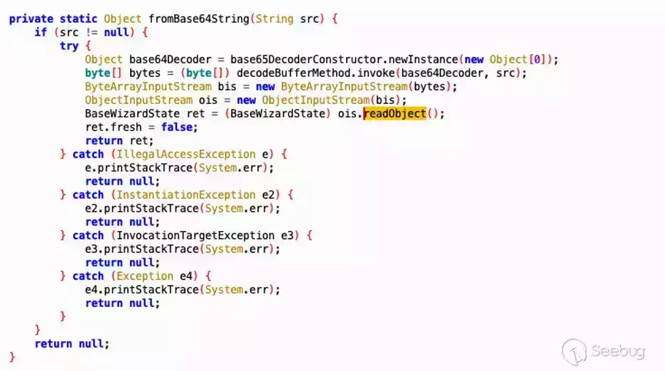

图 25：希望触发的这个潜在的反序列化路径

最终，我们意识到为自己创建一个用户可能会更容易。

## 创建用户 Creating a User

在审查 Burp 中的代理请求时，我们注意到创建用户工作流程向“/tmui”API 发送了一个请求，如图 26 所示。通过 AJP 请求走私，我们可以向“/tmui”API 发送请求，因此我们决定进一步了解该请求的具体内容。

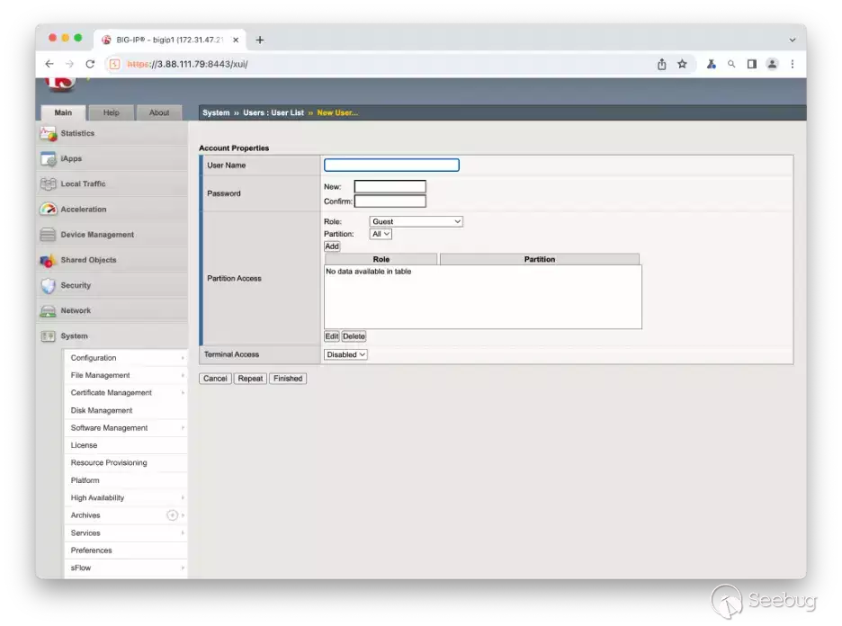

图 26：创建用户用户界面

在系统管理选项卡中创建了一个新用户来观察相应的API调用。查看 Burp 代理历史记录后，发现了一个发送到“/tmui/Control/form”的 POST 请求，并且似乎包含新用户请求的相关参数（用户名、密码、权限）。由于请求发送到“/tmui...”，因此能够走私请求到相关的处理程序，如图27所示。

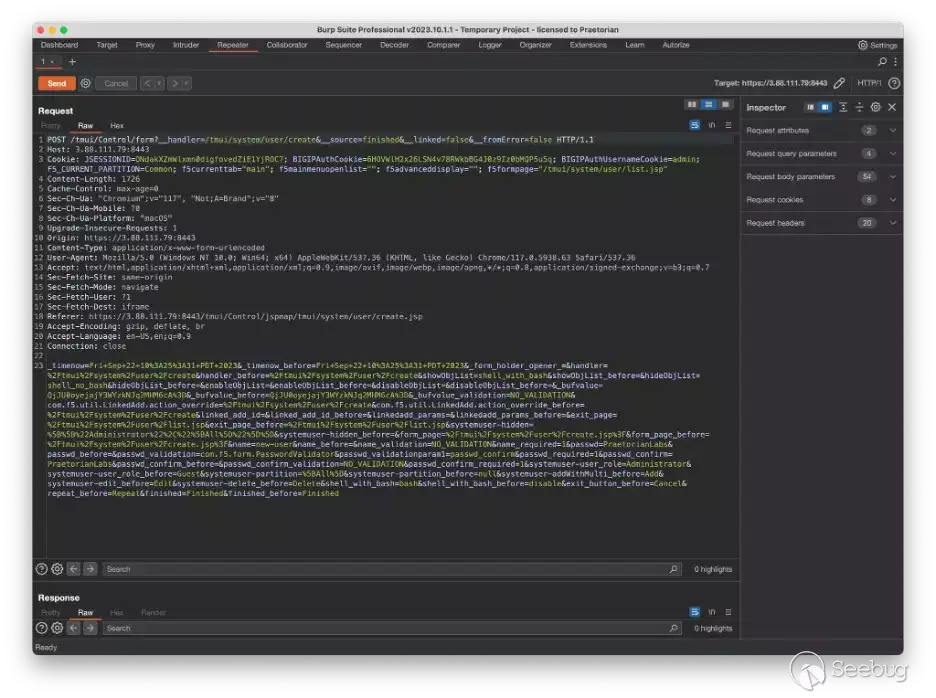

图 27：创建用户 POST 请求

### 克服三个障碍

验证了该请求是否在后端创建了一个新的管理员用户，并发送了另一个请求以确保它是唯一需要的请求。然而，我们注意到了几个重要的属性，这些属性将阻止我们复制和走私相同的请求到后端。首先，内容本身作为 POST 主体发送，走私的 AJP 请求将无法正确发送 POST 主体内容。其次，该请求包含一个在我们登录应用程序后设置的 Cookie，因此我们需要确定是否有其他方法可以在没有该 Cookie 的情况下对代码的相关部分进行身份验证。最后，POST主体Content-Length为1726字节，这远远大于我们严格的518字节要求（该字节数还必须包括所有相关的HTTP标头）。

##### 一：发送没有主体的 POST

为了解决数据发送在POST主体中的问题，我们使用 Burp 的“更改请求方法”功能将 POST 请求转换为 GET 请求

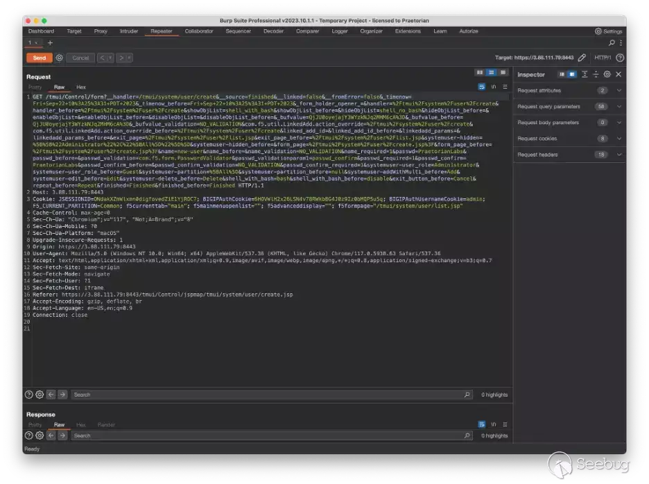

图 28：将 POST 请求更改为 GET 请求

直接将其作为 GET 请求发送不起作用，因为服务器返回了 404 响应。但我们可以简单地将其更改回 POST 请求，并使用请求查询参数而不是请求正文参数。尝试了这个方法，并且后端服务器成功处理了它。因此，将POST主体内容作为请求查询参数发送确实起到了作用，并解决了以上三个问题中的第一个问题。

##### 二：成为管理员

当 F5 Java servlet 处理传入的 POST 请求时（在 com.f5.controller 的 doGet 方法中），它处理了一个由走私的 AJP 消息构造的请求。[这些AJP 属性](https://tomcat.apache.org/tomcat-3.3-doc/AJPv13.html#prefix-codes)之一是“remote\_user”，它直接编码在 AJP 请求中。将该属性设置为“admin”，因此图 29（第二个亮点）中的“request.getRemoteUser()”调用返回“admin”。

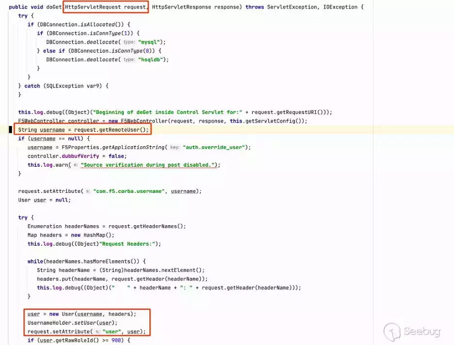

图 29：相关 TMUI AJP 处理程序的 doGet 实现

然而，仅仅设置这个AJP属性是不足够的，让请求被处理为管理员请求。在 doGet 方法中，通过 User(username, headers) 调用构造一个新的用户对象。查看该函数的实现，看到它有一个 REMOTEROLE 标头，其值被分配为创建的用户的用户角色。如果标头不存在，应用程序将检查“auth.override\_role”属性。因为F5实例默认情况下并没有定义该自定义属性的值，走私请求失败。所以为了成功创建用户，我们只需要向走私的AJP请求中添加一个值为“0”的“REMOTEROLE”头，如图30所示。

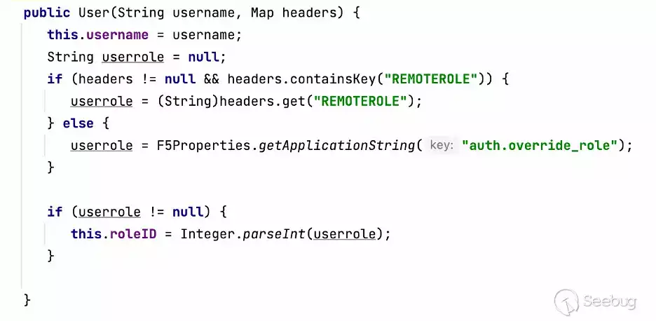

图 30：检查 REMOTEROLE 标头的用户创建函数

通过将AJP请求中的“remote\_user”属性和REMOTEROLE头的值正确设置，后端TMUI处理程序将走私的请求作为管理员用户处理。这解决了我们三个限制中的第二个问题。

##### 三：在 518 字节内容纳一个请求

现在，只剩下第三个限制，即请求大小的问题。回想一下，为了让系统将走私请求作为 POST 进行处理，其长度必须恰好为 518 字节。Burp 显示，当在用户界面中创建新用户时发送的创建用户请求的正文长度为 1726 字节，大大超出了的可用容量。当我们将 POST 正文转换为请求查询参数时，长度为 2022 字节。

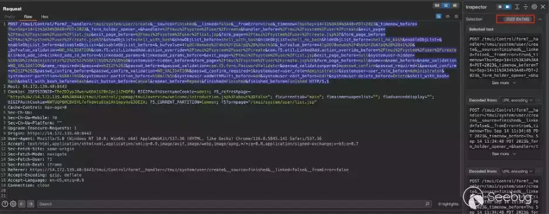

图 31：需要修剪的请求

我们逐步删除一些参数，例如“exit\_button\_before”和“enableObjList”。删除它们后，重新发送请求并检查它是否仍然创建了新用户，然后再次重复这个过程。我们发现某些参数是必需的，但处理代码只检查它们的存在与否，从未读取值。在这些情况下，我们将值减少为单个字符以节省空间。经过一些试错，能够将请求的大小减少到大约 400 字节。

我们对 400 字节的 AJP POST 请求进行了适当的编码（包括前面一节中提到的标头，以及 CSRF 保护所需的其他一些标头），并且所有这些都符合 518 的限制。事实上，我们最终需要将请求填充到 518 字节。现在，有了一个请求，可以发送并创建具有我们提供的凭据的新管理员用户。

## 执行命令

发送走私请求以创建有效的管理员凭据后，我们可以使用标准身份验证流程对 F5 系统进行身份验证，并通过“mgmt”API 运行任意命令。最简单的方法是使用以下 [F5 支持文章中](https://community.f5.com/t5/technical-forum/native-tmsh-bash-commands-via-rest-api/td-p/118662)描述的简单curl请求。

```plain
curl -sk -u 'USER:PASS' -H 'Content-Type: application/json' -X POST \
-d '{"command": "run", "utilCmdArgs": "-c \"whoami\""}'  \
https://$IP:8443/mgmt/tm/util/bash
```

## 结论

一个看似影响较低的请求走私漏洞，在两个不同的服务将身份验证责任交给对方时可能会变成严重问题。向“后端”服务发送请求，而该服务假设“前端”已处理了身份验证，可能导致某些有趣的行为。如果对这些请求走私漏洞感兴趣，可点击文章：第一个[严重风险问题](https://www.praetorian.com/blog/qlik-sense-technical-exploit/)和[补丁绕过](https://www.praetorian.com/blog/doubleqlik-bypassing-the-original-fix-for-cve-2023-41265/)。

- - -

 本文由 Seebug Paper 发布，如需转载请注明来源。本文地址：[https://paper.seebug.org/3066/](https://paper.seebug.org/3066/)
