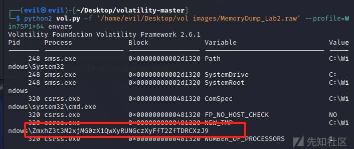
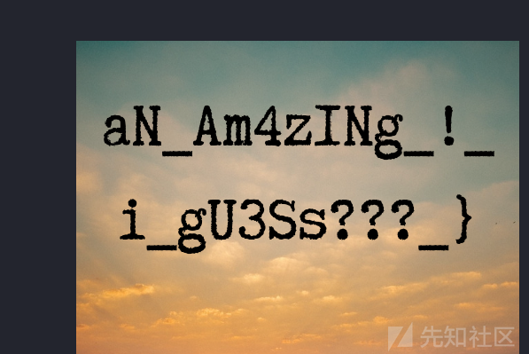

# Forenscis MemLabs Labs WriteUp - 先知社区

Forenscis MemLabs Labs WriteUp

- - -

## 前言

之前在打美亚杯之前，还抽空从Github上翻到了一个国外的内存取证靶场，感觉质量和正常的赛题比较相似的，也考察的很刁钻，感觉对于volatility这个工具的使用有了更深入的了解，而且也考察了信息搜集能力，这个靶场还是不错的。

## Lab1 Beginner's Luck

附件下载地址：[MEGA](https://mega.nz/#!6l4BhKIb!l8ATZoliB_ULlvlkESwkPiXAETJEF7p91Gf9CWuQI70)

**description**

```plain
My sister's computer crashed. We were very fortunate to recover this memory dump. Your job is get all her important files from the system. From what we remember, we suddenly saw a black window pop up with some thing being executed. When the crash happened, she was trying to draw something. Thats all we remember from the time of crash.
```

**Note**: This challenge is composed of 3 flags.

**Analysis**

先看一下镜像版本(这边我用的vol2分析的)

```plain
python2 vol.py -f '/home/evil/Desktop/vol images/MemoryDump_Lab1.raw'  imageinfo
```

[](https://xzfile.aliyuncs.com/media/upload/picture/20231126182003-5d215f60-8c45-1.png)

### flag1

这里先利用cmdline系统命令行都输入了什么内容以及使用情况cmdscan

[](https://xzfile.aliyuncs.com/media/upload/picture/20231126182009-609d75ca-8c45-1.png)

[](https://xzfile.aliyuncs.com/media/upload/picture/20231126182017-6574d84a-8c45-1.png)

再看一下命令行的输出情况

[](https://xzfile.aliyuncs.com/media/upload/picture/20231126182023-690bda9e-8c45-1.png)

一眼flag，Cyber解密一下

```plain
flag{th1s_1s_th3_1st_st4g3!!}
```

### flag2

pslist看一下进程

[](https://xzfile.aliyuncs.com/media/upload/picture/20231126182029-6caa3dda-8c45-1.png)

这个进程是画图软件，和其他的常规软件一对比还是很可疑的

memdump将这个进程dump下来，之后file一下，发现是一些data数据，转化一下格式，之后考虑用gimp打开

[](https://xzfile.aliyuncs.com/media/upload/picture/20231126182034-6f495a76-8c45-1.png)

这里用gimp处理一下，换一下图像类型，调整一下宽度和高度

[](https://xzfile.aliyuncs.com/media/upload/picture/20231126182039-729260c4-8c45-1.png)

发现有flag的样子了，处理一下

[](https://xzfile.aliyuncs.com/media/upload/picture/20231126182044-75540d80-8c45-1.png)

```plain
flag{G00d_BoY_good_girL}
```

### flag3

filescan找一下常规的txt,png,rar,zip,jpg文件

```plain
python2 vol.py -f '/home/evil/Desktop/vol images/MemoryDump_Lab1.raw'  --profile=Win7SP1x64 filescan | grep -E "txt|png|zip|jpg|rar"
```

[](https://xzfile.aliyuncs.com/media/upload/picture/20231126182049-7814048a-8c45-1.png)

这里找到一个rar文件，导出看一下

[](https://xzfile.aliyuncs.com/media/upload/picture/20231126182057-7cd8cd0c-8c45-1.png)

提示我们要看NTLM hash值，利用hashdump看一下

[](https://xzfile.aliyuncs.com/media/upload/picture/20231126182301-c71abfe2-8c45-1.png)

转为大写

```plain
F4FF64C8BAAC57D22F22EDC681055BA6
```

[](https://xzfile.aliyuncs.com/media/upload/picture/20231126182307-ca51375e-8c45-1.png)

```plain
flag{w3ll_3rd_stage_was_easy}
```

## Lab2 A New World

附件下载地址:[MEGA](https://mega.nz/#!ChoDHaja!1XvuQd49c7-7kgJvPXIEAst-NXi8L3ggwienE1uoZTk)

**description**

```plain
One of the clients of our company, lost the access to his system due to an unknown error. He is supposedly a very popular "environmental" activist. As a part of the investigation, he told us that his go to applications are browsers, his password managers etc. We hope that you can dig into this memory dump and find his important stuff and give it back to us.
```

**Note**: This challenge is composed of 3 flags.

**Analysis**

先imageinfo看一下镜像的版本

```plain
python2 vol.py -f '/home/evil/Desktop/vol images/MemoryDump_Lab2.raw'  imageinfo
```

[](https://xzfile.aliyuncs.com/media/upload/picture/20231126182315-cf939dba-8c45-1.png)

### flag1

查看环境变量得到flag

```plain
python2 vol.py -f '/home/evil/Desktop/vol images/MemoryDump_Lab2.raw'  --profile=Win7SP1x64 envars
```

[](https://xzfile.aliyuncs.com/media/upload/picture/20231126182356-e8192364-8c45-1.png)

```plain
flag{w3lc0m3_T0_$T4g3_!_Of_L4B_2}
```

### flag2

pslist看一下进程,发现有一些浏览器记录，iehistory看一下历史记录

```plain
python2 vol.py -f '/home/evil/Desktop/vol images/MemoryDump_Lab2.raw'  --profile=Win7SP1x64 iehistory
```

[](https://xzfile.aliyuncs.com/media/upload/picture/20231126194650-7cb27524-8c51-1.png)

这边常规搜索png,jpg,txt之类的文件，发现有一个password.png，dumpfiles导出看一下

[](https://xzfile.aliyuncs.com/media/upload/picture/20231126194732-95d807b2-8c51-1.png)

得到一个passwd的图片，常规图片隐写也尝试了一下，发现无果

尝试导出第一个txt，发现没有进程号，之后导出Hidden.kdbx，发现是一个被KeePass加密后的数据库，考虑passwd就是刚刚图片上的密码

```plain
P4SSw0rd_123
```

进行解密找到flag2

[](https://xzfile.aliyuncs.com/media/upload/picture/20231126194739-99bd781c-8c51-1.png)

```plain
flag{w0w_th1s_1s_Th3_SeC0nD_ST4g3_!!}
```

### flag3

cmdline看一下命令行，发现有很多谷歌浏览器的记录

[](https://xzfile.aliyuncs.com/media/upload/picture/20231126194747-9eab8558-8c51-1.png)

看一下历史记录，chromehistory

```plain
python2 vol.py -f '/home/evil/Desktop/vol images/MemoryDump_Lab2.raw'  --profile=Win7SP1x64 chromehistory
```

[](https://xzfile.aliyuncs.com/media/upload/picture/20231126194753-a20404be-8c51-1.png)

发现是一个下载连接，得到一个zip文件

[](https://xzfile.aliyuncs.com/media/upload/picture/20231126194826-b5de18b2-8c51-1.png)

提示我们passwd是Lab-1的第三部分Flag的SHA1值，计算一下

[](https://xzfile.aliyuncs.com/media/upload/picture/20231126194831-b8a9be52-8c51-1.png)

得到flag3

[](https://xzfile.aliyuncs.com/media/upload/picture/20231126194838-bd37fc7c-8c51-1.png)

```plain
flag{oK_So_Now_St4g3_3_is_DoNE!!}
```

## Lab3 The Evil's Den

附件下载地址:[Download - MEGA](https://mega.nz/file/2ohlTAzL#1T5iGzhUWdn88zS1yrDJA06yUouZxC-VstzXFSRuzVg)

**description**

```plain
A malicious script encrypted a very secret piece of information I had on my system. Can you recover the information for me please?
```

**Note-1**: This challenge is composed of only 1 flag. The flag split into 2 parts.

**Note-2**: You'll need the first half of the flag to get the second.

**Analysis**

先看一下镜像版本

```plain
python2 vol.py -f '/home/evil/Desktop/vol images/MemoryDump_Lab3.raw'  imageinfo
```

[](https://xzfile.aliyuncs.com/media/upload/picture/20231126194849-c348b322-8c51-1.png)

### flag1

这边cmdline发现有两个可疑的文件，好像就是题目所说的恶意脚本

[](https://xzfile.aliyuncs.com/media/upload/picture/20231126194856-c761beea-8c51-1.png)

dump一下，之后看一下加密逻辑

```plain
import sys
import string

def xor(s):

    a = ''.join(chr(ord(i)^3) for i in s)
    return a


def encoder(x):

    return x.encode("base64")


if __name__ == "__main__":

    f = open("C:\\Users\\hello\\Desktop\\vip.txt", "w")

    arr = sys.argv[1]

    arr = encoder(xor(arr))

    f.write(arr)

    f.close()
```

vip.txt

```plain
am1gd2V4M20wXGs3b2U=
```

写一个逆向脚本

```plain
import sys
import string
from qsnctf import *

cipher='am1gd2V4M20wXGs3b2U='

def xor(s):

    a = ''.join(chr(ord(i)^3) for i in s)
    return a


def decoder(x):

    return x.decode("base64")

flag=xor(base64_decode(cipher))
print(flag)
```

得到

```plain
inctf{0n3_h4lf
```

还有一半flag

### flag2

filescan发现桌面上还有一个jpeg文件，导出利用steghide无密码解密得到一个txt，得到flag2

[](https://xzfile.aliyuncs.com/media/upload/picture/20231126194907-cdeb37e6-8c51-1.png)

```plain
inctf{0n3_h4lf_1s_n0t_3n0ugh}
```

## Lab4 Obsession

附件下载地址:[Download - MEGA 93%](https://mega.nz/file/Tx41jC5K#ifdu9DUair0sHncj5QWImJovfxixcAY-gt72mCXmYrE)

**description**

```plain
My system was recently compromised. The Hacker stole a lot of information but he also deleted a very important file of mine. I have no idea on how to recover it. The only evidence we have, at this point of time is this memory dump. Please help me.
```

**Note**: This challenge is composed of only 1 flag.

**Analysis**

先看一下镜像版本

```plain
python2 vol.py -f '/home/evil/Desktop/vol images/MemoryDump_Lab4.raw'  imageinfo
```

[](https://xzfile.aliyuncs.com/media/upload/picture/20231126194921-d6d14ed6-8c51-1.png)

根据题目的描述，这个题目是要我们恢复被删除的文件，可以利用mftparser，得到

### flag

[](https://xzfile.aliyuncs.com/media/upload/picture/20231126194931-dc55dbb0-8c51-1.png)

```plain
ctf{1_is_n0t_EQu4l_7o_2_bUt_th1s_d0s3nt_m4ke_s3ns3}
```

## Lab5 Black Tuesday

附件下载地址:[Download - MEGA](https://mega.nz/file/Ps5ViIqZ#UQtKmUuKUcqqtt6elP_9OJtnAbpwwMD7lVKN1iWGoec)

**Description**

```plain
We received this memory dump from our client recently. Someone accessed his system when he was not there and he found some rather strange files being accessed. Find those files and they might be useful. I quote his exact statement,

The names were not readable. They were composed of alphabets and numbers but I wasn't able to make out what exactly it was.

Also, he noticed his most loved application that he always used crashed every time he ran it. Was it a virus?
```

**Note-1**: This challenge is composed of 3 flags. If you think 2nd flag is the end, it isn't!! :P

**Note-2**: There was a small mistake when making this challenge. If you find any string which has the string "***L4B\_3\_D0n3\\*!!**" in it, please change it to "***L4B\_5\_D0n3\\*!!**" and then proceed.

**Note-3**: You'll get the stage 2 flag only when you have the stage 1 flag.

**Analysis**

先看一下版本号

```plain
python2 vol.py -f '/home/evil/Desktop/vol images/MemoryDump_Lab5.raw'  imageinfo
```

[](https://xzfile.aliyuncs.com/media/upload/picture/20231126194943-e3b550c0-8c51-1.png)

### flag1

cmdline看一下，有浏览器的记录，考虑看一下访问记录

[](https://xzfile.aliyuncs.com/media/upload/picture/20231126194949-e7842ca8-8c51-1.png)

[](https://xzfile.aliyuncs.com/media/upload/picture/20231126194955-eaa879ac-8c51-1.png)

解密得到flag1

```plain
flag{!!_w3LL_d0n3_St4g3-1_0f_L4B_5_D0n3_!!}
```

### flag2

先看一下进程，发现存在WinRAR,利用filescan搜索一下rar文件

[](https://xzfile.aliyuncs.com/media/upload/picture/20231126195001-ee9c5394-8c51-1.png)

[](https://xzfile.aliyuncs.com/media/upload/picture/20231126195005-f0ea419c-8c51-1.png)

dump出来看一下，发现需要passwd，想到了题目给出来的note，应该是需要先接触flag1,这是flag2需要的rar，利用flag1作为passwd进行解压，得到flag2

[](https://xzfile.aliyuncs.com/media/upload/picture/20231126195010-f3fd633c-8c51-1.png)

```plain
flag{W1th_th1s_$taGe_2_1s_cOmPL3T3_!!}
```

## Lab6 The Reckoning

附件下载地址:[Download - MEGA](https://mega.nz/file/C0pjUKxI#LnedePAfsJvFgD-Uaa4-f1Tu0kl5bFDzW6Mn2Ng6pnM)

**Description**

```plain
We received this memory dump from the Intelligence Bureau Department. They say this evidence might hold some secrets of the underworld gangster David Benjamin. This memory dump was taken from one of his workers whom the FBI busted earlier this week. Your job is to go through the memory dump and see if you can figure something out. FBI also says that David communicated with his workers via the internet so that might be a good place to start.
```

**Note**: This challenge is composed of 1 flag split into 2 parts.

**Analysis**

先看一下镜像版本

```plain
python2 vol.py -f '/home/evil/Desktop/vol images/MemoryDump_Lab6.raw'  imageinfo
```

[](https://xzfile.aliyuncs.com/media/upload/picture/20231126195019-f8effcf6-8c51-1.png)

### flag1

看下进程

```plain
python2 vol.py -f '/home/evil/Desktop/vol images/MemoryDump_Lab6.raw'  --profile=Win7SP1x64 pslist
```

[](https://xzfile.aliyuncs.com/media/upload/picture/20231126195025-fcabb222-8c51-1.png)

先看一下谷歌的浏览记录(火狐的在flag2提及了，这里就不在多说了)

```plain
python2 vol.py -f '/home/evil/Desktop/vol images/MemoryDump_Lab6.raw'  --profile=Win7SP1x64 chromehistory
```

[](https://xzfile.aliyuncs.com/media/upload/picture/20231126195031-0055f2fc-8c52-1.png)

这里在翻阅谷歌浏览记录的时候发现了一个可疑的网站，浏览看一下

[](https://xzfile.aliyuncs.com/media/upload/picture/20231126195035-027db70e-8c52-1.png)

访问上面的连接得到

[](https://xzfile.aliyuncs.com/media/upload/picture/20231126195040-0570480a-8c52-1.png)

我这里在翻译原文的时候，发现了一个下载地址

[](https://xzfile.aliyuncs.com/media/upload/picture/20231126195046-09134962-8c52-1.png)

提示我们需要一个密钥，也就是上面一开始没有告诉我们的passwd

[](https://xzfile.aliyuncs.com/media/upload/picture/20231126195051-0c5a98c8-8c52-1.png)

回到一开始的pastebin网站，发现提示我们

```plain
But David sent the key in mail.
```

所以要看一下邮箱相关的内容

```plain
python2 vol.py -f '/home/evil/Desktop/vol images/MemoryDump_Lab6.raw'  --profile=Win7SP1x64 filescan | grep "mail"
```

之后dump了几个类似缓存的文件，发现没啥用

[](https://xzfile.aliyuncs.com/media/upload/picture/20231126195058-103e6956-8c52-1.png)

之后往volatility的插件方面想，利用screenshot得到一个图片

```plain
python2 vol.py -f '/home/evil/Desktop/vol images/MemoryDump_Lab6.raw'  --profile=Win7SP1x64 screenshot --dump-dir=./
```

发现只有一个图片不是空白的，

[](https://xzfile.aliyuncs.com/media/upload/picture/20231126195102-12fffc04-8c52-1.png)

直接grep搜索一下`Mega Drive Key`

```plain
strings '/home/evil/Desktop/vol images/MemoryDump_Lab6.raw' | grep -i "Mega Drive Key"
```

[](https://xzfile.aliyuncs.com/media/upload/picture/20231126195109-16fa21b8-8c52-1.png)

```plain
THE KEY IS zyWxCjCYYSEMA-hZe552qWVXiPwa5TecODbjnsscMIU
```

下载得到一个损坏的png图片，需要我们手动修复一波

和正常的png对比一下即可

[](https://xzfile.aliyuncs.com/media/upload/picture/20231126195113-1956ecc0-8c52-1.png)

改为IHDR即可

[](https://xzfile.aliyuncs.com/media/upload/picture/20231126195117-1b71fa40-8c52-1.png)

得到flag1

```plain
inctf{thi5_cH4LL3Ng3_!s_gOnn4_b3_?_
```

### flag2

看一下cmdline

[](https://xzfile.aliyuncs.com/media/upload/picture/20231126195124-1fd1333a-8c52-1.png)

发现存在firefox浏览器和一个flag.rar文件的痕迹

先dumpfiles导出flag.rar

```plain
python2 vol.py -f '/home/evil/Desktop/vol images/MemoryDump_Lab6.raw'  --profile=Win7SP1x64 filescan | grep "flag.rar"
```

```plain
python2 vol.py -f '/home/evil/Desktop/vol images/MemoryDump_Lab6.raw'  --profile=Win7SP1x64 dumpfiles -Q 0x000000005fcfc4b0 -D ./
```

需要一个passwd，而且是flag2的内容，这里我们先不深究，去看一下浏览器记录，发现也没有passwd的痕迹，或者flag1的痕迹，这里看一下环境变量发现，passwd存在Firefox的环境变量中，确实和题目中描述的一样

```plain
python2 vol.py -f '/home/evil/Desktop/vol images/MemoryDump_Lab6.raw'  --profile=Win7SP1x64 cmdscan
```

[](https://xzfile.aliyuncs.com/media/upload/picture/20231126195132-245ee438-8c52-1.png)

```plain
python2 vol.py -f '/home/evil/Desktop/vol images/MemoryDump_Lab6.raw'  --profile=Win7SP1x64 envars
```

[](https://xzfile.aliyuncs.com/media/upload/picture/20231126195138-28111588-8c52-1.png)

得到flag2

[](https://xzfile.aliyuncs.com/media/upload/picture/20231126195144-2b947826-8c52-1.png)

汇总一下

```plain
inctf{thi5_cH4LL3Ng3_!s_gOnn4_b3_?_aN_Am4zINg_!_i_gU3Ss???_}
```

# 参考

\[stuxnet999/MemLabs: Educational, CTF-styled labs for individuals interested in Memory Forensics (github.com)
