# [](#Hacking-FernFlower "Hacking FernFlower")Hacking FernFlower

## [](#%E5%89%8D%E8%A8%80 "前言")前言

​ 今天很开心，第一次作为speacker参与了议题的分享，也很感谢补天白帽大会给了我这样的一次机会

​ 其实本该在去年来讲Java混淆的议题，不过当时赶上疫情爆发，学校出于安全的考虑没让出省。在当时我更想分享的是对抗所有反混淆的工具cfr、procyon，但今年在准备过程中发现主题太大了其实不太好讲，再考虑到受众都是做web安全的，因此我最终还是将主题定为了对抗反编译工具，在这里选了一些方便大家理解的例子来介绍混淆，主要是想分享一些不一样的思路吧。

​ 在这次议题当中我仅仅分享了`部分较为简单的混淆方式`，但他们却很直观易懂，如果你想要更深入的去做更高难度的混淆，还可以尝试对书籍`深入理解JAVA虚拟机`做一些简单的阅读。

​ 在这篇文章当中我也会尽量不使用过于复杂的概念，用大家更能接受的形式来讲述一个混淆的例子，当然有些地方可能表述也会存在表述不当的情况，请见谅，全文文章以`JDK8`为例(懒，并不想测试所有版本支持情况)。

​ 同时在文章中也会分享部分议题中没有讲的内容，主要是在议题时考虑到时间原因临时做了删除调整。

## [](#%E6%AD%A3%E6%96%87 "正文")正文

### [](#%E5%89%8D%E7%BD%AE "前置")前置

​ 首先在开始之前我们需要了解ASM的一些简单用法，ASM其实有两套API，一个是Core API，另一个是Tree API，在这里如果你只是想要学习到在今天议题分享过程当中的一些基本原理那么我认为了解Core API的用法就够了，如果你需要做工具开发，那么我更推荐使用Tree API去完成一个工具的开发，Tree API能更灵活的帮助我们完成我们的需求(比如我们想要在某个指定的字节码操作后做指令的添加)，或者也可以使用其他字节码处理框架。在这里我不会花大篇量的篇幅去写一个关于ASM的教程，但是对于一些关键的点我仍会点出(关于ASM的使用教程网上有很多，对不了解的使用方法部分可以尝试多百度)。

#### [](#%E6%B5%8B%E8%AF%95%E4%BB%A3%E7%A0%81 "测试代码")测试代码

见[https://github.com/Y4tacker/HackingFernFlower](https://github.com/Y4tacker/HackingFernFlower)

#### [](#%E5%A6%82%E4%BD%95%E7%94%9F%E6%88%90%E4%B8%80%E4%B8%AA%E7%B1%BB "如何生成一个类")如何生成一个类

在这里我们想要生成这样的一个类，类名为Test、字段名为abc、方法名为test

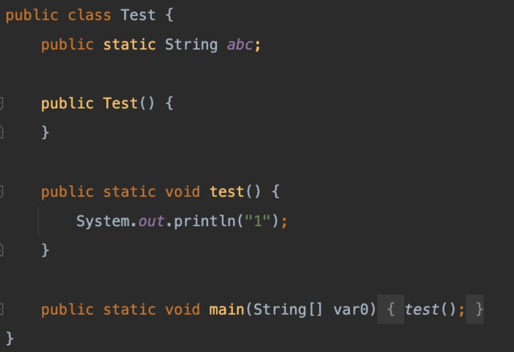

首先我们需要实例化一个ClassWriter对象

|     |     |
| --- | --- |
| ```plain<br>1<br>``` | ```plain<br>ClassWriter classWriter = new ClassWriter(0);<br>``` |

在这个构造函数当中我们也可以传入其他选项，如`ClassWriter.COMPUTE_FRAMES/ClassWriter.COMPUTE_MAX`

-   COMPUTE\_MAXS：在写入方法时，会自动计算方法的最大堆栈大小和局部变量表的大小。
-   COMPUTE\_FRAMES：在写入方法字节码时，会自动计算方法的堆栈映射帧和局部变量表的大小。使用该参数时，COMPUTE\_MAXS参数也会被自动设置。

一般而言在构造方法中我们都可以加上`ClassWriter.COMPUTE_FRAMES`选项，可以让我们专心字节码的构造，不用考虑 max stacks 、max locals以及stack map frames的计算过程。

生成一个类，参数分别是*Java版本号*、*修饰符*、*类名*、签名、*父类*、接口（关注红色字即可）

|     |     |
| --- | --- |
| ```plain<br>1<br>``` | ```plain<br>classWriter.visit(V1_8, ACC_PUBLIC \| ACC_SUPER, "Test", null, "java/lang/Object", null);<br>``` |

生成一个字段，参数分别是*修饰符*、*字段名*、*字段类型*、签名、值

|     |     |
| --- | --- |
| ```plain<br>1<br>2<br>3<br>4<br>``` | ```plain<br>{<br>fieldVisitor = classWriter.visitField(ACC_PUBLIC \| ACC_STATIC, "abc", "Ljava/lang/String;", null, null);<br>fieldVisitor.visitEnd();<br>}<br>``` |

生成一个方法，参数分别是*修饰符*、*方法名*、\*方法描述符(入参与返回值)\*、签名、异常

|     |     |
| --- | --- |
| ```plain<br>1<br>2<br>3<br>4<br>5<br>6<br>7<br>8<br>9<br>10<br>``` | ```plain<br>{<br>methodVisitor = classWriter.visitMethod(ACC_PUBLIC \| ACC_STATIC, "test", "()V", null, null);<br>methodVisitor.visitCode();<br>methodVisitor.visitFieldInsn(GETSTATIC, "java/lang/System", "out", "Ljava/io/PrintStream;");<br>methodVisitor.visitInsn(ICONST_1);<br>methodVisitor.visitMethodInsn(INVOKEVIRTUAL, "java/io/PrintStream", "println", "(I)V", false);<br>methodVisitor.visitInsn(RETURN);<br>methodVisitor.visitMaxs(2, 0);<br>methodVisitor.visitEnd();<br>}<br>``` |

#### [](#%E8%87%AA%E5%AE%9A%E4%B9%89%E6%9F%A5%E7%9C%8B%E4%B8%80%E4%B8%AA%E7%B1%BB%E6%80%8E%E4%B9%88%E9%80%9A%E8%BF%87ASM%E4%BB%A3%E7%A0%81%E7%94%9F%E6%88%90-%E5%BF%85%E7%9C%8B "自定义查看一个类怎么通过ASM代码生成(必看)")自定义查看一个类怎么通过ASM代码生成(必看)

当然在开始之前我希望你多了解下ASM的一些代码写法，自己多写几个类，多查看其ASM的生成代码

在这里我教大家如何自定义查看一个类是怎么通过ASM代码生成，*多模仿才能更熟练*

比如在这里我们需要查看Test.class该如何使用ASM框架的代码生成

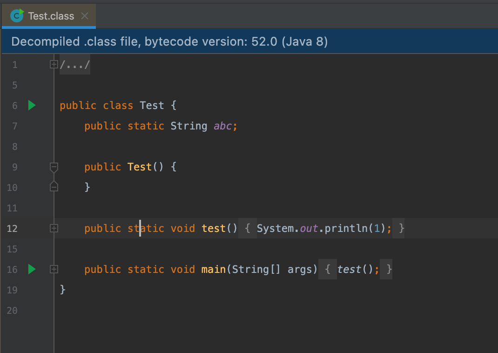

通过执行下面的代码你可以获得这个写法(初学时一定要启用参数SKIP\_DEBUG、SKIP\_FRAMES)，在后面熟练以后可以尝试将其替换为`int parsingOptions = ClassReader.EXPAND_FRAMES`

|     |     |
| --- | --- |
| ```plain<br>1<br>2<br>3<br>4<br>5<br>6<br>7<br>8<br>9<br>10<br>11<br>12<br>13<br>14<br>15<br>``` | ```plain<br>public static void main(String[] args) throws Exception{<br>        //需要处理的Class<br>        String inputFilename = "./target/classes/Test.class";<br>        String outputFilename = "output.txt";<br>        FileInputStream fileInputStream = new FileInputStream(new File(inputFilename));<br>        // SKIP_DEBUG:用于指示ClassReader在读取类文件时是否跳过调试信息。调试信息包括源代码行号、局部变量名称和范围等信息<br>        // SKIP_FRAMES:指示ClassReader在读取类文件时是否跳过帧信息。帧信息是用于存储方法调用和异常处理的数据结构。如果指定了SKIP_FRAMES常量，那么在读取类文件时将会跳过帧信息，从而减少读取和处理的时间和内存消耗<br>        // EXPAND_FRAMES：指示在生成类文件时是否应该展开帧。帧用于在Java类文件中表示方法的执行状态，包括操作数栈和局部变量表的内容。如果指定了EXPAND_FRAMES常量，那么在生成类文件时将会展开帧信息，从而确保生成的类文件包含完整的帧信息<br>        int parsingOptions =  ClassReader.SKIP_DEBUG \| ClassReader.SKIP_FRAMES;<br>        Printer printer = new ASMifier();<br>        FileOutputStream fileOutputStream = new FileOutputStream(new File(outputFilename));<br>        PrintWriter printWriter = new PrintWriter(fileOutputStream);<br>        TraceClassVisitor traceClassVisitor = new TraceClassVisitor(null, printer, printWriter);<br>        new ClassReader(fileInputStream).accept(traceClassVisitor, parsingOptions);<br>    }<br>``` |

### [](#%E7%86%9F%E7%9F%A5%E7%9A%84Java%E5%91%BD%E5%90%8D%E8%A7%84%E5%88%99%E7%9C%9F%E7%9A%84%E6%98%AF%E8%BF%99%E6%A0%B7%E5%90%97%EF%BC%9F "熟知的Java命名规则真的是这样吗？")熟知的Java命名规则真的是这样吗？

#### [](#%E5%91%BD%E5%90%8D%E6%B7%B7%E6%B7%86 "命名混淆")命名混淆

接下来通过一个开胃小菜来帮助我们熟悉ASM的使用方法

在学习Java的时候，第一课通常都是教我们一些编程规范，其中就包含命名的规范，一般而言是下面这几种情况，然而真的是这样么？

这都是常态化的思维固化了我们，理所当然的认为变量名只能是

> 1.  名称只能由字母、数字、下划线、$符号组成？
> 2.  不能以数字开头？
> 3.  名称不能使用JAVA中的关键字？
> 4.  坚决不允许出现中文及拼音命名？

通过测试并不是这样的，这个限制其实只发生在编译的过程(javac)，而在执行过程无限制(java)

|     |     |
| --- | --- |
| ```plain<br>1<br>2<br>3<br>4<br>5<br>6<br>7<br>8<br>9<br>10<br>11<br>12<br>13<br>14<br>15<br>16<br>17<br>18<br>``` | ```plain<br>int start = 0;<br>int end = 65535;<br>String jdk = "jdk8u341";<br>boolean onlyDefineClass = true;<br>System.out.println("---以下是在defineClass下测试_{jdk}--".replace("{jdk}",jdk));<br>for (int i = start; i <= end; i++) {<br>    char unicodeChar = (char) i;<br>    FuzzMethodName(unicodeChar, jdk, onlyDefineClass);<br>    FuzzFieldName(unicodeChar, jdk, onlyDefineClass);<br>}<br>System.out.println("----------------------------");<br>onlyDefineClass = false;<br>System.out.println("---以下在非defineClass下测试_{jdk}--".replace("{jdk}",jdk));<br>for (int i = start; i <= end; i++) {<br>    char unicodeChar = (char) i;<br>    FuzzMethodName(unicodeChar, jdk, onlyDefineClass);<br>    FuzzFieldName(unicodeChar, jdk, onlyDefineClass);<br>}<br>``` |

在这里我们仅仅只是想要让大家知道在不同小版本间有差异，我没有去比对每一个版本，只想让大家知道不同版本间有一些差异即可

Jdk8u20

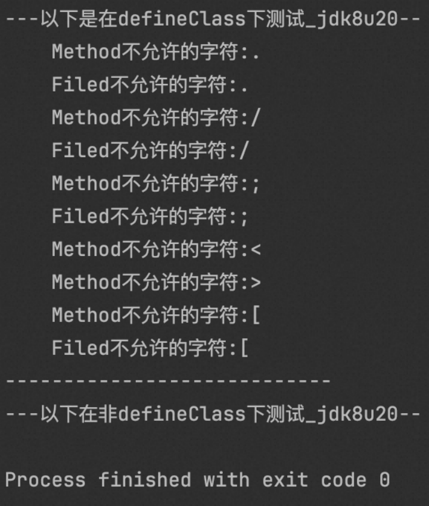

jdk8u341

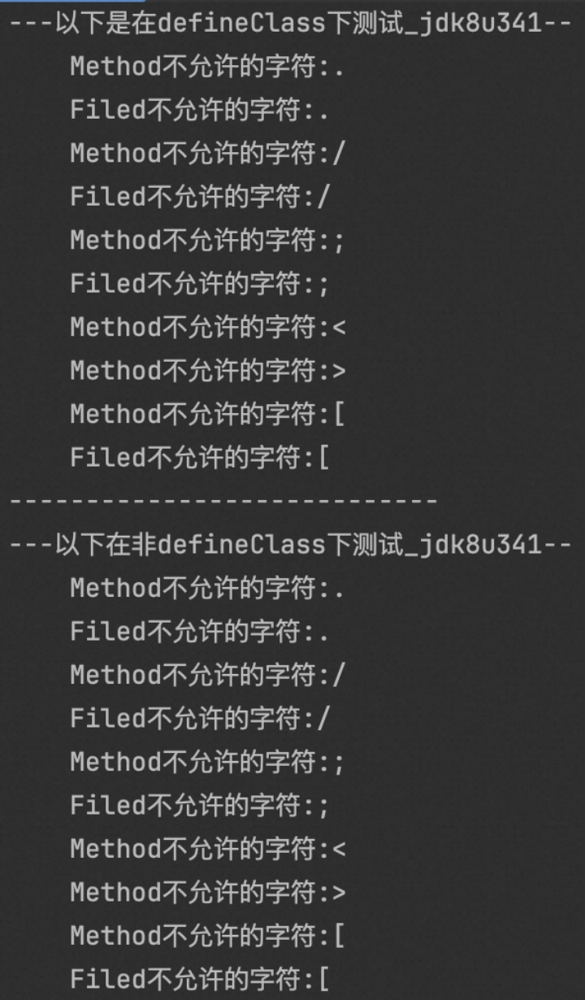

因此接下来我们可以通过修改参数`name`为任意我们想要的值

|     |     |
| --- | --- |
| ```plain<br>1<br>2<br>3<br>4<br>5<br>``` | ```plain<br>{<br>    fieldVisitor =  classWriter.visitField(ACC_PUBLIC\| ACC_STATIC\| ACC_FINAL,"abc{\nsuper man supersuper\n}","[Ljava/lang/String;",null,null);<br>    fieldVisitor.visitEnd();<br><br>}<br>``` |

因此我们可以实现这样的类，如下图所示，可以看到在视觉上非常具有混淆的效果(测试环境jdk8u20，高版本下部分字母不支持)

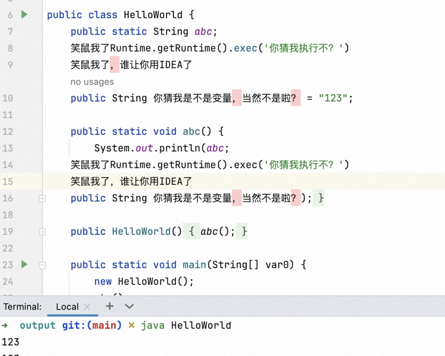

#### [](#%E4%B8%80%E4%B8%AA%E6%9C%89%E8%B6%A3%E7%9A%84%E7%8E%B0%E8%B1%A1 "一个有趣的现象")一个有趣的现象

在fuzz的过程当中我发现，当方法名(或其他参数)中出现了`\r(退格键)`这个字符，出现了这样一个有趣的现象，类无法拖入IDEA当中做反编译了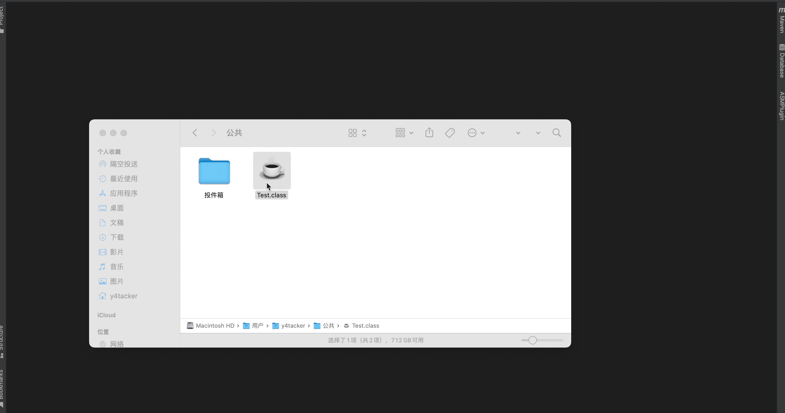通过手动执行`java -cp org.jetbrains.java.decompiler.main.decompiler.ConsoleDecompiler -jar fernflower.jar /Users/y4tacker/Desktop/MCMSv/HackingFernflower/output/Test.class ./testcode`，发现可以正常反编译，因此可以猜测和IDEA其他组件部分代码有关，这里和主题无关就不继续深入研究了

同时通过终端查看字节码时也会发现，这里的显示也很混乱(和`\r`退格键在控制台中的输出作用有关)，当然如果你通过`javap -v Test`将内容输出到文件中打开可正常查看

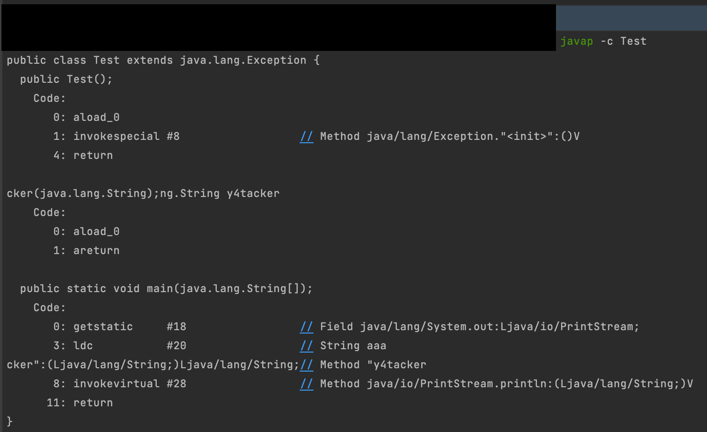

### [](#%E5%85%B3%E6%B3%A8%E5%8F%8D%E7%BC%96%E8%AF%91%E5%99%A8%E7%9A%84%E9%BB%98%E8%AE%A4%E9%85%8D%E7%BD%AE "关注反编译器的默认配置")关注反编译器的默认配置

关于fernflower的代码可以在github上查找到社区版的代码,[https://github.com/fesh0r/fernflower](https://github.com/fesh0r/fernflower)

当然你也可以在IDEA中获取到专业版代码，以mac为例子，右键程序显示包内容，位置在`IntelliJ IDEA.app/Contents/plugins/java-decompiler/lib`

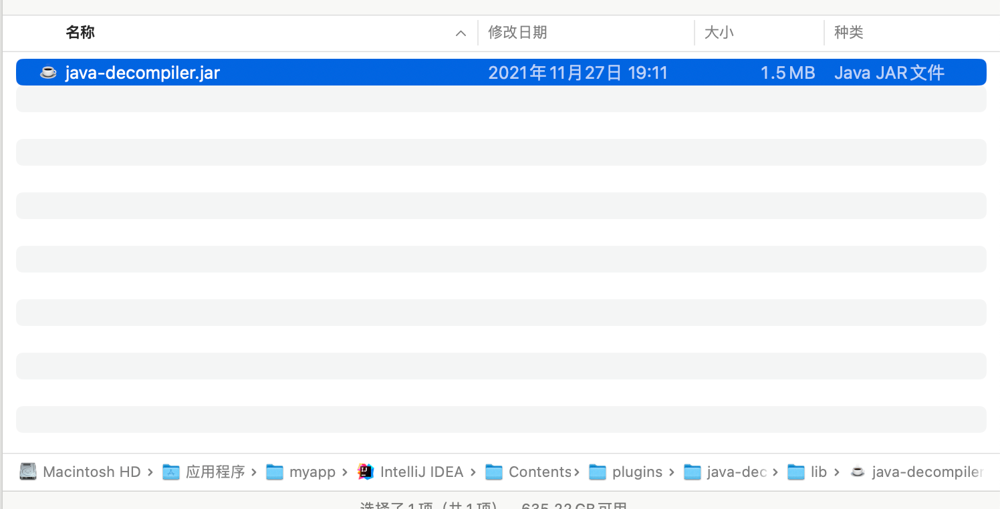

在org.jetbrains.java.decompiler.main.extern.IFernflowerPreferences当中有一些默认配置

这里仅列出了默认激活的属性(值为1)

|     |     |
| --- | --- |
| ```plain<br>1<br>2<br>3<br>4<br>5<br>6<br>7<br>8<br>9<br>10<br>11<br>12<br>13<br>14<br>15<br>16<br>17<br>18<br>``` | ```plain<br>defaults.put(REMOVE_BRIDGE, "1");<br>defaults.put(REMOVE_SYNTHETIC, "0");<br>defaults.put(DECOMPILE_ENUM, "1");<br>defaults.put(USE_DEBUG_VAR_NAMES, "1");<br>defaults.put(USE_METHOD_PARAMETERS, "1");<br>defaults.put(FINALLY_DEINLINE, "1");<br>defaults.put(DECOMPILE_INNER, "1");<br>defaults.put(DECOMPILE_CLASS_1_4, "1");<br>defaults.put(DECOMPILE_ASSERTIONS, "1");<br>defaults.put(IDEA_NOT_NULL_ANNOTATION, "1");<br>defaults.put(NO_EXCEPTIONS_RETURN, "1");<br>defaults.put(REMOVE_GET_CLASS_NEW, "1");<br>defaults.put(ENSURE_SYNCHRONIZED_MONITOR, "1");<br>defaults.put(BOOLEAN_TRUE_ONE, "1");<br>defaults.put(UNDEFINED_PARAM_TYPE_OBJECT, "1");<br>defaults.put(HIDE_EMPTY_SUPER, "1");<br>defaults.put(HIDE_DEFAULT_CONSTRUCTOR, "1");<br>defaults.put(REMOVE_EMPTY_RANGES, "1");<br>``` |

从这些默认配置当中我们发现了几个有趣的配置选项

|     |     |
| --- | --- |
| ```plain<br>1<br>2<br>3<br>4<br>5<br>``` | ```plain<br>REMOVE_BRIDGE(桥接方法)<br>REMOVE_SYNTHETIC(虽然是0,但是通过IDEA反编译的时候仍然可以做到隐藏的效果，猜测运行时修改了默认属性java -jar fernflower.jar -rsy=1 xxx.class)<br><br>USE_DEBUG_VAR_NAMES(对应org.jetbrains.java.decompiler.main.rels.ClassWrapper#applyDebugInfo)<br>USE_METHOD_PARAMETERS(对应org.jetbrains.java.decompiler.main.rels.ClassWrapper#applyParameterNames)<br>``` |

#### [](#REMOVE-BRIDGE-REMOVE-SYNTHETIC "REMOVE_BRIDGE/REMOVE_SYNTHETIC")REMOVE\_BRIDGE/REMOVE\_SYNTHETIC

##### [](#%E9%9A%90%E8%97%8F%E6%96%B9%E6%B3%95 "隐藏方法")隐藏方法

发现这个属性的读取与处理在最终代码的拼接过程，也就是在org.jetbrains.java.decompiler.main.ClassWriter#classToJava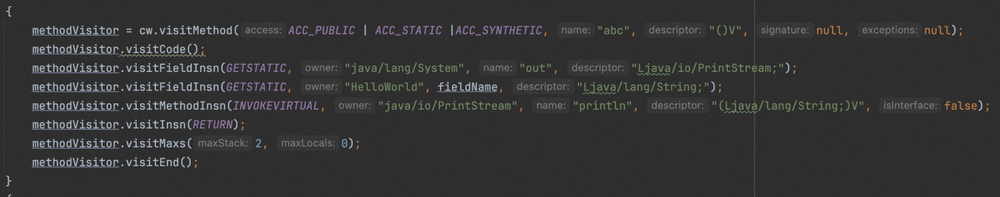

可以看到如果我们能让hide为true，那么就能让当前方法的输出被跳过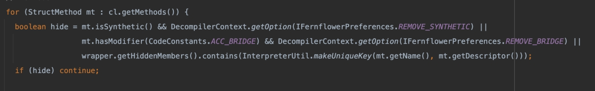

如何让hide为true，可以看到这里有三个条件，满足其一即可

1.  mt.isSynthetic()并且REMOVE\_SYNTHETIC属性为1
2.  方法是桥接方法并且REMOVE\_BRIDGE属性为1
3.  在hiddenmenmers对象当中

###### [](#isSynthetic-isBridge "isSynthetic/isBridge")isSynthetic/isBridge

在开始前我们可以思考为什么IDEA会选择隐藏这两个方法，因为他们都是由编译器生成的方法

Ps：一些简单的备注，更详细的可以百度看看

-   桥接方法（bridge method）是为了解决Java泛型擦除带来的问题而引入的一个概念。当一个类实现了一个泛型接口或继承了一个泛型类时，由于Java的泛型擦除机制，会导致继承或实现的方法签名发生变化，这可能会引发编译器警告或错误。为了解决这个问题，Java编译器会在编译时自动生成桥接方法，来确保方法签名的一致性。这些桥接方法通常是合成的，它们的目的是将父类中的泛型方法重写为非泛型方法，以便在继承链中保持方法签名的一致性。桥接方法通常是由编译器自动生成的，开发者不需要手动编写桥接方法。在Java字节码中，桥接方法的标志通常是 ACC\_BRIDGE。桥接方法在Java中是一个重要的概念，它确保了在使用泛型时，继承和实现关系的正确性和一致性。
    
-   synthetic方法是由编译器生成的、不是由开发人员直接编写的方法。这些方法通常具有特殊的目的，如支持内部类、外部类之间的访问、Java虚拟机的实现细节等。synthetic方法通常是私有的，并且在类的字节码中使用ACC\_SYNTHETIC标志进行标记。
    
    一些常见的情况下会生成synthetic方法，如：
    
    1.  内部类：当创建内部类时，编译器通常会生成一个synthetic方法，用于在内部类中访问外部类的私有成员变量或私有方法。
    2.  枚举类：对于枚举类，编译器会生成一个包含所有枚举值的静态final数组，并且生成一个synthetic方法用于访问这个数组。
    3.  Lambda表达式：在使用Lambda表达式时，编译器可能会生成synthetic方法来支持Lambda表达式的执行。

首先来看如何满足isSynthetic的条件，修饰符带ACC\_SYNTHETIC即可，或者带Synthetic属性即可

|     |     |
| --- | --- |
| ```plain<br>1<br>2<br>3<br>4<br>5<br>``` | ```plain<br>public boolean isSynthetic() {<br>    return hasModifier(CodeConstants.ACC_SYNTHETIC) \| hasAttribute(StructGeneralAttribute.ATTRIBUTE_SYNTHETIC);<br>}<br><br>public static final Key<StructGeneralAttribute> ATTRIBUTE_SYNTHETIC = new Key<>("Synthetic");<br>``` |

那么我们可以通过ASM很简单的为方法添加修饰符(ACC\_BRIDGE/ACC\_VOLATILE/ACC\_STATIC\_PHASE都是0x0040)

|     |     |
| --- | --- |
| ```plain<br>1<br>2<br>3<br>4<br>``` | ```plain<br>cw.visitMethod(ACC_PUBLIC \| ACC_SYNTHETIC, "abc", "()V", null, null);<br>cw.visitMethod(ACC_PUBLIC \| ACC_BRIDGE, "abc", "()V", null, null);<br>cw.visitMethod(ACC_PUBLIC \| ACC_VOLATILE, "abc", "()V", null, null);<br>cw.visitMethod(ACC_PUBLIC \| ACC_STATIC_PHASE, "abc", "()V", null, null);<br>``` |

如何通过ASM为方法添加属性,调用`methodVisitor.visitAttribute(new SyntheticAttribute());`即可

Ps：自定义实现的SyntheticAttribute类构造函数当中的super代表属性的type

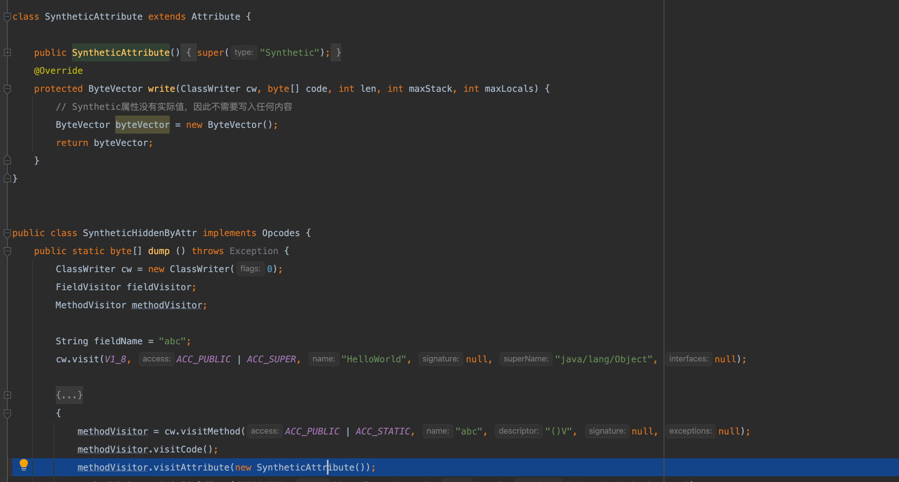

成功实现对abc方法的隐藏

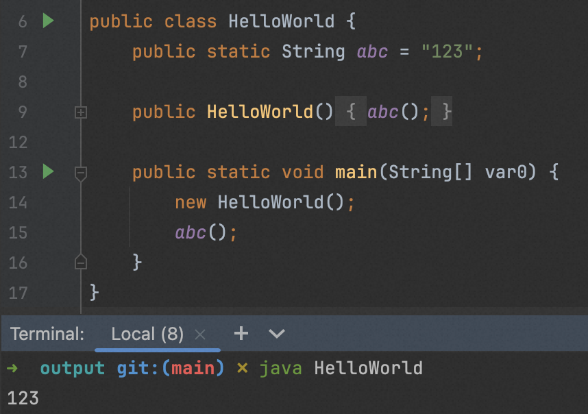

对于桥接方法的条件，和上面同理，不再重复讲解，这里仅列出效果图

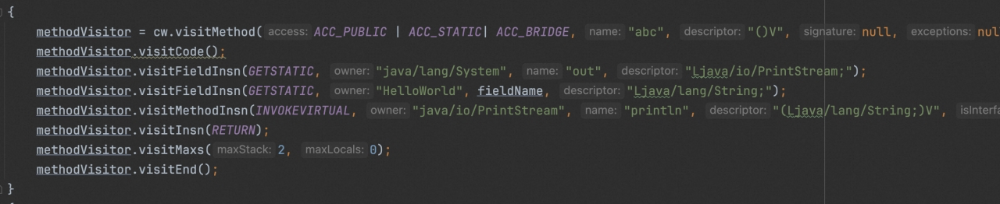


###### [](#%E5%A6%82%E4%BD%95%E8%BD%AC%E6%8D%A2%E4%B8%80%E4%B8%AA%E7%B1%BB-%E5%A4%87%E6%B3%A8%E7%AF%87 "如何转换一个类(备注篇)")如何转换一个类(备注篇)

可能有人会好奇能不能通过ASM转换现有的方法呢？当然可以

写一个类继承ClassVisitor

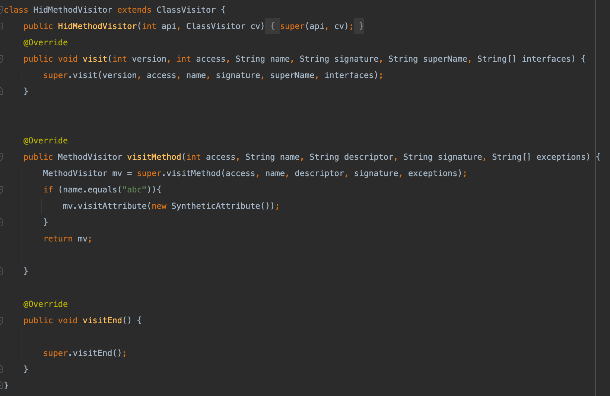串联ClassWriter即可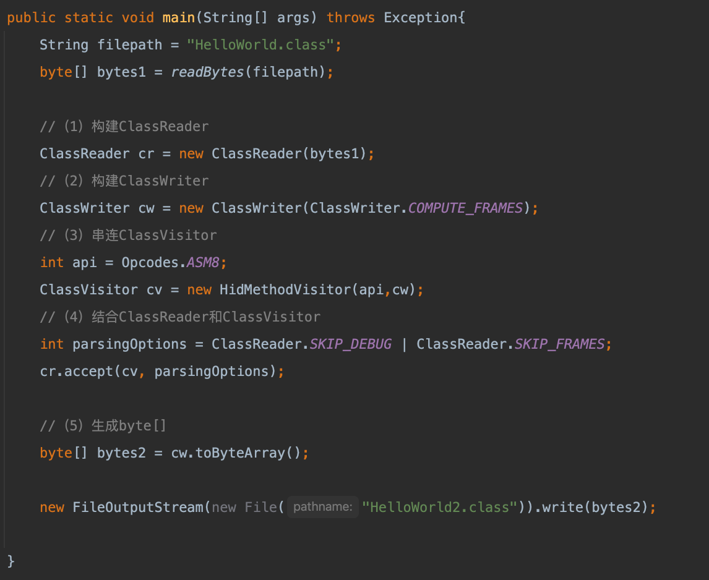

结合IDEA的显示特性达到迷惑效果，同时我们在隐藏的方法当中加点料，比如执行一个计算器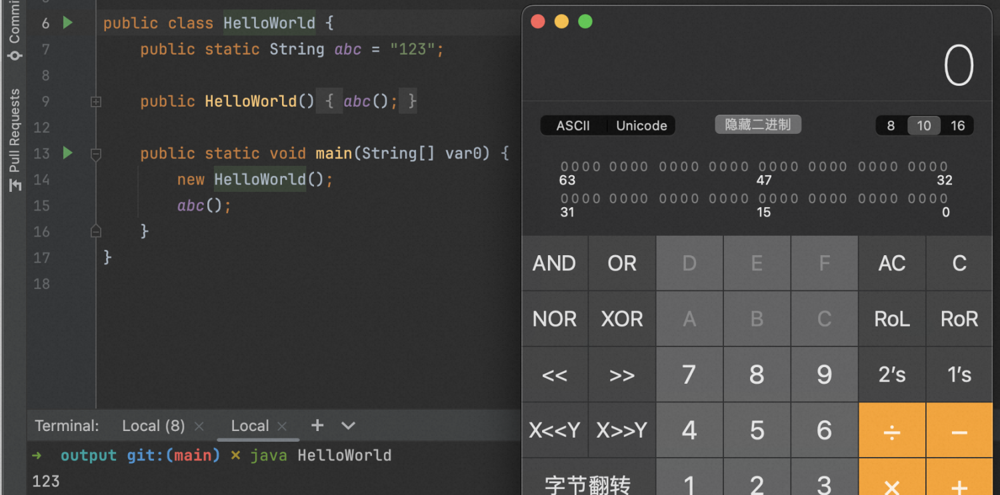

###### [](#hiddenMembers%E5%AF%B9%E8%B1%A1 "hiddenMembers对象")hiddenMembers对象

过查找发现hiddenMembers的添加主要在几个Processor方法下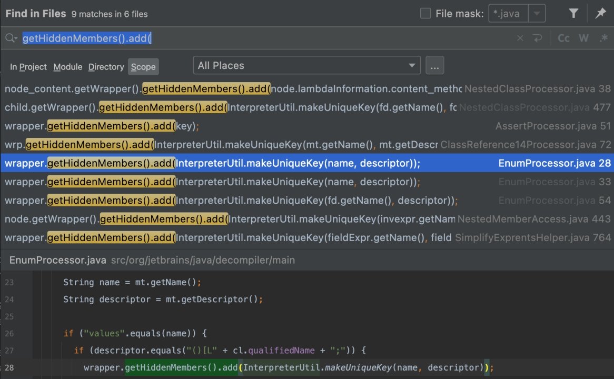

和方法相关的比较好用的有EnumProcessor和ClassReference14Processor，这里仅以EnumProcessor为例

在下图中可以看到，只需要满足两者任一分支即可，其中name参数代表方法名

以第一个分支为例子，方法名为values，然后描述符满足下面的情况

入参为空，返回值为当前对象的数组

(其中()代表入参为空，\[为数组，中间的变量为全类名利用方法的重载)

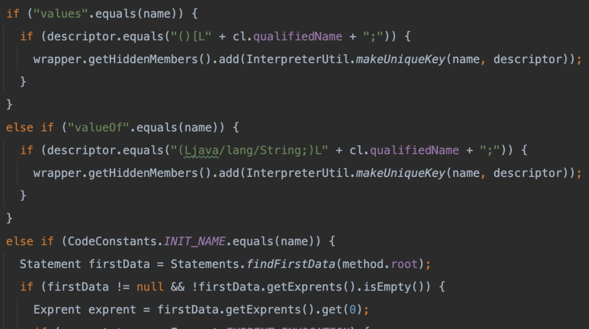

甚至更进一步，我们可以结合方法重载的特性，再搞一个同名方法迷惑视线

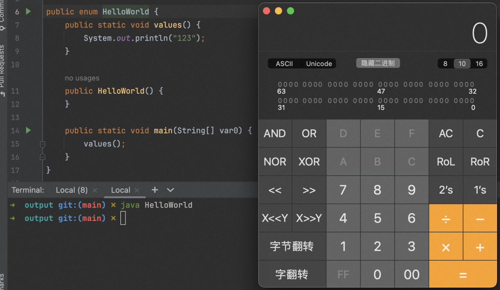

##### [](#%E9%9A%90%E8%97%8F%E5%AD%97%E6%AE%B5 "隐藏字段")隐藏字段

同理满足任一条件即可

1.  isSynthetic并且REMOVE\_SYNTHETIC属性为1
2.  在Hiddenmenmers对象当中

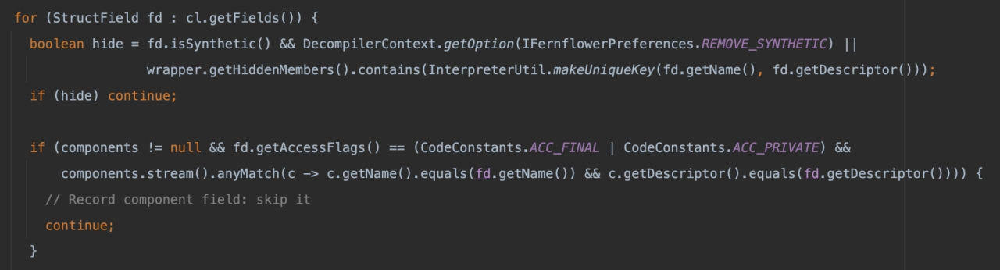

###### [](#isSynthetic "isSynthetic")isSynthetic

isSynthetic条件同上，修饰符或添加属性，具体可查看我的代码，位置在`src/main/java/hidden/field/Synthetic`

|     |     |
| --- | --- |
| ```plain<br>1<br>2<br>3<br>``` | ```plain<br>public boolean isSynthetic() {<br>  return hasModifier(CodeConstants.ACC_SYNTHETIC) \| hasAttribute(StructGeneralAttribute.ATTRIBUTE_SYNTHETIC);<br>}<br>``` |

###### [](#hiddenMembers%E5%AF%B9%E8%B1%A1-1 "hiddenMembers对象")hiddenMembers对象

同理仅选一个为例子演示

在`org.jetbrains.java.decompiler.main.AssertProcessor#buildAssertions`中对hiddenMembers添加了字段对象的处理，如果`findAssertionField`返回不为空即可实现添加

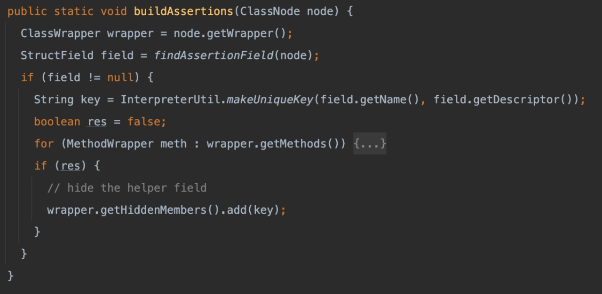条件很简单字段为Static\\Final\\Synthetic修饰即可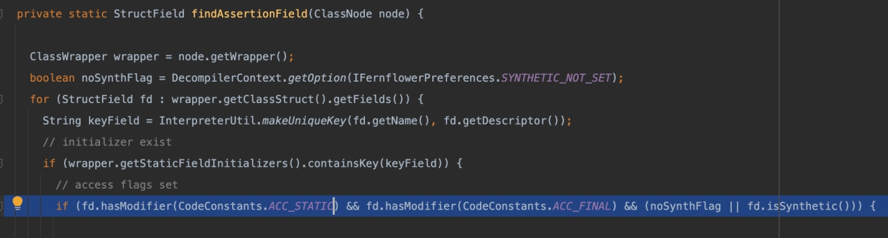

|     |     |
| --- | --- |
| ```plain<br>1<br>``` | ```plain<br>cw.visitField(ACC_PUBLIC \| ACC_STATIC \| ACC_FINAL\| ACC_SYNTHETIC, fieldName, "Ljava/lang/String;", null, null);<br>``` |

运行发现，字段也做到了隐藏的效果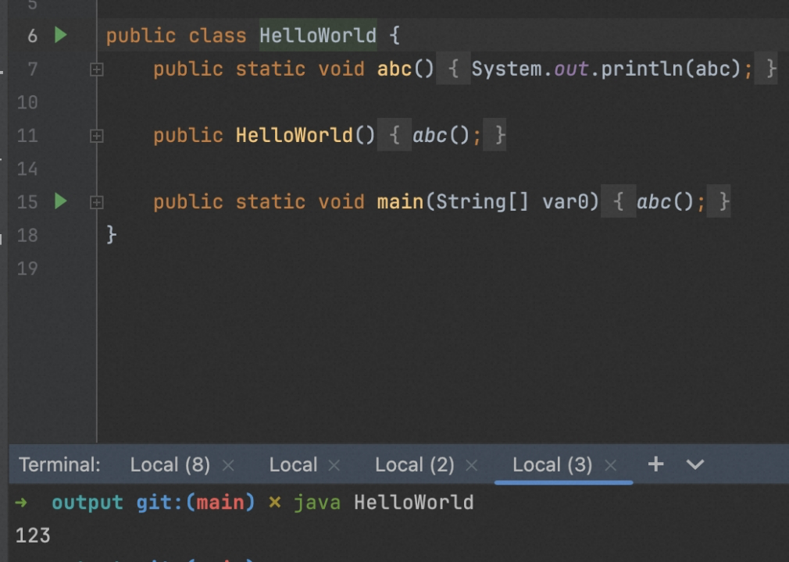

#### [](#%E8%87%AA%E5%AE%9A%E4%B9%89%E6%96%B9%E6%B3%95%E5%8F%82%E6%95%B0 "自定义方法参数")自定义方法参数

##### [](#%E4%B8%80%E4%BA%9B%E9%9C%80%E8%A6%81%E7%9F%A5%E9%81%93%E7%9A%84%E5%9F%BA%E7%A1%80%E7%9F%A5%E8%AF%86 "一些需要知道的基础知识")一些需要知道的基础知识

Java字节码的attribute\_info用于存储与类、字段、方法、代码等相关的附加信息。它是一个可选的部分，可以用来提供一些额外的元数据或调试信息。

attribute\_info结构包含以下几个字段：

-   attribute\_name\_index：一个指向常量池中UTF-8类型常量的索引，表示attribute的名称。
-   attribute\_length：一个无符号的32位整数，表示attribute的长度，单位为字节。
-   info：包含实际的attribute信息。  
    不同类型的attribute\_info具有不同的格式和作用。常见的attribute\_info类型包括：

JVM在运行时并不直接关注字节码中的attributes，它主要关注的是字节码指令和运行时数据。

虽然JVM不会直接关注attributes，但是这些attributes在运行时仍然有一定的作用。

例如，Code attribute中包含了方法体的字节码指令、异常处理器、局部变量表等信息。JVM在执行方法时会解析这些字节码指令，并根据异常处理器处理异常，同时也会使用局部变量表来存储方法中的局部变量。另外，LineNumberTable attribute中包含了源码行号和字节码行号的对应关系，这对于调试非常有用。当发生异常或进行追踪时，JVM可以使用这些信息来显示源码的行号，帮助开发人员进行调试。

##### [](#METHOD-PARAMETERS "METHOD_PARAMETERS")METHOD\_PARAMETERS

我们可以在代码中自定义一些调试信息，这与默认配置中的`USE_METHOD_PARAMETERS/USE_DEBUG_VAR_NAMES`有关

这里我们仅仅关注METHOD\_PARAMETERS即可

不知道大家有没有发现一个现象，自己在IDEA写的类，反编译后可以看到，方法的参数名都是有一些特定含义的

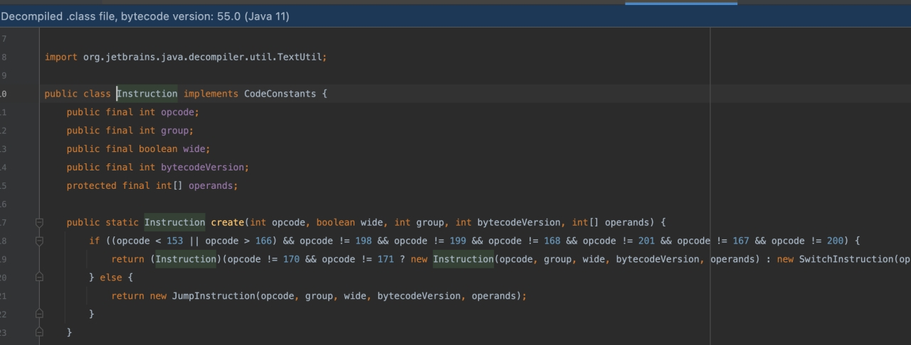但是从网上下载的代码却没有(因为被做了优化将属性做了移除)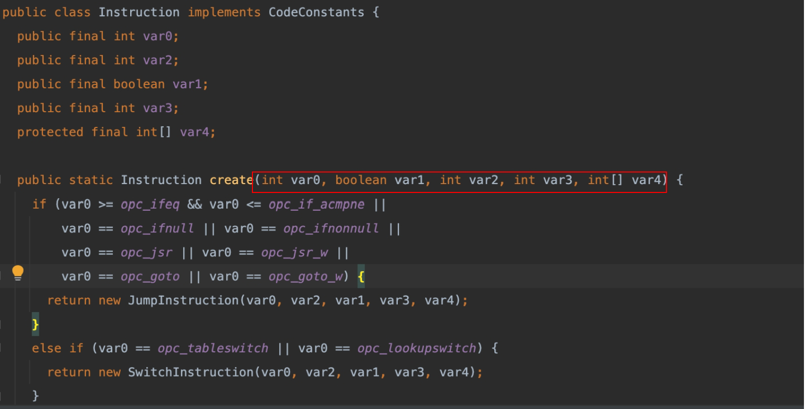

|     |     |
| --- | --- |
| ```plain<br>1<br>2<br>``` | ```plain<br>USE_DEBUG_VAR_NAMES(对应处理org.jetbrains.java.decompiler.main.rels.ClassWrapper#applyDebugInfo)<br>USE_METHOD_PARAMETERS(对应处理org.jetbrains.java.decompiler.main.rels.ClassWrapper#applyParameterNames)<br>``` |

仔细阅读代码你会发现其实这两个参数最终效果是一致，但是USE\_METHOD\_PARAMETERS在IDEA的代码层没有做参数的限制(jdk8测试无，但是较高版本java\[jdk<=8u271\]运行时也有限制了，限制条件同USE\_DEBUG\_VAR\_NAMES，当然其实这些限制都无所谓)，而USE\_DEBUG\_VAR\_NAMES则有

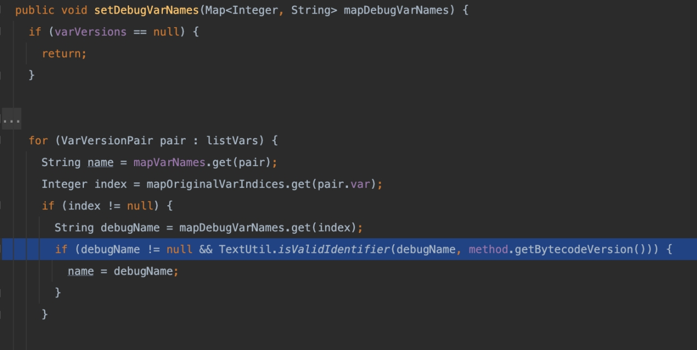通过简单的fuzz发现限制蛮大的(部分输出)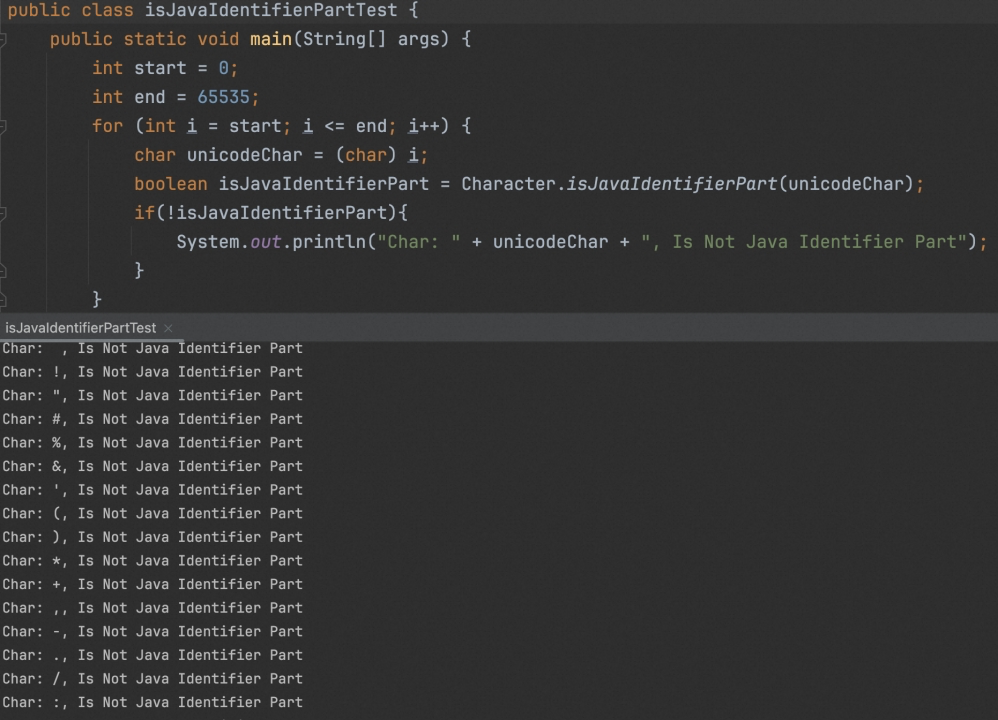

因此，在这里我们以USE\_METHOD\_PARAMETERS的构造为主

查看它的处理流程，其实很简单，获取方法中的`MethodParameters`属性，再通过for循环便利建立字段的映射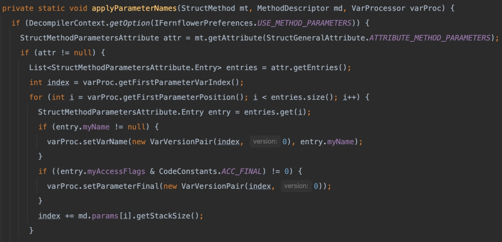

既然限制我们已经知道了IDEA是如何处理的，那么接下来就需要知道这些属性是如何传入

在类的初始化解析过程当中，其中方法参数的解析在(org.jetbrains.java.decompiler.struct.attr.StructMethodParametersAttribute#initContent)

可以看到如下图的解析步骤：

1.  读取方法参数个数
2.  读取方法的参数名在本地变量表当中的映射(关键)
3.  读取方法参数类型

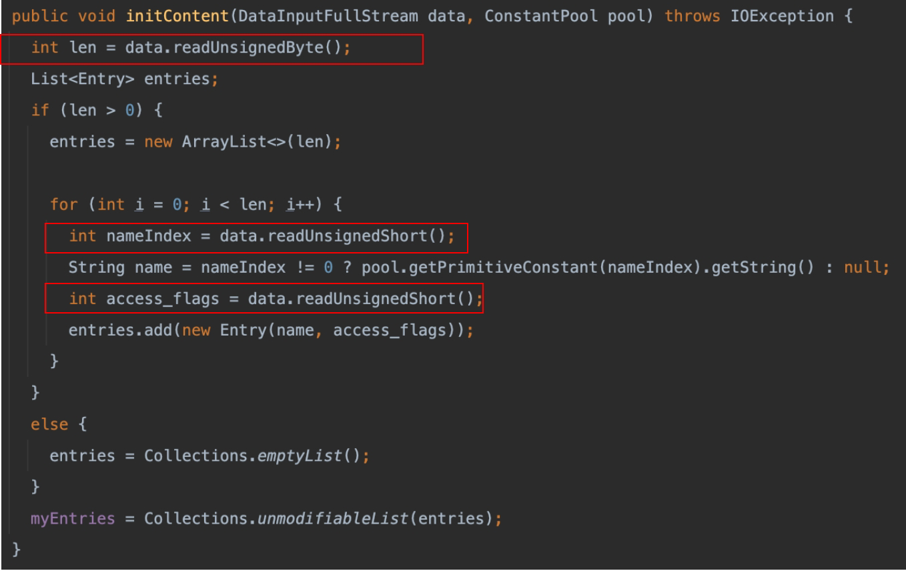那么在接下来我们便开始构造属性，继承Attibute类重写其write方法来实现自定义的写入，这里我比较偷懒的写了一个，能用就行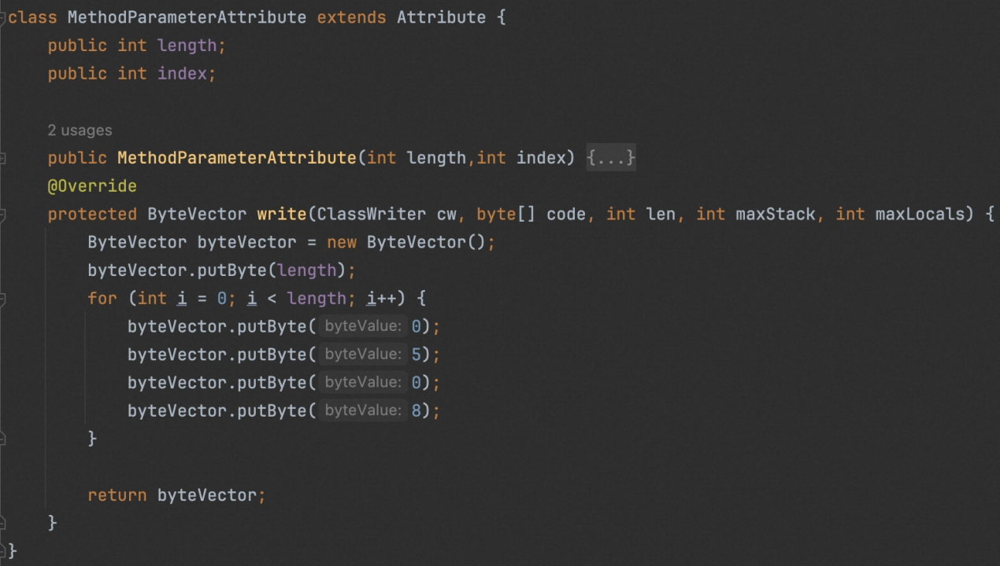

调用`mv.visitAttribute(new MethodParameterAttribute(3,5));`即可实现属性添加

Ps:老版本会有一点BUG，函数名中显示没问题，在具体函数功能中仍继续使用了var0/var1/var2/varxx，这里我是最新版IDEA

在这里我们可以看到所有的方法参数都被我们修改为同一名字，大大加大了阅读理解代码的难度

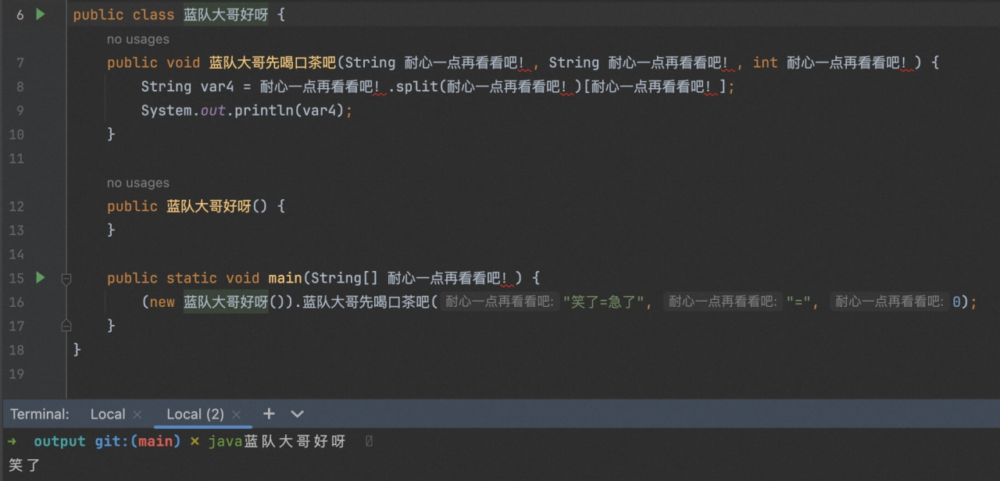虽然在较高版本中也对fieldname做了限制，但也也只是一些特殊符号的限制，简单写首诗还是可以的(小皮一下),以jdk11为例

(忽略颜色变成白底了找了张老图懒得自己打字了)


#### [](#%E5%B1%9E%E6%80%A7%E4%B8%8A%E8%BF%98%E8%83%BD%E5%81%9A%E4%BB%80%E4%B9%88%EF%BC%9F "属性上还能做什么？")属性上还能做什么？

上面也提到了，Java运行时一般而言对属性没有直接的依赖，利用这一点我们便可以想想能不能控制属性让IDEA在反编译的过程中报错导致反编译过程提前结束，当然其实有好几种办法，这里我们仅以其中一个为例，这串代码其实就是上面讲到的方法参数的处理过程

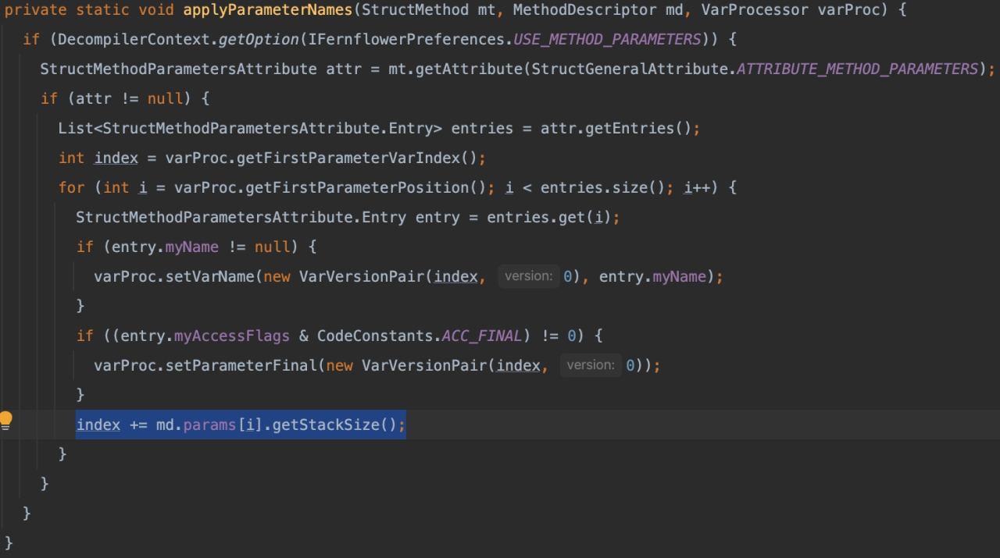我们可以看到有个对`md.params[i]`的数组下标取值的过程，这时候如果我们多在属性中添加一位，就会因为发生组越界导致反编译失败(比如一个方法拥有三个参数，我们在属性中声明它拥有四个参数)

查看代码效果，此时反编译因出错提前退出，显示效果如图

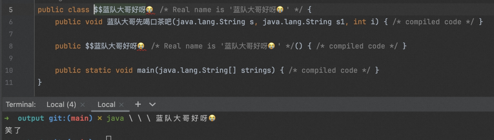

#### [](#%E5%86%8D%E8%BF%9B%E4%B8%80%E6%AD%A5%EF%BC%8C%E7%AE%80%E5%8D%95%E5%8F%8D%E5%88%B6IDEA "再进一步，简单反制IDEA")再进一步，简单反制IDEA

既然都看了方法的参数了，那么不妨再往上看看，方法参数又是怎么解析的呢？

仅看这一串代码你能发现什么么？注意我的光标

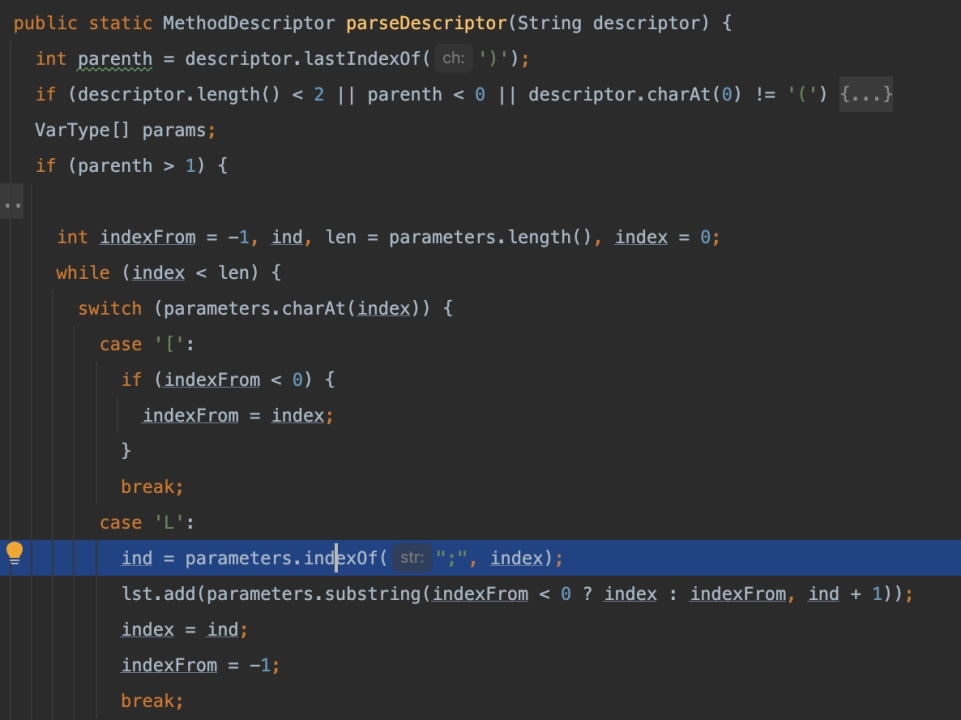

以`(Ljava/lang/String;)Ljava/lang/String;`为例

1.  先获取最后括号内的内容
2.  第一位L进入Case ‘L’分支
3.  让 index 为 ; 所在位置下标

而如果我们不写上最后一个;符号，对java来说一般找不到默认为-1，导致反编译永远卡在这个while循环当中，实现一个DOS攻击

Ps：很狗的是很早之前我给官方提出了这个问题，他们表示并不care也不会做修复，但是在我写PPT前几天无意中更新了IDEA发现似乎被修复了🐶，具体原因还未查看(懒)


这时候有人会问，既然都破坏了类的完整性，那么肯定都无法运行了，确实如此，但是换个角度，如果我们向我们的jar文件当中存入多个这样的class，当有人想反编译jar查看代码的时候，不小心点到了这个类，是不是就会触发小惊喜(手动狗头)

#### [](#%E8%BF%98%E8%83%BD%E9%9A%90%E8%97%8F%E4%BB%80%E4%B9%88%EF%BC%9F-%E7%A5%9E%E5%A5%87%E7%9A%84JSR "还能隐藏什么？(神奇的JSR)")还能隐藏什么？(神奇的JSR)

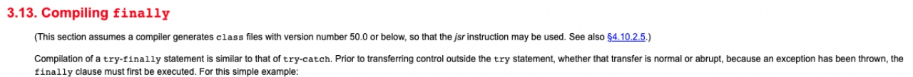

刚刚我们已经实现了对方法以及字段的隐藏，还能隐藏什么呢？通过阅读反编译的源码我发现了个有趣的指令jsr，在过去它是和ret指令成对出现，用于实现try-catch当中的finally快，但随着jvm的发展后面被移除了，但是java的运行有着向下兼容的特性，因此我们仍然是能使用这个指令

| astore | 栈顶引用类型保存到本地变量 |
| --- | --- |
| jsr | 跳转指定地址，并压入下一条指令地址 |
| ret | 返回指定的指令地址 |

首先通过下面的例子带大家简单了解下JSR的使用，在这里通过JSR跳转到了label1，在这个过程中会将下一条指令的地址压入栈中，之后执行完`Code Here`，我们通过ASTORE将栈上地址保存到本地变量表当中指定位置，并通过RET指令实现对`Continue Code Here`的继续执行

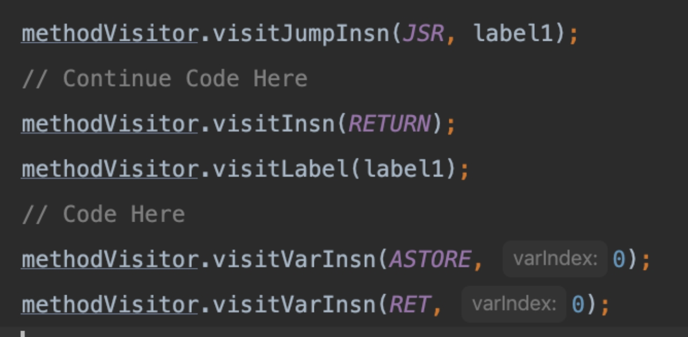利用这个jsr我们能达到这样的混淆效果，可以看到实际运行与显示不符合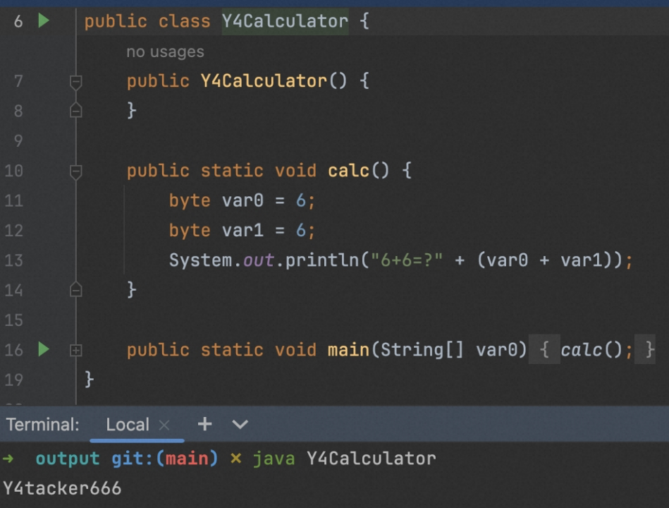

那到底是如何做到的呢？可以看到jsr的处理是在代码生成CFG的过程中，在这里仅仅只是对JSR/RET做了处理(正常情况下jsr/ret的出现是成对的，并且不会有其他指令)

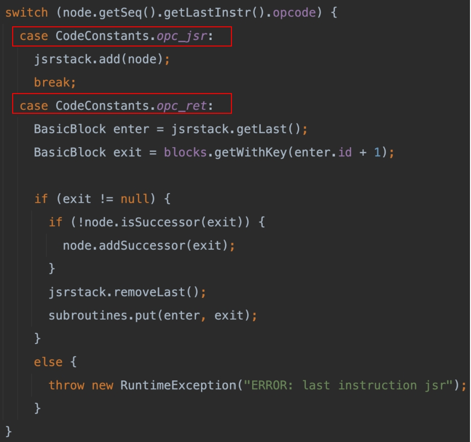调用栈如下

|     |     |
| --- | --- |
| ```plain<br>1<br>2<br>3<br>4<br>``` | ```plain<br>setSubroutineEdges:374, ControlFlowGraph<br>buildBlocks:204, ControlFlowGraph<br><init>:44, ControlFlowGraph<br>codeToJava:74, MethodProcessorRunnable<br>``` |

但是毕竟我们是黑客，总想搞一些骚操作，通过对字节码指令的翻阅我发现了两个有趣的指令

| pop/pop2 | 弹出栈顶数值 |
| --- | --- |
| swap | 栈顶数值交换 |

因此我们便可以构造出这样的ASM代码(Y4计算器的原理)

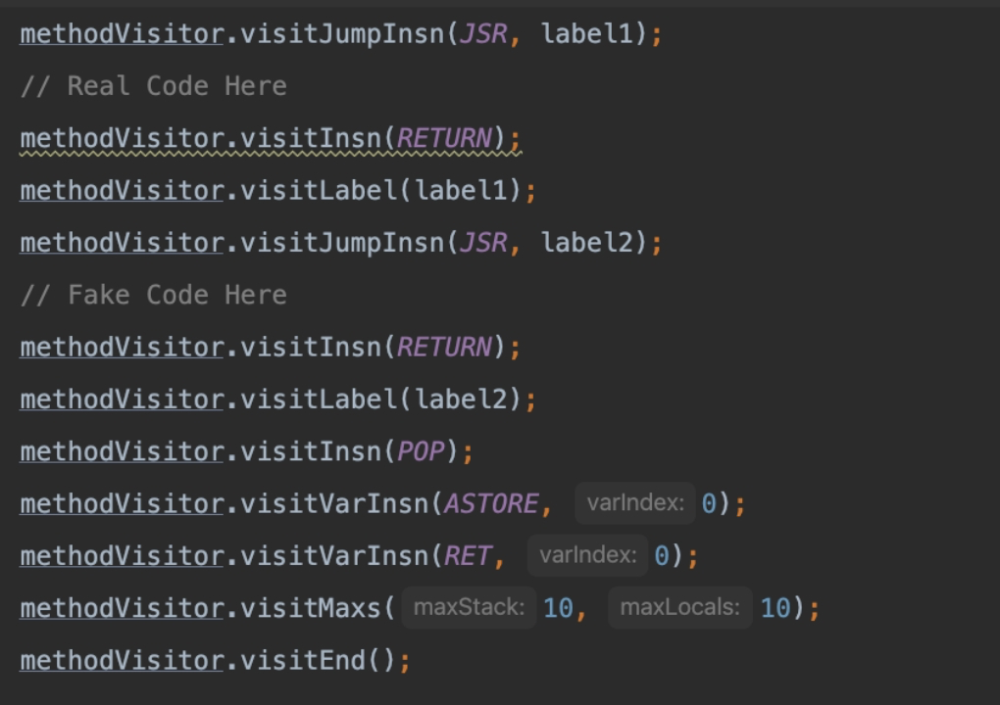

##### [](#%E4%BB%A3%E7%A0%81%E7%9C%9F%E5%AE%9E%E6%89%A7%E8%A1%8C%E4%B8%8EIDEA%E8%A7%A3%E6%9E%90%E7%9A%84%E5%B7%AE%E5%BC%82%E6%80%A7 "代码真实执行与IDEA解析的差异性")代码真实执行与IDEA解析的差异性

首先我们来看看代码的真实执行过程(懒了直接偷演讲时的PPT动画)

首先通过JSR跳转到label1，并向栈中压入下一条指令的地址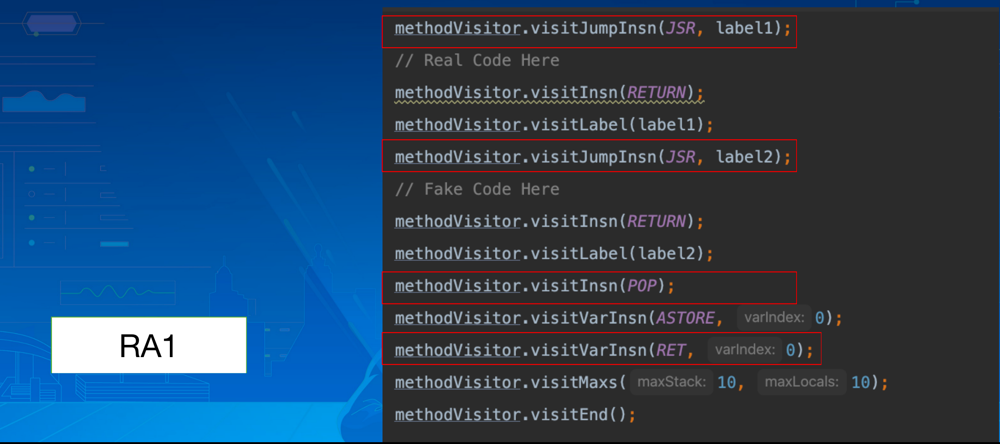

接着再次通过JSR跳转到label2，并向栈中压入下一条指令的地址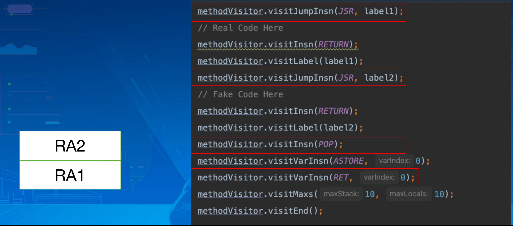

之后我们手动插入了一个POP指令的调用，RA2被弹出，因此最终RET指令返回执行时会执行`Real Code Here`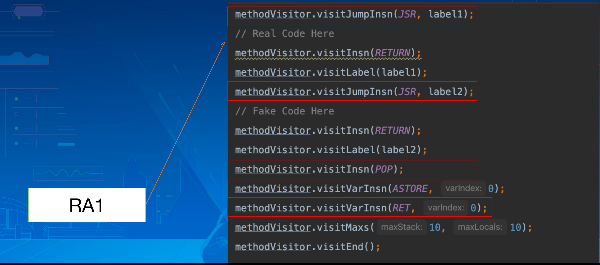

那么我们接下来再看看IDEA的解析处理，通过两次JSR跳转压入两条指令返回地址

由于并没有对POP做处理，因此最终返回执行RA2所指向的`Fake Code Here`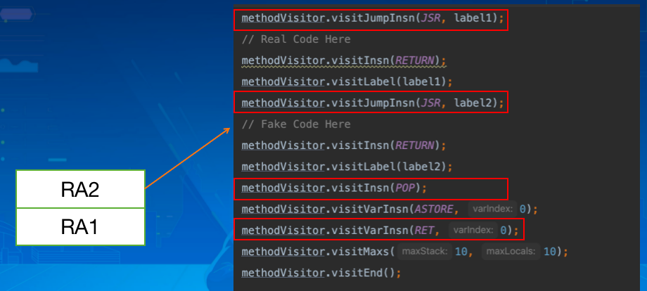

因此我们便可以利用IDEA解析与真实执行的差异性构造出这样的混淆例子，将真实代码隐藏，虚假代码做展示达到一个很好的混淆效果(IDEA所有版本均可)

##### [](#SWAP "SWAP")SWAP

同样的道理，仅演示

通过两次JSR跳转压入两条指令返回地址

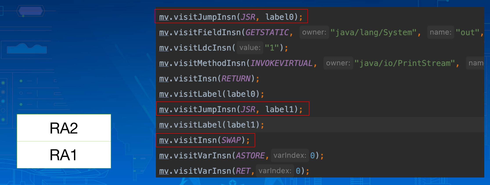通过SWAP指令交换地址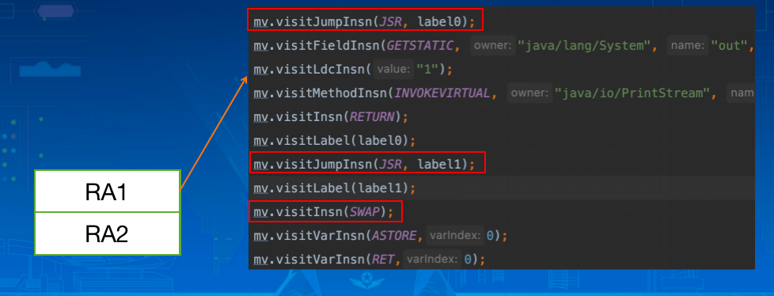

生成的类触发报错无法反编译(最新版可以，旧版不行，具体版本懒得测)

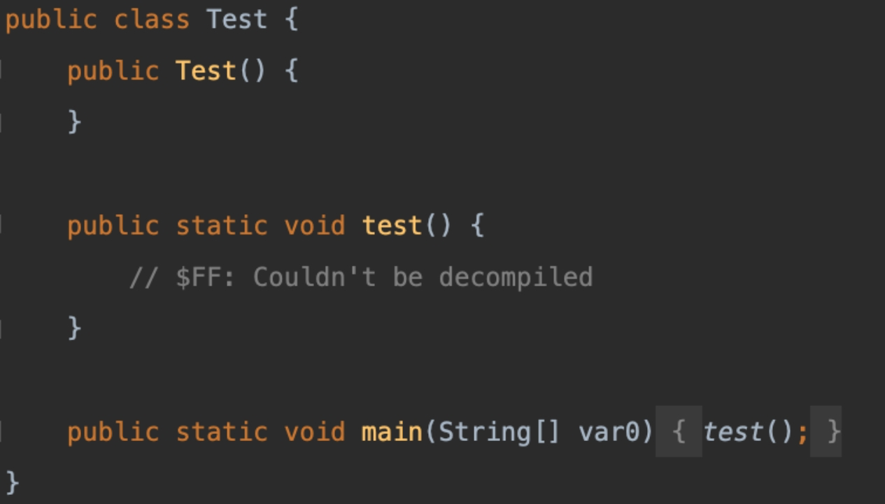

#### [](#%E5%85%B3%E6%B3%A8%E7%89%B9%E6%AE%8A%E7%9A%84%E7%BB%93%E6%9E%84 "关注特殊的结构")关注特殊的结构

除了关注程序的一些默认配置，我们还可以将视线聚焦在放在一些特殊的结构上面，毕竟结构越特殊，反编译器的处理也会越复杂。

这里我们仅以try-catch来举例，那try-catch为什么特殊呢？

对于我们Java调用方法而言有两种情况，如果方法是静态方法就可以直接调用，而如果方法是非静态方法那么就需要先实例化一个类再执行调用，而如下图所示Exception调用的方法是非静态方法。因此可以猜测在运行过程中生成了这一个对象并存入了栈中，同时我们也可以通过javap指令简单从astore的前后调用做一个验证

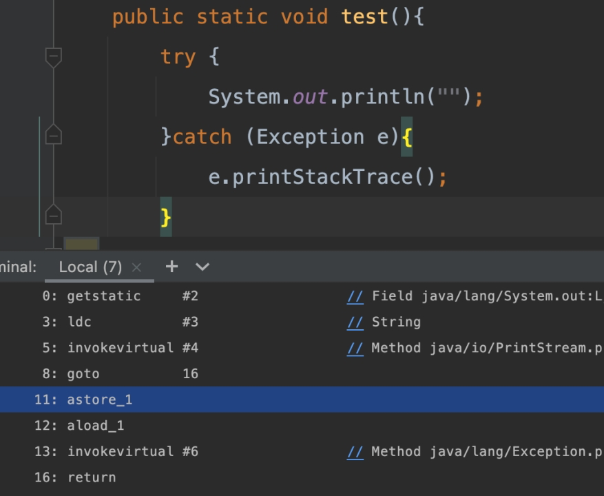在这里为了方便大家更直观的感受，我写了一个模拟栈与本地变量表之间变化关系的程序，输出如下，可以看到确实很直观的有一个Exception对象的生成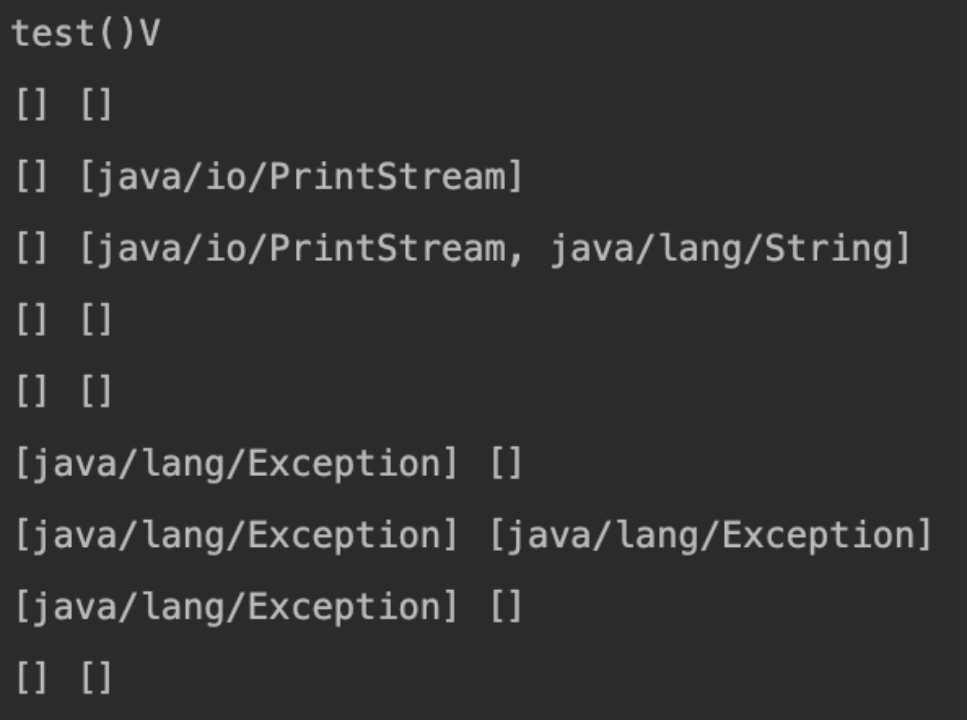

在接下来我们需要简单了解下java自身生成的try-catch的字节码表示，在这里为了防止编译优化，在每个执行中插入了一些输出的字节码指令序列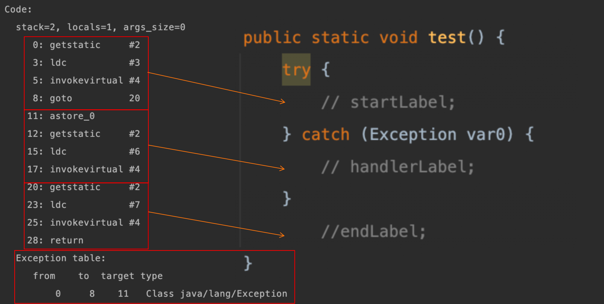

在这里我们主要关注这个异常表，这个异常表定义了异常处理的范围

从指令0-8，如果能成功执行不报错，那么就会调用goto跳转到指令20继续执行，直到程序退出

如果在指令0-8之间运行产生了错误，就会跳转到target指向的指令11去捕获异常处理，从指令11继续往下执行直到程序退出

在这里为了方便新手对接下来混淆的理解，我们可以尝试在不使用GOTO以及不对结构顺序做调整的情况下实现这个try-catch，如下图所示，从右边来看，程序执行的流动是从startLabel流向endLabel并通过return返回，从handlerLabel流向endLabel并通过return返回，那么可以构造如左图所示的ASM代码片段(因为不使用跳转HandlerLabel只能给其插入一个RETURN保证程序正常退出)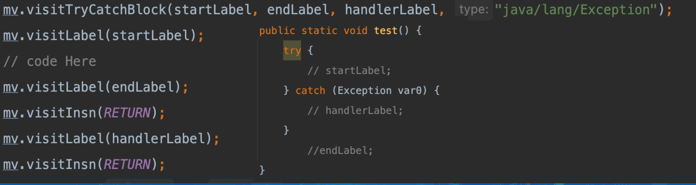

那么既然知道了程序的执行方向都是向下执行并且最终通过RETURN指令退出

那么我们是不是就能大胆假设，在这里将endLabel下的RETURN做移除，那么至少从表面上看执行顺序是没问题的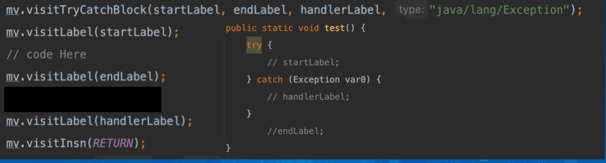

但这时候我们再运行生成好的程序，成功喜提一个VerifyError的报错，这是因为在执行前，java会对类做验证，如果验证通过才能继续执行，反之抛出异常并退出

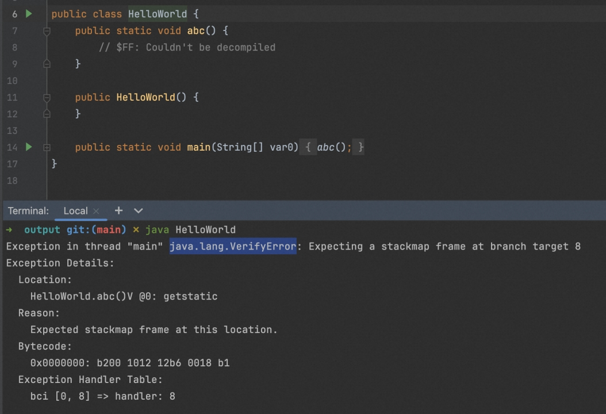但是在这里我们首要关心的不应该是是否验证有异常，而是关心是否能正确执行，在这里我们通过`-Xnoverify`手动跳过这个过程，可以发现是可以正常执行的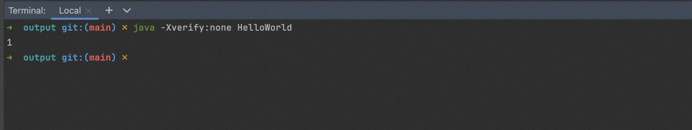

因此接下来我们便可以尝试是否能够欺骗验证过程，从而能够正确执行，我们仔细查看这个报错原因，发现其实和frame有关(什么是frame可自行百度)，在这里教大家一个ASM的小技巧

既然和FRAME有关那么，我们便可以在生成这个类的时候将参数替换为`ClassWriter.COMPUTE_FRAMES`,上面一开始也提到过这个参数的作用(在写入方法字节码时，会自动计算方法的堆栈映射帧和局部变量表的大小)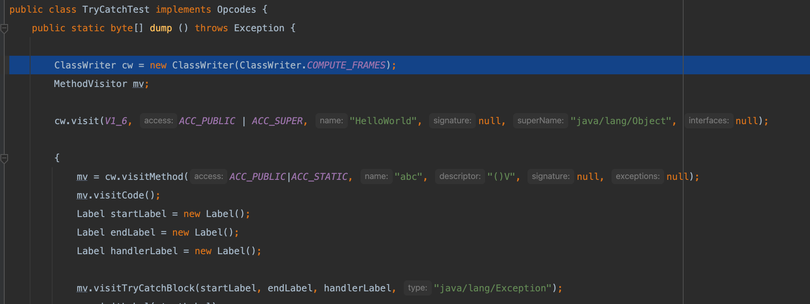

因此我们在此生成类并运行可以发现，报错变得非常直观，帧栈的大小不匹配

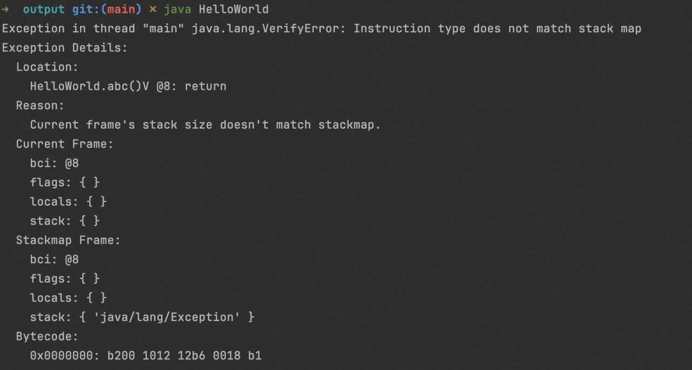那么既然少了一个我们便给他补齐一个即可(插入任意对象，仅验证大小的匹配)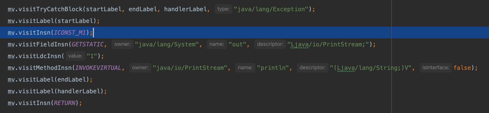

再次生成这个类，我们可以发现，VerifyError的错误消失，程序成功运行，也达到了我们混淆的目的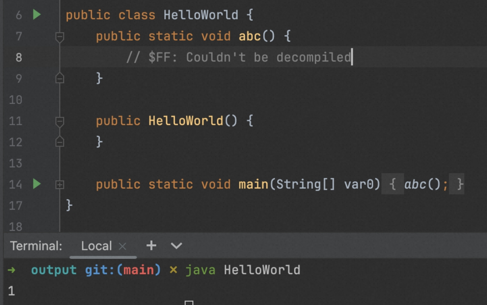

当然我们还能做什么呢？比如

-   继续调整start/end/handlerLabel的顺序，只要保证程序正确流向
-   多个try-catch结构的交叉或者首尾重叠
-   关注其他的特殊结构
-   关注java动态语言和函数式编程的特性的实现
-   …….(自由发挥，主要是看IDEA的代码，当然也可以尝试去对抗反混淆工具也很有意思，也能做到欺骗实现的代码执行或者报错)

## [](#%E6%80%BB%E7%BB%93 "总结")总结

在这次议题分享当中我们做到了对方法、字段以及代码片段的隐藏，同时实现了自定义的方法参数以及能够让IDEA反编译报错，因此我们便可以灵活使用这些结果，提升蓝队反编译分析的难度，为攻击争取更多的时间，同时针对隐藏的混淆效果，我们也可以将其运用到写插件后门的场景，实现一个定向投毒.
