# How to Easily Set Up a Mail Server on Debian 11 Bullseye with iRedMail --- 如何使用 iRedMail 在 Debian 11 Bullseye 上轻松设置邮件服务器

# How to Easily Set Up a Mail Server on Debian 11 Bullseye with iRedMail  
如何使用 iRedMail 在 Debian 11 Bullseye 上轻松设置邮件服务器

Last Updated: May 3rd, 2022 [Xiao Guoan (Admin)](https://www.linuxbabe.com/author/xiao-guoan)

[11 Comments](#comments)

[Mail Server](https://www.linuxbabe.com/category/mail-server)

  
最后更新时间： 2022年5月3日 肖国安 （管理员） 11条评论 邮件服务器

Setting up your own email server on Linux from scratch is a pain in the butt, if you are not a skilled server admin. This tutorial will be showing you how to use **iRedMail** to quickly set up a full-featured mail server on Debian 11, saving you lots of time and headaches.  
如果您不是熟练的服务器管理员，那么从头开始在 Linux 上设置自己的电子邮件服务器是一件很痛苦的事情。本教程将向您展示如何使用 iRedMail 在 Debian 11 上快速设置一个功能齐全的邮件服务器，为您节省大量时间和麻烦。

## What is iRedMail? 什么是 iRedMail？

iRedMail is a shell script that automatically installs and configures all necessary mail server components on your Linux/BSD server, thus eliminating manual installation and configuration. With iRedMail, you can easily **create unlimited mailboxes and unlimited mail domains** in a web-based admin panel. Mailboxes can be stored in MariaDB/MySQL, PostreSQL database or OpenLDAP. The following is a list of open-source software that will be automatically installed and configured by iRedMail.  
iRedMail 是一个 shell 脚本，可在 Linux/BSD 服务器上自动安装和配置所有必需的邮件服务器组件，从而消除手动安装和配置。使用 iRedMail，您可以在基于 Web 的管理面板中轻松创建无限的邮箱和无限的邮件域。邮箱可以存储在 MariaDB/MySQL、PostreSQL 数据库或 OpenLDAP 中。以下是 iRedMail 将自动安装和配置的开源软件列表。

-   Postfix SMTP server Postfix SMTP 服务器
-   Dovecot IMAP server Dovecot IMAP 服务器
-   **Nginx** web server to serve the admin panel and webmail  
    Nginx Web 服务器，用于服务管理面板和网络邮件
-   OpenLDAP, MySQL/MariaDB, or PostgreSQL for storing user information  
    用于存储用户信息的 OpenLDAP、MySQL/MariaDB 或 PostgreSQL
-   Amavised-new for DKIM signing and verification  
    Amavised-new 用于 DKIM 签名和验证
-   SpamAssassin for anti-spam  
    用于反垃圾邮件的 SpamAssassin
-   ClamAV for anti-virus 用于防病毒的 ClamAV
-   Roundcube webmail Roundcube 网络邮件
-   SOGo groupware, providing webmail, calendar (CalDAV), contacts (CardDAV), tasks and ActiveSync services.  
    SOGo 群件，提供网络邮件、日历 （CalDAV）、联系人 （CardDAV）、任务和 ActiveSync 服务。
-   Fail2ban for protecting SSH  
    用于保护 SSH 的 Fail2ban
-   mlmmj mailing list manager  
    MLMMJ 邮件列表管理器
-   Netdata server monitoring  
    Netdata 服务器监控
-   iRedAPD Postfix policy server for greylisting  
    用于列入灰名单的 iRedAPD Postfix 策略服务器

## Step 1: Choose the Right Hosting Provider and Buy a Domain Name  
第 1 步：选择合适的托管服务提供商并购买域名

To set up a full-featured email server with iRedMail, you need a server with at least 3GB RAM, because after the installation, your server will use more than 2GB of RAM.  
要使用 iRedMail 设置功能齐全的电子邮件服务器，您需要一台至少具有 3GB RAM 的服务器，因为安装后，您的服务器将使用超过 2GB 的 RAM。

It is highly recommended that you install iRedMail on a **clean install of** **Debian 11** server.  
强烈建议您将 iRedMail 安装在 Debian 11 服务器的全新安装上。

This tutorial is done on a [$9/month Kamatera VPS (virtual private server)](https://www.linuxbabe.com/kamatera) with 1 CPU and 3GB RAM. They offer a 30-day free trial.  
本教程是在每月 9 美元的 Kamatera VPS（虚拟专用服务器）上完成的，具有 1 个 CPU 和 3GB RAM。他们提供 30 天免费试用。

Kamatera is a very good option to run a mail server because  
Kamatera 是运行邮件服务器的一个非常好的选择，因为

-   **They don’t block port 25**, so you can send unlimited emails (transactional email and newsletters) without spending money on SMTP relay service. Kamatera doesn’t have any SMTP limits. You can send a million emails per day.  
    它们不会阻止端口 25，因此您可以发送无限制的电子邮件（交易电子邮件和时事通讯），而无需在 SMTP 中继服务上花钱。Kamatera 没有任何 SMTP 限制。您每天可以发送一百万封电子邮件。
-   **The IP address isn’t on any email blacklist**. (At least this is true in my case. I chose the Dallas data center.) You definitely don’t want to be listed on the dreaded Microsoft Outlook IP blacklist or the spamrats blacklist. Some blacklists block an entire IP range and you have no way to delist your IP address from this kind of blacklist.  
    该 IP 地址不在任何电子邮件黑名单上。（至少在我的情况下是这样。我选择了达拉斯数据中心。您绝对不希望被列入可怕的 Microsoft Outlook IP 黑名单或垃圾邮件黑名单。某些黑名单会阻止整个 IP 范围，您无法从此类黑名单中删除您的 IP 地址。
-   **You can edit PTR record to improve email deliverability.  
    您可以编辑 PTR 记录以提高电子邮件的送达率。**
-   **They allow you to send newsletters** to your email subscribers with **no** hourly limits or daily limits, whatsoever.  
    它们允许您向电子邮件订阅者发送时事通讯，没有任何小时或每日限制。
-   **You can order multiple IP addresses for a single server.** This is very useful for folks who need to send a large volume of emails. You can [spread email traffic on multiple IP addresses](https://www.linuxbabe.com/mail-server/postfix-multiple-instances-ip-rotation-on-a-single-vps) to achieve better email deliverability.  
    您可以为单个服务器订购多个 IP 地址。这对于需要发送大量电子邮件的人来说非常有用。您可以将电子邮件流量分散到多个 IP 地址上，以实现更好的电子邮件送达率。

Other VPS providers like [DigitalOcean](https://www.linuxbabe.com/digitalocean) blocks port 25. DigitalOcean would not unblock port 25, so you will need to set up SMTP relay to bypass blocking, which can cost you additional money. If you use [Vultr VPS](https://www.linuxbabe.com/vultr), then port 25 is blocked by default. They can unblock it if you open a support ticket, but they may block it again at any time if they decide your email sending activity is not allowed. Vultr actually may re-block it if you use their servers to send newsletters.  
其他 VPS 提供商（如 DigitalOcean）阻止了端口 25。DigitalOcean 不会解锁端口 25，因此您需要设置 SMTP 中继以绕过阻止，这可能会花费您额外的费用。如果您使用 Vultr VPS，则默认情况下会阻止端口 25。如果您打开支持票证，他们可以取消阻止它，但如果他们决定不允许您的电子邮件发送活动，他们可以随时再次阻止它。如果您使用他们的服务器发送时事通讯，Vultr 实际上可能会重新阻止它。

Go to [Kamatera website](https://www.linuxbabe.com/kamatera) to create an account, then create your server in your account dashboard.  
转到 Kamatera 网站创建一个帐户，然后在您的帐户仪表板中创建您的服务器。

[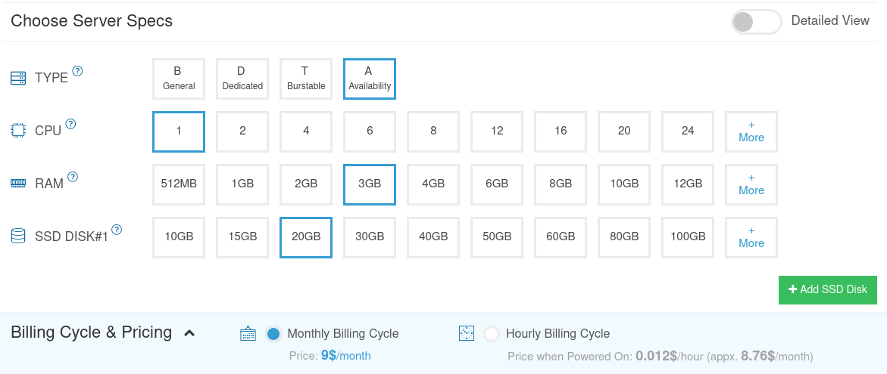](https://www.linuxbabe.com/kamatera)

I recommend following the tutorial linked below to properly set up your Linux VPS server on Kamatera.  
我建议按照下面链接的教程在 Kamatera 上正确设置您的 Linux VPS 服务器。

-   [↓↓↓](https://www.linuxbabe.com/linux-server/how-to-create-a-linux-vps-server-on-kamatera)  
      
    How to Create a Linux VPS Server on Kamatera  
    如何在 Kamatera 上创建 Linux VPS 服务器  
      
    [↑↑↑](https://www.linuxbabe.com/linux-server/how-to-create-a-linux-vps-server-on-kamatera)
    

Once you created a server, Kamatera will send you an email with the server SSH login details. To log into your server, you use an SSH client. If you are using Linux or macOS on your computer, then simply open up a terminal window and run the following command to log into your server. Replace 12.34.56.78 with your server’s IP address.  
创建服务器后，Kamatera 将向您发送一封电子邮件，其中包含服务器 SSH 登录详细信息。要登录到您的服务器，请使用 SSH 客户端。如果您在计算机上使用 Linux 或 macOS，则只需打开终端窗口并运行以下命令即可登录您的服务器。将 12.34.56.78 替换为服务器的 IP 地址。

```plain
ssh root@12.34.56.78
```

You will be asked to enter the password.  
系统将要求您输入密码。

You also need a domain name. I registered my domain name from [NameCheap](https://www.linuxbabe.com/namecheap) because the price is low and they give whois privacy protection free for life.  
您还需要一个域名。我从 NameCheap 注册了我的域名，因为价格低廉，而且他们终身免费提供 whois 隐私保护。

## Step 2: Creating DNS MX Record  
第 2 步：创建 DNS MX 记录

The MX record specifies which host or hosts handle emails for a particular domain name. For example, the host that handles emails for `linuxbabe.com` is `mail.linuxbabe.com`. If someone with a Gmail account sends an email to `somebody@linuxbabe.com`, then Gmail server will query the MX record of linuxbabe.com. When it finds out that `mail.linuxbabe.com` is responsible for accepting email, it then query the A record of `mail.linuxbabe.com` to get the IP address, thus the email can be delivered.  
MX 记录指定由哪台或多台主机处理特定域名的电子邮件。例如，处理 电子邮件的 `linuxbabe.com` 主机是 `mail.linuxbabe.com` 。如果拥有 Gmail 帐户的人向 `somebody@linuxbabe.com` 发送电子邮件，则 Gmail 服务器将查询 linuxbabe.com 的 MX 记录。当它发现 `mail.linuxbabe.com` 负责接受电子邮件时，它会查询 的 A 记录 `mail.linuxbabe.com` 以获取 IP 地址，从而可以发送电子邮件。

You can log in to your domain registrar’s website (such as [NameCheap](https://www.linuxbabe.com/linux-server/create-dns-records-in-namecheap)) to create DNS records.  
您可以登录域名注册商的网站（如 NameCheap）来创建 DNS 记录。

In your DNS manager, create a MX record for your domain name. Enter `@` in the Name field to represent the main domain name, then enter `mail.your-domain.com` in the Value field.  
在 DNS 管理器中，为您的域名创建 MX 记录。在“名称”字段中输入以表示主域名，然后在“值”字段中输入 `@` `mail.your-domain.com` 。

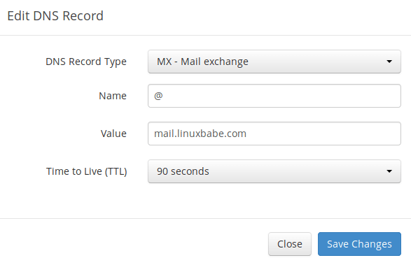

**Note**: The hostname for MX record can not be an alias to another name. Also, It’s highly recommended that you use hostnames, rather than bare IP addresses for MX record.  
注意：MX 记录的主机名不能是其他名称的别名。此外，强烈建议您使用 MX 记录的主机名，而不是裸 IP 地址。

Your DNS manager may require you to enter a preference value (aka priority value). It can be any number between 0 and 65,356. A small number has higher priority than a big number. It’s recommended that you set the value to 0, so this mail server will have the highest priority for receiving emails. After creating MX record, you also need to create an A record for `mail.your-domain.com` , so that it can be resolved to an IP address. If your server uses IPv6 address, be sure to add AAAA record.  
您的 DNS 管理器可能会要求您输入首选项值（也称为优先级值）。它可以是 0 到 65,356 之间的任何数字。小数字比大数字具有更高的优先级。建议您将该值设置为 0，以便此邮件服务器具有接收电子邮件的最高优先级。创建 MX 记录后，还需要为 创建 A 记录，以便将其解析为 `mail.your-domain.com` IP 地址。如果您的服务器使用 IPv6 地址，请务必添加 AAAA 记录。

Hint: If you use Cloudflare DNS service, you should not enable the CDN feature when creating A record for `mail.your-domain.com`. Cloudflare does not support SMTP proxy.  
提示：如果您使用 Cloudflare DNS 服务，则在为 `mail.your-domain.com` 创建 A 记录时不应启用 CDN 功能。Cloudflare 不支持 SMTP 代理。

## Step 3: Configuring Hostname  
第 3 步：配置主机名

Log into your server via [SSH](https://www.linuxbabe.com/linux-server/ssh-windows), then run the following command to update existing software packages.  
通过SSH登录服务器，然后运行以下命令以更新现有软件包。

```plain
sudo apt update;sudo apt upgrade
```

I strongly recommend creating a `sudo` user for managing your server rather than using the default `root` user. Run the following command to create a user. Replace `username` with your preferred username.  
我强烈建议创建一个用户来管理您的服务器，而不是使用默认 `sudo` `root` 用户。执行以下命令，创建用户。替换为 `username` 您的首选用户名。

```plain
adduser username
```

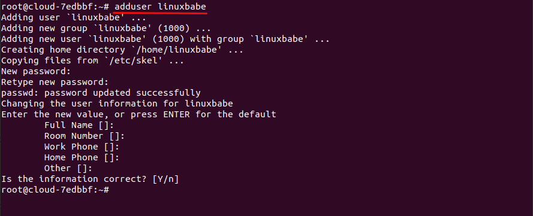

Then add the user to the `sudo` group.  
然后将用户添加到组。 `sudo`

```plain
adduser username sudo
```

Then switch to the new user.  
然后切换到新用户。

```plain
su - username
```

Next, set a fully qualified domain name (FQDN) for your server with the following command.  
接下来，使用以下命令为服务器设置完全限定的域名 （FQDN）。

```plain
sudo hostnamectl set-hostname mail.your-domain.com
```

We also need to update `/etc/hosts` file with a command line text editor like Nano.  
我们还需要使用命令行文本编辑器（如 Nano）更新 `/etc/hosts` 文件。

```plain
sudo nano /etc/hosts
```

Edit it like below. (Use arrow keys to move the cursor in the file.)  
像下面这样编辑它。（使用箭头键在文件中移动光标。

```plain
127.0.0.1       mail.your-domain.com localhost
```

Save and close the file. (To save a file in Nano text editor, press `Ctrl+O`, then press `Enter` to confirm. To close the file, press `Ctrl+X`.)  
保存并关闭文件。（要在 Nano 文本编辑器中保存文件，请按 ，然后按 `Ctrl+O` `Enter` 确认。要关闭文件，请按 `Ctrl+X` 。

To see the changes, log out and log back in, then run the following command to see your hostname.  
若要查看更改，请注销并重新登录，然后运行以下命令以查看主机名。

```plain
hostname -f
```

## Step 4: Setting up Mail Server on Debian 11 with iRedMail  
第 4 步：使用 iRedMail 在 Debian 11 上设置邮件服务器

Run the following commands to download the latest version of iRedMail script installer from its Github repository.  
运行以下命令，从其 Github 存储库下载最新版本的 iRedMail 脚本安装程序。

```plain
wget https://github.com/iredmail/iRedMail/archive/1.5.1.tar.gz
```

Extract the archived file.  
解压缩存档文件。

```plain
tar xvf 1.5.1.tar.gz
```

Then cd into the newly-created directory.  
然后 cd 进入新创建的目录。

```plain
cd iRedMail-1.5.1/
```

Add executable permission to the `iRedMail.sh` script.  
向 `iRedMail.sh` 脚本添加可执行权限。

```plain
chmod +x iRedMail.sh
```

Next, run the Bash script with sudo privilege.  
接下来，使用 sudo 权限运行 Bash 脚本。

```plain
sudo bash iRedMail.sh
```

The mail server setup wizard will appear. Use the tab key to select **Yes** and press Enter.  
将出现邮件服务器设置向导。使用 Tab 键选择“是”，然后按 Enter。

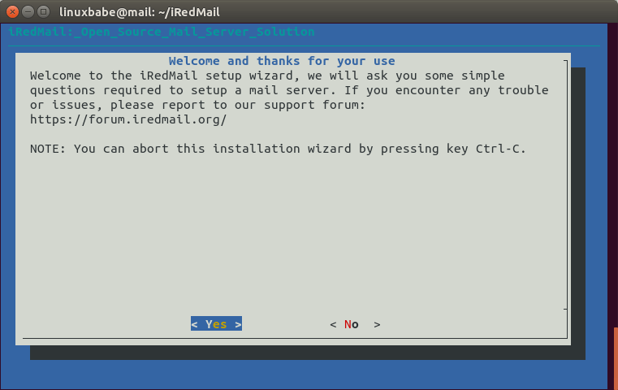

The next screen will ask you to select the mail storage path. You can use the default one `/var/vmail`, so simply press Enter.  
下一个屏幕将要求您选择邮件存储路径。您可以使用默认的 `/var/vmail` ，因此只需按 Enter 键即可。

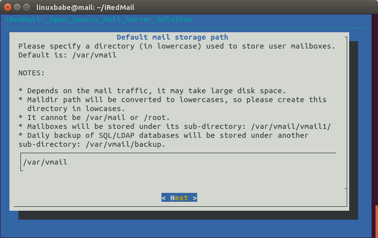

Then choose whether you want to run a web server. It’s highly recommended that you choose to run a web server because you need the web-based admin panel to add email accounts. Also it allows you to access the Roundcube webmail. By default, Nginx web server is selected, so you can simply press Enter. (An asterisk indicates the item is selected.)  
然后选择是否要运行 Web 服务器。强烈建议您选择运行 Web 服务器，因为您需要基于 Web 的管理面板来添加电子邮件帐户。此外，它还允许您访问 Roundcube 网络邮件。默认情况下，Nginx Web 服务器处于选中状态，因此您只需按 Enter 键即可（星号表示已选择该项目。

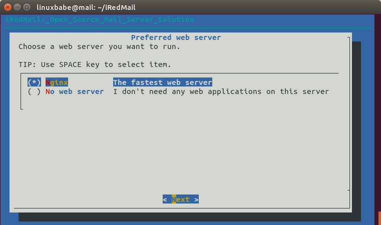

Then select the storage backend for email accounts. Choose one that you are familiar with. This tutorial chose MariaDB. Press up and down arrow key and press the space bar to select.  
然后选择电子邮件帐户的存储后端。选择您熟悉的一个。本教程选择了 MariaDB。按向上和向下箭头键，然后按空格键进行选择。

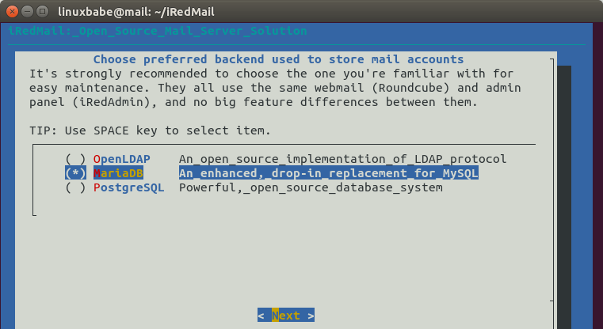

If you selected MariaDB or MySQL, then you will need to set the MySQL root password.  
如果您选择了 MariaDB 或 MySQL，则需要设置 MySQL root 密码。

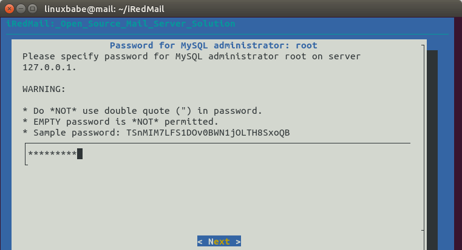

Next, enter your first mail domain. You can add additional mail domains later in the web-based admin panel. This tutorial assumes that you want an email account like **john.doe@your-domain.com**. In that case, you need to enter **your-domain.com** here, without sub-domain. Do not press the space bar after your domain name. I think iRedMail will copy the space character along with your domain name, which can result in installation failure.  
接下来，输入您的第一个邮件域。您可以稍后在基于 Web 的管理面板中添加其他邮件域。本教程假定你想要一个像 john.doe@your-domain.com 这样的电子邮件帐户。在这种情况下，您需要在此处输入 your-domain.com，不带子域。不要在域名后按空格键。我认为 iRedMail 会将空格字符与您的域名一起复制，这可能会导致安装失败。

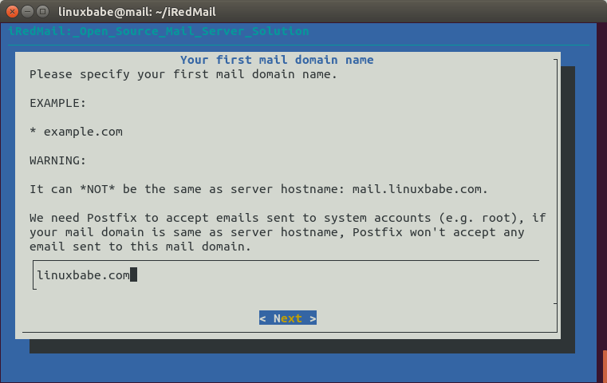

Next, set a password for the mail domain administrator.  
接下来，为邮件域管理员设置密码。

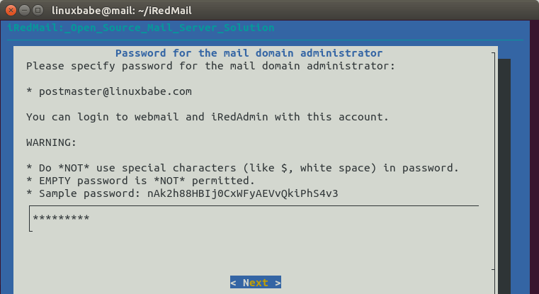

Choose optional components. By default, 4 items are selected. If you like to use the SOGo groupware (webmail, calendar, address book, ActiveSync), then press the down arrow key and space bar to select. Press `Enter` to the next screen.  
选择可选组件。默认情况下，将选择 4 个项目。如果您想使用 SOGo 群件（网络邮件、日历、地址簿、ActiveSync），请按向下箭头键和空格键进行选择。按 `Enter` 到下一个屏幕。

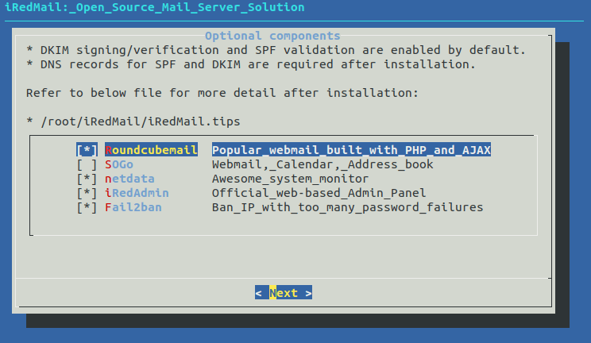

Now you can review your configurations. Type `Y` to begin the installation of all mail server components.  
现在，您可以查看您的配置。键入 `Y` 以开始安装所有邮件服务器组件。

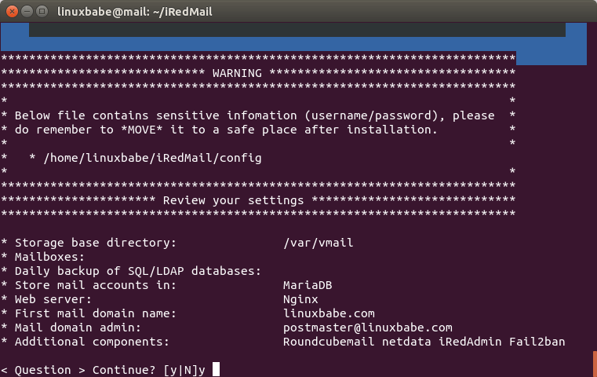

At the end of installation, choose `y` to use firewall rules provided by iRedMail and restart firewall.  
在安装结束时，选择 `y` 使用 iRedMail 提供的防火墙规则并重新启动防火墙。

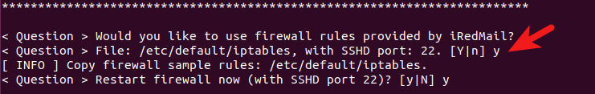

Now iRedMail installation is complete. You will be notified the URL of webmail, SOGo groupware and web admin panel and the login credentials. The `iRedMail.tips` file contains important information about your iRedMail server.  
现在 iRedMail 安装已完成。您将收到网络邮件、SOGo 群件和网络管理面板的 URL 以及登录凭据的通知。该文件 `iRedMail.tips` 包含有关 iRedMail 服务器的重要信息。

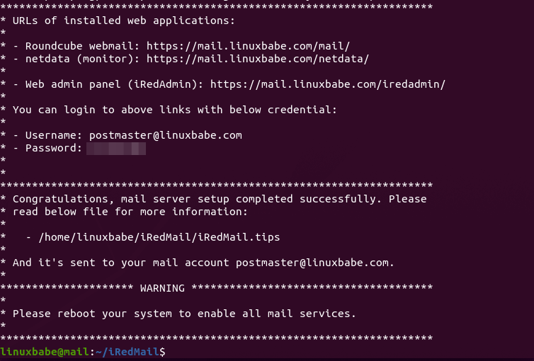

Reboot your Debian 11 server.  
重启 Debian 11 服务器。

```plain
sudo shutdown -r now
```

Once your server is back online, you can visit the web admin panel.  
服务器重新联机后，您可以访问 Web 管理面板。

```plain
https://mail.your-domain.com/iredadmin/
```

**Note** that in the above URL, the sub-directory for accessing the admin panel is `/iredadmin/`, not `/iredmail/`. And because it’s using a self-signed TLS certificate, you need to add security exception in your web browser.  
请注意，在上面的 URL 中，用于访问管理面板的子目录是 `/iredadmin/` ，而不是 `/iredmail/` 。由于它使用自签名 TLS 证书，因此您需要在 Web 浏览器中添加安全例外。

## Step 5: Installing Let’s Encrypt TLS Certificate  
第 5 步：安装 Let's Encrypt TLS 证书

Since the mail server is using a self-signed TLS certificate, both desktop mail client users and webmail client users will see a warning. To fix this, we can obtain and install a free Let’s Encrypt TLS certificate.  
由于邮件服务器使用的是自签名 TLS 证书，因此桌面邮件客户端用户和 Web 邮件客户端用户都将看到警告。为了解决这个问题，我们可以获取并安装一个免费的Let's Encrypt TLS证书。

### Obtaining the Certificate  
获取证书

First, log into your server again via SSH and run the following command to install Let’s Encrypt (certbot) client on Debian 11.  
首先，通过 SSH 再次登录您的服务器并运行以下命令以在 Debian 11 上安装 Let's Encrypt （certbot） 客户端。

```plain
sudo apt install certbot
```

iRedMail has already configured TLS settings in the default Nginx virtual host, so here I recommend using the webroot plugin, instead of nginx plugin, to obtain certificate. Run the following command. Replace red text with your actual data.  
iRedMail 已经在默认的 Nginx 虚拟主机中配置了 TLS 设置，所以这里我建议使用 webroot 插件，而不是 nginx 插件来获取证书。运行以下命令。将红色文本替换为实际数据。

```plain
sudo certbot certonly --webroot --agree-tos --email you@example.com -d mail.your-domain.com -w /var/www/html/
```

When it asks you if you want to receive communications from EFF, you can choose No.  
当它询问您是否要接收来自 EFF 的通信时，您可以选择否。

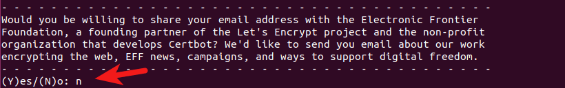

If everything went well, you will see the following text indicating that you have successfully obtained a TLS certificate. Your certificate and chain have been saved at `/etc/letsencrypt/live/mail.your-domain.com/` directory.  
如果一切顺利，您将看到以下文本，表明您已成功获得 TLS 证书。您的证书和链已保存在 `/etc/letsencrypt/live/mail.your-domain.com/` 目录中。

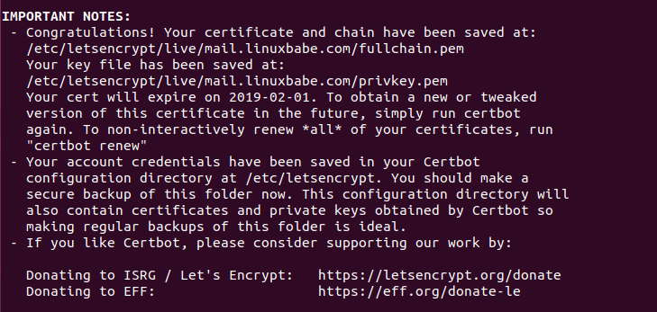

### Failure to Obtain TLS Certificate  
无法获取TLS证书

If certbot failed to obtain TLS certificate, maybe it’s because your DNS records are not propagated to the Internet. Depending on the domain registrar you use, your DNS record might be propagated instantly, or it might take up to 24 hours to propagate. You can go to [https://dnsmap.io](https://dnsmap.io/), enter your mail server’s hostname (`mail.your-domain.com`) to check DNS propagation.  
如果 certbot 无法获取 TLS 证书，可能是因为您的 DNS 记录未传播到 Internet。根据您使用的域注册机构，您的 DNS 记录可能会立即传播，或者可能需要长达 24 小时才能传播。您可以转到 https://dnsmap.io，输入邮件服务器的主机名 （ `mail.your-domain.com` ） 以检查 DNS 传播。

If certbot failed to obtain a certificate and you saw the following message,  
如果 certbot 无法获取证书，并且您看到以下消息，

```plain
Failed authorization procedure. mail.linuxbabe.com (http-01): urn:ietf:params:acme:error:connection :: The server could not connect to the client to verify the domain :: Fetching https://mail.linuxbabe.com/.well-known/acme-challenge/IZ7hMmRE4ZlGW7cXYoq2Lc_VrFzVFyfW6E0pzNlhiOA: Timeout during connect (likely firewall problem)
```

It might be that you have set AAAA record for `mail.your-domain.com`, but Nginx web server doesn’t listen on IPv6 address. To fix this error, edit the `/etc/nginx/sites-enabled/00-default.conf` file  
可能是您为 设置了 AAAA 记录 `mail.your-domain.com` ，但 Nginx Web 服务器不侦听 IPv6 地址。若要修复此错误，请编辑 `/etc/nginx/sites-enabled/00-default.conf` 文件

```plain
sudo nano /etc/nginx/sites-enabled/00-default.conf
```

Find the following line.  
找到以下行。

```plain
#listen [::]:80;
```

Remove the `#` character to enable IPv6 for this Nginx virtual host.  
删除该 `#` 字符以为此 Nginx 虚拟主机启用 IPv6。

```plain
listen [::]:80;
```

Save and close the file. Then edit the SSL virtual host `/etc/nginx/sites-enabled/00-default-ssl.conf`.  
保存并关闭文件。然后编辑 SSL 虚拟主机 `/etc/nginx/sites-enabled/00-default-ssl.conf` 。

```plain
sudo nano /etc/nginx/sites-enabled/00-default-ssl.conf
```

Add the following line.  
添加以下行。

```plain
listen [::]:443 ssl http2;
```

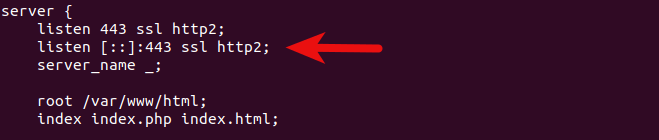

Save and close the file. Then test Nginx configuration.  
保存并关闭文件。然后测试 Nginx 配置。

```plain
sudo nginx -t
```

If the test is successful, reload Nginx for the change to take effect.  
如果测试成功，请重新加载 Nginx 以使更改生效。

```plain
sudo systemctl reload nginx
```

Run the following command again to obtain TLS certificate. Replace red text with your actual data.

```plain
sudo certbot certonly --webroot --agree-tos --email you@example.com -d mail.your-domain.com -w /var/www/html/
```

Now you should be able to successfully obtain TLS certificate.

### Installing the Certificate in Nginx

After obtaining a TLS certificate, let’s configure Nginx web server to use it. Edit the SSL template file.

```plain
sudo nano /etc/nginx/templates/ssl.tmpl
```

Find the following 2 lines.

```plain
ssl_certificate /etc/ssl/certs/iRedMail.crt;
ssl_certificate_key /etc/ssl/private/iRedMail.key;
```

Replace them with:

```plain
ssl_certificate /etc/letsencrypt/live/mail.your-domain.com/fullchain.pem;
ssl_certificate_key /etc/letsencrypt/live/mail.your-domain.com/privkey.pem;
```

Save and close the file. Then test nginx configuration and reload.

```plain
sudo nginx -t

sudo systemctl reload nginx
```

Visit iRedMail admin panel again (`https://mail.your-domain.com/iredadmin/`), your web browser won’t warn you any more because Nginx is now using a valid TLS certificate.

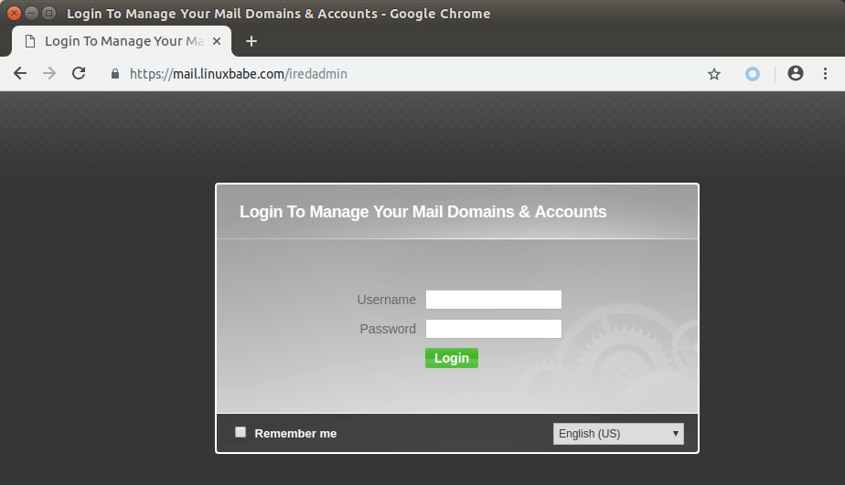

### Installing TLS Certificate in Postfix and Dovecot

We also need to configure Postfix SMTP server and Dovecot IMAP server to use the Let’s Encrypt issued certificate so that desktop mail client won’t display security warning. Edit the main configuration file of Postfix.

```plain
sudo nano /etc/postfix/main.cf
```

Find the following 3 lines. (line 95, 96, 97).

```plain
smtpd_tls_key_file = /etc/ssl/private/iRedMail.key
smtpd_tls_cert_file = /etc/ssl/certs/iRedMail.crt
smtpd_tls_CAfile = /etc/ssl/certs/iRedMail.crt
```

Replace them with:

```plain
smtpd_tls_key_file = /etc/letsencrypt/live/mail.your-domain.com/privkey.pem
smtpd_tls_cert_file = /etc/letsencrypt/live/mail.your-domain.com/cert.pem
smtpd_tls_CAfile = /etc/letsencrypt/live/mail.your-domain.com/chain.pem
```

Save and close the file. Then reload Postfix.

```plain
sudo systemctl reload postfix
```

Next, edit the main configuration file of Dovecot.

```plain
sudo nano /etc/dovecot/dovecot.conf
```

Fine the following 2 lines. (line 47, 48)

```plain
ssl_cert = </etc/ssl/certs/iRedMail.crt
ssl_key = </etc/ssl/private/iRedMail.key
```

Replace them with:

```plain
ssl_cert = </etc/letsencrypt/live/mail.your-domain.com/fullchain.pem
ssl_key = </etc/letsencrypt/live/mail.your-domain.com/privkey.pem
```

Save and close the file. Then reload dovecot.

```plain
sudo systemctl reload dovecot
```

From now on, desktop mail users won’t see security warnings.

## Step 6: Sending Test Email

Log into iredadmin panel with the postmaster mail account (postmaster@your-domain.com). In the `Add` tab, you can add additional domains or email addresses.

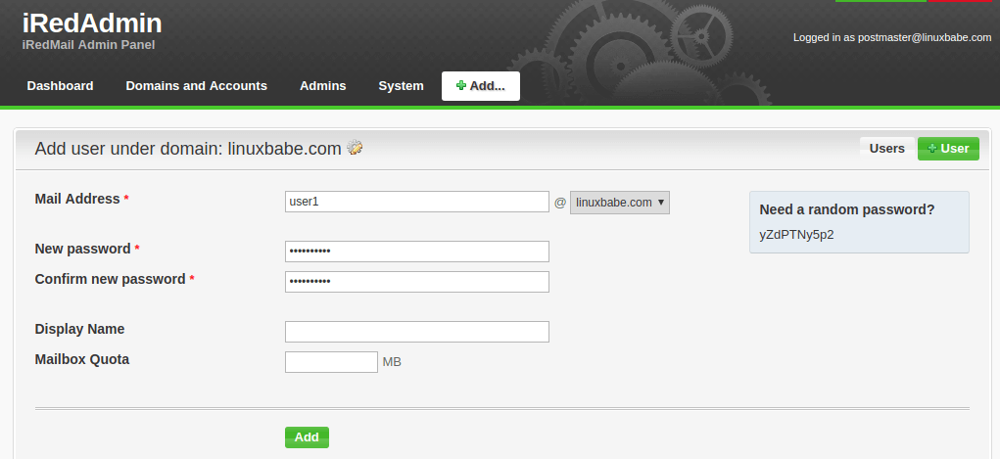

If you see “no domain under control” error, please refer to [this article](https://www.linuxbabe.com/mail-server/no-domain-under-control-iredmail).

After you create a user, you can visit the Roundcube webmail address and login with the new mail user account.

```plain
https://mail.your-domain.com/mail/
```

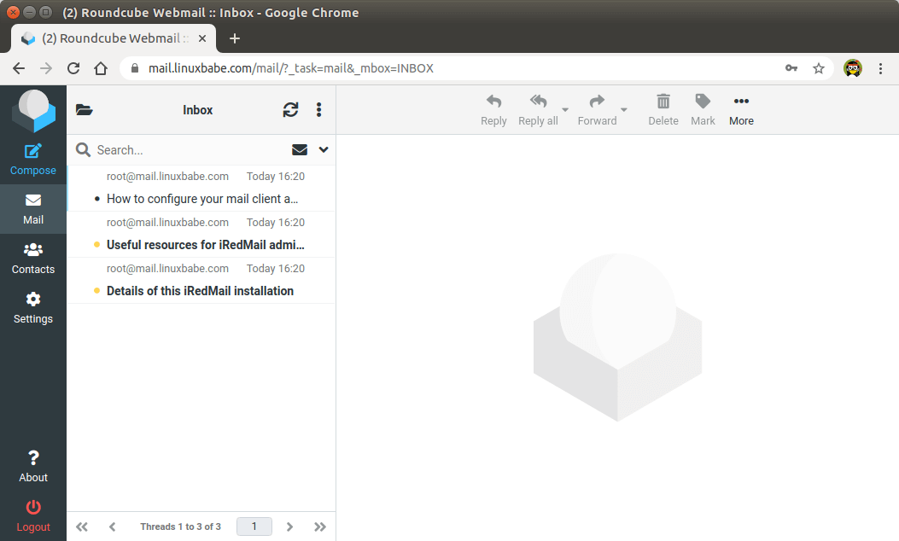

Now you can test email sending and receiving. Please note that you may need to wait a few minutes to receive emails because iRedMail by default enables greylisting, which is a way to tell other sending SMTP servers to try again in a few minutes. The following line in mail log file `/var/log/mail.log` indicates greylisting is enabled.

```plain
Recipient address rejected: Intentional policy rejection, please try again later;
```

### Adding Swap Space

ClamAV is used to scan viruses in email messages. ClamAV can use a fair amount of RAM. If there’s not enough RAM on your server, ClamAV won’t work properly, which will prevent your mail server from sending emails. You can add a swap file to your server to increase the total RAM on your server. (Note that using swap space on the server will degrade server performance. If you want better performance, you should upgrade the physical RAM instead of using swap space.)

To add swap space on the server, first, use the `fallocate` command to create a file. For example, create a file named swapfile with 1G capacity in root file system:

```plain
sudo fallocate -l 1G /swapfile
```

Then make sure only root can read and write to it.

```plain
sudo chmod 600 /swapfile
```

Format it to swap:

```plain
sudo mkswap /swapfile
```

Output:

```plain
Setting up swapspace version 1, size = 1024 MiB (1073737728 bytes)
no label, UUID=0aab5886-4dfb-40d4-920d-fb1115c67433
```

Enable the swap file

```plain
sudo swapon /swapfile
```

To mount the swap space at system boot time, edit the `/etc/fstab` file.

```plain
sudo nano /etc/fstab
```

Add the following line at the bottom of this file.

```plain
/swapfile    swap    swap     defaults    0   0
```

Save and close the file. Then reload systemd and restart ClamAV.

```plain
sudo systemctl daemon-reload

sudo systemctl restart clamav-daemon
```

## Step 7: Checking If Port 25 (outbound) is blocked

Your ISP or hosting provider won’t block incoming connection to port 25 of your server, which means you can receive emails from other mail servers. However, many ISP/hosting providers block outgoing connection to port 25 of other mail servers, which means you can’t send emails.

If your email didn’t arrive at your other email address such as Gmail, then run the following command on your mail server to check if port 25 (outbound) is blocked.

```plain
telnet gmail-smtp-in.l.google.com 25
```

If it’s not blocked, you would see messages like below, which indicates a connection is successfully established. (Hint: Type in `quit` and press Enter to close the connection.)

```plain
Trying 74.125.68.26...
Connected to gmail-smtp-in.l.google.com.
Escape character is '^]'.
220 mx.google.com ESMTP y22si1641751pll.208 - gsmtp
```

If port 25 (outbound) is blocked, you would see something like:

```plain
Trying 2607:f8b0:400e:c06::1a...
Trying 74.125.195.27...
telnet: Unable to connect to remote host: Connection timed out
```

In this case, your Postfix SMTP server can’t send emails to other SMTP servers. Ask your ISP/hosting provider to open it for you. If they refuse your request, you need to [set up SMTP relay to bypass port 25 blocking](https://www.linuxbabe.com/mail-server/set-up-postfix-smtp-relay-debian-sendinblue).

## Still Can’t Send Email?

If port 25 (outbound) is not blocked, but you still can’t send emails from your own mail server to your other email address like Gmail, then you should check the mail log (`/var/log/mail.log`).

```plain
sudo nano /var/log/mail.log
```

For example, some folks might see the following lines in the file.

```plain
host gmail-smtp-in.l.google.com[2404:6800:4003:c03::1b] said: 550-5.7.1 [2a0d:7c40:3000:b8b::2] Our system has detected that 550-5.7.1 this message does not meet IPv6 sending guidelines regarding PTR 550-5.7.1 records and authentication. Please review 550-5.7.1 https://support.google.com/mail/?p=IPv6AuthError for more information
```

This means your mail server is using IPv6 to send the email, but you didn’t set up IPv6 records. You should go to your DNS manager, set `AAAA` record for `mail.your-domain.com`, then you should set `PTR` record for your IPv6 address, which is discussed in step 9.

## Step 8: Using Mail Clients on Your Computer or Mobile Device

Fire up your desktop email client such as Mozilla Thunderbird and add a mail account.

-   In the incoming server section, select IMAP protocol, enter `mail.your-domain.com` as the server name, choose port 143 and STARTTLS. Choose `normal password` as the authentication method.
-   In the outgoing section, select SMTP protocol, enter `mail.your-domain.com` as the server name, choose port 587 and STARTTLS. Choose `normal password` as the authentication method.

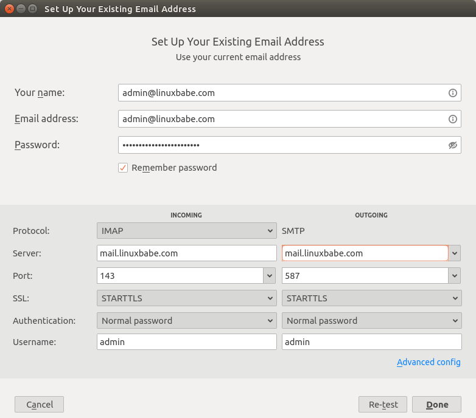

### Fail2ban Blocking Your Own IP Address

If you made a mistake and failed to log in to mail server multiple times, then the Fail2ban service on the mail server might block your IP address. You can add your IP address to whitelist by editing the `jail.local` file.

```plain
sudo nano /etc/fail2ban/jail.local
```

Add your own IP address to the ignore list like below. Replace 12.34.56.78 with your real IP address.

```plain
ignoreip = 12.34.56.78 127.0.0.1 127.0.0.0/8 10.0.0.0/8 172.16.0.0/12 192.168.0.0/16
```

Save and close the file. Then restart Fail2ban.

```plain
sudo systemctl restart fail2ban
```

## Step 9: Improving Email Deliverablity

To prevent your emails from being flagged as spam, you should set `PTR`, `SPF`, `DKIM` and `DMARC` records.

### PTR record

A pointer record, or PTR record, maps an IP address to a FQDN (fully qualified domain name). It’s the counterpart to the A record and is used for **reverse DNS** lookup, which can help with blocking spammers. Many SMTP servers reject emails if no PTR record is found for the sending server.

To check the PTR record for an IP address, run this command:

```plain
dig -x IP-address +short
```

or

```plain
host IP-address
```

PTR record isn’t managed by your domain registrar. It’s managed by the organization that gives you an IP address. Because you get IP address from your hosting provider or ISP, not from your domain registrar, so you must set PTR record for your IP in the control panel of your hosting provider, or ask your ISP. Its value should be your mail server’s hostname: `mail.your-domain.com`. If your server uses IPv6 address, be sure to add a PTR record for your IPv6 address as well.

To edit the reverse DNS record for your [Kamatera VPS](https://www.linuxbabe.com/kamatera), log into the Kamatera client area, then open a support ticket and tell them to add PTR record for your server IP addresss to point the IP address to `mail.your-domain.com`. It’s not convenient, you might think, but this is to keep spammers away from the platform, so legitimate email senders like us will have a great IP reputation.

### SPF Record

**SPF** (Sender Policy Framework) record specifies which hosts or IP address are allowed to send emails on behalf of a domain. You should allow only your own email server or your ISP’s server to send emails for your domain. In your DNS management interface, create a new TXT record like below.

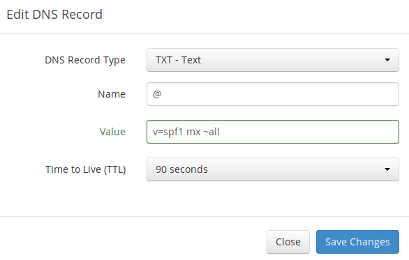

Explanation:

-   **TXT** indicates this is a TXT record.
-   Enter **@** in the name field to represent the main domain name.
-   **v=spf1** indicates this is a SPF record and the version is SPF1.
-   **mx** means all hosts listed in the MX records are allowed to send emails for your domain and all other hosts are disallowed.
-   **~all** indicates that emails from your domain should only come from hosts specified in the SPF record. Emails that are from other hosts will be flagged as forged.

To check if your SPF record is propagated to the public Internet, you can use the dig utility on your Linux machine like below:

```plain
dig your-domain.com txt
```

The `txt` option tells `dig` that we only want to query TXT records.

### DKIM Record

**DKIM** (DomainKeys Identified Mail) uses a private key to digitally sign emails sent from your domain. Receiving SMTP servers verify the signature by using the public key, which is published in the DNS DKIM record.

The iRedMail script automatically configured DKIM signing and verification for your server. The only thing left to do is creating DKIM record in DNS manager. Run the following command show the DKIM public key.

```plain
sudo amavisd-new showkeys
```

The DKIM public key is in the parentheses.

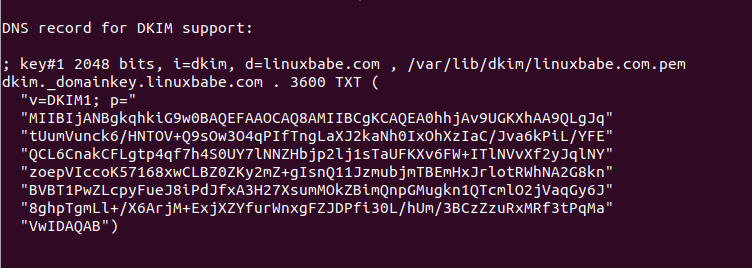

Then in your DNS manager, create a TXT record, enter `dkim._domainkey` in the name field. Copy everything in the parentheses and paste into the value field. Delete all double quotes and line breaks.

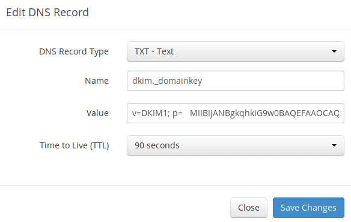

After saving your changes, run the following command to test if your DKIM record is correct.

```plain
sudo amavisd-new testkeys
```

If the DKIM record is correct, the test will pass. Note that your DKIM record may need sometime to propagate to the Internet. Depending on the domain registrar you use, your DNS record might be propagated instantly, or it might take up to 24 hours to propagate. You can go to [https://www.dmarcanalyzer.com/dkim/dkim-check/](https://www.dmarcanalyzer.com/dkim/dkim-check/), enter `dkim` as the selector and enter your domain name to check DKIM record propagation.

```plain
TESTING#1 linuxbabe.com: dkim._domainkey.linuxbabe.com => pass
```

### DMARC Record

DMARC stands for Domain-based Message Authentication, Reporting and Conformance. DMARC can help receiving email servers to identify legitimate emails and prevent your domain name from being used by email spoofing.

To create a DMARC record, go to your DNS manager and add a **TXT** record. In the name field, enter `_dmarc`. In the value field, enter the following. (You should create the dmarc@your-domain.com email address.)

```plain
v=DMARC1; p=none; pct=100; rua=mailto:dmarc@your-domain.com
```

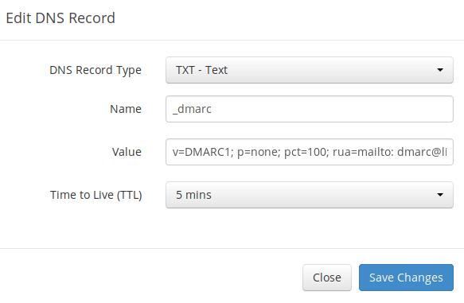

The above DMARC record is a safe starting point. To see the full explanation of DMARC, please check the following article.

-   [Creating DMARC Record to Protect Your Domain Name From Email Spoofing](https://www.linuxbabe.com/mail-server/create-dmarc-record)

## Step 10: Testing Email Score and Placement

After creating PTR, SPF, DKIM record, go to [**https://www.mail-tester.com**](https://www.mail-tester.com/). You will see a unique email address. Send an email from your domain to this address and then check your score. As you can see, I got a perfect score. In the test result, you should check if your PTR record, SPF and DKIM record is valid.

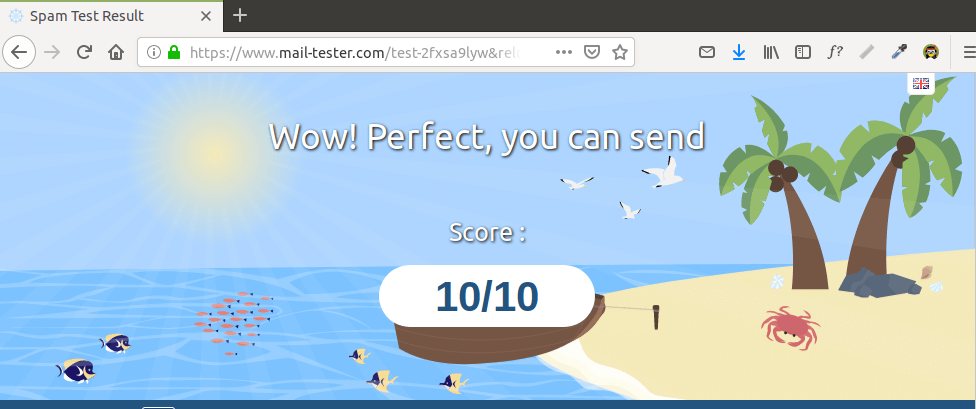Mail-tester.com can only show you a sender score. There’s another service called [GlockApps](https://www.linuxbabe.com/glockapps) that allow you to check if your email is landed in the recipient’s inbox or spam folder, or rejected outright. It supports many popular email providers like Gmail, Outlook, Hotmail, YahooMail, iCloud mail, etc

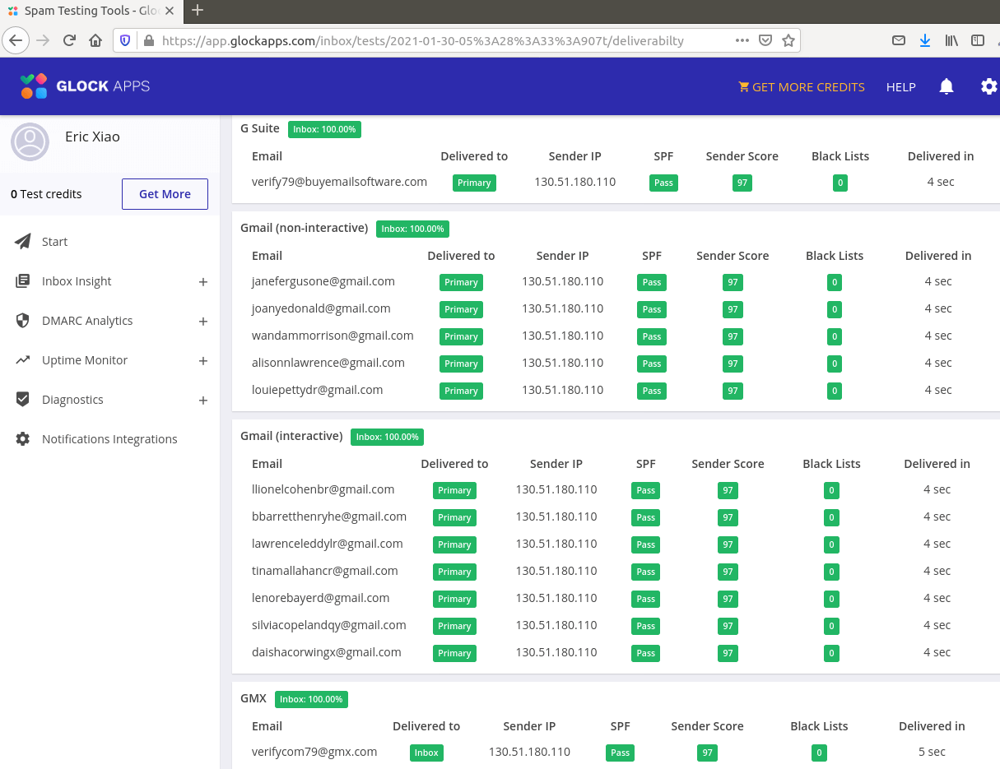

## What if Your Email is Rejected by Microsoft Mailbox?

Microsoft uses an internal blacklist that blocks many legitimate IP addresses. If your emails are rejected by Outlook or Hotmail, you need to follow the tutorial linked below to bypass Microsoft Outlook blacklist.

-   [How to Bypass the Microsoft Outlook Blacklist & Other Blacklists](https://www.linuxbabe.com/mail-server/microsoft-outlook-ip-blacklist)

## What if Your Emails Are Still Being Marked as Spam?

I have more tips for you in this article: [How to stop your emails being marked as spam](https://www.linuxbabe.com/mail-server/how-to-stop-your-emails-being-marked-as-spam). Although it will take some time and effort, your emails will eventually be placed in inbox after applying these tips.

## Adding Multiple Mail Domains

I wrote [this article to show you how to add multiple mail domains in iRedMail](https://www.linuxbabe.com/mail-server/set-up-iredmail-multiple-domains-nginx).

## How to Disable Greylisting

By default, iRedMail has enabled greylisting, which tells other sending SMTP servers to try again in a few minutes. This is mainly useful to block spam, but it also degrades user experience. If you prefer to disable greylisting, follow the instructions below.

Add write permission to the `/opt/iredapd/settings.py` file.

```plain
sudo chmod 600 /opt/iredapd/settings.py
```

Then edit the configuration file.

```plain
sudo nano /opt/iredapd/settings.py
```

Find the following line.

```plain
plugins = ["reject_null_sender", "wblist_rdns", "reject_sender_login_mismatch", "greylisting", "throttle", "amavisd_wblist", "sql_alias_access_policy"]
```

Remove `"greylisting"` from the list. Save and close the file. Then restart iredapd.

```plain
sudo systemctl restart iredapd
```

Change the configuration file back to read only mode.

```plain
sudo chmod 400 /opt/iredapd/settings.py
```

## Enabling SMTPS Port 465

If you are going to use Microsoft Outlook client, then you need to [enable SMTPS port 465 in Postfix SMTP server](https://www.linuxbabe.com/mail-server/enable-smtps-port-465-postfix).

## Troubleshooting

First, please use a VPS with at least 4GB RAM. Running iRedMail on a 1GB RAM VPS will cause the database, SpamAssassin, or ClamAV to be killed because of out-of-memory problem. If you insist on using a 1GB RAM VPS, you are going to lose incoming emails and have other undesirable outcomes.

If the iRedMail web interface isn’t accessible, like a 502 gateway error, you should check the Nginx logs in `/var/log/nginx/` directory to find clues. You may also want to check the mail log `/var/log/mail.log`.

Check if the various services are running.

```plain
systemctl status postfix

systemctl status dovecot

systemctl status nginx

systemctl status mariadb

systemctl status clamav-daemon

systemctl status amavis

systemctl status php7.3-fpm

systemctl status iredadmin
```

If you enabled the firewall, you should open the following ports in the firewall.

```plain
HTTP port:  80
HTTPS port: 443
SMTP port:  25
Submission port: 587 (and 465 if you are going to use Microsoft Outlook mail client)
IMAP port:  143 and 993
```

If you would like to use the UFW firewall, check my guide here: [Getting started with UFW firewall on Debian and Debian](https://www.linuxbabe.com/security/ufw-firewall-debian-ubuntu-linux-mint-server).

## How to Renew TLS Certificate

Let’s Encrypt issued TLS certificate is valid for 90 days only and it’s important that you set up a Cron job to automatically renew the certificate. You can run the following command to renew certificate.

```plain
sudo certbot renew -w /var/www/html
```

You can use the `--dry-run` option to test the renewal process, instead of doing a real renewal.

```plain
sudo certbot renew -w /var/www/html --dry-run
```

If you see the following error when renewing TLS certificate.

```plain
The client lacks sufficient authorization :: Invalid response
```

Then you need to create the hidden directory.

```plain
sudo mkdir -p /var/www/html/.well-known/acme-challenge
```

And set `www-data` as the owner of the webroot.

```plain
sudo chown www-data:www-data /var/www/html/ -R
```

Also, edit the SSL virtual host `/etc/nginx/sites-enabled/00-default-ssl.conf`. Add the following lines.

```plain
location ~ /.well-known/acme-challenge {
     root /var/www/html/;
     allow all;
}
```

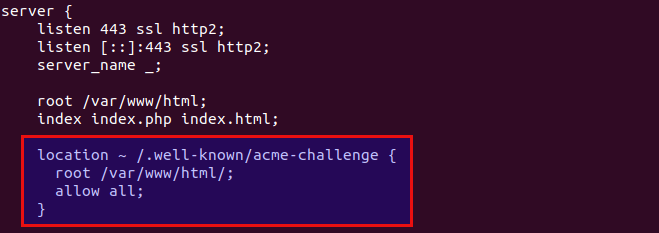

Save and close the file. Test Nginx configuration and reload.

```plain
sudo nginx -t
sudo systemctl reload nginx
```

### Create Cron Job

If now the dry run is successful, you can create Cron job to automatically renew certificate. Simply open root user’s crontab file.

```plain
sudo crontab -e
```

Then add the following line at the bottom of the file.

```plain
@daily certbot renew -w /var/www/html --quiet && systemctl reload postfix dovecot nginx
```

Reloading Postfix, Dovecot and Nginx is necessary to make these programs pick up the new certificate and private key.

## For Advanced Users

You may want to customize the SpamAssassin content filter to better detect spam.

-   [Block Email Spam By Checking Header and Body in Postfix/SpamAssassin](https://www.linuxbabe.com/mail-server/block-email-spam-check-header-body-with-postfix-spamassassin)

If your website and mail server are running on two different VPS (virtual private server), you can set up SMTP relay between your website and mail server, so that your website can send emails through your mail server. See the following article. (It’s written for Ubuntu, but also works on Debian).

-   [How to set up SMTP relay between 2 Postfix SMTP servers on Ubuntu](https://www.linuxbabe.com/mail-server/smtp-relay-between-2-postfix-smtp-servers)

## Wrapping Up

That’s it! I hope this tutorial helped you set up a mail server on Debian 11 with iRedMail. As always, if you found this post useful, then [subscribe to our free newsletter](https://newsletter.linuxbabe.com/subscription/wkeY5d6pg) to get more tips and tricks. Take care 🙂

Rate this tutorial

\[Total: 7 Average: 5\]
