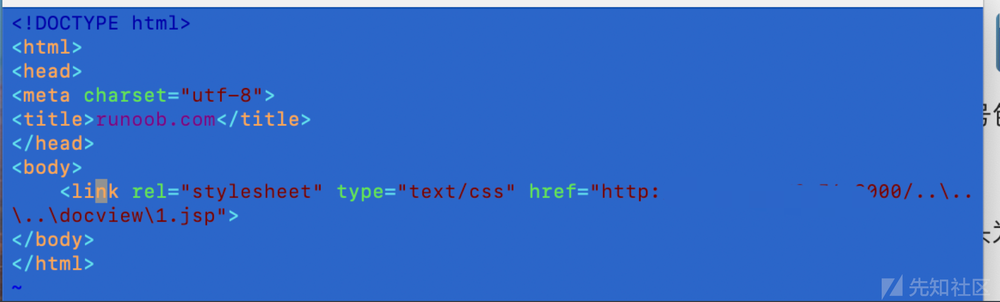
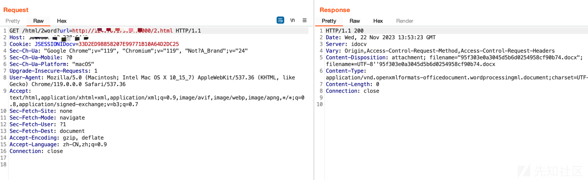
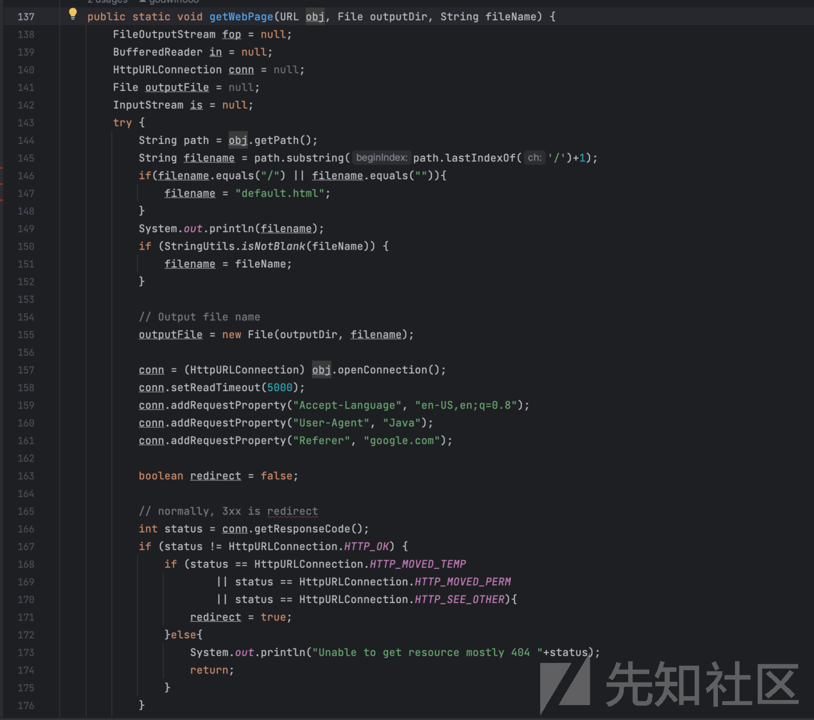
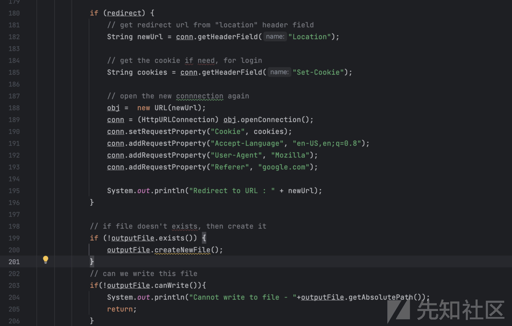
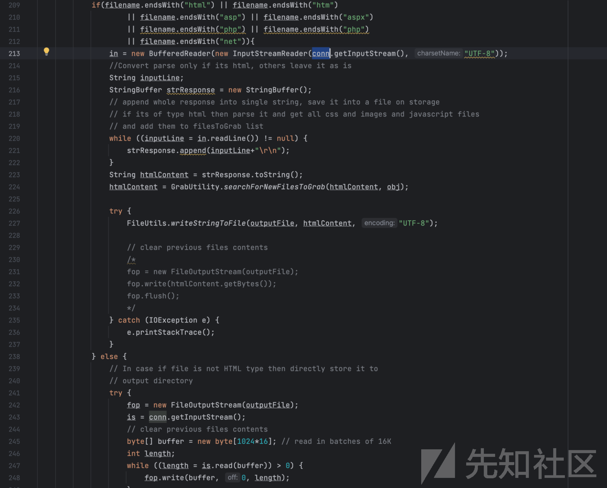
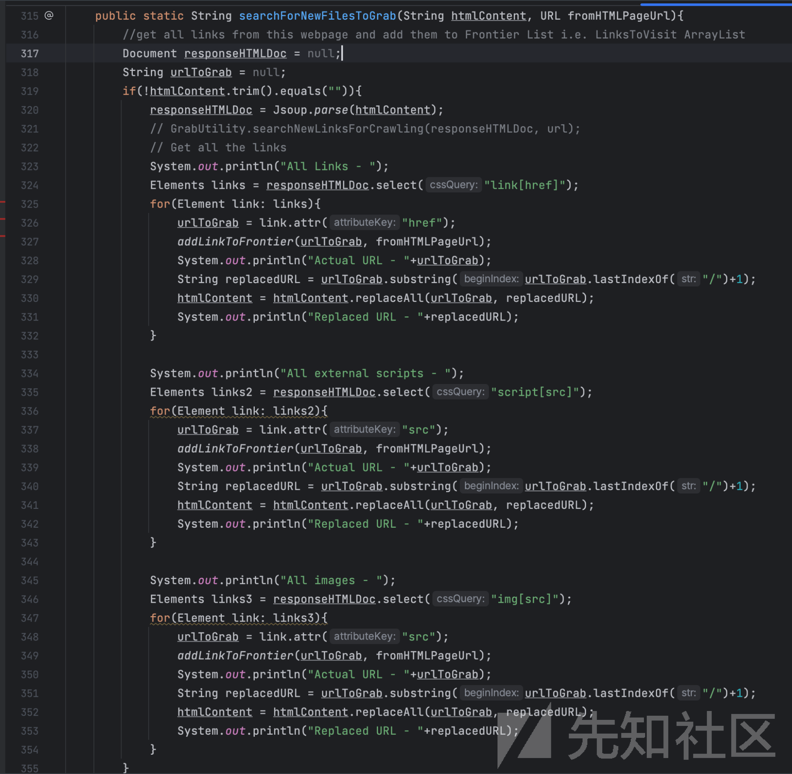
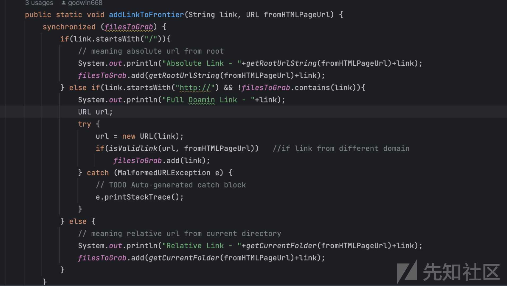
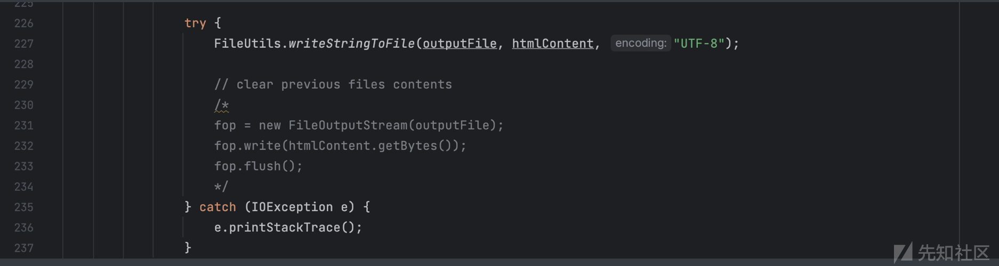
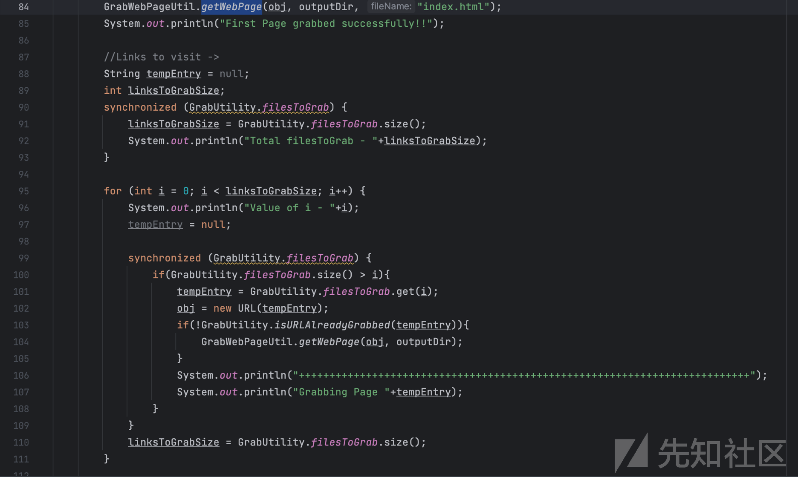
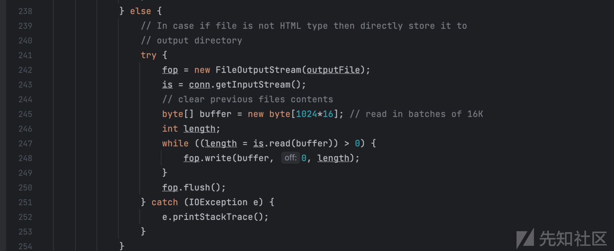

# IDocView 前台RCE漏洞分析 - 先知社区

IDocView 前台RCE漏洞分析

* * *

## 0X00 概述

IDocView是一款能够提供在线文档预览、压缩文件预览、图纸预览、图片预览、音视频播放、协作编辑、同步展示Web应用，其`html/2word`存在远程代码执行漏洞

## 0X01 验证

vps上新建`..\..\..\docview\1.jsp`文件，需要注意一下VPS仅支持linux且Linux在新建文件时需要转义`\`例如

或者利用单引号包裹创建

由于在文件开头为.默认为隐藏文件，所以我们如果要查看文件，就需要使用`ls -al`命令即可查看是否创建成功

之后在vps上新建任意html文件，引入我们创建好的jsp文件即可

之后开启web服务，在受害机上访问`/html/2word?url=html`地址即可

之后访问根目录1.jsp即可

## 0X02 分析

定位到html/2word控制器

这个方法的作用大致为

> 1.  创建urlhtml目录
> 2.  根据URL计算出一个唯一的标识作为文件名。
> 3.  之后通过isFile()判断该文件名下面index.html是否存在，注意加了！所以不存在则为真，进入GrabWebPageUtil._downloadHtml_(url, htmlDir);
> 4.  使用外部命令将index.html文件转换为Word文档
> 5.  设置响应的Content-Type为Word文档类型。
> 6.  将生成的Word文档作为响应的内容发送给客户端。

跟进`downloadHtml`方法

> 1.  69-74行判断了url和文件目录是否为空，以及url是否http开头
> 2.  76行创建`URL`对象
> 3.  77-83行判断文件目录是否存在以及文件目录是否是个文件
> 4.  84行 进入`getwebPage`方法

> 138-156行无关紧要的东西  
> 155-176行建立URL连接，并判断状态码

> 180—196行，如果跳转，建立新的连接  
> 199-106行，判断文件存在否，不存在创建、203行判断是否能写入文件

> 209-222行，判断文件后缀是否为html，htm，asp... 如果是获取URL连接的输入流给in，按行读in给strResponse，转成string给 htmlContent
> 
> 224行，这个就比较关键了，跟进`_searchForNewFilesToGrab_`

上述代码的意思呢，就是从htmlcontnet中获取link、href、src等链接，跟进其中的`_addLinkToFrontier_(urlToGrab, fromHTMLPageUrl);`_,_  
获取到的链接会添加进_filesToGrab中_

思路回到上一层，获取完的htmlContent就会被写入文件

之后我们可以看一下最底层的else语句，为最开始的if语句的分支，这里就很简单明了的写入文件，等会在提这个分支，不然理不顺

至此，整个`getWebPage`就走完了  

回到downloadHtml中的84行

后续语句就是通过遍历\_filesToGrab，\_并不断调用getWebPage来下载文件，这就是整个的执行过程，漏洞发生的原因也是在于第一次执行`getWebPage时`由于文件后缀是以html、htm、asp、aspx、php、net结尾的就会去解析其中存在的link、href、src，并保存到\_filesToGrab\_中，之后在遍历\_filesToGrab \_中的链接，并通过getWebPage下载，在回到先前的else分支，jsp后缀的类型文件正好不在IF语句所限制中，所以直接通过else语句保存在服务器中了

而filename又是从URL中最后的/开始取，并判断了是否包含/，包含则命名为default.html，而该系统又是windwos，所以就刚好可以很巧妙的构造......\\1.txt 的文件名，造成命令执行了

## 0X03 总结

才疏学浅，如有什么问题，希望各位师傅多多指正，欢迎大家一起交流，学习经验
