【IOT路由器固件解密】Ghidra逆向获取key和文件格式解析实战

- - -

# 【IOT路由器固件解密】Ghidra逆向获取key和文件格式解析实战

从网站找到固件链接下载后查看，加密固件版本的说明如下：

```plain
Note:
1. The firmware version is advanced to v1.10
2. The firmware v1.10 must be upgraded from the transitional version of firmware v1.04 (transitional version).
Problems Resolved:
1. Update wpa2 security patch
2. Upgrade dnsmasq to 2.78
Enhancements
1. Support D-Link Wi-Fi APP
(QRS mobile won’t be supported from firmware version v1.10 or later version)
2. Support image with encryption
3. Support EU VLAN @ EU country code
4. Support VLAN profile @ SG country code
```

其中第二点表示固件v1.10必须从固件v1.04的过渡版本（过渡版本）升级，未加密固件中间版本安装说明如下：

```plain
Note:
1. The firmware v1.04 is the transitional version for upgrading to v1.10 or later version.
2. Below is the procedure for firmware upgrade: 
 Connect to the router via LAN port or WIRELESS interface.
 Log in to the D-Link management page (http://192.168.0.1 or http://dlinkrouter.local./)
 Go to the firmware upgrade page, upload the firmware v1.04 and wait for the device to reboot.
 Log in to the D-Link management page again.
 Go to the firmware upgrade page and check the button of online firmware check and download the firmware 
v1.10 or later version.
 Upload the firmware v1.10 or later version.
 Wait for the device to reboot and don’t power off the router during the firmware upgrade.
 The router is fully upgraded
```

可以发现，其中，根据官方说明书得知，其中固件版本FW104B02\_Middle\_FW\_Unencrypt.bin是未加密的版本，固件FW110B02\_FW\_Encrypt.bin是加密的版本，如果设备选择继续更新，必须经过中间版本更新后才能后更新到后续版本，不能够跳跃升级。接下来，将两个版本使用binwalk固件系统解析工具执行结果，对比如下：

```plain
┌──(kali㉿kali)-[~/Desktop/22-11]
└─$ binwalk -Me FW104B02_Middle_FW_Unencrypt.bin 
Scan Time:     2023-11-22 01:16:26
Target File:   /home/kali/Desktop/22-11/FW104B02_Middle_FW_Unencrypt.bin
MD5 Checksum:  0033169720f7b89df8d1ea90fd629913
Signatures:    411
DECIMAL       HEXADECIMAL     DESCRIPTION
--------------------------------------------------------------------------------
0             0x0             uImage header, header size: 64 bytes, header CRC: 0x50982AB1, created: 2018-03-11 13:18:48, image size: 13265102 bytes, Data Address: 0x81001000, Entry Point: 0x816118E0, data CRC: 0x3A2AC829, OS: Linux, CPU: MIPS, image type: OS Kernel Image, compression type: lzma, image name: "Linux Kernel Image"
160           0xA0            LZMA compressed data, properties: 0x5D, dictionary size: 33554432 bytes, uncompressed size: 18684352 bytes
Scan Time:     2023-11-22 01:16:30
Target File:   /home/kali/Desktop/22-11/_FW104B02_Middle_FW_Unencrypt.bin-0.extracted/A0
MD5 Checksum:  6397f148a2fde088bee8fadc0dc777f8
Signatures:    411

DECIMAL       HEXADECIMAL     DESCRIPTION
--------------------------------------------------------------------------------
1864554       0x1C736A        PGP RSA encrypted session key - keyid: 80103C 458CEC RSA Encry
.
.
.
.
42820832      0x28D64E0       ASCII cpio archive (SVR4 with no CRC), file name: "lib/librcm.so", file name length: "0x0000000E", file size: "0x00046D60"
43111100      0x291D2BC       ASCII cpio archive (SVR4 with no CRC), file name: "lib/libpcre-0.9.28.so", file name length: "0x00000016", file size: "0x0002B80C"
43289420      0x2948B4C       ASCII cpio archive (SVR4 with no CRC), file name: "TRAILER!!!", file name length: "0x0000000B", file size: "0x00000000"           
┌──(kali㉿kali)-[~/Desktop/22-11]
└─$
```

使用命令：binwalk -Me FW110B02\_FW\_Encrypt.bin，执行结果发现无法解析固件的文件系统，可以发现，文件系统已经被加密，无法正常解析。

> 对于不知道是否加密的也可以通过binwalk -E 固件文件.bin 的命令查看，如果熵值接近于1，且几乎无变化，那么很可能是将文件字符加密混淆产生的结果，还包含另一种可能是经过了文件压缩，使得产生的熵值图象与加密熵值图象接近，此时无法识别是否加密固件，那么此时可以通过binwalk -Me 固件文件.bin的命令强制解析固件，此时如果可以正常解析出，那么就是压缩，否则即为加密。

```plain
┌──(kali㉿kali)-[~/Desktop/22-11]
└─$ binwalk -Me FW110B02_FW_Encrypt.bin                                              
Scan Time:     2023-11-22 01:22:00
Target File:   /home/kali/Desktop/22-11/FW110B02_FW_Encrypt.bin
MD5 Checksum:  b4518c966ea67d61d666b95b5e740129
Signatures:    411
DECIMAL       HEXADECIMAL     DESCRIPTION
--------------------------------------------------------------------------------
1391843       0x153CE3        QNX4 Boot Block                    
┌──(kali㉿kali)-[~/Desktop/22-11]
└─$
```

打开Unix文件系统目录，如下：

[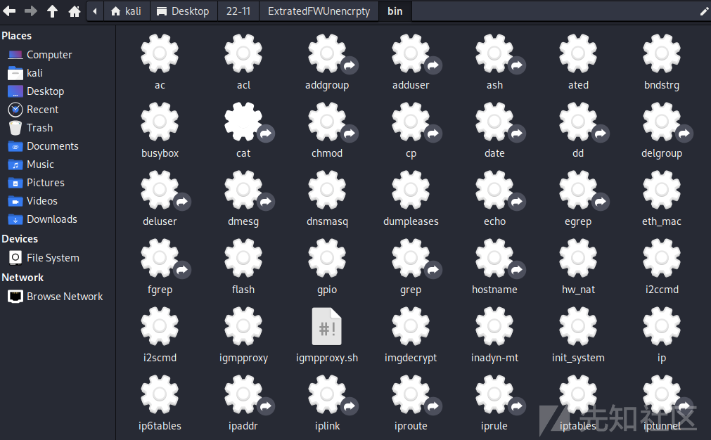](https://xzfile.aliyuncs.com/media/upload/picture/20231123202927-f16d2e0c-89fb-1.png)

[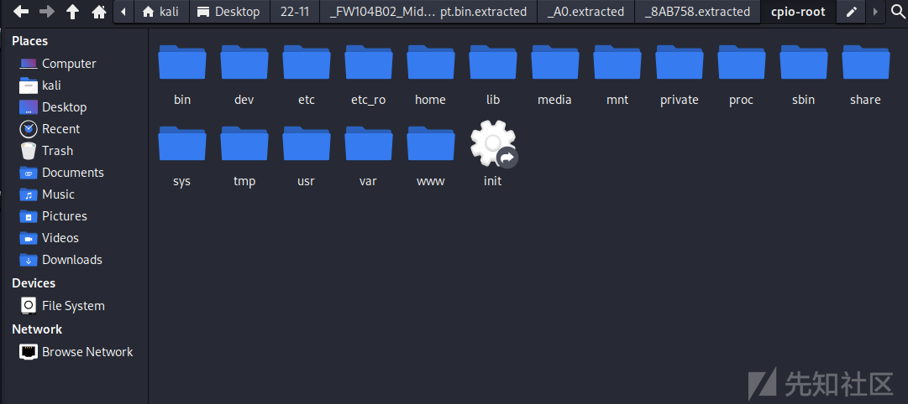](https://xzfile.aliyuncs.com/media/upload/picture/20231123202905-e45884aa-89fb-1.png)

通过使用find命令，在当前文件夹下面寻找有关加密解密的文件，发现了一个目录下存在公钥文件./etc\_ro/public.pem ，文件内容和结果如下：

```plain
┌──(kali㉿kali)-[~/Desktop/22-11/ExtratedFWUnencrpty]
└─$ find ./ -name *pem
./etc_ro/public.pem       
┌──(kali㉿kali)-[~/Desktop/22-11/ExtratedFWUnencrpty]
└─$ cat ./etc_ro/public.pem
-----BEGIN RSA PUBLIC KEY-----
MIICCgKCAgEApZLuH2XFDWuazEMpx4v6QY0ePRJm344JgkLKfeofovxvbjfX6RHU
7yUz6b2wJnW4lomEzjrJEQFnPGNFV/oWO/NaTb3k0rPUewDzlzy/pn7ZMehqnMK1
tHVnyQ6RZ+9qkdYEu08f79UgZcGQzSy2TLNMquAB9ffGbTHAjRfoK7cDjQX+RKWh
OOs5tbnzhR0B4Jdd6UL9Sqoq5UisTdlnFhy67RdsItz3OOrHIiDYmfkEOqAZySKZ
MhY7h7kkC8t1IzZOncBx3LYU4PMo9ulycAx7xDUric8xswnKoYAJbbKtp9xnGKRJ
HPuZOZyXFdWNlTVhzG3sGdDzcpHxrFOJZ5RK/n19DArbq6w9MEInTmU3bcwDYFvX
JCQ5Al05lgqP8vk7U4xx3AcwZUQHNVzduBuibB26jhpPXSk1Cl6NpFdXlKvcynfV
H8XaCHy8LXhZBMiuR62Ft6YkcIpBdsQ2uBGL5GOmVFA/cOEtPZjWxzN/miXaZ7In
iRhXEHFus6zYIPOTa9DNyAA87UCqxkem7Xgu59fgq49YwGPk+Q7HJXKgts9QTn9y
26OtlUAq1i23EJK6GJvTmszslXbAWEi5Mlb/o7QdpEQt/gyz9udnVmfXOy4UmNXN
ZxuVyXNomTBFRObZ5Zmn6n+xat5eBDpvct+OO1IUMC154div9i2szF0CAwEAAQ==
-----END RSA PUBLIC KEY-----         
┌──(kali㉿kali)-[~/Desktop/22-11/ExtratedFWUnencrpty]
└─$
```

再次通过使用find命令，在当前文件夹下面寻找有关加密解密的文件，没有找到有关encrypt的文件，但发现了./bin/目录下存在一个imgdecrpyt文件，根据文件名猜测可能是用于解密有关的文件。

```plain
┌──(kali㉿kali)-[~/Desktop/22-11/ExtratedFWUnencrpty]
└─$ find ./ -name *encrypt          
┌──(kali㉿kali)-[~/Desktop/22-11/ExtratedFWUnencrpty]
└─$ find ./ -name *decrypt
./bin/imgdecrypt         
┌──(kali㉿kali)-[~/Desktop/22-11/ExtratedFWUnencrpty]
└─$
```

[](https://xzfile.aliyuncs.com/media/upload/picture/20231123202927-f16d2e0c-89fb-1.png)

将这个文件使用十进制编辑器打开查看，文件开头为7F 45 4C 46，说明是ELF文件格式。

> ELF文件简述：
> 
> 前4个字节是ELF的Magic Number，固定为`7f 45 4c 46`。  
> 第5个字节指明ELF文件是32位还是64位的。  
> 第6个字节指明了数据的编码方式。  
> 第7个字节指明了ELF header的版本号，目前值都是1。  
> 第8-16个字节，都填充为0。

[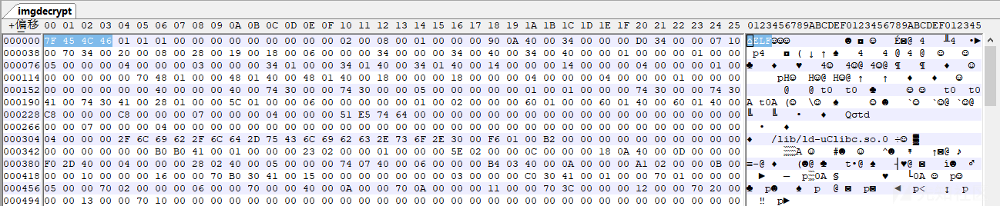](https://xzfile.aliyuncs.com/media/upload/picture/20231123202943-faec88ec-89fb-1.png)

下面将这个文件使用Ghidra打开，逆向查看是否包含加密或解密逻辑。

发现使用Ghidra很够很好的将加密逻辑函数和解密逻辑函数反编译了出来，发现了解密函数decrypt\_firmar和加密函数encrypt\_firmare，同时在解密函数中发现了local\_20 = "/etc\_ro/public.pem"，这个函数和文件正是要解密的关键。

[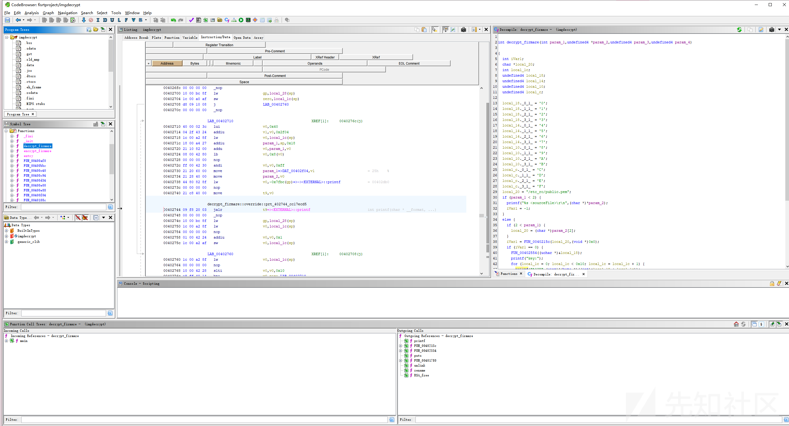](https://xzfile.aliyuncs.com/media/upload/picture/20231123202958-0411ac68-89fc-1.png)

解密函数如下：

```plain
int decrypt_firmare(int param_1,undefined4 *param_2,undefined4 param_3,undefined4 param_4)

{
  int iVar1;
  char *local_20;
  int local_1c;
  undefined4 local_18;
  undefined4 local_14;
  undefined4 local_10;
  undefined4 local_c;

  local_18._0_1_ = '0';
  local_18._1_1_ = '1';
  local_18._2_1_ = '2';
  local_18._3_1_ = '3';
  local_14._0_1_ = '4';
  local_14._1_1_ = '5';
  local_14._2_1_ = '6';
  local_14._3_1_ = '7';
  local_10._0_1_ = '8';
  local_10._1_1_ = '9';
  local_10._2_1_ = 'A';
  local_10._3_1_ = 'B';
  local_c._0_1_ = 'C';
  local_c._1_1_ = 'D';
  local_c._2_1_ = 'E';
  local_c._3_1_ = 'F';
  local_20 = "/etc_ro/public.pem";
  if (param_1 < 2) {
    printf("%s <sourceFile>\r\n",(char *)*param_2);
    iVar1 = -1;
  }
  else {
    if (2 < param_1) {
      local_20 = (char *)param_2[2];
    }
    iVar1 = FUN_0040215c(local_20,(void *)0x0);
    if (iVar1 == 0) {
      FUN_00402554((uchar *)&local_18);
      printf("key:");
      for (local_1c = 0; local_1c < 0x10; local_1c = local_1c + 1) {
        printf("%02X",(uint)*(byte *)((int)&local_18 + local_1c));
      }
      puts("\r");
      iVar1 = FUN_00401780((char *)param_2[1],"/tmp/.firmware.orig",(uchar *)&local_18);
      if (iVar1 == 0) {
        unlink((char *)param_2[1]);
        rename("/tmp/.firmware.orig",(char *)param_2[1]);
      }
      RSA_free(DAT_004131c0);
    }
    else {
      iVar1 = -1;
    }
  }
  return iVar1;
}
```

从上面的printf("key:")到puts("\\r")，首先输出字符key：，然后在for循环中使用了pringf函数，，可以发现中间的for循环就是输出的key的结果，这个key后面用来解密固件，然后put函数输出字符表示截断，类似输出key的结果样式如下：

```plain
key：xxxxx
```

可以发现local\_1c就是循环的变量，所以不影响上下文的情况下，选中变量，然后按住L快捷键，输入num，修改为num变量，更加的解释代码。

该段代码的作用是打印出 "key:" 后面跟着 `local_18` 数组中每个字节的十六进制形式。因此`local_18` 是一个存储密钥的数组。

这段代码的逻辑如下：

1.  `printf("key:");` - 打印字符串 `"key:"`。
2.  `for (num = 0; num < 0x10; num = num + 1)` - 循环从 0 到 15 的数字，每次迭代增加 1，使用 `num` 作为循环变量。
3.  `printf("%02X",(uint)*(byte *)((int)&local_18 + num));` - 在循环中，以十六进制的形式打印 `local_18` 变量中存储的值。在这里，将 `local_18` 中第 `num` 个字节的内存地址强制转换为 `byte` 类型指针，并在取得该地址对应的值后，以 `%02X` 的格式进行打印。这样可以以两个十六进制数字的形式打印每个字节的值。
4.  `puts("\r");` - 打印一个回车符，换行一行。

[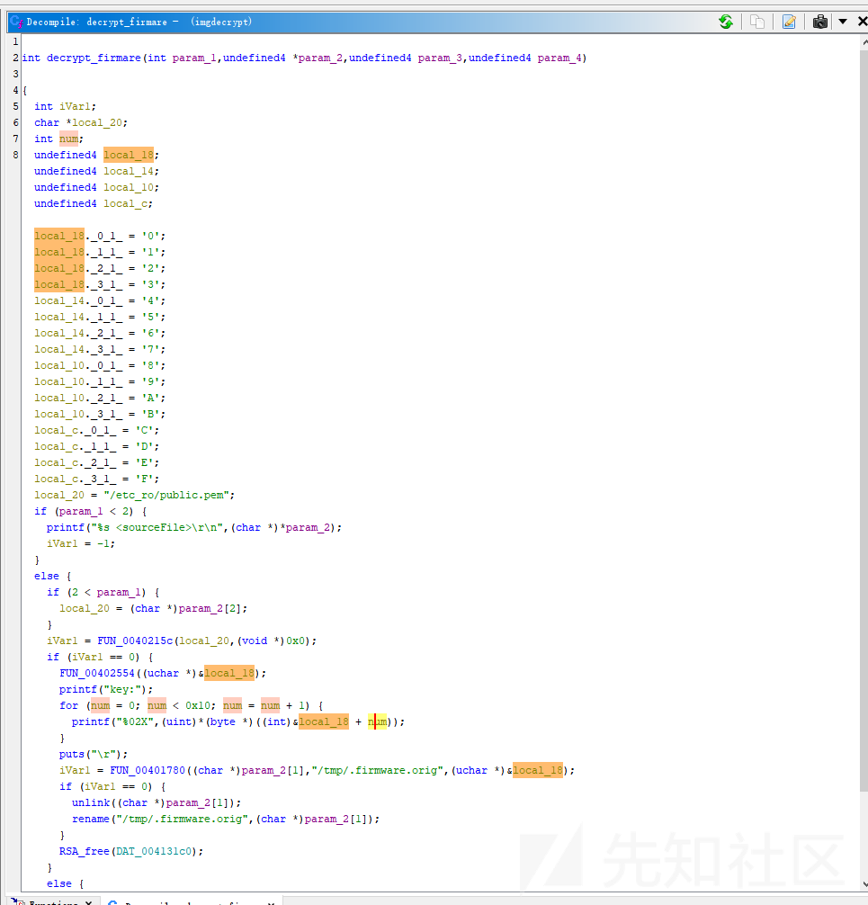](https://xzfile.aliyuncs.com/media/upload/picture/20231123203015-0e363f42-89fc-1.png)

下面解释函数FUN\_00402554((uchar *)&local\_18)，因为这是唯一一个涉及变量的函数，双击进入函数查看，此函数的功能是增加了一个uchar* param\_1参数，函数体内容是调用了函数FUN\_0040108c。

[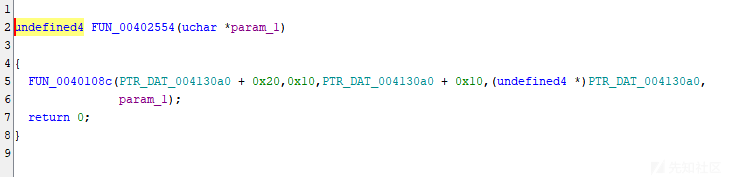](https://xzfile.aliyuncs.com/media/upload/picture/20231123203031-17d8aae4-89fc-1.png)

到这里就可以了，查看函数FUN\_0040108c，可以发现了存在AES解密逻辑和AES加密逻辑，至此分析函数FUN\_00402554的参数和调用逻辑即可分析出密钥key。

[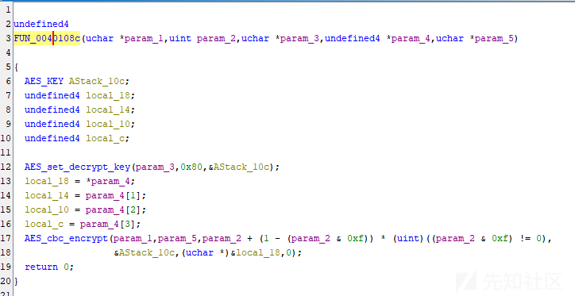](https://xzfile.aliyuncs.com/media/upload/picture/20231123203050-22f815cc-89fc-1.png)

总共有5个参数，第一个参数的获取方法，选中函数第一个参数，双击进入：

```plain
0040256c 20 00 44 24   addiu                  param_1=>DAT_00402e78,v0,0x20                    = C8h
```

[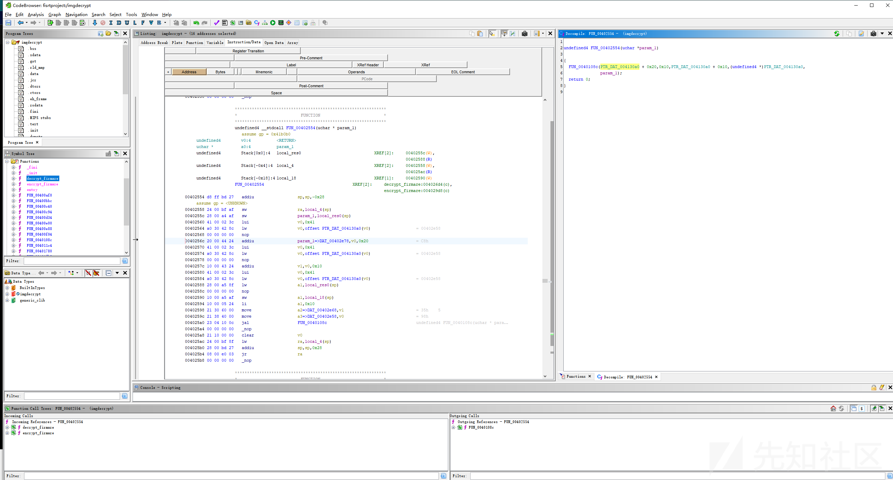](https://xzfile.aliyuncs.com/media/upload/picture/20231123203106-2c67e2d6-89fc-1.png)

选中文字，然后右键，点击Copy Special，复制格式为Python Byte String。

[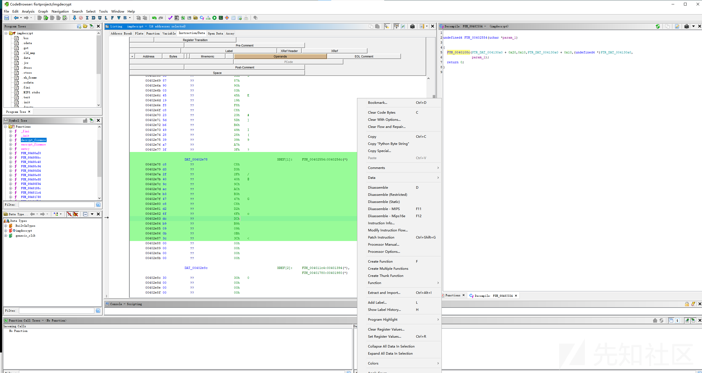](https://xzfile.aliyuncs.com/media/upload/picture/20231123203114-315f45cc-89fc-1.png)

[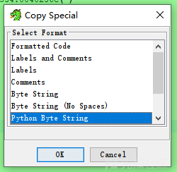](https://xzfile.aliyuncs.com/media/upload/picture/20231123203121-359792c0-89fc-1.png)

结果为：b'\\xc8\\xd3\\x2f\\x40\\x9c\\xac\\xb3\\x47\\xc8\\xd2\\x6f\\xdc\\xb9\\x09\\x0b\\x3c'

第二个参数为0x10，即十进制数16，在这个函数中代表长度为16。

[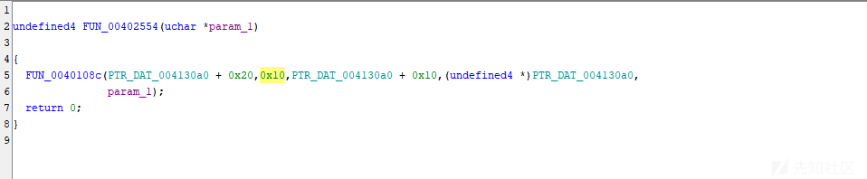](https://xzfile.aliyuncs.com/media/upload/picture/20231123203134-3cfac01e-89fc-1.png)

第三个参数为AES加解密的key，选中，双击进入。

```plain
00402598 21 30 60 00   move                    a2=>DAT_00402e68,v1    = 35h    5
```

这条指令是 `move` 指令，用于将一个寄存器的值复制到另一个寄存器。根据指令的格式和给出的参数，可以解析该指令的含义如下：将存储在寄存器 `a2` 中的值复制到寄存器 `v1` 中。同时，该指令的注释中提到，这个操作将值 `35h` (53) 复制到了位置为 `DAT_00402e68` 的内存数据中。

[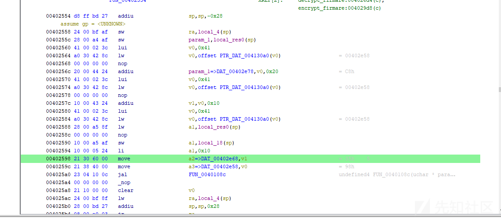](https://xzfile.aliyuncs.com/media/upload/picture/20231123203739-166da4a6-89fd-1.png)

然后同样的选中，右键选择Copy Special选项，然后选择Byte String（No Spaces），取出去除空格之后的字符串。

[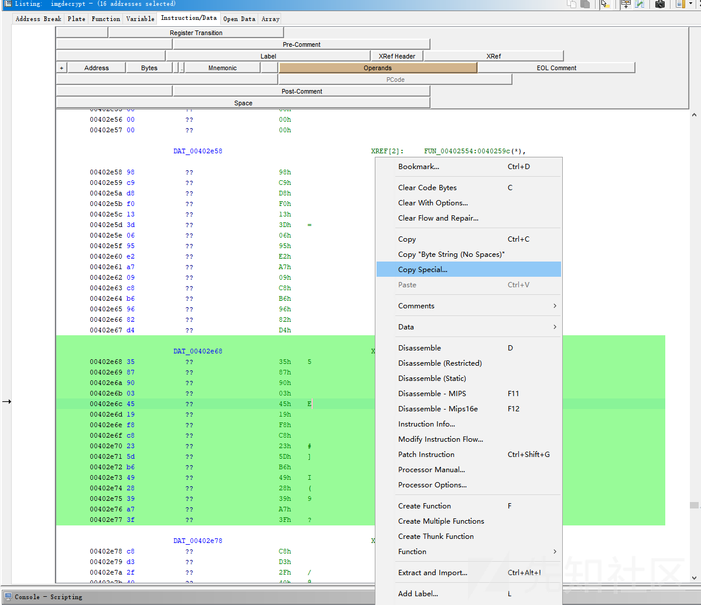](https://xzfile.aliyuncs.com/media/upload/picture/20231123203212-53d5926e-89fc-1.png)

[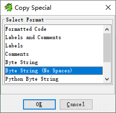](https://xzfile.aliyuncs.com/media/upload/picture/20231123203220-5847e1d0-89fc-1.png)

得到第三个参数结果为：358790034519f8c8235db6492839a73f。

第三个参数为AES加解密的向量IV值，选中，双击进入。

```plain
0040259c 21 38 40 00   move    a3=>DAT_00402e58,v0     = 98h
```

`move` 指令是 MIPS 汇编中用于将一个寄存器的值复制到另一个寄存器的操作。根据指令的格式和给出的参数，该指令执行了以下操作：

将存储在寄存器 `a3` 中的值复制到寄存器 `v0` 中。

[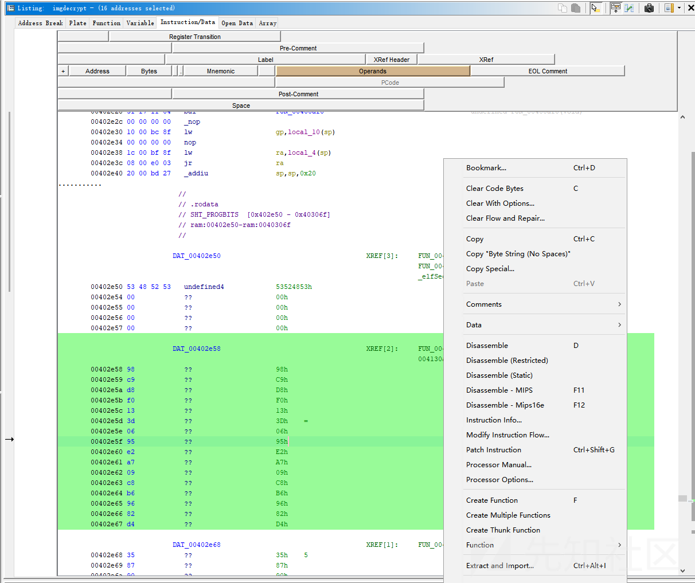](https://xzfile.aliyuncs.com/media/upload/picture/20231123203230-5e3d54f8-89fc-1.png)

[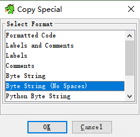](https://xzfile.aliyuncs.com/media/upload/picture/20231123203235-61bde8d6-89fc-1.png)

第四个参数结果为IV值：98c9d8f0133d0695e2a709c8b69682d4

> OpenSSL是一个开源的加密工具包，支持多种加密算法和协议。使用OpenSSL进行加密和解密的过程如下：
> 
> 加密过程：
> 
> 1.  选择适当的加密算法和模式，如AES（Advanced Encryption Standard）。
> 2.  生成加密使用的密钥。
> 3.  选择适当的初始化向量（IV）。
> 4.  使用选择的加密算法、密钥和IV对明文数据进行加密。
> 5.  可选：对密文进行填充以满足加密算法的要求。
> 6.  输出密文数据。
>     
>     解密过程：
>     
> 7.  使用与加密过程相同的加密算法、密钥和IV。
>     
> 8.  使用相同的填充方式解除填充（如果有的话）。
> 9.  对密文数据进行解密。
> 10.  输出解密后的明文数据。

根据解密过程和上面得到的参数，将16进制的字符串密文数据，使用指定的密钥和初始化向量进行AES-128解密（CBC模式），然后将解密后的结果以16进制表示进行输出，输入如下面命令可以获得解密的密钥的十六进制格式，

```plain
printf "\xc8\xd3\x2f\x40\x9c\xac\xb3\x47\xc8\xd2\x6f\xdc\xb9\x09\x0b\x3c" | openssl aes-128-cbc -d -nopad -K "358790034519f8c8235db6492839a73f" -iv "98c9d8f0133d0695e2a709c8b69682d4" -in - | hd
```

[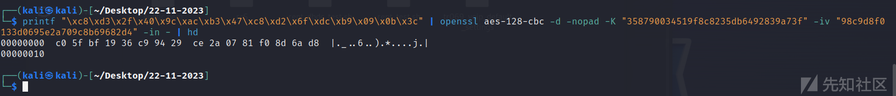](https://xzfile.aliyuncs.com/media/upload/picture/20231123203247-685383f4-89fc-1.png)

输出密钥为：c0 5f bf 19 36 c9 94 29 ce 2a 07 81 f0 8d 6a d8

> 1.  `openssl aes-128-cbc -d -nopad -K "358790034519f8c8235db6492839a73f" -iv "98c9d8f0133d0695e2a709c8b69682d4" -in -`：这是使用OpenSSL进行解密的命令。
>     -   `openssl aes-128-cbc`：选择使用AES-128和CBC模式进行解密。
>     -   `-d`：表示进行解密操作。
>     -   `-nopad`：表示没有填充，即明文长度必须是块大小的倍数。
>     -   `-K "358790034519f8c8235db6492839a73f"`：指定密钥，使用16进制字符串表示。
>     -   `-iv "98c9d8f0133d0695e2a709c8b69682d4"`：指定初始化向量（IV），同样使用16进制字符串表示。
>     -   `-in -`：指定输入数据为先前的管道输出。`-`表示从标准输入读取，注意不能缺少最后的横杠，否则表示不正确输入。
> 2.  `| hd`：将解密后的二进制数据通过管道传输符号转换为16进制表示并进行输出。`hd`是一个十六进制转储命令。

另一种则是使用强大的加解密网址,注意选择十六进制输入格式，与输出格式。

```plain
https://gchq.github.io/CyberChef/#recipe=AES_Decrypt(%7B'option':'Hex','string':'358790034519f8c8235db6492839a73f'%7D,%7B'option':'Hex','string':'98c9d8f0133d0695e2a709c8b69682d4'%7D,'CBC/NoPadding','Hex','Hex',%7B'option':'Hex','string':''%7D,%7B'option':'Hex','string':''%7D)&input=YzhkMzJmNDA5Y2FjYjM0N2M4ZDI2ZmRjYjkwOTBiM2M
```

执行结果如下：

[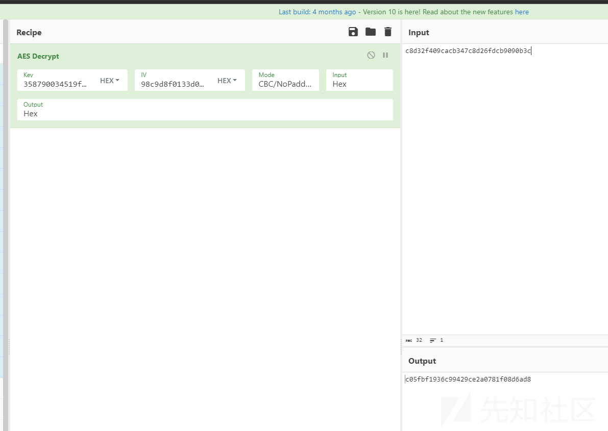](https://xzfile.aliyuncs.com/media/upload/picture/20231123203256-6df06872-89fc-1.png)  
获取该密钥之后，就能解密无法使用binwalk解析的固件系统了，不过除了逆向，又学习了另一种使用真实环境模拟的方法，来解密获取密钥key。

使用命令sudo apt install qemu-user-static下载安装qemu静态文件。

[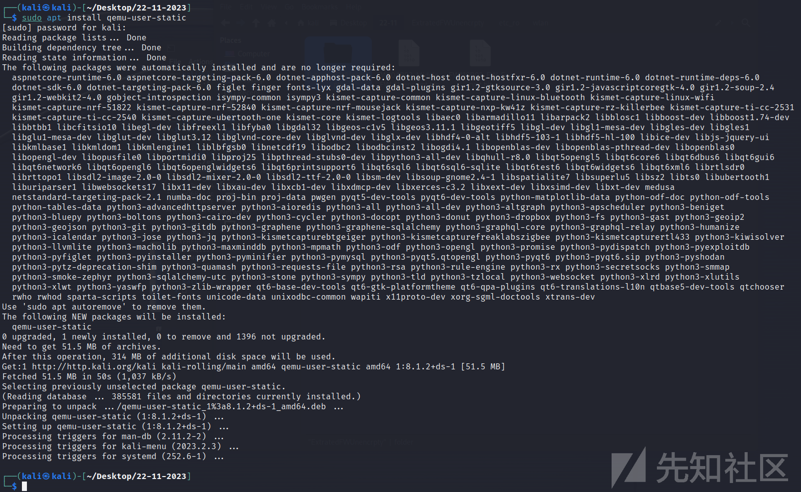](https://xzfile.aliyuncs.com/media/upload/picture/20231123203304-72e6e9be-89fc-1.png)

然后使用命令readelf -h ./bin/imgdecrypt 查看imgdecrypt文件的格式，得到结果为MIPS架构，32位，小端序。

[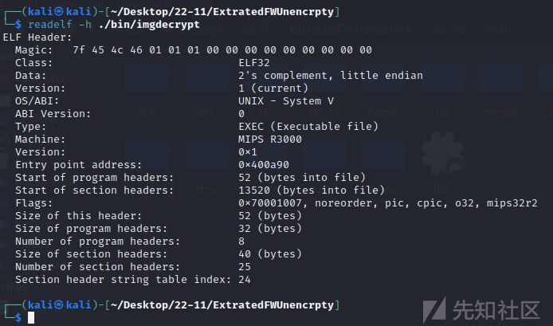](https://xzfile.aliyuncs.com/media/upload/picture/20231123203313-77e13154-89fc-1.png)

识别为MIPS架构小端序后，即可选择对应的qemu模拟环境文件，使用命令cp /usr/bin/qemu-mipsel-static .复制到当前类Unix目录下执行如下。

[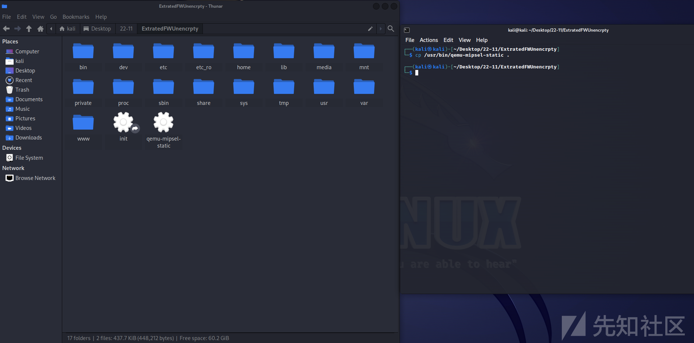](https://xzfile.aliyuncs.com/media/upload/picture/20231123203321-7d2a45a6-89fc-1.png)

然后使用命令sudo chroot . ./qemu-mipsel-static ./bin/imgdecrypt针对特定的文件，模拟执行环境，执行结果如下：

[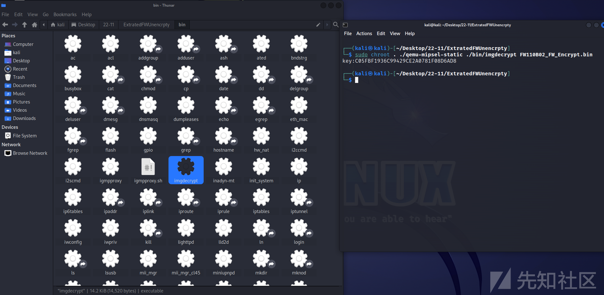](https://xzfile.aliyuncs.com/media/upload/picture/20231123203329-816cb180-89fc-1.png)

可以得到我们的密钥结为：key:C05FBF1936C99429CE2A0781F08D6AD8，也就是我们把需要解密的固件放在后面就可以执行处密钥的结果。这种方法显然更加快捷，不过逆向方法也更加通用。

```plain
┌──(kali㉿kali)-[~/Desktop/22-11/ExtratedFWUnencrpty]
└─$ sudo chroot . ./qemu-mipsel-static ./bin/imgdecrypt FW110B02_FW_Encrypt.bin 
key:C05FBF1936C99429CE2A0781F08D6AD8
```

下面开始分析加密固件FW110B02\_FW\_Encrypt.bin的文件系统和解密固件过程。使用十六进制编辑器查看，固件加密格式分为以下几个部分：

[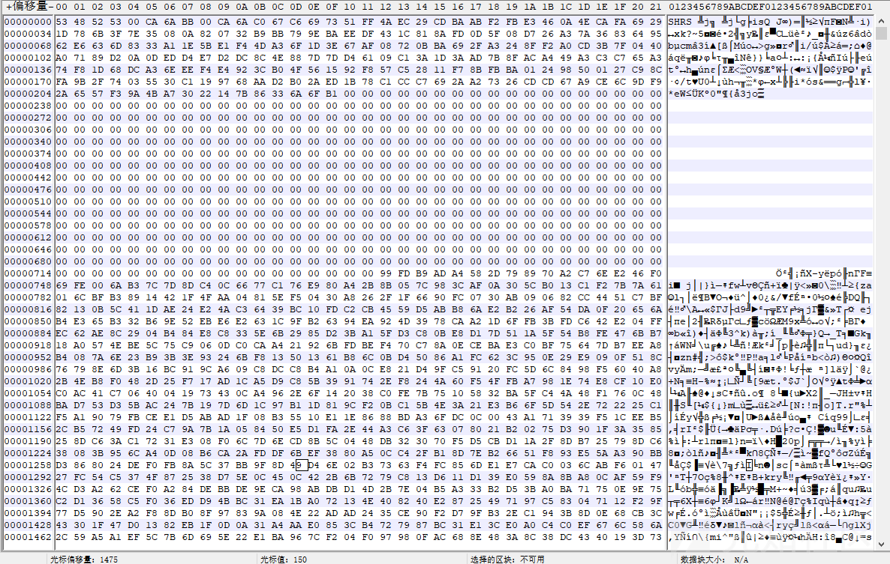](https://xzfile.aliyuncs.com/media/upload/picture/20231123203338-873faa4a-89fc-1.png)

1.固件的特征码为53 48 52 53 00

2.解密区域大小为00 9D 2B 00

3.加密块大小为：

下面开始使用dd命令来提取出加密区域

```plain
┌──(kali㉿kali)-[~/Desktop/22-11]
└─$ dd iflag=skip_bytes,count_bytes if=/home/kali/Desktop/22-11/FW110B02_FW_Encrypt.bin of=/home/kali/Desktop/22-11/Bin_Encrpted.bin skip=1756 count=13265600         
25909+1 records in
25909+1 records out
13265600 bytes (13 MB, 13 MiB) copied, 0.179841 s, 73.8 MB/s
```

然后使用sha512sum命令计算分离出来的bin文件的sha512值为：2811f78bfbba012498500127c98cfa9b2f74035530c1199768aad2b02aed1b78c1ccc7692aa27326cdcd67a9ce6c9df92a6557f39a4ba73022147b86336a6fb1，与文件结构中的结果一致，分离验证正确。

```plain
┌──(kali㉿kali)-[~/Desktop/22-11]
└─$ sha512sum Bin_Encrpted.bin     
2811f78bfbba012498500127c98cfa9b2f74035530c1199768aad2b02aed1b78c1ccc7692aa27326cdcd67a9ce6c9df92a6557f39a4ba73022147b86336a6fb1  Bin_Encrpted.bin
```

[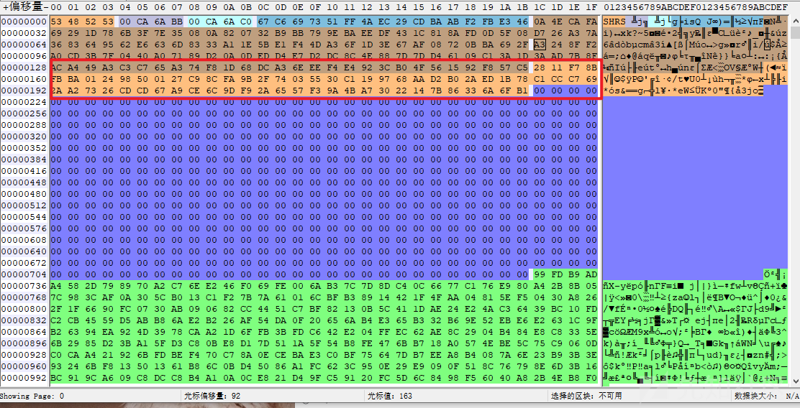](https://xzfile.aliyuncs.com/media/upload/picture/20231123203348-8cd3b2a8-89fc-1.png)

使用OpenSSL工具对文件 "Bin\_Encrpted.bin" 进行 AES-128-CBC 解密的操作：

使用命令：openssl aes-128-cbc -d -p -nopad -nosalt -K C05FBF1936C99429CE2A0781F08D6AD8 -iv 67C6697351FF4AEC29CDBAABF2FBE346 --nosalt -in Bin\_Encrpted.bin -out Bin\_Decrpted.bin

-   `-d`：表示进行解密操作。
-   `-p`：表示打印出解密结果之前的信息，包括解密算法、密钥和初始化向量等。
-   `-nopad`：表示不进行填充操作。这意味着，被解密的文件必须是加密时使用了填充的。
-   `-nosalt`：表示在解密过程中不使用盐值。
-   `-K C05FBF1936C99429CE2A0781F08D6AD8`：指定解密所需的密钥。密钥是以十六进制格式给出的。
-   `-iv 67C6697351FF4AEC29CDBAABF2FBE346`：指定解密所需的初始化向量。初始化向量同样也是以十六进制格式给出的。
-   `-in Bin_Encrpted.bin`：指定待解密的文件名为 "Bin\_Encrpted.bin"。
-   `-out Bin_Decrpted.bin`：指定解密后的文件名为 "Bin\_Decrpted.bin"。

[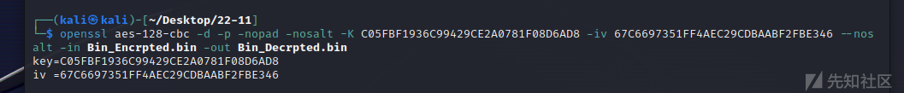](https://xzfile.aliyuncs.com/media/upload/picture/20231123203357-92562576-89fc-1.png)

注意此处使用的key=27CFF066D55FBF75A37CC766D338AAD8，  
iv=67C6697351FF4AEC29CDBAABF2FBE346需要与结果中对应。比如如果使用小写的-k参数，那么得到的结果为如下，无法正确提取固件，key和iv执行过程和结果必须为一样的，否则无法完成后面的SHA512校验，下图为错例：

[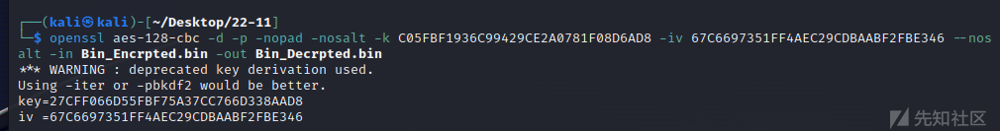](https://xzfile.aliyuncs.com/media/upload/picture/20231123203402-9573a058-89fc-1.png)

然后下一步获取文件：Bin\_Firmware.bin。

使用命令echo $((0x00CA6ABB))得到十进制的获取文件总字节数。

然后使用dd命令：dd iflag=skip\_bytes,count\_bytes if=Bin\_Decrpted.bin of=Bin\_Firmware.bin count=13265595得到文件Bin\_Firmware.bin。

[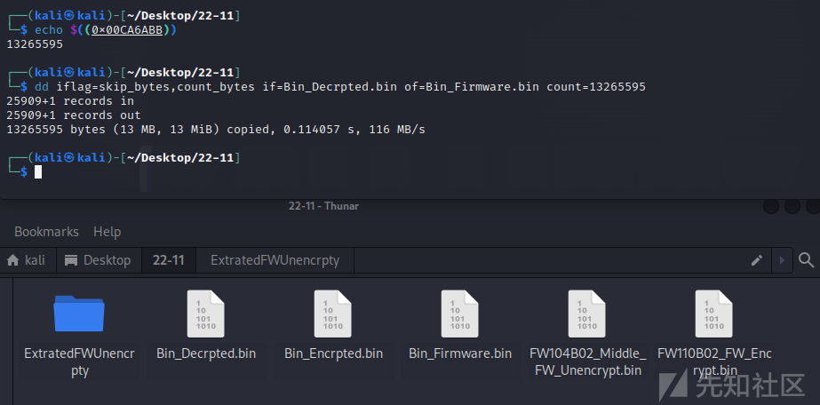](https://xzfile.aliyuncs.com/media/upload/picture/20231123203412-9b08ec30-89fc-1.png)

接下来使用sha512sum命令验证提取的固件是否正确，与原始的文件中得校验数字对比一致，表示成功。

[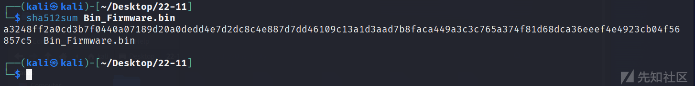](https://xzfile.aliyuncs.com/media/upload/picture/20231123203420-9fe1a5da-89fc-1.png)

[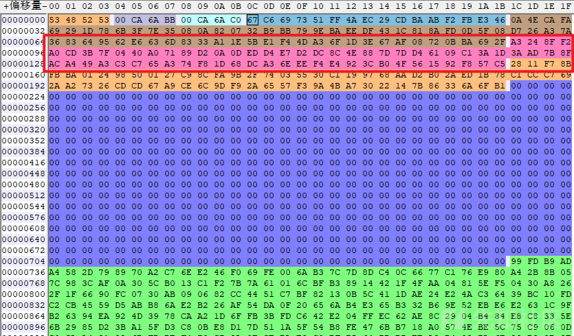](https://xzfile.aliyuncs.com/media/upload/picture/20231123203427-a45396fa-89fc-1.png)

下一步需要通过执行该命令，会将十六进制字符串所表示的数据进行解析，并将解析后的二进制数据追加写入 "Unencrypted\_Firmware".bin。

"C05FBF1936C99429CE2A0781F08D6AD8" 的字节表示转换为二进制数据，并将结果追加到名为 "Unencrypted\_Firmware.bin" 的文件中。

-   `perl -e`：表示执行Perl脚本
-   `'print pack "H*", "C05FBF1936C99429CE2A0781F08D6AD8"'`是 Perl代码，此处使用`print pack`函数将十六进制字符串转换为二进制数据。
    -   `pack` 函数用于将给定格式的数据打包为二进制字符串。
    -   `"H*"` 是 `pack` 函数的格式字符串，指示以十六进制字符串的形式输入数据。
    -   `"C05FBF1936C99429CE2A0781F08D6AD8"` 是输入的十六进制字符串数据。

此时，再是用十六进制编辑器，查看右侧ASCII字符能够识别到正确的Linux系统，故成功解密。

[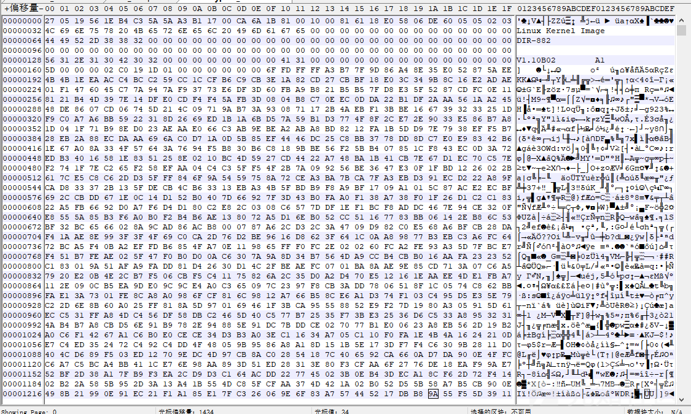](https://xzfile.aliyuncs.com/media/upload/picture/20231123203435-a914567a-89fc-1.png)

至于为什么最后追加这段key作为二进制数据，相当于在重新打包的时候必须有正确的签名，否则会导致解密失败，是比较关键一步。

[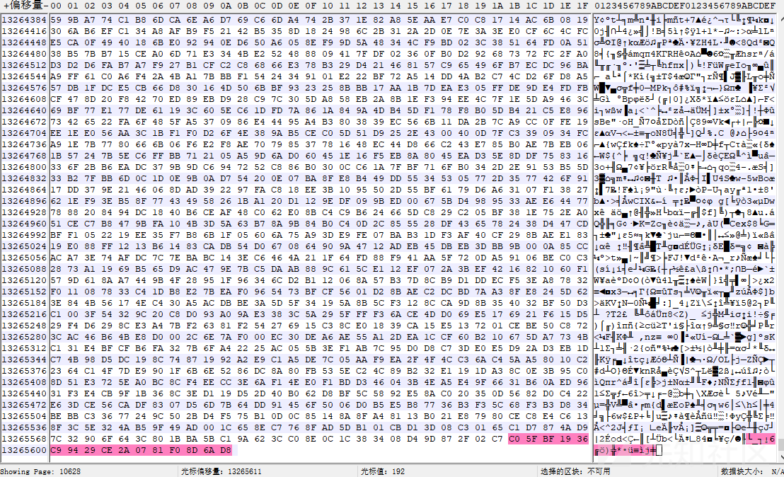](https://xzfile.aliyuncs.com/media/upload/picture/20231123203444-ae5b2dc0-89fc-1.png)

下面将解密的固件重命名为Unencrypted\_Firmware.bin，并且和原始加密的中值进行验证对比，发现结果一致，表示验证正确。

值为：0a4ecafa69291d786b3f7e35080a820732b9bb799ebaeedf431c818afd0d5f08d726a37a3683649562e6636d8333a11e5be1f44da36f1d3e67af08720bba692f

[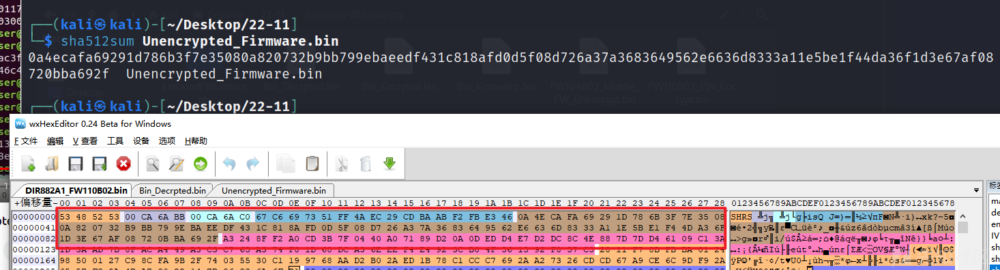](https://xzfile.aliyuncs.com/media/upload/picture/20231123203453-b3e33332-89fc-1.png)

接下来使用binwalk解析出linux文件系统，执行成功，结果如下：

[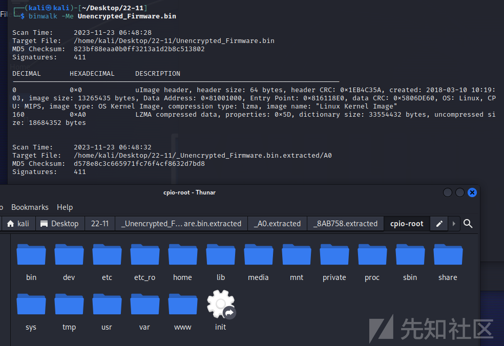](https://xzfile.aliyuncs.com/media/upload/picture/20231123203500-b7e5ba54-89fc-1.png)

将如下加密固件，解密固件以及解析的文件系统打包为附件，提供参考。

[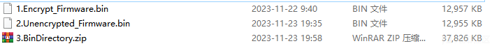](https://xzfile.aliyuncs.com/media/upload/picture/20231123203507-bc55ba12-89fc-1.png)

前面使用的加密固件二进制格式分析如下：

首先是魔数字节，然后依次是固件解密区域大小，加密区域大小，IV值，解密固件区域和key的SHA512值，单独的解密固件区域SHA512值，加密区域的SHA512值，未使用区域，解密区域使用的算法，加密区域使用的算法，加密区域开始到加密区域结束，以及最后的填充区域。

魔数字节为：53485253

固件解密区域大小值为：00CA6ABB

加密区域大小值为：00CA6AC0

IV值为：67C6697351FF4AEC29CDBAABF2FBE346

解密固件区域和key的SHA512值长度为64字节，值为：

0A 4E CA FA 69 29 1D 78 6B 3F 7E 35 08 0A 82 07 32 B9 BB 79 9E BA EE DF 43 1C 81 8A FD 0D 5F 08 D7 26 A3 7A 36 83 64 95 62 E6 63 6D 83 33 A1 1E 5B E1 F4 4D A3 6F 1D 3E 67 AF 08 72 0B BA 69 2F

单独的解密固件区域SHA512值长度为64字节，值为：

A3 24 8F F2 A0 CD 3B 7F 04 40 A0 71 89 D2 0A 0D ED D4 E7 D2 DC 8C 4E 88 7D 7D D4 61 09 C1 3A 1D 3A AD 7B 8F AC A4 49 A3 C3 C7 65 A3 74 F8 1D 68 DC A3 6E EE F4 E4 92 3C B0 4F 56 15 92 F8 57 C5

加密区域的SHA512值长度为64字节，值为：

28 11 F7 8B FB BA 01 24 98 50 01 27 C9 8C FA 9B 2F 74 03 55 30 C1 19 97 68 AA D2 B0 2A ED 1B 78 C1 CC C7 69 2A A2 73 26 CD CD 67 A9 CE 6C 9D F9 2A 65 57 F3 9A 4B A7 30 22 14 7B 86 33 6A 6F B1

未使用区域值为：

00 00 00 00 00 00 00 00 00 00 00 00 00 00 00 00 00 00 00 00 00 00 00 00 00 00 00 00 00 00 00 00 00 00 00 00 00 00 00 00 00 00 00 00 00 00 00 00 00 00 00 00 00 00 00 00 00 00 00 00 00 00 00 00 00 00 00 00 00 00 00 00 00 00 00 00 00 00 00 00 00....

解密区域使用的算法有512字节，值为：

```plain
99 FD B9 AD A4 58 2D 79 89 70 A2 C7 6E E2 46 F0 69 FE 00 6A B3 7C 7D 8D C4 0C 66 77 C1 76 E9 80 A4 2B 8B 05 7C 98 3C AF 0A 30 5C B0 13 C1 F2 7B 7A 61 01 6C BF B3 89 14 42 1F 4F AA 04 81 5E F5 04 30 A8 26 2F 1F 66 90 FC 07 30 AB 09 06 82 CC 44 51 C7 BF 82 13 0B 5C 41 1D AE 24 E2 4A C3 64 39 BC 10 FD C2 CB 45 59 D5 AB B8 6A E2 B2 26 AF 54 DA 0F 20 65 6A B4 E3 65 B3 32 B6 9E 52 EB E6 E2 63 1C 9F B2 63 94 EA 92 4D 39 78 CA A2 1D 6F FB 3B FD C6 42 E2 04 FF EC 62 AE 8C 29 04 B4 84 E8 C8 33 5E 6B 29 85 D2 3B A1 5F D3 C8 0B E8 D1 7D 51 1A 5F 54 B8 FE 47 6B B7 18 A0 57 4E BE 5C 75 C9 06 0D C0 CA A4 21 92 6B FD BE F4 70 C7 8A 0E CE BA E3 C0 BF 75 64 7D B7 EE A8 B4 08 7A 6E 23 B9 3B 3E 93 24 6B F8 13 50 13 61 B8 6C 0B D4 50 86 A1 FC 62 3C 95 0E 29 E9 09 0F 51 8C 76 79 8E 6D 3B 16 BC 91 9C A6 09 C8 DC C8 B4 A1 0A 0C E8 21 D4 9F C5 91 20 FC 5D 6C 84 98 F5 60 40 A8 2B 4E B8 F0 48 2D 25 F7 17 AD 1C A5 D9 C8 5B 39 91 74 2E F8 24 4A 60 F5 4F FB A7 98 1E 74 E8 CF 10 E0 C0 AC 41 C7 06 40 04 19 73 43 0C A4 96 2E 6F 14 20 38 C0 FE 7B 75 10 58 32 BA 5F C4 4A 48 F1 76 0C 48 BA D7 53 D3 5B AC 24 7B 19 7D 6D 1C 97 B1 1D 81 9C F2 0B C1 5B 4E 3A 21 E3 B6 6F 5D 54 2E 72 22 25 C1 F5 A1 90 79 FB CE E1 D5 AB AD 1F 08 B3 55 10 E1 1E 86 88 BD A3 6F DC 0C 00 43 A1 71 39 39 F5 1C EE B5 2C B5 72 49 FD 24 C7 9A 7B 1A 05 84 50 E5 D1 FA 2E 44 A3 C6 3F 63 07 80 21 B2 02 75 D3 90 1F 3A 35 85 25 8D C6 3A C1 72 31 E3 08 F0 6C 7D 6E CD 8B 5C 04 48 DB 32 30 70 F5 D5 CB D1 1A 2F 8D B7 25 79 8D C6 38 08 3B 95 6C A4 0D 08 B6 CA 2A FD DF 6B EF 38 80 A5 0C C4
```

加密区域使用的算法有512字节，值为：

```plain
2F B1 8D 7E B2 66 51 F8 93 E5 5A A3 90 BB D3 86 80 24 DE F0 FB 8A 5C 37 BB 9F 8D 49 D4 6E 02 B3 73 63 F4 FC 85 6D E1 E7 CA C0 03 6C AB F6 01 47 27 FC 54 C5 37 4F 87 25 38 D7 5E 0C 45 0C 42 2B 6B 72 79 C8 13 D6 11 D1 39 E0 59 8A 8B A8 0C AF 59 F9 4C D3 A2 62 CE F0 A2 84 DE BB DE 9E CA 98 AB DB D1 4D 2B 7E 04 B5 A3 33 B2 D5 3B A0 BA 71 75 0E 9E 75 C2 D1 36 58 C5 F0 36 ED D9 4B BC 31 EA 1B A0 72 13 4E 40 82 40 E2 87 25 49 71 97 C5 83 04 71 12 F2 9F 77 D5 90 2E A2 F8 8D B0 8F 97 83 9A 08 4E 22 AD AD 24 35 CE 90 F2 D7 9F B3 2E C1 94 3B 8D 0E 68 CB 3C 43 30 1F 47 D0 13 82 EB 1F 0D 0A 31 A4 AA E0 85 3C B4 72 79 87 BC 31 E1 3C E0 A0 C4 C0 EF 67 6C 58 6A 2C 59 A5 A1 EF 5C 7B 6D 69 5E 22 E1 BA 96 7C F2 04 F0 97 98 0F AC 68 8E 48 3A 8C 38 DC 43 40 19 3D 73 82 B0 3E 98 8F 85 0E 16 43 56 BB E1 17 4F 61 3B 76 0A 97 45 F4 13 BE CF 6B 85 DD 21 A7 F7 4A 2D 31 88 FF 1A E9 17 7C BD 1C 41 C7 97 96 57 84 96 9C A7 1A 7B 33 A7 CA 96 EF 49 04 C6 6B E4 EE 8C 15 8E 7A 41 A8 BB 48 DE DF 58 A2 EE 3B F3 02 53 C9 B5 E1 98 20 40 F9 ED 5C 5A 2B F2 B4 62 9B BB 58 8C F8 0E 37 D2 DE 11 77 01 47 13 3B FD 43 79 3E 03 77 22 8A 51 40 EF 98 B1 01 9F 3A 20 ED E6 2A 3C 9F A4 B9 63 57 F2 E8 65 6B 7F 0A 23 15 53 97 8C 81 E1 35 31 14 13 C8 3D F1 AE 66 B8 05 88 44 97 04 E7 9C E9 2D A3 5D 9B FE AD 83 DC 20 1B 1D 02 E0 B9 91 8D CD 96 0B D8 8C C1 AE A0 EC BE 2F 8D 21 85 53 E4 38 2F 88 CD CE E5 99 3F B9 96 54 BD B7 3B AB 9D 0C 0C A1 66 EE B5 D9 26 8E B5 76 24 FC 9F 6B F9 FA E8 3D 05 E9 D8 3D 33 9E 01 2C 8C 5C F7 30 16 94 19 01 FB B2 5A 5B 59 D4 F9 62 8E 9B CF
```

[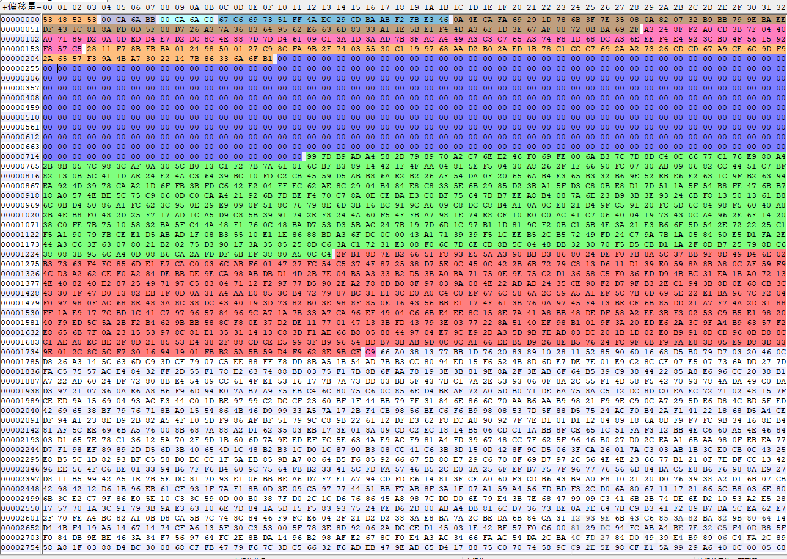](https://xzfile.aliyuncs.com/media/upload/picture/20231123203518-c2893bb6-89fc-1.png)

填充的值为长度为64字节，值为：0000000000000000000030。

[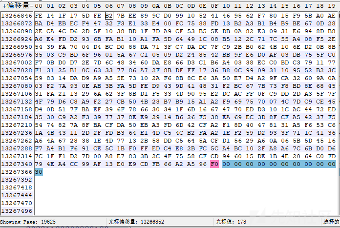](https://xzfile.aliyuncs.com/media/upload/picture/20231123203525-c700c808-89fc-1.png)

整个完整的固件解密过程即如上所示。

1.Encrypt\_Firmware.zip (12.657 MB) [下载附件](https://xzfile.aliyuncs.com/upload/affix/20231123203923-546d3b0e-89fd-1.zip)

2.Unencrypted\_Firmware.zip (12.656 MB) [下载附件](https://xzfile.aliyuncs.com/upload/affix/20231123203940-5eeeb99a-89fd-1.zip)
