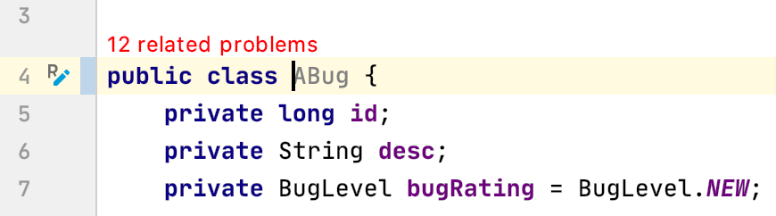
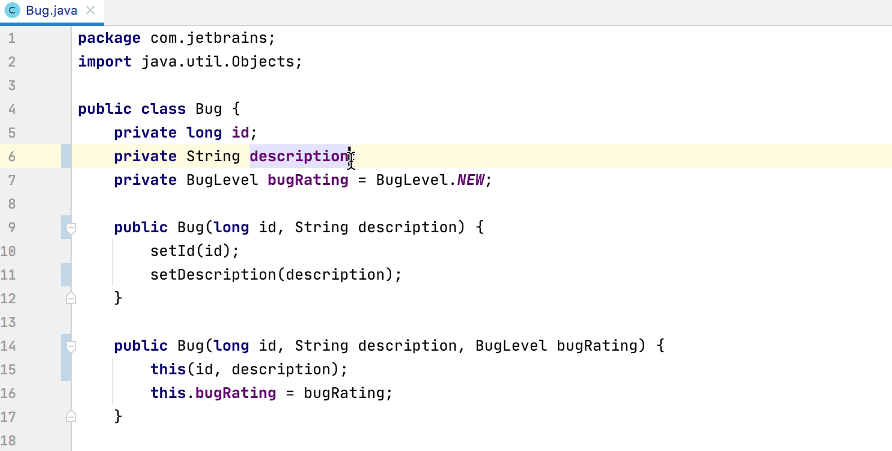
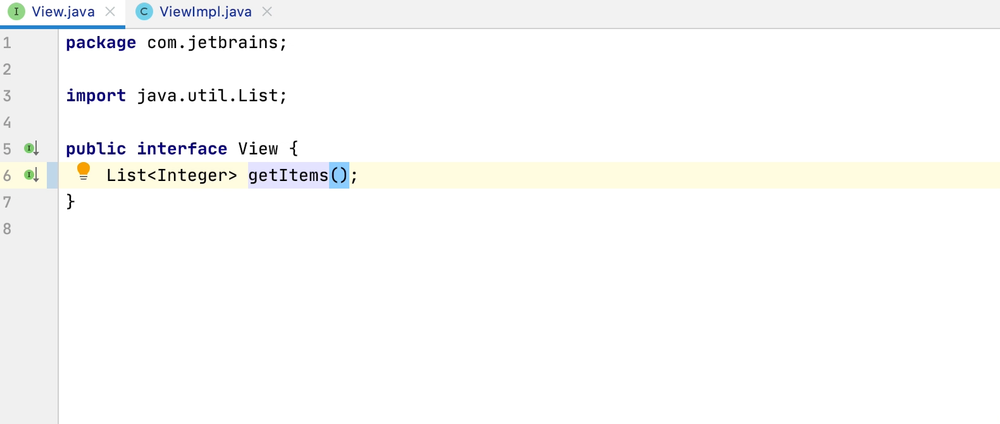
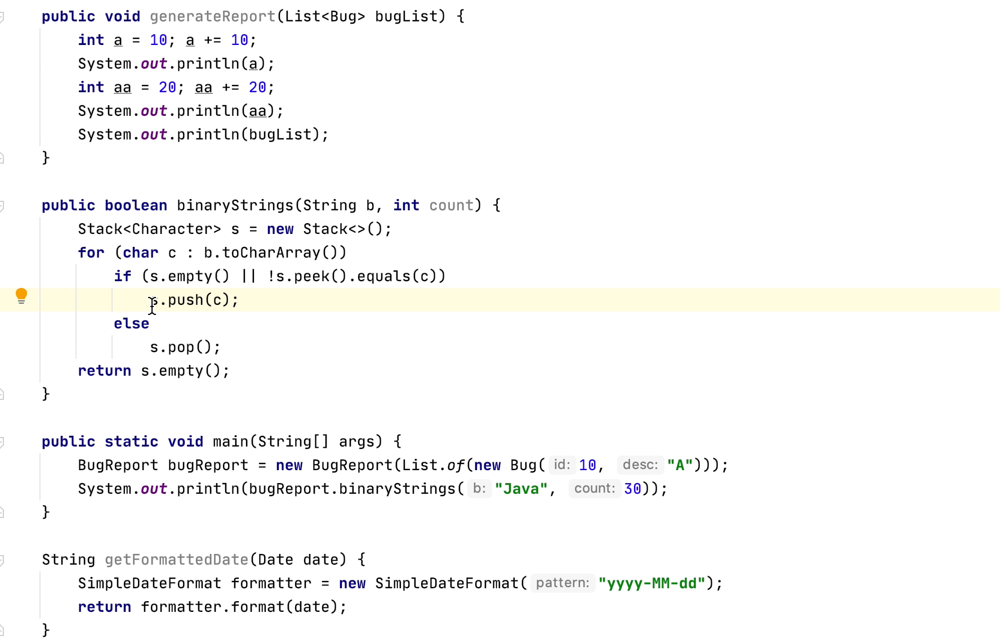
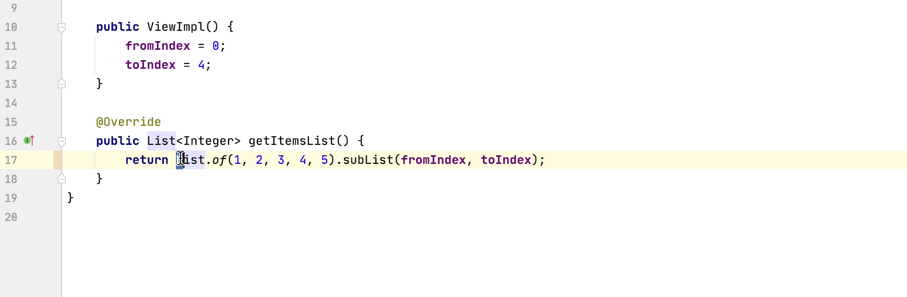
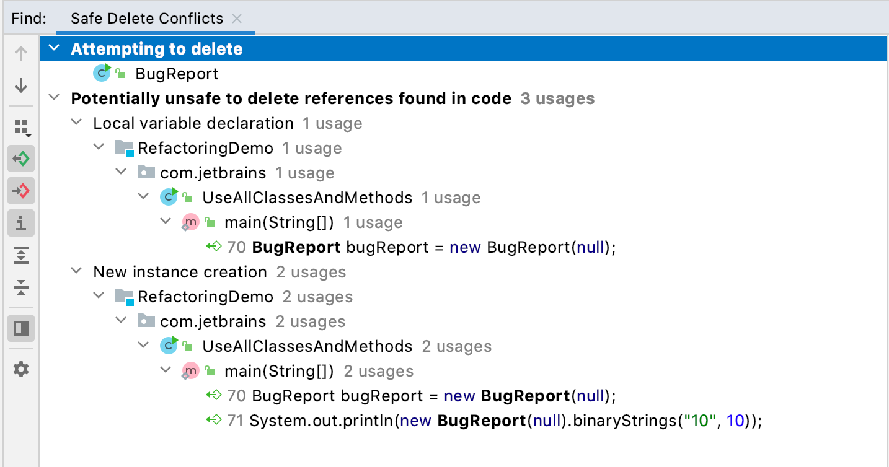

# IntelliJ IDEA 中的日常重构技巧

[Lei](https://blog.jetbrains.com/zh-hans/author/lei-zhaojetbrains-com)

2020年9月23日

Read this post in other languages:

-   [English](https://blog.jetbrains.com/idea/2020/09/everyday-refactorings-in-intellij-idea/)
,-   [日本語](https://blog.jetbrains.com/ja/idea/2020/09/everyday-refactorings-in-intellij-idea-ja/)
,-   [한국어](https://blog.jetbrains.com/ko/idea/2020/09/everyday-refactorings-in-intellij-idea/)

我们经常会出于很多原因更改工作代码，比如修复错误、提高可读性、增加新功能等。 本篇博客讲述日常重构。

本篇博文与视频涵盖相同的材料。 对于喜欢阅读文章而不喜欢观看视频的读者，可以通过本文快速浏览内容。读者/观看者都可以获得代码示例和指向其他信息的链接。  
可以在[此处](https://github.com/malagupta/RefactoringDemo)获得本篇博文所用的代码。

## 重命名元素

直接在类文件中手动重命名并不安全。 例如，如果我们在编辑器中将 [Bug 类](https://github.com/malagupta/RefactoringDemo/blob/master/out/production/RefactoringDemo/com/jetbrains/Bug.class)重命名为 ABug，可能会错过更新使用它的所有其他代码。 从 [IntelliJ IDEA 2020.2 开始，您会在编辑器中看到“相关问题”](https://blog.jetbrains.com/idea/2020/06/intellij-idea-2020-2-eap-5-java-15-related-problems-intentions-preview-and-more/)的错误消息。

  
[就地重命名重构](https://www.jetbrains.com/help/idea/rename-refactorings.html#inplace_rename)在间距中高亮显示。 点击间距中的 R 图标，我们可以[预览](https://www.jetbrains.com/help/idea/refactoring-source-code.html#refactoring_preview) Bug 到 ABug 所有用法的重命名。

IntelliJ IDEA 还可以查找名称相似的变量，让我们选择要更新的变量。  
另外，在编辑器中更改类名称时，我们可以使用快捷键 ⌥⏎ 或 **Alt+Enter** 重复这些步骤。

您也可以在 macOS 上使用 ⇧F6，或在 Windows/Linux 上使用 Shift+F6 来调用重命名重构，IntelliJ IDEA 将为您的类、方法和变量[建议替代名称](https://www.jetbrains.com/help/idea/rename-refactorings.html)。 如果选择新的名称，IntelliJ IDEA 会安全地完成重构。

public class Bug {

private long id;

private String description;

public Bug(long id, String description) {

this.id = id;

this.description = description;

}

public long getId() {

return id;

}

public String getDescription() {

return description;

}

}

例如，如果我们将字段 `description` 重命名为 `desc`，IntelliJ IDEA 会检测此字段是否用于 `getter` 和 `setter` 方法，并询问我们是否更新。 它还会更新该字段在方法参数名称中的用法。

GIF

让我们使用一个名为 `View` 的接口，它定义了一个方法 `getItems`。 我们可以在 macOS 上使用 **⌘B**，或者在 Windows/Linux 上使用 **Ctrl+B** 来[导航到它的用法](https://www.jetbrains.com/help/idea/find-highlight-usages.html)。 此接口由类 `ViewImpl` 实现。

在名为 `View` 的接口中，在 macOS 上使用 **⇧F6** 或在 Windows/Linux 上使用 **Shift+F6**，将方法 `getItems` 重命名为 `getItemsList`。 当我们按 Enter 时，它的实现会在 `ViewImpl` 类中更新。

GIF

您还可以访问项目窗口，并在 macOS 上使用 **⇧F6** 或在 Windows/Linux 上使用 **Shift+F6** 在文件名上[更改](https://www.jetbrains.com/help/idea/rename-refactorings.html)类、包、文件或目录的名称。

## 更改签名

来看看如何安全地[更改类或方法](https://www.jetbrains.com/help/idea/change-signature.html)的签名。 我们在 `BugReport` 中的方法 `binaryStrings` 接受一个 String 参数：

public boolean binaryStrings(String b) {

Stack<Character\> s = new Stack<>();

for (char c : b.toCharArray())

if (s.empty() || !s.peek().equals(c))

s.push(c);

else

s.pop();

return s.empty();

}

我们可以在方法 `binaryStrings` 中添加一个参数，例如，一个 int 类型的计数器。 同样，这也是一种就地重构，并将在间距区域中使用 R 图标高亮显示。 我们可以点击间距中的图标，更新方法签名，向参数添加默认值，以便让方法的任何调用者都使用默认值。

GIF

我们也可以在 macOS 上使用**⌥⏎** 或在 Windows/Linux 上使用 **Alt+Enter** 更新方法签名并添加默认参数值。

我们也可以在 macOS 上使用 **⌘F6** 或在 Windows/Linux 上使用 **Ctrl+F6** 调用 Change Signature [对话框更改](https://www.jetbrains.com/help/idea/change-signature.html)法签名。 让我们添加一个布尔参数 state，默认值为 "true"。 我们也可以使用此对话框更改参数顺序。 它还可以选择通过重载进行委托。 重构后，方法将被重载。

GIF

public class MyMap {

int count = 0;

public int getCount() {

return count;

}

public void setCount(int Count) {

this.count = count;

}

public static void main(String\[\] args) {

MyMap myMap = new MyMap();

System.out.println(myMap.getCount());

}

}

我们可以使用这个 `MyMap` 类查看更改类签名对它的影响。 我们可以在 macOS 上使用 **⌘F6**，或者在 Windows/Linux 上使用 **Ctrl+F6** 来修改类签名。 我们向其添加两个通用参数：一个名为 `K`，默认值 `Integer`；一个名为 `V`，默认值 `String`。 重构类后，`MyMap` 的用法将改变。

GIF

## 提取方法

[Extract Method 重构](https://www.jetbrains.com/help/idea/extract-method.html)可以使您的方法更短、更易读。

public boolean binaryStrings(String b) {

Stack<Character\> s = new Stack<>();

for (char c : b.toCharArray())

if (s.empty() || !s.peek().equals(c))

s.push(c);

else

s.pop();

return s.empty();

}

让我们在 `binaryStrings` 方法中选择可以分组的代码。 我们可以在 macOS 上使用快捷键 **⌥⌘M**，或者在 Windows/Linux 上使用 **Ctrl+Alt+M** 将这段代码提取到另一方法。  
本块所用局部变量或方法参数将作为参数传递。 输入方法名称后，例如 manipulateStack，我们提取的代码块就会被替换成方法的调用。

GIF

您也可以通过以下方式提取方法：选择代码，在 macOS 上使用 **⌥⏎** 或者在 Windows/Linux 上使用 **Alt+Enter**，然后选择 Extract Method。

## 内联方法

[内联方法重构](https://www.jetbrains.com/help/idea/inline-method.html) 是 Extract Method 重构的逆转。 我们可以在 macOS 上使用快捷键 **⌥⌘N** ，或者在 Windows/Linux 上使用 **Ctrl+Alt+N** 来内联刚刚创建的方法 `manipulateStack`。 我们可以内联方法内容然后删除方法，也可以保留方法。 在此示例中，我们删除了方法。

GIF

但为什么要内联方法呢？ 比如，我们可以用它来移除不必要的重定向，或者我们也可能想要内联严重重构的方法，然后再次提取。

## 引入常量

在代码库中，通常建议使用常量而不是文字值，那么我们来看看如何重构代码以[引入常量](https://www.jetbrains.com/help/idea/extract-constant.html)。

public static boolean beautifulBinaryStrings(String s) {

while (!s.equals(s = s.replaceAll("AA|BB", ""))) {

System.out.println(s);

}

return s.isEmpty();

}

我们的方法 `beautifulBinaryStrings` 使用字符串文字值。 我们可以在 macOS 上使用快捷键 **⌥⌘C**，或者在 Windows/Linux 上使用 **Ctrl+Alt+C** 将这个值提取到常量。

IntelliJ IDEA 根据文字值建议常量名称。 我们将选择第一个建议。 根据需要，您也可以选择将这个常量移到其他类中。

GIF

## 引入字段

您可以通过此重构[引入或提取](https://www.jetbrains.com/help/idea/extract-field.html#extract_field_example)字段并将其初始化。  
我们的 `ViewImpl` 类中的方法 `getItemsList` 使用常量 0 和 4 来获取一个列表的子集。

public class ViewImpl implements View {

@Override

public List<Integer\> getItemsList() {

return List.of(1, 2, 3, 4, 5).subList(0,4);

}

}

除了将其定义为常量，您还可以在 macOS 上使用 **⌥⌘F**，或者在 Windows/Linux 上使用 **Ctrl+Alt+F** 来引入字段存储这些值，以便它们在不同实例中拥有不同值。

GIF

## 提取参数

通过 [Extract Parameter 重构](https://www.jetbrains.com/help/idea/extract-parameter.html)，您可以在方法中选择一个常量或表达式，并将其定义为参数传递给方法。 在本示例中，我们还为 `getItemsList` 方法引入了第二个字段，名为 `toIndex`。

public class ViewImpl implements View {

private final int fromIndex;

private final int toIndex;

public ViewImpl() {

fromIndex = 0;

toIndex = 4;

}

public List<Integer\> getItemsList() {

return List.of(1, 2, 3, 4, 5).subList(fromIndex, toIndex);

}

}

在 `getItemsList` 方法中，您可以将表达式 `List.of(1,2,3,4,5)` 作为参数传递给此方法。 方法参数的类型与所选表达式的类型相同。

GIF

您也可以选中 Delegate via method overloading 复选框，以保留原始方法并允许引入第二个方法。 这意味着任何一个方法都可以根据调用者来使用。

GIF

Extract parameter 可以帮助您将表达式移到最合理的位置，使方法或方法调用更易读。 使用易于理解的参数名称也有助于提高可读性。

## 引入变量

我们也可以根据需要[提取变量](https://www.jetbrains.com/help/idea/extract-variable.html)。 有时，我们可以将表达式移到一个适当命名的变量中，使代码更易读。

public ContextActionsWithAltEnter(double cityPopulation) {

if (cityPopulation \> 0x1.2016eb678a2p43 && cityPopulation < 987677.8) {

if (cityPopulation % 5 == 0) {

this.cityPopulation /= 2;

}

}

this.cityPopulation = cityPopulation;

}

`ContextActionsWithAltEnter` 构造函数中的 `if` 语句看起来有些复杂。 我们可以选择表达式，在 macOS 上使用 **⌥⌘V**，或者在 Windows/Linux 上使用 **Ctrl+Alt+V**。 确保给它起一个有用的名字，如 `lowerLimit`。 我们也可以将第二个条件提取到一个变量中，并将其命名为 `upperLimit`。 根据需要，您可以选择将提取的变量定义为 `final`，如果使用的是 Java 10 或更高版本，可以定义为 `var`。

GIF

表达式现在看起来显然更易读了。

## 安全删除

如果您不想再在项目中使用某个文件或符号，您应该把它[安全删除](https://www.jetbrains.com/help/idea/safe-delete.html)。

选择要删除的文件或类，然后使用 **⌘⌦**，或者在 Windows/Linux 上使用 **Alt+Delete**。 IntelliJ IDEA 在确保资源可被安全删除之后才会将其删除。

## 小结

IntelliJ IDEA 具有强大的重构功能，您日常可以安全地用它来改进代码。  
不过，重构并不是灵丹妙药。 请建立一个测试的安全网，确保您的重构不会改变代码行为。

还有更多内容：  
[IntelliJ IDEA 中支持的最热门重构](https://www.jetbrains.com/help/idea/refactoring-source-code.html#1078e)  
[重构：在 IntelliJ IDEA 中内联方法](https://blog.jetbrains.com/idea/2019/07/refactoring-inline-method-in-intellij-idea/)  
[重构：在 IntelliJ IDEA 中提取变量](https://blog.jetbrains.com/idea/2019/04/refactoring-extract-variable-in-intellij-idea/)

-   Share
-   [*Facebook*](https://www.facebook.com/sharer.php?u=https%3A%2F%2Fblog.jetbrains.com%2Fzh-hans%2Fidea%2F2020%2F09%2Fintellij-idea%2F?facebook_zh_CN)
-   [Twitter](https://twitter.com/intent/tweet?source=https%3A%2F%2Fblog.jetbrains.com%2Fzh-hans%2Fidea%2F2020%2F09%2Fintellij-idea%2F&text=https%3A%2F%2Fblog.jetbrains.com%2Fzh-hans%2Fidea%2F2020%2F09%2Fintellij-idea%2F&via=intellijidea?twitter_zh_CN)
-   [*Linkedin*](http://www.linkedin.com/shareArticle?mini=true&url=https%3A%2F%2Fblog.jetbrains.com%2Fzh-hans%2Fidea%2F2020%2F09%2Fintellij-idea%2F?linkedin_zh_CN)

[*Prev post* 我们正在招聘! 面向中国市场的本地化 QA 工程师](https://blog.jetbrains.com/zh-hans/idea/2020/09/qa/)[图解 Java 的 2020 *Next post*](https://blog.jetbrains.com/zh-hans/idea/2020/10/java-2020/)

#### Subscribe to Blog updates

  

Subscribe form 

 By submitting this form, I agree to the JetBrains [Privacy Policy *Notification icon*](https://www.jetbrains.com/company/privacy.html)

Submit

