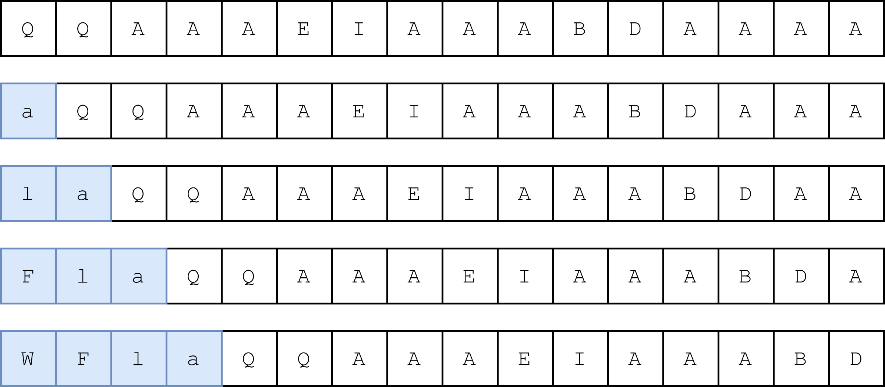

# Introducing wrapwrap: using PHP filters to wrap a file with a prefix and suffix


# Abstract

`wrapwrap` marks another improvement to the PHP filter exploitation saga. Adding arbitrary prefixes to resources using `php://filter` is nice, but you can now **add an arbitrary suffix** as well, allowing you to wrap PHP resources into any structure. This beats code like:

```plain
$data = file_get_contents($_POST['url']);
$data = json_decode($data);
echo $data->message;
```

or:

```plain
$config = parse_ini_file($_POST['config']);

echo $config["config_value"];
```

`wrapwrap` is available on our [GitHub repository](https://github.com/ambionics/wrapwrap).

# Introduction

A few months ago, we encountered a Wordpress plugin that read an arbitrary file and parsed its XML to extract a value. The code looked like this:

```plain
# Load an arbitrary resource
$xml = file_get_contents($_POST['url']);

# Parse the XML into the $tags structure
$parser = xml_parser_create();
xml_parser_set_option($parser, XML_OPTION_CASE_FOLDING, false); # Case-sensitivity ON
xml_parse_into_struct($parser, $xml, $tags, $index);
xml_parser_free($parser);

# Extract the value of the <name> tag
foreach($tags as $tag) {
    if($tag['tag'] == 'name') {
        $product_name = $tag['value'];
        break;
    }
}

# Display product name
if(isset($product_name)) {
    echo "Product name: " . htmlentities($product_name);
}
```

If `url` pointed to a file that contained `<product><name>PRODUCT123</name><price>123</price></product>`, the page displayed: `Product name: PRODUCT123`.

By providing an HTTP URL, like `http://localhost/something`, we could reach an internal service, but we wouldn't be able to see the HTTP response, because the code would parse it as XML, and only display the value of the `<name>` tag. This also prevented us from reading local files, or any PHP resource. A standard solution was to use XXE, but external entities were disabled.

We *seemed* to be stuck with a blind SSRF.

There was however an additional bug: the return code of [the `xml_parse_into_struct()` function](https://www.php.net/manual/fr/function.xml-parse-into-struct.php) was not checked. Therefore, if we submitted a file like `<product><name>PRODUCT123`, we would still get `Product name: PRODUCT123`, because the function fills the `$tags` array as it parses the XML, and does not clear it if an error happens.

This oversight was actually enough to transform the SSRF into an in-band (*i.e.* non-blind) one using PHP filters. Indeed, in 2022, [@remsio released a tool to generate arbitrary file from void](https://www.synacktiv.com/en/publications/php-filters-chain-what-is-it-and-how-to-use-it), based on charset conversions.

*If you are unfamiliar with the technique, we'll briefly cover it right after. Additionally, his [blogpost](https://www.synacktiv.com/en/publications/php-filters-chain-what-is-it-and-how-to-use-it) and the [CTF writeup that inspired the tool, from loknop](https://gist.github.com/loknop/b27422d355ea1fd0d90d6dbc1e278d4d) are both excellent resources.*

The technique works by incrementally **adding base64 characters** to a pre-existing content by playing with charset conversions, and then B64-decoding it to obtain arbitrary contents. It is generally used to generate a webshell, but in our case it has another use: we can make the tool append the `<product><name>` prefix to any resource, and get the Wordpress plugin to display file contents!

After a few tweaks on the original script, we had it working:

```plain
$ ./php_filter_chain_generator.py --chain '<product><name>' --file='/etc/passwd'
[+] The following gadget chain will generate the following code : <product><name> (base64 value: PHByb2R1Y3Q+PG5hbWU+)
php://filter/convert.base64-encode|...|convert.iconv.UTF8.UTF7|convert.iconv.UTF8.UTF16|convert.iconv.WINDOWS-1258.UTF32LE|convert.iconv.ISIRI3342.ISO-IR-157|convert.base64-decode|...|/resource=/etc/passwd
```

Which gives:

```plain
php> echo file_get_contents('php://filter/convert.base64-encode|...|convert.iconv.UTF8.UTF7|convert.iconv.UTF8.UTF16|convert.iconv.WINDOWS-1258.UTF32LE|convert.iconv.ISIRI3342.ISO-IR-157|convert.base64-decode|...|/resource=/etc/passwd');
<product><name>cm9vdDp4OjA6MDpyb290Oi9... # b64 of /etc/passwd
```

We could now load any resource and make the PHP script display it!

This however begged the question: what would have happened if the developer checked for the return code of [the `xml_parse_into_struct()` function](https://www.php.net/manual/fr/function.xml-parse-into-struct.php)? In other words, what if we needed to provide **valid XML**? Or, what if the code used `json_decode()` instead?

Well, turns out you can actually use an oracle, which makes use of the limited PHP memory, to dump the file character by character. Check this [CTF solution](https://github.com/DownUnderCTF/Challenges_2022_Public/blob/main/web/minimal-php/solve/solution.py), or remsio's tool [here](https://github.com/synacktiv/php_filter_chains_oracle_exploit). This approach has, however, **downsides**: it is slow, does not allow you to dump big files, and is very hard on the server, as it'll try to allocate huge memory regions before erroring out, on each test.

Unsatisfied with the current state of the art, we started working on a solution: a way to add, in addition to an **arbitrary prefix**, an **arbitrary suffix** to any resource. This yielded a new tool, [wrapwrap](https://github.com/lexfo/wrapwrap), available on our Github.


```plain
php> echo file_get_contents('php://filter/.../resource=/etc/passwd');
<product><name>root:x:0:0:root:/root:/bin/bash=0Adaemon...</name></product>
```

# Building wrapwrap

In this section, we'll describe the various approaches used to find the primitives that allowed to build the tool. For the sake of simplicity, we will refer to the contents of the resource provided to the filter chain (*i.e.* the value returned by the `resource` in `php://filter/.../resource=`) as the *file contents*, although the resource can be anything (`http://`, `ftp://`, *etc.*). Additionally, we'll refer to the base64 of such file contents as the *original base64*.

## Adding a prefix

Let's first understand the previous state of research, that is how you can add an arbitrary prefix to a resource using a filter chain. The idea is to work on the *original base64*, add a few chars, and then base64-decode it to have an arbitrary prefix in addition to the original *file contents*.

@loknop [explained it very well in his gist](https://gist.github.com/loknop/b27422d355ea1fd0d90d6dbc1e278d4d):


For instance, `convert.iconv.863.UTF-16|convert.iconv.ISO6937.UTF16LE|convert.base64-decode|convert.base64-encode` will add a `K` to your B64:

```plain
php> echo file_get_contents('php://filter/convert.base64-encode/resource=/etc/passwd');
cm9vdDp4OjA6MDpyb290Oi9yb290Oi9iaW4vYm...
php> echo file_get_contents('php://filter/convert.base64-encode|convert.iconv.863.UTF-16|convert.iconv.ISO6937.UTF16LE|convert.base64-decode|convert.base64-encode/resource=/etc/passwd');
Kcm9vdDp4OjA6MDpyb290Oi9yb290Oi9iaW4vYm...
```

Now, how do you compute filter chain that yields a `K`, or any other base64 digit? @loknop (and later @remsio) used a combination of bruteforce and manual testing to do so, which apparently took days.

We'll call the filter chains that generate a base64 digit a *digit-chain*. Here are a few *digit-chains*:

```plain
C: convert.iconv.UTF8.CSISO2022KR|convert.base64-decode|convert.base64-encode
C: convert.iconv.L4.UTF32|convert.iconv.CP1250.UCS-2|convert.base64-decode|convert.base64-encode
D: convert.iconv.INIS.UTF16|convert.iconv.CSIBM1133.IBM943|convert.iconv.IBM932.SHIFT_JISX0213|convert.base64-decode|convert.base64-encode
d: convert.iconv.INIS.UTF16|convert.iconv.CSIBM1133.IBM943|convert.iconv.GBK.BIG5|convert.base64-decode|convert.base64-encode
```

Now that this is out of the way, let's focus on adding a **suffix** to some base64.

## Fuzzing to no effect

We could apply the same strategy as for the prefix, and use bruteforce to find PHP filter chains that create suffixes. However, a few hours of fuzzing and thinking showed that it would probably not work. One of the reason is that although some charsets may add prefixes (for instance, `convert.iconv.UTF8.CSISO2022KR` will always prepend `\x1b$)C`), it wouldn't make much sense to add suffixes, as strings are parsed from left to right. Playing with the `=` characters that pad base64 payloads proved ineffective as well.

We therefore dropped fuzzing and went back to a more analytical approach.

## Not so random trimming

When playing with the primitive that allows you to add a prefix, we realized that in some cases, the original string had its last characters removed. For instance, starting from the string `HELLO!`, if we add a prefix that says `HI!`:

```plain
php > echo file_get_contents('php://filter/convert.base64-encode|convert.iconv.UTF8.UTF7|convert.iconv.CSGB2312.UTF-32|convert.iconv.IBM-1161.IBM932|convert.iconv.GB13000.UTF16BE|convert.iconv.864.UTF-32LE|convert.base64-decode|convert.base64-encode|convert.iconv.UTF8.UTF7|convert.iconv.JS.UNICODE|convert.iconv.L4.UCS2|convert.base64-decode|convert.base64-encode|convert.iconv.UTF8.UTF7|convert.iconv.IBM860.UTF16|convert.iconv.ISO-IR-143.ISO2022CNEXT|convert.base64-decode|convert.base64-encode|convert.iconv.UTF8.UTF7|convert.iconv.INIS.UTF16|convert.iconv.CSIBM1133.IBM943|convert.iconv.GBK.SJIS|convert.base64-decode|convert.base64-encode|convert.iconv.UTF8.UTF7|convert.base64-decode|/resource=data:,HELLO!');
HI!HEL
```

Why would this happen ? To understand it, we need a little bit of base64 theory.

Base64 stores **3 bytes** over **4 B64-digits**. Each digit encodes 6 bits of information. Therefore, a single digit is not enough to encode a byte. As a result, when base64-decoding `4n+1` digits, the first `n` quartets each decode to 3 bytes, and the last digit, which cannot encode a whole byte by itself, gets ignored:

```plain
php> echo base64_decode('SEVMTE8h');
HELLO!
php> echo base64_decode('SEVMTE8hX');
HELLO!
```

Now, since each *digit-chain* ends with `convert.base64-decode|convert.base64-encode` (this is a way to remove characters that are not a base64 digit), if the original string has a size which is **divisible by four**, prepending a digit will also remove the last digit of the B64 string.

```plain
php> echo file_get_contents('php://filter/convert.iconv.UTF8.CSISO2022KR|convert.base64-decode|convert.base64-encode/resource=data:,12345678');
C1234567
```

This is what happens in our example: the original payload, `HELLO!`, has a size of 6, so it's base64 is properly aligned (with a size of 8). Each time we add a base64 digit, we remove the last digit of the base64.

This behaviour turned out to be a key element to `wrapwrap`'s algorithm.

## The main idea

Since we cannot generate a suffix, the other option would be to generate a prefix and make it move to the end of the original string. How can we do this?

In the error-based oracle technique, [@hash\_kitten cleverly uses charset conversions](https://github.com/DownUnderCTF/Challenges_2022_Public/blob/main/web/minimal-php/solve/solution.py#L105) to swap characters around. For instance, converting from `UCS-4` to `UCS-4LE` takes quartets of 4 characters and inverts their order (`ABCD` -> `DCBA`).

Using this idea, and with the help of the previous `4n+1` technique, we can build a prefix and have it move from the beginning of the string to its ends. As an example, say that we want to set a suffix which consists of three letters (*i.e.* a *triplet*), `XYZ`.

First, we take some arbitrary file and convert it to base64.

Second, we pad the base64 payload such that its size is a multiple of 3 (It is not hard to convert a payload of any size to a valid size by using techniques which are not described in the article). For the sake of simplicity, we will say that the base64 is `ABC`.


Then, we create 3 NULL bytes in between each character by converting the payload from `ASCII` to `UCS-4`, which is a 4-byte character set.


We base64-encode the payload. Since its size is divisible by 3, the result's size is divisible by 4.


The base64 of `XYZ` is `WFla`. Using digit-chains, we add `a`, `l`, `F`, `W` to the payload. Each time we add such a letter, and because the payload is 4-aligned, the last digit gets removed.



We end up having added 4 digits at the beginning of the payload, and removed 4 at the end.

We then decode:


and finally, swap quartets using the `UCS-4` to `UCS-4LE` conversion:


This isn't much, but we managed to move `XYZ` (albeit in the reverse order) after the first digit, `A`. If we were to base64-decode and encode the result (which removes bytes that are not base64 digits), we'd have: `AZYXBC`. If we keep an eye on the three NULL bytes that start on the right of `A` during each step of the algorithm, we can see that they are now on the right of `B`: they have "moved" forward 4 squares. So if we repeat the algorithm, this time with 3 NULL bytes (`AAAA` in base64):


The `XYZ` part has moved forward again, and the other base64 digits have not moved.

If we push three NULL bytes again, we get:


The `YXZ` string has moved forward 3 times, passing `A`, `B` and `C`, and, without altering the order of the other digits. By repeating this operation as many times as we need, we can **push** the `XYZ` value **to the end of the payload**.

We can finally simply base64-decode, then base64-encode, to get rid of NULL bytes:


And we get what we wanted: `ABCZXY`.

In this case, we added a `XYZ` triplet, followed by two triplets of NULL bytes. We could have instead pushed `XYZ`, then `UVW`, then a NULL-triplet, and we'd have a final base64 string such as: `ABUVWCZXY`.

Therefore, the algorithm allows us to add **triplets in between each digit of the original base64**.

## Where is the end?

Although we can now "push" a triplet to the end of the original string, we do not know the size of said string. That is, we don't know how much we need to repeat the algorithm before our suffix-to-be reaches the end of the string. Instead of finding a way to compute the size of the string, we chose to make use of another filter, `dechunk`.

This filter [dechunks data](https://en.wikipedia.org/wiki/Chunked_transfer_encoding#Example). For instance:

```plain
5
Hello
7
 there!
0
```

would become:

```plain
Hello there!
```

The interesting fact about this filter is that when it reaches the `<LF>0<LF>`, indicating the end of the chunk data, it silently discards what comes after. As a result, something like:

```plain
c
This is kept
0
This is not
```

is parsed as:

```plain
This is kept
```

So, instead of precisely computing the size of the file we are dumping, we can push a `<LF>0<LF>` triplet along:


Add a proper chunk header at the beginning:


Then call the `dechunk` filter:


And finally, base64-decode then encode to get rid of NULL bytes:


We can now *trim* a resource to an arbitrary size, and add a triplet in between each letter of its contents.

## Real suffix control: removing digits

In the current state of affairs, we can only insert triplets of arbitrary bytes in between each base64 character. Therefore, if the original base64 is `ABCDEF`, we can only insert 3 bytes in between `A` and `B`, 3 between between `B` and `C`, *etc.* We could get `ABCDXXXEYYYFZZZ`, but not `ABCDEFXXXYYYZZZ`. We don't control more than 3 consecutive bytes.

This is annoying. Going back to our very first example, we'd like our suffix to be `</name></product>`, which clearly cannot be encoded via 3 base64 digits.

A bad solution would be to add a triplet, push it to the end, and then do the entire algorithm again for another triplet, and then again for another one, *etc.* This would work, but would be extremely costly in terms of both **size** (the filter chains can become huge) and **time** (PHP takes a few seconds to process big filter chains).

This is thus not acceptable, especially since we are already able to add several triplets in one iteration of the algorithm, only separated by one digit every time...

To see how we can solve this problem, let's go back to theory again. In a *D1D2D3D4* quartet of B64-digits, each digit *Di* encodes *6* bits. By decoding, we get *4x6=24* bits, thus *3* bytes *B1B2B3*. The last of these 3 bytes, *B3*, is encoded using the two least significant bits of *D3* and the 6 bits of *D4*. As a result, if the 5th bit of *D3* is set to 1, *B3* will have its most significant bit set. It will therefore be out of ASCII range, regardless of the value of *D4*.

Now, say we insert a triplet *T1T2T3* in front of a digit *X*, thus forming a quartet. When this gets decoded, if we set the second to last bit of *T3* to *1*, we know that the last byte of the decoded value will be out of ASCII range, whatever *X* may be.

Therefore, if we base64-encode the original contents twice, we can then remove characters from the original base64 by making them decode to non-ASCII characters.

As an example, say a file contains `HELLO!`. The base64 of this is `SEVMTE8h`, and its base64 is `U0VWTVRFOGgK`.

The first two quartets look like:


If we insert a triplet *T1T2T3* in front of the 5th letter *T*, and another *U1U2U3* in front of the 6th letter *V*, we get:


As we can see, the decoded part for the first quartet does not change (`U0VW` decodes to `SEV`), but then the next quatuor decodes into two bytes of our choosing (encoded with *T1*, *T2*, and the first *4* bytes of *T3*), and a third byte which is not ASCII (because the two least significant bits of *T3* are set). The information that was contained into `T` is "discarded". Same happens with *U1U2U3* and `V`.

Therefore, each triplet inserted in the second base64 allows us to **encode 2 digits** and **get rid of 1 digit** of the first base64, solving our problem. As an example, say we want to suffix `SEV` by `ABCD`. The first triplet encodes `AB` using `QUL`. The second encodes `CD` as `Q0T`.


We get: `U0VWQULTQ0TV`, which decodes to `SEVAB�CD�`. If we base64-decode and encode, we get `SEVABCD`.

We can now **add a suffix of arbitrary size**!

# Using wrapwrap

Say you have code like so:

```plain
$data = file_get_contents($_POST['url']);
$data = json_decode($data);
echo $data->message;
```

To obtain the contents of some file, we'd like to have: `{"message":"<file contents>"}`. This can be done using:

```plain
$ ./wrapwrap.py /etc/passwd '{"message":"' '"}' 1000
[*] Dumping 1008 bytes from /etc/passwd.
[+] Wrote filter chain to chain.txt (size=705031).
```

This yields:

```plain
{"message":"root:x:0:0:root:/root:/bin/bash=0Adaemon:..."}
```

# Conclusion

This is another improvement on the PHP filter attacks: we can now add a prefix **and a suffix** to any resource. Beware of the size of your payload, however: it gets pretty big, pretty fast. Dumping *3300* bytes from a file require a payload of 2 megabytes. Luckily, it should not be too much of a problem if the controlled URL is sent through POST.

We deliberately left lots of details and optimisations out of the blog post to keep it concise. Don't hesitate to read the code of *wrapwrap* if you want to know how it really works, and help improve it.

The [GitHub repository is here](https://github.com/ambionics/wrapwrap).

# We're hiring!

Ambionics is an entity of [Lexfo](https://www.lexfo.fr/), and we're hiring! To learn more about job opportunities, do not hesitate to contact us at [rh@lexfo.fr](mailto:rh@lexfo.fr). *We're a french-speaking company, so we expect candidates to be fluent in our beautiful language.*
